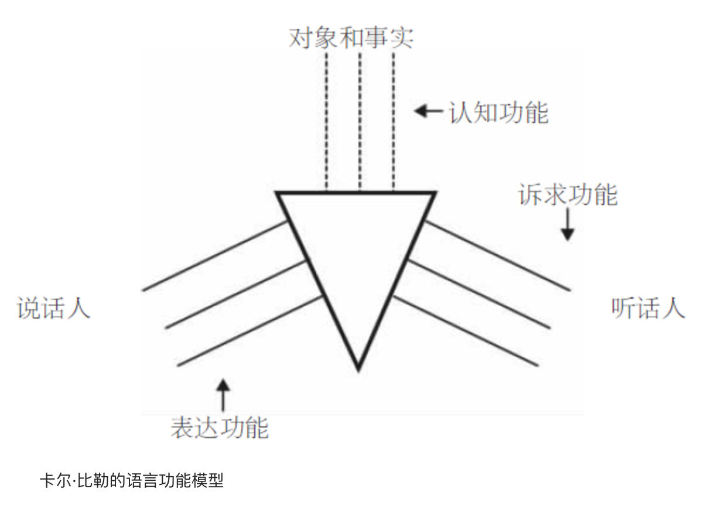

    作者: 芬利森 
    出版社: 译林出版社
    原作名: Habermas
    译者: 邵志军 
    出版年: 2010-1
    页数: 151
    定价: 18.00元
    丛书: 牛津通识读本
    ISBN: 9787544711159

[豆瓣链接](https://book.douban.com/subject/4313495/)

- [第一章 哈贝马斯和法兰克福学派的批判理论](#第一章-哈贝马斯和法兰克福学派的批判理论)
  - [法兰克福学派](#法兰克福学派)
  - [哈贝马斯的最初回应](#哈贝马斯的最初回应)
  - [资产阶级公共领域概念](#资产阶级公共领域概念)
  - [作为理念和意识形态的公共领域](#作为理念和意识形态的公共领域)
  - [公共领域的衰落](#公共领域的衰落)
  - [哈贝马斯的批判理论观念](#哈贝马斯的批判理论观念)
- [第二章 哈贝马斯研究社会理论的新方法](#第二章-哈贝马斯研究社会理论的新方法)
  - [哈贝马斯早期作品](#哈贝马斯早期作品)
  - [社会理论的三个问题](#社会理论的三个问题)
    - [1.社会科学中意义理解的问题](#1社会科学中意义理解的问题)
    - [2.非理性与意识形态批判的问题](#2非理性与意识形态批判的问题)
    - [3.社会秩序的问题](#3社会秩序的问题)
- [第三章 语用意义专题](#第三章-语用意义专题)
  - [语言学转向和意识哲学的终结](#语言学转向和意识哲学的终结)
  - [哈贝马斯的语用学意义理论](#哈贝马斯的语用学意义理论)
    - [命题意义](#命题意义)
    - [语用意义](#语用意义)
    - [共识与协定](#共识与协定)
    - [理解与意义](#理解与意义)
    - [异议](#异议)
  - [交往和商谈](#交往和商谈)
  - [商谈的规则](#商谈的规则)
    - [有效性、真实性、正当性概览](#有效性真实性正当性概览)
- [第四章 社会理论专题](#第四章-社会理论专题)
  - [概念之争](#概念之争)
  - [社会本体论](#社会本体论)
  - [生活世界](#生活世界)
  - [系统](#系统)
  - [生活世界和系统的一些区别](#生活世界和系统的一些区别)
  - [生活世界的殖民化](#生活世界的殖民化)
  - [生活世界殖民化导致的病理](#生活世界殖民化导致的病理)
  - [哈贝马斯的社会理论是批判理论么？](#哈贝马斯的社会理论是批判理论么)
- [第五章 哈贝马斯的现代性理论](#第五章-哈贝马斯的现代性理论)

# 第一章 哈贝马斯和法兰克福学派的批判理论
## 法兰克福学派
二战之前和之后的一段时间，一群哲学家、社会学家、社会心理学家、文化批评家，在法兰克福由私人资助的社会研究院进行研究工作，这就是`法兰克福“学派”`的由来。

他们遵从共同的学术范式：他们作同样的理论假设，提出类似的问题，都受到黑格尔（1770—1831）和卡尔·马克思（1818—1883）辨证哲学的影响。法兰克福学派学者所追随的当代德国辨证哲学的传统，有时又被称为黑格尔-马克思主义，在当时它远不是社会思潮的主流。作为知识分子中的少数派，他们同当时占支配地位的新康德主义欧洲传统和逻辑经验主义盎格鲁-奥地利传统针锋相对。

好莱坞制作的低成本商业电影，往往以俗套的大团圆结局为大众提供廉价的满足感。观看这样的电影，大众对阻碍他们追求真正幸福的社会制度不再批判，而是融入银幕偶像的虚构幸福。这样，文化便无意中充当了真实世界的广告。霍克海默和比他年轻的同事西奥多·W.阿多诺（1903—1969），称这类现象为`“文化工业”`。

文化工业是资本主义社会发展整体倾向的一个关键部分，这种倾向将创造、改变人们的需要与欲望，直至使他们真正欲求批量制造的垃圾，不再追求有价值的生活。分析这样的现象可以帮助我们理解，广告和其他形式的媒介如何操控主体的意识，制造出法兰克福学派所称的`“虚假的和谐状态”`。

阿多诺和霍克海默对启蒙的分析，为批判理论的后续发展确立了日程表。他们的理论始于黑格尔的假设（马克思也同意）：人类以精神和物质活动（或者如马克思所言，通过脑力或体力劳动）塑造或决定了他们身边的世界。然后他们加上了一条历史命题：到18世纪，`工具理性`，即对于完成既定目标或满足既定欲望的最有效方法的思考，已经成为主要的知识形式。启蒙的历史进程，赋予了自然科学和技术上可用的认知形式比其他知识形式更高的地位。阿多诺和霍克海默声称，自然科学对外部世界作出了可验证的归纳和预言，它是手段/目的推理的一种隐蔽形式。从人类学的角度来讲，科学不过是深化人类掌握和控制环境的根本需要的一种工具。技术和工业就是这种工具的延伸和应用。

阿多诺和霍克海默宣称，工业化和官僚化的现代世界形成于一种合理化进程中。20世纪的社会是人类活动的结果，而人类的理性能力已经退化，变成仅仅是对如何以最有效方式达成既定目标的一种计算。世界的日益数学化和客观化，造成了神话世界观和宗教世界观的终结。同时，人类赖以认识世界的概念又来自于特定的历史和社会环境。阿多诺和霍克海默认为，制度化的生活愈加受到科学和技术，即工具理性的形塑。社会性的各种现代形式（工具理性的制度化形式），依次引发了工具性概念、表现形式以及思考世界的方式：它们造成了一种科学的、计算的、实用的思想倾向。继之而来的便是工具理性地位的恶性螺旋式上升，它逐渐取得了独一无二的排他性地位。

正如阿多诺和霍克海默在《启蒙辩证法》一书序言中所承认的，启蒙既是必要的，又是不可能实现的。之所以必要，是因为若没有启蒙，人类就会继续滑向自我毁灭与不自由；之所以不可能实现，是因为启蒙的实现有赖于人类的理性活动，而理性又恰恰是问题之所在。

## 哈贝马斯的最初回应
哈贝马斯的第一部主要作品——《公共领域的结构转型：论资产阶级社会的一个范畴》（1962），是对霍克海默和阿多诺的批判理论概念作出的建设性批判。

《结构转型》是对`“公共领域”`范畴的一次内在的批判。“公共领域”一词翻译自德语öffentlichkeit，包括了公共性、透明性和开放性等意思。在哈贝马斯看来，历史上启蒙运动的理想——自由、团结、平等——是公共领域这一概念的题中应有之义，这些理想为内在的批判提供了标准。比如，18、19世纪的的题中应有之义，这些理想为内在的批判提供了标准。

## 资产阶级公共领域概念
18世纪初，公民权的确立保证了个人享有结社和言论的自由，出版自由的确立又促进了咖啡馆、沙龙这样的有形空间和可供市民自由参与公共讨论的文学杂志的形成。在这样的论坛中，人们可以自愿集会，作为平等的人参与公共论辩。这些论坛享有两种意义上的自主权：首先人们是自愿参与论坛的讨论，相对不受社会经济和政治体制的影响。`公共领域`的成员通过交换和契约完成经济上的交易，不光是为了追求个人利益。公共领域存在于自愿的结社之中，作为个人的公民统一在一个共同目标之下，利用他们自己的理性展开不受束缚的、平等主体之间的讨论。很快，共享的文化氛围得以形成，与其他因素一起，使公共讨论的参与者得以发现自己的需求和利益并加以表达，并使他们形成共同善的概念。哈贝马斯认为，公共舆论的标准概念是围绕着共同善的概念形成的，共同善的概念正是在这些脆弱但又受到庇护的公共商谈论坛中确立的。

公共领域是一个非正式社会领域，它介于资产阶级市民社会与国家或政府之间。

## 作为理念和意识形态的公共领域
阿多诺把`意识形态`定义为“必要的社会幻觉”或“必要的错误社会意识”，年轻的哈贝马斯持有与此类似的理解。意识形态又不是普通的错误信仰，比如将杯子里的咖啡误认为是茶。意识形态是被广泛视为正确的错误信仰，因为事实上所有社会成员都在某种程度上被诱导着去相信。此外，意识形态是功能性错误信仰，部分地由于被广泛接受，意识形态可以支撑某些社会机制、支持其维护的支配关系。正是在这个意义上，意识形态具有社会必要性。

哈贝马斯认为，`公共领域`这一概念既是一个理念也是一种意识形态。公共领域是供平等的主体参与理性讨论以求得真理和共同善的空间。作为理念，开放、包容、平等和自由都无可指摘。然而事实上，这些理念不过是意识形态或者说幻觉罢了。因为现实中，能够在18世纪欧洲的咖啡馆、沙龙和文学杂志等公共领域参与讨论的人，总是限于少数拥有财产、受过教育的男性。

## 公共领域的衰落
《结构转型》的第二部分描述了公共领域的瓦解和衰落：随着报纸和杂志逐渐获得巨大发行量，它们被服务于少数强势个人之私利的资本主义大公司所吞并。在失去批判功能的同时，公众舆论也逐渐失去了其双重的自主性。到了19世纪和20世纪，公共领域于是不再是孕育理性观念和可靠信仰的温床，而是蜕变成操纵、支配民意的舞台。作为大众传媒的报纸、杂志和畅销小说同广播电视一起，变成了消费品：它们不是促进而是开始遏制人类的自由和发展。

在《结构转型》结论部分，哈贝马斯在最后的分析中提出了一个怀着希望的推测，认为现有的内在于政党这类机构的公共领域，仍有可能发挥上述功能。

## 哈贝马斯的批判理论观念
哈贝马斯之所以对公共领域概念感兴趣，是因为他将公共领域视为民主政治理想的母体，视为道德价值观与认知价值观的基础，这些价值观能够培育并维持平等、自由、理性、真理等民主精神。

# 第二章 哈贝马斯研究社会理论的新方法
## 哈贝马斯早期作品
哈贝马斯形成了一个观点，认为不同类型的知识——理论的、实践的、批判的——产生于不同背景，并服务于不同的人类愿望。**理论知识建立在人类用技术控制自然的愿望上，实践的、道德的知识则建立在人类互相理解的意愿上，而社会批判理论和心理分析则是分别建立在集体和个人对于获得解放、摆脱幻觉、拥有自主权和实现美好生活的愿望之上**。

## 社会理论的三个问题
### 1.社会科学中意义理解的问题
社会科学中意义理解的问题就是如何解释人类行为（或者说如何理解人类行为的意义）的问题。

狄尔泰认为，人文学科（或Geisteswissenschaften），比如历史、哲学、法学、文学，是与人文研究有关的学科，它们在方法论上与自然科学并不相同。人文学科研究的是理解人类社会的方式，而自然科学必须解释外部事件或自然现象。狄尔泰认为，自然科学的、因果式的阐释不足以提供对人类心智和精神生活的理解。借助由经验观察所支持的理论，科学从外部解释事物；但是，人类行为还必须借由主观经验的立场从内部加以把握。

狄尔泰之后，韦伯同样认为，必须把对人类行为的外部观察同对人类行为“内在”主观意义的理解结合起来。要实现后面这一点，就必须在与该行为相关的人类目的、价值观、需求和欲望的背景下去阐释人类行为。韦伯坚持认为，如果行为可以与恰当的目的和手段联系起来，即该行为可以被理解为具有动因，这一行为就在主观上具有意义，因而是可以理解的。如果不是这样，行为便毫无意义，和大部分动物习性无所区别，只能被解释为对外部刺激的反应。韦伯把对人类行为意义的追问，同对人类行为动因的探索联系了起来。

现在，这个接近标准的阐释行为的方法以韦伯的说明解决了问题。虽然哈贝马斯没有采取这个方法，他还是同意行为意义理论取决于语言意义理论，并赞成下列观点：

1. 要理解行为的意义，仅对行为作第三人称的外在描述是不够的。
1. 对于行为意义的正确理解取决于对行为动因的正确把握。
1. 行为动因以及行为本身，只有借助关于人类目的、价值观、需求、欲望和态度的背景知识才能得到正确阐释。
1. 行为意义以及行为动因，原则上可以为阐释者和行为人所共同认识，而非仅限于后者。

在哈贝马斯的眼里这个标准方法还是有缺陷，因为它错误地假定了人类是需求和欲望的前个体化的和前社会的载体。此外，它还假定每一个个体的人都是从个人的观点出发工具性地运用理性，因此公共的、共有的意义不得不依赖于私人的、个体的理性。最终，该方法抛弃了狄尔泰阐释学式的和韦伯心理学式的“意义”（Sinn）观念，而采用了与弗雷格式的“所指”（Bedeutung）更为接近的观点。

### 2.非理性与意识形态批判的问题
路德维希·费尔巴哈（1804—1883）和卡尔·马克思之后的社会理论家都问过一个问题：为什么行为人那么心甘情愿地维护、复制那些妨碍甚至是阻挠他们实现自身利益的社会制度？为什么穷人、边缘人群、受压迫者会遵从那些制度与规则，不论它们是宗教的、经济的还是政治的，正是这些制度与规则将上述人群推入贫穷境地、将他们边缘化并且压迫他们？这些社会理论家对此的回答是：这些社会群体之所以会作出这样非理性的行为，是由于他们对于自己真正的利益是什么抱有错误的信念。马克思用“意识形态”（第一章中我们已经接触到了）这个术语来表示这样一种错误的信念。

哈贝马斯的社会理论回应了这个问题，他的做法是通过对`交往行为`和`工具行为`的区分来重铸意识形态观念以及与之相关的意识形态批判。对哈贝马斯而言，问题的答案并不在于很多人在自己没有意识到的状态下采取了非理性的做法，而在于他们由于受到经济、行政体制的塑造，表现出某些工具理性的行为特征。

### 3.社会秩序的问题
霍布斯探究的是，具有可预测性的稳定社会秩序是如何从众多单个分散的个人的行为中产生的，这些个人当中只有极少数互相熟识，只有很少一部分人偶尔能通过明确的协定来协调各自之间的行为。霍布斯给出的答案是，社会秩序产生于法律和全能统治者的权威，并由武力和凛凛刑威作后盾。

从个人的角度来看，违法、不服从社会规范的预期成本——惩罚——有时会远远小于这样做所带来的利益，在此情形下违法而非遵从法律才是合理的选择。工具性社会理论，即声称服从已有法律总能给每个人带来好处的理论，不能解释“搭便车”问题，无法说明为什么人们在违反法律似乎是合理选择、自己能从他人对法律的服从中获益的时候，还会去或者还应该去遵守法律。

通过社会化过程，他们逐渐将特定的制裁同违反规范联系了起来，并学会通过自觉行动避免受到这样的制裁。同时，他们逐渐习惯认同于或准备认同于他们所生活的社会的集体道德意识。美国社会学家塔尔科特·帕森斯发展了这样的观点，并形成了更为深奥的理论，认为成体系的规范和价值观念促成了社会合作与稳定。

哈贝马斯说，人类行为总是主要通过说话或语言运用来调节的；每当行为人通过语言来协调其行为时，他们就承诺要通过充分的理由来证明他们行为（或言论）的正当性。哈贝马斯把这些承诺称为`“有效性主张”`。这些承诺有一种道德性质，因为它们对于行为人具有普遍适用性，是无法回避的，对于其他语言的运用者也能形成约束。有效性主张还具有合理性的性质，因为它们与充分的理由联系在一起。一个有效性主张就是一个承诺，证明某人向他人发出的行为和言论的正当性。这不仅仅是语言学和语义学的现象。有效性主张有一种实际的功能，它引导着社会行为人的行动。在现代社会，身处任何状态的任何行为人都会被要求证明自己行为的正当性，他们也预先承诺了这么做。这样，理由就为一系列互动提供了可见的边界，这些边界能引导行为人远离冲突。当社会行为人习惯于以语言和对充分理由的相互承认来引导他们的行为时，相对稳定的社会秩序的模式就开始成形，这样的模式并不直接依赖于刑罚的有力威慑，也不依赖于共同的宗教传统或先前的道德观念。

# 第三章 语用意义专题
## 语言学转向和意识哲学的终结
意识哲学指的是一种极为广泛的哲学范式，可被总结为几个典型观点：

1. 笛卡尔的主体观：这是一个为人熟知的观念，认为存在着某种被称为主体（或自我）的东西，它是心智的中心，被想象成由观念和感知构成的内在精神领域。
1. 另一个常一起出现的观点是形而上学二元论，认为存在两种不同的本质：思维和思维的派生物。这有时也被称为笛卡尔的二元论或心物二元论，因为笛卡尔认为心灵和肉体是两种根本不同的存在。
1. 主体-客体形而上学：这是一种更一般性的观点，认为世界由作为整体的客体和众多的思维并行动着的主体组成，客体居于主体之上并与之相对。不把主体视为对象世界的一部分，这是该观点的显著特征。（并非所有的具有此特征的理论都是形而上学二元论。例如，黑格尔从内部改造了主体-客体范式，把世界看做具有自我意识的单一主体性精神的产物。所以黑格尔是一元论的主体-客体形而上学。）
1. 基础主义：从狭义来说，基础主义指的是维也纳学派或“逻辑”实证主义的认识论教条，即知识的基础是感觉材料，或是一组原始的观测性句子。从广义来看，基础主义指自笛卡尔肇始的以寻求确定性为认识论目标的大部分现代哲学。
1. 第一哲学：这种观点认为哲学要先悬置自然科学所确认的真理，而去为自然科学研究模式的有效性提供证明。在广义的基础主义哲学家那里，这种观点是很常见的，比如笛卡尔和康德两人都认为哲学的主要任务就是为正确的知识确立标准。
1. 社会原子主义：社会哲学、政治哲学中的常见观念，认为单个主体在逻辑上、本体论上、解释方面要优先于社会的、政治的或伦理的现实。根据这种观点，共同体是离散的、纯建构的、前社会的、前理论的主体之间关系的总和。社会原子主义的中心论点是，单个的主体不是由单个主体之间的联系或者单个主体与整个社会之间的联系建构而成的，但是，社会或共同体是由单个主体间的联系建构而成的。这产生了一个结果：共同体不再被视为具有任何内在的价值，共同体的成员资格不再被认为本质上是有价值的。相反，共同体的存在是为了服务于单个主体先于共同体而存在的利益和愿望，共同体的成员资格只具有工具性价值。
1. 作为宏观主体的社会：这种观点认为社会是一个宏观主体，在柏拉图、卢梭、席勒、黑格尔、马克思和涂尔干的作品中都有关于宏观主体的论述。该观点认为社会是一个统一的有机整体，不是单个人的集合或聚合，而是一种集体人格。

从语言学转向的分析开始，我们可以勾勒出哈贝马斯哲学的粗线条。

- 首先，哈贝马斯的社会理论并没有把社会视做与众多主体相对立、偶尔发生互动的客体（或客体的集合）。社会世界不是一个对象，或者对象的集合，也不是严格意义上独立于我们的事物。相反，社会是我们栖息于其中的一种介质。我们“在社会中”，社会也“在我们中”，在我们思考、感觉、行动时。
- 第二个重要方面是，哈贝马斯并不将哲学视做学科中的学科，优先于自然科学的学科。哲学的任务是要从自然科学和社会科学中汲取素材，在学科间展开合作性研究。必要时，哲学要充当哈贝马斯所谓的“有坚决的普遍主义主张的经验理论”的替身，也就是说，哲学通过为经验性证明提供假说来填补自然科学中的空白（《道德意识与交往行为》，第15页）。
- 最后一点是，哈贝马斯的社会理论把社会现实的主体间性这一维度放在了首位。社会不再是离散的单个主体的聚合，也不再是一个有机整体，每个部分都要服从于整体的目的。社会不是一个“宏观客体”，甚至也不是统一的。在第五章我们会看到，社会是一个复杂而成分多样的主体间的结构，有明显重叠的领域，身处其中的个别行为人之间存在着互动。

## 哈贝马斯的语用学意义理论
### 命题意义
根据当前标准的意义理论，句子的意义取决于它的真值条件。要理解句子的意义，只要弄清楚是什么决定了这个句子的真伪。意义的真值条件理论已被证明是持久和有用的。一方面，它可以解释一个关于语言的不寻常事实，即为什么从有限的有意义的词汇和用于组合的语法规则中可以生成无限的、复杂的有意义的句子。接着，这又解释了为什么我们可以理解从未听过的句子的意思。

意义理论的真值条件模型也遇到了一个难题，即看起来它只对语言的一小部分——命题和描述具有合理性。它能很好地分析“雪是白的”这样的断言，但是，对于“你好吗”这句话就不大奏效了。要理解“你好吗”这个表达，必须知道这句话为真（或伪）的条件——这看来是一个荒谬的主张。

哈贝马斯认为真值条件语义学犯有`“描述性谬误”`。真值语义学把只适用于语言的某些方面的意义理论，即事实上的确具有描述或代表功能的命题，进行扩大而适用于语言的全部，这就犯了错误。这是哈贝马斯倾向于语用意义理论的原因之一。

### 语用意义
哈贝马斯的意义理论是语用学的意义理论，是关于语言使用的理论。他是从德国语言学理论家卡尔·比勒（1879—1963）对语言的定义入手的，这位理论家把语言定义为“人们交流关于这个世界的知识的工具”。比勒赋予语言三种功能，这三种功能分别对应着第一、第二、第三人称视角。这三种功能是：代表事态的“认知”功能；向听话人提出要求的“诉求”功能；描述说话人经历的“表达”功能。



比勒主张语言应用的任何例子都要涉及说话人、听话人和世界这样一个三角关系，语言理论必须顾及任何一方。哈贝马斯同意他的说法，认为真值条件意义理论错误地只重视语言的认知功能，忽略了其他两个功能，没有考虑到说话人和听话人的关系。所以，真值条件意义理论无法充分解释为什么我们使用语言时，会用如此之多的不同方式来相互交流、协调行为。

哈贝马斯的观点是这样提出的：他认为言语的语用功能使对话者走向共同的理解并达成主体间的共识；相对于语言的认识世界的功能，语用功能具有优先性。真值条件意义理论把命题作为语言中基本的意义单位，而语用学意义理论则把说话当做语言中基本的意义单位。一句话由单词构成，在特定的情况下出于某个特定的目的，说话人对听话人说了一些单词，比如“窗户开着”。命题是单词所代表的内容或思想，在这句话里，命题就是窗户是开着的。在实际生活中，命题总是嵌在话中。不能说是哈贝马斯抛弃了真值条件意义理论，首先他只是否认它是意义的一种全面描述，其次他否认真值条件意义是基本的意义。相反，他认为通过分析言语的语用功能能更好地揭示意义和理解。

### 共识与协定
哈贝马斯认为言语的基本功能就是协调众多独立的行为人的行为，并为交往互动有秩序、不起冲突地展开提供可遵循的看不见的途径。语言之所以能够实现这样的功能，是因为语言的内在目标（或终极目的）就是要达成理解并产生共识。

哈贝马斯的理论声称，言语的语用意义表现在，言语具有建立说话人主体间共识的功能，共识又形成了他们接下来的行为的基础。哈贝马斯认为，言语能够完成这个功能，是因为说出的话的意义取决于说话背后的理由。我称此为理性主义观点，因为认为意义取决于动机是理性主义的一种表现。

我所称的哈贝马斯的理性主义观点，其关键之处在于：言语的语用意义取决于其有效性，而说话人为达成共识而提出的理由则是有效性的基础。哈贝马斯还坚持认为，行为、言语、命题本质上是公共的、共享的；这是因为意义取决于理由，而理由本质上是公共的、共享的。共享的意义取决于共享的理由。

哈贝马斯认为，任何真诚的言语行为都提出了三个不同的有效性声称：真实性的有效性声称、正当性的有效性声称、真诚性的有效性声称。这些都是我们在前面一章结尾时接触到的承诺概念。有效性声称是必要的，因为它们总是可以理解成在言语行为中已经被提出来了：如果不预设我们说的话是出于真诚，是真实的、正当的，并且把这个信息传递给别人，我们就无法让别人理解我们，也无法说出任何有意义的话来。作为一个正当性有待证明的承诺，有效性声称承诺了提供合适理由。哈贝马斯称，在所有交往行为中，说话人必须提出全部三个有效性声称。根据言语行为的不同，比如是断言、是请求、还是声明，只有一种有效性声称能被听话人当做主题并接受。

当说话人提出一个关于真实性的有效性声称时，比如“雪是白的”，她其实暗示着有充分的理由使人相信这一点；如果有必要，她可以用这些理由来使听话人相信这句话的真实性。听话人在这些理由的基础上将会理解这个断言。情况实际上没有看起来那么简洁明了。问题是，当我对“雪是白的”这句话提出真实性的有效性声称时，我是在声称这句断言的内容，即“雪是白的”这一点是真实的呢，还是在说“雪是白的”这句话本身是真实的？一开始，哈贝马斯没有就这一点作详细说明：他声称说话人“可以理性地促使听话人接受他言语行为表达的意图，因为……他可以担保提供……具有说服力的理由，这理由能够经得起听话人对言语有效性声称的质疑（《交往行为理论》上册，第302页）。现在，他主张真实性是同时针对言语的内容和言语本身提出来的。

哈贝马斯称，当我对言语的正当性提出有效性声称时，我同时对潜在的社会规范提出了正当性声称。例如，当我说“偷窃是错误的”，我就含蓄地表明了我能够给出理由，让听我说话的人相信偷窃是错误的。这里有两重复杂性。首先，哈贝马斯认为道德陈述，如“偷窃是错误的”并非真正的命题，并不具有真值。“偷窃是错误的”是“不要偷窃”的晦涩表达，说“不要偷窃”是真的或假的，没有任何意义，因为我们不会断言祈使句的真伪性。所以，尽管“谋杀是错误的”这一道德言论的内容看起来类似命题“谋杀是错误的”，实际上只是拐弯抹角地想说，“不要杀人”这个祈使句所传达的潜在规范的正当性已经得到了证明。由此可以得出结论，关于正当性的有效性声称必须是对潜在道德规范的有效性的声称，是提供理由来证明规范之正当性的承诺。

“正当性”是一个含混的概念，这是第二重复杂之处；它可以表示合适的、合理的、道德上允许的或者道德上必须的。提出一个正当性的有效性声称，可能就等同于声称在现有情况下这个规范是合适的，或者是合理的；这个规范规定的行为是允许的，或者是必须的。哈贝马斯的观点似乎是：对正当性提出一个有效性声称，就是声称这个重要的潜在规范是合理的，是建立在同道德领域有密切关系的特殊理由之上的。当规范被正确运用于特定场合时，对于所有相关人来讲，行为是允许的、被禁止的还是被要求的，就一目了然了。

哈贝马斯的理性主义观点认为意义取决于有效性，因为要理解言语的意义，听话人必须能够思考（并且决定是接受还是否决）与有效性的证明有关的理由。这里起到实际作用的是理由和有效性，而非真实性，这是关键的地方。哈贝马斯并没有说要理解一个命题的意义，我们必须知道使这个命题或真或伪的条件；他宣称的是，要理解言语（也包括行为）的意义，人们必须能思考并且接受或否定可被恰当地援引来证明其正当性的理由。

### 理解与意义
在哈贝马斯看来，言语意义的理解有四个不同的层面：

1. 辨明言语的字面意义；
1. 听话人对说话人意图的揣测；
1. 对用以证明言语及其内容正当性的理由的了解；
1. 对这些理由以及言语的恰当性的接受。

### 异议
第一种反对意见主张社会秩序由共享的理解和意义决定，这与声称社会秩序取决于主体间的协定有明显相异之处。共享的理解和意义可能还远远不能促成协定的达成。哈贝马斯的一个观点，即社会成员仅仅由于互相之间的理解就会遵守同样的社会规则和道德约束，常被指责为不合逻辑。

第二种反对意见针对的是那个有争议的观点，即存在着面对真实性、正当性和真诚性的三种不同的有效性声称。哈贝马斯否认只存在一种意义，即真值条件意义，也否定了不具有真值条件的句子，如“你好吗？”或“不要偷窃！”从技术上讲是无意义的。但是他提出的替代性主张，即存在着由三种类型的有效性声称所代表的三种意义，看起来甚至更无法说服人。以一个复合句为例：“她打了我一记耳光，这违反了会议规则。”这句话的前半句似乎作了一个真实性的有效性声称，而后半句似乎作了一个正当性的有效性声称。我们如何理解这整句话的意思呢？自然语言天衣无缝地把规范、认知、表述糅为一体，比如“这个学生剽窃了我的书！”这句话可以同时陈述一个事实、表达对践踏规范的行为的反对并且表露主观情感。

## 交往和商谈
商谈是关于交流的交流，是在行为的情境下对未达成的共识的一种反思性交流。

关于商谈，必须指出四个重要方面。首先，商谈不是语言或言语的同义词，而是用来表示以理性共识为目的的反思性言语的一个术语（《交往行为理论》上册，第42页）。

- 商谈原则上总是以理性共识为目标，即使在实际上无法达成共识的情况下也是如此。
- 其次，“商谈”这个词并非特指哲学家和学究们所进行的罕见而特殊的语言活动，它指的是融入日常生活的普通推理和论证。然而，商谈并非只是语言游戏中的普通一种；根据哈贝马斯的观点，商谈在社会世界中占有一个特别重要的地位。他认为，商谈是调节现代社会日常冲突的缺省机制。
- 第三，商谈概念和有效性声称概念密切相关。商谈始自听话人要求说话人支持其有效性声称的挑战。三种有效性声称（关于真实性、正当性和真诚性）分别对应三种商谈：理论的商谈、道德的商谈以及审美的商谈。
- 最后一点，商谈是高度复杂、具有严格约束条件的实践，不存在想说就说的自由。这是因为，论证包括了某些明确的、定形的规则。哈贝马斯把这些规则称做商谈的“理想化语用学预设”，或简称为“商谈规则”。

```
          商谈
           |
理论的  道德实践的  审美的
```

## 商谈的规则
哈贝马斯提出了三个层次的规则。第一层是基本的逻辑和语义规则，比如无矛盾原则和连贯性要求（《道德意识与交往行为》，第86页）。第二层是主宰过程的规范，比如真诚性原则，即每一个参与者必须心口如一；以及责任原则，即参与者同意应要求证明其断言，或不作论证但陈述理由。第三层是使商谈过程免于胁迫、阻挠和不公正的规范，这些规范能确保唯有“更优论证在无施压的情况下”能够胜出。这些规范包括以下规则：

1. 凡具有言语和行动能力的人都能参与商谈。
1. :
    1. 每个人都有权质疑任何断言。
    1. 每个人都有权在商谈中提出任何断言。
    1. 每个人都有权表达自己的态度、愿望、要求。
1. 没有人会因为来自商谈内外的胁迫而无法行使上述1、2两条规则所赋予的权利。

哈贝马斯称商谈的规则为“语用学预设”，因为这些规则是商谈实践中潜在的预设。商谈的规则不怎么像拼字游戏或象棋的规则，后者有文字的表述；它更类似于语言的句法规则。我们可以顺利地遵循商谈规则而无须知道这些规则的内容或意识到自己在遵守这些规则。

商谈的规则具有理想化的特征，因为这些规则引导商谈参与者以理性共识的理想为目标。

### 有效性、真实性、正当性概览
对共识、理性主义、商谈等命题加以综合观照，哈贝马斯的语用学有效性概念就有了明晰的重点。可以用有效性-共识的条件句来最简洁地阐明这一点：

    有效性→共识：对于任何言语p：假如p是有效的，那么p便会服从理性共识的要求。

真实性本身就可以被理解成有效性这个基本类属概念下的一个实例。

    真实性→共识：对于任何言语p：假如p是真实的，那么p便会服从理性共识的要求。

进而，哈贝马斯认为正当性也可以被理解为这个基本概念的一个实例。

    正当性→共识：对于任何规范n：假如n是正当的，那么n便会服从理性共识的要求。

上面的几个公式表明了它们之间的相似之处：都是条件命题，左边是有效性、真实性、正当性，右边是理性共识。所有被称为有效、正当或真实的，都必然会在符合规则的商谈中从参与者那里获得认同。

# 第四章 社会理论专题
哈贝马斯的社会理论提出的基本问题是：社会秩序是如何可能的？哈贝马斯的回答是，在现代世俗社会中，社会秩序主要取决于`交往行为`（通过有效性声称协调的行为）和`商谈`，这两者是建立、维持社会的完整性的基础——它们为社会的一体性提供了黏合剂。哈贝马斯对该问题的回答借助了一个理论，该理论由两个互相支持的部分组成，两个部分大致对应于《交往行为理论》的上册和下册。第一部分主要是概念性的。哈贝马斯区分了`交往行为`和`工具行为`（或策略行为）两个范畴，他还试图表明后者寄生于前者之上。第二部分是社会本体论，一种关于社会形态和社会构成的理论。哈贝马斯主张现代社会由社会性的两个基本领域，即`生活世界`和`系统`组成，它们分别对应于交往行为和工具行为，并且是这两种行为的发生场所。

## 概念之争
哈贝马斯区分了两种行为，一种是交往行为，另一种是工具性、策略性行为。

`工具行为`是工具理性的实践结果，是为了达到既定目标而对最佳途径的谋划。哈贝马斯认为工具行为有两个判断标准：首先，行为的目的是先于、独立于手段而设定的；其次，行为目的得到实现和对客观世界进行干预之间有因果关系。`交往行为`不符合这两个标准，因为交往行为的内在目标，即承认和接受有效性声称，不能独立于其实现的载体——言语——而被设定；这个目标也不能通过因果链实现。

哈贝马斯认为交往行为和工具行为是完全不同的行为类型，但是它们又是基本的行为类型，不能再分解成其他更简单的行为类型。两者之间的区分既是概念性的，又是现实的。理解行为的途径有两种，真实的行为人同社会世界进行互动的途径也有两种。

哈贝马斯论证的第二个环节更难以理解。他想要表明，首先，要充分解释社会，就必须把交往行为概念放在首位；其次，在现实世界中，所有成功的行为都取决于达成共识的能力。

## 社会本体论
哈贝马斯的社会本体论是关于20世纪晚期社会结构的理论。在他理论的中心是生活世界和系统的区分，`生活世界`和`系统`是两种完全不同的社会生活领域，拥有各自独特的规则、机制、行为模式等等。生活世界和系统分别是交往行为和工具行为的母体。在他的理论中，哈贝马斯又一次强调后者，即系统，依赖于前者。

## 生活世界
`生活世界`指我们与他人共同生活于其中的平凡世界。德国哲学家埃德蒙·胡塞尔（1859—1938），现象学的创立人，马丁·海德格尔的师长，首次使用了这个词来强调普通人的自然的、前理论的世界观同自然科学的理论的、客观化的、数学化的视角之间的对比。哈贝马斯遵循同样的理路。他用生活世界来表示非正式的、未市场化的社会生活领域：家庭和家务、文化、非党派政治生活、大众传媒、志愿者组织等等。

这些未经调节的社会领域提供着共享的意义和理解，并为日常社交提供了社会视野。这个视野是交往行为发生的背景。

生活世界拥有许多功能。它为行动提供了语境，也就是说生活世界由共享预设和背景知识以及作为共识基础的共享理由组成。只要这个共享的语境存在于背景中，或者用哈贝马斯的话来说，未被主题化，它的作用就将是隐藏的，但它依然能发挥促成共识的功能。

## 系统
`系统`指的是积淀下来的结构和已确立的工具行为类型。根据它对行为人有何种外在目标要求，系统可以分成两个不同的子系统：金钱和权力。金钱和权力一方面形成了资本主义经济各自的“操纵媒介”（即内在的指导、协调机制），另一方面形成了国家行政管理及相关的机制，例如公务人员和国家认可的政党等。

由于工具行为的目标是预先确立的并且不会考虑达成共识，所以大多数系统内行为的最终目标都是预置的，而非系统内行为人的自主选择。

`金钱`和`权力`这两个子系统的主要功能是进行社会的物质再生产，即商品和服务的生产与流通。除此之外，还有一个类似于生活世界所具有的重要功能，即对行为进行协调和独有的对系统的整合作用。哈贝马斯称这种作用为“系统整合”，对应于生活世界的“社会整合”作用。当社会随着工业化和现代化的产生发展而变得更大、更为复杂，同时人口流动性加大时，社会整合的目标就更难以实现了。在这样的情况下，经济和行政等系统减轻了交往和商谈的重负，对社会的整合起到了作用。

## 生活世界和系统的一些区别
哈贝马斯承认了系统对于社会生活的作用，但是同时他也尖锐地指出了系统整合所固有的危险。一方面，金钱和权力这两个子系统使行为人的目标与理解和共识相脱节，导致了两个后果：首先，我们可能（实际上也经常）忽视经济行为和行政管理行为的深刻意义或重要性。系统创造并加强了行为类型，身处这些类型之中的行为人隐藏了他们的目的，对行为的结果也并不加以反思。系统因此具有内在的不透明性，同生活世界（交往行为的发生场所）形成了对比：在生活世界中，行为、言语以及行为目标的意义能够容纳不同意见并可以被理解。其次，系统内行为人的最终目标（与生活世界中的行为人不一样）并不能真正由他们自行决定。他们可以选择行为的方式，但是不能选择行为的最终目标。

行为人可以通过以下方式认识这一区别：生活世界中的行为人通过有效性声称来协调各自的行为。这一过程加在行为之上的约束条件是行为人所自愿承担的，它们来自于且内在于行为人对有效性声称的相互承认。与此相对，金钱和权力系统把外在约束条件强加于行为人所无从自主选择的行为之上。这样一来，系统就呈现出哈贝马斯所谓的“准自然实体的堡垒”的面目：这是一个人力所无法控制的、具有自主逻辑内核的独立实体，对此实体人类不能也不必负责。

## 生活世界的殖民化
哈贝马斯已经表明，现代社会存在于系统和生活世界的脆弱平衡之中。但是，由于系统内嵌于生活世界之中，实际上又是寄生于生活世界之上，所以生活世界享有优先权。哈贝马斯认为生活世界是独立又自给自足的介质，而系统却不是。系统只能在来自生活世界的意义资源的基础之上运行。

问题在于，虽然系统内嵌于生活世界并且依赖于生活世界，前者却倾向于侵蚀、取代甚至是破坏后者。系统这种对生活世界进行殖民的倾向导致了系统和生活世界之间平衡的脆弱性，乃至造成失衡和不稳定。生活世界殖民化这一观念指的是众多最终有害的历史与社会进程的集合。首先，作为主导机制的金钱和权力从生活世界中分离出来，资本主义经济和行政系统逐渐脱离家庭、文化领域以及如大众传媒这样属于公共领域的机构。随着工具行为之网越来越繁密，它们逐渐侵入生活世界并弱化了后者的功能。策略性决定留给了市场或者是被交到了专业控制者手中。生活世界的透明性蒙上了阴翳，公共监管和可能的民主控制对行为和决议的基础不再发挥作用。随着版图的收缩，生活世界渐渐呈现形形色色的病状，哈贝马斯称之为“社会病理”，其中包括市场在非市场领域拓殖产生的负面效应，但并不局限于此。

## 生活世界殖民化导致的病理
1. 共享意义和相互理解的减少（失范）
2. 社会纽带的侵蚀（分裂）
3. 无助感的增加以及缺乏归属感（异化）
4. 由此导致的不愿为自身行为以及社会现象负责的心理（道德沦丧）
5. 社会秩序动荡和崩溃（社会动荡）

## 哈贝马斯的社会理论是批判理论么？
压迫性社会系统之所以持续存在，不是因为行为人误解了自己的利益，而是因为他们的行为落入了预先确立的、极度复杂的工具理性模式之中。

如果哈贝马斯的理论正确，以下做法就是有益的：通过遏制金钱和权力系统来保护生活世界使其免于殖民化；确保有足够的未被监管、未被市场化的社会生活领域来创造社会整合，来嵌入金钱和权力系统。

交往行为建立在对有效性声称相互承认的基础之上。在生活世界中，言语的行为协调机制迫使人们重视其他说话人、听话人、行为人以及他们的理由。商谈存在于规则之中，这些规则保证了平等地尊重所有行为人，保证人们之间的普遍团结。平等、普遍性、包容这些理想已经铭刻在生活世界的交往实践上，行为人仅依靠交往就能遵从这些理想的要求。所以，生活世界的社会化就是一种道德化，即习惯于按照这些理想的要求行事的过程。相反，系统则不断强化以他人为手段的工具性习惯，并且鼓励对他人的目的采取冷淡态度。

# 第五章 哈贝马斯的现代性理论


