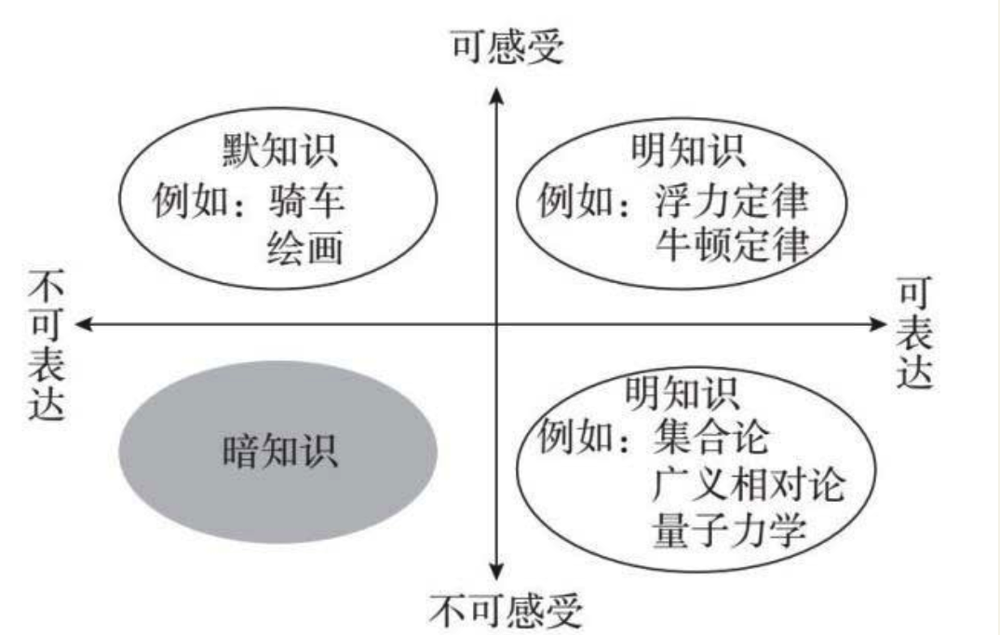
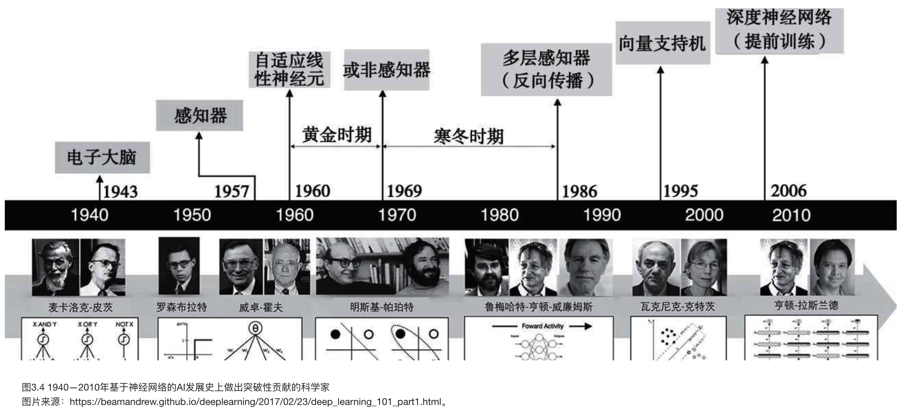
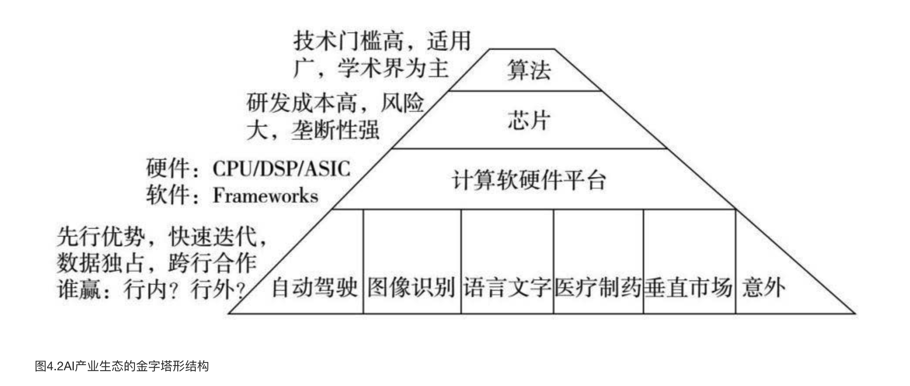

    作者: 王维嘉
    出版社: 中信出版社
    出版年: 2019-3
    页数: 360
    定价: 58元
    装帧: 软精装
    ISBN: 9787508692982

[豆瓣链接](https://book.douban.com/subject/33384854/)

- [第一章 横空出世——暗知识的发现](#第一章-横空出世暗知识的发现)
  - [骄傲的人类](#骄傲的人类)
  - [机器发现了人类无法理解的知识](#机器发现了人类无法理解的知识)
  - [知识的生物学基础——神经元连接](#知识的生物学基础神经元连接)
  - [可表达的“明知识”](#可表达的明知识)
  - [只可意会的“默知识”](#只可意会的默知识)
  - [既不可感受也不能表达的“暗知识”](#既不可感受也不能表达的暗知识)
- [第二章 榨取数据——机器能学会的知识](#第二章-榨取数据机器能学会的知识)
  - [机器发现暗知识](#机器发现暗知识)
- [第三章 神经网络——萃取隐蔽相关性](#第三章-神经网络萃取隐蔽相关性)
- [第四章 逐鹿硅谷——AI产业争霸战](#第四章-逐鹿硅谷ai产业争霸战)
  - [AI突破三要素](#ai突破三要素)
  - [金字塔形的产业结构](#金字塔形的产业结构)
  - [AI与互联网的三个区别](#ai与互联网的三个区别)

## 第一章 横空出世——暗知识的发现
### 骄傲的人类
开普勒三定律不仅完满解释了第谷的所有观测数据，并且能够解释任何新观测到的数据。这个发现过程有三个步骤：

1. 积累足够的观测数据（第谷20年的观测数据）；
2. 提出一个先验的世界模型（哥白尼的“日心说”）；
3. 调整模型的参数直至能够完美拟合已有的数据及新增数据（把圆周轨道调整为椭圆轨道，再调整椭圆轴距以拟合数据）。

上面这三个步骤奠定了现代科学的基本原则，正式吹响了科学革命的号角，直接导致了后来的牛顿万有引力的发现，一直影响到今天。

### 机器发现了人类无法理解的知识
AlphaGo Zero给我们的震撼在于三个方面：

1. 人类能发现的知识和机器能发现的知识相比，就像几个小脚老太太走过的山路和几百万辆越野车开过的山路。越野车的速度就是计算机和AI芯片处理速度，目前继续以指数速度在提高。
2. 和机器可能发现的知识相比，人类知识太简单、太幼稚，机器谈笑风生，比人不知道高到哪里去了。
3. 机器发现的知识不仅完全超出了人类的经验，也超出了人类的理性，成为人类完全无法理解的知识。

### 知识的生物学基础——神经元连接
所谓赫布猜想，本质上是通过建立神经元之间的连接从而建立起不同事物之间的联系。后来这个猜想被科学家反复证实，就成了现在我们常说的`赫布学习定律`。

### 可表达的“明知识”
可以用语言表达或数学公式描述的知识就是人类积累的大量“正式知识”，也可以称为`“明知识”`。它们记载在书籍、杂志、文章、音频等各种媒体上。

要想把某种关联表达出来，人类唯一的方法是通过语言和符号。语言和符号表达的第一个前提是要有概念。所谓概念就是某个特定的发音或符号稳定地对应于一个事物或行为。大部分的名词和动词都是这样的概念。第二个前提是每个概念都不同于其他概念，猫就是猫，狗就是狗，不能把猫叫成狗，或者把狗叫成猫，两者要能区分开。这叫“同一律”。第三个前提是猫不能同时也不是猫，黑不能同时也是白。这叫“不矛盾律”。

推理、假设、联想，这些本质上都是建立在语言之上的思维活动，没有语言就完全无法思维。所有的正常思维都要借助概念，要遵循“同一律”和“不矛盾律”。语言是人类和所有动物的最大区别。

德国哲学家维特根斯坦（Ludwig Wittgenstein，1889—1951）认为人类有史以来几乎所有的哲学辩论都源于语言的模糊不清，因而没有任何意义。他认为在世界中只有事实有意义，在语言中只有那些能够判断真伪的论断才能反映事实。他的结论是：我们的语言受限，因而我们的世界受限。

表1.1人体各个感官向大脑传送信息的速率

感官系统 | 比特/秒
-----|-----
眼睛 | 10 000 000
皮肤 | 1 000 000
耳朵 | 100 000
嗅觉 | 100 000
味觉 | 1 000

人类语言的最大限制是我们的舌头每秒钟只能嘟噜那么几下，最多表达几十个比特的意思。（比如读书，我们平均每分钟能读300字，每秒读5个字=40比特。）这样大脑接收和存储的信息与能用语言表达出来的信息量就有6个数量级的差别。

### 只可意会的“默知识”
由于舌头翻卷速度严重受限，以神经元连接形式存在大脑中的人类知识只有极少一部分可以被表达出来。而绝大部分知识无法用语言表达，如骑马、打铁、骑自行车、琴棋书画，察言观色、待人接物、判断机会和危险等。这些知识由于无法记录，所以无法传播和积累，更无法被集中。英籍犹太裔科学家、哲学家波兰尼（Michael Polyani，1891—1976）称这些知识为“默会知识”或者`“默知识”`。

默知识和明知识主要有以下四点区别：

1. 默知识无法用语言和文字描述，因此不容易传播，无法记录和积累，只能靠师傅带徒弟。像大量的传统工艺和技能，如果在一代人的时间里没人学习就会从历史上彻底消失。
2. 获取默知识只能靠亲身体验，传播只能靠人与人之间紧密的互动（你第一次骑自行车时你爸在后面扶着）。而这种互动的前提是相互信任（你不敢让陌生人教你骑自行车）。获得默知识必须有反馈回路（骑自行车摔了跤就是姿势错了，不摔跤就是姿势对了）。
3. 默知识散布在许多不同人的身上，无法集中，很难整合，要想使用整合的默知识需要一群人紧密协调互动。由于无法言传，所以协调极为困难（比如杂技叠罗汉）。
4. 默知识非常个人化。每个人对每件事的感觉都是不同的，由于无法表达，因而无法判断每个人感觉的东西是否相同。

如果用一句话总结默知识和明知识的差别那就是波兰尼说的：We know more than we can tell（知道的远比能说出来的多）。

### 既不可感受也不能表达的“暗知识”
图1.3把三类知识的定义清晰地表达出来

`信息`是事物可观察的表征，或者说信息是事物的外在表现，即那些可观察到的表现。

`数据`是已经描述出来的部分信息。任何一个物体的信息量都非常大，要想精确地完全描述一块石头，就要把这块石头里所有基本粒子的状态以及它们之间的关系都描述出来，还要把这块石头与周围环境和物体的关系都描述出来。而关于这块石头的数据通常则少得多，例如它的形状、重量、颜色和种类。

`知识`则是数据在时空中的关系。知识可以是数据与时间的关系，数据与空间的关系。如果把时间和空间看作数据的一部分属性，那么所有的知识就都是数据之间的关系。这些关系表现为某种模式（或者说模式就是一组关系）。对模式的识别就是认知，识别出来的模式就是知识，用模式去预测就是知识的应用。

在绝大多数情形下，知识表现为数据间的相关性的集合。这些相关性中只有极少数可以被感觉、被理解，绝大多数都在我们的感觉和理解能力之外。

人类的理解能力由感受能力和表达能力组成。人类的感受能力有限，局限性来自两个方面。一是只能感受部分外界信息，例如人眼无法看到除可见光之外的大部分电磁波频谱，更无法感受大量的物理、化学、生物和环境信息。二是人类的感官经验只局限在三维的物理空间和一维空间。对高维的时空人类只能“降维”想象，用三维空间类比。

人类的表达能力只限于那些清晰而简单的关系，例如少数几个变量之间的关系，或者是在数学上可以解析表达的关系（“解析表达”的意思就是变量之间的关系可以用一组方程式表达出来）。当数据中的变量增大时，或当数据间的关系是高阶非线性时，绝大多数情况下这些关系无法用一组方程式描述。所以当数据无法被感受，它们之间的关系又无法用方程解析表达时，这些数据间的关系就掉入了人类感官和数学理解能力之外的暗知识大海。

可以预见一幅未来世界的知识图谱：所有的知识分为两大类界限分明的知识——人类知识和机器知识。人类的知识如果不可陈述则不可记录和传播。但机器发掘出来的知识即使无法陈述和理解也可以记录并能在机器间传播。

## 第二章 榨取数据——机器能学会的知识
### 机器发现暗知识
图2.1是美国华盛顿大学佩德罗·多明戈斯（Pedro Domingos）教授总结的一张五大流派“八卦图”。

机器学习中的符号学派、贝叶斯学派、类推学派和联结学派的共同点是根据一些已经发生的事件或结果，建立一个预测模型，反复调整参数使该模型可以拟合已有数据，然后用此模型预测新的事件。不同的是它们各自背后的先验世界模型。符号学派相信事物间都有严密的因果关系，可以用逻辑推导出来；贝叶斯学派认为，因发生，果不一定发生，而是以某个概率发生；类推学派认为，这个世界也许根本没有原因，我们只能观测到结果的相似，如果一只鸟走路像鸭子，叫起来像鸭子，那么它就是只鸭子；联结学派认为，相似只是相关性能被人理解的那层表皮，隐藏的相关性深邃得无法用语言和逻辑表达；最后进化学派认为，什么因果？什么相关？我的世界模型就是没有模型！从零开始，不断试错，问题总能解决！

## 第三章 神经网络——萃取隐蔽相关性

表3.1神经网络和任务驱动的对比

/ | 神经网络 | 任务驱动
--|------|-----
物体识别 | 识别物体是什么，如果没训练过，就无法识别 | 识别·物体的物理特性，即使没训练过，也可以识别
功能匹配 | 通过标定和训练匹配功能，如果没训练过，就无法匹配 | 通过物体特性匹配功能，即使没训练过，也能匹配功能
驱动本质 | 数据标定驱动 | 任务驱动
数据数量 | 需要大量数据训练 | 只需要少量数据
推理能力 | 无 | 有

## 第四章 逐鹿硅谷——AI产业争霸战
### AI突破三要素
第一个条件是**计算能力**。GPU（图形处理器）被用于训练AI算法。2009年，斯坦福大学计算机系教授吴恩达和他的博士生拉加特·蓝恩纳（Rajat Raina）第一次提出由于神经网络中大量计算可以并行，用一个GPU可以比双核CPU快70倍，原来需要几周完成的计算一天就可以完成。

第二个条件是**数据**。由于互联网的发展和各类传感器（例如在各种环境中的温度、位置、压力等物理化学变量的测量，社会中大量摄像头的存在）成本的大幅下降和广泛安装，根据IDC（互联网数据中心）的监测统计，2011年全球数据总量已经达到1.8ZB（1ZB=1万亿GB），相当于18亿个1TB的移动硬盘，而这个数值还在以每两年翻一番的速度增长，预计到2020年全球将总共拥有35ZB的数据量，增长近20倍。

第三个条件是**算法**上有了重大突破。当时在多伦多大学任教的辛顿教授在美国《科学》杂志和相关的期刊上发表了论文，证明了深度神经网络的能力和实用性。

### 金字塔形的产业结构

### AI与互联网的三个区别
第一个区别是**AI从一开始就要颠覆传统行业**。互联网1994年起步时从经济的边缘开始，和传统产业似乎一点关系都没有，没有人懂一个网站能干什么。互联网20多年来逐步从边缘蚕食中心，直至今日影响每个行业。但即使是今天，互联网对制造业、农业、建筑业、交通运输等搬运原子的行业的**影响也局限在媒体和营销方面，没有进入制造业的核心**。而AI的特点是从第一天起就从传统产业中心爆炸。

第二个区别是**技术驱动**。互联网除了搜索以外基本没有太多技术，主要是应用和商业模式。互联网创业者完全可以是不懂技术的人。目前为止AI创业者以技术大拿居多。

第三个区别是**可能不会出现平台性公司或赢家“通吃”的局面**。互联网的一个特点是连接供需双方，一旦用户超过一个门限，后来者就很难赶上，所以很容易形成赢家“通吃”的局面。但在AI产业里目前还没有看到这样的机会。

简单用一句话说就是互联网是to C（对用户）的生意，AI是to B（对企业）的生意。AI中to C的生意都会被现有互联网巨头吸纳，创业者的机会在于to B。
