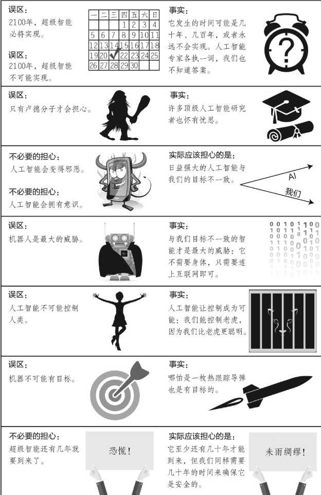

    作者: [美] 迈克斯·泰格马克
    出版社: 浙江教育出版社
    副标题: 人工智能时代，人类的进化与重生
    原作名: Life 3.0: being human in the age of artificial intelligence
    译者: 汪婕舒
    出版年: 2018-6
    页数: 468
    定价: 99.90元
    装帧: 精装
    ISBN: 9787553672786

[豆瓣链接](https://book.douban.com/subject/30262617/)

- [01 欢迎参与我们这个时代最重要的对话](#01-%e6%ac%a2%e8%bf%8e%e5%8f%82%e4%b8%8e%e6%88%91%e4%bb%ac%e8%bf%99%e4%b8%aa%e6%97%b6%e4%bb%a3%e6%9c%80%e9%87%8d%e8%a6%81%e7%9a%84%e5%af%b9%e8%af%9d)
  - [生命的三个阶段：生命1.0、生命2.0和生命3.0](#%e7%94%9f%e5%91%bd%e7%9a%84%e4%b8%89%e4%b8%aa%e9%98%b6%e6%ae%b5%e7%94%9f%e5%91%bd10%e7%94%9f%e5%91%bd20%e5%92%8c%e7%94%9f%e5%91%bd30)
- [02 物质孕育智能](#02-%e7%89%a9%e8%b4%a8%e5%ad%95%e8%82%b2%e6%99%ba%e8%83%bd)
  - [什么是智能](#%e4%bb%80%e4%b9%88%e6%98%af%e6%99%ba%e8%83%bd)
  - [什么是记忆](#%e4%bb%80%e4%b9%88%e6%98%af%e8%ae%b0%e5%bf%86)

## 01 欢迎参与我们这个时代最重要的对话
- 生命的定义是，一个能保持自身复杂性，并进行复制的过程。生命的发展会经历三个阶段：硬件和软件都来自进化的生物阶段，即`生命1.0`；能够通过学习自己设计软件的文化阶段，即`生命2.0`；自己设计硬件和软件，并主宰自我命运的科技阶段，即`生命3.0`。
- 人工智能或许能让我们在21世纪内进入生命3.0阶段。我们应该朝着什么样的未来前进，以及如何才能实现这个未来？这个问题引发了一场精彩的对话。这场辩论中有三个主要的阵营：技术怀疑主义者、数字乌托邦主义者和人工智能有益运动支持者。
- `技术怀疑主义者`认为，建造超人类水平的通用人工智能相当困难，没有几百年的时间根本无法实现。因此，现在就开始担心这个问题和生命3.0是杞人忧天。
- `数字乌托邦主义者`认为，21世纪就有可能实现生命3.0。并且，他们全心全意地欢迎生命3.0的到来，把它视为宇宙进化自然而然、令人期待的下一步。
- `人工智能有益运动支持者`也认为，生命3.0有可能会在21世纪内实现，不过他们不认为它一定会带来好结果。他们认为，若想保证好的结果，就必须进行艰苦的人工智能安全性研究。
- 除了这些连世界顶级专家都无法达成共识的合理争议，还有一些无聊的“伪争议”，是由误解所导致的。比如，如果你不能保证和自己的辩论对手在谈及“生命”“智能”“意识”这些词时，表达的意思是相同的，那么千万不要浪费时间争论这些话题。本书对这些词的定义参见表1-1。
- 请一定注意图1-5中的误区：超级智能到2100年必将实现或不可能实现。只有“卢德分子”才会担心人工智能；我们应该担忧人工智能变得邪恶或拥有意识，而这一定会在几年内发生；机器人是最大的威胁；人工智能不可能控制人类，也不可能拥有目标。
- 在第2～6章，我们将探索关于智能的故事，从几十亿年前卑微的开端，一直到几十亿年后在宇宙范围内的可能未来。首先，我们将探讨一些短期的挑战，比如就业、人工智能武器和对人类水平的通用人工智能的开发；接着，我们将讨论关于智能机器和人类未来的一系列迷人的可能性。我很想知道你青睐哪一种未来！
- 在第7章和第8章，我们将不再描述冷冰冰的事实，而是转而探索关于目标、意识和意义的话题，并讨论我们现在可以做些什么来实现我们想要的未来。

### 生命的三个阶段：生命1.0、生命2.0和生命3.0
让我们将生命定义得更广阔一些：它是一个能保持自身复杂性并能进行复制的过程。复制的对象并不是由原子组成的物质，而是能阐明原子是如何排列的信息，这种信息由比特组成。

换句话说，我们可以将生命看作一种自我复制的信息处理系统，它的信息软件既决定了它的行为，又决定了其硬件的蓝图。

生命1.0是说：生命的硬件和软件都是靠进化得来的，而不是靠设计。不过，你和我却属于“生命2.0”：生命的硬件是进化而来，但软件在很大程度上却是依靠设计的。在这里，“软件”指的是你用来处理感官信息和决定行动时使用的所有算法和知识，从你识别某人是不是你朋友的能力，到你行走、阅读、写作、计算、歌唱以及讲笑话的能力，这一切都属于软件。

突触存储着我们所有的知识和技能，大约相当于100TB的信息，而我们的DNA却只存储了大约1GB的信息，还不如一部电影的容量大呢。

如果环境发生改变，生命1.0只能通过多代进化来缓慢适应新环境，而生命2.0却可以通过软件升级来立刻适应新环境。

表1-1 名词备忘表

生命（Life） | 能保持自己的复杂性，并进行复制的过程
---------|-------------------
生命1.0（Life 1.0） | 靠进化获得硬件和软件的生命（生物阶段）
生命2.0（Life 2.0） | 靠进化获得硬件，但自己能设计软件的生命（文化阶段）
生命3.0（Life 3.0） | 自己设计硬件和软件的生命（科技阶段）
智能（Intelligence） | 完成复杂目标的能力
人工智能（AI） | 非生物的智能
专用智能（Narrow Intelligence） | 可完成一个较狭义的目标组（例如下棋或开车）的能力
通用智能（General Intelligence） | 可完成几乎所有目标（包括学习）的能力
普遍智能（Universal Intelligence） | 在拥有数据和资源的情况下，可获得通用智能的能力
通用人工智能（GAI） | 可完成任何认知任务，并且完成得至少和人类一样好的能力
人类水平的人工智能（Human-level AI） | 其能力同通用人工智能的能力
强人工智能（Strong AI） | 其能力同通用人工智能的能力
超级智能（Superintelligence） | 远超人类水平的通用智能
文明（Civilization） | 一组互相影响的智能生命形式
意识（Consciousness） | 主观体验
感质（Qualia） | 主观体验的单个实例
伦理（Ethics） | 制约我们应当如何行为的原则
目的论（Teleology） | 用目标或意志而不是原因来解释事物
目标导向行为（Goal-oriented behavior） | 更容易用目标而不是原因来解释的行为
拥有目标（Having a goal） | 展现出目标导向行为
拥有意志（Having purpose） | 服务于自己或其他实体的目标
友好的人工智能（Friendly AI） | 目标与我们一致的超级智能
赛博格（Cyborg） | 人与机器的混合体
智能爆炸（Intelligence Explosion） | 能迅速导致超级智能的迭代式自我改进的过程
奇点（Singularity） | 智能爆炸
宇宙（Universe） | 在自宇宙大爆炸以来的138亿年的时间里，光线足以达到地球的空间区域

图1-5 关于超级智能的常见误区

## 02 物质孕育智能
- 当智能被定义为“完成复杂目标的能力”时，它不能仅用单一的“IQ”指标来衡量，而应该用一个覆盖所有目标的能力谱来衡量。
- 今天的人工智能还是比较“狭义”的，也就是说，只能完成非常特定的目标，而人类智能却相当“广义”。
- 记忆、计算、学习和智能之所以给人一种抽象、虚无缥缈的感觉，是因为它们都是独立于物质层面的。它们仿佛具有自己的生命，而不需要依赖和反映它们所栖息的物质层面的细节。
- 任何一团物质，只要它拥有许多不同的稳定状态，就可以作为记忆的基础。
- 任何物质，只要它包含某种组合起来能运行任何函数的通用基本构件，那它就可以作为计算质，也就是计算的物质基础。
- 神经网络是一个强大的学习基础，因为只要遵守物理定律，它就能对自己进行重新排列组合，执行计算的能力也会随之变得越来越好。
- 由于人类知道的物理定律极其简单，所以在能想象到的所有计算问题中，人类关心的非常少，而神经网络总能游刃有余地解决这些问题。
- 当某项技术的能力翻倍时，它通常又可以被用来设计和建造强大两倍的技术，引发不断的能力翻倍，这正是摩尔定律的精髓。信息技术的成本大约每两年就会减半，这个过程已经持续了约一个世纪，催生了今天的信息时代。
- 如果人工智能方面的进步持续下去，那么，早在人工智能在所有技能上都达到人类水平之前，它会给我们带来迷人的机遇和挑战，涉及其带来的突破和故障，以及法律、武器和就业等领域的变化，我们将在下一章探讨这些问题。

### 什么是智能

图2-1 人工智能可以胜出人类的任务

### 什么是记忆
大脑的记忆原理与计算机的信息存储原理截然不同，这不仅体现在它的构成上，还体现在它的使用方式上。你在计算机或硬盘上读取记忆的方式是通过它存储的位置，但你从大脑中读取记忆的方式则是依据它存储的内容。

当需要读取某些信息时，计算机检索的是它的地址，这就好像在说：“请你从我的书架上取出最顶层从右往左数的第5本书，然后告诉我第314页上说了什么。”相反，你从大脑中读取信息的方式却更像搜索引擎：你指定某个信息或与之相关的信息，然后它就会自动弹出来。比如，当你听到“生存还是……”这个短语时，它很可能会在你脑中触发“生存还是毁灭，这是一个值得考虑的问题”这句话；如果你在网上搜索这个短语，搜索引擎也很可能会给你同样的搜索结果。实际上，即便我引用的是这句话中的另外一部分，甚至弄混一些字词，结果可能还是一样的。这种记忆系统被称为`“自联想”（auto-associative）`，因为它们是通过联想而不是地址来进行“回想”的。

1982年，物理学家约翰·霍普菲尔德（John Hopfield）在一篇著名的论文中向人们展示了一个由互相连接的神经元组成的网络，它能够实现自联想记忆的功能。我觉得他的基本观点非常棒，对于许多拥有多个稳定状态的物理系统来说，这个观点都成立。例如，一个小球位于一个拥有两个“山谷”的曲面上让我们对这个曲面做一点设定，让两个最低点的x坐标分别为 $x=\sqrt{2} \approx 1.41421$和$x=\pi \approx 3.14159$。如果你只记得π与3很接近，但不记得π的具体值，那么你只需要把小球放到π=3处，然后看它滚落入最近的最低点，它就能向你揭示出一个更精确的π值。霍普菲尔德意识到， 一个更复杂的神经元系统可以提供一个类似的“地形”，其上有许许多多能量极小值，系统可以稳定在这些能量极小值上。

