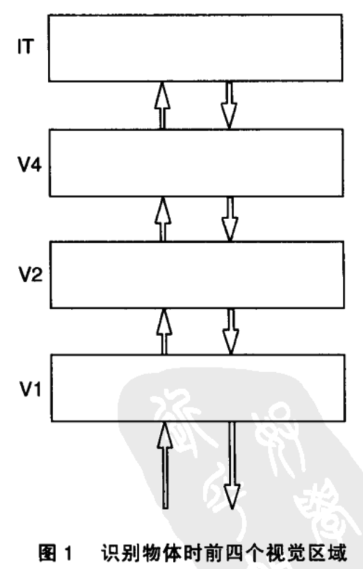
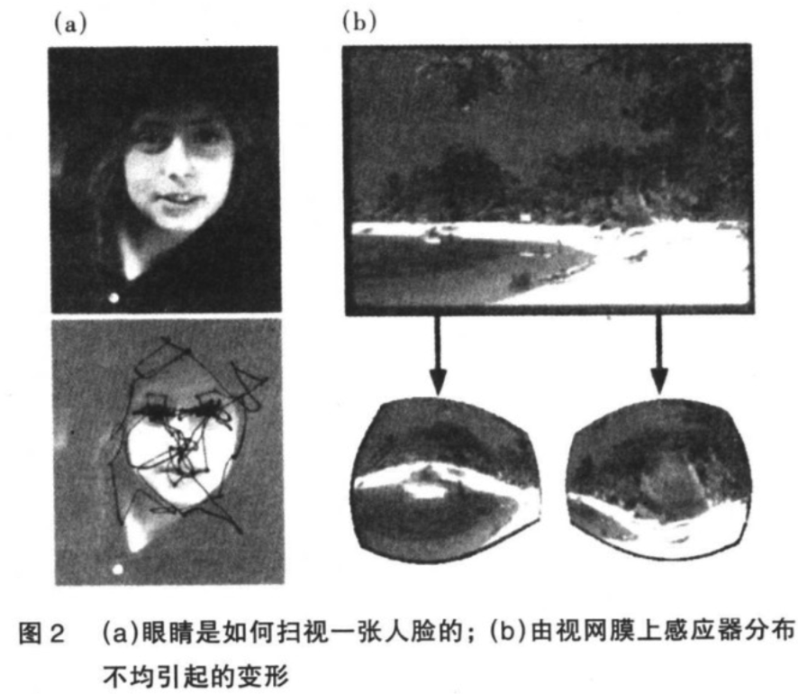
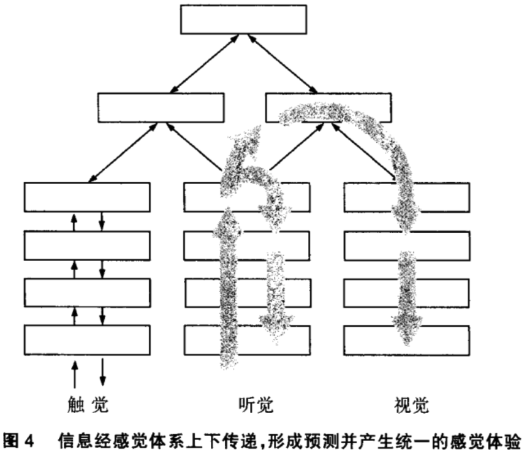
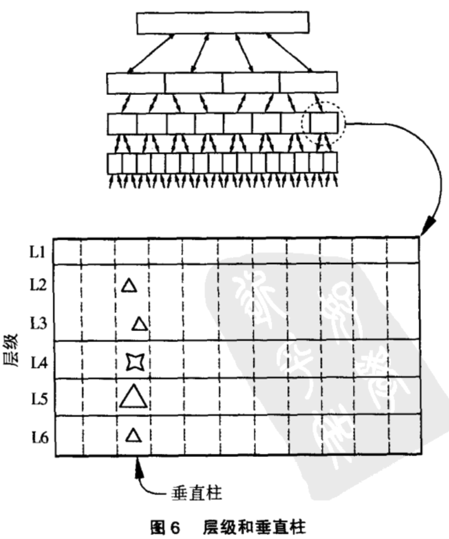

    作者: Jeff Hawkins / Sandra Blakeslee 
    出版社: 陕西科学技术出版社
    原作名: On Intelligence
    译者: 贺俊杰 / 李若子 / 杨倩 
    出版年: 2006.1
    页数: 258
    定价: 18.5
    装帧: 平装
    ISBN: 9787536940185

[豆瓣链接](https://book.douban.com/subject/1834728/)

- [第一章 人工智能](#%e7%ac%ac%e4%b8%80%e7%ab%a0-%e4%ba%ba%e5%b7%a5%e6%99%ba%e8%83%bd)
  - [阿兰图灵](#%e9%98%bf%e5%85%b0%e5%9b%be%e7%81%b5)
  - [“中文屋”试验](#%e4%b8%ad%e6%96%87%e5%b1%8b%e8%af%95%e9%aa%8c)
  - [什么是理解](#%e4%bb%80%e4%b9%88%e6%98%af%e7%90%86%e8%a7%a3)
- [第二章 神经网络](#%e7%ac%ac%e4%ba%8c%e7%ab%a0-%e7%a5%9e%e7%bb%8f%e7%bd%91%e7%bb%9c)
  - [大脑解读的三种标准](#%e5%a4%a7%e8%84%91%e8%a7%a3%e8%af%bb%e7%9a%84%e4%b8%89%e7%a7%8d%e6%a0%87%e5%87%86)
  - [智能与行为](#%e6%99%ba%e8%83%bd%e4%b8%8e%e8%a1%8c%e4%b8%ba)
  - [“自-匹配记忆”（auto-associative memories）](#%e8%87%aa-%e5%8c%b9%e9%85%8d%e8%ae%b0%e5%bf%86auto-associative-memories)
  - [（哲学）功能主义](#%e5%93%b2%e5%ad%a6%e5%8a%9f%e8%83%bd%e4%b8%bb%e4%b9%89)
- [第三章 人脑](#%e7%ac%ac%e4%b8%89%e7%ab%a0-%e4%ba%ba%e8%84%91)
- [第四章 记忆](#%e7%ac%ac%e5%9b%9b%e7%ab%a0-%e8%ae%b0%e5%bf%86)
- [第五章 智能理论新架构](#%e7%ac%ac%e4%ba%94%e7%ab%a0-%e6%99%ba%e8%83%bd%e7%90%86%e8%ae%ba%e6%96%b0%e6%9e%b6%e6%9e%84)
  - [理解的实质](#%e7%90%86%e8%a7%a3%e7%9a%84%e5%ae%9e%e8%b4%a8)
- [第六章 大脑皮层工作原理](#%e7%ac%ac%e5%85%ad%e7%ab%a0-%e5%a4%a7%e8%84%91%e7%9a%ae%e5%b1%82%e5%b7%a5%e4%bd%9c%e5%8e%9f%e7%90%86)
  - [恒定表征](#%e6%81%92%e5%ae%9a%e8%a1%a8%e5%be%81)
  - [整合感觉](#%e6%95%b4%e5%90%88%e6%84%9f%e8%a7%89)
  - [恒定表征新说](#%e6%81%92%e5%ae%9a%e8%a1%a8%e5%be%81%e6%96%b0%e8%af%b4)
  - [世界的模型](#%e4%b8%96%e7%95%8c%e7%9a%84%e6%a8%a1%e5%9e%8b)
  - [层级和垂直柱](#%e5%b1%82%e7%ba%a7%e5%92%8c%e5%9e%82%e7%9b%b4%e6%9f%b1)
  - [上行与下行](#%e4%b8%8a%e8%a1%8c%e4%b8%8e%e4%b8%8b%e8%a1%8c)
  - [大脑皮层如何学习](#%e5%a4%a7%e8%84%91%e7%9a%ae%e5%b1%82%e5%a6%82%e4%bd%95%e5%ad%a6%e4%b9%a0)
- [第七章 意识和创造力](#%e7%ac%ac%e4%b8%83%e7%ab%a0-%e6%84%8f%e8%af%86%e5%92%8c%e5%88%9b%e9%80%a0%e5%8a%9b)
  - [动物有智力么？](#%e5%8a%a8%e7%89%a9%e6%9c%89%e6%99%ba%e5%8a%9b%e4%b9%88)
  - [何谓创造力](#%e4%bd%95%e8%b0%93%e5%88%9b%e9%80%a0%e5%8a%9b)
  - [意识是什么？](#%e6%84%8f%e8%af%86%e6%98%af%e4%bb%80%e4%b9%88)
  - [什么是想象力？](#%e4%bb%80%e4%b9%88%e6%98%af%e6%83%b3%e8%b1%a1%e5%8a%9b)
  - [什么是现实？](#%e4%bb%80%e4%b9%88%e6%98%af%e7%8e%b0%e5%ae%9e)

## 第一章 人工智能
### 阿兰图灵
“万能计算”：尽管建构的细节有所不同，但从根本上讲所有的计算机都是等效的。他还假想了一台机器来证明这一观点。这台虚拟的机器包括三个主要部分：一个处理盒，一个纸带和一个能从来回移动的纸袋上读取并记录信息的装置。纸袋就像众所周知的计算机代码0和1一样，是用来存储信息的。那个处理盒，现在被称为中央处理器（CPU），会遵循一定的规则读取和编辑纸带上的信息。图灵用数学的方法证明，如果CPU的规则选择正确，并且有足够长的纸带供其使用，这台机器就可以完成世界上任何一种计算。这就是被称为“图灵万能机器”的众多等效计算机中的一种。

图灵实验：如果一台机器可以诱使一个问询者相信它也是一个人，那么从定义上来讲这台机器就是智能的。

### “中文屋”试验
约翰·塞尔：计算机没有，而且也不可能有智能。

 “中文屋论证”的设计如下：

1. 实验假设：塞尔只懂英文，不懂中文，当他被关在一间屋子里。屋子只有一个窗口，有英文书写的规则书，还有各种各样的纸片，纸片上带有一些字符。
2. 实验过程：通过窗口人们可以递给他一些有字符的纸片，他通过规则书，能够知道怎么操纵这些字符，而这些字符总是以他们的形状或形式来确认的。例如，一条规则指示他：把一号篮子中的甲放到二号篮子中的甲的旁边。
3. 实验结果：屋内的塞尔认为卡片上的字符毫无意义，却能够正确地将答案传递给屋外的中国人。所以屋外的中国人则可以认为塞尔是理解中文的，但是塞尔完全不懂中文，仅仅只是按照规则书进行字符匹配而已。

这个“中文屋”与数字计算机非常相似，塞尔就是CPU——只是无意识地执行指令；那本书就是向CPU传达指令的软件程序；那些纸片便是内存。

认真思考“中文屋”实验的论据和计算机的工作原理之后，我没有看到任何地方有“理解”发生。

### 什么是理解
理解是无法用外部行为测量的，它是对大脑如何记忆、如何利用这些记忆进行判断的内部度量。

## 第二章 神经网络
### 大脑解读的三种标准
1. 大脑功能的时间概念。
2. 反馈的重要性。
3. 任何大脑模型或理论都应该能够解释大脑的物理结构。

### 智能与行为
大多数神经网络和人工智能都有一个共同的特点——它们只注重行为。不论这些行为被称为“回应”“模式”还是“输出”，人工智能和神经网络研究者都认为智能存在于行为之中，而这种行为是执行一个输入后，由一个程序或神经网络产生出来的。电脑程序和神经网络最重要的属性就是能否进行正确的、令人满意的输出，就像阿兰·图灵所说的，智能等同于行为。

而实际上，智能并不是一种动作，也不是某种聪明的行为。行为只是智能的一种表现，绝不是智能的主要特征或对于智能的首要解释。思考就是有力的证明：当你躺在黑暗中思考时，你就是智能的。

### “自-匹配记忆”（auto-associative memories）
自-匹配记忆反应了反馈和随时间变化的输入的重要性。

### （哲学）功能主义
功能主义认为：具有智能或思维只是生物体的特征而已，与你身体的组织构成没有必然联系。思维存在于任何系统之中，只要这个系统的组成部分之间有正确的因果关系，而这些部分可以是神经元、硅芯片或者其他任何东西。

## 第三章 人脑
所有的智能都产生于新大脑皮层，并且另外两个部位——丘脑和海马，也发挥了重要作用。

人类大脑皮层中包含大约300亿个神经元。

内部是有区域界限的。某些心理功能是固定在一定的区域里的。右脑顶叶：左侧身体知觉；左前脑的布洛卡（Broca）区：语法的功能；纺锤状脑：辨别面孔的能力。

在大脑皮层中，低级区域通过某种特定的神经连接方式向高级区域传递信息；而高级区域用另一种方式向低级区域反馈。

每一个区域都与这些信息中的某个更专业化、更抽象的方面相联系。

最终，感觉信息会传入“联合区”。

大脑皮层在外表和结构上惊人地相似，不论是主观视觉输入和主观触觉的大脑皮层区域、控制肌肉的区域、布罗卡语言区以及其他各个区域，实际上是完全一样的。既然这些区域是相同的，那么它们在实际中所发挥的基本作用也可能是相同的，而且大脑皮层完成各个功能所使用的方法也是相同的。

头脑中所有信息都是作为轴突上的空间-时间模式进入的。

保尔·巴奇·瑞塔（paul bachy rita）发明了一种在人的舌头上显示视觉模式的方法：在受试者的前额上戴上一个小型摄像机，这时视觉影像就一个像素一个像素地传输到舌头上的压力点上，一个在电视屏幕上由无数个像素组成的视觉影像可以转化成一个含有无数个压力点的模式，大脑会很快学会如何正确辨别这些模式。

大脑皮层是极其灵活的，而且输入大脑的都是模式。

**大脑是模式机器**，用听觉或视觉来表述它的功能并非不正确，但从根本来看，模式才是实质。

世界的确是以一个绝对的形式存在的，和我们感觉到的非常接近，但我们的大脑不能直接认识这个绝对的世界。

## 第四章 记忆
要抓住一只球，计算机需要进行几百万次大量的数学计算。即使成功地设计出了这样的程序，“一百步”法则也告诉我们，大脑在解决这个问题时使用了不同的方法，那就是记忆。

我们可以看到大脑皮层有一种被称为 **“恒定表征”** 的能力，可以自动处理这种变化。

大脑皮层的记忆和电脑的记忆有以下四点根本区别：

* 大脑皮层可以存储模式序列；
* 大脑皮层以自-联想方式回忆起模式；
* 大脑皮层以恒定的形式存储模式；
* 大脑皮层按照层级结构存储模式。

## 第五章 智能理论新架构
我们的大脑在利用记忆不断地对我们看到的、听到的和感觉到的东西进行预测。当我环视房间，我的大脑就利用记忆在我看到某个物体之前进行预测，而绝大部分的预测是在不自觉的状态下进行的。

当某种在大脑皮层中没有被存储的视觉模式输入时，这种预测就会被破坏，我的注意力就会被这个差错所吸引。

大脑在预测时并不会自言自语，不会按照某种既定次序进行，也不会对咖啡杯这类确切的物体进行预测。它是用一种平行的方式连续不断地对我们所在环境的架构进行预测。它只会探测那些奇怪的结构，如变形的鼻子或异常的动作。这种下意识的预测无时无处不在。

知觉并不是意识的唯一来源。我们的意识是我们感觉到的一切与源于大脑记忆的预测之结合。

你的大脑对于某个特定时刻将要看到、听到和感觉到的东西进行了低级感觉预测，而且是并行的，脑皮层各个区域都会自动地预测下一步的感觉。视觉区对边缘、形状、物体、位置和动作做出预测；听觉区对音调、声音的来源以及声音的模式做出预测；体觉区则对触摸、质地、轮廓以及温度进行预测。这里所谓的“预测”，就是指参与感觉你家大门的神经元在确实收到感觉输入之前就变得活跃了起来，当当感觉输入真正到达之后，再将它和预料的情况进行对比。

**“古脑”或“原始脑”：控制着人的血压、饥饿感、性欲、情感以及运动的各个方面。**

记忆和预测使得动物可以更聪明地利用已经存在的（古脑的）行为。

你首先想，然后促使自己行动来实现这个想法。

人类之所以拥有可预测的复杂运动能力，原因在于我们的运动脑皮层和我们身体上的肌肉有更多复杂的连接。在其他哺乳动物身上，脑皮层前部在运动行为方面发挥的直接作用并不是很大，它们主要依靠古脑的各个部位产生行为。相比之下，人类脑皮层在运动控制方面取代了大脑的其他部分。

### 理解的实质
大自然首先创造出一些动物，它们有复杂的感觉，相比之下其行为却相对僵化，诸如爬行动物之类。然后，只要给它们加入一个记忆系统并出入感觉信息流，这些动物就可以记住以前发生的事。当它们深处相同或相似的环境时，这些记忆就可以被唤起，引发对下一步的预测。这样，智能和理解首先从记忆系统开始，并将预测输入感觉信息流。**这些预测就是理解的实质**，因为知道某个事情就意味着你可以对它做出预测。

**阿兰·图灵错在哪里——智能的证据是预测，而不是行为。**

## 第六章 大脑皮层工作原理
### 恒定表征

从视网膜到IT区在跨过脑皮层的4个阶段的过程中，细胞在改变着状态：从飞速变化的、具有空间特异性、能识别细微特征的细胞，转变成为不断被触发、空间非特异性、能识别目标的细胞。IT区的这个细胞告诉我们，在视野中我们看到了一张脸。这个细胞通常被叫做“脸细胞”。不管看到的脸是倾斜的、旋转的还是部分被遮挡了的，它都会活跃。它构成了“脸”的`恒定表征`的一部分。

图3仅仅是一个示意图，并不是要描绘实际的皮层区域。在真正的人脑里，数十个皮层区都是通过各种方式相互连接起来的。

在听觉和触觉方面，你并不能通过瞬间的输入来识别物体，你耳朵或皮肤的触觉传感器传来的模式，在某个时间点上，并没有足够的信息来告诉你听到的或是摸到了什么。当你要感知一系列诸如旋律、话语或是“砰”的关门声等听觉模式时，或者当你要感知一支像钢笔那样的物体时，唯一的办法是通过有一定时间跨度的输入信息流。只听一个音符是无法识别一个旋律的。同样的道理，只轻轻接触一下，你也不可能识别出那是钢笔的触感。

视觉也是基于时间的输入流，它与听觉和触觉的工作方式一样。

### 整合感觉

整个新大脑皮层及所有的感觉和联合区域都行动如一。

所有的预测都是从经验中学习的。你不是生来就具有这些知识的，这些都是通过学习而得来的，这得归功于你的脑皮层有令人难以置信的大容量，从而可以记住各种模式。如果传入大脑的输入中有一贯相同的模式，脑皮层就会将它们用来预测未来的事件。

### 恒定表征新说

按照老的思路，只有等输入到达顶层，也就是能看到整体视觉世界的IT区时，我们才形成彻底的恒定表征，比如说“脸”的表征。而现在我们可以说恒定表征是无所不在的。在脑皮层的每一个区域都形成有恒定表征。

每一个区域都从位于自己下面的输入区获得并形成恒定表征。因此我们说，V4区、V2区和V1区的子区域都根据流入它们的信息产生恒定表征，它们只不过看到世界的很小一部分，它们涉及的感觉物体的符号也是非常基本的，但它们却和IT区一样完成相同的工作。

### 世界的模型
世界上的每一个物体都是由许多较小的物体组成，而大多数物体都属于更大的物体。

在一个时间点上，你只能在你家里放入一个房间里，看着一个方向。因为有了脑皮层的层级结构，你就能知道你是在家里，在起居室里，看着窗户，即使当时你的眼镜只注视在一个窗闩上。脑皮层的较高区域保持着你家的表征，较低的区域则标准房间，更低的区域则看着窗户。

“眼睛-眼睛-鼻子-嘴”的顺序，片刻后又是以“嘴-眼睛-鼻子-眼睛”的顺序。组成脸的各部分是一个序列，它们在统计上是关联的，并且总是几乎同时出现，虽然顺序有可能变化。如果你感觉到一张“脸”，而此时你正注视着“鼻子”，那接下来的模式很可能就是“眼睛”或“嘴”，而不会是“钢笔”或“汽车”。脑皮层的每个区域都看到一股这样的模式流。如果模式都是如此相互关联着，而皮层区域能够学会预测接下来将出现什么模式的话，我们就说脑皮层区域对这一序列形成了稳定的表征，或者叫`记忆`。

如果脑皮层区域发现自己能够通过一系列的身体动作（例如眼睛的扫视或者手指的抚摸）可靠地且有预见地在这些输入模式间切换，并且当它们不断明朗化时（例如声音能组成一首歌或一个词），能够对它们做出精确的预测，大脑就认为它们之间存在因果关系。

在体系中的每一个区域里将可预测的序列变成“已命名的对象”。这样，在体系中层级越高，稳定性越强。恒定表征就这样产生了。

当模式沿着体系往下传播时，就会出现相反的结果：稳定的模式“展开”成序列。

序列记忆不但能让你消除当前输入中的歧义，还能帮你预测接下来的输入会是什么。

**你的大脑记住的是世界的本质，而不是它看上去的那个样子。** 当你对世界进行思考时，你是在提取那些对应于世界上物体的存在和表现方式的模式，而不是它们在某一时刻通过你的任何感官所表现出来的样子。**你用以体验世界万物的序列放映的就是世界的恒定结构。**

### 层级和垂直柱

每个垂直柱中垂直排列的细胞对同一刺激通常会同时产生兴奋。具体地说，第4层的一个被激活的细胞会使其上的第3层和第2层中的细胞兴奋起来，然后引起底下第5层和第6层中的细胞产生兴奋。兴奋状态就在细胞垂直柱中上下传播。

每一个垂直柱中，细胞上的突触有90%是与外部相连的，这些突触中有一些是来自邻近的垂直柱，其他的则来自半个大脑距离以外的地方。

我认为**垂直柱是预测的基本单位**。一个垂直柱要兴奋并能进行预测，就必须知道其他地方都发生了什么，因此，就有了从各处而来的突触。

### 上行与下行
预料外的模式会被自动传递到较高的皮层区域。较高的区域也许能将这一新的模式解释成自己已知序列的下一部分。如果连这样的识别过程都没有发生，这个预料外的模式就会一直沿着皮层体系往上传递，直到某个区域把它解读成自己正常的事件序列。预料外模式传递得越高，就有越多的皮层区域参与到消除意外输入的处理过程中来。最后，当体系的上方有一个区域认为自己能解读这个预料外的事件时，它就会产生一个新的预测，这个新的预测就沿着体系尽可能地向下传播。如果这个新的预测还是不对，就会有错误被检测到，这样，这个预料外模式又将再一次沿体系往上传递，直到有某个区域能把它识别为自己兴奋序列的一部分。这样，我们看到观测模式沿体系向上传递，而预测则沿体系向下传递。

### 大脑皮层如何学习
**学习的两个基本要素就是形成对模式的分类和建立序列，这两个相辅相成的记忆组件相互作用着。** 当一个皮层区域学习序列的时候，到达第4层细胞的输入就在变化。因此，这些第4层细胞就会学着进行新的分类，并改变投射回第1层的模式，进而对序列产生影响。

在反复学习过程中，对象的表征会沿着皮层体系向下移动。在你生命的前几年里，你对世界的记忆首先形成在皮层的较高区域，但随着你的进一步学习，这些记忆会在皮层体系的越来越低的区域中重新形成。这并不是说大脑将它们向下移，而是指它不得不一次又一次地重新学习。（我并不是说，所有的记忆都是从皮层的顶层开始的。当然，记忆的实际形成过程更为复杂。我相信第4层的模式分类是先从底部开始，然后往上移动。但在此过程中，我们开始形成序列，随后这些序列往下移动。我指的是对模式的记忆会在皮层的越来越低的区域中重新形成。）随着简单的表征下移，位于皮层底部的区域就能学习更复杂、更细微的模式了。

如果你反复研究某一类事物，你的大脑皮层将在较低的层级中形成对它们的记忆表征，这就把皮层的较高层级给释放出来了，可以利用它来学习更细微、更复杂的关系。

## 第七章 意识和创造力
### 动物有智力么？
问题不在于说一些生物有智力，而另一些生物没有智力，所有的生物都在运用记忆和预测，只是它们运用记忆和预测的手段和复杂程度不同而已。

### 何谓创造力
创造力可以被简单地看成是通过类推而进行预测的一种活动而已。它发生在大脑皮层的各个角落，只要人醒着，它就时时在发生。各种创造力构成了一个连续体，小到发生在皮层感觉区平常的感知行为（比如听到一首新的调子演唱的曲子），大到发生在大脑皮层最高领域的高难度、罕见的天才行为（比如以全新的方式创作交响乐）。从根本上说，它们极为相似，只不过这些平常行为太过于普通了，以至于我们没有注意到它们而已。

通过将此刻发生的事件细节与下一刻将要发生事件的恒定记忆结合起来，我们便能做出预测。预测就是将恒定记忆序列应用于新的情况，因此脑皮层的所有预测都是通过类推而做出的。我们通过类比过去而预测未来。

### 意识是什么？
意识类似于陈述性记忆。陈述性记忆是你能回忆起来并告知他人的记忆，并可以用语言表达清楚。如果你问我上周末去哪里了，我可以告诉你。那就是陈述性记忆。如果你问问如何平衡自行车，我会告诉你手握自行车扶手，脚蹬踏板，但我却不能确切地解释如何去做。如何平衡自行车主要与古脑的神经活动有关，它不是陈述性记忆。

### 什么是想象力？
传入各皮层区的模式不是来自感官就是来自记忆层级中较低的区域。每一皮层区都产生预测，预测沿着层级向下传递。当你在进行想象时，你所做的仅仅是让预测调转回来，成为新的输入。

### 什么是现实？
“什么是现实”这个问题的回答，很大程度上取决于我们大脑皮层建立的模型能在多大程度上准确地反映世界真实情况。
