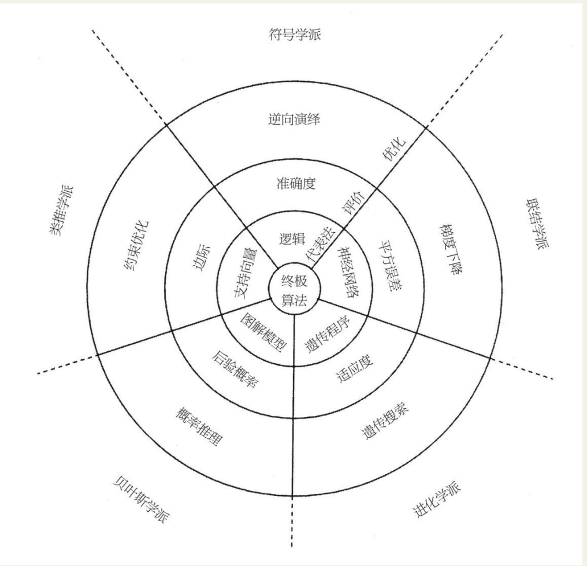

    作者: [美] 佩德罗·多明戈斯 
    出版社: 中信出版集团
    副标题: 机器学习和人工智能如何重塑世界
    原作名: The Master Algorithm: How the Quest for the Ultimate Learning Machine Will Remake Our World
    译者: 黄芳萍 
    出版年: 2017-1-1
    页数: 402
    定价: 68.00元
    装帧: 平装
    ISBN: 9787508668673

[豆瓣链接](https://book.douban.com/subject/26931905/)

- [序](#%e5%ba%8f)
- [第二章 终极算法](#%e7%ac%ac%e4%ba%8c%e7%ab%a0-%e7%bb%88%e6%9e%81%e7%ae%97%e6%b3%95)
  - [机器学习算法与知识工程师](#%e6%9c%ba%e5%99%a8%e5%ad%a6%e4%b9%a0%e7%ae%97%e6%b3%95%e4%b8%8e%e7%9f%a5%e8%af%86%e5%b7%a5%e7%a8%8b%e5%b8%88)
  - [天鹅咬了机器人](#%e5%a4%a9%e9%b9%85%e5%92%ac%e4%ba%86%e6%9c%ba%e5%99%a8%e4%ba%ba)
  - [新的万有理论](#%e6%96%b0%e7%9a%84%e4%b8%87%e6%9c%89%e7%90%86%e8%ae%ba)
  - [机器学习的五大学派](#%e6%9c%ba%e5%99%a8%e5%ad%a6%e4%b9%a0%e7%9a%84%e4%ba%94%e5%a4%a7%e5%ad%a6%e6%b4%be)
- [第三章 符号学派：休谟的归纳问题](#%e7%ac%ac%e4%b8%89%e7%ab%a0-%e7%ac%a6%e5%8f%b7%e5%ad%a6%e6%b4%be%e4%bc%91%e8%b0%9f%e7%9a%84%e5%bd%92%e7%ba%b3%e9%97%ae%e9%a2%98)
  - [符号学派](#%e7%ac%a6%e5%8f%b7%e5%ad%a6%e6%b4%be)
- [第九章 解开迷惑](#%e7%ac%ac%e4%b9%9d%e7%ab%a0-%e8%a7%a3%e5%bc%80%e8%bf%b7%e6%83%91)
  - [终极算法之城](#%e7%bb%88%e6%9e%81%e7%ae%97%e6%b3%95%e4%b9%8b%e5%9f%8e)
- [后记](#%e5%90%8e%e8%ae%b0)

## 序
机器学习主要有5个学派，我们会对每个学派分别介绍：

- 符号学派将学习看作逆向演绎，并从哲学、心理学、逻辑学中寻求洞见；
- 联结学派对大脑进行逆向分析，灵感来源于神经科学和物理学；
- 进化学派在计算机上模拟进化，并利用遗传学和进化生物学知识；
- 贝叶斯学派认为学习是一种概率推理形式，理论根基在于统计学；
- 类推学派通过对相似性判断的外推来进行学习，并受心理学和数学最优化的影响。

机器学习的5个学派都有自己的主算法，利用这种万能学习算法，原则上，你可以通过任何领域的数据来挖掘知识：符号学派的主算法是逆向演绎，联结学派的主算法是反向传播，进化学派的主算法是遗传编程，贝叶斯学派的主算法是贝叶斯推理，类推学派的主算法是支持向量机。

## 第二章 终极算法
### 机器学习算法与知识工程师
明斯基不仅怀疑机器学习能替代知识工程，他也怀疑人工智能的所有统一思想。

知识工程师相信，人工智能的问题仅仅是工程学的问题，但是我们还没达到那个点——工程学能带领我们走完下面的路。

另一个对机器学习持怀疑态度的人是语言学家诺姆·乔姆斯基。乔姆斯基认为，语言必须是与生俱来的，因为孩子听到的合乎语法的句子仅仅是一些例子，不足以学习语法。然而，这种说法仅仅将学习语言的任务交给了进化，它并没有反对终极算法，只是反对“终极算法是大脑”这个观点。

乔姆斯基似乎把机器学习等同于行为主义了，根据行为主义，动物的行为沦为反应与奖励之间的联合，但机器学习不是行为主义。现代学习算法能够掌握丰富的内在表象，而不仅仅是刺激物之间的两两关系。

另外一个可能会反对终极算法的观点来自心理学家杰瑞·福多，他认为心理是由一系列模块组成的，这些模块之间只有有限的联系。例如，当看电视时，你的“高级脑”知道，那只是光线在光滑表面的闪烁，但视觉系统仍然会看见三维形状。即使我们相信心理模块理论，这个理论也并没有暗指不同的模块会使用不同的学习算法。

像明斯基、乔姆斯基和福多这样的批评家曾经占据上风，但万幸，他们的影响力已经逐渐减弱。即便如此，我们仍需将他们的批评铭记于心，这样才能到达终极算法这个终点，原因有两个：第一，知识工程师和机器学习算法一样，遇到许多相同的问题，虽然他们没有成功，但学到了许多宝贵的教训；第二，学习和知识以异常微妙的形式相互交织，而我们很快就会发现这一点。遗憾的是，这两个阵营各说各话。他们讨论不同的主题：机器学习讨论概率，而知识工程学讨论逻辑。

### 天鹅咬了机器人
科学经历了三个时期：布拉赫时期、开普勒时期、牛顿时期。对于布拉赫时期，我们收集了很多数据，就像第谷·布拉赫日复一日、年复一年耐心记录行星的位置那样。对于开普勒时期，我们使经验规律符合数据，就像开普勒对行星运动所做的那样。对于牛顿时期，我们发现了更深刻的真理。大多数科学研究和布拉赫、开普勒所做的工作相似，这样的工作就是科学研究的内容，像牛顿偶然发现定律的例子则少见。当今，大数据所做的工作是布拉赫的数十亿倍，机器学习的工作内容是开普勒的数百万倍。如果（但愿如此）有更多像牛顿偶然发现定律这样的时刻，这样的时刻也可能发生在未来的学习算法中，或者发生在未来手足无措的科学家身上，或者至少是发生在两种可能都存在的情况下（当然，诺贝尔奖会颁发给科学家，不管他们是持重要的观点，还是只按了一下按钮。学习算法就没有那样的志向，要拿诺贝尔奖）。

### 新的万有理论
理论是关于世界是什么的一系列约束条件，而不是对世界的完整描述。为了获得对世界的完整描述，你必须将理论和数据结合起来。

### 机器学习的五大学派
在机器学习领域存在不同思想的学派，主要学派包括符号学派、联结学派、进化学派、贝叶斯学派、类推学派。

## 第三章 符号学派：休谟的归纳问题
理性主义者认为，感官会欺骗人，而逻辑推理是通往知识的唯一可靠的道路。经验主义者认为所有推理都是不可靠的，知识必须来源于观察及实验。

在计算机科学领域，理论家和知识工程师属于理性主义者，黑客和计算机学习者属于经验主义者。

### 符号学派
符号学派的核心理念就是，所有和智力相关的工作都可以归结为对符号的操纵。

根据这个假设，智力是独立于基质的。符号处理是通过写在黑板上进行的，还是通过打开或关闭晶体管、放电神经元，或者玩玩积木就能完成的，这些都不重要。

符号主义机器学习是人工智能知识工程学派的一个分支。20世纪70年代，所谓的基于知识的系统取得卓越成绩，而到了80年代，它们迅速传播，后来却消失了。它们消失的主要原因是人人逃避的知识习得瓶颈：从专家身上提取知识，然后将其编码成为规则，这样做难度太大、太费力、易出故障，会引起很多问题。让计算机自行学习，比如通过查看过往患者症状及其相应疗效的数据库，就可以进行疾病诊断，比无数次地找医生要容易很多。

符号主义是通往终极算法的最短路程。它不要求我们弄明白进化论和大脑的工作原理，而且也避免了贝叶斯主义的数学复杂性。

## 第九章 解开迷惑
### 终极算法之城

## 后记
你可以从UCI数据库上下载一些数据集（archive.ics.uci.edu/ml） 并开始这场比赛。当你做好准备时，可以对Kaggle.com进行了解，这是一个专门组织管理机器学习比赛的网站，然后挑一两个链接并点击进入。
