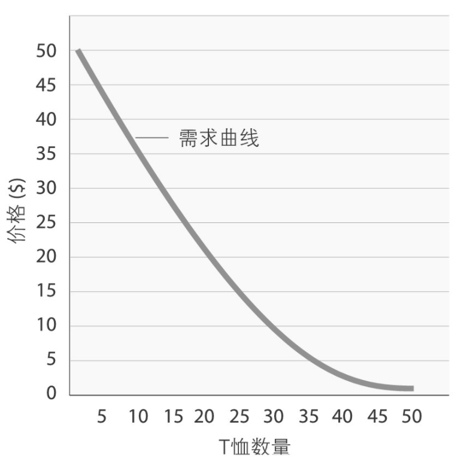
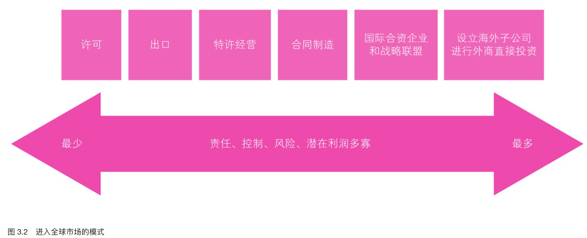

    作者: [美] 威廉·尼克尔斯（William G.Nickels） / 吉姆·麦克修（James M.McHugh） / 苏珊·麦克修（Susan M.McHugh）
    出版社: 世界图书出版公司·后浪出版公司
    出品方: 后浪
    原作名: Understanding business,10e
    译者: 陈智凯 / 黄启瑞 / 黄延峰
    出版年: 2016-1
    页数: 576
    定价: 99.80元
    装帧: 平装
    丛书: 后浪大学堂
    ISBN: 9787510093418

[豆瓣链接](https://book.douban.com/subject/26698020/)

- [动态商业环境：风险和获利](#动态商业环境风险和获利)
  - [企业家精神和财富创造](#企业家精神和财富创造)
  - [企业家与打工者](#企业家与打工者)
  - [企业环境](#企业环境)
  - [美国企业的演进](#美国企业的演进)
    - [农业和制造业的进步](#农业和制造业的进步)
    - [服务业的进步](#服务业的进步)
- [理解经济学及其对商业的影响](#理解经济学及其对商业的影响)
  - [经济形势如何影响企业经营](#经济形势如何影响企业经营)
  - [了解自由市场资本主义](#了解自由市场资本主义)
  - [了解美国的经济体系](#了解美国的经济体系)
- [全球市场上的商业活动](#全球市场上的商业活动)
  - [动态的全球市场](#动态的全球市场)
  - [为何要与他国交易](#为何要与他国交易)
  - [参与全球贸易](#参与全球贸易)
  - [进入全球市场的策略](#进入全球市场的策略)
    - [许可](#许可)
    - [出口](#出口)
    - [特许经营](#特许经营)
    - [合同制造](#合同制造)
    - [国际合资和战略联盟](#国际合资和战略联盟)
    - [外商直接投资](#外商直接投资)
    - [跨国公司](#跨国公司)
    - [主权财富基金](#主权财富基金)
  - [全球市场经营的影响力](#全球市场经营的影响力)

# 动态商业环境：风险和获利
## 企业家精神和财富创造
- `企业（business）`是任何通过提供商品和服务来获得利润的实体。
- `商品（goods）`是指有形的产品，例如计算机、食品、衣服、汽车和用具；`服务（service）`则是无形的产品，即无法抓取在手里的产品，比如教育、医疗、保险、娱乐及旅游。
- `企业家（entrepreneur）`就是投入时间与金钱创建与管理企业的人。
- 收入、利润和亏损
  - `收入（revenue）`是指在某段特定时期内，企业销售产品或服务获得的金钱总额；`利润（profit）`是企业获取的、扣除所支付的工资和经营所需的其他费用的总金额数；`亏损（loss）`则发生在企业成本与支出超过收入之时。
- 权衡风险和利润
  - `风险（risk）`是指企业家在商业活动中所承担的，遭受时间与金钱无效益的损失几率。
- 生活水平和生活质量
  - `生活水平（standard of living）`指人们负担得起的商品和服务的数量。
  - `生活质量（quality of life）`指社会上全面的福利情况，包括政治自由、自然环境、教育、医疗保健、安全、休闲娱乐以及其他能够带来满足与喜悦的商品与服务。要保有高品质的生活，企业、非营利组织及政府机构就必须共同商品与服务。
- 回应不同的企业利益相关者
  - `利益相关者（stakeholders）`就是指因企业的政策和活动而获得收益或者遭受损失的人群，企业需要满足其关注点，他们包括了客户、员工、股东、供应商、经销商（零售商）、银行、附近居民、媒体、环保人士及当选的政府领导人。
  - 为了确保竞争力，企业可能需要外包。`外包（outsourcing）`指与其他组织（通常位于其他国家）进行协议以委托该组织执行部分或全部企业职能（例如，生产或会计）。
  - `内包（insourcing）`则是指其他国家的企业将生产和设计留在某国。
- 在非营利组织运用企业原则
  - `非营利组织（nonprofit organization）`指不以为其所有人或组织者创造个人利润为目标的组织。非营利组织也常常致力于获利，但获利的目的是为了达成社会或教育目标，而非替组织所有者牟利。
  - `社会企业家精神（social entrepreneurs）`就是指人们使用企业原则去创立和管理一个组织，但目的并非是自身利益，而是协助国家改善一些社会问题。

## 企业家与打工者
五项能够带来财富的要素，称为`生产要素（factors of production）`：

1. 土地：被用来建屋、制造汽车和其他产品的土地和其他天然资源。
2. 劳动：人力是生产产品和服务的重要资源，不过，目前许多人力已经被科技取代。
3. 资本：资本包括机械、工具、建筑物以及其他生产工具。
4. 企业家精神：如果没有敢于承担风险并开创新事业的企业家，其他资源的价值会被大幅削弱。
5. 知识：信息科技显著地改变了企业经营，使企业得以快速地掌握和满足消费者需求和欲求，并用相应的产品和服务来满足他们。

传统的企业管理书籍往往只强调四项生产要素：土地、劳动、资本及企业家精神，但是现代管理专家学者和管理大师彼得·德鲁克（Peter Drucker）则认为，经济体系中最重要的生产要素是知识。

## 企业环境
`企业环境（business environment）`由协助或干扰企业经营与发展的要素组成，共同组成企业环境的五大要素：

1. 经济和法律环境。
2. 科技环境。
3. 竞争环境。
4. 社会环境。
5. 全球企业环境。

## 美国企业的演进
### 农业和制造业的进步
农业仍然是美国的主要产业之一。其主要变革在于，之前上百万座小农场已经被巨型农场、大型农场、高度专门化的小农场所代替。

19 世纪和 20 世纪，大部分失业的农业人口转而进入工厂工作，而制造业的情况其实也与农业类似，同样使用科技（如工具和机器）来提高生产率，同时这些科技也导致了工作机会的减少。

### 服务业的进步
现在，服务业贡献的价值占美国经济的 70% 以上。

# 理解经济学及其对商业的影响
## 经济形势如何影响企业经营
`经济学（economics）`是研究社会如何选择运用资源制造产品与服务，以及如何在不同的竞争团体及个人消费间进行分配的科学。经济学家通常从两个角度对此进行研究：`宏观经济学（macroeconomics）`把整个国家的经济运作视为一个整体（如整个美国）；`微观经济学（microeconomics）`则主要以特定市场中的个人或组织的行为作为研究对象。

`资源发展（resource development）`就是研究如何增加资源（例如从页岩及焦油砂中提取石油），以及创造环境使资源获得更好地利用（例如循环和保护）。

亚当·斯密表示，当人们努力工作以改善自己的生活时，他们的努力就成了一只`“看不见的手”（invisible hand）`，通过生产的产品、服务与理念促进经济的增长和繁荣。因此，“看不见的手”用来描述这一将以自我为导向的个人利益转化为造福所有人的社会与经济利益的过程。

## 了解自由市场资本主义
在`资本主义（capitalism）`的经济体系下，所有或至少大部分生产、分配要素（例如，土地、工厂、铁路、商店）均属私有，其经营以营利为目的。

在自由市场资本主义下，人民享有四项基本权利：

1. `私有财产权`。这是资本主义制度下最基本的权利，私有制表示个人可以买卖与使用土地、建筑物、机械、发明等各种形态的财产，并且可以将这些财产传给下一代。
1. `企业所有权与企业获利保有权`。第1章指出，利润等于收入减去支出（包括薪资、材料费、税金等）。利润是企业主投入工作的重要动机。
1. `自由竞争权`。在政府设立的框限之内，个人在出售商品和服务并促销等方面享有与其他人或其他企业自由竞争的权利。
1. `自由选择权`。人们可以自由选择工作地点与就业领域，此外还包括选择居住地和买卖的自由。

富兰克林·罗斯福（Franklin Roosevelt）总统相信有四种附加自由是经济成功所不可或缺的，分别是言论自由、宗教信仰自由、免于匮乏的自由以及免于恐惧的自由。

`供给（supply）`指的是在一定时期内，产品制造商或所有者在不同价格下所愿意销售的产品数量。一般而言，供给量会随着价格的增加而增加，因为价格越高，卖方的获利越大。经济学家用图形说明供给量与价格的关系。图 2.1 简单显示了 T 恤的供给曲线。

`需求（demand）`指的是在一定时期内，人们在不同价格下所愿意购买的产品数量。一般而言，需求量随着价格的下降而上升。图 2.2 简单地显示了 T 恤的需求曲线。

如果你将这两张图表重叠，会发现供给曲线和需求曲线相交。在这个交点上，需求量等于供给量，图 2.3 显示了这个交会点。当价格为 15 美元时，T 恤的需求量与供给量相等（25 件）。这个交会点就是所谓的`均衡点（equilibrium point）`或均衡价格。长期内，这个价格便会成为市场价格。于是，`市场价格（market price）`由供给和需求决定，最终市场将趋向这个价格。

自由市场的支持者认为，供给和需求的相互作用决定价格，因此，不需要政府制定价格。如果供给超过需求，卖方会收到信息降价；如果需求超过供给，卖方会收到信息涨价。最后，如果市场力量未受任何干扰的话，供给与需求会再度平衡。

经济学家一般同意有四种程度的竞争：

1. `完全竞争（perfect competition）`是指卖方数量众多，并且产品几乎相同，其中没有任何卖方实力强大到足以制定产品价格的市场情况。例如，通常认为农产品（苹果、玉米、马铃薯等）是最接近这种情况的产品。
2. `垄断竞争（monopolistic competition）`是指许多卖方生产类似的产品，但买方却认定产品具有差异性的市场情况（例如，热狗、糖果、个人计算机、T 恤）。产品的差异性（试图让买方认为类似产品存在差异）是成功关键，我们应该好好思索差异性的意义。通过各种策略，例如广告、品牌、包装等，卖方试图向买方证明其产品与竞争者的不同。不过事实上，其产品与竞争产品可能是类似的，甚或可以彼此替代。
3. `寡头垄断（oligopoly）`是市场由少数卖方所操控的竞争形态。寡头垄断的市场包括早餐麦片、烟草、汽车、无酒精饮料、铝以及飞机等产业。有些产业由少数卖方所操控，原因之一是进入该产业需要庞大的资本。在寡头垄断之下，来自不同公司的产品价格差异不大。原因很简单，激烈的价格竞争会降低所有竞争者的利润，因为只要其中一名制造商降价，其他厂商就必须跟进。寡头垄断跟垄断竞争一样，市场成功的关键是产品的差异化，而不是价格。多数麦片与无酒精饮料的价格都相差不大。由于广告通常能够在消费者心中营造出可察觉的差异性，因此这数量很少的几家厂商都会选择通过广告来影响消费者对某品牌的印象。
4. `完全垄断（monopoly）`是唯一的卖方操控了产品的总供给及价格的情况。美国法律禁止完全垄断，但允许公共事业完全垄断，例如水电与煤气。这些企业的价格和利润通常要受公共服务委员会的监督与控制，以维护消费者的利益。

## 了解美国的经济体系
`国内生产总值（gross domestic product, GDP）`，它指的是一个国家一年内生产的产品与服务的价值总量。无论是本国公司还是外国公司，只要位于该国境内，那么它们所生产的产品和服务都会被计入国内生产总值。

`失业率（unemployment rate）`是指年满 16 周岁、没有工作并且在过去 4 周里尚在求职的劳动力占总人数的比率。失业类型:

1. `摩擦性失业`。不喜欢原来的工作、老板、工作环境，且尚未找到新工作者，包括首次进入职场者（如应届毕业生），或者长期休息之后重回职场者（如为人父母二度就业者）。此时将会产生摩擦性失业，因为寻找第一份工作或另一份工作需要时间。
2. `结构性失业`。公司重组造成失业，或者求职者技能（或地点）与求才者的资格要求（或地点）不符，例如因当地矿场关闭而失业的矿工。
3. `周期性失业`。来自企业周期（企业的长期成长与衰退）的衰退或不振。这种情况最为严重。
4. `季节性失业`。不同季节所需的劳动力人口不同，例如农作物收割季节。

`价格指数（price indexes）`协助我们通过通货膨胀、通货减缩、通货紧缩以及停滞膨胀等水平，衡量一个经济体系的健康状况。

- `通货膨胀（inflation）`指产品与服务的价格在某个时期普遍上扬。官方对此的定义是：“通货膨胀是消费者价格水平的持续上升，也即货币购买力的持续降低，由可获得的货币和信贷的增长超过商品和服务的增长造成”，因此也被描述为“过多的金钱追逐太少的商品”。
- `通货减缩（disinflation）`指物价上扬缓慢（即通货膨胀率下滑）。
- `通货紧缩（deflation）`是指商品和服务价格随着时间变化呈下跌趋势，一般发生在生产的产品过多，人们没有购买全部产品的能力（即太少货币追逐过多商品）的时候。
- `停滞膨胀（stagflation）`则是指经济增长迟缓，而物价仍持续上扬的情形。

`消费者价格指数（consumer price index, CPI）`是一组衡量通货膨胀和通货紧缩情况的月度统计指标。产品与服务的成本——包括食品、服饰及医疗——均被列入政府对价格涨跌的评估中。消费者价格指数是重要的数据，因为很多薪资、租金、税收等级、政府福利以及银行利率都是以它为根据的。你可能知道`核心通货膨胀（core inflation）`这个概念。它是剔除粮食和能源价格后的消费者价格指数。由于粮食和能源价格快速增长，核心通货膨胀通常远低于实际的消费者价格指数。

`生产者物价指数（producer price index, PPI）`指的是产品的批发价格指数。其他一些反映经济情况的指数包括房价、零售额、个人收入的变化等。

`生产率`指在一段特定时间内产品与服务的总产量除以工时（每工时产出）。生产率增加表示劳工可以在相同时间里生产比从前更多的产品与服务。美国生产率近年来大幅提升，主要是因为计算机与其他科技让劳工工作更有效率。生产率越高，产品和服务的生产成本越低，价格也越低。高生产率也会带来高失业率，这是美国当下正在发生的。

由于现在美国的经济是服务型经济，生产率非常重要，因为服务公司也是劳动密集的。在国外竞争的刺激下，制造业的生产率正在大幅提升。服务业生产率的提升速度比较慢，因为和工厂工作者比较起来，服务业的工作者（例如，教师、职员、律师及理发师）所能利用的新技术比较少。

服务业存在着一项问题，就是大量使用机械可能可以提升服务质量，但却无法提高每位劳工的产出。例如，你可能发觉大学里到处都用计算机来协助工作，它们或许提升了教育质量，但未必能增加教授的生产率。同样地，在医院里更新设备亦复如此，例如计算机 X 射线轴向分层造影（CAT）扫描仪、正电子发射断层扫描（PET）扫描仪和核磁共振成像（MRI）扫描仪虽然有助于医疗质量的提升，却未必能让医生多看几个病人。换言之，**当今服务部门生产率的评估方法无法检视新科技对于质量的改善**。

`商业周期（business cycles）`指发生在所有经济体系的周期性涨跌。经济学家约瑟夫·熊彼得（Joseph Schumpeter）指出四个长期商业周期阶段，分别为繁荣、衰退、萧条与复苏。

1. `繁荣（boom）`顾名思义就是商业正处于蓬勃发展的时期。
2. `衰退（recession）`指国内生产总值连续两个季度（每季度3个月）或更长时间下滑。衰退发生时，价格下跌，消费减少，企业破产增加。衰退对经济会造成许多不良后果：失业率增加、公司倒闭、生活水平全面下降。
3. `萧条（depression）`指通常伴随着通货紧缩的严重衰退。
4. `复苏（recovery）`则是经济处于稳定并开始增长的时候。这个阶段最终会发展到繁荣阶段，并重新开始一个新的周期循环。

`财政政策（fiscal policy）`指政府通过增减赋税或政府支出来维持经济稳定。财政政策的第一项重要工具就是`课税`。理论上，高税率会减缓经济的增长速度。由于高税率能将民间资金移向政府部门，因此，它会抑制小企业发展，因为他们努力所带来的回报减少了，这也就打击了他们的积极性。也就是说，降低税率在理论上可以催化经济繁荣发展。

财政政策的第二项工具就是`政府支出`。政府支出用于高速公路、社会项目、教育以及安全防御等。当政府支出超过课税所得，就会产生政府预算赤字，这种现象在财政年度内就是财政赤字。长期而言，赤字的累积将会增加政府的债务。`国债（national debt）`是政府赤字随着时间积累的总额。

`凯恩斯主义经济理论（Keynesian economic theory）`认为：增加支出和减税的政府政策会刺激衰退中的经济。

`货币政策（monetary policy）`指的是对货币供给和利率的管理。美国的货币政策主要由美联储控制，最主要的作用是提高或降低利率。当经济发展过快时，美联储倾向于提高利率，借此提高借款成本，企业降低融资，减少各项支出，包括劳力与机器投入，进而减缓经济成长。在相反的情况下，美联储降低利率，企业倾向提高融资，进而带动经济发展。因此，利率的升降有助于控制经济的剧烈波动。

美联储同时也会控制货币的供给。简而言之，美联储提供给企业家越多的货币，经济增长就越快。反之，如果想要减缓经济增长的速度（并防止通货膨胀），美联储可以降低货币的供给。

总结起来，控制美国经济有两种策略：财政政策（政府税收与支出）与货币政策（美联储控制的利率和货币供给）。经济的目标主要是保持经济增长，使更多人步入更高的经济生活阶层，达到满意的生活水平，拥有更好的生活质量。

# 全球市场上的商业活动
## 动态的全球市场
`进口（importing）`指从另一个国家购买产品；`出口（exporting）`指将产品销售到另一个国家。

## 为何要与他国交易
`自由贸易（free trade）`是指在没有政治或经济阻挠的情况下，产品和服务在各国之间的流动。

19 世纪初期由英国经济学家大卫·李嘉图（David Ricardo）提出的比较优势理论是支撑自由经济交换的指导性原则。

`比较优势理论（comparative advantage theory）`主张一个国家应该向其他国家出售在本国生产最具效益和效率的产品，并且向其他国家购买自己无法有效益或效率生产的产品。

如果一个国家在生产某项产品上占有垄断地位，或比所有其他国家都更具制造效率，该国就拥有`绝对优势（absolute advantage）`。不过，自然资源方面的绝对优势并不能长久。例如，南非曾经在钻石生产上占有绝对优势，但现在已然失去了这一优势。全球竞争还造成其他类型绝对优势的消失。现在的全球市场上已经很少有绝对优势的例子。

## 参与全球贸易
在评估全球贸易的效用时，各国都遵循两项指标：贸易差额与国际收支。`贸易差额（balance of trade）`是一段时期内一个国家出口和进口的差额。“有利”（favorable）的贸易差额，或`贸易顺差（trade surplus）`，代表着一个国家的出口值超过了进口值；而“不利”（unfavorable）的贸易差额，或`贸易逆差（trade deficit）`，则代表着一个国家的出口值低于进口值。

`国际收支（balance of payments）`指一个国家出口流入现金与进口流出现金之间的差额，再加上通过旅游、国外援助、军事费用和外国投资之类的其他因素导致的现金流入与流出量。通常各国的目标都是确保流入国内的货币多于流出的，换句话说就是“有利”的国际收支。相对地，“不利”的国际收支则代表着流出国内的货币多于流入的。

`倾销（dumping）`指生产国以低于本国市场的价格出口产品。掠夺性定价战术旨在减少国外市场上的过剩产品，或是通过比国内竞争者更低的价格来占领海外市场。某些国家政府为特定产业提供金融奖励，协助它们在全球市场以低于本国市场的价格出口产品。

## 进入全球市场的策略
图 3.2 显示了每种战略的责任、控制、风险及潜在利润的多寡。

### 许可
一家公司（许可方）可能决定通过`许可（licensing）`并收取费用（权利金）的方式——许可一家外国公司（被许可方）拥有生产其商品或者使用其商标的权利——来进入全球市场。一家有意许可的公司通常需要指派代表到外国生产商处协助建立生产线。许可方也可以协助被许可方或与被许可方合作，处理分销、促销和咨询等方面的事宜。

许可协议对于一家企业存在以下几点益处。

- 企业可以赚到在本国市场无论如何都赚不到的收入。
- 外国被许可方经常必须从许可公司购买创业设备、原料以及顾问服务。
- 许可方几乎不需要额外的花费就可以生产与营销其产品。这些成本通常由被许可方负担，因此，被许可方往往非常努力地让许可产品在市场上获得成功。

不过许可协定也有其缺点。通常公司授予产品专利权的期限必须足够长，也许长达 20 年或更久。如果产品在外国市场成功经营并且逐步成长，其间获取的利润主要归被许可方所有。也许更大的威胁是，许可公司事实上也在销售其专门技术与知识。如果被许可公司学会了该项技术，可能会毁约并开始自行生产类似产品。如果通过法律途径无法解决，许可公司可能因此丧失其贸易优势与技术秘密，更别提先前协议中的特许权使用费。

### 出口
随着全球市场竞争日趋激烈，美国政府成立了出口支持中心（Export Assistance Centers, EACs），为选择直接出口产品与服务的中小企业提供出口实战经营与贸易金融支持。

尚在犹豫不决的美国公司可以通过专业的`外贸公司`（或外贸管理公司）间接地从事出口，它们可以协助谈判并建立贸易关系。外贸公司不仅会将不同国家的买卖双方匹配起来，而且还可以处理海关事务，提供文件，甚至将重量与测量等数据加以转换，使进入国际市场的程序更加便捷。它还可以在仓储、发票和保险方面为出口商提供帮助。

### 特许经营
`特许经营`指的是一种契约协议，某些拥有良好企业经营理念的人将其企业名称的使用权卖给其他人，允许他们在特定的地区以一种特定的方式销售产品或提供服务。诸如赛百味（Subway）、假日酒店（Holiday Inn）以及邓肯的甜甜圈（Dunkin’Donuts）等美国大型连锁店拥有许多外国特许加盟商经营的分店。

特许经销商必须谨慎调整产品或服务以适应所在国家的特殊情况。百胜餐饮集团（Yum Brands）在世界 109 个国家拥有 37 000 家肯德基、塔可钟（Taco Bell）和必胜客快餐店。它们很快就认识到世界各地的人对于比萨饼配料有不同的偏好。例如，日本消费者就很喜欢鱿鱼和甜蛋黄酱口味的比萨。在中国的肯德基快餐店，菜单上则是鸡块沾四川辣酱、米饭、鸡蛋汤和“老北京鸡肉卷”。

### 合同制造
`合同制造（contract manufacturing）`指的是由国外公司生产该产品，然后国内零售商再贴上自有品牌或商标再行销售。例如，合同制造商为戴尔、施乐和 IBM 等公司生产计算机、打印机、手机、医疗产品、飞机和家用电器用的电路板和元件。耐克（Nike）在全球拥有 700 家以上的合同制造商，它们为耐克加工了所有的鞋类产品和服装。

合同制造商经常让一家公司在极低的创业成本之下，得以尝试扩张进入新市场。如果该品牌成功跨入新市场，公司承担的风险相对较低。公司也能在订单量突然大增时，临时使用合同制造解决困境。合同制造也属于外包。

### 国际合资和战略联盟
`合资（joint venture）`是一种由两家或两家以上公司（通常来自不同国家）共同承担一项主要项目的合伙关系。合资经营经常由政府委托经营，比如在中国，政府主导是作为进入该国经商的一个条件。例如，迪士尼和国有企业上海申迪集团共同出资，在上海建设迪士尼主题公园，预期 2015 年开始接待游客。

成立合资公司经营的好处是明显的，包括：
1. 共享科技与分担风险。
2. 共享营销与管理等专业技能或知识。
3. 进入那些除非商品是当地生产，否则外国企业很难进入的市场。

相比之下，缺点则不怎么明显。其中比较重要的一点是，合伙的一方可能学会另一方的技术与实践，然后自行创业而成为竞争对手。

`战略联盟（strategic alliance）`是由两家或更多的公司建立的长期合作关系，旨在帮助各联盟公司建立市场竞争优势。它们通常不涉及分摊成本、风险、管理甚至利润的问题，这一点与合资经营有所不同。此种战略联盟为进入市场、接洽资本以及利用专业技术提供更宽广的途径。由于灵活性很强，所以，战略联盟可以有效地联结不同国家的公司和规模差异极大的企业。惠普（Hewlett-Packard）与日立（Hitachi）和三星（Samsung）拥有战略联盟，早在 1990 年，可口可乐和雀巢就建立了战略联盟，对茶饮料和咖啡市场进行划分。

### 外商直接投资
`外商直接投资（foreign direct investment）`指在国外购买永久性产业或企业。最常使用的外商直接投资方式就是成立海外子公司。`海外子公司（foreign subsidiary）`是指由另一家公司即“母公司”（parent company）所拥有的海外企业。海外子公司在运作上会比较像本地公司，生产、经销、促销、定价及其他企业功能都由海外子公司负责控管。当然，子公司必须同时遵守母公司所在地，也就是母国（home country），和子公司所在地，也就是东道国（host country）的法律规定。

设立子公司的主要优点是母公司可以完全控制它持有的所有技术或专业知识。而主要缺点是母公司需要在外国投入资金与科技。假如与东道国的关系出现了裂隙，该公司的资产所有权可能会被剥夺（被外国政府接收）。

### 跨国公司
`跨国公司（multinational corporation, MNC）`是那种在许多不同的国家生产和营销产品的组织，在不同的国家拥有股票所有权和经营管理权。该公司营运所在的国家越多，就越需要努力避免来自各国政府的限制。跨国公司是典型的超大型企业（像雀巢），但并非所有参与全球事业的大公司都是跨国公司。一个企业可能出口生产的所有商品，收入和利润可能全部来自国外，但它依然不是跨国公司。只有那些在不同国家拥有“制造能力”或是具有其他“实体”的企业，才能真正被称为跨国公司。

### 主权财富基金
外商直接投资增长最快的形式之一就是`主权财富基金（sovereign wealth fund, SWFs）`的利用，它是由在外国公司中持有较大的股份的政府控制的投资基金。来自科威特、新加坡和中国的主权财富基金已经购买了对花旗集团（Citigroup）等美国公司有重大影响的股份。主权财富基金的规模及其政府所有权会使人们担心，害怕它们会被用来达成地缘政治的目标、控制战略性自然资源或者获得敏感技术。主权财富基金也会削弱被投资公司的管理基础。相反，有些专家将借助主权财富基金进行的外国投资看作是对美国经济有信心的投票，以及是为美国创造无数就业岗位的一种方式。

## 全球市场经营的影响力

