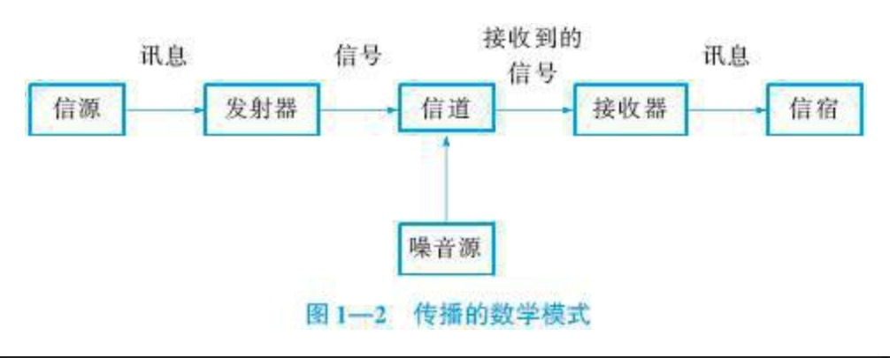

    作者:  刘海龙 
    出版社: 中国人民大学出版社
    副标题: 范式与流派
    出版年: 2008-2-1
    页数: 458
    定价: 48.00元
    装帧: 平装
    ISBN: 9787300086293

[豆瓣链接](https://book.douban.com/subject/3016590/)

<!-- TOC -->

- [第一章　传播的六种话语](#第一章　传播的六种话语)
    - [第一节　什么是话语研究](#第一节　什么是话语研究)
    - [第二节　传播是传递](#第二节　传播是传递)
        - [一、信息与交通运输的隐喻](#一信息与交通运输的隐喻)
        - [二、意义和语言的困境](#二意义和语言的困境)
        - [三、传播的理想与唯我论](#三传播的理想与唯我论)
    - [第三节　传播是控制](#第三节　传播是控制)
        - [一、控制论视角下的传播](#一控制论视角下的传播)
        - [二、控制大众心灵](#二控制大众心灵)
        - [三、传播研究的产生与社会控制](#三传播研究的产生与社会控制)
    - [第四节　传播是游戏](#第四节　传播是游戏)
    - [第五节　传播是权力](#第五节　传播是权力)
    - [第六节　传播是撒播](#第六节　传播是撒播)
    - [第七节　传播是共享和互动](#第七节　传播是共享和互动)
    - [总结](#总结)
- [第二章　大众传播研究史：诠释与建构](#第二章　大众传播研究史诠释与建构)
    - [第三节　修辞学和文学批评传统](#第三节　修辞学和文学批评传统)
        - [一、修辞学的产生](#一修辞学的产生)
        - [三、伯克与新修辞学](#三伯克与新修辞学)
        - [四、叙事范式理论和后现代修辞理论](#四叙事范式理论和后现代修辞理论)
    - [总结](#总结-1)
- [第三章　理论和研究范式](#第三章　理论和研究范式)
    - [第一节　理论与范式](#第一节　理论与范式)
        - [一、什么是理论](#一什么是理论)
        - [二、库恩和范式理论](#二库恩和范式理论)
        - [三、社会科学中研究范式的差异](#三社会科学中研究范式的差异)

<!-- /TOC -->

## 第一章　传播的六种话语
### 第一节　什么是话语研究
话语研究不再关注事物的本质，而是把关注点放在了对事物本质所做出的种种话语的可能性上。

话语分析沿袭了类似的思路，它的目标不是去争论传播到底是什么，而是去研究人们对传播持有哪些不同的看法，它产生的社会语境和知识风尚是什么，为什么人们会接受这种关于传播的看法，其认识论基础（或者福柯所说的知识型）是什么，围绕着某个关于传播的看法，人们形成了什么样的社会实践，这些社会实践反过来又如何影响人们对传播的认识。

之所以要采取这样一种认识传播的方式，原因之一是：传播是一个社会现象，人们对它的定义与理解在不断地变化。问题的关键不在于确定传播客观上是什么，而是人们如何对它做出界定，规定它的功能（比如人们对游戏的态度的变化）。因为这些实践观念才是真正影响我们社会的东西。

第二，传播是一个历史现象，在人类社会实践发展的不同阶段，我们会赋予传播不同的功能。在某个时代，人们会对传播做出新的理解，并不是传播本身发生了变化，而是我们的生活环境、人们的社会实践发生了改变，因此某种对传播的理解的备选项会被大家选中，重新提出。

第三，传播现象的复杂性决定了在某个时期，任何一种对传播的界定都无法概括所有的传播实践。采取某个本质主义的定义，只是为了简化研究对象的权宜之计。

本书根据大众传播研究的历史，把大众传播问题上关于“传播是什么”的话语分成六类，它们分别是：（1）传播是传递；（2）传播是控制；（3）传播是游戏；（4）传播是权力；（5）传播是撒播；（6）传播是共享和互动。

### 第二节　传播是传递
#### 一、信息与交通运输的隐喻
1948年，哈罗德·拉斯韦尔（Harold Lasswell，1902—1978）提出，传播就是谁通过什么渠道向谁传递了什么内容，取得了什么效果，即传播的5W模式（见图1—1），这就是一个典型的传播是传递的定义。

```
Who->Say What->By Which Channel->To Whom->With What Effect
```

Communication这个词最初就有“交通”的意思，难怪中国内地在20世纪50年代引进“大众传播”（mass communication）这个概念时，曾把它翻译成“群众思想交通”（注：参见郑北渭摘译：《美国报纸的职能》，载《新闻学译丛》，1957（2）。）。

#### 二、意义和语言的困境
1948年，两位美国贝尔实验室的工程师申农和韦弗（Claude Elwood Shannon，Warren Weaver）针对通信工程中信息（电流）传递的失真问题，提出了另一个传播模式——数学模式（见图1—2）。

该模式认为，意义的传递，必须要经过一个编码与解码的过程。



#### 三、传播的理想与唯我论
“传播是传递”的话语，所要表达的传播的目的，正是苏格拉底所说的这种传受双方的完全一致，琴瑟和谐。从另一个角度来讲，这一理想其实含有唯我论的意味。（注：参见［美］彼德斯：《交流的无奈——传播思想史》，4页，北京，华夏出版社，2003。）这种一致性，是传者希望受者能与自己取得相同的认识。在传播过程中，“我”成为中心，“我”是否能被真正地理解，是传播成功与否的标志。

### 第三节　传播是控制
#### 一、控制论视角下的传播
如果说“传播是传递”还只是唯我主义的自怜自艾的话，那么“传播是控制”则是以自我为中心的肆意妄为。在科学的名义下，学者们提出了控制论模式（见图1—3）。


#### 二、控制大众心灵
英美等国的政府宣传机构为了获得大众的支持，也违反了传统道德，采取了发布假消息和控制媒体的做法。这些行为在战后引起了很大的争议，一些坚守人文主义的学者坚决反对这一做法，同时对日益侵入公共生活的宣传、公关、广告活动表示担忧。

#### 三、传播研究的产生与社会控制
对传播现象首次开展的系统研究，就产生于这样的社会背景。传播研究奠基人之一的拉斯韦尔在传播的5W模式里，加入了“取得了什么效果”这个要素。这里的效果，是以传播者的意图实现与否作为标准。也就是说，传播活动以实现传播者有意图的控制为目标。

### 第四节　传播是游戏
他给游戏下了一个定义：游戏是一种自愿的活动或消遣，这种活动或消遣是在某一固定的时空范围内进行的；其规则是游戏者自由接受的，但又有绝对的约束力；它以自身为目的并伴有一种紧张、愉快的情感以及对它不同于“日常生活”的意识。（注：［荷］赫伊津哈：《人：游戏者》，34页，贵阳，贵州人民出版社，1998。）这一定义指出了游戏的两个重要特征：（1）具有一定的形式与规则；（2）是人自愿地主观参与，具有非现实性的愉悦和主观体验。

正如乔治·H·米德（George Herbert Mead，1863—1931）所言，游戏是社会生活的模拟演练场，在其中我们学会角色与互动规则。（注：参见［美］乔治·H·米德：《心灵、自我与社会》，上海，上海译文出版社，1992。）传播游戏也具有类似的特点，无论是胡戈的系列搞笑短片还是《超级女声》，作为传播游戏，它们肯定心理愉悦、自我存在、个人自由，通过游戏，发展自我意识，从这个意义上来讲，传播游戏的演练对中国的民主政治的发展具有积极意义，我们应该持宽容的态度。

### 第五节　传播是权力
在《权力论》中，丹尼斯·朗（Dennis H.Wrong）把权力的定义扩大为三种：武力、操纵与说服。大众传播成为第三种权力中非常重要的组成部分。

权力的不平等由经济基础决定，但是却常常表现在语言和象征符号上。

### 第六节　传播是撒播
法国文学批评家和符号学家罗兰·巴尔特把文本分成两种：可读的文本和可写的文本。在他看来，前者是一个以作者为中心的僵化的文本，而后者则是可以让读者最大限度参与的文本盛宴。在完成自己的作品后，作者不再有权力去控制意义的自由发展，解读的权力应该交给读者，文本的意义是由作者与读者共同创造的。他甚至极端地提出，作家本身只是他的文本的代言人，作品先于作家存在，并提出了“作者已死”的惊人之论。

### 第七节　传播是共享和互动
马丁·布伯提出，人与世界的关系可以分为两种，一种是“我—它”关系，另一种是“我—你”关系。在“我—它”关系中，人把周围的人和事物都当成是与“我”相分离的对象，相对立的客体，我们用理性和因果性把它们放到时空网络中把握，以“我”为中心，利用它们，满足“我”的需求。而“我—你”关系中，“我”与“你”不是分离的，而是结为一体，“我”便不是为了功利的目的来建立“关系”，也不会用理性来分析“你”，而是以“我”整个的存在、全部的生命来与“你”相遇。在这个过程中，“你”超越了时空网络，不再是一个有限的存在，而具有永恒性。“我—你”关系摆脱了相互利用的关系，实现了人的存在价值。

巴赫金的对话理论是从解读俄国作家陀斯妥耶夫斯基的小说中发展起来的。他认为，人是社会性的动物，必须依赖他人和其他客体才能完成自我的定位。所以自我中包含他人，自我封闭的个体无法存在。“两个声音才是生命的最低条件，生存的最低条件”，每个人的个性话语也是他人话语的混合体。所以，对话无处不在。对话（dialogue），“是同意或反对关系，肯定和否定关系，问和答的关系”。“对话性是具有同等价值的不同意识之间相互作用的特殊形式”。

杜威认为，外部世界并不是一个可供我们准确复制的图像，并没有一个客观的“真理”或者“事实”。要获得对于外部世界的看法，除了用“眼睛”以外，更重要的是用“耳朵”。民主（或社会）只存在于传播与交流中，我们可以依靠的是大家的协商与同意。因此，他认为，传播就是参与一个共同的世界，而不是共享内在的意识的秘密。要接受者与自己一致，以自己为标准，这根本就没有意义，有意义的是大家正在共享着一些东西，正在认同着一些东西。因此，传播在他的民主理论中，不是手段，而是目的。民主就是共享和传播。

美国学者詹姆斯·卡里（James WCarey，1934—2006）从杜威关于传播的定义中，也发展出了相似的观点。他给传播下的定义是：传播是一个制造、保持、修补和转换现实的象征性过程。通过传播，一定群体的人们共享民族、阶级、性别身份、信仰等，换句话说，他们共享着相同的文化。传播塑造和定义着“我们”，把“我们”与“他们”区别开。

德国学者哈贝马斯（Jüergen Habermas，1929—）在批判真值语义学和意向语义学的基础上，重申了他的普遍语用学观点：人们可以通过传播获得共识，只要保证参与者具有理性，开放、真诚地进行交流，就可以最终达成传通的理想境界。通过传播，我们可以借助主体间性（intersubjectivity），达成共识，交往本身能够最终实现理性对话。对于他来说，同样不存在绝对客观的真理，通过理性交往后被人们认可的，就是最后的真理。在这里，他抛弃了形而上学理论中孤独的主体，从主体间找到了交往的可能性。

“传播是共享和互动”是对“科学化”的传播理念的反拨。在“传播是传递”、“传播是控制”中，个人和社群的价值被忽略，人被量化为一些外在的人口统计学指标或者是抽象的概念。通过计算这些指标间统计关系或概念推导，得出社会的“规律”。20世纪后期，这一做法遭受了两股学术思潮的批判。

第一是文化人类学。简言之，如果人是悬挂在由他们自己编织的意义之网上的动物，文化就是这些网，因而文化的分析不是一种探索规律的实验科学，而是一种探索意义的阐释性科学。

第二是社群主义。自20世纪80年代以来，一些西方政治学者对以个体主义为前提的自由主义展开了批评，认为它们从方法上把社会看做是由原子化的个体组成的简单集合，忽视了家庭、社区、阶级、国家、民族、团体等社群。正是后面这些集体才是历史事件和政治经济制度的原始动因。人总是生活在一定的环境之中，他所在群体的文化传统会影响人们对于正义、自由等基本问题的看法，并不存在像自由主义者所说的超越文化的绝对的正义、自由等概念。（注：参见俞可平：《社群主义》（修订版），北京，中国社会科学出版社，2005。）

### 总结
本章的目的是要回答这样一个问题：传播究竟是什么？

在回答这个问题之前，我们首先更新了我们的研究工具。我们没有采用传统的本质定义的方法，而是换了一种话语分析的方法。这种方法不是去争论是非对错，得出一个“传播是什么”的终极答案，而是以旁观者的眼光，看待古往今来的智者们对这一问题的看法。

接下来，我们用这样一种中立的方法，考察了6种和大众传播相关的传播话语：

- 传播是传递。传播是信息的传递。
- 传播是控制。传播是传者控制受者的过程。
- 传播是游戏。传播是传者进行的主观游戏。
- 传播是权力。传播中渗透着无形的权力，语言中蕴含着让我们觉察不到的强迫。
- 传播是撒播。传播应该是一种绝对自由的没有控制的过程。
- 传播是共享和互动。传播是彼此平等的交流和对话，在其中传受双方获得相互理解和共识。

## 第二章　大众传播研究史：诠释与建构
### 第三节　修辞学和文学批评传统
#### 一、修辞学的产生
亚里士多德认为，一个成功的演讲，取决于三个因素：演讲者的品格（ethos）、演讲内容的逻辑（logos）和对受众的感情诉求（pathos）。传播者的性格、智慧、信誉、可信度、亲切程度以及是否在该题目上具有发言权都会影响演讲的效果。

#### 三、伯克与新修辞学
修辞学也经历了新亚里士多德学派到新修辞学的理论发展。美国学者肯尼斯·伯克（Kenneth Burke）在这一转向过程中起到了关键性作用，他也是新修辞学中戏剧理论（dramatism）的代表人物。

伯克曾经对人下了一个非常著名的定义：“人（man）是使用象征的动物，否定的发明者，用自己制造的工具将自己与自然分离，受等级精神的驱使因完美而堕落。”（注：［美］肯尼斯·伯克等：《当代西方修辞学：演讲与话语批评》，16页，北京，中国社会科学出版社，1998。）我们可以把这一定义分解成下面五个部分：

1. 我们是通过象征符号来认识现实的，我们的学习就是在不同的象征符号之间建立联系。因此，我们对现实的反应都是以象征符号为中介的。人们常说“君子远庖厨”，意思是说如果我们真的参观了厨房之后，看到制作过程，就会食不甘味。显然，这个反应不是对食物本身的反应（我们或许一开始觉得很美味），而是对代表这种食物的符号的反应。
1. 人发明了否定的观念。在自然界，只有肯定，没有否定。在动物的世界里，只有“有”和“无”（idea of nothing）的概念，没有“要”和“不要”（idea of no，idea of don't）的概念。动物只会把A与B（不好的事物）联系起来，只有人才有期望没有实现而产生的那种失望的感觉，所以人是否定的发明者。
1. 人发明了技术，创造了“第二自然”，并且我们无法离开这些技术，比如我们很难想象没有电、没有汽车、没有自来水和煤气会怎样。
1. 通过语言，我们创造了不同的等级，而等级制度正是我们罪恶感的来源。如果我们高高在上，我们会感到我们的权力来自于那些无权者的牺牲。这种感觉导致罪恶感。正因为有了“应该”和“不应该”的概念，所以我们的道德观念得到强化。
1. 语言让我们抽象地思考“善”与“恶”、“对”与“错”，幻想达到完美，但是现实却常常不会像语言所描述得那样完美，于是我们产生罪恶感，要么归罪于自己，憎恶自我，要么归罪于他人，让他人成为替罪羊，通过这些方式，人们达到净化自己、消除罪恶感的目的。

显然，语言和修辞成为伯克理论的核心。他在《动机的修辞》中进一步提出，人是通过语言来改变态度并诱发行为的。因此，社会环境中修辞无处不在。人只要使用语言，就会引起他人或自己的态度和行为的变化。这就突破了亚里士多德修辞学中修辞仅限于演讲等有限话语环境的界定，修辞被扩大到人类的所有活动，甚至人成为使用修辞的动物，这就从本体论上强调了修辞在人类社会中所起到的重要作用。这是新、旧修辞学的一个重要区别。

此外，传统修辞学和新修辞学的不同还表现在：传统修辞学的关键概念是说服，它强调的是故意的设计，而新修辞学的关键概念是身份认同，它可能包括部分“潜意识”的因素。

与前面亚里士多德所说的“修辞是使真理更有效的手法”的看法不同，新修辞认为，修辞具有认知性，即客观的真理是不存在的，我们是通过与他人的修辞和交流来获得共识，共享不同的主观经验。我们通过理性的交流创造真理，在新实用主义者那里，修辞与发现真理成为同一个过程。

#### 四、叙事范式理论和后现代修辞理论
除了伯克的戏剧理论以外，比较有影响的新修辞学的代表理论还有费希尔的叙事范式理论。该理论认为，有相当多的传播都是叙事和讲故事，人们接受一种说法和拒绝一种说法，并没有绝对的标准，人们会根据故事是否合情合理，或者理由是否充分（good）而决定接受哪些故事，拒绝哪些故事。所谓“好理由”，就是看上去前后一致和非常逼真的理由，只要对方所说的不存在矛盾并且具有很高的清晰度，我们就会接受对方的说法。人不是一个绝对理性的辩论者，而是一个用故事的逻辑来做出选择的听故事者。世界就是由一系列故事组成的，我们在其中进行选择，体会到不同的生活经验，从而重新创造自己的生活。

后现代主义对修辞研究的影响非常深远，它更加强调现实世界的符号化，甚至把这种看法推到极端，比如鲍德里亚提出真实已经不存在，只有拟像对现实的拟仿，而这种拟仿甚至变得比真实更真，这个世界只剩下符号的碎片。而且后现代主义者在考察了话语和权力后提出，包括现代科学在内的一切理性都是权力的产物，不存在客观的立场。

### 总结
这里以传播影响研究为主线，把整个发展过程分成四个阶段，每阶段的特征如表2—2所示。


## 第三章　理论和研究范式
### 第一节　理论与范式
#### 一、什么是理论
简单来说，理论就是为了解释某个现象，按照一定的规范所抽象出来的概念体系。一个理论包括如下几个特征。

1. 理论的目标是对某个现象做出解释。
1. 理论是一个概念体系。理论由两个部分组成，一是概念，二是概念之间的联系。
    - 概念可以分成两大类，一类是具体的概念，一类是抽象的概念。具体的概念是我们能够直接观察到的，比如身高、商品购买等；抽象的概念是无法直接观察的现象，比如智商、态度等。
    - 比概念更高一层的基本元素是命题。命题是对概念之间的关系的判断。概念之间的关系很多，比如相关、因果关系等。
1. 理论的建立必须遵循规范的程序。

#### 二、库恩和范式理论
库恩把不同的学者之间所持有的这种不可通约的（incompatible）研究范例称做范式（paradigm）。范式的特点表现在三个方面：

1. 它是指导一个学术群体中大部分成员的范例和前提假设，它指导人们发现问题、解决问题。
1. 范式是一个学术共同体（community）公认并共享的世界观，围绕着某个范式会形成“无形的学院”。范式本身没有绝对的优劣之分，如果一个范式的拥护者压倒多数，那么这个范式就会成为主流范式。当然，任何一个科学革命或新范式的初期，接受的学者数量比较少，常常会受到打压，但是随着范式的相对优势被越来越多的学者所认识，它就会成为主流范式。
1. 不同学术共同体之间的范式是不可通约的，它们相互矛盾、针锋相对。如果学者们之间在学术观点上缺乏冲突，可以认为他们所采取的范式比较接近。

#### 三、社会科学中研究范式的差异
范式是一个学术共同体公认并共享的思维方式，从哲学层面来讲，每一个范式会在本体论、认识论、价值论三个方面存在差异。

`本体论（ontology）`，从狭义上看，可以按照字面意思理解为是关于存在（on）的理论（logos）。有学者认为，中文的翻译不够准确，“实在论”更为贴切。广义的本体论既是关于存在的理论，也是关于实体的理论或关于本体的理论，它涵盖了人们通常所说的存在论、形而上学和本体论的内容，也就是与存在相关的一系列问题和人们对这些问题的回答。

在社会科学中，目前关于现象世界性质的流行看法，大致可以分为两种：一种是客观经验主义的，一种是诠释经验主义的。经验主义是与唯理主义相对的，它认为关于世界的看法应该从观察和实验中获得，而不能仅仅依靠思辨和逻辑推理。客观经验主义认为：

1. 世界是自然形成的；
1. 世界独立于人的认知，但又可以被人所认识；
1. 世界的特征、运动与其他现象之间存在一定的联系和规律；
1. 自然和社会具有相似的特点，现象世界具有统一性，社会行为可以还原为物理的或化学的现象；
1. 每个现象都是之前现象的结果，并且会导致其他现象（决定论）。简而言之，客观经验主义认为现象世界是唯物的、独立的（不受人的主观影响）、决定的和统一的。

诠释经验主义则认为：

1. 不同领域的知识不可通约；
1. 符号先于物质，人们是对约定俗成的象征符号的意义做出反应；
1. 所有的现象不具有共同的基础，不能简单还原为物理或化学现象；
1. 人具有能动性，不会被结构所简单决定，即使存在结构，结构本身也是人们建构的；
1. 现象世界不可统一，社会与自然具有不同的特征。

`认识论`要回答的是我们能否认识世界，如果可以，通过什么方式才能认识世界，如何保证我们的认识是可靠的等问题。简单来说，就是“我如何知道我知道”。认识论与本体论互为条件，我们在对世界的性质做出判断的时候，就必须对这个认识的正确性做出证明；同时，我们要先承认世界的存在及其性质，确定对象，然后才能谈得上对世界的认识。

和上面两种关于世界性质的判断相对应，认识论也可以分为客观经验主义的和诠释经验主义的两种。客观经验主义认为：

1. 观察是不可错的，观察者不会对观察对象产生影响；
1. 世界存在着规律，规律是客观的，我们可以通过特殊的测量方法认识这些规律；
1. 理论与观察相互独立，研究者的好恶和其他特征不会影响其客观的判断与分析；
1. 大部分现象是可以测量的，我们可以用数学的逻辑来表示人类行为；
1. 个体是由一些属性和结构所决定的，比如年龄、性别、智商等；
1. 我们可以通过对个体可测量的特征的研究，推断群体的特征；
1. 结论的得出必须通过实证主义（或证明主义、证伪主义）的检验程序。

诠释经验主义则认为：

1. 我们所研究的生活世界中，意义和意识形态无处不在，被研究对象既是能动的行动者，也是诠释的主体；
1. 实在（reality）是建构的而不是客观的，因此只有参与才能做出解释，研究者只是一个帮助被研究对象诠释自己行为的助产士；
1. 重要的不是客观的测量，而是参与的理解，参与本身和客观经验主义中的观察一样受到信任；
1. 社会行动者具有能动性；
1. 虽然诠释经验主义也关注个人的诠释，但是整体和关系要比部分更为重要；
1. 科学研究本身也是社会行动，会对社会产生影响，因此要注意研究者的意识形态，分析本身应该具有反思性。

价值，就是事物服从于人的目的或需要的“有用性”。价值论涉及的是什么事情值得我们研究，社会中的学术研究究竟是什么，会起到什么后果的问题。客观经验主义认为科学研究的目的就是解释世界，是一种价值中立（value free）的活动。而马克思主义和后现代主义则让人们关注到知识与意识形态、权力之间的复杂关系，科学研究本身也面临着哈贝马斯所说的“合法性危机”。大多数研究者不再采取这种极端的立场，在研究中的价值问题上形成了三种不同的态度。


