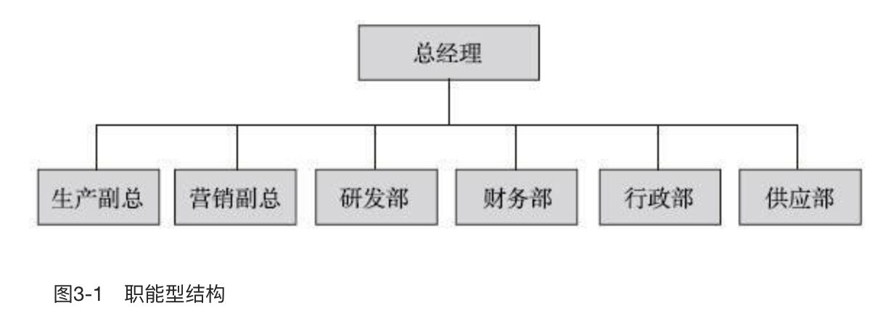
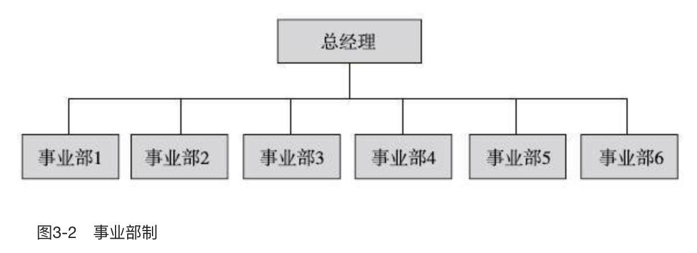
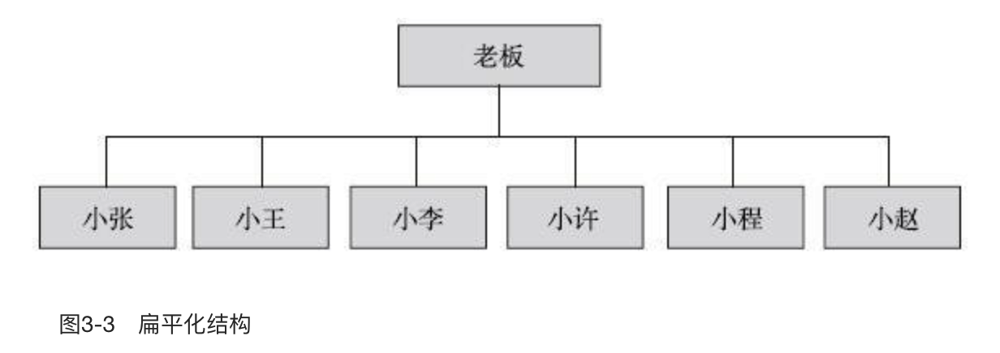
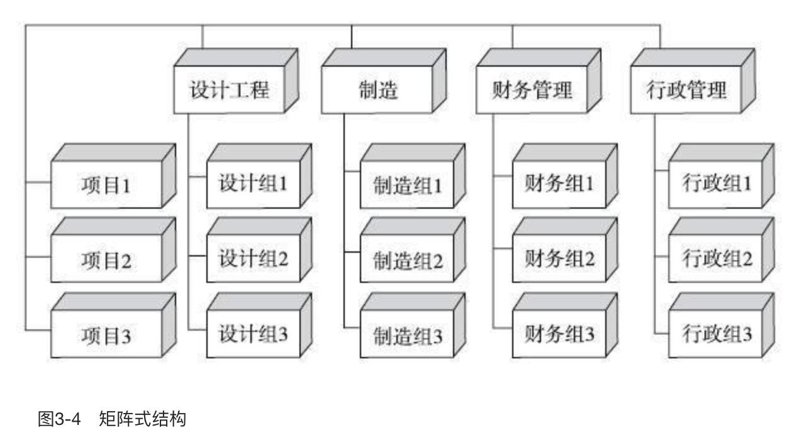
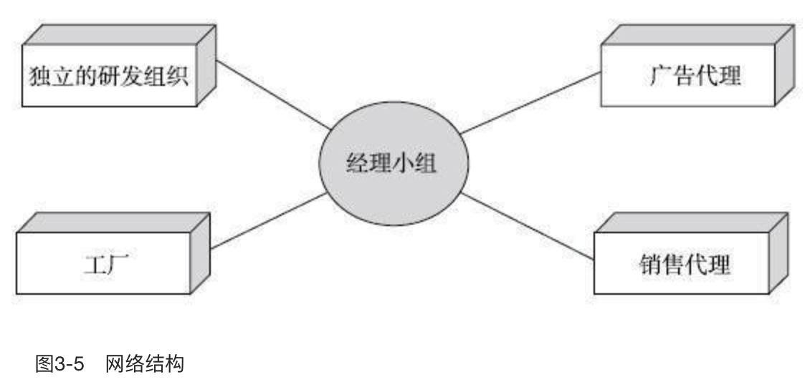
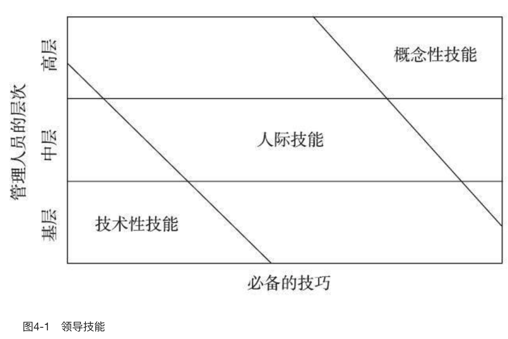
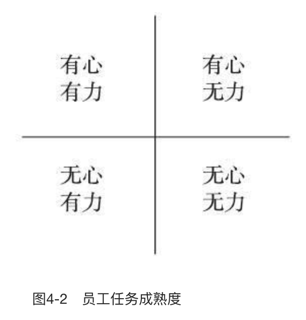
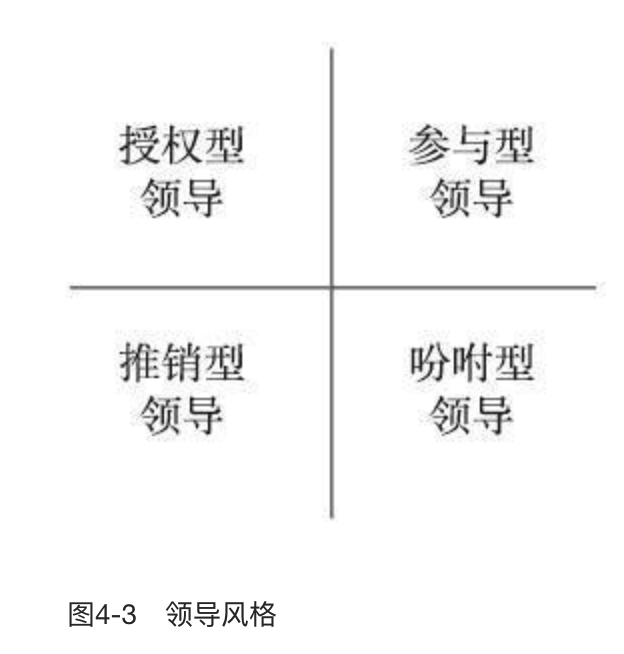

    作者: 陈春花 
    出版社: 机械工业出版社
    副标题: 让管理发挥绩效的8个基本概念(修订版)
    出版年: 2016-10-9
    页数: 173
    定价: 45
    装帧: 平装
    ISBN: 9787111548782

[豆瓣链接](https://book.douban.com/subject/26901342/)

- [第1章 什么是管理](#%e7%ac%ac1%e7%ab%a0-%e4%bb%80%e4%b9%88%e6%98%af%e7%ae%a1%e7%90%86)
  - [管理的理解](#%e7%ae%a1%e7%90%86%e7%9a%84%e7%90%86%e8%a7%a3)
  - [我倡导的管理观](#%e6%88%91%e5%80%a1%e5%af%bc%e7%9a%84%e7%ae%a1%e7%90%86%e8%a7%82)
  - [管理解决的三个效率](#%e7%ae%a1%e7%90%86%e8%a7%a3%e5%86%b3%e7%9a%84%e4%b8%89%e4%b8%aa%e6%95%88%e7%8e%87)
    - [管理解决的第一个效率：使劳动生产率最大化的手段是分工](#%e7%ae%a1%e7%90%86%e8%a7%a3%e5%86%b3%e7%9a%84%e7%ac%ac%e4%b8%80%e4%b8%aa%e6%95%88%e7%8e%87%e4%bd%bf%e5%8a%b3%e5%8a%a8%e7%94%9f%e4%ba%a7%e7%8e%87%e6%9c%80%e5%a4%a7%e5%8c%96%e7%9a%84%e6%89%8b%e6%ae%b5%e6%98%af%e5%88%86%e5%b7%a5)
    - [管理解决的第二个效率：使组织效率最大化的手段是专业化水平和等级制度的结合](#%e7%ae%a1%e7%90%86%e8%a7%a3%e5%86%b3%e7%9a%84%e7%ac%ac%e4%ba%8c%e4%b8%aa%e6%95%88%e7%8e%87%e4%bd%bf%e7%bb%84%e7%bb%87%e6%95%88%e7%8e%87%e6%9c%80%e5%a4%a7%e5%8c%96%e7%9a%84%e6%89%8b%e6%ae%b5%e6%98%af%e4%b8%93%e4%b8%9a%e5%8c%96%e6%b0%b4%e5%b9%b3%e5%92%8c%e7%ad%89%e7%ba%a7%e5%88%b6%e5%ba%a6%e7%9a%84%e7%bb%93%e5%90%88)
  - [管理解决的第三个效率：使个人效率最大化的手段是个人创造组织环境，满足需求，挖掘潜力](#%e7%ae%a1%e7%90%86%e8%a7%a3%e5%86%b3%e7%9a%84%e7%ac%ac%e4%b8%89%e4%b8%aa%e6%95%88%e7%8e%87%e4%bd%bf%e4%b8%aa%e4%ba%ba%e6%95%88%e7%8e%87%e6%9c%80%e5%a4%a7%e5%8c%96%e7%9a%84%e6%89%8b%e6%ae%b5%e6%98%af%e4%b8%aa%e4%ba%ba%e5%88%9b%e9%80%a0%e7%bb%84%e7%bb%87%e7%8e%af%e5%a2%83%e6%bb%a1%e8%b6%b3%e9%9c%80%e6%b1%82%e6%8c%96%e6%8e%98%e6%bd%9c%e5%8a%9b)
  - [如何让管理有效](#%e5%a6%82%e4%bd%95%e8%ae%a9%e7%ae%a1%e7%90%86%e6%9c%89%e6%95%88)
  - [企业组织的管理内容](#%e4%bc%81%e4%b8%9a%e7%bb%84%e7%bb%87%e7%9a%84%e7%ae%a1%e7%90%86%e5%86%85%e5%ae%b9)
    - [计划管理：回答资源与目标是否匹配的问题](#%e8%ae%a1%e5%88%92%e7%ae%a1%e7%90%86%e5%9b%9e%e7%ad%94%e8%b5%84%e6%ba%90%e4%b8%8e%e7%9b%ae%e6%a0%87%e6%98%af%e5%90%a6%e5%8c%b9%e9%85%8d%e7%9a%84%e9%97%ae%e9%a2%98)
    - [流程管理：解决人与事是否匹配的问题](#%e6%b5%81%e7%a8%8b%e7%ae%a1%e7%90%86%e8%a7%a3%e5%86%b3%e4%ba%ba%e4%b8%8e%e4%ba%8b%e6%98%af%e5%90%a6%e5%8c%b9%e9%85%8d%e7%9a%84%e9%97%ae%e9%a2%98)
    - [组织管理：回答权力与责任是否匹配的问题](#%e7%bb%84%e7%bb%87%e7%ae%a1%e7%90%86%e5%9b%9e%e7%ad%94%e6%9d%83%e5%8a%9b%e4%b8%8e%e8%b4%a3%e4%bb%bb%e6%98%af%e5%90%a6%e5%8c%b9%e9%85%8d%e7%9a%84%e9%97%ae%e9%a2%98)
    - [战略管理：解决企业核心能力的问题](#%e6%88%98%e7%95%a5%e7%ae%a1%e7%90%86%e8%a7%a3%e5%86%b3%e4%bc%81%e4%b8%9a%e6%a0%b8%e5%bf%83%e8%83%bd%e5%8a%9b%e7%9a%84%e9%97%ae%e9%a2%98)
    - [文化管理：解决企业持续经营的问题](#%e6%96%87%e5%8c%96%e7%ae%a1%e7%90%86%e8%a7%a3%e5%86%b3%e4%bc%81%e4%b8%9a%e6%8c%81%e7%bb%ad%e7%bb%8f%e8%90%a5%e7%9a%84%e9%97%ae%e9%a2%98)
- [第2章 什么是组织](#%e7%ac%ac2%e7%ab%a0-%e4%bb%80%e4%b9%88%e6%98%af%e7%bb%84%e7%bb%87)
  - [组织的理解](#%e7%bb%84%e7%bb%87%e7%9a%84%e7%90%86%e8%a7%a3)
  - [组织因目标而存在](#%e7%bb%84%e7%bb%87%e5%9b%a0%e7%9b%ae%e6%a0%87%e8%80%8c%e5%ad%98%e5%9c%a8)
  - [组织内的关系是奉献关系](#%e7%bb%84%e7%bb%87%e5%86%85%e7%9a%84%e5%85%b3%e7%b3%bb%e6%98%af%e5%a5%89%e7%8c%ae%e5%85%b3%e7%b3%bb)
  - [组织处在不确定的商业世界中](#%e7%bb%84%e7%bb%87%e5%a4%84%e5%9c%a8%e4%b8%8d%e7%a1%ae%e5%ae%9a%e7%9a%84%e5%95%86%e4%b8%9a%e4%b8%96%e7%95%8c%e4%b8%ad)
- [第3章 什么是组织结构](#%e7%ac%ac3%e7%ab%a0-%e4%bb%80%e4%b9%88%e6%98%af%e7%bb%84%e7%bb%87%e7%bb%93%e6%9e%84)
  - [组织结构是自我约定的关系](#%e7%bb%84%e7%bb%87%e7%bb%93%e6%9e%84%e6%98%af%e8%87%aa%e6%88%91%e7%ba%a6%e5%ae%9a%e7%9a%84%e5%85%b3%e7%b3%bb)
  - [组织结构的功效](#%e7%bb%84%e7%bb%87%e7%bb%93%e6%9e%84%e7%9a%84%e5%8a%9f%e6%95%88)
  - [组织结构设计原则](#%e7%bb%84%e7%bb%87%e7%bb%93%e6%9e%84%e8%ae%be%e8%ae%a1%e5%8e%9f%e5%88%99)
  - [组织结构需要配合企业发展的需要](#%e7%bb%84%e7%bb%87%e7%bb%93%e6%9e%84%e9%9c%80%e8%a6%81%e9%85%8d%e5%90%88%e4%bc%81%e4%b8%9a%e5%8f%91%e5%b1%95%e7%9a%84%e9%9c%80%e8%a6%81)
  - [组织结构特殊效能](#%e7%bb%84%e7%bb%87%e7%bb%93%e6%9e%84%e7%89%b9%e6%ae%8a%e6%95%88%e8%83%bd)
  - [常用组织结构优劣势分析](#%e5%b8%b8%e7%94%a8%e7%bb%84%e7%bb%87%e7%bb%93%e6%9e%84%e4%bc%98%e5%8a%a3%e5%8a%bf%e5%88%86%e6%9e%90)
    - [职能型结构](#%e8%81%8c%e8%83%bd%e5%9e%8b%e7%bb%93%e6%9e%84)
    - [事业部制](#%e4%ba%8b%e4%b8%9a%e9%83%a8%e5%88%b6)
    - [扁平化结构](#%e6%89%81%e5%b9%b3%e5%8c%96%e7%bb%93%e6%9e%84)
    - [矩阵式结构](#%e7%9f%a9%e9%98%b5%e5%bc%8f%e7%bb%93%e6%9e%84)
    - [网络结构](#%e7%bd%91%e7%bb%9c%e7%bb%93%e6%9e%84)
- [第4章 什么是领导](#%e7%ac%ac4%e7%ab%a0-%e4%bb%80%e4%b9%88%e6%98%af%e9%a2%86%e5%af%bc)
  - [领导的理解](#%e9%a2%86%e5%af%bc%e7%9a%84%e7%90%86%e8%a7%a3)
  - [领导者和管理者](#%e9%a2%86%e5%af%bc%e8%80%85%e5%92%8c%e7%ae%a1%e7%90%86%e8%80%85)
  - [领导技能](#%e9%a2%86%e5%af%bc%e6%8a%80%e8%83%bd)
  - [应该适应领导者的风格而非改变他](#%e5%ba%94%e8%af%a5%e9%80%82%e5%ba%94%e9%a2%86%e5%af%bc%e8%80%85%e7%9a%84%e9%a3%8e%e6%a0%bc%e8%80%8c%e9%9d%9e%e6%94%b9%e5%8f%98%e4%bb%96)
  - [没有不好的士兵，只有不好的将军](#%e6%b2%a1%e6%9c%89%e4%b8%8d%e5%a5%bd%e7%9a%84%e5%a3%ab%e5%85%b5%e5%8f%aa%e6%9c%89%e4%b8%8d%e5%a5%bd%e7%9a%84%e5%b0%86%e5%86%9b)
  - [找到途径满足需求，目标就会达成](#%e6%89%be%e5%88%b0%e9%80%94%e5%be%84%e6%bb%a1%e8%b6%b3%e9%9c%80%e6%b1%82%e7%9b%ae%e6%a0%87%e5%b0%b1%e4%bc%9a%e8%be%be%e6%88%90)
  - [对职业经理人的管理方式](#%e5%af%b9%e8%81%8c%e4%b8%9a%e7%bb%8f%e7%90%86%e4%ba%ba%e7%9a%84%e7%ae%a1%e7%90%86%e6%96%b9%e5%bc%8f)

## 第1章 什么是管理
### 管理的理解
1. 管理就是让下属明白什么是最重要的
2. 管理不谈对错，只是面对事实，解决问题
3. 管理是“管事”而不是“管人”
4. 衡量管理水平的唯一标准是能否让个人目标与组织目标合二为一
5. 管理就是让一线员工得到并可以使用资源，对于管理的资源而言，最重要的是人力资源和财力资源

### 我倡导的管理观
1. 管理只对绩效负责
   1. 现象一：功劳与苦劳。人们常常以苦为乐，认为付出就是对得起组织，但是我们都很清楚，只有功劳才会产生绩效，苦劳不产生绩效。
   2. 现象二：能力与态度。过多关注态度，结果就会导致组织中能干的人干死，不能干的人活得很好，原因是你关心态度而不是能力，让态度好的人得到肯定，结果导致大家关心态度，而不愿意真正地用能力说话。可是，只有能力才会产生绩效，态度必须转化为能力才会产生绩效。
   3. 现象三：才干与品德。德与才的取舍中人们希望德才兼备，如果两者不可兼得人们选择先德后才。
2. 管理是一种分配
   1. 管理其实很简单，它只是需要做一个分配就好了，就是分配权力、责任和利益。但是需要特别强调的是，必须把`权力`、`责任`和`利益`等分，成为一个等边三角形。
   2. 管理是在责任的基础上所做的行为选择，如果是这样的话，我们需要在界定责任的同时，配备合适的资源，并让人们可以分享到管理所获得的结果。
   3. 我强调把责任分下去，还有一个更重要的意义，就是只有分配责任，人才会真正地被培养起来。没有责任，人就无法真正激发出能力和热情，也无法真正发挥作用。
3. 管理始终为经营服务
   1. 管理做什么，必须由经营来决定。
   2. 管理水平不能够超越经营水平。

### 管理解决的三个效率
#### 管理解决的第一个效率：使劳动生产率最大化的手段是分工
泰勒用一生的时间所要探讨的问题，恰恰是管理的本质问题：管理要解决的就是如何在有限的时间里获取最大限度的产出，也就是如何使生产率最大化。泰勒在《科学管理原理》一书中，清晰地阐述了获得劳动生产率最大化的四条原理。

- 科学划分工作元素。
- 员工选择、培训和开发。
- 与员工经常沟通。
- 管理者与员工应有平等的工作和责任范围。

#### 管理解决的第二个效率：使组织效率最大化的手段是专业化水平和等级制度的结合
从理论上讲，韦伯组织管理的原则约定：权力是组织而非个人。组织管理的核心就是让权力从个人的身上回归到职位上，也就是组织本身上，只有在这种情况下管理效率才会得到最大化。

组织效率最大化的手段是专业化水平和等级制度的结合。

一方面我们需要强化专业化的能力，无论是管理者、领导者还是基层人员，只有贡献了专业化的水平，我们才能算是胜任了管理工作；另一方面需要明确的分责分权制度，只有职责清晰的分工，权力明确的分配，等级安排合理，组织结构有序，管理的效能才会有效地发挥。专业化水平和等级制度的结合正是组织效率最大化的来源。

### 管理解决的第三个效率：使个人效率最大化的手段是个人创造组织环境，满足需求，挖掘潜力
把员工需求和组织发展的目标联结在一起，还有短期目标和长期目标冲突的问题，虽然复杂但管理必须平衡这些目标和冲突，不能够只关注组织目标而忽略了个人的需求，也不能够只强调个人需求而伤害组织目标，只有两者都能够得到关注并实现，管理才能够有效。因此，我认为能够让组织目标和个人目标合二为一的激励就是有效的激励。

管理正是要解决企业的三个问题：第一，如何使劳动生产率最大化？第二，如何使组织效率最大化？第三，如何使个人效率最大化？这三个问题正是管理的基本问题，或者说管理实现效率就是实现劳动效率、组织效率、个人效率。

### 如何让管理有效
管理者就承担了这个最重要的使命：提升整体的力量，延续个体的价值。

传统管理者与有效管理者的区别是什么？在德鲁克先生看来，传统管理者专注于烦琐的事务，因为他们只是关心发生的事务，所以这些管理者所有的时间都在处理别人的事情上，简单地说，就是传统管理者的**时间属于别人**，这是传统管理者的第一个特征。传统管理者的第二个特征是：身在岗位上，处在什么岗位上，就用什么样的思维方式来看待问题，所以导致部门之间的不合作，导致很多管理者 **“屁股指挥脑袋”** ，不知道整个系统所需要的条件是什么。传统管理者的第三个特征是只专注于事务，忽略了对人的培养，他们总是认为没有人能够成长起来，下属总是不能够很好地完成任务。

有效的管理者具有什么样的特征呢？有效管理者的第一个特征就是**进行时间管理**。有效管理其实是时间管理，他们能够确定重要的事情，确定优先顺序，确定重要的事情一定会有合适的时间进行安排，确定每一件事情都有时间的设定，都能够合理地解决。在有效管理者那里，不存在“忙”这个概念，所有的事情都会有序和合理，进而也就有效。有效管理者的第二个特征是**系统思考**。对于每一个人而言，如何在组织里发挥作用，如何寻找到合适的位置，取决于如何思考，如果不能够认识到个人和组织的关系，不能够认识到整体和局部的关系，无论这个人能力多强，也无法发挥作用。只有认识到整体最大，局部和个人服从整体的时候，借助整体的力量，局部和个人才会发挥最大的效能。有效管理者的第三个特征是**培养人**。对于人的培养是管理者最根本的职责所在，如果可以让每一个成员成长起来，管理的绩效就会得以发挥，如果可以让每一个成员胜任职责，组织的效率就会提升，因而培养人是有效管理者的特征。

### 企业组织的管理内容
#### 计划管理：回答资源与目标是否匹配的问题
计划管理要解决的问题，不是数据，不是年终的考核指标，更不是文本。计划管理要解决的问题是目标和资源之间关系是否匹配的问题，计划管理就是要目标与资源的关系处在匹配的状态，这是一个最为基础的管理内容。因此，计划管理由三个关键元素构成：目标、资源和两者匹配的关系。

目标是计划管理的基准。计划管理在管理理论中也被确认为目标管理。目标管理的实现需要三个条件：

1. 高层强有力的支持；
2. 目标要能够检验；
3. 使目标清晰。

资源是计划管理的对象。**计划管理事实上是管理资源，而不是管理目标**。

#### 流程管理：解决人与事是否匹配的问题
如果简单描述流程管理，其实就是人人有事做，事事有人做。实现流程管理需要改变管理的一些习惯，我简单归纳为三点：

1. 打破职能习惯；
2. 培养系统思维习惯；
3. 形成绩效导向的企业文化。

打破职能习惯。职能导向侧重于对职能的管理和控制，关注部门的职能完成程度和垂直性的管理控制，部门之间的职能行为往往缺少完整有机的联系。它没有确定时间标准，这一最重要的工作标准一般是由该部门的主管领导临时确定的，这就大幅加重了主管领导的工作量，又由于标准不确定，导致整体工作效率大幅降低。因此，我们必须打破职能的习惯。

培养系统思维习惯。流程导向侧重的是目标和时间，即以顾客、市场需求为导向，将企业的行为视为一个总流程上的流程集合，对这个集合进行管理和控制，强调全过程的协调及目标化。每一件工作都是流程的一部分，是一个流程的节点，它的完成必须满足整个流程的时间要求，时间是整个流程中最重要的标准之一。因此在流程的前提下，时间作为基本坐标决定了我们需要系统地思考问题，而不是仅仅依据自己所在的部门或者所处的位置，我们必须学会系统思维，形成绩效导向的企业文化。

形成绩效导向的企业文化。“人人都有一个市场，人人都面对一个市场”，实施流程导向中激励各成员共同追求流程的绩效，重视顾客需求的价值是海尔实施流程管理的一种灌输方式，这种方式恰恰让我们看到形成以绩效为导向的企业文化是流程管理的保障。通过让员工理解的概念，激励每个员工参与流程再造，重视员工的建议，等等，以完成这个艰巨的管理方式的改变，没有这样的文化氛围，流程管理只能是流于形式，这也是中国有的企业引入流程再造不能够取得成功的根本原因。

#### 组织管理：回答权力与责任是否匹配的问题
实现组织管理需要两个条件：专业化与分权。

#### 战略管理：解决企业核心能力的问题
有三个基本特征组成了企业的核心竞争力：

1. 核心竞争力提供了进入多样化市场的潜能；
2. 核心竞争力应当对最终产品中顾客重视的价值做出关键贡献；
3. 核心竞争力应当是竞争对手难以模仿的能力。

#### 文化管理：解决企业持续经营的问题
企业为什么或者追求什么样的目标，肩负何种使命，拥有什么样的价值标准，是企业是否可以持续的根本因素，而这些问题的回答正是企业文化所承担的责任。

从管理方式的角度定量，管理方式对企业文化的推动有这样的发展过程：人事制度→人的管理→企业管理方式→核心价值观→企业文化。随着企业的发展，企业文化的发展通常历经企业家个性魅力（企业家文化）→团队个性魅力（团队文化）→企业个性魅力（企业文化）→最终形成的社会个性魅力（竞争性文化）。

计划管理、流程管理和组织管理被称为基础管理，这是企业生存的关键。战略管理和文化管理是更高一个层面的管理，不要把战略管理和文化管理放在企业管理的基础上来做，那样会适得其反。

## 第2章 什么是组织
### 组织的理解
在我看来：**组织的存在是为了实现目标，组织管理的存在是为了提升效率**。

1. “公司不是一个家”。
   1. 当我们说“公司不是一个家”的时候，就表明组织不会照顾个人，也就意味着在组织中我们是用目标、责任、权力来联结，而不是用情感来联结的。组织有正式组织与非正式组织之分。正式组织就是指运用权力、责任和目标来联结人群的集合；非正式组织是指用情感、兴趣和爱好来联结人群的集合。我们在管理概念下主要是谈正式组织。
   2. 组织结构设计从本质意义上讲就是一个分权、分责的设计。
2. 组织必须保证一件事由同一组人承担。
   1. 同一个权力、责任和目标必须是同一组人承担。在组织中看到结构臃肿、效率低下、人浮于事、责任不清、互相推诿的情况出现的时候，你必须先看看是否存在同一件事情有两组人在做，同一个责任有两组人在承担，同一个权力有两组人在使用，这是出现上述情况的原因所在。这些情况我们可以用一个词来表述，这个词就叫`“组织虚设”`。
3. 在组织中人与人公平而非平等。
   1. 在一个组织结构中，人与人之间是以实现目标为前提的生存，人与人应该承担各自的责任和目标，从而拥有了不同的权力，因为这些的不同，所以人与人应该是公平的但非平等的。
4. 分工是个人和组织联结的根本方法。
   1. 组织的分工主要是分配责任和权力。

### 组织因目标而存在
不同的目标设计就会导致不同的人群聚集在一起，也决定了人们不同的行为选择和价值判断，因此目标决定组织存在的意义。

其实对于企业组织而言，它的目标非常简单：**持续的获利能力**。一般认为，合理的战略始于确立正确的目标。而我可以套用迈克尔·波特的观点：能支持合理战略的唯一目标就是超强持续的盈利能力。

### 组织内的关系是奉献关系
奉献关系所产生的基本现象是：每个处于流程上的人更关心他能够为下一个工序做什么样的贡献；每个部门都关心自己如何调整才能够与其他部门有和谐的接口；下级会关注自己怎样配合才能够为上级提供支持，而上级会要求自己为下级解决问题并提供帮助。

如何让组织关系变成奉献的关系。我想也许可以从以下几个方面来着手。

1. 工作评价来源于工作的相关者。
2. “绝不让雷锋吃亏”，这是华为公司企业文化中非常重要的一个准则。
3. 激励和宣扬组织的成功而不是个人的成功。

### 组织处在不确定的商业世界中
1. 管理者需要学会混沌的思维方式
   1. 混沌的思维方式是相对于稳定均衡的思维方式而言的。稳定均衡的思维方式是我们习惯的组织管理思维方式，这种思维方式最在意的是如何确保所有的行动回归到预定的计划上来，管理者所努力的方向是保证结果与计划相符，所以在发挥管理职能的时候会坚持控制和计划这两个管理的基本职能。
2. 组织需要构建自己的弹性能力
   1. 所谓`弹性能力`就是指不借助任何外力，能够自己加压、自我超越的能力。
3. 在组织内部打破均衡状态
   1. 稳定均衡状态的思维方式倾向于把发展的过程理解为一种平稳的趋势，混沌状态的思维方式则把发展过程理解为一种半稳定的临时状态跳跃到下一个半稳定的临时状态。所以在混沌状态的思维方式里，所有的发展都是时断时续的。我们相信混沌状态的思维方式的理解更接近于实际的市场情况，那么组织就需要打破自己的平衡来获得市场的机会，管理者此时需要关注的是如何保证组织能够迅速地上升到新的变化空间，在时断时续的发展中，能够到持续的阶段而避开停顿的阶段。
4. 实现组织学习

## 第3章 什么是组织结构
### 组织结构是自我约定的关系
并不需要关心企业有10个总裁多还是少，重要的是关心这家企业有没有10个责任，如果有，就可以有10个副总裁；如果没有，即使一个副总裁也可能是多余的。组织管理的一个最重要的特点，就是你可以完全按照自己内部的约定来设定结构，**关键就是看责任由谁承担**，而不是去揣摩有什么规范标准来决定。

### 组织结构的功效
组织结构的`纵向设计`是界定权力指令的，同时也就界定了责任和权限；组织结构的`横向设计`界定了如何沟通，界定了如何控制公司资源。

组织结构的纵向安排，需要考虑两个问题：一个是设计多少个层级，一个是公司主业务线是什么。

组织结构的横向安排，需要考虑的问题是：需要多少个职能部门完成资源的专业安排。

### 组织结构设计原则
组织结构的设计需要遵循古典设计原则：

1. 指挥统一。就是指一个人只能有一个直接上司。
1. 控制幅度。每个人能够管理的跨度，其实是有限的，那么从理论上来讲，一般的管理跨度比较合适的是五六个人，越到基层，管理的跨度就越大，越到高层，管理的跨度越要变小。
1. 分工。组织结构设计的关键是分工，分工有横向和纵向两个方向。纵向分工是企业的经营分工，在这条线上决定绩效的分配、权力的分配，所以常常又称之为职权线。在纵向的分工安排上可以看到企业承担绩效的层级、管理的层级以及考核的对象。因此在这条线上，必须保证承担绩效的人权力最大，而不是职位高的人权力最大。纵向分工就是确保承担绩效的人权力最大，与总经理的距离最近。横向的分工是资源线，也就是说，公司所有的资源都在这条线上进行专业分配，保障业务部门能够获得支持，所以横向分工是职能线。横向分工最重要的是专业化分工以及专业化水平，同时为了能够确保资源的有效使用，横向分工一定要尽可能简单，尽可能精简，能够减少就不增加，能够合并就合并。
1. 部门化。必须把做同一件事的人放在一个部门里交由一个经理来协调，这就是部门化的原则。如果没有把做同一件事的人放在一个部门里协调，资源就会被分解掉，也就会浪费掉。

### 组织结构需要配合企业发展的需要
1. 创业阶段（直线型组织架构的特点）。在创业阶段的企业，战略上更需要关注产品、品质以及销售数量的完成，创业能不能成功，不取决于你有一个好的企业管理和企业文化，也不取决于是否能把握市场的机会，更不取决于是否拥有优秀的人才，而是**取决于你的产品是不是过关**，是的话创业就会成功。因此，企业处在开创和寻找生存机会的时候，最为重要的是如何控制成本，如果确保质量，相应地就要求企业组织呈现出直线型组织架构的特点，只有这个方式才能成功。直**线型组织结构的最大特点就是所有权、经营权合二为一，就是企业的创业者既是经营者，又是所有者，企业很集权，企业家本人直接对成本、质量、产品负责，没有授权和分权，决策集中，效率最高，成本可控，从而使得企业具有竞争能力**。
2. 成长阶段（职能型的特点）。企业经过了初创阶段，开始步入成长阶段，在这个阶段，企业需要关注的是销售网络建设、规模的扩张以及品牌的累积，因此企业最重要的是发挥企业资源的有效性，让企业在有限的资源下做到尽可能大的绩效结果。其根本标志是专业人士的引入，企业不再以经验来竞争，而是用专业的能力来竞争，所以在组织管理上是由专业人士负责企业的不同职能部门，财务是专业的财务、营销是专业的营销、研发是专业的研发、制造是专业的制造，甚至人力资源也需要专业的人力资源管理，所有的职能都是专业的职能在发挥作用。这个阶段的组织**呈现的是职能型的管理特点，企业所有者部分授权给职能部门进行管理，但是创业者依然要从事管理的工作，所有权和经营权依然合二为一，以确保公司职能部门获得明确的支持**。
3. 发展阶段（事业部制的特点）。当企业步入发展阶段的时候，企业开始需要关注高层经理人团队的建设、企业快速成长的安排、企业系统能力的提升。这就要求企业调动经理人的积极性和创造性，关注企业在市场中的领导者地位，要求企业能够快速回应市场的要求，并能够引领行业和市场。根据这个阶段的特点和要求，企业的组织需要呈现出充分授权以调动经理人的积极性，同时又要求经理人能够承担起责任，所以这个阶段最主要的特征是，**职业经理人的引入，企业步入职业经理人的时代，所有权和经营权分离，企业家退到董事会的层面，管理交给职业经理人**。
4. 持续发展阶段（董事会制的特点）。当企业进入持续发展阶段，在战略上，企业所要面对的是文化价值认同和理念认同的问题，这个时期的企业最重要的是**领导团队的打造，而非一人领导**。这是因为当企业发展到这个阶段，任何一个人都已经没有能力去承担那么大的责任，最为关键的是保证决策是谨慎的决策。

### 组织结构特殊效能
组织结构之所以具有这样的功效，是从结构设计的七个层面体现的，也就是说，处理好这七个层面，员工就会因为组织结构本身的安排获得满足感和工作绩效。

1. 职权阶层。所谓职权阶层就是指管理人员，他们具有一定的职权，他们会获得比别人更多的资讯和决策的机会，他们可以掌握和运用资源。职权阶层为什么会有绩效和满足感呢？在组织管理中有一个方法就是“信息管理”，很多时候，我们可以运用信息不对称的方式让职权阶层的人拥有不同的信息，从而做出不同的判断以获得影响力。
1. 直线和幕僚的区分。如果我们不做多条晋升路线的设计，就会导致所有优秀的人都朝管理岗位上去挤，而这些优秀的人，也许能够是优秀的管理者，但是更多的人应该在专业上发挥更合适，况且管理岗位有限，这些优秀的人不断竞争，对于组织和个人来说，都是极大的浪费。
1. 部门的划分。其实部门的划分可以彰显专业化，也可以确定每一个部门成员的自我认知，尤其是在公司地位和作用的认知上。部门的划分可以有多种方式，可以分为两种：按照目的划分和按照程序划分，但是不管使用哪一种划分方式，最终都在体现一个思想，在明确划分的部门里面，成员最具有这个部门专业领域的权威性。
1. 授权和分权。组织职能和领导职能的区分就是分权和授权的区分，在领导职能里你所得到的权力是授权，而在组织职能里你所得到的权力是分权。授权的权力依然在领导者的手上，而分权已经在你自己的手上了，所以组织更能让人成长和有绩效感。
1. 形式化的程度。
   1. 比如公司内部的称呼习惯，我常常想为什么中国企业内部很难合作，而西方企业比较起来好像容易得多，其中一个原因就是形式化程度的差异。在西方，称呼方面没有形式化的要求和习惯，上至总裁和老板，下到一般员工，大家习惯性称呼名字，没有职称和头衔，因此合作也就比较容易，但是我国在称呼方面的形式化程度极高，甚至每一个人都唯恐称呼的职位不到位，生怕因此得罪上司，这样的习惯一定是无法合作的。形式化程度体现在很多地方，比如工作服装上的差异，会让一些人有满足感；工作场所的大小形式化也会让一部分人有满足感，我会建议给管理人员办公的场所稍微大一点，他就会珍惜并希望保有。所以给他一个房间，其实就会付出更多一点，这也是形式化导致的结果。
   2. 还有一个更为重要的形式化就是管理岗位的设置，我建议职能部门的头衔一定要小，绩效部门的头衔一定要大。为什么很多公司职能部门不能够为绩效部门服务？就是因为职能部门的头衔比绩效部门的头衔还要大。一般而言，职能部门负责人我们称之为总监，而分公司的负责人称之为分公司经理，总监和经理从习惯认知上显然是总监大，在这样的情况下，让职能部门为绩效部门服务，其实是做不到的，因为分公司经理面对总监的时候，是无法提出要求的，反而更多的是为总监服务。
1. 控制幅度。一个人可以控制的幅度往往可以让这个人有着明确的感受，所以控制幅度的设计会直接产生满足感以及绩效。
1. 专业化。在中国的企业中不尊重专业化的情况非常普遍，大部分的公司有分工，但是不会在职务的名称上明确地表达出来，因此只要是副总裁，不管他在什么专业领域，都可以让所有下属接受他的意见。但是不应该这样，必须尊重专业能力而非职位，同时因为没有这样明确的专业安排，大多数情况下每一个副总裁都会对所有的职能或者专业发表意见，下属又必须执行，在这样的情况下绩效就会受到伤害。

### 常用组织结构优劣势分析
#### 职能型结构
图3-1是职能型结构，职能型结构就是通过将同类的专家组合在一起，从劳动分工中取得效益。优点是：可以产生规模经济，减少人员和设备重复。缺点是：常常因为追求职能目标而看不到全局的利益。

职能型结构最大的缺点就是部门之间可能会不合作，每一个部门都追求自己部门的发展，而忽略了整体的配合，这是结构自身的确定，因此，需要借助于其他的方面来解决。解决方案就是让每一个部门经理人的考核与绩效奖励和公司整体目标挂钩。

#### 事业部制
图3-2是事业部制，这个结构可以创造出自我包容的自治单位，这些单位通常按机械式组织。优点是：强调结果，总部人员能专心致志于长远的战略规划，是培养高级管理人员的有力手段。缺点是：活动和资源出现重复配置。

对于多产品、跨区域以及多种产业经营的企业而言，事业部制是一个合适的选择。事业部制除了适合以上的情况之外，还有一个时期也必须运用这个结构，这个时期就是企业的发展阶段。在这个阶段，企业已经奠定了较好的基础，具有了构建品牌和自我发展的能力，企业的专业化人员也具有很好的基础，给职业经理人的发挥创造了条件。

而关于事业部制结构所存在的重复和浪费现象，可以用两个方面的管理来补充，一个是计划管理，也就是说公司对于各个事业部不能用绩效管理的方法，而是要用计划管理。同时用品牌管理的方式，让各个事业部在集团公司框架下保持一致。

#### 扁平化结构
图3-3是扁平化结构，扁平化是一种简单结构，这个结构具有几个明显的特点：低复杂、低正规以及职权集中在一个人手中，是一种“扁平”式组织。扁平化结构的优点是反应快、灵活、运营成本低，责任明确。缺点是只适宜小型组织，所有事情取决于老板，风险极大。

扁平化结构的运用需要在两个前提条件下：第一，企业文化要好，企业的内部要有信任、正向以及彼此合作的氛围，每一个成员都是健康、积极的；第二，信息系统完善，企业内部的信息平台可以分享所有信息，在充分分享信息的基础上，可以了解到所有的状态，此时就可以运用扁平化的结构了。

#### 矩阵式结构
图3-4是矩阵式结构，这个结构可以使用职能部门化来获得专业化经济性，在这些部门之上，配置一些对组织中的具体项目负责的具体产品、项目和规划负责的管理人员。换句话说，如果一方面需要规模增长，另一方面需要专业化能力以及解决有限资源的限制，矩阵式结构是一个适合的结构。这个结构的优点是：能促进一系列复杂而独立的项目取得协调，同时保留将职能专家组合在一起所具有的经济性。缺点是：造成混乱，并隐藏着权力斗争的倾向。

矩阵式结构本身的这个缺点是无法避免的，但是公司在资源有限，又需要规模化发展的时候，就需要选择矩阵式结构。为了解决矩阵式结构本身的缺点，就需要公司从两个方面做出安排：第一，明确的计划管理，预算清晰并严格控制；第二，双向考核，每一个专业成员需要一方面接受专业部门的考核，另一方面接受业务部门的考核。

#### 网络结构
网络结构是一种只有很小的中心组织，依靠其他组织以合同为基础进行制造、分销、营销或其他关键业务的结构（见图3-5）。优点是：使管理当局对新技术、新时尚或者来自外部的竞争，能具有更大的适应性和应变能力。缺点是：不适应所有企业，缺乏对组织所进行的活动的控制力，供应品的控制力，供应品的质量也难以预料，技术创新很容易被窃取或扩散。

网络结构的缺点可以借助于两个安排来解决：第一品牌管理，正是强大的品牌把价值链上所有的环节联结在一起，而品牌的核心就是顾客价值的创造，其中最重要的是品质的承诺；第二核心经理人团队，一定要构建一个强有力的经理人团队，运用团队的能力和价值链上的每一个环节对接，能够指导和管理价值链。

## 第4章 什么是领导
### 领导的理解
`权力`产生影响力可以从五个角度来体现：法定权、专家权、奖赏权、惩罚权、统治权。

这个角度就是`魅力`的五大构成要素：外貌、类似性、好感回报、知识、能力。

所谓`类似性`，就是指和人群保持认同而不是与众不同。作为领导者需要能够融合在群体当中，和群体保持一致，让人们觉得你和他们没有什么分别，是他们当中的一员，有着相类似的背景和境遇，有着相互可以理解的认识以及对于环境相近的认识。

`好感回报`是指管理者需要先付出，之后人们会回报给你，追随你，使你获得领导力。在人与人的交往里这是一个被普遍认同的规则，也叫黄金定律：你想别人对你如何，首先看你对别人如何。好感回报是一个非常有效地获得魅力的途径。

在魅力的构成要素里面，`能力`指的是认同力、网络力和办事力。也就是说，魅力体现在能力上是需要和群体认同，构成有效的人际关系，并能够解决问题。

### 领导者和管理者
表4-1　领导者与管理者的差异

领导者 | 管理者
----|----
订立方向 | 解决问题
构建团队 | 保持文档
促进变革 | 按章行事

### 领导技能
领导技能包括三方面内容（见图4-1）。

### 应该适应领导者的风格而非改变他
领导效果取决于环境条件，而影响环境条件的根本因素有三个，他据此得出三个最为重要的结论：

1. 领导者与成员的关系。这是指下属对其领导人的信任、喜爱、忠诚和愿意追随的程度，以及领导者对下属的吸引力。
2. 职位权力。即领导者所处职位的固有权力，其所处的职位能提供的权力和权威是否明确充分，在上级和整个组织中所得到的支持是否有力，对雇用、解雇、晋升和增加工资的影响程度大小。
3. 任务的具体化。这是指下属担任的工作任务的明确程度，指工作团体要完成的任务是否明确，有无含混不清之处，其规范和程序化程度如何，是否能够让下属明确他所承担的任务的上下所属关系。

### 没有不好的士兵，只有不好的将军
赫-布理论从管理者如何针对员工的不同特征以获得领导效果的角度展开研究，这个理论模型告诉我们，没有不好的员工，只有不好的管理者。

据员工的任务成熟度来划分员工（见图4-2），再根据这个划分选择不同的领导风格（见图4-3）。

### 找到途径满足需求，目标就会达成
途径-目标理论认为领导的作用在于促进努力和绩效，以及绩效和报酬之间的联系，进而达到满足成员需求、激发员工的工作动机、增加员工的满意度、提高工作绩效的目的。我们可以用图4-4表示。

### 对职业经理人的管理方式
