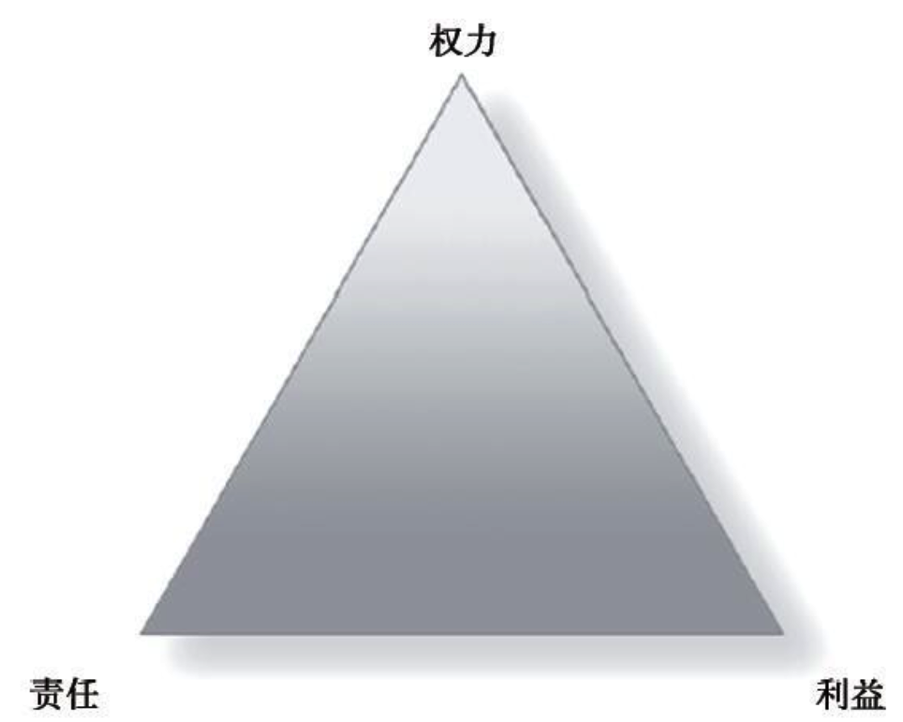

    作者: 陈春花 
    出版社: 机械工业出版社
    副标题: 让管理发挥绩效的8个基本概念(修订版)
    出版年: 2016-10-9
    页数: 173
    定价: 45
    装帧: 平装
    ISBN: 9787111548782

[豆瓣链接](https://book.douban.com/subject/26901342/)

- [第1章 什么是管理](#%e7%ac%ac1%e7%ab%a0-%e4%bb%80%e4%b9%88%e6%98%af%e7%ae%a1%e7%90%86)
  - [管理的理解](#%e7%ae%a1%e7%90%86%e7%9a%84%e7%90%86%e8%a7%a3)
  - [我倡导的管理观](#%e6%88%91%e5%80%a1%e5%af%bc%e7%9a%84%e7%ae%a1%e7%90%86%e8%a7%82)
  - [管理解决的三个效率](#%e7%ae%a1%e7%90%86%e8%a7%a3%e5%86%b3%e7%9a%84%e4%b8%89%e4%b8%aa%e6%95%88%e7%8e%87)
    - [管理解决的第一个效率：使劳动生产率最大化的手段是分工](#%e7%ae%a1%e7%90%86%e8%a7%a3%e5%86%b3%e7%9a%84%e7%ac%ac%e4%b8%80%e4%b8%aa%e6%95%88%e7%8e%87%e4%bd%bf%e5%8a%b3%e5%8a%a8%e7%94%9f%e4%ba%a7%e7%8e%87%e6%9c%80%e5%a4%a7%e5%8c%96%e7%9a%84%e6%89%8b%e6%ae%b5%e6%98%af%e5%88%86%e5%b7%a5)
    - [管理解决的第二个效率：使组织效率最大化的手段是专业化水平和等级制度的结合](#%e7%ae%a1%e7%90%86%e8%a7%a3%e5%86%b3%e7%9a%84%e7%ac%ac%e4%ba%8c%e4%b8%aa%e6%95%88%e7%8e%87%e4%bd%bf%e7%bb%84%e7%bb%87%e6%95%88%e7%8e%87%e6%9c%80%e5%a4%a7%e5%8c%96%e7%9a%84%e6%89%8b%e6%ae%b5%e6%98%af%e4%b8%93%e4%b8%9a%e5%8c%96%e6%b0%b4%e5%b9%b3%e5%92%8c%e7%ad%89%e7%ba%a7%e5%88%b6%e5%ba%a6%e7%9a%84%e7%bb%93%e5%90%88)
  - [管理解决的第三个效率：使个人效率最大化的手段是个人创造组织环境，满足需求，挖掘潜力](#%e7%ae%a1%e7%90%86%e8%a7%a3%e5%86%b3%e7%9a%84%e7%ac%ac%e4%b8%89%e4%b8%aa%e6%95%88%e7%8e%87%e4%bd%bf%e4%b8%aa%e4%ba%ba%e6%95%88%e7%8e%87%e6%9c%80%e5%a4%a7%e5%8c%96%e7%9a%84%e6%89%8b%e6%ae%b5%e6%98%af%e4%b8%aa%e4%ba%ba%e5%88%9b%e9%80%a0%e7%bb%84%e7%bb%87%e7%8e%af%e5%a2%83%e6%bb%a1%e8%b6%b3%e9%9c%80%e6%b1%82%e6%8c%96%e6%8e%98%e6%bd%9c%e5%8a%9b)
  - [如何让管理有效](#%e5%a6%82%e4%bd%95%e8%ae%a9%e7%ae%a1%e7%90%86%e6%9c%89%e6%95%88)
  - [企业组织的管理内容](#%e4%bc%81%e4%b8%9a%e7%bb%84%e7%bb%87%e7%9a%84%e7%ae%a1%e7%90%86%e5%86%85%e5%ae%b9)
    - [计划管理：回答资源与目标是否匹配的问题](#%e8%ae%a1%e5%88%92%e7%ae%a1%e7%90%86%e5%9b%9e%e7%ad%94%e8%b5%84%e6%ba%90%e4%b8%8e%e7%9b%ae%e6%a0%87%e6%98%af%e5%90%a6%e5%8c%b9%e9%85%8d%e7%9a%84%e9%97%ae%e9%a2%98)
    - [流程管理：解决人与事是否匹配的问题](#%e6%b5%81%e7%a8%8b%e7%ae%a1%e7%90%86%e8%a7%a3%e5%86%b3%e4%ba%ba%e4%b8%8e%e4%ba%8b%e6%98%af%e5%90%a6%e5%8c%b9%e9%85%8d%e7%9a%84%e9%97%ae%e9%a2%98)
    - [组织管理：回答权力与责任是否匹配的问题](#%e7%bb%84%e7%bb%87%e7%ae%a1%e7%90%86%e5%9b%9e%e7%ad%94%e6%9d%83%e5%8a%9b%e4%b8%8e%e8%b4%a3%e4%bb%bb%e6%98%af%e5%90%a6%e5%8c%b9%e9%85%8d%e7%9a%84%e9%97%ae%e9%a2%98)
    - [战略管理：解决企业核心能力的问题](#%e6%88%98%e7%95%a5%e7%ae%a1%e7%90%86%e8%a7%a3%e5%86%b3%e4%bc%81%e4%b8%9a%e6%a0%b8%e5%bf%83%e8%83%bd%e5%8a%9b%e7%9a%84%e9%97%ae%e9%a2%98)
    - [文化管理：解决企业持续经营的问题](#%e6%96%87%e5%8c%96%e7%ae%a1%e7%90%86%e8%a7%a3%e5%86%b3%e4%bc%81%e4%b8%9a%e6%8c%81%e7%bb%ad%e7%bb%8f%e8%90%a5%e7%9a%84%e9%97%ae%e9%a2%98)
- [第2章 什么是组织](#%e7%ac%ac2%e7%ab%a0-%e4%bb%80%e4%b9%88%e6%98%af%e7%bb%84%e7%bb%87)
  - [组织的理解](#%e7%bb%84%e7%bb%87%e7%9a%84%e7%90%86%e8%a7%a3)
  - [组织因目标而存在](#%e7%bb%84%e7%bb%87%e5%9b%a0%e7%9b%ae%e6%a0%87%e8%80%8c%e5%ad%98%e5%9c%a8)
  - [组织内的关系是奉献关系](#%e7%bb%84%e7%bb%87%e5%86%85%e7%9a%84%e5%85%b3%e7%b3%bb%e6%98%af%e5%a5%89%e7%8c%ae%e5%85%b3%e7%b3%bb)
  - [组织处在不确定的商业世界中](#%e7%bb%84%e7%bb%87%e5%a4%84%e5%9c%a8%e4%b8%8d%e7%a1%ae%e5%ae%9a%e7%9a%84%e5%95%86%e4%b8%9a%e4%b8%96%e7%95%8c%e4%b8%ad)

## 第1章 什么是管理
### 管理的理解
1. 管理就是让下属明白什么是最重要的
2. 管理不谈对错，只是面对事实，解决问题
3. 管理是“管事”而不是“管人”
4. 衡量管理水平的唯一标准是能否让个人目标与组织目标合二为一
5. 管理就是让一线员工得到并可以使用资源，对于管理的资源而言，最重要的是人力资源和财力资源

### 我倡导的管理观
1. 管理只对绩效负责
   1. 现象一：功劳与苦劳。人们常常以苦为乐，认为付出就是对得起组织，但是我们都很清楚，只有功劳才会产生绩效，苦劳不产生绩效。
   2. 现象二：能力与态度。过多关注态度，结果就会导致组织中能干的人干死，不能干的人活得很好，原因是你关心态度而不是能力，让态度好的人得到肯定，结果导致大家关心态度，而不愿意真正地用能力说话。可是，只有能力才会产生绩效，态度必须转化为能力才会产生绩效。
   3. 现象三：才干与品德。德与才的取舍中人们希望德才兼备，如果两者不可兼得人们选择先德后才。
2. 管理是一种分配
   1. 管理其实很简单，它只是需要做一个分配就好了，就是分配权力、责任和利益。但是需要特别强调的是，必须把`权力`、`责任`和`利益`等分，成为一个等边三角形。
   2. 管理是在责任的基础上所做的行为选择，如果是这样的话，我们需要在界定责任的同时，配备合适的资源，并让人们可以分享到管理所获得的结果。
   3. 我强调把责任分下去，还有一个更重要的意义，就是只有分配责任，人才会真正地被培养起来。没有责任，人就无法真正激发出能力和热情，也无法真正发挥作用。
3. 管理始终为经营服务
   1. 管理做什么，必须由经营来决定。
   2. 管理水平不能够超越经营水平。

### 管理解决的三个效率
#### 管理解决的第一个效率：使劳动生产率最大化的手段是分工
泰勒用一生的时间所要探讨的问题，恰恰是管理的本质问题：管理要解决的就是如何在有限的时间里获取最大限度的产出，也就是如何使生产率最大化。泰勒在《科学管理原理》一书中，清晰地阐述了获得劳动生产率最大化的四条原理。

- 科学划分工作元素。
- 员工选择、培训和开发。
- 与员工经常沟通。
- 管理者与员工应有平等的工作和责任范围。

#### 管理解决的第二个效率：使组织效率最大化的手段是专业化水平和等级制度的结合
从理论上讲，韦伯组织管理的原则约定：权力是组织而非个人。组织管理的核心就是让权力从个人的身上回归到职位上，也就是组织本身上，只有在这种情况下管理效率才会得到最大化。

组织效率最大化的手段是专业化水平和等级制度的结合。

一方面我们需要强化专业化的能力，无论是管理者、领导者还是基层人员，只有贡献了专业化的水平，我们才能算是胜任了管理工作；另一方面需要明确的分责分权制度，只有职责清晰的分工，权力明确的分配，等级安排合理，组织结构有序，管理的效能才会有效地发挥。专业化水平和等级制度的结合正是组织效率最大化的来源。

### 管理解决的第三个效率：使个人效率最大化的手段是个人创造组织环境，满足需求，挖掘潜力
把员工需求和组织发展的目标联结在一起，还有短期目标和长期目标冲突的问题，虽然复杂但管理必须平衡这些目标和冲突，不能够只关注组织目标而忽略了个人的需求，也不能够只强调个人需求而伤害组织目标，只有两者都能够得到关注并实现，管理才能够有效。因此，我认为能够让组织目标和个人目标合二为一的激励就是有效的激励。

管理正是要解决企业的三个问题：第一，如何使劳动生产率最大化？第二，如何使组织效率最大化？第三，如何使个人效率最大化？这三个问题正是管理的基本问题，或者说管理实现效率就是实现劳动效率、组织效率、个人效率。

### 如何让管理有效
管理者就承担了这个最重要的使命：提升整体的力量，延续个体的价值。

传统管理者与有效管理者的区别是什么？在德鲁克先生看来，传统管理者专注于烦琐的事务，因为他们只是关心发生的事务，所以这些管理者所有的时间都在处理别人的事情上，简单地说，就是传统管理者的**时间属于别人**，这是传统管理者的第一个特征。传统管理者的第二个特征是：身在岗位上，处在什么岗位上，就用什么样的思维方式来看待问题，所以导致部门之间的不合作，导致很多管理者 **“屁股指挥脑袋”** ，不知道整个系统所需要的条件是什么。传统管理者的第三个特征是只专注于事务，忽略了对人的培养，他们总是认为没有人能够成长起来，下属总是不能够很好地完成任务。

有效的管理者具有什么样的特征呢？有效管理者的第一个特征就是**进行时间管理**。有效管理其实是时间管理，他们能够确定重要的事情，确定优先顺序，确定重要的事情一定会有合适的时间进行安排，确定每一件事情都有时间的设定，都能够合理地解决。在有效管理者那里，不存在“忙”这个概念，所有的事情都会有序和合理，进而也就有效。有效管理者的第二个特征是**系统思考**。对于每一个人而言，如何在组织里发挥作用，如何寻找到合适的位置，取决于如何思考，如果不能够认识到个人和组织的关系，不能够认识到整体和局部的关系，无论这个人能力多强，也无法发挥作用。只有认识到整体最大，局部和个人服从整体的时候，借助整体的力量，局部和个人才会发挥最大的效能。有效管理者的第三个特征是**培养人**。对于人的培养是管理者最根本的职责所在，如果可以让每一个成员成长起来，管理的绩效就会得以发挥，如果可以让每一个成员胜任职责，组织的效率就会提升，因而培养人是有效管理者的特征。

### 企业组织的管理内容
#### 计划管理：回答资源与目标是否匹配的问题
计划管理要解决的问题，不是数据，不是年终的考核指标，更不是文本。计划管理要解决的问题是目标和资源之间关系是否匹配的问题，计划管理就是要目标与资源的关系处在匹配的状态，这是一个最为基础的管理内容。因此，计划管理由三个关键元素构成：目标、资源和两者匹配的关系。

目标是计划管理的基准。计划管理在管理理论中也被确认为目标管理。目标管理的实现需要三个条件：

1. 高层强有力的支持；
2. 目标要能够检验；
3. 使目标清晰。

资源是计划管理的对象。**计划管理事实上是管理资源，而不是管理目标**。

#### 流程管理：解决人与事是否匹配的问题
如果简单描述流程管理，其实就是人人有事做，事事有人做。实现流程管理需要改变管理的一些习惯，我简单归纳为三点：

1. 打破职能习惯；
2. 培养系统思维习惯；
3. 形成绩效导向的企业文化。

打破职能习惯。职能导向侧重于对职能的管理和控制，关注部门的职能完成程度和垂直性的管理控制，部门之间的职能行为往往缺少完整有机的联系。它没有确定时间标准，这一最重要的工作标准一般是由该部门的主管领导临时确定的，这就大幅加重了主管领导的工作量，又由于标准不确定，导致整体工作效率大幅降低。因此，我们必须打破职能的习惯。

培养系统思维习惯。流程导向侧重的是目标和时间，即以顾客、市场需求为导向，将企业的行为视为一个总流程上的流程集合，对这个集合进行管理和控制，强调全过程的协调及目标化。每一件工作都是流程的一部分，是一个流程的节点，它的完成必须满足整个流程的时间要求，时间是整个流程中最重要的标准之一。因此在流程的前提下，时间作为基本坐标决定了我们需要系统地思考问题，而不是仅仅依据自己所在的部门或者所处的位置，我们必须学会系统思维，形成绩效导向的企业文化。

形成绩效导向的企业文化。“人人都有一个市场，人人都面对一个市场”，实施流程导向中激励各成员共同追求流程的绩效，重视顾客需求的价值是海尔实施流程管理的一种灌输方式，这种方式恰恰让我们看到形成以绩效为导向的企业文化是流程管理的保障。通过让员工理解的概念，激励每个员工参与流程再造，重视员工的建议，等等，以完成这个艰巨的管理方式的改变，没有这样的文化氛围，流程管理只能是流于形式，这也是中国有的企业引入流程再造不能够取得成功的根本原因。

#### 组织管理：回答权力与责任是否匹配的问题
实现组织管理需要两个条件：专业化与分权。

#### 战略管理：解决企业核心能力的问题
有三个基本特征组成了企业的核心竞争力：

1. 核心竞争力提供了进入多样化市场的潜能；
2. 核心竞争力应当对最终产品中顾客重视的价值做出关键贡献；
3. 核心竞争力应当是竞争对手难以模仿的能力。

#### 文化管理：解决企业持续经营的问题
企业为什么或者追求什么样的目标，肩负何种使命，拥有什么样的价值标准，是企业是否可以持续的根本因素，而这些问题的回答正是企业文化所承担的责任。

从管理方式的角度定量，管理方式对企业文化的推动有这样的发展过程：人事制度→人的管理→企业管理方式→核心价值观→企业文化。随着企业的发展，企业文化的发展通常历经企业家个性魅力（企业家文化）→团队个性魅力（团队文化）→企业个性魅力（企业文化）→最终形成的社会个性魅力（竞争性文化）。

计划管理、流程管理和组织管理被称为基础管理，这是企业生存的关键。战略管理和文化管理是更高一个层面的管理，不要把战略管理和文化管理放在企业管理的基础上来做，那样会适得其反。

## 第2章 什么是组织
### 组织的理解
在我看来：**组织的存在是为了实现目标，组织管理的存在是为了提升效率**。

1. “公司不是一个家”。
   1. 当我们说“公司不是一个家”的时候，就表明组织不会照顾个人，也就意味着在组织中我们是用目标、责任、权力来联结，而不是用情感来联结的。组织有正式组织与非正式组织之分。正式组织就是指运用权力、责任和目标来联结人群的集合；非正式组织是指用情感、兴趣和爱好来联结人群的集合。我们在管理概念下主要是谈正式组织。
   2. 组织结构设计从本质意义上讲就是一个分权、分责的设计。
2. 组织必须保证一件事由同一组人承担。
   1. 同一个权力、责任和目标必须是同一组人承担。在组织中看到结构臃肿、效率低下、人浮于事、责任不清、互相推诿的情况出现的时候，你必须先看看是否存在同一件事情有两组人在做，同一个责任有两组人在承担，同一个权力有两组人在使用，这是出现上述情况的原因所在。这些情况我们可以用一个词来表述，这个词就叫`“组织虚设”`。
3. 在组织中人与人公平而非平等。
   1. 在一个组织结构中，人与人之间是以实现目标为前提的生存，人与人应该承担各自的责任和目标，从而拥有了不同的权力，因为这些的不同，所以人与人应该是公平的但非平等的。
4. 分工是个人和组织联结的根本方法。
   1. 组织的分工主要是分配责任和权力。

### 组织因目标而存在
不同的目标设计就会导致不同的人群聚集在一起，也决定了人们不同的行为选择和价值判断，因此目标决定组织存在的意义。

其实对于企业组织而言，它的目标非常简单：**持续的获利能力**。一般认为，合理的战略始于确立正确的目标。而我可以套用迈克尔·波特的观点：能支持合理战略的唯一目标就是超强持续的盈利能力。

### 组织内的关系是奉献关系
奉献关系所产生的基本现象是：每个处于流程上的人更关心他能够为下一个工序做什么样的贡献；每个部门都关心自己如何调整才能够与其他部门有和谐的接口；下级会关注自己怎样配合才能够为上级提供支持，而上级会要求自己为下级解决问题并提供帮助。

如何让组织关系变成奉献的关系。我想也许可以从以下几个方面来着手。

1. 工作评价来源于工作的相关者。
2. “绝不让雷锋吃亏”，这是华为公司企业文化中非常重要的一个准则。
3. 激励和宣扬组织的成功而不是个人的成功。

### 组织处在不确定的商业世界中

