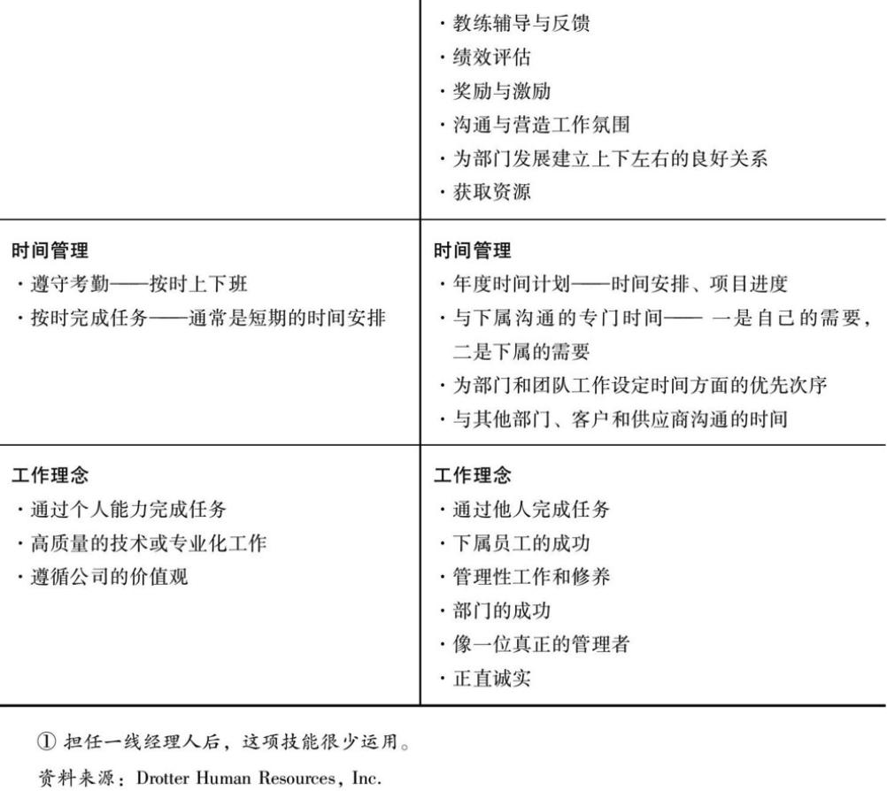
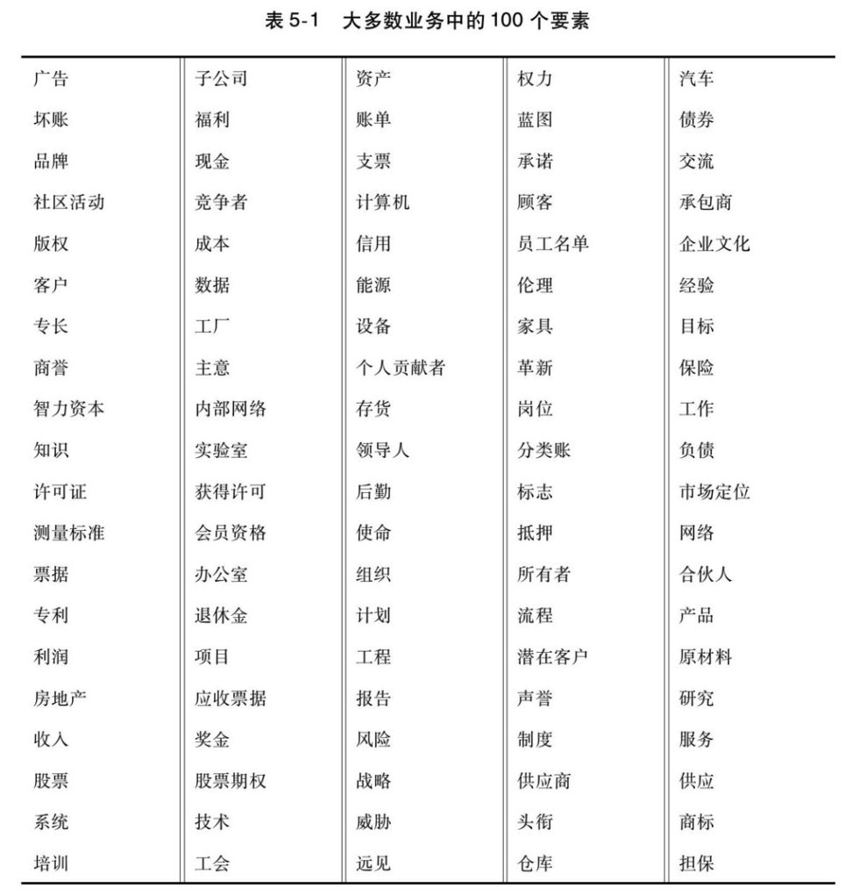
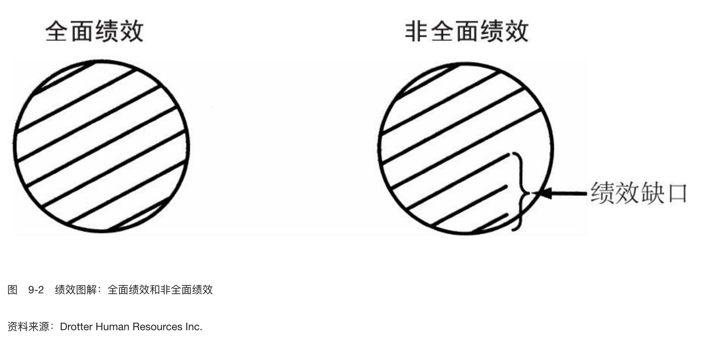
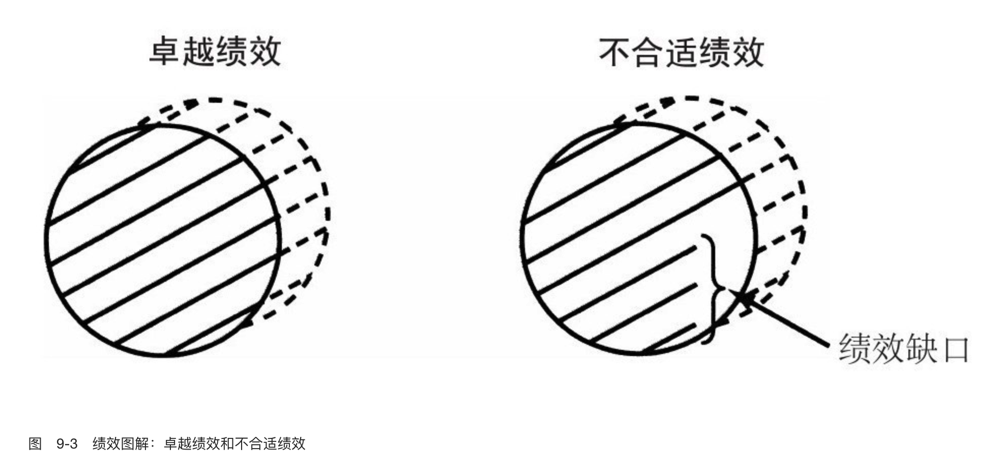
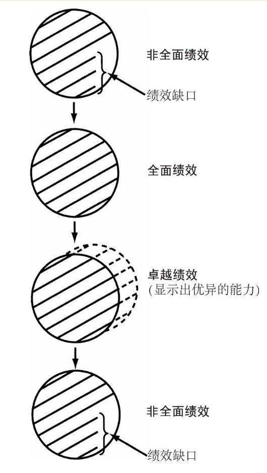
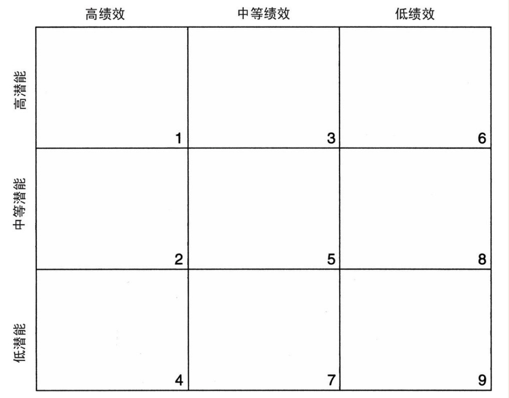
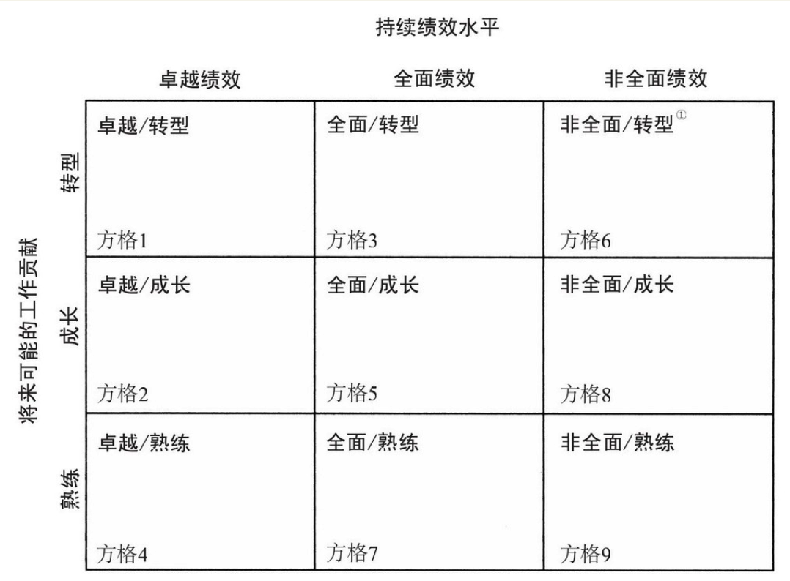

    作者: 拉姆•查兰 (Ram Charan) / 斯蒂芬•德罗特 (Stephen Drotter) / 詹姆斯•诺埃尔 (James Noel)
    出版社: 机械工业出版社
    副标题: 全面打造领导力驱动型公司(原书第2版)
    原作名: The Leadership Pipeline: How to Build the Leadership Powered Company
    译者: 徐中 / 林嵩 / 雷静
    出版年: 2011-7
    页数: 280
    定价: 42.00元
    装帧: 平装
    ISBN: 9787111349341

[豆瓣链接](https://book.douban.com/subject/6536593/)

- [导论](#%e5%af%bc%e8%ae%ba)
  - [领导梯队的各个阶段](#%e9%a2%86%e5%af%bc%e6%a2%af%e9%98%9f%e7%9a%84%e5%90%84%e4%b8%aa%e9%98%b6%e6%ae%b5)
- [第1章 概述：领导力发展的六个阶段](#%e7%ac%ac1%e7%ab%a0-%e6%a6%82%e8%bf%b0%e9%a2%86%e5%af%bc%e5%8a%9b%e5%8f%91%e5%b1%95%e7%9a%84%e5%85%ad%e4%b8%aa%e9%98%b6%e6%ae%b5)
  - [第一阶段：从管理自我到管理他人](#%e7%ac%ac%e4%b8%80%e9%98%b6%e6%ae%b5%e4%bb%8e%e7%ae%a1%e7%90%86%e8%87%aa%e6%88%91%e5%88%b0%e7%ae%a1%e7%90%86%e4%bb%96%e4%ba%ba)
  - [第二阶段：从管理他人到管理经理人员](#%e7%ac%ac%e4%ba%8c%e9%98%b6%e6%ae%b5%e4%bb%8e%e7%ae%a1%e7%90%86%e4%bb%96%e4%ba%ba%e5%88%b0%e7%ae%a1%e7%90%86%e7%bb%8f%e7%90%86%e4%ba%ba%e5%91%98)
  - [第三阶段：从管理经理人员到管理职能部门](#%e7%ac%ac%e4%b8%89%e9%98%b6%e6%ae%b5%e4%bb%8e%e7%ae%a1%e7%90%86%e7%bb%8f%e7%90%86%e4%ba%ba%e5%91%98%e5%88%b0%e7%ae%a1%e7%90%86%e8%81%8c%e8%83%bd%e9%83%a8%e9%97%a8)
  - [第四阶段：从管理职能部门到事业部总经理](#%e7%ac%ac%e5%9b%9b%e9%98%b6%e6%ae%b5%e4%bb%8e%e7%ae%a1%e7%90%86%e8%81%8c%e8%83%bd%e9%83%a8%e9%97%a8%e5%88%b0%e4%ba%8b%e4%b8%9a%e9%83%a8%e6%80%bb%e7%bb%8f%e7%90%86)
  - [第五阶段：从事业部总经理到集团高管](#%e7%ac%ac%e4%ba%94%e9%98%b6%e6%ae%b5%e4%bb%8e%e4%ba%8b%e4%b8%9a%e9%83%a8%e6%80%bb%e7%bb%8f%e7%90%86%e5%88%b0%e9%9b%86%e5%9b%a2%e9%ab%98%e7%ae%a1)
  - [第六阶段：从集团高管到首席执行官](#%e7%ac%ac%e5%85%ad%e9%98%b6%e6%ae%b5%e4%bb%8e%e9%9b%86%e5%9b%a2%e9%ab%98%e7%ae%a1%e5%88%b0%e9%a6%96%e5%b8%ad%e6%89%a7%e8%a1%8c%e5%ae%98)
  - [领导梯队模型在小公司的应用](#%e9%a2%86%e5%af%bc%e6%a2%af%e9%98%9f%e6%a8%a1%e5%9e%8b%e5%9c%a8%e5%b0%8f%e5%85%ac%e5%8f%b8%e7%9a%84%e5%ba%94%e7%94%a8)
- [第2章 从管理自我到管理他人](#%e7%ac%ac2%e7%ab%a0-%e4%bb%8e%e7%ae%a1%e7%90%86%e8%87%aa%e6%88%91%e5%88%b0%e7%ae%a1%e7%90%86%e4%bb%96%e4%ba%ba)
  - [初任经理的三项重要工作](#%e5%88%9d%e4%bb%bb%e7%bb%8f%e7%90%86%e7%9a%84%e4%b8%89%e9%a1%b9%e9%87%8d%e8%a6%81%e5%b7%a5%e4%bd%9c)
  - [界定和布置工作](#%e7%95%8c%e5%ae%9a%e5%92%8c%e5%b8%83%e7%bd%ae%e5%b7%a5%e4%bd%9c)
  - [提高下属的胜任能力](#%e6%8f%90%e9%ab%98%e4%b8%8b%e5%b1%9e%e7%9a%84%e8%83%9c%e4%bb%bb%e8%83%bd%e5%8a%9b)
- [第3章 从管理他人到管理经理人员](#%e7%ac%ac3%e7%ab%a0-%e4%bb%8e%e7%ae%a1%e7%90%86%e4%bb%96%e4%ba%ba%e5%88%b0%e7%ae%a1%e7%90%86%e7%bb%8f%e7%90%86%e4%ba%ba%e5%91%98)
  - [部门总监错位的五种现象](#%e9%83%a8%e9%97%a8%e6%80%bb%e7%9b%91%e9%94%99%e4%bd%8d%e7%9a%84%e4%ba%94%e7%a7%8d%e7%8e%b0%e8%b1%a1)
  - [部门总监该做什么](#%e9%83%a8%e9%97%a8%e6%80%bb%e7%9b%91%e8%af%a5%e5%81%9a%e4%bb%80%e4%b9%88)
  - [让一线经理对管理工作负责](#%e8%ae%a9%e4%b8%80%e7%ba%bf%e7%bb%8f%e7%90%86%e5%af%b9%e7%ae%a1%e7%90%86%e5%b7%a5%e4%bd%9c%e8%b4%9f%e8%b4%a3)
  - [在各部门配置各种资源](#%e5%9c%a8%e5%90%84%e9%83%a8%e9%97%a8%e9%85%8d%e7%bd%ae%e5%90%84%e7%a7%8d%e8%b5%84%e6%ba%90)
  - [有效协调部门工作](#%e6%9c%89%e6%95%88%e5%8d%8f%e8%b0%83%e9%83%a8%e9%97%a8%e5%b7%a5%e4%bd%9c)
  - [如何帮助部门总监实现领导力转型](#%e5%a6%82%e4%bd%95%e5%b8%ae%e5%8a%a9%e9%83%a8%e9%97%a8%e6%80%bb%e7%9b%91%e5%ae%9e%e7%8e%b0%e9%a2%86%e5%af%bc%e5%8a%9b%e8%bd%ac%e5%9e%8b)
- [第4章 从管理经理人员到管理职能部门](#%e7%ac%ac4%e7%ab%a0-%e4%bb%8e%e7%ae%a1%e7%90%86%e7%bb%8f%e7%90%86%e4%ba%ba%e5%91%98%e5%88%b0%e7%ae%a1%e7%90%86%e8%81%8c%e8%83%bd%e9%83%a8%e9%97%a8)
  - [战略思维：胸怀全局](#%e6%88%98%e7%95%a5%e6%80%9d%e7%bb%b4%e8%83%b8%e6%80%80%e5%85%a8%e5%b1%80)
  - [职能战略](#%e8%81%8c%e8%83%bd%e6%88%98%e7%95%a5)
  - [管理整个职能部门](#%e7%ae%a1%e7%90%86%e6%95%b4%e4%b8%aa%e8%81%8c%e8%83%bd%e9%83%a8%e9%97%a8)
  - [识别职能紊乱的信号](#%e8%af%86%e5%88%ab%e8%81%8c%e8%83%bd%e7%b4%8a%e4%b9%b1%e7%9a%84%e4%bf%a1%e5%8f%b7)
  - [培养成熟的、有战略思维的、全面的职能部门主管](#%e5%9f%b9%e5%85%bb%e6%88%90%e7%86%9f%e7%9a%84%e6%9c%89%e6%88%98%e7%95%a5%e6%80%9d%e7%bb%b4%e7%9a%84%e5%85%a8%e9%9d%a2%e7%9a%84%e8%81%8c%e8%83%bd%e9%83%a8%e9%97%a8%e4%b8%bb%e7%ae%a1)
- [第5章 从管理职能部门到事业部总经理](#%e7%ac%ac5%e7%ab%a0-%e4%bb%8e%e7%ae%a1%e7%90%86%e8%81%8c%e8%83%bd%e9%83%a8%e9%97%a8%e5%88%b0%e4%ba%8b%e4%b8%9a%e9%83%a8%e6%80%bb%e7%bb%8f%e7%90%86)
  - [转变思维方式](#%e8%bd%ac%e5%8f%98%e6%80%9d%e7%bb%b4%e6%96%b9%e5%bc%8f)
  - [管理好错综复杂的问题](#%e7%ae%a1%e7%90%86%e5%a5%bd%e9%94%99%e7%bb%bc%e5%a4%8d%e6%9d%82%e7%9a%84%e9%97%ae%e9%a2%98)
  - [高度透明](#%e9%ab%98%e5%ba%a6%e9%80%8f%e6%98%8e)
  - [领导力转型困难的信号](#%e9%a2%86%e5%af%bc%e5%8a%9b%e8%bd%ac%e5%9e%8b%e5%9b%b0%e9%9a%be%e7%9a%84%e4%bf%a1%e5%8f%b7)
  - [自我提升的方法：自学、历练、反省](#%e8%87%aa%e6%88%91%e6%8f%90%e5%8d%87%e7%9a%84%e6%96%b9%e6%b3%95%e8%87%aa%e5%ad%a6%e5%8e%86%e7%bb%83%e5%8f%8d%e7%9c%81)
- [第6章 从事业部总经理到集团高管](#%e7%ac%ac6%e7%ab%a0-%e4%bb%8e%e4%ba%8b%e4%b8%9a%e9%83%a8%e6%80%bb%e7%bb%8f%e7%90%86%e5%88%b0%e9%9b%86%e5%9b%a2%e9%ab%98%e7%ae%a1)
  - [间接成功](#%e9%97%b4%e6%8e%a5%e6%88%90%e5%8a%9f)
  - [管理和培养事业部总经理](#%e7%ae%a1%e7%90%86%e5%92%8c%e5%9f%b9%e5%85%bb%e4%ba%8b%e4%b8%9a%e9%83%a8%e6%80%bb%e7%bb%8f%e7%90%86)
  - [把业务部门与整个公司联系起来](#%e6%8a%8a%e4%b8%9a%e5%8a%a1%e9%83%a8%e9%97%a8%e4%b8%8e%e6%95%b4%e4%b8%aa%e5%85%ac%e5%8f%b8%e8%81%94%e7%b3%bb%e8%b5%b7%e6%9d%a5)
  - [警示信号](#%e8%ad%a6%e7%a4%ba%e4%bf%a1%e5%8f%b7)
- [第7章 从集团高管到首席执行官](#%e7%ac%ac7%e7%ab%a0-%e4%bb%8e%e9%9b%86%e5%9b%a2%e9%ab%98%e7%ae%a1%e5%88%b0%e9%a6%96%e5%b8%ad%e6%89%a7%e8%a1%8c%e5%ae%98)
  - [挑战一：善于平衡短期和长期利益，实现可持续发展](#%e6%8c%91%e6%88%98%e4%b8%80%e5%96%84%e4%ba%8e%e5%b9%b3%e8%a1%a1%e7%9f%ad%e6%9c%9f%e5%92%8c%e9%95%bf%e6%9c%9f%e5%88%a9%e7%9b%8a%e5%ae%9e%e7%8e%b0%e5%8f%af%e6%8c%81%e7%bb%ad%e5%8f%91%e5%b1%95)
  - [挑战二：设定公司发展的方向](#%e6%8c%91%e6%88%98%e4%ba%8c%e8%ae%be%e5%ae%9a%e5%85%ac%e5%8f%b8%e5%8f%91%e5%b1%95%e7%9a%84%e6%96%b9%e5%90%91)
  - [挑战三：培育公司的软实力](#%e6%8c%91%e6%88%98%e4%b8%89%e5%9f%b9%e8%82%b2%e5%85%ac%e5%8f%b8%e7%9a%84%e8%bd%af%e5%ae%9e%e5%8a%9b)
  - [挑战四：执行到位](#%e6%8c%91%e6%88%98%e5%9b%9b%e6%89%a7%e8%a1%8c%e5%88%b0%e4%bd%8d)
  - [挑战五：管理全球化背景下的公司](#%e6%8c%91%e6%88%98%e4%ba%94%e7%ae%a1%e7%90%86%e5%85%a8%e7%90%83%e5%8c%96%e8%83%8c%e6%99%af%e4%b8%8b%e7%9a%84%e5%85%ac%e5%8f%b8)
  - [工作理念的重大转变](#%e5%b7%a5%e4%bd%9c%e7%90%86%e5%bf%b5%e7%9a%84%e9%87%8d%e5%a4%a7%e8%bd%ac%e5%8f%98)
  - [首席执行官遭遇困境的信号](#%e9%a6%96%e5%b8%ad%e6%89%a7%e8%a1%8c%e5%ae%98%e9%81%ad%e9%81%87%e5%9b%b0%e5%a2%83%e7%9a%84%e4%bf%a1%e5%8f%b7)
  - [培养首席执行官不可越级](#%e5%9f%b9%e5%85%bb%e9%a6%96%e5%b8%ad%e6%89%a7%e8%a1%8c%e5%ae%98%e4%b8%8d%e5%8f%af%e8%b6%8a%e7%ba%a7)
  - [确保首席执行官获得成功](#%e7%a1%ae%e4%bf%9d%e9%a6%96%e5%b8%ad%e6%89%a7%e8%a1%8c%e5%ae%98%e8%8e%b7%e5%be%97%e6%88%90%e5%8a%9f)
- [第8章 问题诊断：识别领导梯队模型中的问题和潜力](#%e7%ac%ac8%e7%ab%a0-%e9%97%ae%e9%a2%98%e8%af%8a%e6%96%ad%e8%af%86%e5%88%ab%e9%a2%86%e5%af%bc%e6%a2%af%e9%98%9f%e6%a8%a1%e5%9e%8b%e4%b8%ad%e7%9a%84%e9%97%ae%e9%a2%98%e5%92%8c%e6%bd%9c%e5%8a%9b)
  - [尽早且时常进行领导梯队诊断的三个理由](#%e5%b0%bd%e6%97%a9%e4%b8%94%e6%97%b6%e5%b8%b8%e8%bf%9b%e8%a1%8c%e9%a2%86%e5%af%bc%e6%a2%af%e9%98%9f%e8%af%8a%e6%96%ad%e7%9a%84%e4%b8%89%e4%b8%aa%e7%90%86%e7%94%b1)
  - [帮助我们超越现有工作业绩的工具](#%e5%b8%ae%e5%8a%a9%e6%88%91%e4%bb%ac%e8%b6%85%e8%b6%8a%e7%8e%b0%e6%9c%89%e5%b7%a5%e4%bd%9c%e4%b8%9a%e7%bb%a9%e7%9a%84%e5%b7%a5%e5%85%b7)
  - [个体视角](#%e4%b8%aa%e4%bd%93%e8%a7%86%e8%a7%92)
  - [团队视角](#%e5%9b%a2%e9%98%9f%e8%a7%86%e8%a7%92)
- [第9章 业绩改善：明确岗位职责，设立绩效标准](#%e7%ac%ac9%e7%ab%a0-%e4%b8%9a%e7%bb%a9%e6%94%b9%e5%96%84%e6%98%8e%e7%a1%ae%e5%b2%97%e4%bd%8d%e8%81%8c%e8%b4%a3%e8%ae%be%e7%ab%8b%e7%bb%a9%e6%95%88%e6%a0%87%e5%87%86)
  - [明确职责的相关讨论](#%e6%98%8e%e7%a1%ae%e8%81%8c%e8%b4%a3%e7%9a%84%e7%9b%b8%e5%85%b3%e8%ae%a8%e8%ae%ba)
  - [界定绩效标准](#%e7%95%8c%e5%ae%9a%e7%bb%a9%e6%95%88%e6%a0%87%e5%87%86)
  - [通过绩效标准培养领导者](#%e9%80%9a%e8%bf%87%e7%bb%a9%e6%95%88%e6%a0%87%e5%87%86%e5%9f%b9%e5%85%bb%e9%a2%86%e5%af%bc%e8%80%85)
  - [实现全面绩效的策略](#%e5%ae%9e%e7%8e%b0%e5%85%a8%e9%9d%a2%e7%bb%a9%e6%95%88%e7%9a%84%e7%ad%96%e7%95%a5)
    - [策略一：从上司而不是从下属开始](#%e7%ad%96%e7%95%a5%e4%b8%80%e4%bb%8e%e4%b8%8a%e5%8f%b8%e8%80%8c%e4%b8%8d%e6%98%af%e4%bb%8e%e4%b8%8b%e5%b1%9e%e5%bc%80%e5%a7%8b)
    - [策略二：寻找工作理念发生有利转变的证据](#%e7%ad%96%e7%95%a5%e4%ba%8c%e5%af%bb%e6%89%be%e5%b7%a5%e4%bd%9c%e7%90%86%e5%bf%b5%e5%8f%91%e7%94%9f%e6%9c%89%e5%88%a9%e8%bd%ac%e5%8f%98%e7%9a%84%e8%af%81%e6%8d%ae)
    - [策略三：以行为学习法作为领导培养的基本手段](#%e7%ad%96%e7%95%a5%e4%b8%89%e4%bb%a5%e8%a1%8c%e4%b8%ba%e5%ad%a6%e4%b9%a0%e6%b3%95%e4%bd%9c%e4%b8%ba%e9%a2%86%e5%af%bc%e5%9f%b9%e5%85%bb%e7%9a%84%e5%9f%ba%e6%9c%ac%e6%89%8b%e6%ae%b5)
    - [策略四：立即处理绩效缺口](#%e7%ad%96%e7%95%a5%e5%9b%9b%e7%ab%8b%e5%8d%b3%e5%a4%84%e7%90%86%e7%bb%a9%e6%95%88%e7%bc%ba%e5%8f%a3)
  - [留住人才和培养人才之间的关系](#%e7%95%99%e4%bd%8f%e4%ba%ba%e6%89%8d%e5%92%8c%e5%9f%b9%e5%85%bb%e4%ba%ba%e6%89%8d%e4%b9%8b%e9%97%b4%e7%9a%84%e5%85%b3%e7%b3%bb)
- [第10章 继任计划](#%e7%ac%ac10%e7%ab%a0-%e7%bb%a7%e4%bb%bb%e8%ae%a1%e5%88%92)
  - [领导梯队模型视角的继任计划](#%e9%a2%86%e5%af%bc%e6%a2%af%e9%98%9f%e6%a8%a1%e5%9e%8b%e8%a7%86%e8%a7%92%e7%9a%84%e7%bb%a7%e4%bb%bb%e8%ae%a1%e5%88%92)
  - [将负向潜能转为正向潜能](#%e5%b0%86%e8%b4%9f%e5%90%91%e6%bd%9c%e8%83%bd%e8%bd%ac%e4%b8%ba%e6%ad%a3%e5%90%91%e6%bd%9c%e8%83%bd)
  - [如何执行继任计划以充实领导梯队](#%e5%a6%82%e4%bd%95%e6%89%a7%e8%a1%8c%e7%bb%a7%e4%bb%bb%e8%ae%a1%e5%88%92%e4%bb%a5%e5%85%85%e5%ae%9e%e9%a2%86%e5%af%bc%e6%a2%af%e9%98%9f)
- [第11章 识别领导梯队模型中的潜在缺陷](#%e7%ac%ac11%e7%ab%a0-%e8%af%86%e5%88%ab%e9%a2%86%e5%af%bc%e6%a2%af%e9%98%9f%e6%a8%a1%e5%9e%8b%e4%b8%ad%e7%9a%84%e6%bd%9c%e5%9c%a8%e7%bc%ba%e9%99%b7)
  - [不善于定义工作](#%e4%b8%8d%e5%96%84%e4%ba%8e%e5%ae%9a%e4%b9%89%e5%b7%a5%e4%bd%9c)
  - [组织缺陷](#%e7%bb%84%e7%bb%87%e7%bc%ba%e9%99%b7)
- [第12章 职能主管的职业发展路径](#%e7%ac%ac12%e7%ab%a0-%e8%81%8c%e8%83%bd%e4%b8%bb%e7%ae%a1%e7%9a%84%e8%81%8c%e4%b8%9a%e5%8f%91%e5%b1%95%e8%b7%af%e5%be%84)
  - [集团职能主管](#%e9%9b%86%e5%9b%a2%e8%81%8c%e8%83%bd%e4%b8%bb%e7%ae%a1)
  - [广泛且复杂的要求](#%e5%b9%bf%e6%b3%9b%e4%b8%94%e5%a4%8d%e6%9d%82%e7%9a%84%e8%a6%81%e6%b1%82)
  - [企业职能主管](#%e4%bc%81%e4%b8%9a%e8%81%8c%e8%83%bd%e4%b8%bb%e7%ae%a1)
  - [独特的技能要求和工作理念](#%e7%8b%ac%e7%89%b9%e7%9a%84%e6%8a%80%e8%83%bd%e8%a6%81%e6%b1%82%e5%92%8c%e5%b7%a5%e4%bd%9c%e7%90%86%e5%bf%b5)
  - [企业职能主管在错误领导层级工作的迹象](#%e4%bc%81%e4%b8%9a%e8%81%8c%e8%83%bd%e4%b8%bb%e7%ae%a1%e5%9c%a8%e9%94%99%e8%af%af%e9%a2%86%e5%af%bc%e5%b1%82%e7%ba%a7%e5%b7%a5%e4%bd%9c%e7%9a%84%e8%bf%b9%e8%b1%a1)
  - [培养企业职能主管](#%e5%9f%b9%e5%85%bb%e4%bc%81%e4%b8%9a%e8%81%8c%e8%83%bd%e4%b8%bb%e7%ae%a1)
- [第13章 教练辅导](#%e7%ac%ac13%e7%ab%a0-%e6%95%99%e7%bb%83%e8%be%85%e5%af%bc)
  - [教练辅导框架](#%e6%95%99%e7%bb%83%e8%be%85%e5%af%bc%e6%a1%86%e6%9e%b6)
  - [清晰、完整和令人信服的反馈](#%e6%b8%85%e6%99%b0%e5%ae%8c%e6%95%b4%e5%92%8c%e4%bb%a4%e4%ba%ba%e4%bf%a1%e6%9c%8d%e7%9a%84%e5%8f%8d%e9%a6%88)
  - [适时放手](#%e9%80%82%e6%97%b6%e6%94%be%e6%89%8b)
  - [从领导力发展的角度重新定义教练式领导](#%e4%bb%8e%e9%a2%86%e5%af%bc%e5%8a%9b%e5%8f%91%e5%b1%95%e7%9a%84%e8%a7%92%e5%ba%a6%e9%87%8d%e6%96%b0%e5%ae%9a%e4%b9%89%e6%95%99%e7%bb%83%e5%bc%8f%e9%a2%86%e5%af%bc)

## 导论
### 领导梯队的各个阶段
图0-1说明了领导者职业发展所经历的六个主要发展阶段。

每个阶段都要求领导者习得一种新的管理和领导方法，同时抛弃原有的方法。这主要表现在以下三个方面：

- 领导技能——胜任新职务所需要的新能力。
- 时间管理——新的时间分配结构，决定如何工作。
- 工作理念——信念和价值观非常重要，让工作聚焦。

## 第1章 概述：领导力发展的六个阶段
### 第一阶段：从管理自我到管理他人
对他们能力的要求主要是专业化和职业化。他们通过在计划时间内完成任务来做出贡献，通过不断拓展和提升个人技能，在岗位上做出更大贡献，从而获得组织的提升。随着工作年限的增加，他们学习的内容包括工作计划、进度管理、工作内容、工作质量和工作的可靠性，需要提高的工作价值观包括公司文化和职业标准。

在领导力发展的第一阶段，应该学习的技能包括工作计划、知人善任、分配工作、激励员工、教练辅导和绩效评估。

### 第二阶段：从管理他人到管理经理人员
在第二阶段，经理人员如果只重视个人贡献和部门工作，而忽视对其他部门和公司整体的贡献，那么他们的角色转变将非常困难。

### 第三阶段：从管理经理人员到管理职能部门
事业部副总经理需要向事业部总经理汇报工作，因此，他们必须有全局意识，能够兼顾多个部门的需求和利益。他们需要具备两项新的技能：一方面是与其他部门团结协作，另一方面是基于工作的需要与其他部门争夺资源。与此同时，他们还必须擅长制定战略，不仅为自己的部门，而且统筹整个业务部门的战略规划。

领导力发展的第三阶段要求管理者更加成熟。一方面，成熟意味着他们的思考和行动像事业部副总经理，而不是部门总监。另一方面，也要求他们有开阔的、长期的战略眼光，对于他们所主管的部门有前瞻性的、准确的长远考虑，这常常给他们带来巨大的挑战。

### 第四阶段：从管理职能部门到事业部总经理
事业部总经理不仅要学会管理不同的部门，而且需要熟练地与各方面的人员协同工作，敏锐地意识到各部门的利益点，并清楚、有效地与各方面人员沟通。更具挑战性的是，如何兼顾长远目标与近期目标，取得恰当的平衡。事业部总经理必须完成季度利润、市场目标、产品计划和人员管理目标，同时兼顾未来3～5年目标的实现。

### 第五阶段：从事业部总经理到集团高管
这个阶段要求领导者在四项关键技能方面进一步提升。

1. 集团高管必须擅长评估资金调拨和人员配置的战略规划。这是一项复杂的商业技能，包括学会正确的提问，有效地分析数据，以及从公司的角度去理解哪些战略规划最有可能成功，最应该得到支持。
2. 培养事业部总经理。他需要清楚哪些事业部副总经理的能力最适合担任事业部总经理，并提升自己的教练辅导能力。
3. 评估业务的投资组合策略。这与事业部的战略有很大不同。他第一次需要问以下几个问题：我们有合适的业务群吗？为确保当前和未来的赢利，需要增加什么业务？削减哪项业务？调整哪项业务？
4. 集团高管必须精于评估自己的核心能力，采取冷静客观的态度，评估手中的资源，基于分析和经验做出判断，而不是盲目乐观。

### 第六阶段：从集团高管到首席执行官
领导力发展的第六阶段，其转变更多地集中在经营理念而不是管理技能方面。首席执行官必须确认自己的角色和职责。作为一位组织的最高领导，他必须是一位有着远大抱负的思想者，同时善于建立公司的运行机制，推动公司实现每个季度的业绩目标，并确保公司长期战略目标的实现。权衡取舍是首席执行官日常的功课，他们必须学会适应和掌握这门艺术。此外，敏锐地觉察并熟练地处理外部利益相关者关系、重大的外部变化以及积极主动地加以应对，变得越来越重要。首席执行官必须具备重视外部关系的视角。

### 领导梯队模型在小公司的应用
小公司领导力发展模型：

在小公司，首席执行官与大公司的事业部总经理类似（对短期目标和长期目标负责，并协调政府关系、客户关系等方方面面），部门总监常常被归类到公司团队成员。

## 第2章 从管理自我到管理他人
第一次担任经理要想获得成功需要一个重大的转变，即他们的工作成果不再是通过自己亲自做去获得，而是通过下属和团队的努力去获得。

### 初任经理的三项重要工作
表2-1概述了这一层级必须经过的转型。

转型可以概括为以下三个方面：
- 界定和布置工作，包括与上司、员工沟通，需要他们做什么，以及工作计划、组织结构、人员选拔和工作授权。
- 通过监督、指导、反馈、获取资源、解决问题和交流沟通，提高下属的胜任能力，从而高效开展工作。
- 建立与下属、上司和相关部门坦率交流与相互信任的合作关系。

### 界定和布置工作
许多一线经理由于没有与关键人员有效地沟通，结果在工作设计和安排时跌了跟头。只有通过有效沟通，一线经理才能很好地理解部门的工作要求，合理布置工作，使得人岗匹配，任务得以及时、高效地完成。

对一线经理来说，听取直接上级的意见当然重要，但与同级、客户、供应商、业务伙伴和其他有关部门的沟通也变得越来越重要。

授权对新任经理是另一个挑战。经理首先需要清楚做哪些工作，谁最合适去做。但放手让他人去做你非常擅长并且为你带来成功的业务，新任经理在心理上难以接受。通常只有当他们意识到授权并不意味着放弃时，他们才会迈出这一步。

新任经理人还必须学会知人善任，选拔合适的人做合适的事。

### 提高下属的胜任能力
经理既需要定期与员工沟通，也需要密切关注工作流程的执行情况。他们要询问是什么阻碍了工作完成，什么促进了工作完成。监督是一项主动而非被动的工作，仅仅动笔记录是不够的，当结果与期望一致时，就应当给予员工适时的鼓励，比如，在员工肩头轻轻一拍表示肯定，同时给予积极的反馈意见；当结果令人失望时，应通过监督获得的信息进行计划调整、方法调整、加强培训，以及要求增加更多资源支持等措施，让工作回到良性发展的轨道。

亲和力不是指让办公室大门敞开，被动回应员工提出的问题，而是一种积极的态度，从言语到行动，都显示他是一位平易近人的领导，让员工喜欢与之亲近，并随时可以找到他。这与其说是一种技能，不如说是一种价值观和工作方法。

## 第3章 从管理他人到管理经理人员
### 部门总监错位的五种现象
1. 授权问题。一线经理常常存在这类问题，但有时可以敷衍过去。但随着领导层级的提升，授权不足的负面影响越来越大。授权问题也不仅仅是授权不足，有可能是授权方式不当，他们缺乏授权后的问责系统。
2. 绩效管理问题。这个问题在于，部门总监很少或者不善于向下属经理提供反馈，没有给出正确的努力方向，下属不确定真正的目标是什么。换句话说，部门总监不能有效地与下属经理沟通。
3. 团队建设问题。总监仅仅把下属经理当成个人，而不是把他们组织成高效的团队，无意之中助长了个人主义，影响了团队的信息共享和协同支持。
4. 仅仅囿于完成任务的思维模式。总监们没有充分考虑新岗位的领导力转型，他仍然像一线经理一样开展工作，而没有意识到自己是一个经理人员发展的教练和导师，也很少对战略和文化层面的问题表现出兴趣。
5. 选拔“自己人”总监经常有机会选拔下属经理。遗憾的是，他们缺乏这方面的训练，经常选择和他们相似的下属。这不仅导致了人员结构不够多元化，而且由于他们缺乏领导才能，从而阻碍了领导梯队的畅通。

### 部门总监该做什么
以下四种领导技能至关重要：

- 选拔和培养有能力的一线经理。
- 让一线经理对管理工作负责。
- 在各部门配置各种资源。
- 有效协调自己的直接下属部门和其他相关部门的工作。

### 让一线经理对管理工作负责
部门总监工作的一部分，是调整那些不称职的一线经理。

### 在各部门配置各种资源
以下是部门总监需要回答的有关资源是否有效利用的问题。

- 每个部门是否能够按时完成任务，并在质量管理和成本控制方面达到要求？如果没有，还需要其他什么资源？
- 我们是否拥有最佳的内外部资源组合？这种组合应该如何进行调整？
- 哪些部门在浪费资源？应该采取什么措施？
- 考虑到整体的产出要求，现有的部门结构是否合理？哪些资源需要重新配置？
- 哪些人不适合在这里工作？如何尽快让合格的人员替换他们？

考虑到个人和部门的具体资源要求，还需要做出其他判断。

- 哪个部门工作最有效，并应该给予新的挑战性项目（风险最大的项目）？
- 哪些部门应该获得更多的资源（因为它们能够更有效地利用资源）？
- 谁应该得到最大幅度的加薪？
- 谁最需要教练辅导？谁需要我投入更多的时间？

### 有效协调部门工作
部门总监需要监督自己的部门和其他部门之间的协作状况，提出问题和改进意见。同时，他们要有一种更敏捷的管理技巧：理解、传达职能部门战略、业务战略和公司使命，通过传达和检查这些工作与公司战略的匹配程度，帮助本部门与其他团队的有效协同，实现组织的业务目标。

### 如何帮助部门总监实现领导力转型
必须有合适的目标和标准，帮助新任部门总监实现领导力转型。这些标准包括以下方面：

- 工作效率提高的程度；
- 工作质量提高的幅度；
- 教练辅导的频率和效果；
- 提升或者为其他部门输送一线经理的人数；
- 新任一线经理的成功率；
- 工作中的团队合作；
- 在新领域的团队合作。

## 第4章 从管理经理人员到管理职能部门
### 战略思维：胸怀全局
最优秀的事业部副总经理是那些具有战略思维，并在具体管理时胸怀全局的人。

### 职能战略
在晋升到这个领导层级之前，领导者已经在自己的职能范围内为职能战略实施制定出支持性的经营计划。现在他们必须提升为制定职能战略。以下是该层级战略的五项要求。

长期思维（3～5年）事业部总经理必须制定出长期战略，而副总经理要制定出与长期战略相吻合的计划。

- **觉察最新发展动态**。职能部门主管需要利用网络和其他工具了解那些能让他们的部门保持或达到优势地位的新进展。
- **全面了解商业模式的细节、长期的战略方向和目标**。成熟的领导者能够意识到他们必须把握整体而不是那个让他们觉得惬意的细节。如果职能部门主管能回答以下问题，就证明他对商业模式和长期战略的理解很深入。
  - 该业务要实现的目标是什么？
  - 在市场中想要如何给自己定位？
  - 战略在最近是否发生改变或是否将要发生改变？
  - 我的部门是否能为公司的竞争优势做出贡献？
  - 每个职能部门必须为该战略贡献什么？
  - 我的部门做出的努力如何影响该战略？
  - 我的部门如何影响其他部门所做出的贡献？
  - 在该业务领域，如何实现赢利？

将职能部门的所有方面纳入战略思考　在此，职能部门主管要转变他们之前的时间管理方式。过去，他们可能只花很少时间来了解那些他们不负责的职能领域。但现在，了解其他职能领域是必需的，并且他们要花很多时间。

在支持业务战略、赢利和竞争优势（而不仅仅是支持职能领域的成功）的职能领域进行权衡的能力　这要求职能部门主管识别不同职能部门之间的联系。有时这些复杂的联系必须通过持续的对话才能发现。因此，职能部门主管需要花时间与他们的直接下属交谈，了解他们的每个团队如何与其他团队很好地合作。职能部门主管还要了解战略和系统思维，这样才能将他们正在负责的事情与更大的业务问题和目标联系起来。

### 管理整个职能部门
在公司内部，必须给予每位员工平等的倾听机会。在职能部门各个层级安排与员工的例行倾听会议是绝对必要的，这是建立“纳谏能力”和在危险与机会出现前觉察它们的唯一方法。举办这些倾听会议时，经理们应该积极倾听并且开放思想，这样才能回答以下问题：

- 员工们都在做什么工作？
- 他们是否得到合理的管理、发展、奖励和指导？
- 他们是否对业务战略、赢利模式、职能战略、商业挑战、竞争形势和短期重点工作有足够的了解，以便正确地开展工作？
- 他们面临什么问题？
- 阻碍是什么？
- 在改进他们自身、所在职能部门以及公司绩效方面，他们有哪些想法？
- 正在发生什么创新？
- 决策周期的速度是否足够快？

### 识别职能紊乱的信号
要识别在这一阶段出现问题的经理，请看以下三个方面的症状。

1. 无法从项目运作导向转变到战略导向。
   1. 缺乏经营业务的整体思维。
   2. 缺乏长期考虑（更多关注短期）。
   3. 缺乏将职能活动与业务目标相联系的职能战略。
   4. 忽视公司的职能部门标准、需求、政策和规划。
2. 不能重视和应对不熟悉或兴趣不大的工作。
   1. 花很少时间抑或不花时间与不熟悉部门的人员交流或处理相关问题，把大量时间花在熟悉领域的人员和事情上。
   2. 在薪资、奖金和预算方面表现出对熟悉部门的偏爱。
   3. 其职能部门内的人员流失率高于正常比率（虽然这也可能归咎于必要的人员清理）。
3. 作为领导者的表现不成熟。
   1. 不是很愿意承担领导者的职责，更乐于扮演事必躬亲的管理者和执行者。
   2. 不相信他人，尤其不相信不熟悉的职能部门的下属。
   3. 不能授权，必须掌控所有事情。
   4. 倾听和表达方面的沟通能力很差，除了与亲信下属打交道外，不与他人接触。
   5. 授权过多，缺乏有效的控制系统（或者相反）。

### 培养成熟的、有战略思维的、全面的职能部门主管
一位成熟的领导者并不需要精通每个职能领域（事实上也不可能），但他愿意承认别人比他知道得多，愿意向他人学习。同样，成熟的领导者意识到如果他们要成功，就必须同他人合作。要做到这一点，他们应学会授权、沟通，并确保信息顺畅、快速地流动。

## 第5章 从管理职能部门到事业部总经理
### 转变思维方式
此前，作为事业部副总经理，他们都热衷于提高生产力水平。现在，他们必须按一套新的衡量标准来调整工作重心，必须在全球背景下，从赢利能力和可持续竞争优势的角度来思考问题。由于多年习惯于从战术层面思考短期的部门业务目标，要实现思维方式的转变并不容易。

部门策略思维与业务战略思维大相径庭。显然，后者要求具备更广泛的视野。事业部总经理必须考虑到无数的外部因素，包括客户、竞争者、人口数据、经济趋势和其他外部利益相关方，例如政府和社区。业务战略必须同时考虑本行业和全球相关事务。

### 管理好错综复杂的问题
表5-1说明了当今的事业部总经理有可能遇到的复杂问题。

### 高度透明
事业部副总经理的透明度存在于部门内部。虽然下属也琢磨事业部副总经理的每一句话，观察他的每一个举动，但是，因为有共同的业务目标和共同语言，大家容易相互理解。当然，可能有的事业部副总经理和事业部总经理也受到关注。但总的来说，事业部总经理受到的关注更加强烈。

### 领导力转型困难的信号
下面是一些常见的在该转变过程中遇到麻烦的征兆。

- **缺乏激励的沟通**。似乎新职务带来的困难让领导者变得“词不达意”了。担任职能经理时，说起话来慷慨激昂，头头是道，现在却难以激发团队成员。
- **没有能力组建强大的团队**。因为工作的复杂性、不熟悉和工作量很大等因素，事业部总经理建立起有效的团队至关重要。然而，有的事业部总经理会坚持做“独行侠”，这种心态的普遍现象是，直接下属太无能，他们经常表现出对某个部门的偏爱（他曾经工作过的部门），对其他部门的疏远。也有可能是由于事业部总经理不能理解和激励事业部副总经理，和他们一起努力工作，当他们在一起工作时互不信任。
- **没有掌握业务赚钱的技巧**。作为事业部总经理，他们的职责是通过业务来赚钱，并且提高投资收益。然而，很多事业部总经理不明白改善赢利状况的要求是什么，虽然他们在一定程度上理解赢利的要求，但是他们不能把这种要求转化为正确的行动。不能认清赢利的来源，主要是缺乏对业务核心流程的理解。要理解，就需要下工夫，也就是要承认自己在这方面的无知，找到值得信赖的相关专家，主动询问更多的问题。从熟悉一个部门的领导者，转变为管理不熟悉的跨部门业务，是一个巨大的挑战。
- **时间管理问题**。如果事业部总经理一味走马观花地从一个部门到另外一个部门，根本没有时间与核心人员讨论问题，那么他肯定会遇到麻烦。事业部总经理经常遇到时间管理问题，他们难以在上级外部活动和拜访客户等工作中找到平衡点，原因在于他们还受到先前工作岗位带来的思维影响，总是希望做更多的事情。他们热衷于事必躬亲，而不是打造高效的团队，并把具体工作授权给他们。

### 自我提升的方法：自学、历练、反省
图5-1所示的三角形分析工具，对于理解复杂性非常有效。

上司要为事业部总经理安排一系列的会谈来明确以下问题（见表5-2）。

## 第6章 从事业部总经理到集团高管
### 间接成功
下面三个问题有助于判断集团高管的工作理念是否实现了有效的转变。

1. 集团高管能否做出正确的决策，区分不同业务可能产生的不同结果？
2. 集团高管能否在与直接下属共事中把他们培养成真正的事业部总经理？
3. 集团高管能否让公司总体战略优先于部门战略？

### 管理和培养事业部总经理
集团高管领导事业部总经理，批准他们的业务规划，但他们并不亲自管理具体业务。

为了帮助事业部总经理的发展，集团高管需要学会评估他们的战略规划，而不是亲自去制定战略规划。他们必须控制把一个有效的战略交给下属执行的冲动，代之以询问和教练指导，让下属自主设计部门的战略规划。最好的集团高管能够敏锐地识别下属的战略规划，通过询问和观察，可以确定下属是否胜任其领导岗位，他们的思维是否仅限于事业部副总经理层面。战略评价能力就是在长期的反复实践中练就的，这也是成功的关键因素。

集团高管必须学会超越财务结果来评价事业部总经理。可以想见，除了财务指标，找出别的衡量标准是一件困难的事情。

要让下属明白，各方面工作都很重要，他们不仅仅对财务指标负责。

在时间管理方面，集团高管必须投入大量时间与事业部班子成员交流。

### 把业务部门与整个公司联系起来
集团高管必须确保各个业务部门在追逐利润时遵守法律和公司政策，维护和提升公司的品牌形象。

另一项工作涉及资金调拨。集团高管对各业务部门的赢利负有责任，也掌握着资金在各业务之间的调拨，这要求他们有一个重大的思维转变。事业部总经理的视野相对狭隘，专注于特定的产品和市场，而集团高管不得不保持一个更加宽广和客观的视角。在决定资金调拨之前，他们需要对每一项业务成功的风险进行评估，他们必须判断哪些产品增长潜力巨大，学会进行准确的财务分析。

第三项相关技能是区分业务优先次序，包括判断哪个业务部门的战略最佳，哪些业务战略最符合公司的总体战略，因此，哪项业务最应该获得充分的资金支持，领导者第一次必须在对公司最有利的事情和支持自己的主管部门之间进行合理的平衡。集团高管的工作很微妙，因为对公司最有利的事情也许对某个业务部门并不一定有利，所以集团高管必须有知识、有分析能力、有个人信用，从而与直接下属和公司高层都保持良好的关系。凭借自己的公正无私和精明的商业头脑，获得各方面尊重的集团高管才有可能顺利完成这项高空表演。

### 警示信号
最严重的有以下四种行为。

- **像事业部总经理一样工作**。最常见的情况是，为下属部门制定战略，直接指导事业部总经理的工作，改变产品和服务。这些行为都表明，他在领导力转型中遇到了困难。另一种情况是，事业部总经理感到自己像事业部副总经理一样工作，他们抱怨自己无权做出相应的决策。最明显、最令人不安的现象是，每个层级的领导都越俎代庖，做着下一级领导的工作：事业部副总经理像部门总监，部门总监像一线经理。
- **维持一种与集团公司对立的关系**。他们对公司总部形成负面的看法，使用像“象牙塔”、“瞎指挥”这样的词来表达他们的不满情绪。如果一位集团高管说，“这不是业务型高管工作的地方”，那么我们就知道他在领导力转型中遇到了困难。
- **忽视新机会**。不要轻易判定一位集团高管没有马上对主管业务的新机会做出反应，因为他获得新领域的必要知识需要时间。熟悉一个行业，需要几个月的探索、研究和分析，然后集团高管必须识别新的问题和机会，发展新业务，或拓展现有业务以把握新的机会。
- **放弃培养事业部总经理的机会**。培养事业部总经理，是集团高管的一项重要职责。如果他们不花时间与直接下属经常沟通，或者不重视对他们的培养，这就表明集团高管没有履行好自己的职责。

## 第7章 从集团高管到首席执行官
### 挑战一：善于平衡短期和长期利益，实现可持续发展
在上市公司，大多数首席执行官都受到投资人和证券分析师的评价。他们的成绩每时每刻都反映在股票交易所的电子显示器上。每个季度，华尔街公布对公司业绩预期的上限和下限，任何偏离预期的业绩都会影响首席执行官的信誉。而信誉是首席执行官最重要的资产。霍尼韦尔、波音和亚马逊的首席执行官在进入21世纪时都遭遇了信任危机。为了生存，首席执行官必须学会重视短期目标和长期目标，平衡两者之间的关系，并投入大量时间实现两者之间的平衡。

### 挑战二：设定公司发展的方向
首席执行官面临的真正挑战，是为公司发展设定一个明确而具体的定义，这要求首席执行官展现出他们真正的勇气。

### 挑战三：培育公司的软实力
每个公司都是一个社会性组织。两三个人一起工作，就会形成积极的或消极的关系。管理好这种社会关系与工作环境，是首席执行官最重要的职责之一。同时关注这些软性问题，并努力实现硬性的业绩。

首席执行官则必须发起、保持和管理全部流程。他必须不断地问自己这些问题：

- 我们在选拔优秀人才方面做得有多好？
- 我们在给予正确意见反馈时有多么坦率？
- 我们在及时消除人岗错配的问题方面，愿望有多么强烈？
- 我们在保留业绩出色人员、快速提升他们、正确奖励他们和给予前所未有的机会考验他们方面，有多么重视和擅长？

### 挑战四：执行到位
不同于普遍的看法，成功的首席执行官并不一定是精明的战略家或者卓有远见。但是他们必须让公司的战略执行到位。

坚持执行到位的首席执行官，总是问自己下列问题：

- 我的表现如何　要得到一个肯定的答案，首席执行官需要预测今后8个季度的业绩（不是通常的4个季度）。越早开始，他们就可以建立起以业绩目标完成为中心的管理体系。
- 我了解公司正在发生的事情吗　执行力要求从最重要的事情获得最新的进展信息。首席执行官应该与顾客和一线员工保持联系，并对公司和市场情况了如指掌。例如，沃尔玛创始人山姆·沃尔顿，养成了每天到商场里转悠的习惯，确保哪里有事情发生，他就在哪里。万豪酒店的老板比尔·马里奥特，每年有300多天走访各个酒店，并将其作为日常工作，他能够很快地发现情况良好还是糟糕。首席执行官也应该知道，直接下属是否尽职尽责。最重要的是，他们应该密切关注公司的总体运行状况，并据此采取行动。
- 有人把坏消息告诉我吗　在有些公司，员工们害怕告诉首席执行官坏消息，也有一些公司的首席执行官不愿意听到坏消息，他们总是为坏消息辩解。如果坏消息不能得到及时处理，累积到一个危机的临界点，首席执行官就不可能完成业绩目标。等到他们醒悟过来，为时已晚。
- 董事会履行自己的授权吗　如果董事会只是一个橡皮图章，这将影响首席执行官能力的发挥。如果董事会对首席执行官及其下属负起责任，关注领导梯队建设状况和公司的市场状况，这将增强首席执行官的执行力。
- 我的团队高效而充满活力吗　如果高管团队四分五裂、诸侯割据，这表明首席执行官遇到了大麻烦。当高管团队不能建立共识，实现相对容易的目标时，首席执行官将不可能创造出让人接受的业绩。

### 挑战五：管理全球化背景下的公司
不关注商业环境，没有公司能够生存下来。每个公司都是取之于社会，回报于社会。公司必须了解并积极地参与解决公司所面临的全球性问题，必须关注环境问题、安全问题、健康问题等，并承担相应的社会责任。

### 工作理念的重大转变
首席执行官只有在经历较长的时间后才能获得有限的几个目标实现满足。例如，改变公司形象，需要花费数年。实际上，工作理念是从快速实现短期目标，转变为长期的可持续发展。

首席执行官面临的另一个理念转变是如何听取董事会的意见。与业务内行相比，董事会成员的意见可能比较肤浅，缺乏根据。作为个人的董事，也可能提出自相矛盾的建议，有些首席执行官因此低估了这些建议。然而我们发现，如果首席执行官对董事是开放的，愿意听取他们的意见，向他们学习，这最终将有利于他们的决策。

最后，优秀的首席执行官要善于向各种各样的人提出问题，并听取他们的意见。这简直是一种与直觉相对立的做法。

### 首席执行官遭遇困境的信号
下面四种行为和态度表明首席执行官在转型中遭遇了困境。

- **忽略公司是如何实现目标的**。这又回到了挑战四：执行到位。有时候，新任首席执行官并不知道如何执行公司战略。他们的一言一行表明，他们并不重视把合适的人放到合适的岗位，或者把一项工作落到实处。他们不清楚如何运用自己的影响力，巧妙地克服组织惰性和其他障碍，实现公司目标。他们也没有兴趣学习如何让企业的战略得以实施，只是沉醉于自己的幻想。
- **首席执行官的大部分时间花在外部交往方面**。首席执行官应该合理分配内外部事物的时间，如果过分倾向于一边，那么另一方面就会出问题。
- **首席执行官没有在公司软实力建设方面投入足够时间**。这是挑战三谈到的问题：培育公司的软实力。从首席执行官角度来看，人事问题十分复杂。例如，首席执行官负责领导梯队建设，如果他们对选拔和培养各级领导人才缺乏兴趣，这将明确无误地表明公司的软实力没有得到足够重视。
- **董事会成员反复追问同一个问题**。当结果低于预期时，股民们就会仔细审查公司的各项工作，董事会将被迫向首席执行官提出严峻的问题。如果首席执行官不能提供满意的答复，这个问题将在董事会上被反复追问，这就表明首席执行官遇到了麻烦。与董事会关系不够融洽，表明首席执行官缺乏一项关键的领导技能，或者工作理念与首席执行官职务不匹配。

### 培养首席执行官不可越级
理想的首席执行官成长路径是，在其职业生涯的早期就具备了在公司核心业务部门的多个职位工作的经历。

另一个培养方法是，让他们主管公司的人力资源。仔细研究、深入分析、长期计划和测量评估，都是担任首席执行官的基本功。主管人力资源可以培养他们这方面的能力，这也将加深他们对人力资源部门工作的了解和认可，一旦成为首席执行官，他们就能够更好地重视和开发公司的人力资源。

### 确保首席执行官获得成功
领导公司需要智慧，向董事会做陈述报告并不是首席执行官工作的全部内容。实际上，管理公司必须确保战略得以执行，选拔合适的人才，评估公司的业绩，建立良好的内外部关系。

代表性的情况是，咨询顾问跨越了某些领导力阶段，他们缺乏对中基层员工工作的了解，难以激励一线员工，团结各个部门，教练辅导下属，提出正确问题，以及从支持性部门获得有益的建议。

为了保证首席执行官的成功，公司必须要确保他成功经历过大多数主要的领导力发展阶段的历练。

## 第8章 问题诊断：识别领导梯队模型中的问题和潜力
### 尽早且时常进行领导梯队诊断的三个理由
我们发现，几乎所有组织都存在把人员配置在错误领导层级的问题。这个问题发生在六个层级中的每一层级，特别在以下三个层级最为普遍：

- 一线经理，他们大多数时间都在做员工的工作。
- 事业部总经理，他们在做副总经理应该做的职能性管理工作。
- 集团高管，他们专注于事业部总经理应该做的业务工作。

为什么有些领导在错误的层级上工作却仍能完成业绩，公司也仍能照常发展？这里有三个较有说服力的原因。

1. 即使有大量的工作产出也不意味着完成了重要的工作。
   1. 比如，一位销售经理把他所有的时间都花在了销售工作上，但是他并没有对销售人员进行有效管理。不管销售人员工作如何努力，也不管销售经理的业绩如何骄人，重要的是，一些必要的工作并没有完成。销售人员也许并没有将工作重心放在增加新的客户方面，他们也可能对那些比较难销售的产品束手无策。虽然短期业绩看起来很不错，但是，对于可持续发展却没有任何帮助。
1. 每一笔业务交易的成本都在增加。
   1. 还是回到前面的例子，销售经理的工作职责是管理，但是他实际上却干着单打独斗的活。问题还不止于此，这位销售经理的上司——部门总监，十有八九也正在做着这位销售经理的工作。因此，部门总监也在做着低于他薪水级别的工作。一般来说，在这种情况下，上一级的领导者都会被拉下来填补这一职能上的空缺。这种工作和薪水上的错位对公司来说可能很难摆脱，而且这种错位已经成为“在这种文化中完成任务的方式”。
1. 员工没有得到正常的职业发展。
   1. 如果你的上司在做你的工作，你所要面对的就是剩下的“边角料”。一般来说，人们会去完成下面一个领导层级中最重要的工作，侵占他们直接下属的最重要职责。

### 帮助我们超越现有工作业绩的工具
玛丽和查理的故事

>玛丽是一位专业的招聘人员，她被一家大型的国防承包商擢升为技术和专业人员招聘经理。作为一名非常优秀的招聘人员，她现在管理着其他九名员工。在新岗位工作的第一周，玛丽的上司查理要她完成一份关于未完成招聘的几个职位的现状报告，这一状况已经使得公司一项非常重要的任务陷入停顿。玛丽与每一名下属就候选人状态、工作机会和雇佣状态进行了交流，然后汇报给查理。与此同时，查理正承受来自管理层的巨大压力。他告诉玛丽，工作空缺太多，候选人又太少，因此，他要求玛丽“亲自参与”工作，招募更多更好的候选人。因为玛丽要忙于招聘，查理就要制定一项重新调配资源的计划来解决其他需要，而这个工作一直是玛丽的职责。

>在这种情况下，玛丽和查理完成了任务，并且招聘到了关键职位的员工。他们因此得到了额外的业绩奖金。实际上，查理告诉自己的上司，玛丽最有可能是自己的继任者，因为她在这次危机中表现非常优秀。

>表面上看，玛丽和查理完成了他们自己的领导角色，但是实际上，他们都未能恰当地履行其应有的职责。查理开启了一个先例，那就是一旦危机出现，查理会做大部分管理性工作，而玛丽则会回到自己原先招聘人员的角色。最后，玛丽学会了关注错误的工作方向，而没有学会如何重新调配资源（假如出现其他情况）。查理仅仅在名义上是部门总监，虽然他的确获得的是这一职位的薪水。他没有协助公司的项目经理在不能很快招募到关键员工时寻求替代方案以解决问题，反而去做低于自己领导层级的工作，本应属于自己的重要工作却并未完成。在查理指明玛丽做自己的继任者时，可怜的玛丽实际上根本没有为更高的领导层级做好准备。

首先关注查理所在领导层级（部门总监）的领导技能，可以询问以下问题以确定他是否在危机出现的时候展现出这些能力。

领导技能
- 查理是否要求玛丽完成与她所处领导层级相称的工作？
- 查理是否清楚如何培养一位一线经理？他有能力去培养吗？
- 查理是否知道如何建立公司内部项目组之间的正确关系，从而使自己能够及早地得知问题预警或者有关关键需求的信息？

在玛丽和查理的案例中，你有可能关注这些关于时间管理和工作理念的问题。

时间管理

- 查理在帮助玛丽了解一线经理的职能方面付出了多少时间？
- 查理在指导玛丽成为一线经理方面付出了多少时间？
- 查理在与重要的内部客户交流人员的招募和员工服务情况方面付出了多少时间？
- 查理对未来多长时间的工作进行了规划？他是否拥有关于员工需求的高峰期和低谷期的年度计划？

工作理念
- 查理认为什么工作最重要，正如在本次危机中他以行动向玛丽及他人所表明的？
- 在此次危机中，当查理开始工作后，首先做的是什么事情？在早晨上岗后，他马上和谁进行了有意义的谈话？

### 个体视角
以下步骤将有助于你更快、更准确地评价一个人。

1. 通过对个体的观察和谈话识别个体的行为和工作成效。看看他的日程表以判定他如何使用时间。找到他正在执行的工作以及他的努力重点。了解这个人每天做的第一件事是什么。他会见的一个人和他着手的第一件工作通常反映了他所优先考虑的事务。
1. 了解他对其他人的影响——过去和现在的直线下属，以及其他部门的人。他是否针对直线下属所处的领导层级进行了有效的开发？他是否频繁、融洽地与其他部门的人员进行交流？
1. 把这些信息与领导梯队模型相对应。分析个体行为和态度与某个既定层级所要求的领导技能、时间管理能力和工作理念的一致或不一致程度。
1. 判定某人实际所处的领导层级是否与他应该达到的层级相匹配。虽然有人可能对任何领导层级都无法完美适应，但他可能只是缺少了所处层级所需的某些技能，或者他的时间管理能力可能仅仅部分符合其领导层级的要求。通常你可以按照某种合理的标准把他安排到六个领导层级之一。当你这么做时，要确定他目前的领导力与他将要进入的领导层级所要求的能力之间的差距。
1. 建立一个以理念为中心的培训计划。尽管我们要在以后几章才讨论它，但是要记住如果人们树立了正确的工作理念，他们自然就会有正确的时间管理能力和领导技能。

### 团队视角
以下步骤可以帮助不同团队有效地利用领导梯队的诊断方针。

1. 对被评估的团队中的领导者进行个人评价。
2. 持续关注其个体评价，并检测领导技能、时间管理能力及工作理念是否符合所处领导层级的要求。
3. 若它们不符合，那么具体的差距是什么？找出这些不符合情况的具体构成（例如，这个层级上的大多数领导者更关注技术工作而不是培训他人）。
4. 假如你在查看整个领导梯队，则要分析每个层级的强项和弱项。例如，是否事业部总经理层级情况较好（领导技能、时间管理能力和工作理念之间形成了良好的组合状态），而业务经理层级较差呢？换句话说，领导梯队在哪里发生阻滞了？你能够正确指出实际领导能力与要求不相称的领导层吗？

## 第9章 业绩改善：明确岗位职责，设立绩效标准
### 明确职责的相关讨论
明确职责的相关讨论
大多数领导者依据目标和任务来思考他们的工作。与目标和任务同样重要的是，他们没有从整体上掌握领导的职责。例如，以下对中层领导者的要求经常被忽视：

- 能够帮助他人获得成功。
- 依据客观条件、智力情况和感情要素激发团队，充分发掘他们的潜能。
- 依照特定标准来提供专门的指导。
- 加强横向联系（这一点在电子商务时代特别重要）以保证工作顺利推进。

请注意以下这些普遍存在的职责断裂和重叠现象。

- 职责断裂
  - 缺乏上级对下级绩效的反馈，造成问题反复发生。
  - 由于缺乏资源，计划无力执行；该计划由上级制定，并且要求下属执行，但他们都觉得评估计划所需资源以及获取这一资源不属于自己的职责范围。
- 职责重叠
  - 事业部副总经理和部门总监都对同一个一线经理下指示。
  - 事业部总经理和销售经理都认为产品开发计划是自己的首要职责。

因此，可以采用以下步骤以明确职责：

1. 使用领导梯队模型来确定特定工作所处的领导层级。
2. 与其他经理沟通，确定他们的领导层级以及该层级所要求的领导技能、时间管理能力和工作理念。
3. 让领导梯队上的领导者都了解相邻层级之间可能存在的职责断裂和重叠，并采取行动纠正上述问题。

### 界定绩效标准
企业必须建立绩效标准以实现以下三个目标。

1. 涵盖一整套绩效要求的标准。
   1. 运营绩效（总收入、成本、利润）。
   2. 客户绩效（赢得和维持客户、加强客户联系并且使客户满意）。
   3. 领导绩效（确定方向、加强沟通、培训员工、建立标准）。
   4. 管理绩效（控制力、质量、及时性）。
   5. 关系拓展（工作联系、团队关系、内外关系、企业和政府关系）。
   6. 社会责任（工作有益于社区、政府和环境）。
   7. 个人专业能力（仅仅与你应该做的工作相关的部分）。
1. 包含长期和短期发展需要的标准。
   1. 卓越绩效（注意：这些业绩必须在一定时期内保持，通常是3年）
      1. 持续超越运作、技术和专业方面的绩效标准
      2. 持续超越管理任务的要求，例如，工作的计划、组织和控制、与同事及其他人交流、员工培训
      3. 显示出卓越的领导力，其中包括建立和传达战略方向，使员工依据最高标准工作
      4. 总是通过与包括下属在内的许多利益相关方建立和保持建设性的工作关系来完成任务
      5. 持续积极参与社区活动并且提升企业声誉
      6. 经常接手最棘手的工作，老板会竭力保留此人
   2. 优良绩效（这个类型的人员短期内也会做出卓越绩效，但从长期来看，他的业绩水平仍属于优良水平）
      1. 持续达到或超出所有运作、技术和专业方面的绩效要求
      2. 持续达到或超出管理任务方面的要求
      3. 显示出一定的领导力
      4. 经常通过建立和维系建设性的工作关系完成任务
      5. 偶尔积极参与社区活动，并推进企业声誉提升
      6. 偶尔被安排从事额外的工作
      7. 被认为是一个好的执行者，但是如果需要的话，也能找到同等能力的人才
   3. 较差绩效
      1. 低于大多数运作、技术和专业的绩效要求
      2. 偶尔显示出必要的领导力，但更多的时候缺乏这一点
      3. 很少通过建立和维系建设性的工作关系完成任务
      4. 较少参与社区活动
      5. 需要老板花很多时间来指导
1. 根据领导层级的不同所指定的差异化标准。下面是三个层级的领导者如何有效应用战略工具开发全面的绩效标准：
   1. **集团高管**。确立一个愿景，并以此制定企业的长期战略框架，构建战略的附属条件，分配资源以支持长期和短期的绩效。
   2. **事业部总经理**。在业务部门的战略框架内设计长期业务战略，这一战略需要得到上级的批准，构建战略的附属条件。
   3. **事业部副总经理**。了解和支持企业战略和业务战略，如有必要，修改职能计划来支持战略的变化。

### 通过绩效标准培养领导者
请回顾我们在图9-1中用来表示某项既定工作的圆圈（见图9-2）。

圆圈内绘制了7条斜线，它们代表前面提到的七项绩效内容：运营绩效、客户绩效、领导绩效、管理绩效、关系拓展、社会责任和个人专业能力。

图9-4说明了如何将这些圆圈作为培养指南来充实领导梯队。

1. 当你将某人任命到一个新的领导岗位时，你就已经创造了一个绩效缺口。因为他们不可能拥有新层级上有效工作所需的领导技能、时间管理能力和工作理念。结果是他们不可能立即在七项关键绩效内容上都取得显著成就。
2. 通过教练辅导、培训和其他方式来培养领导者，进而消除绩效缺口，在七项绩效内容上实现全面突破。
3. 一旦他们获得全面绩效，就要考察他们，看看他们能否承担额外的职责，能否显示优异的能力。
4. 为绩效卓越的人员分配更富有挑战性的工作，或将其提拔到高一级的领导层级上。如果是后者，就会看到另一个绩效缺口，这就又回到了第一步。

### 实现全面绩效的策略
#### 策略一：从上司而不是从下属开始

其他常见的由上司引起的绩效问题包括以下几个方面：

- 未能修复已出现问题的能力；
- 糟糕的工作界定；
- 沟通匮乏；
- 资源不足；
- 缺乏绩效标准；
- 偏袒某些对象。

同时，你也应该意识到，组织因素（上司常常对此有一定的掌控力）也可能造成绩效缺口。最常见的因素是：

- 不合理的组织结构。这常常是由于不必要的职能重叠造成的（矩阵结构通常会产生这种重叠）。
- 工作设计不合理。虽然已经识别和分配了系列职责，但它们可能缺乏可行性甚至没有任何必要性。
- 割裂的或是不存在的流程。如果任务不能顺利进展，或是与流程有关的关键人物被排除在流程之外，全面绩效就几乎不可能了。
- 权力或威望的分布不合理。承担责任却缺乏权力，这是一个由来已久的问题。
- 不合适的人员配备。缺乏针对工作要求和候选人员的细致分析就会产生这个问题。

#### 策略二：寻找工作理念发生有利转变的证据

- **检查经理的日程表**。理念驱动行为的优先权以及时间分配。如果日程表里排满了会议，确定这些会议的召开目的是什么，会议最终决定是什么，谁做的决定。这些会议的类型和制定的决策是否适用于经理的领导层级？他们是否在更应该留给下属的活动方面耗费了太多时间？
- **仔细倾听经理如何评价他们的下属**。如果某人只关注某一项绩效，比如运营绩效，那么这位领导者的理念就显而易见了。所有领导者都应当关注全面绩效，当然每一个领导层级的关注点也可能略有不同。当管理者完全关注某项特定的绩效内容时，这就表明他们已经陷入某种理念无法自拔。
- **查看经理们站在某种理念立场所提交的计划**。计划常常最能反映经理们关注的重点。看看计划中最详细讨论的内容或者计划中占用最大篇幅和文字的部分。这些强调的重点就是理念分析的线索，在一些例子中，计划本身还不够充分，它们呈现了一些尚不够清晰的想法或者不正确的假定，这说明计划的制定者并没有把计划（在所有领导层级上都很重要的内容）放到一个重要的地位。

#### 策略三：以行为学习法作为领导培养的基本手段
事实上，行为学习法创造了一个“平行世界”的环境，从而加速了新技能和工作理念的学习进程。

#### 策略四：立即处理绩效缺口
如果出现了下面四种情况，就意味着出现了绩效缺口：

- 向过去的、自己熟悉的行为和技能求助。
- 告诉他们的上司应当采取什么战略。
- 试图向其他人证明他们的上司是个蠢材。
- 总是想向所有人显示他们如何聪明。

### 留住人才和培养人才之间的关系
员工往往更倾向于留在那些可以学习新知并获得发展的地方。这里说明了一些原因：

- 培训针对每一个个体。它彰显了组织对经理本人以及他们发展状况的关怀，不论他们是一线经理还是集团高管。
- 学习和发展是有益的，而且让人乐在其中。在今天的企业里，大多数人并不贪图一成不变的生活，他们认为舒适和安逸已不再是目标。学习和发展吸引了大批雄心勃勃的优秀管理者。
- 培训是终极方案。它一旦开始就不能回头，而且它将带来其他收益。

## 第10章 继任计划
### 领导梯队模型视角的继任计划
我们建议对继任计划采取以下另一个替代性定义：

>继任计划是指在领导梯队中培养各级高绩效人员，以保证每个领导层级在现在和将来都拥有足够的高绩效者，从而确保公司基业长青。

要达成此目标，应遵循与定义相关的四个原则。

- **关注绩效**。当前所显示出的优秀绩效是未来受到关注和发展的入场券。
- **人员需要在领导梯队上持续流动**。不能只在一个领导层级使用继任计划，所有层级都要这么做。事实上，除非在各个层级上都有足够的领导候选者，并且有一套自下而上层层选拔的有序方法，否则很难从内部发现或培养一位首席执行官。
- **全面理解领导梯队层级的要求**。员工需要在合适的层级工作，但只有对每个层级所需的领导技能、时间管理能力和工作理念进行过清晰的交流和评估之后，才能决定他应当安排到哪一层级。对于关键领导职位上的选拔，这样的理解至关重要。
- **同时兼顾短期和长期的发展需要**。仅为了满足当前需求而制定继任计划，或是为将来考虑而建立领导储备都是不够的。

检测你对继任计划的理解，看看你能否回答以下三个问题：

- 继任计划是否能帮助你了解从初级职位升迁至首席执行官的流程？
- 继任计划能否使你关注建立在领导技能、时间管理能力和工作理念基础上的短期绩效和长期绩效？
- 继任计划是否迫使你为了完成它而持续工作（而非一年一次）？

### 将负向潜能转为正向潜能
三类潜能

1. **转型潜能**：在3-5年甚至更短时间内可以从事下一层级的工作
2. **成长潜能**：不久便能从事同一层级的更重要工作
3. **熟练潜能**：能更好地完成现在进行的相同工作

### 如何执行继任计划以充实领导梯队
当认识到领导梯队的目标之后，以下五个步骤将有效地促进继任计划的实施。

1. 调整你的领导梯队模型以适应组织的继任需求。
   1. 用贵公司的职位结构替换我们在模式中所使用的名称，也可以将我们的六个领导阶段改为五个或七个，如果这样更适合贵公司的结构。我们发现小型公司通常是将公司高管层级和首席执行官层级合并，有时它们也会将部分层级和职能主管层级混在一起。
1. 用适合贵公司的话语阐释绩效和潜能标准。
   1. 清晰、详细、明确的标准将更有助于强化你的继任和培训计划。这些标准为希望成长为领导者的员工指明了方向，也为管理人员与表现不佳或相信自己应该立即提拔的下属进行交流提供了更好的方法。
1. 在组织内公示和讨论这些标准。
   1. 当每个人都能够了解这些潜能和绩效的评判标准之后，他们就知道为了到达下一个层级，以及胜任某个领导职位需要做些什么。
1. 用潜能-绩效组合矩阵评估继任候选人。
   1. 多年来，一些公司一直将潜能-绩效矩阵作为其继任计划的组成部分（见图10-1）。
   2. 方格1，卓越/转型　具备这一优秀绩效和潜能组合的个人已经做好准备承担来自更高领导层级的任务。由于这种状态尚不稳定，应该立即采取措施；员工清楚他们已经熟练掌握现有职位的技能，也在期待职位上的升迁。在很多情况下，这些人都是其他公司招募的主要目标。
   3. 方格2，卓越/成长　尽管这样的人员要暂时留在原来的领导层级上，但他仍能通过那些有助于他到达下一层级的方法取得进步。这意味着除了给他安排有助于获得新的领导技能、时间管理能力和工作理念的工作之外，还应当分配一些延展性工作。
   4. 方格3，全面/转型　这一类别由现在和将来对公司都很有价值的管理人员组成。重点在于帮助他们提高绩效，在他们明显提高绩效之前不应该转换他们的领导职位。
   5. 方格4，卓越/熟练　这些老练的专业人员应该待在他们现任的层级上，但必须表彰他们的贡献。发展对他们来说可能并不是很有价值，但应该让他们参与培训其他人员。将他们安排到新产品、新项目和新流程的学习团队中。他们已经证明了自己能完成要求以外的更多任务，因此他们的表现不应受到质疑。同样，让他们参与这些项目是一种巧妙的鼓励方式。
   6. 方格5，全面/成长　在此绩效提升是关键。如果能做出更好的成绩，这些人应该被委以所在层级中更重要的工作。再者，拓展性的工作任务适用于这一方格中的人，如果他们能完成这些任务，他们便可能直接跳入方格2。
   7. 方格6，非全面/转型　新近得到提升的人都会得到这个评级，但他们只是需要些时间和经验以及相应的训练来提高他们的绩效。不久后，他们可能成为下一领导层级的优秀候选人。但如果他们的绩效欠佳不是由于刚被提升所造成的，那么他们可能存在很严重的缺点，需要更深入的分析。
   8. 方格7，全面/熟练　这样的人有两条路可选择，取决于他们的绩效是提高还是下降。他们可能成为现任职位中的佼佼者，也可能下降成为无关紧要的执行者。尽管你想要赞赏他们的表现，你也应该给予足够的训练或发展机会，让他们得以提高效率和潜能。
   9. 方格8，非全面/成长　在这种情形中严格的绩效管理至关重要。在完成工作方面，这些人不能有任何的失职或偏差。方格8通常意味着这些人存在某些问题，因为他们拥有开发工作技能（成长潜能）的能力，没有运用他们拥有的这些技能（绩效未得到充分表现）。然而，这些人也具备相当的才干，只要将来能做出更好成绩便能承担更重要的工作。
   10. 方格9，非全面/熟练　这些人经常在不合适的领导层级工作，应该重新安排至低一级的层级甚至解雇他们。一旦这些人被允许留任，并且妨碍了其他拥有更高绩效和潜能的人，领导梯队就会受到阻滞。
2.  经常认真审核整个领导梯队的继任计划和实施进展。
    1.  理想的情况是，你的公司应至少每年举行一次围绕绩效-潜能评估的继任会议，你也要安排好季度审核和月度行动报告。

## 第11章 识别领导梯队模型中的潜在缺陷
缺陷成为这个过程中必须处理的环节。下面就从造成缺陷的四种最常见的原因开始：

- 选错人才；
- 让表现不佳者留在岗位上太久；
- 不善于倾听反馈意见；
- 不善于定义工作。

### 不善于定义工作
为了避免糟糕的工作界定所带来的缺陷，管理人员应该记住以下要点。

- **不要想当然地界定工作职责**。依赖假设和笼统的工作描述或者效仿自己之前担任过该工作的其他人员的做法常会导致缺陷。人们需要自发去界定自己的工作，使之明朗化。这意味着不仅要界定他们的贡献，还要建立起衡量的标准，并区分自身与上下层级之间的职责差异。
- **使自己的界定获得认可**。换言之，管理人员需要向他们的上司汇报自己对工作职责的理解并且询问这一理解正确吗？这样的问题不能只问一次。他们应当经常与上司讨论自己的职责。担任新的领导职位并熟悉工作后，他们要主动获取反馈，看他们的绩效是否符合自己的领导层级以及上司的期望。

### 组织缺陷
公司出现问题甚至经历衰退的原因有很多，但最根本的原因是领导缺陷。

我们曾为一家大型计算机公司提供高管培训。在培训中，我们与一群高级管理人员探讨创新问题，之所以谈论这个话题是因为该公司似乎缺乏很多新颖的、有创意的产品和服务。他们的回答是：“我们的实验室里正在开发很多新产品，问题是研发过程停滞不前，我们无法让这些产品从实验室走向市场。”当我们询问谁该对这种情况负责时，这些高管都声称参与的人很多，不可能精确地指定究竟是谁该为此负责。随后讨论自然而然地转入领导话题以及为什么没有人对该问题负责。这群人解释说领导的主要经营原则和评价领导者的标准都以销售为中心：大家都认为领导者应当从事销售工作，因此他们在顾客身上投入了大量时间。

这家公司缺乏三个能够防止组织缺陷的关键因素。

1. 领导力框架。
   1. 缺乏框架，领导力就变成一个过度简化的、宽泛的体系。在那家计算机公司里，对领导力的理解自始至终都围绕着“每个人都要销售”。领导者本人没有认识到他们的特定角色和责任该如何融入一个更大的整体。缺乏框架，不同层级的领导者都做着同样的基本工作却忽略了重要的任务。
1. 讨论问题的语言。
   1. 缺少恰当的语言，组织就不能精确地诊断并解决问题。让我们再以那家每个员工都从事销售的公司为例，这样的举动似乎是在响应领导层的指令，但事实并非如此。确切地说，这是一个轻率的、无差别化的响应。让领导者加速组织内部官僚层级中的产品运营速度，与求助于顾客相比，这可能更好地执行“每个人都去销售”的命令。如果这些新产品更具竞争力，能够提供更高的客户价值，它们就能快速地创造用户需求。但是这家公司并不存在这样微妙的语言。运用领导梯队模型的语言，人们可以从各层级的领导技能、时间管理能力和工作理念方面讨论这个问题。例如，根据这个模型，事业部总经理应该重视未来导向的工作，他应当花时间规划未来。制定五五年期的战略规划是一项重要的技能要求。因此，在响应这一销售指令时，他们的一项任务是要规划未来并想出能在现在和将来都促进销量的方法。
1. 评估绩效的标准。
   1. 正如我们在第9章中所谈到的，绩效标准有助于领导者制定目标并创建考核绩效的实际措施。这家计算机公司缺少这些标准，这在某种程度上可能是因为他们没有区分各领导层级间的区别。因此对基层管理者的考核与对事业部总经理的考核方法一样。如果以同样的方式考核所有的领导者，失败是在所难免的。用这样的统一衡量标准，领导者们就不会最大限度地履行所在领导层级的特定职责。

## 第12章 职能主管的职业发展路径
### 集团职能主管
在下面三个要求之中，请注意集团职能主管和事业部总经理之间的相似性。

- **整合**。事业部总经理将职能战略纳入到整体的业务计划中，而集团职能主管则将来自每一个事业部的职能战略纳入到集团整体的职能战略中，保证集团公司能够得到适当的支持以实现业务目标。两种类型的经理都试图整合不同的职能战略。
  - 心态——“我们能赚钱吗”和事业部总经理一样，集团职能主管必须要经历一个从“我们能这样做吗”到“如果我们这样做能赚钱吗”的转变。集团职能主管需要培养并重视以结果为出发点的商业思维方式。
- **矩阵式管理**。职能主管通常向集团职能主管和事业部总经理负责，尤其是前者要提供诸如人力资源、财务、信息技术和后勤这样的支持性服务时。集团职能主管制定正式的计划审核以及对聘用决定、奖励和培养计划等内容的审核。事业部总经理通常也要承担这些职责，这就构成了一种矩阵环境。集团职能主管必须要培养卓越的公关和沟通技巧。如果他们不具备这些技能，就很有可能会和事业部总经理产生冲突。也许更重要的是，他们必须像事业部总经理一样学会重视团队在职能方面的整合，花费必要的时间帮助事业部总经理实现职能整合，同时还不能破坏职能的卓越性。

### 广泛且复杂的要求
他们不仅需要承担绩效方面的压力，而且还要在至少五类人或领域上投入时间：

- 集团高管（他们的直接上司）。
- 企业职能领导（他们的职能上司）。
- 集团的事业部总经理（对职能战略提出批评和建议）。
- 集团职能部门员工（他们的直线下属）。
- 各个事业部的职能领导（实施监督，支持发展）。

集团职能主管可能也要和其他集团职能经理合作，从而在集团内部互相提供产品或服务。实际上，当集团职能主管向其他集团职能主管传送人力资源、财务咨询以及其他服务的时候，他们就在为这些人提供支持。这就形成了第六个职责领域，正如图12-1中显示的那样。

集团职能主管都需要具备卓越的思维能力，并且要真正重视思考程序，这是成功完成任务的必要条件。对职能发展的要求进行评估、开发并且通过一种矩阵结构来实施仅仅是必须完成的脑力健身操的一部分。更加艰难的是，这些战略性任务还要求职能主管具备有关新业务或其他不同业务方面的高超经验，以及在不同的时间期限内（严格的时间期限或是周期漫长的项目）的工作能力，以适应任务处理或者培训项目的不同需要。

有几种方式可以判断一位集团职能主管是否尽职。请注意我们已经观察到的三种迹象。

1. 举止仿如政客
   1. 他们不对任何人说“不”。如果你发现了这种“讨好所有人”的行为，或者某位集团职能主管已经有名无实时，那你就需要通过培训和其他开发工具进行干涉，并且要在以下几个方面与之交换意见。
   - **分解复杂关系**。集团高管应当与集团职能主管讨论这些关系，并且要强调这些关系必须得到有效经营而不是对付了事。
   - **传授基于业务影响力的优先级设定方法**。找到在集团职能主管的六种关系点上经常出现矛盾的优先级。在保持自己的最高优先级方面，集团职能主管需要学会秉持信念。他们应该从集团高管和企业职能主管那里迅速获知业务的优先级，最好是在工作开始的第一周或者第二周就这么做。他们还需要从集团内部的事业部总经理那里获知他的优先级。集团职能主管应该经常检查，保证这些优先级仍然有效。需要强调的是，他们还必须保持自己的优先级。
1. 过度干涉职能部门经理的工作
   - **为集团层面的工作制定日程**。为了避免出现这种退化成职能经理的现象，我们必须要讨论一下两者之间在领导技能、时间管理能力和工作理念之间的差别。
1. 整天围着集团高管转
   - **果断勇敢地制定日程**。要帮助一位新的集团职能主管取得成功就必须要帮助他们按照正确的方式分配自己的时间。经理的大部分时间可能都花在处理集团高管方面相似的老问题上。这种情况的原因通常是集团高管无法当即做出决定。集团职能主管需要清楚表达自己的意见：“这个问题我们已经深入讨论两次了，现在该是您做决定的时候了。进一步的讨论也无济于事，所以现在不应当再讨论它了。”在这个领导层面上，勇气比友情似乎更有必要，尤其是在时间紧迫的情况下。

### 企业职能主管
针对这部分人群，部分来自外部的要求如下所示：

- 认识商业竞争中如何发挥职能的支持以获得竞争优势。
- 了解这种职能在大范围的应用中的发展状况。
- 收集可能伤害公司的事件或行为的信息，或者向集团高管提供你所在的职能领域或一般性领域的发展机会。

### 独特的技能要求和工作理念
1. 这些领导者必须代表整个公司而不是某一项职能。实际上，把首席信息官叫做技术方面的首席执行官，或是把首席财务官叫做财务方面的首席执行官一点都不为过。他们都必须像首席执行官一样对自己的职能领域进行思考和评估。
2. 他们必须重新思考职能的角色，确定职能能为公司做出什么贡献，以及如何实现这些贡献。

### 企业职能主管在错误领导层级工作的迹象
下面是其中三类最明显的危险迹象。

- **围着首席执行官转**。企业职能主管可能会和首席执行官频繁接触，尤其是那些权力和影响力都不同寻常的首席执行官。他们会将大部分时间和精力投入到为首席执行官收拾烂摊子。结果，他们就会丧失自己的客观立场，不能解决职能部门正在面对的一系列问题。
- **好出风头**。能够让企业职能主管出尽风头、满足其虚荣心的活动包括出席宴会、演讲、参加行业会议、环球旅行和其他活动。
- **安于现状**。出现这些现象的原因是一些领导者受到职位本身的诱惑力吸引，但是同时又不愿面对职位中某些令人畏惧的方面，例如要重新定义职能的角色或者吸收新的人才。一旦公司中的其他人员不重视企业职能主管，或者他们只是首席执行官的传话筒，他们已经引发了领导梯队的问题。他们需要接受指导和培训，以学会合理分配时间，建立不偏颇的工作理念，同时还要积极关注公司的业务发展。

### 培养企业职能主管
你必须与所有层级的领导都保持联系，否则你就无法管理自己的部门。

- **个人定期和各层级部门交流**。你需要从内部客户那里获取一手信息，他们也需要直接听到你的信息。至少每个月要去与他们交流一次（开始的时候可以每周一次）。不要局限在公司高管层面，要努力使自己深入到各个部门中。
- **区别紧急事件和重要事件**。所有的职能领导都必须要对紧急问题做出回应。有时候“紧急”仅仅意味着有人想要立刻解决这个问题。查一查是谁以及他为何想要解决它，估计一下要花费的时间。不要将你超过一半的时间用来处理紧急事件。

## 第13章 教练辅导
在大多数教练辅导中，有的领导者会提出下面这些问题（虽然可能不完全一样）：

>我处于领导梯队模型的哪一个阶段？

更重要的是，虽然大多数人在直觉上认为职位头衔是有效的定位标准，但是在领导梯队模型中不是这样的（职位有时候具有迷惑性，在硅谷，几乎每一个人都是副总裁）。从很多方面来说，这六个领导层级都能和心理发展的各个阶段对应起来，比如，儿童的心理发展阶段，它们代表了一个领导者的渐进发展过程，一旦按照这个层级结构将人员进行归类，教练辅导将会变得容易些。

最后，由于领导梯队模型足够简洁明了，它也是一种很好的教练辅导工具。

### 教练辅导框架
在教练辅导中使用领导梯队模型的一种最佳方式就是采用下述三个问题组成的框架。下面就是在教练辅导课程中需要提出的三个关键性问题以及这些问题的目的（你需要获取与领导梯队相关的内容，如表13-1所示）。

问题 | 目的
---|---
谈谈你的职业发展——你经历的每个职务、工作的具体内容、工作成就、重大挑战和学习状况 | 找出此人在领导梯队中的位置，此人是不是没有实现某个层级的领导力转型？他是否掌握了每一个领导层级的领导技能、时间管理能力和工作理念
谈谈你现在职位的工作？你所面临的问题、挑战和成就是什么？你的工作日程是怎样的？要完成现在的工作，你主要依靠哪些技能？你在工作中的信念是什么 | 确定此人是否了解或者掌握了他所处领导层级的领导技能、时间管理能力和工作理念，或者他是否已经开始了解这些要求？根据他们的回答和客观信息（例如，上级的看法、360度评估等）评估此人是否需要进一步的教练辅导
你的职业抱负是什么 | 根据此人现在的状态和他渴望的领导层级确定未来的培养需求。提供为达到该层级要求需要经历的历练。基于第一个问题和第二个问题的答案，向此人表明，你认为他要实现下一个领导发展阶段的目标是否实际

### 清晰、完整和令人信服的反馈
通过学习成为一位领导者的最佳方式就是“在职锻炼”。

为了在教练辅导下属的时候将领导梯队模型的价值最大化，请谨记以下原则。

- **使用领导梯队模型让对方明确预期**。领导梯队发生阻塞的一种情形是，经理们不清楚别人对自己的预期。他们或是没有得到清晰的指令需要做什么事情，或是得到了错误或误导的建议。结果，他们疲于奔命却一无所得，有些人或许干脆离开公司。
- **尽量保持简单**。教练辅导一般是按照人力资源管理的模型进行的。将教练辅导变得复杂的不仅仅是人力资源的过错，有时候经理们也会认为使用复杂和过于正式的术语，或者制定烦琐冗长的领导力发展计划很有诱惑力。
- **全面考虑领导层级的前后关系**。不要将重点局限在某一个领导力发展阶段。我们发现，人们在了解全面的情况后更愿意对教练辅导做出积极热情的回应。不要仅仅谈论某个直接相关的领导层级，还要关注与该领导层级相邻的上下层级，这样你就给被教练辅导者提供了一个发展蓝图的大致框架。
- **关注少数几个教练辅导项目**。参加教练辅导的人很容易感到疲倦。一个全面的教练辅导模型可能有很多方面的要求。一次关注两个项目，最多三个。在学员们掌握了这些之后，可以再增加两个。记住，学员们都有自己的全职工作。

### 适时放手
领导梯队模型能够帮助实现两个目标。

- **激发更深入的理解**。领导梯队模型为教练指导提供了一个可以产生更好效果的方法。领导梯队的逻辑有助于让人们认识到，关于改变的要求并不是主观意义上的或是可有可无的。当教练告诉某个领导者必须停止参与直接下属工作的行为时，他可以将这个要求以领导力开发的形式提出来。
- **促进反思**。意识到自己未能执行所在领导层级的工作要求会让你非常吃惊。你首先要意识到某件事出错了，但更重要的是要意识到你做的工作比实际所在层级低一级或更多级。

### 从领导力发展的角度重新定义教练式领导
领导者经常会尝试“处理”和解决问题，而不是提高个人的领导能力。为了避免单纯的处理问题的心态，需要通过教练辅导方法重点处理好以下几方面的事务。

- **帮助领导者全面开发潜能**。无论是转变、成长还是熟练，都要围绕这一潜能开发设计教练辅导项目。讨论领导者需要怎样做才能在他们目前所处的领导层上实现这些潜能的看法。不要忘记领导潜能（包括潜能的定义和识别）通常是变化的。
- **提供可靠的评估结果**.要根据领导者的领导技能、时间管理能力和工作理念来确定其在领导梯队中的位置，进而实施有效沟通，即使他们个人的表现尚达不到所在领导层的要求。通过让他们了解怎样才能成为领导者，教练能够培养出他们的领导意识，并且形成开发与领导层级相帮助领导者全面开发潜能　无论是转变、成长还是熟练，都要围绕这一潜能开发设计教练辅导项目。讨论领导者需要怎样做才能在他们目前所处的领导层上实现这些潜能的看法。不要忘记领导潜能（包括潜能的定义和识别）通常是变化的。
- **提供可靠的评估结果**。要根据领导者的领导技能、时间管理能力和工作理念来确定其在领导梯队中的位置，进而实施有效沟通，即使他们个人的表现尚达不到所在领导层的要求。通过让他们了解怎样才能成为领导者，教练能够培养出他们的领导意识，并且形成开发与领导层级相符的态度和行为的兴趣。
- **对个人和企业都有益处**。当教练将注意力放在问题本身的时候，他们也只是将重点放在企业层面。教练式领导应当包括如何帮助员工个人进行自我提升，领导梯队也有助于理解行为的改变将如何使领导者的职业生涯受益。
