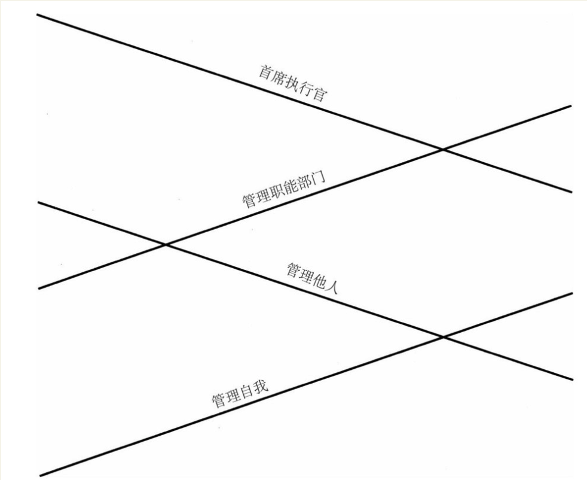
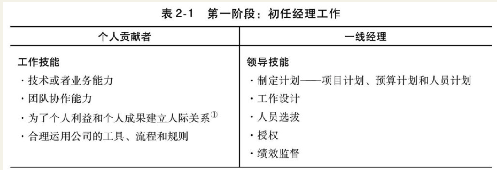

    作者: 拉姆•查兰 (Ram Charan) / 斯蒂芬•德罗特 (Stephen Drotter) / 詹姆斯•诺埃尔 (James Noel)
    出版社: 机械工业出版社
    副标题: 全面打造领导力驱动型公司(原书第2版)
    原作名: The Leadership Pipeline: How to Build the Leadership Powered Company
    译者: 徐中 / 林嵩 / 雷静
    出版年: 2011-7
    页数: 280
    定价: 42.00元
    装帧: 平装
    ISBN: 9787111349341

[豆瓣链接](https://book.douban.com/subject/6536593/)

- [导论](#%e5%af%bc%e8%ae%ba)
  - [领导梯队的各个阶段](#%e9%a2%86%e5%af%bc%e6%a2%af%e9%98%9f%e7%9a%84%e5%90%84%e4%b8%aa%e9%98%b6%e6%ae%b5)
- [第1章 概述：领导力发展的六个阶段](#%e7%ac%ac1%e7%ab%a0-%e6%a6%82%e8%bf%b0%e9%a2%86%e5%af%bc%e5%8a%9b%e5%8f%91%e5%b1%95%e7%9a%84%e5%85%ad%e4%b8%aa%e9%98%b6%e6%ae%b5)
  - [第一阶段：从管理自我到管理他人](#%e7%ac%ac%e4%b8%80%e9%98%b6%e6%ae%b5%e4%bb%8e%e7%ae%a1%e7%90%86%e8%87%aa%e6%88%91%e5%88%b0%e7%ae%a1%e7%90%86%e4%bb%96%e4%ba%ba)
  - [第二阶段：从管理他人到管理经理人员](#%e7%ac%ac%e4%ba%8c%e9%98%b6%e6%ae%b5%e4%bb%8e%e7%ae%a1%e7%90%86%e4%bb%96%e4%ba%ba%e5%88%b0%e7%ae%a1%e7%90%86%e7%bb%8f%e7%90%86%e4%ba%ba%e5%91%98)
  - [第三阶段：从管理经理人员到管理职能部门](#%e7%ac%ac%e4%b8%89%e9%98%b6%e6%ae%b5%e4%bb%8e%e7%ae%a1%e7%90%86%e7%bb%8f%e7%90%86%e4%ba%ba%e5%91%98%e5%88%b0%e7%ae%a1%e7%90%86%e8%81%8c%e8%83%bd%e9%83%a8%e9%97%a8)
  - [第四阶段：从管理职能部门到事业部总经理](#%e7%ac%ac%e5%9b%9b%e9%98%b6%e6%ae%b5%e4%bb%8e%e7%ae%a1%e7%90%86%e8%81%8c%e8%83%bd%e9%83%a8%e9%97%a8%e5%88%b0%e4%ba%8b%e4%b8%9a%e9%83%a8%e6%80%bb%e7%bb%8f%e7%90%86)
  - [第五阶段：从事业部总经理到集团高管](#%e7%ac%ac%e4%ba%94%e9%98%b6%e6%ae%b5%e4%bb%8e%e4%ba%8b%e4%b8%9a%e9%83%a8%e6%80%bb%e7%bb%8f%e7%90%86%e5%88%b0%e9%9b%86%e5%9b%a2%e9%ab%98%e7%ae%a1)
  - [第六阶段：从集团高管到首席执行官](#%e7%ac%ac%e5%85%ad%e9%98%b6%e6%ae%b5%e4%bb%8e%e9%9b%86%e5%9b%a2%e9%ab%98%e7%ae%a1%e5%88%b0%e9%a6%96%e5%b8%ad%e6%89%a7%e8%a1%8c%e5%ae%98)
  - [领导梯队模型在小公司的应用](#%e9%a2%86%e5%af%bc%e6%a2%af%e9%98%9f%e6%a8%a1%e5%9e%8b%e5%9c%a8%e5%b0%8f%e5%85%ac%e5%8f%b8%e7%9a%84%e5%ba%94%e7%94%a8)
- [第2章 从管理自我到管理他人](#%e7%ac%ac2%e7%ab%a0-%e4%bb%8e%e7%ae%a1%e7%90%86%e8%87%aa%e6%88%91%e5%88%b0%e7%ae%a1%e7%90%86%e4%bb%96%e4%ba%ba)
  - [初任经理的三项重要工作](#%e5%88%9d%e4%bb%bb%e7%bb%8f%e7%90%86%e7%9a%84%e4%b8%89%e9%a1%b9%e9%87%8d%e8%a6%81%e5%b7%a5%e4%bd%9c)
  - [界定和布置工作](#%e7%95%8c%e5%ae%9a%e5%92%8c%e5%b8%83%e7%bd%ae%e5%b7%a5%e4%bd%9c)
  - [提高下属的胜任能力](#%e6%8f%90%e9%ab%98%e4%b8%8b%e5%b1%9e%e7%9a%84%e8%83%9c%e4%bb%bb%e8%83%bd%e5%8a%9b)
- [第3章 从管理他人到管理经理人员](#%e7%ac%ac3%e7%ab%a0-%e4%bb%8e%e7%ae%a1%e7%90%86%e4%bb%96%e4%ba%ba%e5%88%b0%e7%ae%a1%e7%90%86%e7%bb%8f%e7%90%86%e4%ba%ba%e5%91%98)
  - [部门总监错位的五种现象](#%e9%83%a8%e9%97%a8%e6%80%bb%e7%9b%91%e9%94%99%e4%bd%8d%e7%9a%84%e4%ba%94%e7%a7%8d%e7%8e%b0%e8%b1%a1)
  - [部门总监该做什么](#%e9%83%a8%e9%97%a8%e6%80%bb%e7%9b%91%e8%af%a5%e5%81%9a%e4%bb%80%e4%b9%88)
  - [让一线经理对管理工作负责](#%e8%ae%a9%e4%b8%80%e7%ba%bf%e7%bb%8f%e7%90%86%e5%af%b9%e7%ae%a1%e7%90%86%e5%b7%a5%e4%bd%9c%e8%b4%9f%e8%b4%a3)

## 导论
### 领导梯队的各个阶段
图0-1说明了领导者职业发展所经历的六个主要发展阶段。

每个阶段都要求领导者习得一种新的管理和领导方法，同时抛弃原有的方法。这主要表现在以下三个方面：

- 领导技能——胜任新职务所需要的新能力。
- 时间管理——新的时间分配结构，决定如何工作。
- 工作理念——信念和价值观非常重要，让工作聚焦。

## 第1章 概述：领导力发展的六个阶段
### 第一阶段：从管理自我到管理他人
对他们能力的要求主要是专业化和职业化。他们通过在计划时间内完成任务来做出贡献，通过不断拓展和提升个人技能，在岗位上做出更大贡献，从而获得组织的提升。随着工作年限的增加，他们学习的内容包括工作计划、进度管理、工作内容、工作质量和工作的可靠性，需要提高的工作价值观包括公司文化和职业标准。

在领导力发展的第一阶段，应该学习的技能包括工作计划、知人善任、分配工作、激励员工、教练辅导和绩效评估。

### 第二阶段：从管理他人到管理经理人员
在第二阶段，经理人员如果只重视个人贡献和部门工作，而忽视对其他部门和公司整体的贡献，那么他们的角色转变将非常困难。

### 第三阶段：从管理经理人员到管理职能部门
事业部副总经理需要向事业部总经理汇报工作，因此，他们必须有全局意识，能够兼顾多个部门的需求和利益。他们需要具备两项新的技能：一方面是与其他部门团结协作，另一方面是基于工作的需要与其他部门争夺资源。与此同时，他们还必须擅长制定战略，不仅为自己的部门，而且统筹整个业务部门的战略规划。

领导力发展的第三阶段要求管理者更加成熟。一方面，成熟意味着他们的思考和行动像事业部副总经理，而不是部门总监。另一方面，也要求他们有开阔的、长期的战略眼光，对于他们所主管的部门有前瞻性的、准确的长远考虑，这常常给他们带来巨大的挑战。

### 第四阶段：从管理职能部门到事业部总经理
事业部总经理不仅要学会管理不同的部门，而且需要熟练地与各方面的人员协同工作，敏锐地意识到各部门的利益点，并清楚、有效地与各方面人员沟通。更具挑战性的是，如何兼顾长远目标与近期目标，取得恰当的平衡。事业部总经理必须完成季度利润、市场目标、产品计划和人员管理目标，同时兼顾未来3～5年目标的实现。

### 第五阶段：从事业部总经理到集团高管
这个阶段要求领导者在四项关键技能方面进一步提升。

1. 集团高管必须擅长评估资金调拨和人员配置的战略规划。这是一项复杂的商业技能，包括学会正确的提问，有效地分析数据，以及从公司的角度去理解哪些战略规划最有可能成功，最应该得到支持。
2. 培养事业部总经理。他需要清楚哪些事业部副总经理的能力最适合担任事业部总经理，并提升自己的教练辅导能力。
3. 评估业务的投资组合策略。这与事业部的战略有很大不同。他第一次需要问以下几个问题：我们有合适的业务群吗？为确保当前和未来的赢利，需要增加什么业务？削减哪项业务？调整哪项业务？
4. 集团高管必须精于评估自己的核心能力，采取冷静客观的态度，评估手中的资源，基于分析和经验做出判断，而不是盲目乐观。

### 第六阶段：从集团高管到首席执行官
领导力发展的第六阶段，其转变更多地集中在经营理念而不是管理技能方面。首席执行官必须确认自己的角色和职责。作为一位组织的最高领导，他必须是一位有着远大抱负的思想者，同时善于建立公司的运行机制，推动公司实现每个季度的业绩目标，并确保公司长期战略目标的实现。权衡取舍是首席执行官日常的功课，他们必须学会适应和掌握这门艺术。此外，敏锐地觉察并熟练地处理外部利益相关者关系、重大的外部变化以及积极主动地加以应对，变得越来越重要。首席执行官必须具备重视外部关系的视角。

### 领导梯队模型在小公司的应用
小公司领导力发展模型：

在小公司，首席执行官与大公司的事业部总经理类似（对短期目标和长期目标负责，并协调政府关系、客户关系等方方面面），部门总监常常被归类到公司团队成员。

## 第2章 从管理自我到管理他人
第一次担任经理要想获得成功需要一个重大的转变，即他们的工作成果不再是通过自己亲自做去获得，而是通过下属和团队的努力去获得。

### 初任经理的三项重要工作
表2-1概述了这一层级必须经过的转型。

转型可以概括为以下三个方面：
- 界定和布置工作，包括与上司、员工沟通，需要他们做什么，以及工作计划、组织结构、人员选拔和工作授权。
- 通过监督、指导、反馈、获取资源、解决问题和交流沟通，提高下属的胜任能力，从而高效开展工作。
- 建立与下属、上司和相关部门坦率交流与相互信任的合作关系。

### 界定和布置工作
许多一线经理由于没有与关键人员有效地沟通，结果在工作设计和安排时跌了跟头。只有通过有效沟通，一线经理才能很好地理解部门的工作要求，合理布置工作，使得人岗匹配，任务得以及时、高效地完成。

对一线经理来说，听取直接上级的意见当然重要，但与同级、客户、供应商、业务伙伴和其他有关部门的沟通也变得越来越重要。

授权对新任经理是另一个挑战。经理首先需要清楚做哪些工作，谁最合适去做。但放手让他人去做你非常擅长并且为你带来成功的业务，新任经理在心理上难以接受。通常只有当他们意识到授权并不意味着放弃时，他们才会迈出这一步。

新任经理人还必须学会知人善任，选拔合适的人做合适的事。

### 提高下属的胜任能力
经理既需要定期与员工沟通，也需要密切关注工作流程的执行情况。他们要询问是什么阻碍了工作完成，什么促进了工作完成。监督是一项主动而非被动的工作，仅仅动笔记录是不够的，当结果与期望一致时，就应当给予员工适时的鼓励，比如，在员工肩头轻轻一拍表示肯定，同时给予积极的反馈意见；当结果令人失望时，应通过监督获得的信息进行计划调整、方法调整、加强培训，以及要求增加更多资源支持等措施，让工作回到良性发展的轨道。

亲和力不是指让办公室大门敞开，被动回应员工提出的问题，而是一种积极的态度，从言语到行动，都显示他是一位平易近人的领导，让员工喜欢与之亲近，并随时可以找到他。这与其说是一种技能，不如说是一种价值观和工作方法。

## 第3章 从管理他人到管理经理人员
### 部门总监错位的五种现象
1. 授权问题。一线经理常常存在这类问题，但有时可以敷衍过去。但随着领导层级的提升，授权不足的负面影响越来越大。授权问题也不仅仅是授权不足，有可能是授权方式不当，他们缺乏授权后的问责系统。
2. 绩效管理问题。这个问题在于，部门总监很少或者不善于向下属经理提供反馈，没有给出正确的努力方向，下属不确定真正的目标是什么。换句话说，部门总监不能有效地与下属经理沟通。
3. 团队建设问题。总监仅仅把下属经理当成个人，而不是把他们组织成高效的团队，无意之中助长了个人主义，影响了团队的信息共享和协同支持。
4. 仅仅囿于完成任务的思维模式。总监们没有充分考虑新岗位的领导力转型，他仍然像一线经理一样开展工作，而没有意识到自己是一个经理人员发展的教练和导师，也很少对战略和文化层面的问题表现出兴趣。
5. 选拔“自己人”总监经常有机会选拔下属经理。遗憾的是，他们缺乏这方面的训练，经常选择和他们相似的下属。这不仅导致了人员结构不够多元化，而且由于他们缺乏领导才能，从而阻碍了领导梯队的畅通。

### 部门总监该做什么
以下四种领导技能至关重要：

- 选拔和培养有能力的一线经理。
- 让一线经理对管理工作负责。
- 在各部门配置各种资源。
- 有效协调自己的直接下属部门和其他相关部门的工作。

### 让一线经理对管理工作负责

