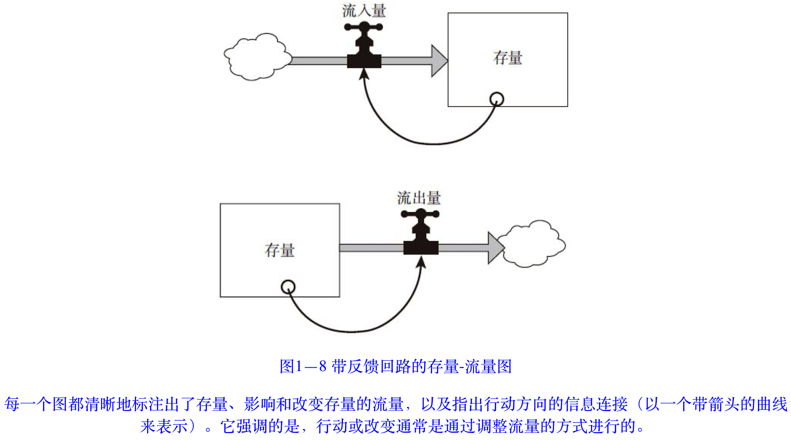
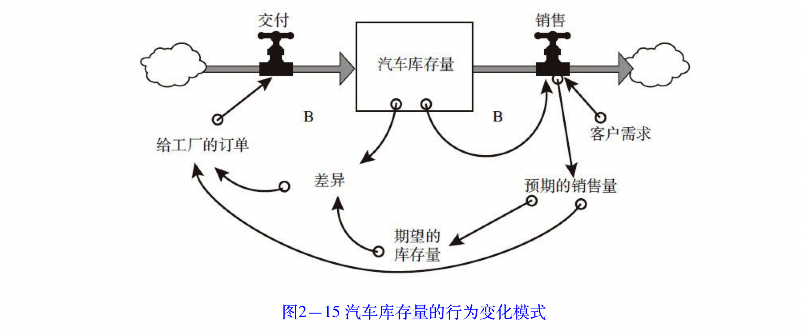
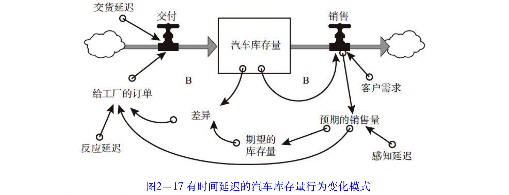

    作者:  [美] 德内拉·梅多斯
    出版社: 浙江人民出版社
    出品方: 湛庐文化
    副标题: 决策者的系统思考
    原作名: Thinking in Systems: a Primer
    译者: 邱昭良
    出版年: 2012-8
    页数: 290
    定价: 56.90元
    装帧: 平装
    ISBN: 9787213050114

[豆瓣链接](https://book.douban.com/subject/11528220/)

- [引言 系统多棱镜](#引言-系统多棱镜)
  - [无处不在的系统](#无处不在的系统)
  - [重塑系统，发现更大的世界](#重塑系统发现更大的世界)
- [第一部分 系统的结构和行为](#第一部分-系统的结构和行为)
  - [第1章 系统之基础](#第1章-系统之基础)
    - [总体大于部分之和](#总体大于部分之和)
    - [从关注要素到透视游戏规则](#从关注要素到透视游戏规则)
    - [理解系统行为的动态性](#理解系统行为的动态性)
    - [反馈：系统是如何运作的](#反馈系统是如何运作的)
    - [自动洄游的鱼：调节回路](#自动洄游的鱼调节回路)
    - [脱缰的野马：增强回路](#脱缰的野马增强回路)
  - [第2章 系统大观园](#第2章-系统大观园)
    - [单存量系统](#单存量系统)
      - [系统1.1：一个存量、两个相互制衡的调节回路的系统](#系统11一个存量两个相互制衡的调节回路的系统)
      - [系统1.2：一个存量、一个增强回路以及一个调节回路的系统](#系统12一个存量一个增强回路以及一个调节回路的系统)
      - [系统1.3：含有时间延迟的系统](#系统13含有时间延迟的系统)
    - [双存量系统](#双存量系统)
      - [统2.1：一个可再生性存量受到另外一个不可再生性存量约束的系统](#统21一个可再生性存量受到另外一个不可再生性存量约束的系统)
      - [系统2.2：有两个可再生性存量的系统](#系统22有两个可再生性存量的系统)
- [第二部分 系统思考与我们](#第二部分-系统思考与我们)
  - [第3章 系统之美：系统的3大特征](#第3章-系统之美系统的3大特征)

# 引言 系统多棱镜
## 无处不在的系统
一旦我们看清了结构和行为之间的关系，我们便能开始了解系统如何运作，为什么会出现一些问题，以及如何让系统转向符合人们预期的行为模式。

什么是`系统`呢？系统是一组相互连接的事物，在一定时间内，以特定的行为模式相互影响，例如人、细胞、分子等。系统可能受外力触发、驱动、冲击或限制，而系统对外力影响的反馈方式就是系统的特征。在真实的世界中，这些反馈往往是非常复杂的。

## 重塑系统，发现更大的世界
系统思考研究者有时将这些常见的、会引发特定行为的系统结构称为`“系统基模”`（archetypes）；这些基本模型既是一些顽固、棘手和潜在危害性极大的问题的根源，也是实现有效行为改变的`“杠杆点”`。

# 第一部分 系统的结构和行为
## 第1章 系统之基础
### 总体大于部分之和
对于一个系统来说，整体大于部分之和。任何一个系统都包括三种构成要件：要素、连接、功能或目标。它具有适应性、动态性、目的性，并可以自组织、自我保护与演进。

### 从关注要素到透视游戏规则
_苏菲教育故事_

>因为“一加一等于二”，所以你自认为只要知道“一”，就能知道“二”，但是你忘了，你还必须理解两个“一”之间的关系。

_系统多棱镜_

>请思考以下问题：如何才能知道你观察的是一个系统，而不是一堆材料的集合？
>
>1. 你能够识别出各个部分吗？
>2. 这些部分相互之间有联系吗？
>3. 这些部分单独作用时产生的影响和它们整合在一起时产生的影响有所不同吗？
>4. 这些影响和长期的行为在各种环境中都是固定不变的吗？

_系统之思_

>系统中的很多连接是通过信息流进行运作的。信息使系统整合在一起，并对系统的运作产生重要影响。

_系统之思_

>总的来说，“功能”一词常用于非人类系统，而“目标”一词则用于人类系统。但它们之间的区分并不是绝对的，因为很多系统兼具人类和非人类要素。

- 有些人想要尽快摆脱心灵上的伤痛；
- 农民、商人和银行家都想要赚钱；
- 贩毒人员对法律的约束无所畏惧，但是又害怕警察的打击；
- 政府颁布禁毒法令，并借助警力维护法律，打击毒品贩卖；
- 富人们居住在离穷人很近的地方；
- 吸毒者更关心如何保护自己，而非戒除毒瘾。

在社会系统中，上述这些要素各自的目标看起来都是正当的，但它们组合成为一个系统，相互影响，就造成了吸毒和犯罪日益蔓延并很难被根除的恶果。由于系统中嵌套着系统，所以目标中还会有其他目标。

**一个成功的系统，应该能够实现个体目标和系统总目标的一致性**。

如果系统中的个体是一个接一个地发生变化，那么，我们就能够识别出系统中有哪些要素、它们之间的内在联系、系统的目标以及各种要素的相对重要性。但事实并非如此。虽然系统中的某些要素是很重要的，但一般说来，**改变要素对系统的影响是最小的**。

_系统之思_

>系统中最不明显的部分是它的功能或目标，而这常常是系统行为最关键的决定因素。

功能或目标的改变也会对系统产生重大影响。如果仍旧保留那些球员和规则，但改变比赛的目标——看谁输而不是谁赢；如果树木的生存目标不是为了繁衍后代，而是为了获取土壤中所有的营养成分，以无限成长；如果大学的目标不仅是传播知识，还要实现赚钱、教导民众、赢取球赛等目的，情况会怎么样？显然，**目标的变化会极大地改变一个系统，即使其中的要素和内在连接都保持不变**。

_系统提示_
>系统三要件的关系
>
>对一个系统来说，`要素`、`内在连接`和`目标`，所有这些都是必不可少的，它们之间相互联系，各司其职。一般来说，系统中最不明显的部分，即功能或目标，才是系统行为最关键的决定因素；内在连接也是至关重要的，因为改变了要素之间的连接，通常会改变系统的行为；尽管要素是我们最容易注意到的系统部分，但它对于定义系统的特点通常是最不重要的——除非是某个要素的改变也能导致连接或目标的改变。

### 理解系统行为的动态性
`“存量”`是所有系统的基础。所谓存量，是指在任何时刻都能观察、感知、计数和测量的系统要素。如其名称所示，在系统中，存量是储存量、数量或物料、信息在一段时间内的积累量。它有可能是浴缸中的水、人口数量、书店中的书、树木的体积、银行里的钱，等等。但是，存量不一定非得是物质的，你的自信、在朋友圈中的良好口碑，或者对世界的美好希冀等，都可以是存量。

_系统之思_

>存量是对系统中变化量的一种历史记录。

存量会随着时间的变化而不断改变，使其发生变化的就是“流量”。所谓`流量`，是一段时间内改变的状况。例如浴缸中注入或流出的水量、出生或死亡的人数、买入或卖出的数量、成长或衰退、存入或取出、成功或失败等（如图1—1所示）。

_系统提示_

>如何阅读存量—流量图
>
>在本书中，存量用方框来表示，流量则用流入或流出存量的、带箭头的水管来表示。在每个流量上标有一个T型图案，代表“水龙头”，表示流量可以被调高或调低、打开或关闭；在流量的前端或后端，有时会画一个“云朵”图案，表示该流量的资源和消耗，也就是该流量从哪里来、到哪里去。虽然我们可以进一步明确这些来源和去处，但这样会把我们对当前系统的分析变得过于庞杂。因此，出于简化当前讨论的需要，我们可以把这些因素用“云”来概略地表示。

地下的矿藏是一个存量，随着该矿藏被人们发现和开采，会产生一个矿藏开采的流量。由于矿藏的形成（流入量）可能是数百万年前各种复杂地质变化的综合作用，很难全面表述，因此这里用一个简单的存量-流量图进行描述（如图1—2所示，图中没有画出流入量）。

大坝后面水库中的水也是一个存量，流入量有雨水和江河的来水，流出量包括水的蒸发和堤坝放水（如图1—3所示）。

一片森林中所有树木的蓄积量也是一个存量，流入量是树木的生长，流出量包括树木的自然死亡和伐木工的砍伐。被砍伐的木材累积起来，会形成另外一个存量，即伐木工厂里木材的存货量；而当木材出售给客户时，就会产生一个流出量，减少库存（如图1—4所示）。

现在，让我们以大家都多少有些体验的“浴缸”为例，来理解存量和流量的动态特性（如图1—5所示）。

上述的浴缸就是一个非常简单的系统，只有一个存量、一个流入量和一个流出量。由此，你可以推断出几项重要的原则，它们同样适用于其他更为复杂的动态系统：

- 只要所有流入量的总和超过了流出量的总和，存量的水平就会上升。
- 只要所有流出量的总和超过了流入量的总和，存量的水平就会下降。
- 如果所有流出量的总和与流入量的总和相等，存量的水平将保持不变；事实上，无论在任何情况下，当系统的流入量和流出量相同时，系统就处于动态平衡的状态。

人类的大脑似乎更加容易关注存量，而不是流量。更进一步地说，当我们关注流量时，我们更容易倾向于关注流入量，而不是流出量。因此，我们有时候会忽视这样一个事实：如果要灌满浴缸，不能只是提高流入速率，还需要降低流出速率。

_系统之思_

>要想使存量增加，既可以通过提高流入速率来实现，也可以通过降低流出速率来实现。请注意，要灌满一个浴缸，不是只有一种方式。

人们经常低估存量的内在动量。

_系统之思_

>存量的变化一般比较缓慢，即使在流入量或流出量突然改变的情况下，也是如此。因此，存量可以在系统中起到延迟、缓存或减震器的作用。

因此，可以说，存量的改变设定了系统动态变化的速度。

在系统中，由于存量变化缓慢而产生的时间滞后可能会导致一些问题，与此同时，它们也是系统稳定性的根源所在。存量变化缓慢所产生的时间滞后，让人们有了一定的余地去调整、尝试一些做法，并根据反馈来修订那些不奏效的政策。

**如果你对存量的变化速度有正确的认知，你就不会“拔苗助长”，期待事物变化的速度超出其特定规律；同时，你也不会过早地放弃，因为你知道一项措施要想见到成效，也需要时间；此外，你也可以更好地把握系统动量所展现的机会，“顺势而为”，就像一个高超的柔道选手善于利用对手的力量那样，聪明地实现自己的目标**。

对于存量在系统中所起的作用，还有一个更为重要的原则，那就是：由于存量的存在，流入量和流出量可以相互独立，并在一定时期内不必保持平衡或一致。这一原则可以引导我们直接了解反馈的概念。

_系统之思_

>由于存量的存在，流入量和流出量可以被分离开来，相互独立，并可以暂时地失衡。

事实上，人类发明了成千上万种存量维持机制，以确保流入和流出量相互独立和稳定。

由于大量存量维持机制的存在，大多数个人和组织的决策也会受到存量水平的影响：如果库存过高，就会降低价格，或者增加广告或促销方面的预算，以增加销售量，削减库存。

人们不断地监控存量的变化，根据其状况和特定规则，制定决策并采取相应行动，以增加或降低存量水平，使其保持在可接受的范围内。这些决策累加起来，会对各种相关的系统造成复杂的影响，带来不同程度的起伏、涨落，也造成了各种问题或取得了成功。因此，从系统思考的角度来看，我们这个世界可以被视为各种各样存量的组合，围绕着这些存量，存在着各种不同的存量调节机制，而后者主要表现为各种各样的流量。

### 反馈：系统是如何运作的
_系统之思_

>一个反馈回路就是一条闭合的因果关系链，从某一个存量出发，并根据存量当时的状况，经过一系列决策、规则、物理法则或者行动，影响到与存量相关的流量，继而又反过来改变了存量。

### 自动洄游的鱼：调节回路
如果你习惯喝咖啡（或茶），当你感觉有些倦怠时，你可能会煮上一杯浓浓的黑咖啡，让自己重新振作起来。你，作为喝咖啡的人，在头脑中有一个期望的精神状态；当你察觉到实际精神状态与期望状态之间存在差异时，你会通过喝咖啡这一系统，摄入咖啡中的咖啡因，从而调整自身能量的新陈代谢，使自己的实际精神状态（存量）接近或达到期望的水平。

图1—9 喝咖啡的人的能量系统

这一类反馈回路具有保持存量稳定、趋向一个目标进行调节或校正的作用，我们称之为`“调节回路”`。在图中，我在该回路的内部标了一个字母“B”，以示区别。当系统中存在调节回路时，面对各种变化，它都会采取措施，消除这些变化对系统的影响，使存量保持在某一个目标值或可接受的范围之内，系统行为会因此表现出“寻的”或“动态平衡”的特征。无论你是想让存量水平升高或降低，调节回路都会想方设法，将其拉回到预期状态或设定的范围之内。

大家都知道，煮完咖啡以后，如果你没有及时把它喝掉，咖啡会逐渐冷却到室温状态，而它冷却的速度取决于咖啡的温度和室温之间的差距：二者的差距越大，咖啡凉得就越快。与上面的案例类似，这一回路的作用方向也有两种——另外一种情况是，如果你在夏天做了一杯冰咖啡，它将逐渐变热，直到达到室内温度为止。该系统的功能是缩小咖啡的温度和室温之间的差距，直至差距为零，不管二者的差距是正还是负（如图1—10所示）。

_系统之思_

>在系统中，调节回路是保持平衡或达到特定目标的结构，也是稳定性和抵制变革的根源。

### 脱缰的野马：增强回路
第二类反馈回路的作用是不断放大、增强原有的发展态势，自我复制，像“滚雪球”一样。它们是一个良性循环或恶性循环，既可能导致系统不断成长，越来越好；也可能像脱缰的野马，导致局势越来越差，造成巨大的破坏甚至毁灭。我们将这一类回路称为`“增强回路”`。为了表示区别，我在这类回路内部标注了一个字母“R”。在这类回路的作用下，系统的存量越大，存量的流入量也就越多，导致存量进一步变得更大；反之亦然。总之，增强回路会强化系统原有的变化态势。

银行账户的余额越大，你所能获得的利息就越多，这使你的存款金额更大，你下一期获得的利息更多（如图1—12所示）。

_系统之思_

>增强回路是自我强化的。随着时间的变化，增强回路会导致指数级增长或者加速崩溃。当系统中的存量具有自我强化或复制的能力时，你就能找到推动其增长的增强回路。

_系统提示_

>对增强回路和时间翻倍的提示
>
>因为我们经常会遇到增强回路，所以很容易知道这一速算诀窍：对于指数级增长来说，存量翻倍所花费的时间，约等于70除以增长率（以百分数来表示）。
>
>举例来说，如果你把100美元存入银行，年利率是7%，那么10年后，你的钱会翻一倍（70/7=10）；如果利率只有5%，那么这笔钱要翻倍就需要花14年时间。

## 第2章 系统大观园
### 单存量系统
#### 系统1.1：一个存量、两个相互制衡的调节回路的系统
典型代表：温度调节器，图2—1中的温度调节器是一个简化了的家用制热系统的工作原理。

从这里，我们可以得出一条很重要的系统基本原则：由反馈回路所传递的信息只能影响未来的行为，不能立即改变系统当前的行为。**因为信息经由反馈回路的传递需要时间**，如果你根据当前反馈做出了一项决策，它不能足够快地发送一个信号，去修正由当前反馈所驱动的系统行为，这期间必然有一定的延迟。所以，**你的决策只能影响未来的行为，不能改变当前的系统行为**。

_系统之思_

>在一个由存量维持的调节回路中，设定目标时，必须适当考虑补偿对存量有重要影响的流入和流出过程。否则，反馈过程将超出或低于存量的目标值。

为什么说这条原则很重要呢？因为它意味着，在行为与结果响应之间经常会有时间延迟。也就是说，一个流量不能立即对其自身做出调整，它只能对存量的变化做出反应，而这必然是在一段时间的延迟之后，等待信息反馈达到一定程度。至于时间延迟的长短，取决于具体的系统情境。例如，对于一个浴缸，你可能只需要花很少时间，就可以估计出水的深度，从而决定调整水的流量。但对于一个复杂的经济系统，一个决策可能需要很长时间才能见到效果，而信息的反馈通常非常缓慢、微妙、杂乱，难以把握。因此，很多人在对经济学相关问题进行建模时，经常假设消费或生产会快速地对诸如价格等要素的变化做出反应，这肯定是错的。真实的经济系统肯定不是这样运作的。

#### 系统1.2：一个存量、一个增强回路以及一个调节回路的系统
典型代表：人口和工业经济，与我们每个人都息息相关的人口和工业经济体系就是这样的系统（如图2—7所示）。

人口受到一个增强回路和一个调节回路的影响：增强回路决定新出生的人数，受出生率的影响，导致人口数量增长；调节回路影响当期死亡的人数，受死亡率的影响，导致人口数量减少。

_系统之思_

>当不同调节回路的相对优势发生改变时，系统常会出现一些复杂的行为，由一个回路主导的某种行为模式会变为另外一种。

在经济系统的核心，也存在一个“增强回路+调节回路”的系统，其结构与人口系统类似，因此这两个子系统也具有类似的行为模式（如图2—13所示）。

#### 系统1.3：含有时间延迟的系统
典型代表：库存。假设要维持足够10天销售的库存量（如图2—15所示）。汽车经销商需要保持一定的库存，因为每天到货交付的数量和销售量不可能完美地匹配，而且每天客户的购买量也很难预测。此外，经销商还需要多保持一些额外的库存作为缓冲，以防供应商偶尔出现交货延迟或其他意外情况。

在图2—17中，我们对这个简单的模型进行了一些微调，加入了三个时间延迟（感知延迟、反应延迟和交货延迟），这些都是我们在现实中经常会遇到的情况。

_系统之思_

>调节回路上的时间延迟很可能导致系统的振荡。

### 双存量系统
#### 统2.1：一个可再生性存量受到另外一个不可再生性存量约束的系统
到现在为止，我们所讨论的系统都没有考虑外部因素的约束。例如，在工业经济系统中，资本存量未考虑原材料和产出的限制；人口系统中，未考虑食物的限制；在温度调节器系统中，也未考虑火炉可能缺油的限制。

任何物理的、成长的系统，或早或晚都会受到某种形式的制约。这些限制因素通常以调节回路的形式存在，在某些条件下，这些调节回路会取代驱动成长的增强回路成为主导性回路，要么是提高流出量，要么是减少流入量，从而阻碍系统的进一步成长。

在现实环境中，受限制的成长是非常普遍的，以至于系统思考专家将其当成一种`“基本模型”`，命名为`“成长上限”（limits-to-growth）`。所谓`“系统基模”`，指的是一些常见的系统结构，可以导致人们熟悉的一些行为模式。

_系统之思_

>在呈指数级成长的实体系统中，必然存在至少一个增强回路，正是它（或它们）驱动着系统的成长；同时，也必然存在至少一个调节回路，限制系统的成长，因为在有限的环境中，没有任何一个物理系统可以永远地增长下去。

典型代表：石油经济。假如有一家公司，通过提炼一种不可再生性资源（比如石油）来赚钱。它们刚刚发现了一个巨大的新油田，如图2—23所示。

#### 系统2.2：有两个可再生性存量的系统
典型代表：渔业经济。在这里，可再生性资源是鱼，资本存量是渔船。其实，类似这样的系统还有很多，例如树木与伐木场、牧场与奶牛等。

图2—28 经济资本受一个增强回路推动而成长，并受一个可再生性资源约束的情况

_系统之思_

>可再生性资源主要受限于流量。只要开发（流出量）的速度等于资源再生（流入量）的速度，它们就可以被无限地开采或捕捞；如果开发的速度快于再生的速度，资源存量最终可能低于某个关键转折点，从而转变为“不可再生性资源”，逐渐耗尽。

# 第二部分 系统思考与我们
## 第3章 系统之美：系统的3大特征

