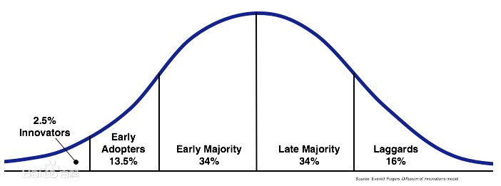
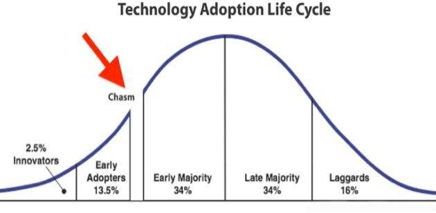

    作者:  [美] 杰弗里·摩尔
    出版社: 机械工业出版社
    副标题: 颠覆性产品营销圣经
    原作名: Crossing the chasm
    译者: 赵娅
    出版年: 2009-1
    页数: 251
    定价: 36.00元
    装帧: 平装
    ISBN: 9787111246350

[豆瓣链接](https://book.douban.com/subject/3320425/)

- [第1章 高科技营销的幻象](#第1章-高科技营销的幻象)
  - [1.1 技术采用生命周期](#11-技术采用生命周期)
  - [1.2 高科技营销模型](#12-高科技营销模型)
  - [1.4 幻象与醒悟：钟形曲线中的裂缝](#14-幻象与醒悟钟形曲线中的裂缝)
    - [1.4.1 第一个裂缝](#141-第一个裂缝)
    - [1.4.2 另外一个裂缝](#142-另外一个裂缝)
  - [1.5 发现鸿沟](#15-发现鸿沟)
  - [1.6 鸿沟中的牺牲者](#16-鸿沟中的牺牲者)
- [第2章 高科技营销的启示](#第2章-高科技营销的启示)
  - [2.1 基本原则](#21-基本原则)
  - [2.2 早期市场](#22-早期市场)
    - [2.2.1 创新者：技术的狂热追随者](#221-创新者技术的狂热追随者)
    - [2.2.2 早期采用者：有远见卓识的人](#222-早期采用者有远见卓识的人)
  - [2.3 早期市场中的动力学](#23-早期市场中的动力学)
  - [2.4 主流市场](#24-主流市场)
    - [2.4.1 早期大众：实用主义者](#241-早期大众实用主义者)
    - [2.4.2 后期大众：保守主义者](#242-后期大众保守主义者)
  - [2.5 主流市场中的动力学](#25-主流市场中的动力学)
  - [2.6 落后者：怀疑主义者](#26-落后者怀疑主义者)
  - [2.7 回到鸿沟](#27-回到鸿沟)
- [第3章 准备行动](#第3章-准备行动)
  - [3.1 鸿沟中的危机](#31-鸿沟中的危机)
  - [3.2 如何生火](#32-如何生火)
  - [3.3 微软的命运](#33-微软的命运)
  - [3.4 市场空白之外](#34-市场空白之外)
  - [3.5 成功跨越鸿沟](#35-成功跨越鸿沟)
  - [3.6 Clarify:—家顾客服务型应用软件企业成功跨越鸿沟](#36-clarify家顾客服务型应用软件企业成功跨越鸿沟)
  - [3.7 Documentum:—家文档管理应用软件公司成功跨越鸿沟](#37-documentum家文档管理应用软件公司成功跨越鸿沟)
  - [3.8 3ComPalm Pilot:—家独立操作平台公司成功跨越鸿沟](#38-3compalm-pilot家独立操作平台公司成功跨越鸿沟)
  - [3.9 SmartCards:—家分布式操作平台企业成功跨越鸿沟](#39-smartcards家分布式操作平台企业成功跨越鸿沟)
- [第4章 瞄准目标](#第4章-瞄准目标)
  - [4.1 风险大、数据少的决策](#41-风险大数据少的决策)
  - [4.2 基于一定信息的直觉](#42-基于一定信息的直觉)
  - [4.3 目标顾客形象刻画：情景刻画的用途](#43-目标顾客形象刻画情景刻画的用途)
  - [4.4 电子书：一个很有解释力的例子](#44-电子书一个很有解释力的例子)

# 第1章 高科技营销的幻象
## 1.1 技术采用生命周期
事实证明，从营销学的角度来看，只要我们面对的新产品需要我们改变自己一贯的行为模式，或者需要对我们目前依赖的产品或服务进行改进时，我们对于技术采用的态度就会变得越来越重要。在学术上，这种对改变非常敏感的产品被称为`“不连续性创新”(discontinuous innovations)`。而与之相反的另一个术语，`“连续性创新”(continuous innovations)`,则指的是产品的正常升级，这种创新并不需要我们改变当前的行为。

例如，当佳洁士承诺能使你的牙齿更洁白，这就是一个连续性创新。因为你每天还在使用同样的牙刷，以同样的方式刷你的牙齿。当福特公司生产的新款Taurus汽车向你承诺更远的里程，当戴尔公司的最新型电脑向你承诺更快的运行速度和更大的存储空间，或者当索尼公司的电视机向你承诺更清晰更明亮的电视画面时，这些也都属于连续性创新。因为作为一名消费者，你并不需要为了采用这些改进的技术而改变自己的行为。

如果索尼公司生产的电视机是一台髙清电视，它将与当今的广播标准不兼容，这就需要你想办法寻找特定的编码资源。这就是一种不连续性创新，因为你必须改变自己以往收看电视的习惯。同样，如果新型的戴尔计算机中安装的是Be操作系统，那么它与如今的数据库也不兼容。这时你也需要找到一系列全新的软件来配合这台计算机的使用，因此这种技术改进就属于不连续性创新。或者，如果我们刚才提到的新款福特汽车使用的燃料是电力而不是汽油，又或者新研制的牙膏是一种漱口水，你在使用的时候并不需要牙刷，那么这些新产品与你当前的支持性设施也无法相容。在所有的这些例子中，无论是消费者的行为方式还是已有的基础设施，都需要发生一些显著的变化才能与这些技术创新相配合。这就是这种类型的创新被称做不连续的原因所在。

虽然其他的行业偶尔才会小心翼翼地引进不连续性创新技术，但是高科技行业的公司却会定期引进不连续性创新技术，并且对自己的决定充满了信心。因此，自髙科技公司的创始之日起，它们就需要一个正确的营销模式，以便与这种类型的产品引进方式有效契合。正是因为这个原因，技术采用生命周期这个模型就成为整个髙科技行业所采用的营销方式的中心所在

我们看一下图1-1中的这条钟形曲线(正态分布曲线）。该曲线的各个部分大致与其标准差所在的位置相一致。也就是说，早期大众和后期大众位于均值周围一个标准差之内的区域，早期采用者和落后者位于两个标准差之内的区域，而在一项新技术的发起之时(曲线的最左边），也就是均值周围三个标准差之内的区域，就是所谓的创新者所在的位置。

图1-1技术采用生命周期

`创新者`会非常积极地追随于各种新技术产品之后。有时，他们甚至会在正式的营销计划尚未出炉之前就已经下手购买新产品。这是因为科技是他们生活中的最大乐趣，而并不在意这些技术能够在他们的生活中提供什么样的功能。从本质上来讲，他们会着迷于任何根本性的技术改进，并且仅仅会为了探索新型产品的性能就决定购买。

`早期采用者`会在新产品生命周期的早期接受并购买产品，但与创新者不同的是，早期采用者并不是技术专家。他们只是一个善于想象、了解并欣赏新技术所具备的优势，并且能够将这些潜在的优势与自己关心的其他方面相连系的群体。只要发现了某种新技术产品能够有效地满足他们的需要，早期采用者就会考虑是否做出购买决策。正是因为早期购买者在做出购买决策时并不会禁锢于公认的看法，而是更愿意尊重自己的直觉和想象，因此他们对于任何高科技市场的拓展发挥着至关重要的作用。

`早期大众`与早期采用者在接受新技术的态度方面存在一些相同之处，然而，他们的购买决策最终是由一种强烈的实用性想法而推动的。他们知道这些最新奇的发明中有很多最终都将不再流行，并且会成为过眼云烟，所以他们宁愿继续等待，并在自己购买之前，细心观察周围的人对新产品作何评价。换句话说，在拿出大把金钱进行购买之前，他们希望得到一些公众给出的参考意见。由于这一群体中的消费者数量是非常多的——几乎占据整个技术采用生命周期的1/3,所以说，赢得他们的认同，对于企业获得巨额利润和飞速发展是非常重要的。

`后期大众`除具有早期大众的所有特点之外，二者之间还存在一个非常明显的不同之处：早期大众群体中的消费者满足于他们对待新技术产品，以及最终决定是否进行购买的能力，而后期大众群体中的消费者却并非如此。他们只会等到某些既定标准形成之后才会考虑购买，并且即使等到那个时候，他们仍希望得到很多的支持，所以他们更有可能从一些知名的大型公司手中购买产品。与早期大众相同，对任何市场来说，后期大众这个群体也占据了总体购买人数的1/3。因此，如果一项新产品能够得到他们的喜爱，公司确实能够获得巨大的利润，因为随着产品的逐步成熟，边际利润率将呈现递减规律，但间时公司的销售成本也将逐渐降低，这样一来，公司的研发成本在最后将被全部摊销。

`落后者`无论基于哪些原因，是个人方面还是经济方面，这些消费者对新技术没有任何兴趣。只有当一项技术产品已被深深埋藏于各种其他产品之中时，落后者才会进行购买。

## 1.2 高科技营销模型
技术采用生命周期正是髙科技营销模型的基础。它向我们揭示了一种市场开发的方式，也就是依次从图1-1中钟形曲线的左边到右边，首先关注创新者并形成专门的市场，然后就是早期采用者以及他们的市场，接下来依次是早期大众、后期大众，最后则是落后者。在这个市场开发过程中，企业必须将每个阶段针对的消费者群体作为参考的基础，进一步开发下一个消费者群体所支配的市场。

关键就是要保证这个过程平稳、顺利地运行下去，就像在接力赛中一位运动员适时地将接力棒传给下一位运动员，或者像人猿泰山一样灵活地从一棵树藤跃到另一棵树藤。在这个过程中，始终保持一种前进的势头是非常重要的，因为这样可以创造出一种从众效应，这种效应能够令下一个消费者群体很自然地愿意购买产品。

除此之外，还有另外一个原因促使企业保持一种前进的势头，那就是尽力赶超下一项即将兴起的新技术。例如，便携式电子打字机已经被便携式电脑所代替，而在将来的某一天，便携式手提电脑或许也会被另外一种因特网终端所代替。如果明天你的产品将不再流行，那么今天你一定要充分利用自己的优势。正是这样一种观点铸就了`“机会之窗”(window of opportunity)`这个想法。

从本质上来说，这就是所谓的**高科技营销模型——在技术采用生命周期的各个阶段中平稳展开的一种营销方式**。

## 1.4 幻象与醒悟：钟形曲线中的裂缝

### 1.4.1 第一个裂缝
**第一个裂缝存在于创新者和早期采用者之间**。当一项非常热门的技术产品不能马上寻找到更多的新客户时，这个裂缝就产生了。一个典型的例子就是世界语(Esperanto)软件，虽然有少数狂热的追寻者非常欣赏这款软件的结构界面，但是很多人都根本不知道如何进行操作。

正如我们在下一章将要看到的，赢得这一步的关键之处就在于，相关的新技术必须能够实现一些跨越式的发展，拥有某一些以前不可能实现的功能，具有某种内在价值并能够贏得非技术人员的青睐。这种优势往往表现为一种非常独特而且能够吸引人的产品应用，只有它才能真正体现新产品的力量和价值所在。如果营销团体无法找到一种有吸引力的产品应用，企业的市场开发战略就只能停滞在创新者阶段，新产品的未来也只能跌入谷底，很难再有翻身之日。

### 1.4.2 另外一个裂缝
钟形曲线中还存在**另外一条裂缝，它位于早期大众和后期大众这两个消费者群体之间，其宽度与第一条裂缝相差无几**。

简单地说，早期大众是指那些愿意并且能够在必要的时候通过学习而使自己通晓技术操作的顾客。然而大部分后期大众却并非如此。当一项产品到达这样一个市场开发阶段时，它必须要更方便用户的使用和操作，只有这样它才能够一直受到消费者的欢迎，从而保证企业获得持续的成功。但一旦新产品不能实现这一点，它由早期大众向后期大众的过渡就很可能停滞下来甚至永远都不会发生。

## 1.5 发现鸿沟
**真正可怕的是将早期采用者和早期大众分离开来的那条深不可测的鸿沟**。很显然，这是技术采用生命周期中最可怕最无情的一个过渡，并且由于这条鸿沟一般非常隐蔽，很难被企业发现，所以它也是最危险的。

这条鸿沟难以被发现的原因就是，髙科技企业分别在早期采用者和早期大众这两个消费者群体中拥有的顾客名单和订单规模非常相似。一般情况下，在《财富》杂志评出的全球企业排行榜上前500~2000家企业中，这两个消费者群体订购产品的数量相对来说比较庞大，大部分都达到了六位数甚至更高。但事实上，分别针对这两个消费者群体的销售基础——企业曾隐含地或直接地向顾客承诺过的事情，以及必须提供的一些产品和服务——却存在着根本性的差别。

早期采用者想要买到的是一种“变革推动者”(changeagent)。凭借率先在行业中推行这种变革，早期采用者往往希望自己能够优先于其他竞争者获得一些利益，无论是更低廉的产品成本、更快速的产品营销、更完整的顾客服务，还是其他一些类似的业务优势，早期采用者都希望自己是第一个得到的人。他们希望这种变革能够使新产品根本地脱离已有的产品，而且，他们也已经准备好向顽固的保守分子宣战，将这种变革作为一项伟大的事业来维护。与此同时，作为第一个吃螃蟹的人，早期采用者往往也要做好准备去包容新产品中出现的一些小故障，毕竟对于任何一项刚刚推向市场的技术创新型产品来说，出现一些小缺点是难以避免的。

相比较来说，早期大众想要买到的是对产品现有操作的一种“效率改进”(productivity improvement)。他们寻求的是新产品与已有产品最小程度的分离。他们希望看到技术的进步，而不是根本性的变革。

上面介绍的这种对比仅仅从表面上刻画了早期采用者和早期大众之间的不同与不相容之处。接下来我就要提出两个非常重要的观点。首先，正是由于这些不相容之处，我们才可以得出：早期采用者并不适合作为早期大众的参考群体。其次，正是由于早期大众并不想打破他们现有工作的条理性，我们才更加需要一个适当的参考群体来研究他们的购买决策。这样一来，我们就陷入了一个自相矛盾的困境。

## 1.6 鸿沟中的牺牲者
当得到有远见的早期采用者大力支持的高科技产品销售商试图进行转变，向下一个技术采用群体——由实用主义者主宰的早期大众群体渗透时，他们只能在没有任何参考基础和支持力置的市场中摸索前进，但不幸的是.这个市场却非常需要适当的参考基础和有效的支持力董。

这确实是一条难以逾越的鸿沟，并且曾经有无数刚起步的企业一不留心就成为这条鸿沟中的牺牲者。尽管鸿沟效应的例子一次又一次地出现，但高科技企业的营销队伍仍然没有对这个问题给予适当的关注。这恰恰就是本书的写作目的。因此，作为跨越鸿沟的最后准备工作，我还要介绍下面这个故事，它汇集了很多不正确的创业经历，我希望这个故事能够帮助你更好地认识并理解鸿沟效应的可怕之处。

# 第2章 高科技营销的启示
## 2.1 基本原则
首先我们要做的应该是定义市场。从髙科技行业的角度出发，市场应当满足以下条件：

- 拥有一组实际存在或者潜在的顾客，
- 拥有一系列特定的产品或服务，
- 市场中的顾客普遍都具有某些需求，
- 在决定是否抅买的时候，市场中的顾客需要相互参考。

除了最后一条，我相信读者们对这个定义的其他部分都能有一个直观的理解。但不幸的是，只有最后这一条才是髙科技企业成功进行营销活动的关键所在。具体地说，最后一条指的是市场中的每一个成员在决定是否购买的时候都需要参考其他成员的意见。

具体地说，如果两个人因为同样的原因购买了同样一件产品，但是他们却无法相互参考对方的意见，那么这两个人就不处于同一个市场中。这也就是说，如果我向波士顿的一名医生销售了一台示波器，这名医生要用这台机器监测病人的心跳，然后我又向扎伊尔的一名医生销售了一台同样的示波器，而且这台示波器也要用来监测病人的心跳，但是非常重要的一点是：这两位医生之间并不具有任何可行的交流手段，那么在这种情况下，我面对的就是两个不同的市场。同样，如果我将示波器卖给波士顿的医生之后，又将同样的示波器卖给住在这名医生隔壁的一名研究声纳装置的工程师，这时我面对的也是两个不同的市场。**在这两个例子中，我面临的市场之所以不同是因为顾客之间无法相互参考对方的意见**。

对于营销领域的很多专业人士来说，解决这个问题的办法就是将“市场”分成几个独立的`“市场细分”`。在这里，市场细分还包括自我参考这一方面，这个概念与我们对市场的定义恰好相符。

营销专家一直非常坚持市场细分这个观点，因为他们知道，营销人员很难在相互之间无法交换意见的顾客群体中实行任何有意义的营销计划。这其中的原因非常简单，就是一种所谓的杠杆力量。毕竟，没有任何一家公司能够一次性支付所有营销活动的开支。事实上，企业的每一项营销计划都必须依赖一些持续发生的连锁反应——也就是通常所说的**口碑营销**。市场的自我参考程度越高、沟通渠道所受的限制越严密，出现这种连锁反应的可能性就越大。

## 2.2 早期市场
### 2.2.1 创新者：技术的狂热追随者
一般地说，率先采用任何新技术的人一定是那些出于自身原因而对新产品爱不释手的人。

正是这些人率先对你的产品架构产生兴趣，而且他们还善于发现相对于那些已在市场中站稳脚跟的大量产品来说，你的产品具有哪些独特的竞争优势。他们愿意花上几个钟头的时间来研究面前这件产品的操作和功能，当然，刚刚推向市场的产品根本不可能完全具备顾客需要的所有功能。但他们愿意容忍异常复杂的产品说明书和极其缓慢的运行速度。甚至更可笑的情况是，很多时候这些新产品会遗漏一些常见的功能，而且在引入一些必要功能的时候用户还需要采取一系列非常繁琐的步骤，但即使是这样他们也毫不在意。按照这些技术专家的话来说，他们这样是在推动技术的进步。他们之所以愿意对产品做出认真的检测和评价，仅仅是因为他们真正关心科学技术的进步。

### 2.2.2 早期采用者：有远见卓识的人
有远见者通常是非常少见的，他们拥有非凡的洞察力，能够成功地将一项新兴的技术与战略性的机遇结合起来，他们也能够将这种洞察力转变为一个具有髙可见度和髙风险的项目，而且他们的号召力还能够激励群体中的其他成员参与到这个项目中来。他们就是髙科技产品的早期采用者。通常情况下他们手中的预算可以高达几百万美元，对于髙科技企业来说，这确实是一个非常重要的潜在风险资本来源。

有远见者之所以对高科技企业具有强有力的驱动作用，原因就是他们能够发现一些具有巨大潜力的投资项目，这些项目能够为他们自己带来“重量级”的可观回报，而且他们也愿意承担非常高的风险来推行这些项目。

## 2.3 早期市场中的动力学
当然还有很多不幸的时候，早期市场的开发并没有找到一个正确的开始。下面就是一些例子：

- 第一个问题：高科技企业中缺乏必要的专业人员将新产品推向市场。可能的原因包括支持营销计划的资本不够充足，企业雇用的营销人员经验不足，通过不恰当的分销渠道销售产品，在错误的地方以错误的方式进行产品促销，等等，这些错误一般都会将事情搞砸。
- 第二个问题：高科技企业的主要任务就是生产并销售产品，所以有远见者就自然而然地成为了企业的销售目标。这就是著名的`“雾件问题”`的其中一种。所谓雾件问题是指某种产品在被预先宣传和预先销售的时候尚没有真正完成，也就是说企业在真正推出产品之前还需要克服大量的研发障碍。在最好的情况下，髙科技企业能够确定一些试验性的项目，但是随着项目进度的不断发展，有远见者在公司中的地位将被逐步削弱。最终，尽管很多为顾客定制的产品还没有得到可用的参考意见，企业也同样会收回对这些项目的支持。
- 第三个问题：髙科技企业的营销计划之所以会跌入那个存在于技术狂热者和有远见者之间的沟壑，原因就是它们没能够及时发现，至少是没有清楚地表明自己的产品具备哪些强大的应用功能可以对顾客的利益带来明显的改善。很多公司购买某一项产品的目的只是要对它进行测试，但是这些公司却从未打算将它作为主打产品推向市场，因为这样做能够获得的收益远远不能弥补这其中潜藏的风险。看不到收入，企业必然会中止自己的营销活动，因此在这种情况下，企业可能会完全停止整个营销计划，也可能会将产品当做“废弃材料”出售给其他的企业。

## 2.4 主流市场
### 2.4.1 早期大众：实用主义者
为了更准确更深刻地了解他们的价值观，你就要明白这样一个事实：如果有远见者的目标是取得显著的突破，那么实用主义者的目的就是看到些微的改善——逐步的、可衡量的、而且可预见的进步。如果实用主义者想要安装一款新产品，他们会想要知道其他人对这款产品的评价如何。在实用主义者的字典里面，风险这个词是很可怕的——在他们看来，风险并不代表难得的机遇和雀跃的内心，而是有可能让他们浪费很多时间和金钱的重大危机。

对于《财富》排行榜上前2000家管理信息系统企业所组成的群体来说，他们的领导者在选择产品定位时就可以被视为名副其实的实用主义者。企业对生产效率改进的要求将他们推向了技术采用生命周期的前端，但是与此同时，谨慎的本能和严格的预算限制也迫使他们必须事事小心。作为个体来说，实用主义者只有在3.0版推出之后才会购买Windows操作系统，也只有在得到大众软件、甲骨文和SAP三大公司的认可之后才会购买客户机/服务器应用软件，并且直到今天，他们仍然在不停地思索着何时才能将因特网接入自己的公司。

总的来说，在向实用主义者销售产品的时候你必须要有足够的耐心。你必须透彻地了解他们所从事的具体业务中一些主要的问题。他们参加的一些专门的行业会议或贸易博览会，你也必须出席。你需要经常出现在他们时常会阅读的一些知名杂志的文章里。你需要进入他们所在行业中的其他一些公司。你需要拥有一些专门针对他们所在行业的产品，而且这些产品的应用功能应当已经非常成熟。你需要与其他一些为他们所在行业提供服务的销售商成为合作伙伴或结成共同的联盟。最后，你还需要为自己贏得一个产品质量高、服务优良的好名声。总之，你必须让自己成为他们可供选择的供应商中最耀眼的一个。

当然你要明白，这是一个长期的计划，你需要认真地进行规划，不断地进行投资，你还需要组建一个成熟的管理团队。但是从另一方面来看,这样做能够为你带来的最大冋报就是令你不仅能够成功获得技术采用生命周期中实用主义者群体的支持，而且还为你对保守主义者的出击奠定了基础。

### 2.4.2 后期大众：保守主义者
保守主义者对于不连续性创新有一种本能的抗拒。与新的进步来说，他们往往对传统更加信任。并且，一旦发现了一些非常适合自己的东西，他们就会一直坚持下去。

对于高科技行业来说，保守主义者具有极大的价值，因为他们可以大幅度地扩展那些不再位于最前沿的高科技技术的市场。如今，美国几乎已经将大部分的这种市场拱手让给了远东国家，这个事实就是一个很好的证明，美国之所以在这个方而敌不过远东国家，并不是因为这些国外的制造业具有明显的成本优势，而是因为美国的企业没有很好地进行产品规划和营销想象。目前远东国家中仍然有大量的企业仅仅重视一件事情，那就是尽可能低的运营成本。这也就意味着他们距离“开发整体产品”这个目标还远得很。因此，他们往往需要利用增值转销商这一渠道将自己的产品升级为一种完整的产品系统才能够吸引保守主义者的注意。这种营销策略的困难之处就在于很少有大规模的增值转销商能够实现足够大的销售量，并以此对保守主义者的市场形成较为明显的影响。如果美国的一流生产商和销售商能够更多地注意一下这个市场，充分利用他们自己的大规模销售渠道和海量的购买资源，那么他们完全可以从这一部分市场中挖掘出更多的财富。

所以说，髙科技企业确实应当改变过去的观点，在将来的营销活动中对保守市场给予更多的关注。诚然，现在已经有一些企业表明了自己的观点。例如，尽管施乐公司以及复印机行业中的其他企业在表面上一直强调“数字化”，但它们依旧在利用强有力的营销渠道服务时刻与保守主义顾客保持密切的关系，并且它们还主动承担了顾客不宜亲自处理的那些产品的操作过程。如今，手机的实用主义者市场已经达到了有效的饱和，而且还正在通过一些非常流行的服务继续渗透到保守主义者市场，例如AAA电话就专门设计了一个特殊的按键，帮助用户及时向附近的道路救援服务寻求帮助，这种功能可以阻止某个保守主义者群体将自己对髙科技的忧虑传递到另一个感到恐惧的保守主义者群体中。除此之外，家用个人电脑市场中的供应商也付出了巨大的努力为顾客精心准备了一种称为“开箱即用”(outofbox)的美好体验，仅仅需要20分钟，对高科技不甚了解的顾客就能够迅速掌握并使用某项电脑技术，而且与此同时还可以获得一种完美的产品体验。

## 2.5 主流市场中的动力学
Novell和Autodesk都陷入了一个非常危险的营销误区，从而危及到了它们在主流市场中的领导地位。为什么会这样呢？其中一个原因就是它们应用了一个错误的营销模型。这两家公司的决策表明他们过于关注早期市场中的情况，但同时却忽视了主流市场中一些尚未被完全开发的因素。更为重要的是，它们从来没有想过要凭借着吸引更多的保守主义顾客而进一步扩大自己的市场份额。

这是成熟的市场研发部门必须关注的一项任务——这并不是产品功能的扩展，也不是从根本上对产品设计做出大量的修改，而是将通常由顾客自己提出的所有微不足道的改进逐步融入到产品中，以此帮助顾客们应对产品中存在的各种不足。这确实是高科技企业必须提供的一项服务，因为无论是从顾客对便利性的要求来看，还是从销售商对低成本的要求来看，最优质的服务就是顾客根本不需要你提供任何额外的服务。

如果不沿着这条路走下去，我们很容易就会跌入钟形曲线中位于实用主义者和保守主义者之间的沟壑。保守主义者并不急于向实用主义者坦白，告诉他们说自己并不愿意或者无法像他们那样实现技术方面的自我支持，但事实上这就是区分保守主义者和实用主义者的一个重要因素。迄今为止，大部分高科技企业并没有认识到这个沟壑的存在，结果就是整个髙科技行业都不得不面对一个非常短的产品生命周期，并且与其他的行业相比，这个行业的收入来源更加依赖于新产品的成功，因此企业的收入也就更加起伏不定。

## 2.6 落后者：怀疑主义者
怀疑主义者一直试图指出的是，在大部分情况下，他们在购买产品时销售商信誓旦旦的保证最后几乎都不可能实现，也就是说新的产品系统并不能提供销售商保证过的那些功能。当然这并不是说他们买到的产品不具有任何价值，而是说这些产品的真正性能往往无法达到他们购买时的预期。

## 2.7 回到鸿沟
这个模型的根本错误在于，它用一个平滑并且连续的过程描述产品生命周期中的各个部分，但以往的经验告诉我们，真正的事实却恰恰与此相反。在任何两个相邻的技术采用群体中进行营销和沟通的转变确实是一件非常困难的事情，因为当你刚刚适应了现在的顾客群体时，你就要丝毫不能停顿地去寻找新的策略应对下一个顾客群体。

在这个过渡期中最大的一个问题就在于，髙科技企业缺少一个坚实的顾客基础作为自己向下一个顾客群体转变时所需要的参考信息。回顾技术采用生命周期这个模型的时候，我们会发现：相邻的两个顾客群体之间存在的空隙表明了一种信用差距，当高科技企业试图利用左边的群体作为参考基础进入右边的群体时，这种信用差距就产生了。

# 第3章 准备行动
## 3.1 鸿沟中的危机
进入主流市场确实是一种进攻性的行动。因为主流市场中有很多企业早已经与你的目标顾客建立起了良好的合作关系，而你的入侵必然会引起它们的憎恨，于是它们必定会想方设法将你拦在门外。况且，作为一家刚刚进入市场、尚没有经过任何考验的企业，顾客本身对你也没有太多的了解，他们对你的怀疑之心也是不可避免的。这样看来，市场中根本没有人希望你出现。在他们的眼中，你就是一个名副其实的入侵者。

我们就来回顾一下20世纪上半期发生的一个重大事件，1944年6月6日第二次世界大战中的盟军在法国北部的诺曼底登陆，从此人们称这一天为`D-Day`。

## 3.2 如何生火
成卷的报纸就代表着你的营销预算，而木柴就代表一个非常难得的市场机遇。然而，如果你没有任何的`目标市场细分`可以作为引火物，那么不管你在木柴下面放了多少报纸，它们都迟早会被烧得一干二净，但木柴却永远不可能燃烧起来。

整体产品的杠杆影响力，口碑营销的威力，以及掌握市场的领导地位，所以在跨越鴻沟的时候，你必须要将全部的注意力集中在一两个规模较小的市场细分中，努力获得这一两个市场的支配地位，这一点是非常关键的。如果你不能为这个目标竭尽全力，那么你成功进入主流市场的可能性就会非常渺茫。

## 3.3 微软的命运
据我所知，微软公司从未遵循过我在本书中强烈建议的重点集中策略。它从未实施过我们在前面介绍过的D-Day战略。

独有的天时地利使得微软公司能够从别人那里获得新技术，它并不需要凭借自己的力量进行技术研发。换句话说，微软公司的成功应当主要依赖于它对其他人率先发明的技术的迅速继承。无论是对Macintosh直接进行扩展得到的Windows软件，还是对网景公司的浏览器Navigator直接进行扩展得到的InternetExplorer浏览器，你都可以从中清楚地看到微软公司的发展战略。

我们这样说并不是要嘲讽微软公司的技术能力，我们的目的是要赞扬它的市场开发策略。正是因为微软公司拥有客户机/服务器领域中的所有用户，所以它才能够在鸿沟前方的实用主义者领域中拥有一片永久的领地。可以说，微软公司控制着主流市场的大门。当野蛮的竞争者试图带着自己的不连续性创新闯入主流市场的时候，微软公司就会将大门紧密。但当它自己带着与竞争者类似的产品出现在门外时，主流市场的大门却永远都是向它敞开着的。

但是微软公司并不能作为其他高科技企业的先导。虽然它能够在鸿沟两边游刃有余，但其他大部分的高科技企业在跨越鸿沟的时候都得不到任何的帮助。更严重的是，它们在跨越鸿沟的时候往往还需要躲过微软公司的利齿。

## 3.4 市场空白之外
对于髙科技企业来说，如果它们想要超越其最初瞄准的空白市场，一个关键的做法就是，把选择一个策略性的目标市场细分作为行动的第一步。也就是说，企业要盯准一个市场细分，并凭借这个市场细分与其他市场之间的联系，顺利进入下一个规模更大的市场细分。

## 3.5 成功跨越鸿沟
应用软件企业自然应当采取纵向营销的方式，因为应用软件是与终端用户直接接触的，而终端用户又根据不同的地理位置、行业和职业而划分为不同的群体。这样，应用软件企业的不同产品就能够适用于鸿沟另一端前沿阵地中的不同市场空白。事实上，在技术采用生命周期的后期阶段，随着市场的逐步统一，消费者需要的产品也将逐渐趋于一致，因此企业就需要推出适用于各种消费者群体的整体产品，这种产品的大规模销售能够为企业带来更可观的收入和利润。不过对于应用软件型产品来说，与终端用户的密切关系就导致了产品的大规模销售很难得到足够的支持。

相反，平台销售商发展的驱动力却与应用软件企业恰恰相反。从表面上看，平台企业似乎应当采取横向营销模式，因为它们的产品直接接触到的不是终端用户，而是各种机器和其他类型的程序，从某种程度上来说，这一类产品的价值就在于它们能够提供一种稳定而且标准化的用户界面。平台销售商并不适合采取纵向营销模式，因为它们的产品并不会针对不同的市场空白进行频繁的改变。但不幸的是，任何一项新技术都只能争取到为数不多的一些实用主义者顾客。平台销售商通常只会在某一个市场空白内率先推行相关的技术创新，这个首选市场空白中的消费者遇到了一些令人印象深刻的问题，以至于它能够优先于其他的市场空白吸引到销售商的注意。但是其他市场空白中的消费者最终也会欣喜地体验到新产品所具有的优势，因为他们不需要支付任何成本就能够有机会对新技术的表现进行仔细的考察(他们可以观察首选市场空白中的顾客对产品的反应），而且还不需要承担任何即时的风险。

## 3.6 Clarify:—家顾客服务型应用软件企业成功跨越鸿沟
20世纪90年代早期，当客户机/服务器架构正努力实现自己跨越鸿沟的梦想时，Clarify公司成功开发出它的旗舰产品ClearSupport,这款软件系统的目的是改进通过电话工作的客户服务代表的工作效率。这项产品的不寻常之处在于它针对顾客打来的每一个电话，围绕着三个方面设计了一种处理程序，这三个方面分别是：打电话的顾客、致使顾客打来电话的产品，以及解决顾客的问题所需要的各方面知识。这种设计使企业能够利用自己的产品来跟踪它们与顾客之间的关系，确定出有问题的产品，并将解决以往问题所得到的经验积累起来供将来使用。除此之外，这项产品还为每位顾客的产品设置了故障单或“病历”，企业可以利用这种设置对顾客的问题进行持续的记录和跟踪，直到问题解决为止，这样就可以保证顾客时刻观察到整个过程的进展。不管是在当时还是从现在来看，这款产品的创意确实是非常巧妙的，但不足之处也是存在的：它不仅需要新的软件和大型系统对公司的业务流程进行重新组合，而且公司还需要设置新的工作流和工作描述，这样一来，实用主义者对这款软件产品的警惕性就大大提高了。

然而，市场中的有远见者却从这款软件系统中发现了新的机会，那就是更快速更灵敏的客户服务处理程序所带来的竞争性优势，以及与重要的顾客建立长期良好关系的机会。最早的技术采用者在系统的整合期总会面临很多巨大的挑战。另一个早期采用者群体就是医疗器械经销商，因为医疗器械的安装过程极其复杂，因此经销商就要面对大批涌现的客户服务要求，这些要求的数量远远超出了正常的客户服务处理程序所能够应对的规模。除此之外，需要金融服务的企业还可以通过这款软件系统为其髙资产净值客户提供客服电话中心，电信领域的企业则需要利用这项产品帮助自己处理顾客投诉并分遣各个地域的服务代表，还有其他一些髙科技企业也需要利用这款软件为顾客和转销商解释它们的新产品在操作方面的复杂问题，并消除新产品中存在的一些故障。

在这款软件的众多顾客中，我们最后要介绍的就是思科系统公司，当时这家公司被视为网络硬件市场中的知名经销商。思科系统公司对这项产品的采用同时吸引了顾客和竞争者的注意。

我们从这个例子就可以看到一个拥有突破性关键任务的纵向市场应当如何占据一个颇有吸引力的前沿阵地。市场不再需要分别向每一位顾客展示自己的优势——如今它会为高科技企业带来一个机会，帮助它们追寻一个完整的市场细分。不过，得到这种机会必然是要付出代价的。这个市场细分中的消费者可能有一些特殊的需求没有得到企业的重视，而且这些需求至少也会与其他市场中顾客的要求无法相容，有时这两个不同市场中消费者的需求甚至是直接冲突的。那么这时髙科技企业应该采取什么样的策略呢？

对于正试图跨越鸿沟的企业来说，答案是很明显的：集中全部力量盯准市场空白，然后竭尽全力利用你手中掌握的全部资源满足其他人的需要。

在Clarify公司的例子中，它就将全部精力投入到网络硬件行业中，并迅速战胜了其他关键的市场领导者，例如Wellfleet、3Com和Synoptics。Clarify因此在网络硬件行业名气大增，继而征服了其他一些不是很知名的小公司。Clarify公司推出的产品最早具有的并且也是最重要的一项功能就是为一些具有特殊要求的顾客提供帮助，具体地说，这些顾客希望凭借与自己企业内部研发部门的障碍报告应用程序实现交互操作的案例传送服务，确保自己能够及时发现产品的故障并做出标记，然后进行全程跟踪直到故障被完全消除为止。他们还需要掌握一定的技术基础，以保证自己能够非常方便地重复使用大量极其复杂的技术知识。当然，在顺利占据市场空白的过程中，Clarify公司还需要面对很多其他的需求来帮助顾客成功地应用自己的产品，但是它却将这两个关键的需求列为所有需求中最为重要的两个，我们不得不承认这确实是一个明智之举。

在网络硬件市场空白中取得的成功使得Clarify公司能够顺势将自己巨大的影响力延伸到另一个相关市场，那就是计算机软件和系统市场，在这个市场中Clarify将有机会与微软公司这样的大客户进行合作。不过你要注意，这时企业面对的顾客问题不再是系统的复杂性，而往往是比以往任何时候更多的顾客致电次数。Clarify在计算机领域中的成功又将自己的影响力扩张到电信行业，在这个行业公司又需要面对一个全新的顾客需求，那就是努力将每一次客服电话的接通转变成一次难得的销售机会。这就促使Clarify公司迅速开发出一套辅助产品线，也就是所谓的ClearCallCenter。随后这项产品又在金融服务行业中得到了广泛的应用。

## 3.7 Documentum:—家文档管理应用软件公司成功跨越鸿沟
1993年，当Documentum公司由杰夫·米勒(Jeff Miller)接手的时候，尽管它在与施乐公司分道扬镳之后“免费”承袭了前者大量先进的文件管理技术，但这家公司的收入在随后的三年之中却没有任何起色，一直维持在200万美元的水平。这是一家企业跌入鸿沟之时的典型表现。在杰夫·米勒上任之后短短一年的时间里，Documentum公司的收入额就开始不断地增长，从800万美元增长到2500万美元，再到4500万美元(并首次公开发行股票），一直到最终的7500万美元。这可是一个全世界闻名的跨越鸿沟行动。

他们知道自己的公司正处于可怕的鸿沟之中，他们也知道要想尽快脱离鸿沟的困扰，最为关键的一步就是寻找一个适当的市场细分作为前沿阵地，于是杰夫带领公司的管理团队对他们手中掌握的截至当前的顾客体验进行深入的调査，然后他们发现并决定瞄准一个非常小的市场空白：《财富》世界制药公司500强中的药政事务部门。如今整个世界上只有大约40多个这样的部门，而即使是最大的部门也才有十几名工作人员，所以你可能觉得难以理解：为什么一家公司要放弃“所有大型企业中需要处理复杂文档工作的一切人员”，而将自己的市场范围缩小到一个全球可能仅有一千人的规模呢？

这个问题的答案就是，当你在选择跨越鸿沟的目标时，重要的不是市场中的消费者数量，而是这些消费者的痛苦经历所引起的重大影响。对于制药行业的药政事务人员来说，他们在工作中经历的痛苦与遭受酷刑折磨并没有差别。不要以为他们的工作很轻松，事实上这些工作人员需要将新药批准申请递交给全世界大约100多家不同的监管机构。一直要等到新药品的专利得到批准之后，制药公司才能够投入生产。通常新技术专利的有效期是17年，而一项成功申请专利的新药品平均每年带来的收入可以达到4亿美元。但是一旦药品的专利权失效，它所能带来的经济回报就会急转直下。我们由此知道，申请过程耗费的每一天都是对新药品专利周期的浪费。通常来说，制药公司需要花上一年的时间来递交申请文件——注意，不是花上一年的时候获得批准，而只是用一年的时间递交申请！

递交申请的过程之所以如此漫长，原因就是新药品申请文件的长度一般达到250~500页，而且其中的内容非常繁杂，来源广泛——临床的试验研究、信件、药品生产数据库、专利局资料、实验宰原始研究和记录以及其他很多类似的东西。所有的这些材料都要作为原始资料暂时被冻结，此后这些相关内容的所有变动都要被公布于众并进行跟踪记录。对于药政部门的工作人员来说，这些复杂的工作实在是一个噩梦，而且制药公司也因此耗费了大量的成本。

通过解决这个问题，Documentum公司为自己争取到了一个非常忠诚而且信守承诺的顾客群体。但是这种承诺并不是来自于IT企业，因为从实用性的角度出发，企业的要求仅仅是能够与自己认定的经销商合作愉快，并希望经销商对现有的文档管理系统设施进行不断地改进。事实上，这种承诺来自于IT企业中的髙级管理人员，他们从Documentum公司的产品中发现了一个难得的机遇，那就是将企业的整个流程进行重组并以此提供一个完全不同的用户终端。他们竭力否决公司中一些内部人员的反对意见并进一步要求他们全力支持这个新的业务流程。对于高科技企业来说，这是跨越鸿沟的一个标准模式。正常情况下，起主导作用的是企业中某个部门的工作人员(他们在工作中遇到了问题），重视这些问题的是企业的管理人员(因为这些问题会令企业中所有的人都痛苦不堪），接下来解决问题的就是技术人员(他们需要在维持已有产品的同时保证新产品的顺利运行）。

在短短一年的时间里，Documentum公司就证明了自己确实能够解决这个问题，前40家制药公司中有30多家都对Documentum公司的产品非常满意。这就是令Documentum的销售收入由800万美元迅速上升至2500万美元的内在驱动力。但是从那以后，Documentum公司的销售收入就开始受到市场空白营销方式中`保龄球瓶效应`的影响。在制药公司中，Documentum公司的产品已经成为所有文档处理任务的标准处理工具，因此它能够从药政事务领域迅速流传到生产车间的研究员手中。产品进入生产车间之后，工厂的建造和维修承包商马上利用它对工厂中所有系统和操作流程的文档记录进行集中管理和保存，而且他们还意识到相关加工行业中的一些工厂也在文档管理方面有着同样的需求，所以他们又将产品推荐到管制化学品制造厂、非管制化学品制造厂以及炼油厂等。炼油厂通常被石油行业中的人视为下游合作者，当产品进入炼油厂的时候，炼油厂的技术人员发现这种产品还可以帮助他们的上游合作者解决石油开采和生产过程中存在的某一个重大问题。对于石油开采和生产行业来说，这个非常重要的问题就是对可出租产权的管理，诸如哪些产权可以出租，出租合同中的注意事项，以及出租行为中还要涉及哪些人等类似的一些问题。这类顾客面对的问题就像是游戏中的鼠巢一样，四周布满了各种各样的机关和埋伏，如果没有一种有效的文档管理系统，这些复杂的信息很有可能需要人们在口头上或者通过纸笔进行管理。于是Documentum公司的产品又一次在石油行业获得了巨大的成功。这个成功随后引起了华尔街很多股票投资人和分析师的注意，他们发现这款软件同样可以帮助自己更好地控制手中大量的互换和金融衍生品业务。

这样看来，Documentum公司销售收入超过1亿美元的成就在很大程度上应当归功于这种连锁反应。这就是**市场空白营销模式的杠杆影响力得到充分发挥的一个例子**。在这整个的连锁序列中有两个非常关键的问题，第一个问题就是击倒第一个保龄球瓶，成功占据前沿阵地，顺利地跨越鸿沟。在这个阶段，最重要的并不是第一个前沿阵地中市场空白的规模大小，而是企业为这个市场空白解决的问题能够带来多少经济价值。这个问题越严重，这个市场空白的力量就越能够推动你更迅速地跨出鸿沟。一旦你顺利地越过了鸿沟，你向其他市场空白扩张的机会就会大大增加，因为如今你已经拥有一组忠实的顾客在背后支持你，因此这时对你来说，前功尽弃并重新变为一个不知名销售商的可能性将会大大降低。

在占领前沿阵地之后，你需要将你的市场空白产品继续推向其他的市场。所以，**第二个关键问题就是确定其他的一些合适的市场细分，进一步扩大产品的影响力**。这一步可以帮助你重新认识到成功跨越鸿沟将为你带来的巨大财务收益。这时你要考虑的并不是你从第一个市场空白中赚到了多少钱，因为除了这些钱之外，你还能够从随后所有的市场空白中获得非常可观的收入。更准确地说，推动企业的销售收入不断增加的应当是所有保龄球的连锁反应，而不仅仅是第一个保龄球。对于那些在大型集团中工作的企业家来说，这第二个问题是尤其关键的，因为他们为了获得足够的收入，就需要与市场中其他规模更大、地位更稳固的企业展开竞争。如果企业的管理团队没有发现更广阔的市场，如果他们仅仅看到了第一个市场空白，他们获得的收入就不可能达到预期的水平。但是如果你恰恰相反，只是向他们展示了一个更广阔、更具盈利空间的大规模市场，而没有发现第一个市场空白，最终企业将会沿横向发展并进入一个高速增长的过程，当然这时企业虽然也能够获得高额的销售收入，但是他们仍然会炒你的鱿鱼，因为你没能早一点为他们带来这些巨额收入。这个保龄球瓶模型既能够帮助你将全部力量集中到当前的市场中，将资源的耗费速度保持到最低水平，并使企业的市场开发活动始终盯准目标，而且还可以帮助你从大局出发，把握住更大的盈利机会。

## 3.8 3ComPalm Pilot:—家独立操作平台公司成功跨越鸿沟
很多高科技企业在跨越鸿沟的时候都会遭遇一个非常艰难的处境，这往往是由于它们无法成功吸引某一个目标顾客的注意力并且竭尽全力地为顾客服务。毕竟此时企业的销售量是非常有限的，如果我们还要求它进一步限制市场的范围，这看起来必然是违背常理的。但是在有些时候，即使企业已经确定了自己的目标顾客，但仍有可能挣扎着陷入危险的境地。一个很恰当的例子就是PDA(个人数字处理，即掌上电脑）市场，在PalmComputing公司(后来，这家公司先后被美国机器人(U.S.Robotics)公司和3Com公司收购）成功开发出Palm Pilot系列产品并将其顺利推向主流市场之前，PDA市场一直在可怕的鸿沟中艰难地挣扎着。PalmComputing公司一举成功的诀窍是什么呢？其他的公司为什么又会如此失败呢？

个人掌上电脑行业的前沿目标阵地就是高科技企业的管理团队，他们每天不是坐在会议室里开会，就是走在路上准备会见下一个客户。但无论是哪一种情况，这些髙层管理人员都需要有一种工具用来通讯(电话和电子邮件），并组织更多的会议(日程表）。纸笔记录当然具备很多的优点，但是这种系统最大的两个不足之处就在于，一旦信息被记录下来就很难更新，而且也不容易在其他人员之间进行协调。即使软件系统在解决第二个问题上会遇到困难，但是至少它能够轻而易举地解决第一个不足。况且，考虑到这些目标顾客同属于高科技行业，他们本身就倾向于高科技的产品，因此他们绝对有理由购买这一类产品。

第一批进入这个市场的产品来自于消费性电子产品行业——例如夏普公司的SharpWizard和卡西欧公司的CasioBoss。这些产品虽然价格适中，但是功能却十分有限。它们不仅不具备日程表功能，就连最初的电话号码簿也只能人工输入，并且没有退格键。这些产品的使用是如此不便，以至于消费者只要发现一个小小的不足就会完全放弃。因此，整个市场都在期盼着一种更具个人电脑性质的产品。当时市场中的消费者已经发现Psion集团和Poquet公司推出的掌上型计算机，但是这两项产品并没有引起多少人的兴趣。接下来进入市场的产品来自于两家实力雄厚的个人计算机公司——惠普LX级别的掌上计算机和苹果公司的Newton掌上电脑。惠普和苹果公司在推出这两款产品之前都已经瞄准了自己的目标，但它们最终却都没有成功。

惠普公司从来都不会放弃自己在个人计算机领域的优势。95LX型号掌上计算机拥有的电话簿和日程表功能几乎已经完全达到了市场标准。不仅如此，这款产品一个更大的“优势”就是它还能够运行DOS系统、Lotus1-2-3电子表格软件以及文字处理程序。全键盘设计也是其一大特色，但如果你想使用这种键盘，你的手指必须要像铅笔一样细，因为这些按键实在是太小了。另外，这款掌上计算机还配备了个人存储器插槽、随机存储器，以及其他很多吸引人的配置。但是695美元的髙价格也同样令人惊叹。总之，这款机器看上去不伦不类，除了惠普公司的员工之外，市场中的消费者根本不会接受这样一种产品。

Newton则根本称不上是一台个人计算机。苹果公司的问题就是他们从不能放弃自己的独特构想。约翰?斯卡利(JohnSculley)在一卷非常吸引人的录像带中提出了“知识导航者”的构想，这卷录像带后来引起了所有人的狂热追棒，而Newton掌上电脑就成为了这卷录像带进入市场的砝码。但是“知识导航者”这个构想并不能代替Newton掌上电脑的角色，而且最重要的是，没有谁愿意出钱购买这样一个虚无缥缈的构想。作为掌上电脑，Newton也具备电话号码簿和电子日历功能，这至少满足了行业内的最低标准。但是它的外形因素还远远不能达到标准(它看起来更像是一块砖头，但掌上电脑应该是一种轻薄的卡片机才对）。而且，这款产品也不能利用微软的WORD软件制定日程表。不过最重要的一点是，手写识别软件在现实中表现确实不佳，但苹果公司却将这项功能加入到Newton中，还对此大肆宣传，说得天花乱坠，结果与惠普的95LX同样悲惨：Newton不幸地成为了美国著名连环漫画《杜恩斯比利》的讽剌对象。

Palm Pilot公司的管理团队拥有两位杰出的领导人，技术领域由杰夫·霍金斯(JeffHawkins)领导，商业领域则由唐娜·杜宾斯基(DonnaDublinsky)领导。这个管理团队的一大优势就是能够及时发现很多根本没有太大用途的设置。但是更令这些人感到自豪的是他们非常有魄力，他们可以将全部力量集中到一个目标上，然后坚持不懈地努力直到目标实现。所以他们总能生产出一些非常畅销的消费类电子产品。Palm Pilot掌上电脑就是一个例子，它的外观非常小巧，用户可以很方便地把它放在衣服的里袋中(同时这款电脑还取代了里袋保护套的位置，因为它已经抢占了保护套的空间并且兼具保护套的功能）。而且，对于任何曾经使用过Mac或Windows计算机的用户(这些用户就组成了Palm Pilot公司的整个目标市场）来说，这款掌上电脑的应用软件界面非常符合他们的直觉要求，它配备的坞站不仅令用户能够非常方便地通过上传或下载方式对电话号码簿中的号码进行管理，而且还可以遵照承诺帮助用户更好地制定他们的日程表(技术开发人员首先需要确定他们将对什么样的日程表系统进行标准化，然后开发出相关的处理步骤和程序来支持用户的使用——直到现在这项工作仍然在不断地发展）。这款产品也可以利用笔式输入，但是其功能却仅限于日常的使用。最后，这款产品不到400美元的价格也非常符合消费者的心理价位。以上就是Palm Pilot掌上电脑所具有的全部优势。

消费者们非常喜欢这款掌上电脑。虽然Palm Pilot公司的最初目标只是高科技行业的管理人员，但是它的这款产品也很快受到了其他消费者的欢迎，并且直到现在人们对这款产品的热情都没有减退。这是继Mac之后少数几个能够受到大量用户热情支持的优秀产品之一。为什么Palm Pilot能够做得如此成功呢？原因很简单，它只是克服了其他同类产品中存在的问题。我们从这个例子中可以学到一个非常重要的教训：**合理有效的精简能够为我们带来成功**。当然，适当并且有效的精简需要企业同时在设计审美和目标营销两个方面具有极大的信心。然而与此恰恰相反，那些失败的公司往往并会不考虑目标市场的要求，它们只会对产品实行过于复杂或花哨的设计，原因是它们的注意力太分散了，不能像成功的公司那样心无旁骛。其实，它们这样做的本意是为了降低市场风险，但令人觉得讽刺的是，它们这种行动却通常事与愿违，使自己面对的市场风险大大增加。

**在跨越鸿沟时，不能将全部的资源和精力投入到某一个目标市场中的企业几乎都无一例外地为自己的这个失误付出了惨重的代价**。对于应用软件公司来说，做到这一点是非常困难的，但是对于生产平台型产品的公司来说，这可能是一项更难以完成的任务。平台型产品本身的性质就决定了一个事实：只有当平台型产品得到了所有消费者的认可时，企业才能够从它身上获得回报，否则企业是根本不可能盈利的。因此，平台型企业的投资者很少对重点集中战略感兴趣。而且，企业的研发人员在产品完全占据市场之前，也早就已经着手开发一系列完整的支持性设施，不断丰富他们的控件容量。另外，企业的销售人员也开始仔细调査早期市场中存在的机会，而且他们非常喜欢自作主张，总试图沿着不同的方向突破新的市场。对干平台型企业的管理者来说，处理这些棘手的工作确实是一个巨大的挑战。

## 3.9 SmartCards:—家分布式操作平台企业成功跨越鸿沟
有一些最简单的智能卡中嵌入的是存储芯片，可以用来记录现金价值和一些身份信息。当然也有一些复杂的智能卡，比如说技术人员会在智能卡中加入某种微处理器，这样用户就可以凭借它作为终端用户对客户机/服务器应用软件进行操作。所有的智能卡在使用的时候都需要有一个用来激活卡片的读卡器。大部分智能卡都是接触式读取的(你可以考虑银行里的自动取款机，尽管美国的银行卡都是磁卡而不是智能卡），但是有些也是非接触式的，就像新加坡实行的公路电子收费系统。

对于有远见者来说，智能卡是一个非常有趣的平台系统。有远见的销售商从智能卡中看到了难得的机遇并借此开发出各种各样的顾客忠诚计划(例如累计飞行里程、累计购物卡等）。大学将智能卡作为学生的身份证件和借记卡。网络行业将智能卡视为通用的PKI(公共密钥基础结构）安全系统。当然，智能卡所有的这些应用都需要读卡器，并且如果读卡器无处不在的话，智能卡的应用将永远不会终止。然而，如果读卡器非常少见(分布密度很小），而用户也因此不得不依赖于某一种后备系统的话，那么智能卡所具备的大部分价值主张就会受到损害。因此，令支持性产品达到一定的密度或数量就成了所有平台型企业跨越技术采用鸿沟的关键所在。

20世纪末期，智能卡市场的主导者无疑是Gemplus，它占据了全世界的智能卡市场中大约80%的份额。但有趣的是，它几乎所有的市场份额并不来自于美国。原因是什么呢？接下来我们就来看一下这些庞大的市场份额究竟来自哪里，以及我们是否能够洞察其中的规律所在。智能卡的最大市场在欧洲，因为那里的人们通常要使用智能卡拨打公用电话。对于来自其他国家的游客来说，智能卡也帮助他们解决了一个非常令人讨厌的问题：漫游费，而且它还简化了公用电话的维护工作，但是智能卡真正有价值的地方在于它为欧洲所有国家的公用电话电报署(Public Telephoneand Telegraph,PTT)提供了后备资金，就像个人支票昧户存款为银行提供后备资金一样。由于公用电话电报署采取的是一种封闭式的系统，它只能单边决定推出哪些产品，而消费者则必须接受这些产品，尽管这些产品事实上并不会侵犯他们的利益。

随后，智能卡又迅速从通信行业进入下一个市场空白。它们在卫星分布式付费电视的视频解码器中又派上了用场。除此之外，智能卡还被应用在停车场智能收费系统、公路收费系统、军事基地身份系统，以及载有病人信息的医疗卡等很多领域。你发现这其中的规律了吗？智能卡的每一种应用都是一个封闭式的系统，只允许一个中心机构单边地对系统的结构进行设置。这样就能够保证智能卡的某一个应用市场可以迅速达到饱和，从而证实了新的产品设施在经济方面的优势。

如今，美国是全世界封闭程度最低的一个群体，因此我们并不难理解为什么美国对智能卡的使用程度仍大大落后干其他的国家。并且，将来还有可能是美国率先开发出一种创新性的技术产品，将智能卡推向一个全新的应用领域——因特网，因为它的确需要一个世界范围内通用的安全系统。但是这种创新性产品或许只能得到少数一些消费者的认可，在你竭尽全力跨越鸿沟的时候，这或许是令你最深恶痛绝的事情了。

这样看来，这确实是一个进退两难的困境。你如何才能以最快的速度令你的产品得到所有人的认可呢？鸿沟理论告诉你：“**从局部出手，然后逐渐扩散，占领整个市场**。”这里的局部就是指封闭式群体中的一些拥有髙安全性的网络应用领域，例如公司、金融交易、民用和军用智能、医疗信息共享以及其他一些类似的应用领域。除了所有还没有使用个人计算机的读者之外——其他所有的人都会走在这些应用领域的前列。我们不妨考虑一种非常吸引人的外观应用，那就是嵌入个人计算机存储卡中的读卡器，这种产品能够使个人存储卡插槽得到更广泛的应用。凭借着如今这么多基于万维网的应用程序，我们可以将内联网转变为外联网，最后再转变为正在逐渐兴起的因特网形式。也就是说，我们首先应当从一组内部员工开始，然后逐渐吸纳值得信赖的合作伙伴，凭借新产品吸引顾客的注意，最后再将我们的产品推向更广阔的市场。你要注意，千万不要直接进入大规模的市场：因为如果你决定这样做，你将根本无法顺利跨越面前的这条鸿沟，你也不可能获得丰厚的回报。

# 第4章 瞄准目标
对于髙科技企业来说，成功跨越鸿沟的基本原则就是确定一个具体的空白市场作为出击点，然后集中全部资源，竭尽全力获得这个市场细分的绝对领导扠。从这个意义上说，这其实就是一个直截了当的市场进入问题，解决这样一个问题的途径我想大家都已经非常熟悉了。首先你要将所有潜在的顾客划分为几个不同的市场细分，然后对每个市场细分具有的吸引力和内在价值进行评价，当你把目标限定在一个很小的市场范围内并得到一个空白市场的“最终名单”之后，你还需要想办法对一些重要的因素进行评估，例如各个空白市场的规模、它们的产品销售能力，以及其他竞争者对这些市场的防御程度。最后你要做的就是根据你所得到的信息选择一个合适的空白市场，并集中全部力量征服这个市场中的所有消费者。

## 4.1 风险大、数据少的决策
高科技企业如何才能在缺少足够的信息或者没有任何有用信息的时候，制定在公司发展历程中最为关键的营销决策。因为我们要想办法选择一个合适的目标市场细分，但是我们在此之前从未接触过这些市场细分，所以在这个战场上，我们缺少的不仅仅是果断和自信，还有丰富的经验。并且，因为我们要将一种不连续性创新引入目标市场细分，没有人能够预测这种不连续性创新会对市场带来什么样的影响。我们将要进入的目标市场细分也从未经历过这样的创新型技术产品。虽然早期市场中的有远见者已经体验过我们的产品，但是他们的心理特征与我们当前的目标顾客——实用主义者——存在着根本的差别，因此在根据迄今为止取得的营销成果推断下一步的行动时，我们一定要十分小心。换一句话说，我们现在就恰好处于一种风险大、数据少的状况。

只要在某些简单的图表或者更详细一点的坐标图中发现了一些可用的数字，他们马上就会觉得自己得到了某种保证，即使这些数字的真实性尚有待证实。这样一来，这些人就成了这种风险大、数据少的情况的主导者，因为他们是如此迫不及待地想要得到一些数据信息。这也就是你为什么总是听到他们这样说：“1995年市场总额将达到10亿美元，如果我们能够得到5%的市场份额……”当你听到这种话的时候，一定要礼貌地转身而出，但同时也要悄悄按住你的钱包。这种企业是不值得你投资的。

大部分来到鸿沟集团进行咨询的人都比以前更加老练了。他们知道单纯的数字并不能帮助他们解决问题。但是这并不意味着他们在制定这样一种风险大、数据少的决策时能够更有信心——实际上这反而意味着他们正处于一种非常尴尬的困境。

一旦遇到了这种状况，唯一正确的反应就是坦率地承认实用数据的缺乏，并将此作为行动的前提条件。诚然，你也可以凭借自己的力量搜集到一些有价值的数据，以此对抗这个可能对你不利的前提条件。但是你绝对不能以为自己可以将目前这种低信息量的状况迅速转变为一种髙信息量的状况。并且，由于你必须迅速展开行动，因此你需要从另一个不同的有利位置出发，这样才能保证你更快速更有效地制定正确的营销决策。你要明白这一点：**在你制定营销决策时，基于一定信息的直觉才应当是你最值得信赖的工具，而不是对不可靠数据进行分析而得到的原因**。

## 4.2 基于一定信息的直觉
这个问题的关键就是理解人们的直觉——更具体地说，应当是基于一定信息的直觉究竟是如何起作用的。与数据分析不同，直觉并不依赖于对某一个在统计上显著的样本数据进行统计处理，并根据处理的结果得到一个具体的置信区间。相反，直觉仅仅需要你对一些清晰的图像——实际上就是一些简单的数据片段进行分离，并以此为基础得到自己的结论，然后将这个结论作为一个简单的模型对范围更广、更复杂的现实世界进行模拟。我们的头脑中总会不停地出现一些好似野马脱缰般的思绪，而我们在上面提到的图像则是从这些“思想材料”中提取出来的。除此之外，这些形象还应当是我们一直难以忘记的一些想法。所以，对头脑中的图像进行加工的第一个原则就是：如果你记不清楚某个想法，那就不要继续了，因为这个想法并不值得你进行思考。或者我们也可以用一种更积极的方式来表达：只选择那些容易记住的想法。

我们知道，某些文学作品就是用一些难以忘记的角色来代表某一个更广阔的人类群体，例如哈姆雷特、希斯克利夫、甚至是警探哈里。同样的道理，在营销计划中我们也可以将整个目标顾客群体用一些直观的图像来代替，比如追求时尚的青少年、雅皮士(年轻有为的专业人士），又或者是穿灰色法兰绒西装的人。所有这些仅仅是一些直觉的图像——他们是某些更复杂的现实群体的代表，人们只是从一些范围更大的图像集合中将这些特别的图像挑选了出来，因为他们恰好与挑选人的某些经历或特征相一致。用一句简单的话说就是，他们是一些容易记住的形象。

我们**可以将这些图像称为一种具体的“形象”(characterizations)。可以说，这些角色代表的是一些特别的市场行为**。我们可以举个例子来说明，追求时尚的青少年可以被理解为那些经常出入购物中心的孩子，他们喜欢模仿某个摇滚歌星的打扮，在寻求同龄人认可的同时也会抵抗父母的管教——所有这些特点都表明：如果你想要賺这些人的钱，采用某些特定的营销策略将会收到更好的效果。现在，有远见者、实用主义者和保守主义者就代表了这样一组形象，他们与追求时尚的青少年、雅皮人士等等并没有太大的差别，唯一的不同就是前者代表了一种更高程度的抽象。由于这些形象还代表了某些特别的市场行为——具体地说，这些形象与他们对不连续性创新的采用态度有关，因此我们就可以根据这些市场行为预测我们实行的营销策略最终将会成功还是失败。但问题是这些形象的抽象程度太髙了。我们需要最大限度地充实这些形象，让他们变得更加具体，更适合作为我们的目标市场。这就是`“目标顾客形象刻画”(target-customercharacterization)`的作用。

## 4.3 目标顾客形象刻画：情景刻画的用途
高科技企业在跨越鸿沟时制定的市场细分营销战略最容易出现问题的地方就是在一开始的时候，它们应当将全部力量集中在某一个目标市场或者目标细分上，而不是集中在某一个目标顾客身上。

市场是一种客观、抽象的事物，例如个人计算机市场、兆字节存储器市场、办公自动化市场等。市场的名称和描述都不会形成任何令人难以忘记的形象，因为它们并不会引起人们各种直觉官能之间的协作。我们要寻找的是一些能够带给我们更多线索的东西，只有通过这些线索我们才可以确定下一步的行动。但是，由于我们现在还没有吸引到现实世界中的顾客，所以我们唯一能做的就是凭借自己的想象刻画出这些人的形象。一旦我们脑海中有了这些顾客的形象，我们就可以根据这些形象制定出真正有效的营销策略，并通过这些策略满足现实世界中顾客的需要。

所谓的目标顾客形象刻画就是指你要正式地开始刻画这些人的形象，将他们从你的头脑中拿出来，放在整个营销决策团队的面前。这里的中心思想就是针对每一种不同类型的顾客和不同的产品应用进行刻画，尽可能创造出更多的顾客形象。(事实证明，随着你刻画出的顾客形象越来越多，大约在20~50个的时候，你会发现这些形象之间也开始变得越来越相似，也就是说，你现在只是在不停地重复着相同的刻画方案，最多也只是有一些微小的不同，因此你其实只创造出了8~10个完全不同的顾客形象。）**一旦构造出了一系列基本的目标顾客形象，我们就可以应用各种技巧将这些“数据”进行缩减，整理出一份最重要的单子，详细列出你理想中的目标市场细分能够为你带来的销售机遇**。

## 4.4 电子书：一个很有解释力的例子

