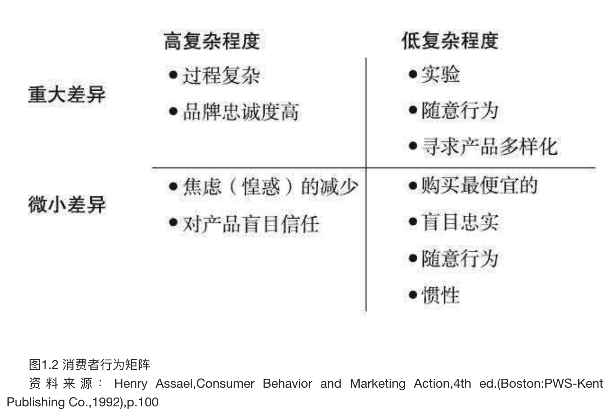

    作者: [美]史蒂文·西尔比格
    出版社: 中信出版社
    译者: 郑伏虎 / 曹建海 / 杨兰伏
    出版年: 2015-5
    页数: 410
    定价: 62.00元
    装帧: 平装
    ISBN: 9787508651255

[豆瓣链接](https://book.douban.com/subject/26426008/)

- [前言](#前言)
- [第1天营销](#第1天营销)
  - [营销战略过程](#营销战略过程)
    - [1.消费者分析](#1消费者分析)
      - [需求类别是什么?谁需要?为何需要?](#需求类别是什么谁需要为何需要)
      - [什么人购买和什么人使用该产品?](#什么人购买和什么人使用该产品)
      - [购买程序是什么?](#购买程序是什么)
      - [产品的复杂程度是高还是低？](#产品的复杂程度是高还是低)
      - [我打算细分市场吗?为什么?怎样划分？](#我打算细分市场吗为什么怎样划分)
    - [2.市场分析](#2市场分析)

# 前言
按美国MBA课程的基本内容，可将之归纳为9门课。

- 营销(Marketing)
- 商业道德（Ethics)
- 会计(Accounting)
- 组织行为(Organizational Behavior)
- 数量分析(Quantitative Analysis)
- 金融(Finance)
- 经营(Operations)
- 经济学(Economics)
- 战略(Strategy) 

# 第1天营销
## 营销战略过程
制定营销战略有以下7个步骤：

1. 消费者分析
2. 市场分析
3. 竞争对手调查和自身优势分析
4. 分销渠道分析
5. 制定“初步”营销组合
6. 经济评估
7. 修正前6个步骤，直至产生一个协调的方案

营销的7个步骤具有综合性，MBA们在沟通中也通常会选择其中几个组合在一起的缩略词，如`STP（市场细分、目标确定、准确定位）`，或者用`4C`指代营销，即`消费者行为、公司分析、竞争对手分析、背景（context）`。

### 1.消费者分析
所有营销计划，首先都需要分析至关重要的“消费者”以及他们的需求。必须先问自己如下重要的问题，以找到将会产生无穷无尽的营销财富的市场：

- 需求类别(need category)是什么?
- 什么人购买和什么人使用该产品?
- 购买程序(buying process)是什么?
- 我所销售的产品的复杂程度是高还是低?
- 市场如何细分?

#### 需求类别是什么?谁需要?为何需要?
你的产品针对什么需求或用途?问这个问题看起来似乎没有必要，但是在找到答案后，你可能会发现过去忽略了的潜在的产品市场。这也是为什么必须首先涉及这个问题，以免传统的思维方式影响你。生产苏打的艾禾美公司（Arm & Hammer）就在这方面做了大量的分析。它们把生产的苏打粉用于自己品牌的牙膏、空气清新剂和地毯清洁剂中。此外，它们广泛推荐自己的苏打粉用于数百种产品，结果获利丰厚。

#### 什么人购买和什么人使用该产品?
在很多情况下，购买人并非使用者。例如，男人的内衣和袜子大多是由女性购买的。如果开展一场以男袜购买者为目标的广告战，那么购买《体育画报》(Sports Illustrated)版面做广告可能就不合适了。确定购买人和使用人是谁，为营销计划的制订提供了基本的思路。

#### 购买程序是什么?
懂得购买程序至关重要，因为它能让你了解直接到达购买者的渠道。购买程序包含导致一个人最终购买产品的所有步骤。有些学者亦称其为选定程序或问题解决程序，有些研究人员称其为得知—感觉—行动过程，还有人称其为`注意—兴趣—欲望—行动(Attention-Interest-Desire-Action，简称AIDA)`。

任何一个特定产品，其购买程序可能包括以下一个或所有步骤：

    意识→信息搜寻→评估替代品→购买→评估

以买香皂为例，其购买程序如下：

身体有味→我该用什么→香皂→问一下妻子的意见→去商店看看→看标签→买一块雕牌香皂→洗澡→闻闻身上的味道→下次还买这种香皂购买程序各步骤说明：

- `意识（兴趣，承认问题存在）`。“我可能需要些什么。”在某一个时刻，人意识到一种需求，正如对使用香皂的需求。广告能促使这种需求产生。著名产品，例如品牌服装设计师的服装和香水，导致了这种需求。它们满足了人们情感上希望被人们喜爱和接受的需求。海飞丝公司倒是希望人们产生失去爱和不被大家接受的恐惧，这样一来，大家就会买它们的产品了。你需要自问一下，“怎样才能让消费者知道我的产品的存在?客户在哪里会看到我的产品的信息?”
- `信息搜寻`。“听上去不错，我再了解一下。”涉及购买决策的人们从各个渠道获得信息——消费报告、销售人员、微博、专业杂志、家人、朋友、当地专家。作为一名营销经理，应尽力在购买人做出购买决策的时间和地点，把自己产品好的信息传递给他们。例如，商店里布置的购物陈列点（Point Of Purchase，简称POP)就起这个作用；封面女郎化妆品（Cover Girl Cosmetics）在各大药店设专柜，帮助顾客挑选彩妆颜色；雅诗兰黛（Estée Lauder）则树立美容顾问的销售形象，在百货店进行产品介绍。
- `评估替代品`。哪种产品最适合我?这不仅包括某一种产品，也包含其替代品。面对价格昂贵的汽车，一个大学生可能最后买的是摩托车、电动车或自行车。根据产品的重要性，消费者可能会寻求更多的信息和建议。买汽车的人常常会跑一趟当地的汽车修理站，或征求邻居车迷的看法。在你的购买人可能会去的地方留下良好的信息，是营销成功的关键因素之一。

购买程序到了这个阶段，营销经理就要确定是哪些人对他的目标人购买行为产生影响。在高尔夫球这个领域里，对客户购买球杆起决定作用的是俱乐部的职业教练。如果你能把球杆卖给他，就能卖给俱乐部会员。

在购买程序的评估阶段，研究分销渠道也是至关重要的。如果产品一时无货，人们可能出于方便或急用而选择某个有可比性的替代品。可口可乐和百事可乐的巨大分销网络，使得任何新的可乐竞争对手都难有立足之地。就算你喜爱布朗博士的饮料，可当你在沙滩上口干舌燥无比想喝些什么时，你可能还是会接受可口可乐或百事可乐。

- `购买`这是重头。在有些情况下，消费者尽管做出了购买决策，第一次购买也可能仅仅是尝试性的。要将“新近推出、质量更高”的邦迪纸巾选定为你的常用品牌，只有在用它成功地擦拭难除的污渍之后才有可能。对一些价值昂贵的商品，例如海上度假和家用电器，尝试是不可能的。在这种情况下，由于风险大，决策程序就变得更耗时间，决心更难下。对于一个营销家来说，了解什么是风险是十分重要的。通过运用多种营销手段，例如广告、经验丰富的销售人员、保修以及宣传资料，并向购买者提供信息，说明他可以得到的性能，同时提供一些与竞争产品比较的信息，便可降低购买风险。
- `评估`（售后行为）我是否犯了个错误?这可能是在测试了产品效能之后得出的实际结论，也可能是征求他人认可的心理性结论。购买人的懊悔和售后心理波动，就是描写这种购买后惶惑阶段的术语。例如，汽车广告的对象不仅仅是潜在的买主，还包括最近买了车的人，这如同向他们保证，他们购买道奇车而没买本田车这个决策没有错。

#### 产品的复杂程度是高还是低？
不同的产品会由于其内在的对购买人和使用者的重要性而导致不同的购买行为。如果消费者感觉购买某种产品有较大的“风险”，这种产品就被认为是复杂程度高。决定购买复杂程度高的产品有以下几个原因：

- 价格昂贵
- 对产品优势的需求（例如，起搏器的可靠性）
- 对产品的心理满足需求（例如，地位、喜爱）

低复杂程度产品向高复杂程度产品转换，可以使一种简单的商品从一个未被区分的竞争领域里脱颖而出。通过以下4种常见的方法可以实现这一点：

- `将产品与高复杂程度的问题连接起来`典型的一例广告就是宝洁公司将不含胆固醇的烹调油与妻子害怕丈夫心脏病发作联系起来。
- `运用复杂广告`如果广告建立起一种表现产品或服务价值的信息，那么该产品就变得重要起来。这种信息将价值（诸如社会地位、爱）联系了起来，而不是仅仅着眼于产品本身的特性以及与竞争对手产品的差异。百事可乐努力在商业广告中经常使用明星，将青春、朝气、时尚与自己的产品联系起来，以利销售。
- `改变产品优势的重要性`产品和服务都能给使用者带来某种益处。如果通过营销活动将某种益处的重要性提高一个层次，更多的购买人则会有兴趣。20世纪80年代的啤酒大战使卡路里成为一个重要的竞争话题（21世纪是碳水化合物）。长期被忽略的特性——卡路里，使得对健康问题很敏感的饮酒者们在购买时更加注意了。结果，米勒清啤被说得与土匪一样一无是处。21世纪的头10年，消费者喜爱碳酸饮料。到了2012年，厂家热衷给烘烤食品贴上不会引起过敏、无谷蛋白的标签以吸引消费者。市场反响不错，这一宣传把消费者中对谷蛋白过敏的人也吸引过来了。
- `介绍产品的重要特点`营销家还可以在产品本身的某些性能上大做文章，使之与众不同。当家用吸尘器推出儿童防护帽时，家长们的购买决策介入程度大为提高。在商店的货架上，配有首批防护帽的产品占据显要位置。然而，一旦竞争对手们都仿制了这种防护帽，就需要新的差异，同时购买热又回归到低复杂程度状态。

真正低复杂程度产品，主要是因为人们对其可接受的性能标准要求较低。例如，一枚图钉的使用功能简单，无论是什么牌子的，都差不到哪儿去。如果尝试的成本很低，例如，一包口香糖，其介入程度很难被刺激起来。

与复杂程度相关的是购买计划的层次。购买的目的是计划购买还是即兴购买?高复杂程度产品总是经过计划才购买的，而即兴产品是一时高兴就买的。如果是计划购买，买主很可能要搜寻信息。反之，产品与需求的联系紧密程度就十分重要了。小吃食品就是即兴购买的一个例子，饥饿的人就会选择最近的快餐店。

#### 我打算细分市场吗?为什么?怎样划分？
营销任务的中心问题是：“谁是我的消费者?”如果你觉得自己的东西是为大众提供的，那就适合做出大众市场策略。如果你的产品为大众所接受，那就把产品更多地供应给他们。否则，你就必须选定一个或数个`细分市场`作为`目标市场`。细分市场是指同类的消费者群体，他们具有相似的需求和欲望。

市场细分可以起以下作用：

- 确定足够大的细分市场，为之服务并能有利可图
- 确定通过营销努力能够迅速达到的细分市场
- 帮助制订营销方案

脑子里牢记一个确定的细分市场，你就能有效而迅速地开展有的放矢的营销活动，以赢取最大的销售额和最丰厚的利润。没有目标，你就有把营销资金浪费在对你的产品没有兴趣的人身上的危险。细分消费市场有4个主要的可变因素，即：

- `地理因素`。地理划分按国家、州、地区、城市划分市场。美国联邦政府的人口普查列出了310个标准都市统计区(Standard Metropolitan Statistical Areas,简称SMSA)，确定了美国主要人口中心。A·C·尼尔森(A.C.Nielsen)也有个类似的测量方法，称为指定市场区域(Designated Market Areas，简称DMA)。
- `人口统计因素`。按照以下可测因素划分人口，以获得同类人群体：
  - 年龄——不同年代人的不同需要和需求
  - 性别——不同性别的使用和购买形式
  - 收入——购买力
  - 婚姻状况——家庭需求
  - 家庭生命周期——成家、空巢等
  - 教育/职业——消费者文化程度的体现
  - 民族、宗教、种族——特殊喜好
- `心理因素`。按照心理差别因素划分市场：
  - 生活方式——活动、兴趣、观点
  - 性格——保守型、冒险型、追求地位型、冲动型、野心勃勃型、独裁型、热爱交际型（人们具有不同的敏感点，可运用广告努力去触动）
- `行为因素`。行为划分按照显著的购买行为划分市场：
  - 产品使用——使用数量、使用方法、对产品益处的追求
  - 购买时机——赠品、假期、季节性等
  - 品牌忠诚度——对某一产品的忠诚可以表明对其他产品的接受程度
  - 对价格和促销活动的反应程度——有些人群对特别的营销活动反应较为灵敏，如家庭妇女比单身的职业女性更多地使用优惠券

评估可能的细分市场应当运用以下条件：

- 可定量性——你能否确定这个细分市场?能否量化其规模?
- 可接近性——能否通过广告、销售队伍或分销商、运输商或仓储而抵达细分市场?
- 持久性——该细分市场是否大得值得花费气力?该目标市场是正在萎缩还是正在成熟或增长?
- 营利性——是否有足够的潜在利润值得以它为目标?
- 与竞争对手的可比性——竞争对手是否对该细分市场有兴趣?竞争对手目前是在对其进行调查，还是觉得不值得投入精力?
- 有效性——你的公司是否有能力为这一细分市场提供有保障的服务?
- 自卫能力——在竞争对手进攻时你能否保护自己?

### 2.市场分析

