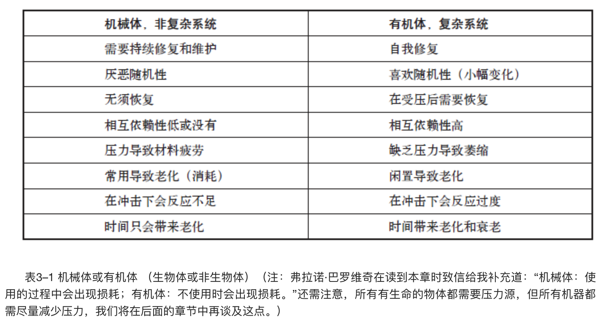

    作者: [美]纳西姆•尼古拉斯•塔勒布
    出版社: 中信出版社
    副标题: 从不确定性中获益
    原作名: Antifragile: Things That Gain from Disorder
    译者: 雨珂
    出版年: 2014-1-1
    页数: 408
    定价: 68.00元
    装帧: 精装
    丛书: “不确定性”系列丛书
    ISBN: 9787508643335

[豆瓣链接](https://book.douban.com/subject/25782902/)

- [前言](#前言)
  - [反脆弱性](#反脆弱性)
  - [非预测性](#非预测性)
  - [剥夺反脆弱性](#剥夺反脆弱性)
  - [以牺牲他人的利益为代价获利](#以牺牲他人的利益为代价获利)
  - [“黑天鹅”问题的解决方案](#黑天鹅问题的解决方案)
  - [（某些）事物的可预测性](#某些事物的可预测性)
  - [脆弱推手](#脆弱推手)
  - [简单的地方更复杂](#简单的地方更复杂)
- [第一卷 反脆弱性：介绍](#第一卷-反脆弱性介绍)
  - [第1章 达摩克利斯之剑和九头蛇怪](#第1章-达摩克利斯之剑和九头蛇怪)
    - [反脆弱性的原型](#反脆弱性的原型)
    - [领域独立就是领域依赖](#领域独立就是领域依赖)
  - [第2章 随处可见的过度补偿和过度反应](#第2章-随处可见的过度补偿和过度反应)
    - [如何在跑马比赛中取胜](#如何在跑马比赛中取胜)
    - [以冗余的形式呈现的反脆弱性反应](#以冗余的形式呈现的反脆弱性反应)
    - [论暴乱、爱和其他意料之外压力受益者的反脆弱性](#论暴乱爱和其他意料之外压力受益者的反脆弱性)
    - [请将我的书列为禁书：信息的反脆弱性](#请将我的书列为禁书信息的反脆弱性)
    - [换份工作](#换份工作)
  - [第3章 猫与洗衣机](#第3章-猫与洗衣机)
    - [压力源即信息](#压力源即信息)
    - [均衡，不再均衡](#均衡不再均衡)
  - [第4章 杀死我的东西却让其他人更强壮](#第4章-杀死我的东西却让其他人更强壮)

# 前言
## 反脆弱性
有些事情能从冲击中受益，当暴露在波动性、随机性、混乱和压力、风险和不确定性下时，它们反而能茁壮成长和壮大。不过，尽管这一现象无处不在，我们还是没有一个词能够用来形容脆弱性的对立面。所以，不妨叫它`反脆弱性（antifragile）`吧。

反脆弱性超越了复原力或强韧性。复原力能让事物抵抗冲击，保持原状；反脆弱性则让事物变得更好。它具有任何与时俱进事物的特质：进化、文化、观念、革命、政治制度、技术创新、文化和经济的成功、企业的生存、美食食谱（比如，鸡汤或加入一滴干邑葡萄酒的鞑靼牛排），还有城市、文化、法律制度的兴起、赤道雨林的生长和细菌耐药性的增长等。反脆弱性决定了有生命的有机体或复杂体（比如人体）与无生命的机械体（比如办公桌上的订书机）之间的区别。

反脆弱性偏好随机性和不确定性，这意味着—这一点非常关键—它也偏好错误，准确地说是某一类错误。反脆弱性有一个奇特的属性，它能帮助我们应对未知的事情，解决我们不了解的问题，而且非常有效。

## 非预测性
弄清楚什么是脆弱的，比预测对其造成伤害的某个事件是否会发生要容易得多，脆弱性是可以衡量的，但风险却是无法衡量的（在赌场外，或者在自称“风险管理专家”的人的头脑之外）。这为我所说的“黑天鹅”问题提供了一个解决方案，因为我们原本就不可能计算出重要的罕见事件的风险，也无法预测其何时会发生。但事物对波动性所致危害的敏感性是可观察的，这比对造成危害的事件进行预测更容易。因此，我们建议颠覆我们目前的预测、预言和风险管理方法。

在每一个领域或应用方面，我们都提出了通过降低脆弱性或利用反脆弱性，从脆弱走向反脆弱性的规则。而且，我们几乎总能使用一个简单的不对称测试来检测反脆弱性和脆弱性：从随机事件（或一定冲击）中获得的有利结果大于不利结果的就是`反脆弱的`，反之则是`脆弱的`。

## 剥夺反脆弱性
最重要的是，如果反脆弱性是所有幸存下来的自然（和复杂）系统的特征，那么剥夺这些系统的波动性、随机性和压力源反而会伤害它们。它们将会变弱、死亡或崩溃。我们一直在通过压制随机性和波动性来削弱经济、我们的健康、政治生活、教育，甚至几乎所有的东西…… 正如在床上躺一个月（最好是手上有一本未删节版的《战争与和平》或者《黑道家族》全部86集的碟片）会导致肌肉萎缩，复杂系统在被剥夺压力源的情况下会被削弱，甚至被扼杀。现代的结构化社会大多正以自上而下的政策和机制（被称为“苏联–哈佛派谬见”）伤害着我们：它们的所作所为实际上侵犯了系统的反脆弱性。

如果说一切自上而下的东西都会使我们变得脆弱，并且阻碍反脆弱性和成长，那么一切自下而上的事物在适量的压力和混乱下反而能够蓬勃发展。发现（或创新，或技术进步）的过程本身就取决于能增进反脆弱性的自由探索和积极的冒险，而非正规的教育。

## 以牺牲他人的利益为代价获利
社会最大的脆弱性制造者和最大的危机制造者，正是那些置身事外，不承担后果的人。一些人以牺牲他人利益为代价实现反脆弱性，也就是说，他们从波动性、变化和混乱中实现有利结果（或获得收益），而将他人暴露于损失或伤害的不利因素下。

过去，甘冒风险的人才会位高权重，他们必须为自己的不当行为承受损失，而英雄则是那些为了他人的利益承受损失的人，如今，情况却完全相反。

他们忘记了一条最主要的道德法则：你不应该为了获得反脆弱性，而牺牲别人的脆弱。

## “黑天鹅”问题的解决方案
`“黑天鹅”事件`是造成广泛、严重后果的，不可预知的、不定期发生的大规模事件。对某些观察者来说，他完全没有预料到它们的发生，这种人通常被称为`“火鸡”`，因为他们对这些事件完全没有预期，并会受到这些事件的伤害。

“黑天鹅”事件绑架了我们的思维，让我们感到自己“差不多”或“几乎”预测到了它们，因为它们都是可以进行回溯性解释的。由于存在可预测性错觉，我们没有意识到这些“黑天鹅”事件对生活的影响。现实生活远比我们记忆中的生活更加错综复杂—我们的头脑倾向于将历史以更平稳和更线性的状态呈现出来，这导致我们低估了随机性。一旦我们看到随机事件时，就会心生畏惧并反应过度。

复杂系统内部充满着难以察觉的相互依赖关系和非线性反应。`“非线性”`是指当你把药品的剂量增为两倍，或将工厂的员工数量增为两倍时，所得效果并非初始效果的两倍，而是要么更多，要么更少。

## （某些）事物的可预测性
脆弱性是相当容易衡量的，但风险却很难衡量，尤其是与罕见事件相关的风险。

脆弱性和反脆弱性是一个物体、一个茶几、一个公司、一个行业、一个国家、一个政治制度当前属性的一部分。我们可以识别和看到脆弱性，甚至在很多情况下还可以测量它，或至少能以较小的误差测量相对脆弱性，而对风险的测量相比较而言（到目前为止）则并不可靠。你没有任何可靠的依据说某个遥远的事件或冲击的发生概率比另一个事件更高 （除非你喜欢自我欺骗），但你能很有信心地说，当某一事件发生时，某一个物体或结构比另一个物体或结构更脆弱。你很容易做出判断，在温度突然变化的情况下，你的祖母要比你更脆弱；发生政变时，一些军事独裁国家要比瑞士更脆弱；危机来临时，银行比其他部门更脆弱；或者发生地震时，一些建造结构不牢固的现代建筑要比古老的查特雷斯大教堂更脆弱。关键的是，你甚至可以预测哪一个人会存活更长的时间。

## 脆弱推手
脆弱推手往往陷入苏联–哈佛派谬见，即（不科学地）高估科学知识的能量。秉持这种谬见的人就是所谓的天真的理性主义者、合理化者，或有时被叫作合理理性主义者，因为他认为事情背后的原因是可以自动显现的。我们**不要混淆“合理化”与“理性”这两个概念—它们几乎完全相反**。物理学之外，一般在复杂的领域里，事物背后的原因往往很难让我们看清，对脆弱推手来说更是如此。

## 简单的地方更复杂
复杂机制会导致意想不到的连锁反应。由于缺乏透明度，干预会导致不可预测的后果，接着是对结果中“不可预测”的方面致歉，然后再度出手干预来纠正衍生影响，结果又派生出一系列“不可预测”的反应，每一个都比前一个更糟糕。

**少即是多，而且通常更有效**。因此，我会制定极少量的技巧、指令和禁令来说明，如何生活在一个我们并不明白的世界里，或者，更确切地说，如何才能不害怕周旋于我们显然不明白的事情之中，以及更主要的是，我们应该以什么样的态度与这些事情共舞。

# 第一卷 反脆弱性：介绍
## 第1章 达摩克利斯之剑和九头蛇怪
### 反脆弱性的原型
`米特拉达梯式解毒法`：当人们不断地接受小剂量的某种物质，随着时间的推移，对额外的或更大剂量的同类物质逐步产生免疫力的结果。这是在疫苗接种和药物过敏测试中使用的方法。这还不能称作完全的反脆弱性，仍处于较温和的强韧性阶段，但已经逐步接近反脆弱性了。我们已经得到了一个暗示，**一旦被剥夺了摄取毒物的权力，我们将变得脆弱，强韧化的道路常始于一点点的伤害**。

药理学家创造的一个词—`毒物兴奋效应`—说的就是小剂量的有害物质实际上会有利于机体健康，起到药物的治疗作用。一点点的危害，只要不是很多，只会造福于机体，使其成为更好的整体，因为它会触发一些过度反应。

我们现在可以看到，剥夺了系统的压力或重要的压力源并不一定是好事，甚至可能是非常有害的。

### 领域独立就是领域依赖
系统可能需要一些压力和刺激，人们可能会在某一个领域中体会到这一观点，但在其他领域却全然忽略了。所以，我们可以看到我们思维的`领域依赖性`，所谓“领域”就是某一类别的活动。有些人可以在某一个领域，比如医疗领域，很好地理解某一想法，但在另一个领域，比如社会、经济、生活领域，却未必能理解同一个想法。

想象一下，一个人很有学习语言的天赋，但无法将一种语言环境下的概念转移到另一种语言环境下来理解，因此每学习一种新语言，他就需要把“椅子”、“爱”、“苹果派”等概念重新学习一遍。他没法同时认识“house”（英语）、“casa”（西班牙语）或“byt”（古闪米特语）。在某种程度上，我们都有类似的障碍，当同一种思想在不同的背景中出现时，我们就无法辨识了，就好像我们注定要被事物最表象的东西，比如包装、漂亮的礼品袋等蒙蔽一般。这就是为什么我们在反脆弱性很明显甚至太明显的地方，却看不到它。我们很少将成功、经济增长或创新理解为对压力的过度补偿，我们也从未看到其他地方出现这种过度补偿。（领域依赖性也解释了为什么许多研究人员一直未能意识到，不确定性、不完全理解、混乱、波动性之间存在着密切关系）。

这种无法跨领域理解的情况是人类固有的缺陷，只有当我们努力克服和突破这一障碍时，我们才能开始获得智慧和理性。

## 第2章 随处可见的过度补偿和过度反应
你怎么创新？首先，尝试惹上麻烦。我的意思是严重的但并不致命的麻烦。

对挫折的过度反应所释放出来的多余能量成就了创新！

但现代人却仍试图依赖舒适、安全和可预测的环境进行创新，而不能接受“必要性确实是发明之母”的理念。

很多人，像伟大的罗马政治家监察官老加图，就将安逸—几乎任何形式的安逸——视为通向堕落的道路。他不喜欢所有轻易就能获得的东西，因为他担心这样会削弱意志。而且，他担心这种弱化意志的事件影响的不只是个人层面：事实上，整个社会都会堕落。

### 如何在跑马比赛中取胜
`过度补偿机制`往往隐藏在最不可能的地方。长途飞行后最好去健身房锻炼以消除疲劳，而不是坐下来休息。此外，还有一个众所周知的小伎俩，如果你急着要完成某事，不妨将其交给办公室里任务最繁忙的（或第二繁忙的）那个人去做。大多数人的空闲时间都会被浪费掉，因为空闲时间会让他们无所事事、懒惰、无心向学，而一旦他们忙起来，他们往往会在其他任务上也更为积极。过度反应在这里再次显现。

`过度反应机制`或类似的机制会使我们在有一点点背景噪声的地方更好地集中精力，就好像对抗这些噪声的行为可以帮助我们集中注意力。

### 以冗余的形式呈现的反脆弱性反应
层层`冗余`正是自然生态系统集中管理风险的显著特征。我们人类有两个肾脏（甚至会计师也不例外），额外的器官—许多器官还有额外的容量（比如肺、神经系统、动脉机制），然而，人天生却不喜欢冗余—人类历来喜欢欠债，这与冗余完全相反。

一个过度反应的系统一定会采用`超额模式`，建立额外的能力和力量，预期更坏的结果，对有关危险发生概率的信息做出反应。当然，从机会主义的角度说，这种额外的能力或力量本身也可能是很有用的。我们看到，冗余是机会主义，所以即使在没有危险的情况下，这种额外的力量也能带来一定的益处。

### 论暴乱、爱和其他意料之外压力受益者的反脆弱性
反脆弱性唤醒了肌体的应激反应，对压力和伤害做出了过度反应，如果这样界定反脆弱性，那么在经济生活之外你能看到的最具反脆弱性的事情莫过于难以泯灭的爱或恨，即对于距离、家庭矛盾以及压抑爱憎情绪的企图等做出的过度反应。

与折磨人的爱情一样，一些想法也是如此具有反脆弱性，你越是试图摆脱它们，陷得就越深，越痴狂。心理学家们曾揭示了试图控制思想的过程有多荒谬：你越是投入更多的精力试图控制你的想法，你的想法越能控制你。

### 请将我的书列为禁书：信息的反脆弱性
信息是具有反脆弱性的，湮灭信息的努力比宣传信息的努力更能增强信息的力量。一个典型的例子是，许多人越是为自己辩解，越会越描越黑。

### 换份工作
大企业和政府似乎并不明白信息的反作用力，事实上，信息有能力控制那些试图控制它的人。当你听到一家公司或一个负债累累的政府表示要“重新注入信心”，那么你就应该知道它们是脆弱的，注定失败。信息是无情的：越是召开新闻发布会来“安抚”投资者，越是会吓跑投资者，导致死亡螺旋或银行挤兑。

我想用一个现象结束这一部分的内容。我们常看到一个令人费解的现象，即给我们带来最大利益的并不是那些曾试图帮助我们（比如提供“建议”）的人，而是那些曾努力伤害我们但最终未能如愿的人。

## 第3章 猫与洗衣机
自然界，或者说生物界，通常同时具备反脆弱性与脆弱性，这取决于变异源（以及变异范围）的不同。拿人类来说，人体可以从压力源的刺激中受益（变得更为强壮），但以一定程度为限。比如，如果定期给骨骼施以一定的压力则有益于骨密度的上升，这一机制被命名为`沃尔夫定律`，源自1892年德国一位外科医生写的相关文章。但是诸如盘子、汽车或其他非生物体则不具备这种特征，也就是说，它们可能很强韧，但并不具备内在的反脆弱性。

衰老在很大程度上源自对舒适生活的误解，是一种文明病：一心想越活越长寿，可是不知为什么却越来越多病。在自然的环境下，人们会死，但是不会衰老，或者衰老的时间很短。比如，现代人的血压指标一般会随着年龄的增长而恶化，但是在狩猎采集者的身上都看不到这个现象，除了他们终老前的一小段时间。现代人那种人为的衰老，正是压抑了生命内在的反脆弱性的结果。

### 压力源即信息
这些复杂系统（各部分的关联如蛛网交织）的核心就是，它们**通过压力源或者借助压力源，向其组成部分传递信息**：你的身体之所以能够获知有关周围环境的信息，并非源自你的逻辑机制、智慧、推理能力或计算能力，而是源自压力，并通过你的荷尔蒙或者我们尚未发现的其他信息传导机制向你传递的。

**错误及其后果也是一种信息**。对小孩子来说，疼痛是唯一的风险管理信息，因为他们的逻辑推理能力尚不完善。

反脆弱性的产生是有条件的。压力源的刺激频率非常重要：人类在急性刺激下会比在慢性刺激下表现得更出色，尤其是在急性刺激后给予较长的恢复期，这将使得这些压力源成为信息的传导渠道。比如，看到一条蛇从我的键盘中爬出来，或者一个吸血鬼进入我的房间，都会对我产生强烈的情绪冲击，随后，我当然需要足够长的舒缓期（伴着甘菊茶和巴洛克式的音乐），来重新控制自己的情绪，这会对我的健康有利，当然，前提是我经历了一番艰苦的甚至英雄式的激战后，战胜了蛇或吸血鬼。

这样的压力源肯定比一个温和但连续不断的压力源有益，后者大多是让你在生活中感到压抑的东西，包括按揭贷款、税务问题、因拖欠报税而产生的内疚、考试压力、琐碎事务、电子邮件回复、填写表格、每天上下班通勤，等等。换句话说，这是文明带来的压力。

事实上，神经生物学家表明，第一种类型的压力源是必要的，而第二种类型的压力源对人的健康却是有害的。

表3–1显示了两种类型的压力源之间的区别。

### 均衡，不再均衡
复杂性理论家斯图尔特·考夫曼就用`均衡`的概念对表3–1进行了明确区分。对非有机体、非复杂体来说，例如，桌上摆放的某个物体，均衡状态（根据传统定义）就是静止状态。而对有机体来说，（这种意义上）的均衡只发生在其死亡的时候。

## 第4章 杀死我的东西却让其他人更强壮

