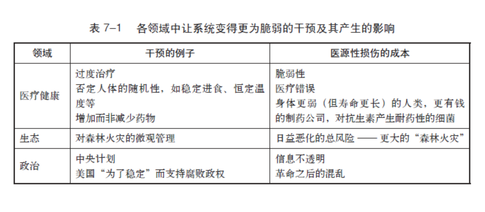
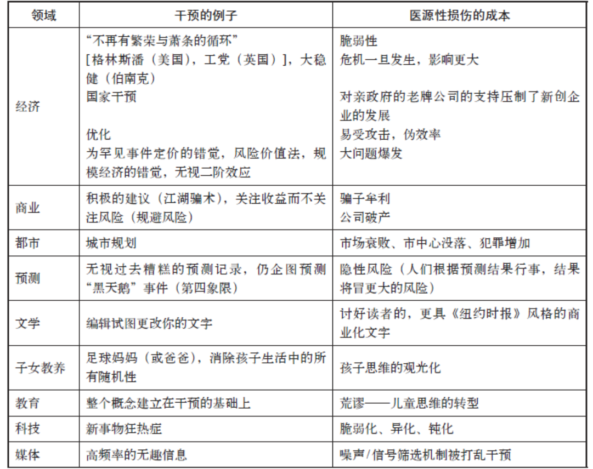

    作者: [美]纳西姆•尼古拉斯•塔勒布
    出版社: 中信出版社
    副标题: 从不确定性中获益
    原作名: Antifragile: Things That Gain from Disorder
    译者: 雨珂
    出版年: 2014-1-1
    页数: 408
    定价: 68.00元
    装帧: 精装
    丛书: “不确定性”系列丛书
    ISBN: 9787508643335

[豆瓣链接](https://book.douban.com/subject/25782902/)

- [前言](#前言)
  - [反脆弱性](#反脆弱性)
  - [非预测性](#非预测性)
  - [剥夺反脆弱性](#剥夺反脆弱性)
  - [以牺牲他人的利益为代价获利](#以牺牲他人的利益为代价获利)
  - [“黑天鹅”问题的解决方案](#黑天鹅问题的解决方案)
  - [（某些）事物的可预测性](#某些事物的可预测性)
  - [脆弱推手](#脆弱推手)
  - [简单的地方更复杂](#简单的地方更复杂)
- [第一卷 反脆弱性：介绍](#第一卷-反脆弱性介绍)
  - [第1章 达摩克利斯之剑和九头蛇怪](#第1章-达摩克利斯之剑和九头蛇怪)
    - [反脆弱性的原型](#反脆弱性的原型)
    - [领域独立就是领域依赖](#领域独立就是领域依赖)
  - [第2章 随处可见的过度补偿和过度反应](#第2章-随处可见的过度补偿和过度反应)
    - [如何在跑马比赛中取胜](#如何在跑马比赛中取胜)
      - [以冗余的形式呈现的反脆弱性反应](#以冗余的形式呈现的反脆弱性反应)
    - [论暴乱、爱和其他意料之外压力受益者的反脆弱性](#论暴乱爱和其他意料之外压力受益者的反脆弱性)
      - [请将我的书列为禁书：信息的反脆弱性](#请将我的书列为禁书信息的反脆弱性)
      - [换份工作](#换份工作)
  - [第3章 猫与洗衣机](#第3章-猫与洗衣机)
    - [压力源即信息](#压力源即信息)
      - [均衡，不再均衡](#均衡不再均衡)
  - [第4章 杀死我的东西却让其他人更强壮](#第4章-杀死我的东西却让其他人更强壮)
    - [反脆弱性的层级](#反脆弱性的层级)
      - [进化和不可预测性](#进化和不可预测性)
      - [从他人的错误中学习](#从他人的错误中学习)
    - [为何整体厌恶个体](#为何整体厌恶个体)
    - [杀不死我的，会杀死其他人](#杀不死我的会杀死其他人)
      - [我和我们](#我和我们)
- [第二卷 现代化与对反脆弱性的否定](#第二卷-现代化与对反脆弱性的否定)
  - [第5章 露天市场与办公楼](#第5章-露天市场与办公楼)
    - [两种职业](#两种职业)
    - [自下而上的变动](#自下而上的变动)
    - [远离极端斯坦](#远离极端斯坦)
      - [重大的“火鸡”问题](#重大的火鸡问题)
    - [12000年](#12000年)
  - [第6章 告诉他们我爱随机性](#第6章-告诉他们我爱随机性)
    - [饥饿的驴](#饥饿的驴)
    - [一枚名叫“稳定性”的定时炸弹](#一枚名叫稳定性的定时炸弹)
      - [政治退火](#政治退火)
    - [在这里，我们把什么叫作现代化？](#在这里我们把什么叫作现代化)
  - [第7章 天真的干预](#第7章-天真的干预)
    - [干预和医源性损伤](#干预和医源性损伤)
  - [第8章 预测是现代化的产物](#第8章-预测是现代化的产物)
- [第三卷 非预测性的世界观](#第三卷-非预测性的世界观)
  - [第10章 塞内加的不利因素和有利因素](#第10章-塞内加的不利因素和有利因素)
    - [斯多葛学派的情绪强韧法](#斯多葛学派的情绪强韧法)
    - [驯化情绪](#驯化情绪)
  - [第11章 千万别嫁给摇滚明星](#第11章-千万别嫁给摇滚明星)
    - [破损的包裹无法恢复原状](#破损的包裹无法恢复原状)
    - [塞内加的杠铃](#塞内加的杠铃)
      - [会计师与摇滚明星](#会计师与摇滚明星)

# 前言
## 反脆弱性
有些事情能从冲击中受益，当暴露在波动性、随机性、混乱和压力、风险和不确定性下时，它们反而能茁壮成长和壮大。不过，尽管这一现象无处不在，我们还是没有一个词能够用来形容脆弱性的对立面。所以，不妨叫它`反脆弱性（antifragile）`吧。

反脆弱性超越了复原力或强韧性。复原力能让事物抵抗冲击，保持原状；反脆弱性则让事物变得更好。它具有任何与时俱进事物的特质：进化、文化、观念、革命、政治制度、技术创新、文化和经济的成功、企业的生存、美食食谱（比如，鸡汤或加入一滴干邑葡萄酒的鞑靼牛排），还有城市、文化、法律制度的兴起、赤道雨林的生长和细菌耐药性的增长等。反脆弱性决定了有生命的有机体或复杂体（比如人体）与无生命的机械体（比如办公桌上的订书机）之间的区别。

反脆弱性偏好随机性和不确定性，这意味着—这一点非常关键—它也偏好错误，准确地说是某一类错误。反脆弱性有一个奇特的属性，它能帮助我们应对未知的事情，解决我们不了解的问题，而且非常有效。

## 非预测性
弄清楚什么是脆弱的，比预测对其造成伤害的某个事件是否会发生要容易得多，脆弱性是可以衡量的，但风险却是无法衡量的（在赌场外，或者在自称“风险管理专家”的人的头脑之外）。这为我所说的“黑天鹅”问题提供了一个解决方案，因为我们原本就不可能计算出重要的罕见事件的风险，也无法预测其何时会发生。但事物对波动性所致危害的敏感性是可观察的，这比对造成危害的事件进行预测更容易。因此，我们建议颠覆我们目前的预测、预言和风险管理方法。

在每一个领域或应用方面，我们都提出了通过降低脆弱性或利用反脆弱性，从脆弱走向反脆弱性的规则。而且，我们几乎总能使用一个简单的不对称测试来检测反脆弱性和脆弱性：从随机事件（或一定冲击）中获得的有利结果大于不利结果的就是`反脆弱的`，反之则是`脆弱的`。

## 剥夺反脆弱性
最重要的是，如果反脆弱性是所有幸存下来的自然（和复杂）系统的特征，那么剥夺这些系统的波动性、随机性和压力源反而会伤害它们。它们将会变弱、死亡或崩溃。我们一直在通过压制随机性和波动性来削弱经济、我们的健康、政治生活、教育，甚至几乎所有的东西…… 正如在床上躺一个月（最好是手上有一本未删节版的《战争与和平》或者《黑道家族》全部86集的碟片）会导致肌肉萎缩，复杂系统在被剥夺压力源的情况下会被削弱，甚至被扼杀。现代的结构化社会大多正以自上而下的政策和机制（被称为“苏联–哈佛派谬见”）伤害着我们：它们的所作所为实际上侵犯了系统的反脆弱性。

如果说一切自上而下的东西都会使我们变得脆弱，并且阻碍反脆弱性和成长，那么一切自下而上的事物在适量的压力和混乱下反而能够蓬勃发展。发现（或创新，或技术进步）的过程本身就取决于能增进反脆弱性的自由探索和积极的冒险，而非正规的教育。

## 以牺牲他人的利益为代价获利
社会最大的脆弱性制造者和最大的危机制造者，正是那些置身事外，不承担后果的人。一些人以牺牲他人利益为代价实现反脆弱性，也就是说，他们从波动性、变化和混乱中实现有利结果（或获得收益），而将他人暴露于损失或伤害的不利因素下。

过去，甘冒风险的人才会位高权重，他们必须为自己的不当行为承受损失，而英雄则是那些为了他人的利益承受损失的人，如今，情况却完全相反。

他们忘记了一条最主要的道德法则：你不应该为了获得反脆弱性，而牺牲别人的脆弱。

## “黑天鹅”问题的解决方案
`“黑天鹅”事件`是造成广泛、严重后果的，不可预知的、不定期发生的大规模事件。对某些观察者来说，他完全没有预料到它们的发生，这种人通常被称为`“火鸡”`，因为他们对这些事件完全没有预期，并会受到这些事件的伤害。

“黑天鹅”事件绑架了我们的思维，让我们感到自己“差不多”或“几乎”预测到了它们，因为它们都是可以进行回溯性解释的。由于存在可预测性错觉，我们没有意识到这些“黑天鹅”事件对生活的影响。现实生活远比我们记忆中的生活更加错综复杂—我们的头脑倾向于将历史以更平稳和更线性的状态呈现出来，这导致我们低估了随机性。一旦我们看到随机事件时，就会心生畏惧并反应过度。

复杂系统内部充满着难以察觉的相互依赖关系和非线性反应。`“非线性”`是指当你把药品的剂量增为两倍，或将工厂的员工数量增为两倍时，所得效果并非初始效果的两倍，而是要么更多，要么更少。

## （某些）事物的可预测性
脆弱性是相当容易衡量的，但风险却很难衡量，尤其是与罕见事件相关的风险。

脆弱性和反脆弱性是一个物体、一个茶几、一个公司、一个行业、一个国家、一个政治制度当前属性的一部分。我们可以识别和看到脆弱性，甚至在很多情况下还可以测量它，或至少能以较小的误差测量相对脆弱性，而对风险的测量相比较而言（到目前为止）则并不可靠。你没有任何可靠的依据说某个遥远的事件或冲击的发生概率比另一个事件更高 （除非你喜欢自我欺骗），但你能很有信心地说，当某一事件发生时，某一个物体或结构比另一个物体或结构更脆弱。你很容易做出判断，在温度突然变化的情况下，你的祖母要比你更脆弱；发生政变时，一些军事独裁国家要比瑞士更脆弱；危机来临时，银行比其他部门更脆弱；或者发生地震时，一些建造结构不牢固的现代建筑要比古老的查特雷斯大教堂更脆弱。关键的是，你甚至可以预测哪一个人会存活更长的时间。

## 脆弱推手
脆弱推手往往陷入苏联–哈佛派谬见，即（不科学地）高估科学知识的能量。秉持这种谬见的人就是所谓的天真的理性主义者、合理化者，或有时被叫作合理理性主义者，因为他认为事情背后的原因是可以自动显现的。我们**不要混淆“合理化”与“理性”这两个概念—它们几乎完全相反**。物理学之外，一般在复杂的领域里，事物背后的原因往往很难让我们看清，对脆弱推手来说更是如此。

## 简单的地方更复杂
复杂机制会导致意想不到的连锁反应。由于缺乏透明度，干预会导致不可预测的后果，接着是对结果中“不可预测”的方面致歉，然后再度出手干预来纠正衍生影响，结果又派生出一系列“不可预测”的反应，每一个都比前一个更糟糕。

**少即是多，而且通常更有效**。因此，我会制定极少量的技巧、指令和禁令来说明，如何生活在一个我们并不明白的世界里，或者，更确切地说，如何才能不害怕周旋于我们显然不明白的事情之中，以及更主要的是，我们应该以什么样的态度与这些事情共舞。

# 第一卷 反脆弱性：介绍
## 第1章 达摩克利斯之剑和九头蛇怪
### 反脆弱性的原型
`米特拉达梯式解毒法`：当人们不断地接受小剂量的某种物质，随着时间的推移，对额外的或更大剂量的同类物质逐步产生免疫力的结果。这是在疫苗接种和药物过敏测试中使用的方法。这还不能称作完全的反脆弱性，仍处于较温和的强韧性阶段，但已经逐步接近反脆弱性了。我们已经得到了一个暗示，**一旦被剥夺了摄取毒物的权力，我们将变得脆弱，强韧化的道路常始于一点点的伤害**。

药理学家创造的一个词—`毒物兴奋效应`—说的就是小剂量的有害物质实际上会有利于机体健康，起到药物的治疗作用。一点点的危害，只要不是很多，只会造福于机体，使其成为更好的整体，因为它会触发一些过度反应。

我们现在可以看到，剥夺了系统的压力或重要的压力源并不一定是好事，甚至可能是非常有害的。

### 领域独立就是领域依赖
系统可能需要一些压力和刺激，人们可能会在某一个领域中体会到这一观点，但在其他领域却全然忽略了。所以，我们可以看到我们思维的`领域依赖性`，所谓“领域”就是某一类别的活动。有些人可以在某一个领域，比如医疗领域，很好地理解某一想法，但在另一个领域，比如社会、经济、生活领域，却未必能理解同一个想法。

想象一下，一个人很有学习语言的天赋，但无法将一种语言环境下的概念转移到另一种语言环境下来理解，因此每学习一种新语言，他就需要把“椅子”、“爱”、“苹果派”等概念重新学习一遍。他没法同时认识“house”（英语）、“casa”（西班牙语）或“byt”（古闪米特语）。在某种程度上，我们都有类似的障碍，当同一种思想在不同的背景中出现时，我们就无法辨识了，就好像我们注定要被事物最表象的东西，比如包装、漂亮的礼品袋等蒙蔽一般。这就是为什么我们在反脆弱性很明显甚至太明显的地方，却看不到它。我们很少将成功、经济增长或创新理解为对压力的过度补偿，我们也从未看到其他地方出现这种过度补偿。（领域依赖性也解释了为什么许多研究人员一直未能意识到，不确定性、不完全理解、混乱、波动性之间存在着密切关系）。

这种无法跨领域理解的情况是人类固有的缺陷，只有当我们努力克服和突破这一障碍时，我们才能开始获得智慧和理性。

## 第2章 随处可见的过度补偿和过度反应
你怎么创新？首先，尝试惹上麻烦。我的意思是严重的但并不致命的麻烦。

对挫折的过度反应所释放出来的多余能量成就了创新！

但现代人却仍试图依赖舒适、安全和可预测的环境进行创新，而不能接受“必要性确实是发明之母”的理念。

很多人，像伟大的罗马政治家监察官老加图，就将安逸—几乎任何形式的安逸——视为通向堕落的道路。他不喜欢所有轻易就能获得的东西，因为他担心这样会削弱意志。而且，他担心这种弱化意志的事件影响的不只是个人层面：事实上，整个社会都会堕落。

### 如何在跑马比赛中取胜
`过度补偿机制`往往隐藏在最不可能的地方。长途飞行后最好去健身房锻炼以消除疲劳，而不是坐下来休息。此外，还有一个众所周知的小伎俩，如果你急着要完成某事，不妨将其交给办公室里任务最繁忙的（或第二繁忙的）那个人去做。大多数人的空闲时间都会被浪费掉，因为空闲时间会让他们无所事事、懒惰、无心向学，而一旦他们忙起来，他们往往会在其他任务上也更为积极。过度反应在这里再次显现。

`过度反应机制`或类似的机制会使我们在有一点点背景噪声的地方更好地集中精力，就好像对抗这些噪声的行为可以帮助我们集中注意力。

#### 以冗余的形式呈现的反脆弱性反应
层层`冗余`正是自然生态系统集中管理风险的显著特征。我们人类有两个肾脏（甚至会计师也不例外），额外的器官—许多器官还有额外的容量（比如肺、神经系统、动脉机制），然而，人天生却不喜欢冗余—人类历来喜欢欠债，这与冗余完全相反。

一个过度反应的系统一定会采用`超额模式`，建立额外的能力和力量，预期更坏的结果，对有关危险发生概率的信息做出反应。当然，从机会主义的角度说，这种额外的能力或力量本身也可能是很有用的。我们看到，冗余是机会主义，所以即使在没有危险的情况下，这种额外的力量也能带来一定的益处。

### 论暴乱、爱和其他意料之外压力受益者的反脆弱性
反脆弱性唤醒了肌体的应激反应，对压力和伤害做出了过度反应，如果这样界定反脆弱性，那么在经济生活之外你能看到的最具反脆弱性的事情莫过于难以泯灭的爱或恨，即对于距离、家庭矛盾以及压抑爱憎情绪的企图等做出的过度反应。

与折磨人的爱情一样，一些想法也是如此具有反脆弱性，你越是试图摆脱它们，陷得就越深，越痴狂。心理学家们曾揭示了试图控制思想的过程有多荒谬：你越是投入更多的精力试图控制你的想法，你的想法越能控制你。

#### 请将我的书列为禁书：信息的反脆弱性
信息是具有反脆弱性的，湮灭信息的努力比宣传信息的努力更能增强信息的力量。一个典型的例子是，许多人越是为自己辩解，越会越描越黑。

#### 换份工作
大企业和政府似乎并不明白信息的反作用力，事实上，信息有能力控制那些试图控制它的人。当你听到一家公司或一个负债累累的政府表示要“重新注入信心”，那么你就应该知道它们是脆弱的，注定失败。信息是无情的：越是召开新闻发布会来“安抚”投资者，越是会吓跑投资者，导致死亡螺旋或银行挤兑。

我想用一个现象结束这一部分的内容。我们常看到一个令人费解的现象，即给我们带来最大利益的并不是那些曾试图帮助我们（比如提供“建议”）的人，而是那些曾努力伤害我们但最终未能如愿的人。

## 第3章 猫与洗衣机
自然界，或者说生物界，通常同时具备反脆弱性与脆弱性，这取决于变异源（以及变异范围）的不同。拿人类来说，人体可以从压力源的刺激中受益（变得更为强壮），但以一定程度为限。比如，如果定期给骨骼施以一定的压力则有益于骨密度的上升，这一机制被命名为`沃尔夫定律`，源自1892年德国一位外科医生写的相关文章。但是诸如盘子、汽车或其他非生物体则不具备这种特征，也就是说，它们可能很强韧，但并不具备内在的反脆弱性。

衰老在很大程度上源自对舒适生活的误解，是一种文明病：一心想越活越长寿，可是不知为什么却越来越多病。在自然的环境下，人们会死，但是不会衰老，或者衰老的时间很短。比如，现代人的血压指标一般会随着年龄的增长而恶化，但是在狩猎采集者的身上都看不到这个现象，除了他们终老前的一小段时间。现代人那种人为的衰老，正是压抑了生命内在的反脆弱性的结果。

### 压力源即信息
这些复杂系统（各部分的关联如蛛网交织）的核心就是，它们**通过压力源或者借助压力源，向其组成部分传递信息**：你的身体之所以能够获知有关周围环境的信息，并非源自你的逻辑机制、智慧、推理能力或计算能力，而是源自压力，并通过你的荷尔蒙或者我们尚未发现的其他信息传导机制向你传递的。

**错误及其后果也是一种信息**。对小孩子来说，疼痛是唯一的风险管理信息，因为他们的逻辑推理能力尚不完善。

反脆弱性的产生是有条件的。压力源的刺激频率非常重要：人类在急性刺激下会比在慢性刺激下表现得更出色，尤其是在急性刺激后给予较长的恢复期，这将使得这些压力源成为信息的传导渠道。比如，看到一条蛇从我的键盘中爬出来，或者一个吸血鬼进入我的房间，都会对我产生强烈的情绪冲击，随后，我当然需要足够长的舒缓期（伴着甘菊茶和巴洛克式的音乐），来重新控制自己的情绪，这会对我的健康有利，当然，前提是我经历了一番艰苦的甚至英雄式的激战后，战胜了蛇或吸血鬼。

这样的压力源肯定比一个温和但连续不断的压力源有益，后者大多是让你在生活中感到压抑的东西，包括按揭贷款、税务问题、因拖欠报税而产生的内疚、考试压力、琐碎事务、电子邮件回复、填写表格、每天上下班通勤，等等。换句话说，这是文明带来的压力。

事实上，神经生物学家表明，第一种类型的压力源是必要的，而第二种类型的压力源对人的健康却是有害的。

表3–1显示了两种类型的压力源之间的区别。

#### 均衡，不再均衡
复杂性理论家斯图尔特·考夫曼就用`均衡`的概念对表3–1进行了明确区分。对非有机体、非复杂体来说，例如，桌上摆放的某个物体，均衡状态（根据传统定义）就是静止状态。而对有机体来说，（这种意义上）的均衡只发生在其死亡的时候。

## 第4章 杀死我的东西却让其他人更强壮
### 反脆弱性的层级
在一个系统中，为了其他单元或者整体的利益，往往有必要牺牲某些单元—脆弱的单元或者人。每个新创企业都是脆弱的，但这推动了整个经济反脆弱性的提高，是个人创业者的脆弱性和他们必要的高失败率成就了生生不息的创业精神。

天然有机体都不会是单独存在的终极单元；它总是由子单元组成的，而它本身也可能是更大集合体的子单元。这些子单元可能会相互竞争。以一个行业为例，餐馆往往是脆弱的，它们会相互竞争，但正因为如此，当地的餐馆集群才具备了反脆弱性。如果个别餐馆的竞争能力强，永远不会倒闭，则整体餐饮业务将陷入停滞或衰退，提供食物的品味不会好过食堂的饭菜—我是指苏联式的食堂饭菜。此外，它还会受制于系统性短缺，时不时地陷入严重危机或需要政府救市。所以，餐馆的质量、稳定性和可靠性无不取决于餐馆本身的脆弱性。

因此，**一个系统内部的某些部分可能必须是脆弱的，这样才能使整个系统具有反脆弱性**。或者有机体本身是脆弱的，但它遗传给新生命的基因编码却具有反脆弱性。

#### 进化和不可预测性
`进化`最有趣的一面是，它是依赖反脆弱性实现的；它喜欢压力、随机性、不确定性和混乱—而个体生物则相对脆弱，基因库正是利用冲击来确保优胜劣汰，提高整体的适应力。

大自然更喜欢在信息层面，也就是通过遗传密码让游戏继续下去。因此，有机体需要死亡，以确保大自然的反脆弱性—大自然是投机的、无情的、自私的。

为了永生不死，有机体需要完美地预测未来—近乎完美也是不够的。但是如果有机体只有一次有限的生命，并在代际延续的时候进行修正，就不需要预测未来的情况，而只需要对事物应该朝哪个方向发展有个极为模糊的概念。

“黑天鹅”管理细则：自然（以及类似自然的系统）喜欢有机体之间存在多样性，而不是一个不朽的有机体内部存在多样性，除非你将自然本身视为一个不朽的有机体，就像斯宾诺莎的泛神论，亚洲的多神论，克吕西甫或爱比克泰德的斯多葛派哲学一样。

#### 从他人的错误中学习
每一次飞机失事都让我们离安全更近一步，因为我们会改进系统，使下一次的飞行更安全—失事人员为其他人的总体安全做出了贡献。但是，经济崩溃就不一样了，因为经济系统的反脆弱方式与我们到目前为止所论及的方式并不相同。为什么呢？我们知道，每年有成百上千的航班在空中往返，一架飞机坠毁并不会牵连其他飞机，因而，错误的影响有限，错误的原因也相当明确。然而，全球化经济体系却是以一个整体在运作：错误会快速传播，并愈加复杂。

再次强调很重要的一点是，我们所谈论的是局部而非整体的错误，是微小的而非严重的和毁灭性的错误。这有助于我们将好的和坏的系统区分开来。`好的系统`，如航空业天生就会有些彼此独立的小错误，或者说彼此负相关的错误，一个错误的发生会降低未来犯错的概率。这是区分反脆弱性环境和其他脆弱性环境（在“地球是平的”的时代，内部高度相关的现代经济生活）的一种方式。

### 为何整体厌恶个体
要让经济具有反脆弱性，并经历所谓的进化，每个独立的企业都有必要是脆弱的，面临着崩溃的风险进化需要有机体（或它们的基因）死亡，并被其他有机体取代，以实现整体改善，或淘汰适应力不如其他有机体的生物。因此，**较高层级事物的反脆弱性有赖于较低层级事物的脆弱性，或者较低层级事物的牺牲**。

政府正通过救市措施破坏这一模型。政府通常会扶植一切规模大到不得不救助的企业，以避免危机蔓延至其他公司。这恰恰与健康的冒险行为相左，后者是将脆弱性从集体转移至不适合生存的公司。人们很难认识到，**真正的解决方案是建立一个系统，在这个系统中，没有一家公司的倒闭会连累其他公司，因为接二连三的失败正是为了维护整个系统的稳健**。

### 杀不死我的，会杀死其他人
#### 我和我们
我们看到，自然希望其本身作为整体能够生存下来，而不是每一个物种都能生存下来，每一个物种也希望其中的个体是脆弱的（特别是在繁衍之后），以便整个物种的进化和选择。我们看到，脆弱性从物种到个体的转移对其整体的生存是必要的：物种具有潜在的反脆弱性，因为脱氧核糖核酸（DNA）信息将永远延续，但各物种的成员却无法永生，它们随时准备着牺牲，在现实中，它们的牺牲就是为了成就集体的利益。

# 第二卷 现代化与对反脆弱性的否定
## 第5章 露天市场与办公楼
### 两种职业
让我们来看看约翰和乔治这对孪生兄弟的命运吧，他们都出生于塞浦路斯，目前都住在大伦敦地区。约翰25年来一直在一家大银行的人事部门任职，负责全球员工的调动和外派；乔治是一名出租车司机。

翰拥有一份完全可预测的收入（或者他是这么认为的），享有福利和4个星期的带薪年假，还有因在公司效力25年而被授予的一块金表。每个月，约翰都要存3 082英镑到英国国民西敏寺银行的支票账户。部分是为了偿付他在伦敦西区房子的抵押贷款，部分是为了支付公用事业费和买羊奶酪的费用，剩下一点点作为自己的积蓄。约翰过去常常在人们还在睡懒觉的周六的清晨早早起床，心情愉悦地告诉自己“生活是多么美好”，直到金融危机发生，他意识到自己即将被裁员，失业将给他带来重大打击。作为人力资源方面的专家，见多了即将退休的员工遭受辞退，漫长的职业生涯就此终结，再也不能回归职场了。

乔治与他的哥哥住在同一条街上，驾驶着一辆黑色的出租车。为了获得这张执照，乔治花了3年时间努力记住大伦敦地区的街道和公路，这也扩展了他的大脑额叶，给了他在路上搭载乘客的权力。乔治的收入存在极大变数。运气好的日子，他能赚几百英镑，运气不好则入不敷出，但是，年复一年，他的平均收入与他哥哥的收入相差无几。到目前为止，在乔治25年的职业生涯中，他只有一天是一笔生意都没做成。由于收入的起伏性很大，乔治总是抱怨自己的工作没有哥哥的工作稳定，但实际上这是一种错觉，因为乔治的工作其实更稳定一些。

这就是生活中的核心错觉，即认为随机性是有风险的，是一桩坏事，消除随机性，就可以消除风险。

技术工人，比如说出租车司机、妓女（一个非常非常古老的行业）、木匠、水管工、裁缝和牙医，他们的收入有一定的波动性，但他们的职业对于“黑天鹅”事件，也就是能够完全切断其收入来源的事件，有着强韧的抵御能力。他们的风险是显而易见的。这与公司雇员不一样，后者一般不承受波动性，因而如果接到人事部的电话告知他们被解雇，他们只会大感意外。雇员的风险是隐性的。

**压力就是信息**：技术工人由于有持续的压力而不断获得调整的机会。此外，他们还有机会获得一些意外的礼物和惊喜，以及自由选择的权力。

人为消除随机性所带来的结果相当于约翰的收入：清晰、稳定，但很脆弱。这样的收入经受不住大的冲击，随时可能变成零（如果约翰出生在一些福利型国家的话，可能还能领到一些失业救济金）。自然随机性带来的结果则更像是乔治的收入：经得起非常大的冲击，但也必须承受每天的波动性。此外，请注意波动性有助于改善系统（因此才会出现反脆弱性）。如果出租车司机或妓女在一个星期内的收入不断减少，这无疑向他们传递了有关周围环境的信息，提示他们应该去这个城市里客户常去的地方；如果约一个月的时间没有收入，更会促使他们更新自己的技能，另谋出路。

对自雇人士来说，一个小的（非致命的）错误可以传递出宝贵的信息，引导其采用更合适的方法；可是，对于约翰那样被他人雇用的职员来说，犯下的错误会被永久记录，提交人事部门存档。对约翰来说，所有的错误都是错的错误。自然偏爱小的错误（没有这些小错，遗传变异是不可能完成的），但人类却不喜欢错误，因此，**当你依赖于人的判断时，你就只能任凭厌恶反脆弱性的心理偏见的摆布**。

所以，**人类害怕第二种波动性，意图努力保护系统却无知地弱化了系统，或者泯灭了它们的反脆弱性**。换句话说（这一点值得我们在每次出现这种情况时再三强调），这种规避小错误的方法将导致下一次所犯的错误更加严重。

集权制大国类似于约翰的收入，而城邦制模式则犹如乔治的收入。约翰有一个大雇主，乔治则有许多小雇主，后者可以选择最适合他的最佳雇主，因此，在任何时候都有“更多选择”。事实上，**表面上看上去很稳定的其实很脆弱；而给人以脆弱假象的其实却很强大，甚至具有反脆弱性**。

### 自下而上的变动
一群自治市之间有些领地的纷争，本身也不乏内讧，但就是这种人与人之间的争斗，凝聚形成了一个相当良性和稳定的国家。我们看到，瑞士就好像乔治的收入，之所以稳定是因为在每个层面上都有变动和噪声。出租车司机每天的收入不稳定，但每年的总收入却相差不大，同样的，瑞士在整体上保持着稳定性，因为各州集合在一起，产生了一个稳健的系统。

在小规模的、局部的范围内，他的身体和生物反应都会引导他避免对别人造成伤害。但是，在一个规模很大的范围内，“别人”只是一个抽象的概念；由于缺乏与相关人员的社会接触，他们更容易被公事公办的思维方式而非自己的情绪所左右，也就是说，只根据数字、电子表格、统计数字，以及更多的理论去做事。

### 远离极端斯坦
从统计学角度来看人类干预事件波动性的效果。这种自下而上的波动和自然体系的波动有一个明确的数学属性。它产生了一种我命名为`平均斯坦`的随机性，而非无法控制的`极端斯坦`，前者指的是众多看似非常可怕，但是汇总后便相互抵消的变化（随着时间的推移，或者将自治市集合起来形成较大的共和国或实体），后者指的是大部分时间非常稳定，偶尔陷入重大混乱状态的情况，也就是会产生严重后果的错误。前者是波动，后者是跳跃。

还要注意在极端斯坦下，可预测性是非常低的。在图B这种随机性呈伪稳定状态的情况下，错误看似很少发生，但一旦发生便后果严重，且常常具有毁灭性。

#### 重大的“火鸡”问题
一只火鸡被屠夫喂养了1 000天，每天都向其分析师证实，屠夫对火鸡的爱的“统计置信度与日俱增”。屠夫会将火鸡一直饲养到感恩节的前几天，随后，重要的日子就要来临了，当然，这一天对火鸡来说绝非好日子。所以，只有看到屠夫的意料之外的行为时，火鸡才会修订自己的信念—而此时，正是其对“屠夫爱火鸡”的信念被强化到极致之时，它认为自己的生活“平静如水”，未来前景一片光明。但问题是，这种意外就是一种“黑天鹅”事件；当然这只是对火鸡而言，并非对屠夫而言。

从火鸡的故事中，我们可以看到所有有害性错误的根源：**将证明有（危害）的证据较匮乏视为有证据证明不存在危害**。我们将会看到，这种错误在知识界极为普遍，在社会科学领域也根深蒂固。

### 12000年
古埃及王朝并不是以帝国的方式治理国家，而是采取`集权制统治`，这两者是相当不同的，正如我们所看到的，它会产生不同类型的变化。集权制国家依赖于中央集权官僚制度，而帝国，如罗马帝国和奥斯曼王朝，则更依赖于当地的精英，事实上帝国允许城邦的繁荣发展并保留一定的有效`自治权`—对和平更有利的是，这些自治是商业自治，而不是军事自治。在现实中，奥斯曼帝国为这些属国做的一件好事是，避免它们彼此交战，这就消除了军事竞赛的诱惑，促使它们繁荣兴旺；无论这个系统表面上看是何等不公平，但它毕竟让当地人更关注商业而不是战争。也就是说，这防止了它们自相残杀。

## 第6章 告诉他们我爱随机性
### 饥饿的驴
一头又饥又渴的驴刚好站在距离食物和水一样远的地方，由于在先喝水还是先吃草这两个选择间难以取舍，它不可避免地死于饥渴。但如果它被随机地往水或食物的方向推进了一步，问题就解决了—驴子得救了。这个假想实验是由中世纪的哲学家让·布里丹引入的，所以这个比喻被命名为`“布里丹之驴”`。

通过一个被称为`随机共振`的机制，我们可以在背景中添加一些随机性噪声，从而使你听到的声音（比如音乐）更加真切。

再来看看冶金工业中的`退火工艺`，这是一种使金属更强韧、质感更均匀的技术。它需要给材料加热并控制其冷却过程，以增加晶体的大小，减少瑕疵。正如“布里丹之驴”一样，热量导致原子脱离最初的位置，随机地在高能状态下漫游；冷却则给予它们更多的机会，寻找新的、更好的结构。

在冶金技术的启发下，数学家们发明了一种名为`模拟退火`算法的计算机模拟法，为问题和情况带来更普遍和优化的解决方案，这种解决方案只有随机性才可以提供。

### 一枚名叫“稳定性”的定时炸弹
#### 政治退火
雅典议会的成员是通过抽签的方式决定的，这一方法是为了保护整个系统免于退化。幸运的是，现代政治制度也对这种效应进行了研究。在计算机模拟实验中，亚历山德罗·普卢基诺和他的同事们发现，议会中加入一些随机选定的政治家反而有助于促进议会制度更好地发挥作用。

### 在这里，我们把什么叫作现代化？
我在这里对`现代化`的定义是：人类大规模地治理环境，系统性平整世界的凹凸不平，以及控制波动和排除压力。现代化就是系统地将人类从充满随机性的生态环境中驱逐出去，包括物理的、社会的，甚至认识论的生态环境

## 第7章 天真的干预
### 干预和医源性损伤
每次你去看医生并接受治疗，你就要承担治疗损害的风险，这与我们权衡其他利弊的方式一样：概率收益减去概率成本。

一个典型的医源性损伤的例子是：乔治·华盛顿总统在1799年12月死亡，我们有足够的证据表明，他的医生使用了当时的标准疗法，包括放血（放掉5~9磅血），这在很大程度上导致或至少加速了他的死亡。

## 第8章 预测是现代化的产物
事件发生后，我们不应埋怨我们无法看到事件的临近（比如说海啸、“阿拉伯之春”或者类似的骚乱、地震、战争或金融危机），而是要想想为什么我们不理解其（反）脆弱性，即“为什么我们建立起的这些事物在此类事件面前如此脆弱？”没有看到海啸或经济事件还是情有可原的，但是如果我们建造的事物无法抵御这些灾难，则是不可原谅的。

# 第三卷 非预测性的世界观
## 第10章 塞内加的不利因素和有利因素
### 斯多葛学派的情绪强韧法
成功带来了不对称性：你现在失去的远远多于你得到的。因而，你会显得脆弱。当你成为富翁后，失去财富的痛苦要远超你获得额外财富的喜悦，于是，你开始生活在持续的情绪威胁下。富有的人容易受财富所累，因为他的财富会控制他，让他失败，导致他应激激素中的血清浓度升高，降低他的幽默感，甚至可能导致鼻尖上长出汗毛等诸如此类的不良反应。塞内加认识到，财富会让我们担心不利因素，因此，依赖于它会让我们自己背上沉重的负担。更糟糕的是，依赖于具体情况（或者说具体情况带来的情绪），会让我们成为身外之物的奴隶。

古人非常熟悉这种**好与不好的效果、益处与害处之间的不对称性**。我在李维的文字中发现了这样一句话：“坏事对人的触动远大于好事。”李维写下这句话的时间比塞内加早了半个世纪。

塞内加用以对抗这种脆弱性的实用性方法就是，通过心理练习来弱化财产在心目中的地位，这样，当损失发生时，他就不会受到刺激，这是从外界环境中夺回个人自由的方式。比如，塞内加常在旅行时随身带着遭遇沉船的风险时可能会用到的东西，包括一块可以铺在地板上睡觉的毯子，因为当时的旅馆很少。

我一直讨厌受雇于人，讨厌依赖别人随机的意见来工作，尤其是大公司的许多行为都违背了我的道德感。除了8年时间，我一直享受于自雇的状态。但是，在这之前，在我的最后一份受雇用的工作中，我在找到新的职位前写了一封辞职信，并把它锁进抽屉，然后就感觉到一种自由感，尽管我还得上班。同样的，在做交易员时，我也会做一种类似的精神运动，这种职业充斥着高度的随机性，给我带来持续的心理伤害。因此，我就假设每天一大早，最糟糕的事情就已经真实地发生了，那么剩下的时间我会感觉好受一些。其实，这种把精神调节到应对“最糟情境”状态的方法比一些心理治疗方式更管用，因为它让我承担的这类风险的最糟情境是清晰和明确的，其伤害是有限的和已知的。但当一切都很顺利时，我们便很难坚持这种`淡化式精神训练法`，而此时恰恰是我们最需要这种训练方法的时候。

### 驯化情绪
这样看来，斯多葛主义的主旨就是情绪的驯化，而不一定是情绪的消除。它不是要把人类变成植物，而是将他们对情绪的关注转移到对产生情绪的核心根源的关注上，同时保持对情感的掌控力。在我看来，**现代的斯多葛主义践行者就是能够将恐惧转化为谨慎，将痛苦转化为信息，将错误转化为启示，将欲望转变为事业的人**。

## 第11章 千万别嫁给摇滚明星
### 破损的包裹无法恢复原状
由于路径依赖性的存在，经济增长不再能摆脱经济衰退的风险，金融回报不再能摆脱终端损失的风险，“效率”也没法摆脱事故的风险。“效率”本身的概念因此变得毫无意义。如果一个赌徒最终面临爆仓（失去赢得的一切）的风险，那么其策略的“潜在回报”就是无关紧要的。

换句话说，如果某个事物是脆弱性的，那么它破碎的风险会导致你做的任何旨在改善它或提高其“效率”的工作都变得无关紧要，除非你先降低其破碎的风险。

### 塞内加的杠铃
对不确定性的所有解决方案，都是以杠铃的形式呈现的。

我用杠铃（一个杠轴，两端加重，供举重者使用）来将极端情况分隔开。在我们的语境中，杠铃策略不一定是对称的，只是说，它由两个极端条件组成，中间空无一物。你也可以用更技术性的语言称其为双峰策略，因为它有两个截然不同的模式，而不是单独的中庸模式。

用杠铃来形象地描述在某些领域采取保守策略（从而在负面的“黑天鹅”面前保持强韧性），而在其他领域承担很多小的风险（以开放的姿态迎接正面的“黑天鹅”）的双重态度，从而实现反脆弱性。

杠铃策略可以指任何由截然不同的两类方案组成，并且摈弃了模棱两可的中间路线的策略，它往往会形成一种有利的不对称性。

在高风险的情况下，与其让飞机上的所有成员保持“谨慎的乐观”，或任何其他态度，我宁愿机务人员保持最大程度的乐观，而飞行员保持最大程度的悲观甚至过度焦虑。

#### 会计师与摇滚明星
生物系统中就充满了杠铃策略。以交配方式为例，这种方式我们称之为90%的会计师加10%的摇滚明星的模式（我只是客观陈述，而不是纵容这种方式）。动物王国中的一些单配制的物种（包括人类）中，女性往往会嫁给类似会计师，或者从事更无聊职业的男性，比如经济学家，因为这些男性能够给她们提供稳定的生活，而作为其双重战略的一部分，她们偶尔也会与摇滚明星偷情。这样，她们控制了自己的不利因素，同时通过配偶外交配的方式为后代获得了基因优势，或给自己找了乐子，或者两者兼得。

摘自：《反脆弱》 — 〔美〕纳西姆·尼古拉斯·塔勒布
在豆瓣阅读书店查看：https://read.douban.com/ebook/2810274/
本作品由中信出版社授权豆瓣阅读全球范围内电子版制作与发行。
© 版权所有，侵权必究。

