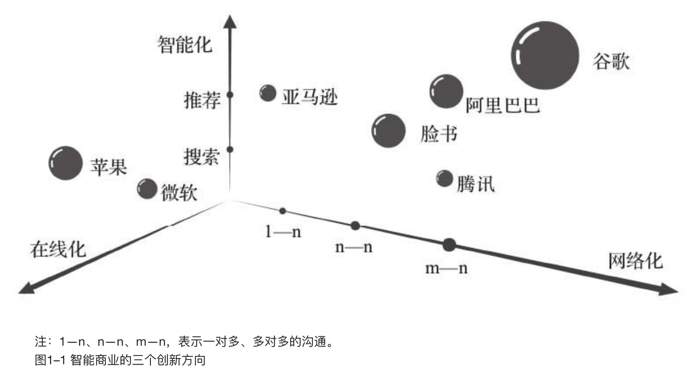
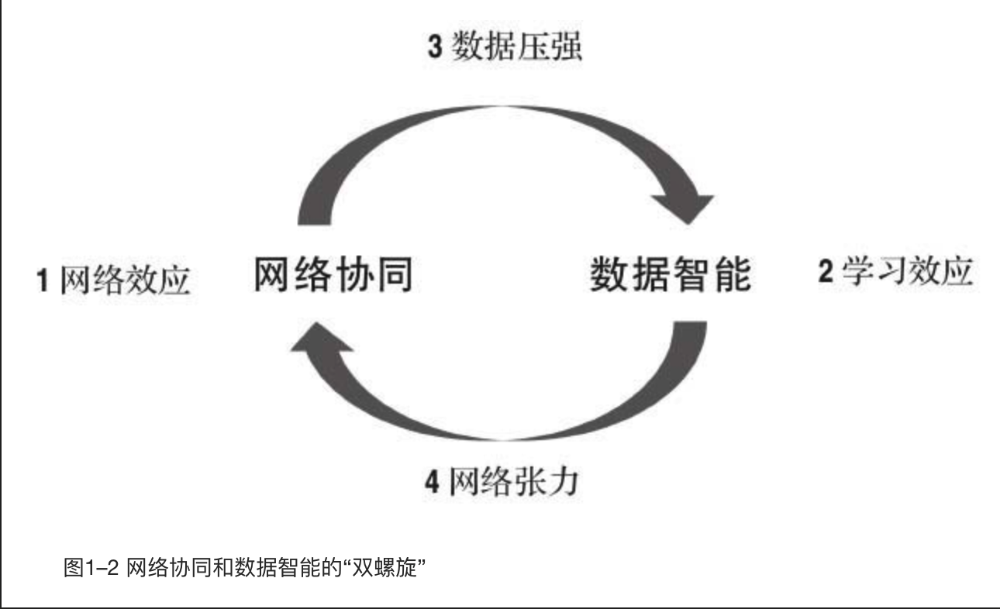

    作者: 曾鸣
    出版社: 中信出版集团
    出版年: 2018-11
    页数: 284
    定价: 68.00
    装帧: 精装
    丛书: 智能商业 书系
    ISBN: 9787508695761

- [第一部分 智能商业](#%e7%ac%ac%e4%b8%80%e9%83%a8%e5%88%86-%e6%99%ba%e8%83%bd%e5%95%86%e4%b8%9a)
  - [01 智能商业大变革](#01-%e6%99%ba%e8%83%bd%e5%95%86%e4%b8%9a%e5%a4%a7%e5%8f%98%e9%9d%a9)
    - [智能商业：网络和数据时代的必然选择](#%e6%99%ba%e8%83%bd%e5%95%86%e4%b8%9a%e7%bd%91%e7%bb%9c%e5%92%8c%e6%95%b0%e6%8d%ae%e6%97%b6%e4%bb%a3%e7%9a%84%e5%bf%85%e7%84%b6%e9%80%89%e6%8b%a9)
    - [双螺旋构成：网络协同+数据智能](#%e5%8f%8c%e8%9e%ba%e6%97%8b%e6%9e%84%e6%88%90%e7%bd%91%e7%bb%9c%e5%8d%8f%e5%90%8c%e6%95%b0%e6%8d%ae%e6%99%ba%e8%83%bd)
    - [未来已来，智能商业将走向何方](#%e6%9c%aa%e6%9d%a5%e5%b7%b2%e6%9d%a5%e6%99%ba%e8%83%bd%e5%95%86%e4%b8%9a%e5%b0%86%e8%b5%b0%e5%90%91%e4%bd%95%e6%96%b9)
      - [在线化](#%e5%9c%a8%e7%ba%bf%e5%8c%96)
      - [智能化](#%e6%99%ba%e8%83%bd%e5%8c%96)
      - [协同网络的扩张](#%e5%8d%8f%e5%90%8c%e7%bd%91%e7%bb%9c%e7%9a%84%e6%89%a9%e5%bc%a0)
  - [02 互联网的本质](#02-%e4%ba%92%e8%81%94%e7%bd%91%e7%9a%84%e6%9c%ac%e8%b4%a8)
    - [联：改变物理世界的底层技术革命](#%e8%81%94%e6%94%b9%e5%8f%98%e7%89%a9%e7%90%86%e4%b8%96%e7%95%8c%e7%9a%84%e5%ba%95%e5%b1%82%e6%8a%80%e6%9c%af%e9%9d%a9%e5%91%bd)
    - [互：让交流沟通具备无限可能](#%e4%ba%92%e8%ae%a9%e4%ba%a4%e6%b5%81%e6%b2%9f%e9%80%9a%e5%85%b7%e5%a4%87%e6%97%a0%e9%99%90%e5%8f%af%e8%83%bd)
    - [网：互联网给商业社会带来的颠覆性改变](#%e7%bd%91%e4%ba%92%e8%81%94%e7%bd%91%e7%bb%99%e5%95%86%e4%b8%9a%e7%a4%be%e4%bc%9a%e5%b8%a6%e6%9d%a5%e7%9a%84%e9%a2%a0%e8%a6%86%e6%80%a7%e6%94%b9%e5%8f%98)
  - [03 智能商业双螺旋之一：网络协同](#03-%e6%99%ba%e8%83%bd%e5%95%86%e4%b8%9a%e5%8f%8c%e8%9e%ba%e6%97%8b%e4%b9%8b%e4%b8%80%e7%bd%91%e7%bb%9c%e5%8d%8f%e5%90%8c)

# 第一部分 智能商业
## 01 智能商业大变革
### 智能商业：网络和数据时代的必然选择
我总结出三个重要方向上的创新。这些企业在这三个方向上，最少把握住了两个，并且在这些方向上都有了巨大的突破（见图1–1）。

- 第一，**在线化**。身处互联网时代，你有没有联网，有没有在线，是最重要的一步。
- 第二，**智能化**。谷歌首席执行官埃里克·施密特最近说：“现在是数据的时代，算法的时代。”数据和算法，构成了智能的基本要素。谷歌的成功，最重要的是推动了整个商业的智能化进程。`搜索`是第一款大规模商业应用的智能服务。除了搜索之外，智能服务的第二个核心产品是`推荐`。
- 第三，**网络化**。实际上谷歌的广告系统非常赚钱的就是一个由千万级的小广告主和千万级的网站所组成的高效生态。同样，脸书这几年的成功也是因为它在广告技术方面的突破。阿里巴巴，特别是淘宝，则是将网络协同和智能化这两个方面做成了一个紧密结合又互相促进的生态。

### 双螺旋构成：网络协同+数据智能
简单来说，智能商业最重要的两个组成部分分别是网络协同与数据智能（见图1–2）。

所谓的`人类文明`，最关键的并不是每一个个体，而是整个社会日益增强的协同能力，这才是我们这个时代最大的优势。

所谓`网络协同`，指的是通过大规模、多角色的实时互动来解决特定问题。以前我们解决一个问题，通常需要通过命令、科层制或者在简单市场中通过价格信号进行调整，但今天更多的是通过大规模、并发、多角色的实时互动加以实现。

淘宝不是零售商，我们不拥有任何一件商品，它是一个零售的生态圈，是一个赋能卖家的平台。淘宝之所以能够创造这么多奇迹，很重要的一个原因是淘宝演化成了一个社会化协同的大平台。在今天，即使是非常小的一个淘宝新卖家，也可以在线同时和几百个服务商合作，只需要有一个API（应用程序编程接口）的链接，就能调动相关的数据和相关的服务。

`算法`其实就是将人对特定事情的理解转换成机器可以理解和执行的模型与代码。

对于绝大多数企业来说，今后10年，最难的其实是创造一种产品和服务方式，把原来离线的用户在线化，产生一个持续的互动，这样才能实时记录用户的反馈，也才能优化算法、优化服务。

### 未来已来，智能商业将走向何方
在未来10年里，智能商业的发展依然要靠三条主线的突破。

#### 在线化
`IoT`的本质是一种新的人机交互方式。在PC互联网时代，人是被键盘锁定的；移动互联网时代，人是被手机锁定的；到IoT时代，人的五官得到极大延伸。

#### 智能化
未来，对大部分的企业来说，不用担心算法有多难，也不用担心招不到算法工程师，因为算法会像云计算一样成为一项基础设施；算法对大部分应用企业不会是一个壁垒，反而是一个有力的工具。

#### 协同网络的扩张
谷歌把广告在线化了，淘宝把零售在线化了。

几乎每个行业都会经历一个从传统的、封闭的、线性的供应链，走向开放的、价值协同网的完整过程，这中间有巨大的商机。

## 02 互联网的本质
### 联：改变物理世界的底层技术革命
- 连接1.0时代：PC互联网
- 连接2.0时代：移动互联网
- 连接3.0时代：万物互联网

### 互：让交流沟通具备无限可能
- 互动1.0时代：一对多的门户广播模式(门户网站新浪、搜狐、网易是典型代表)
- 互动2.0时代：以关注为典型代表的创新型互动(以分享、社区为核心的创新型互动产品，比如微博、推特和Instagram)
- 互动3.0时代：社交网络服务(两个SNS的大产品——美国的脸书与中国的微信)

### 网：互联网给商业社会带来的颠覆性改变
其实商业最重要的就是结网，未来互联网将给人类商业社会带来的颠覆性改变，就在于商业的大规模结网。当海量的人已经可以同时在线互动的时候，如何让他们通过在线协作的方式去完成某一件事情，便成为一种新的商业组织方式。

要想实现智能商业的第一步，就是让你的产品和服务核心流程`在线化`。在线化之后，真正的考验是你能否通过各种方式完成与客户的互动。

## 03 智能商业双螺旋之一：网络协同

