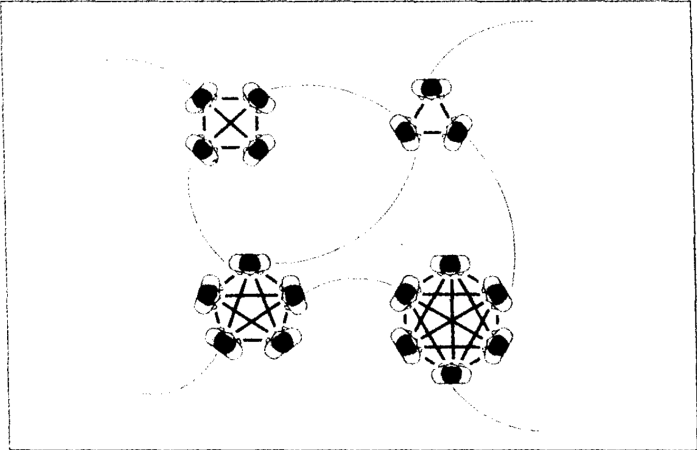
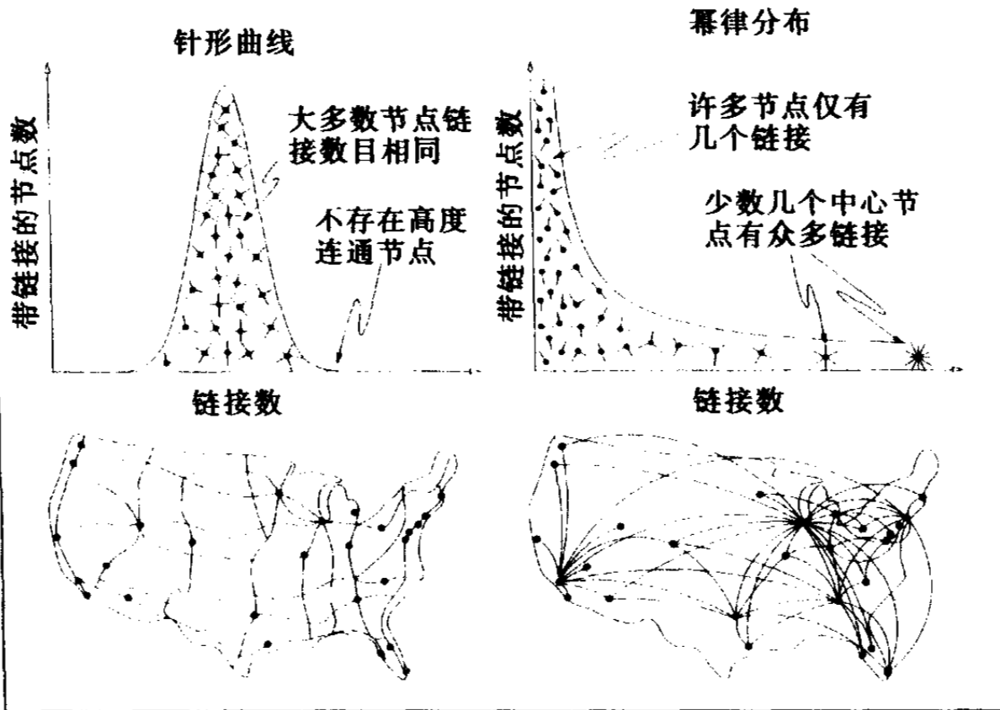
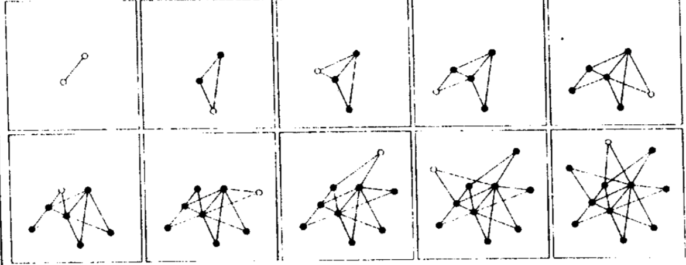
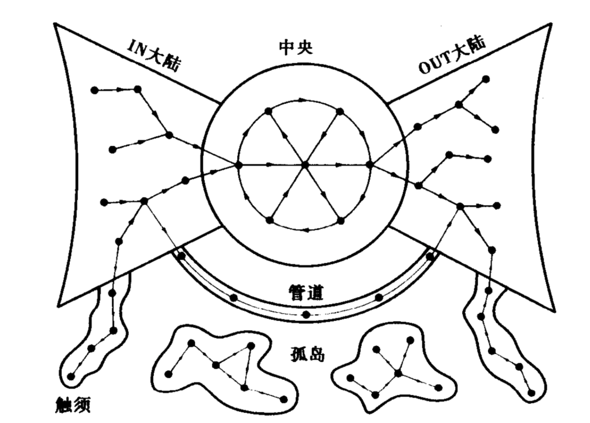

    作者:  [美] 艾伯特-拉斯洛·巴拉巴西 
    出版社: 浙江人民出版社
    副标题: 商业、科学与生活的新思维(十周年纪念版)
    原作名: Linked: How Everything Is Connected to Everything Else and What It Means for Business, Science, and Everyday Life
    译者: 沈华伟 
    出版年: 2013-8-1
    页数: 369
    定价: 59.90元
    装帧: 平装
    ISBN: 9787213056550

[豆瓣链接](https://book.douban.com/subject/24862722/)

- [第一部分 复杂网络的起源](#%e7%ac%ac%e4%b8%80%e9%83%a8%e5%88%86-%e5%a4%8d%e6%9d%82%e7%bd%91%e7%bb%9c%e7%9a%84%e8%b5%b7%e6%ba%90)
  - [第2链 随机宇宙](#%e7%ac%ac2%e9%93%be-%e9%9a%8f%e6%9c%ba%e5%ae%87%e5%ae%99)
    - [随机网络](#%e9%9a%8f%e6%9c%ba%e7%bd%91%e7%bb%9c)
    - [从节点到节点簇](#%e4%bb%8e%e8%8a%82%e7%82%b9%e5%88%b0%e8%8a%82%e7%82%b9%e7%b0%87)
    - [随机网络模型的直方图服从泊松分布](#%e9%9a%8f%e6%9c%ba%e7%bd%91%e7%bb%9c%e6%a8%a1%e5%9e%8b%e7%9a%84%e7%9b%b4%e6%96%b9%e5%9b%be%e6%9c%8d%e4%bb%8e%e6%b3%8a%e6%9d%be%e5%88%86%e5%b8%83)
  - [第3链 六度分隔](#%e7%ac%ac3%e9%93%be-%e5%85%ad%e5%ba%a6%e5%88%86%e9%9a%94)
    - [网页十九度分隔](#%e7%bd%91%e9%a1%b5%e5%8d%81%e4%b9%9d%e5%ba%a6%e5%88%86%e9%9a%94)
    - [对数让大网络缩小了](#%e5%af%b9%e6%95%b0%e8%ae%a9%e5%a4%a7%e7%bd%91%e7%bb%9c%e7%bc%a9%e5%b0%8f%e4%ba%86)
  - [第4链 小世界](#%e7%ac%ac4%e9%93%be-%e5%b0%8f%e4%b8%96%e7%95%8c)
    - [格兰诺维特与“弱关系的优势”](#%e6%a0%bc%e5%85%b0%e8%af%ba%e7%bb%b4%e7%89%b9%e4%b8%8e%e5%bc%b1%e5%85%b3%e7%b3%bb%e7%9a%84%e4%bc%98%e5%8a%bf)
    - [聚团系数](#%e8%81%9a%e5%9b%a2%e7%b3%bb%e6%95%b0)
    - [远距离链接](#%e8%bf%9c%e8%b7%9d%e7%a6%bb%e9%93%be%e6%8e%a5)
- [第二部分 复杂网络的本质](#%e7%ac%ac%e4%ba%8c%e9%83%a8%e5%88%86-%e5%a4%8d%e6%9d%82%e7%bd%91%e7%bb%9c%e7%9a%84%e6%9c%ac%e8%b4%a8)
  - [第5链 枢纽节点和连接者——复杂网络的关键要素](#%e7%ac%ac5%e9%93%be-%e6%9e%a2%e7%ba%bd%e8%8a%82%e7%82%b9%e5%92%8c%e8%bf%9e%e6%8e%a5%e8%80%85%e5%a4%8d%e6%9d%82%e7%bd%91%e7%bb%9c%e7%9a%84%e5%85%b3%e9%94%ae%e8%a6%81%e7%b4%a0)
    - [枢纽节点](#%e6%9e%a2%e7%ba%bd%e8%8a%82%e7%82%b9)
  - [第6链 幂律——复杂网络的分布规律](#%e7%ac%ac6%e9%93%be-%e5%b9%82%e5%be%8b%e5%a4%8d%e6%9d%82%e7%bd%91%e7%bb%9c%e7%9a%84%e5%88%86%e5%b8%83%e8%a7%84%e5%be%8b)
    - [无尺度网络](#%e6%97%a0%e5%b0%ba%e5%ba%a6%e7%bd%91%e7%bb%9c)
    - [幂律分布和钟形分布](#%e5%b9%82%e5%be%8b%e5%88%86%e5%b8%83%e5%92%8c%e9%92%9f%e5%bd%a2%e5%88%86%e5%b8%83)
  - [第7链 富者愈富——复杂网络的先发优势](#%e7%ac%ac7%e9%93%be-%e5%af%8c%e8%80%85%e6%84%88%e5%af%8c%e5%a4%8d%e6%9d%82%e7%bd%91%e7%bb%9c%e7%9a%84%e5%85%88%e5%8f%91%e4%bc%98%e5%8a%bf)
    - [生长机制](#%e7%94%9f%e9%95%bf%e6%9c%ba%e5%88%b6)
    - [偏好连接，让强者愈强](#%e5%81%8f%e5%a5%bd%e8%bf%9e%e6%8e%a5%e8%ae%a9%e5%bc%ba%e8%80%85%e6%84%88%e5%bc%ba)
    - [生长机制和偏好连接，支配真实网络的两大定律](#%e7%94%9f%e9%95%bf%e6%9c%ba%e5%88%b6%e5%92%8c%e5%81%8f%e5%a5%bd%e8%bf%9e%e6%8e%a5%e6%94%af%e9%85%8d%e7%9c%9f%e5%ae%9e%e7%bd%91%e7%bb%9c%e7%9a%84%e4%b8%a4%e5%a4%a7%e5%ae%9a%e5%be%8b)
    - [无尺度网络的诞生](#%e6%97%a0%e5%b0%ba%e5%ba%a6%e7%bd%91%e7%bb%9c%e7%9a%84%e8%af%9e%e7%94%9f)
  - [第8链 爱因斯坦的馈赠——复杂网络的新星效应](#%e7%ac%ac8%e9%93%be-%e7%88%b1%e5%9b%a0%e6%96%af%e5%9d%a6%e7%9a%84%e9%a6%88%e8%b5%a0%e5%a4%8d%e6%9d%82%e7%bd%91%e7%bb%9c%e7%9a%84%e6%96%b0%e6%98%9f%e6%95%88%e5%ba%94)
    - [适应度模型](#%e9%80%82%e5%ba%94%e5%ba%a6%e6%a8%a1%e5%9e%8b)
    - [适应度](#%e9%80%82%e5%ba%94%e5%ba%a6)
    - [适应度主导一切](#%e9%80%82%e5%ba%94%e5%ba%a6%e4%b8%bb%e5%af%bc%e4%b8%80%e5%88%87)
    - [玻色-爱因斯坦凝聚](#%e7%8e%bb%e8%89%b2-%e7%88%b1%e5%9b%a0%e6%96%af%e5%9d%a6%e5%87%9d%e8%81%9a)
    - [网络中的凝聚现象](#%e7%bd%91%e7%bb%9c%e4%b8%ad%e7%9a%84%e5%87%9d%e8%81%9a%e7%8e%b0%e8%b1%a1)
    - [“适者愈富”与“胜者通吃”](#%e9%80%82%e8%80%85%e6%84%88%e5%af%8c%e4%b8%8e%e8%83%9c%e8%80%85%e9%80%9a%e5%90%83)
    - [操作系统市场上的“胜者通吃”](#%e6%93%8d%e4%bd%9c%e7%b3%bb%e7%bb%9f%e5%b8%82%e5%9c%ba%e4%b8%8a%e7%9a%84%e8%83%9c%e8%80%85%e9%80%9a%e5%90%83)
    - [节点永远在为链接而竞争](#%e8%8a%82%e7%82%b9%e6%b0%b8%e8%bf%9c%e5%9c%a8%e4%b8%ba%e9%93%be%e6%8e%a5%e8%80%8c%e7%ab%9e%e4%ba%89)
  - [第9链 阿喀琉斯之踵——复杂网络的健壮性与脆弱性](#%e7%ac%ac9%e9%93%be-%e9%98%bf%e5%96%80%e7%90%89%e6%96%af%e4%b9%8b%e8%b8%b5%e5%a4%8d%e6%9d%82%e7%bd%91%e7%bb%9c%e7%9a%84%e5%81%a5%e5%a3%ae%e6%80%a7%e4%b8%8e%e8%84%86%e5%bc%b1%e6%80%a7)
    - [健壮网络的容错性](#%e5%81%a5%e5%a3%ae%e7%bd%91%e7%bb%9c%e7%9a%84%e5%ae%b9%e9%94%99%e6%80%a7)
    - [故障更多地影响小节点](#%e6%95%85%e9%9a%9c%e6%9b%b4%e5%a4%9a%e5%9c%b0%e5%bd%b1%e5%93%8d%e5%b0%8f%e8%8a%82%e7%82%b9)
    - [丢失枢纽节点，网络变成碎片](#%e4%b8%a2%e5%a4%b1%e6%9e%a2%e7%ba%bd%e8%8a%82%e7%82%b9%e7%bd%91%e7%bb%9c%e5%8f%98%e6%88%90%e7%a2%8e%e7%89%87)
- [第三部分 复杂网络的影响](#%e7%ac%ac%e4%b8%89%e9%83%a8%e5%88%86-%e5%a4%8d%e6%9d%82%e7%bd%91%e7%bb%9c%e7%9a%84%e5%bd%b1%e5%93%8d)
  - [第10链 病毒和时尚](#%e7%ac%ac10%e9%93%be-%e7%97%85%e6%af%92%e5%92%8c%e6%97%b6%e5%b0%9a)
    - [传播速率与关键阈值](#%e4%bc%a0%e6%92%ad%e9%80%9f%e7%8e%87%e4%b8%8e%e5%85%b3%e9%94%ae%e9%98%88%e5%80%bc)
    - [无尺度网络中的传播规律](#%e6%97%a0%e5%b0%ba%e5%ba%a6%e7%bd%91%e7%bb%9c%e4%b8%ad%e7%9a%84%e4%bc%a0%e6%92%ad%e8%a7%84%e5%be%8b)
    - [优先治疗枢纽节点，优先对付“毒王”](#%e4%bc%98%e5%85%88%e6%b2%bb%e7%96%97%e6%9e%a2%e7%ba%bd%e8%8a%82%e7%82%b9%e4%bc%98%e5%85%88%e5%af%b9%e4%bb%98%e6%af%92%e7%8e%8b)
  - [第12链 分裂的万维网](#%e7%ac%ac12%e9%93%be-%e5%88%86%e8%a3%82%e7%9a%84%e4%b8%87%e7%bb%b4%e7%bd%91)
    - [万维网上的四块“大陆”](#%e4%b8%87%e7%bb%b4%e7%bd%91%e4%b8%8a%e7%9a%84%e5%9b%9b%e5%9d%97%e5%a4%a7%e9%99%86)
    - [万维网上的社区](#%e4%b8%87%e7%bb%b4%e7%bd%91%e4%b8%8a%e7%9a%84%e7%a4%be%e5%8c%ba)
    - [代码与架构](#%e4%bb%a3%e7%a0%81%e4%b8%8e%e6%9e%b6%e6%9e%84)
  - [第13链 生命的地图](#%e7%ac%ac13%e9%93%be-%e7%94%9f%e5%91%bd%e7%9a%84%e5%9c%b0%e5%9b%be)
    - [破译人类基因组，打造生命之书](#%e7%a0%b4%e8%af%91%e4%ba%ba%e7%b1%bb%e5%9f%ba%e5%9b%a0%e7%bb%84%e6%89%93%e9%80%a0%e7%94%9f%e5%91%bd%e4%b9%8b%e4%b9%a6)
    - [生命网络中三度分隔的分子](#%e7%94%9f%e5%91%bd%e7%bd%91%e7%bb%9c%e4%b8%ad%e4%b8%89%e5%ba%a6%e5%88%86%e9%9a%94%e7%9a%84%e5%88%86%e5%ad%90)
    - [细胞是真正的小世界](#%e7%bb%86%e8%83%9e%e6%98%af%e7%9c%9f%e6%ad%a3%e7%9a%84%e5%b0%8f%e4%b8%96%e7%95%8c)

# 第一部分 复杂网络的起源
## 第2链 随机宇宙
### 随机网络
`随机网络`是指通过随机连接节点搭建起来的网络。在随机网络中，链接是完全随机放置的，所有节点有相等的机会获得链接。只要网络足够大，几乎所有节点拥有的链接数都基本相同。因此，随机网络是一个高度平等的网络。

### 从节点到节点簇
尽管不同的学科有不同的术语，但他们一致认为，随机选择网络中的节点对进行连接时，会出现一些特殊的现象：当添加的链接数超过一个临界值时，网络将发生剧烈变化。在到达这个临界值之前，网络中包含许多不连通的小节点簇，每个节点簇对应只在内部进行交流的一组人。到达临界值之后，网络中将出现一个巨大的节点簇，几乎所有人都被连接在这个巨大的节点簇里。

### 随机网络模型的直方图服从泊松分布
埃尔德什的学生贝拉·伯罗巴斯（Béla Bollobás）在1982年便精确地推导和证明了埃尔德什和莱利的随机网络模型直方图的形状。贝拉·伯罗巴斯是美国孟菲斯大学和英国剑桥大学三一学院的数学教授。其证明结果表明，随机网络模型的直方图服从泊松分布，而泊松分布的一些独特的性质会一直贯穿本书。泊松分布有一个明显的峰值，表明大多数节点所拥有的链接数和节点拥有的平均链接数一样。在峰值的两侧，泊松分布快速衰减，因此，与平均值偏离较大的值极少出现。

## 第3链 六度分隔
在一个有着60亿个节点的网络中，任意两个节点之间平均相隔6个链接。

### 网页十九度分隔
节点间隔的增加比节点数量的增加慢得多，遵循着简单反复的表达式。这时我们只需要知道网络中文档的数目便能预测出网络的节点间隔。日本电气公司提供了网络文档总数，他们估计，到1998年年底，网络上公开索引的节点总数为8亿。因此，利用我们得到的表达式，可以算出网络的直径为18.59，近似为19。按照格尔的说法，就是十九度分隔。

### 对数让大网络缩小了
万维网的十九度分隔已经是最大的了，到目前为止，其他研究过的网络中，节点间隔介于2和14之间。
* 食物链网络中，物种间的平均间隔只有两个链接；
* 细胞中，分子间的平均间隔是3个化学反应；
* 科学家合作网络中，不同领域的科学家之间的间隔是4到6个合作链接；
* 线虫（C.elegans）的大脑中，神经元之间的间隔是14个突触。

网络间隔之所以小，和公式中出现的对数项有关。事实上，即使是非常大的数，其对数也非常小。以10为底，10亿的对数仅为9。

## 第4链 小世界
### 格兰诺维特与“弱关系的优势”
在《弱关系的优势》中，格兰诺维特提出了一个乍听起来很荒谬的观点：无论是找工作、获取消息、开餐馆，还是传播新潮流，**弱社会关系比我们所珍视的强社会关系更重要。**

图4-1 强关系和弱关系

在马克·格兰诺维特描述的社会中，我们的密友相互之间往往也是朋友。这样一个聚团化社会的背后，社会网络由一些完全相连的小朋友圈组成，朋友圈内部的关系是强关系，用粗线条表示。细线条表示的弱关系将朋友圈里的人和他们的熟人连接起来，这些熟人也有着自己的朋友圈。无论是散布谣言，还是找工作，弱关系在很多社会活动中都扮演着重要角色。

### 聚团系数
瓦茨和斯托加茨引入了一个被称为聚团系数的量。假如你有4个好朋友。如果他们彼此也是朋友，两两之间存在一个链接，那么总共存在6个朋友链接。也有可能，你的一些朋友彼此不是朋友，那么他们之间的朋友链接数小于6，可能是4。在这种情况下，你的朋友圈的聚团系数是0.66，计算方式为：用你的朋友之间的实际朋友链接数4，除以他们之间最多能够形成的朋友链接数6。

### 远距离链接
即使只添加少量几个链接，也能大大降低节点间的平均间隔，而新添加的这些链接并没有显著改变聚团系数。然而，这些链接构成了长的桥梁，它们往往连接着分处圆圈两边的节点，于是，所有节点之间的间隔瞬间缩短。六度分隔源于这样一个事实：有些人的朋友和亲戚不是他们的左邻右舍。这些远距离的链接，让世界上相距遥远的人之间有了捷径。大型网络的链接不再需要是完全随机的，便能展现出小世界特性，只要有少数几个随机链接就足够了。

# 第二部分 复杂网络的本质
## 第5链 枢纽节点和连接者——复杂网络的关键要素
### 枢纽节点
`枢纽节点`是指网络中少数连接度非常高的节点。例如，在人类社会中，枢纽节点是指少数认识的人非常多的连接者。在存在枢纽节点的网络中，网络的结构由枢纽节点支配，从而使网络呈现出小世界特性。实际上，枢纽节点和非常多的节点有链接，从而在系统中的任意两个节点之间建立了捷径。

由于网络存在聚团现象，那些只和自己所属圈子中其他节点相连的节点，可能会在那个小圈子中处于中心。但是，由于和外界没有连接，他们和其他圈子里的节点之间的距离相当远。网络的真正中心位置属于那些在多个大圈子里都有位置的节点。

对于演员网络而言，枢纽节点是那些在职业生涯中出演过多种类型影片的演员。对于万维网而言，枢纽节点是那些不仅链接到现代艺术，而且链接到人们关心的几乎所有领域的网页。对于人类社会而言，枢纽节点是那些与多个领域和社会阶层的人都有交往的人。

枢纽节点确实值得广泛关注。在存在枢纽节点的网络中，网络的结构由枢纽节点支配，从而使网络呈现出`小世界特性`。实际上，枢纽节点和非常多的节点有链接，从而在系统中的任意两个节点之间建立了捷径。因此，尽管地球上随机选择的两个人之间的平均分隔数是6，但某个人和连接者之间的距离却常常只有1或2。类似地，尽管万维网上任意两个网页的平均距离是19，但从大多数网页出发到达雅虎这样的枢纽节点却只需两三次点击。从枢纽节点的角度来看，世界确实非常小。

## 第6链 幂律——复杂网络的分布规律
### 无尺度网络
无尺度网络是遵循幂律度分布的网络。网络中大多数节点只有很少几个链接，它们通过少数几个高度连接的枢纽节点连接在一起。在形状上，无尺度网络很像航空交通系统，很多小机场通过少数几个主要的交通枢纽连接在一起。

### 幂律分布和钟形分布
请注意，幂律分布和钟形分布在分布的尾部存在着重要的定性差异。钟形分布的尾部指数衰减，衰减速度比幂律分布快很多。指数衰减的尾部造成枢纽节点不存在。相比而言，幂律分布衰减得慢很多，允许像枢纽节点这样的“罕见事件”存在。

图6-1 随机网络和无尺度网络

随机网络的度分布遵循钟形曲线，这表明，大多数节点拥有相同的链接数，不存在拥有非常多链接的节点（左上图）。因此，随机网络和国家高速公路网络类似，公路网络中，节点是城市，链接是城市间的主要高速公路。实际上，大多数城市的高速公路数相差无几（左下图）。相比而言，无尺度网络的幂律度分布表明，大多数节点只拥有少数几个链接，它们通过少数几个拥有大量链接的枢纽节点连接在一起（右上图）。视觉上看，无尺度网络很像航空交通系统，很多小机场通过少数几个主要的交通枢纽连接在一起（右下图）。

## 第7链 富者愈富——复杂网络的先发优势
### 生长机制
随意选择一个你能想到的网络，下面的情形很可能就是正确的：从少数几个节点开始，通过添加新的节点，网络增量式生长，逐渐到达现在的规模。很明显，生长迫使我们重新思考模型的假设。埃尔德什-莱利模型和瓦茨-斯托加茨模型都假设我们拥有固定数目的节点，然后将这些节点以某种巧妙的方式连接在一起。因此，这些模型生成的网络是静态的，也就是说，节点数目在网络生命期内保持不变。相比之下，我们的例子表明，对于真实网络而言，这个静态假设是不合适的。相反，我们应该将生长机制整合到网络模型中。这是我们在试图解释枢纽节点时得到的最初见解。如此一来，我们就颠覆了随机宇宙的第一个根本假设——静态特性。

在每个时刻，所有节点有同样的机会被连接，结果导致那些先加入的节点拥有明显的优势。事实上，除了极少的统计扰动之外，模型A中最早加入的节点将是最富有的，因为这样的节点拥有最长的时间来收集链接。

作为区分无尺度网络和随机模型的函数，模型A的度分布按照指数衰减得很快。早期加入的节点是明显的胜者，但是，指数形式的度分布表明，这种节点的度太小，数目也太小。因此，模型A不能解释枢纽节点和连接者。这表明，仅有生长机制还不能解释幂律的出现。

### 偏好连接，让强者愈强
我们在不知不觉中遵循着某种偏见，以较高的概率去连接自己知道的节点，这些节点是万维网中链接数较多的节点。所以，我们更喜欢枢纽节点。

上述现象的本质是，在万维网上决定连向哪里时，我们遵循着“偏好连接”：如果有两个网页可供选择，其中一个网页的链接数是另一个网页的两倍，那么选择链接数较多那个网页的人数会两倍于选择另一个网页的人数。虽然个体选择非常难预测，作为一个整体时却遵循着严格的模式。

万维网和好莱坞网络让我们不得不放弃随机网络固有的第二个重要的假设——平等特性。

### 生长机制和偏好连接，支配真实网络的两大定律
为了回答该问题，在1999年发表在《科学》杂志上的论文中，我们提出了一个包含这两个定律的网络模型。模型很简单，根据生长机制和偏好连接，网络生成算法可以通过下面两个直接的规则定义出来。

A.`生长机制`：每个阶段，我们向网络中添加一个新节点。该步骤强调网络每次增加一个节点。

B.`偏好连接`：我们假定每个新节点和已经存在的节点之间形成两个链接。选择给定节点的概率正比于该节点拥有的链接数。也就是说，如果有两个节点可供选择，其中一个节点的链接数是另一个的两倍，链接数多的节点被选到的概率也是另一个节点的两倍。

图7-1 无尺度网络的诞生

`无尺度拓扑`是真实网络持续生长特性的自然结果。开始时，网络中仅有两个相互连接的节点（左上图），在后续的每个子图中，一个新的节点（用空心圆表示）被添加到网络中。在决定连向哪里时，新节点倾向于连接那些连接度高的节点。由于生长机制和偏好连接，一些高度连接的枢纽节点出现了。

### 无尺度网络的诞生
生长机制让资历老的节点具有明显的优势，让它们拥有最多的链接。

偏好连接引入了富者愈富的现象，帮助连接度较高的节点得到更多的链接，而后来者的链接数会相应地减少。

## 第8链 爱因斯坦的馈赠——复杂网络的新星效应
### 适应度模型
`适应度模型`在无尺度模型的基础上引入了竞争因素。适应度模型并没有排除生长机制和偏好连接这两个支配网络演化的基本定律，改变的只是竞争环境下发挥吸引作用的因素。在无尺度模型中，我们假设节点的吸引能力仅仅由它的链接数决定。但在竞争环境下，适应度也发挥作用：具有更高适应度的节点更经常被连接。适应度的出现，使得先发者不再一定是最后的胜者。相反，适应度主导着一切，制造和打破枢纽节点。

### 适应度
适应度是一种能力：
* 相对于身边的其他人，一个人结交朋友的能力；
* 相对于其他公司，一个公司吸引和保有客户的能力；
* 相对于其他有抱负的演员，一个演员被连接和记起的能力；
* 相对于数十亿其他竞争关注的网页，一个网页让我们每天访问它的能力。

如果两个节点拥有相同的链接数，适应度高的节点会更快获得链接。如果两个节点具有相同的适应度，较老的节点依然具有优势。

### 适应度主导一切
在无尺度模型中，网络中节点的连接度按照时间的平方根增长。而适应度模型则具有截然不同的行为。它告诉我们，节点依然按照幂律tβ获得链接。但是，反映节点获得新链接速度的动态指数β对于每个节点是不同的，和节点的适应度成正比。如果一个节点的适应度是任意其他节点的两倍，它将以较快的速度获得链接，其动态指数β也是其他节点的两倍。因此，节点获得链接的速度不再只是年长的问题了。如果不考虑节点加入网络的时间，适应度大的节点很快就能将适应度小的节点甩在身后。

### 玻色-爱因斯坦凝聚
在正常温度下，气体的原子以不同的速度相互碰撞。有些原子速度快，有些原子速度慢。使用物理学的语言，即有些原子具有高能量，有些原子具有低能量。如果给气体降温，所有原子都会慢下来。如果想让原子停下来，需要把温度降到绝度零度，但这是一个无法达到的温度。爱因斯坦预言，如果将由不可区分的原子构成的气体充分冷却，绝大多数粒子将处于最低能量状态。也就是说，在绝度零度以上的某个临界温度，也可以让原子处于最低能量状态。当粒子到达这个状态时，它们形成了一种新的物质形态，称为玻色-爱因斯坦凝聚。

### 网络中的凝聚现象
用适应度代替能量，为适应度模型中的每个节点赋予一个能级。突然间，这些计算就具有了出人意料的意义：我们看到了爱因斯坦80年前发现凝聚态时碰到的情形。这也许只是偶然，而且无足轻重。但是，在适应度模型和玻色气体之间的确存在严格的数学映射。按照这样的映射，网络中的每个节点对应玻色气体中的一个能级。节点适应度越大，它对应的能级越低。网络中的链接变成了气体中的粒子，每个粒子被赋予一个给定的能级。向网络中添加新节点，如同向玻色气体中添加新的能级；向网络中添加新链接，等同于向气体中注入新的玻色粒子。在这个映射中，复杂网络就像巨大的量子气体，它的链接就像亚原子粒子。

这种映射关系带来的最重要的预言是有些网络能够进行玻色-爱因斯坦凝聚。不需要知道任何量子力学的知识，就能理解该预言带来的影响：简言之，就是有些网络中胜者通吃。对于玻色-爱因斯坦凝聚而言，所有的粒子都挤在最低能级，其他的能级没有粒子出现。与此类似，在某些网络中，适应度最好的节点理论上可以获得所有链接，其他节点则一无所有。这就是胜者通吃。

### “适者愈富”与“胜者通吃”
在第一类网络中，对于链接的竞争虽然激烈，无尺度拓扑却依然存在。这些网络表现出适者愈富的行为，这意味着，适应度最高的节点最终会成为最大的枢纽节点。

在第二类网络中，胜者通吃。这意味着，适应度最大的节点占有所有链接，其他节点几乎没有链接。这样的网络具有星形拓扑，即所有节点都和一个枢纽节点相连。

### 操作系统市场上的“胜者通吃”
本质上讲，微软通吃了操作系统市场。操作系统市场具有典型的玻色-爱因斯坦凝聚特性，清晰地显现出胜者通吃的行为。

### 节点永远在为链接而竞争
只要我们认为网络是随机的，就会把网络建模成静态的图。无尺度模型体现了我们在认识上的觉醒，我们开始意识到网络是动态系统，它通过添加新的节点和链接而持续变化。适应度模型让我们把网络描述成充满竞争的系统，节点为了链接而激烈竞争。现在，玻色-爱因斯坦凝聚又解释了胜者是如何获得通吃机会的。

## 第9链 阿喀琉斯之踵——复杂网络的健壮性与脆弱性
### 健壮网络的容错性
移除少量节点对网络完整性的影响极小，但当移除节点的数量达到某一临界点时，整个系统会忽然分裂成很多小孤岛。随机网络上的故障是一个逆相变的例子：存在一个临界的错误阈值，在阈值之下系统相对完整，在阈值之上网络就会分裂成碎片。

2000年1月，在DAPRA申请书的鼓舞下，我们进行了一系列计算机实验来测试互联网对于路由器故障的容错性。从当时获得的最好的互联网地图开始，我们从网络中随机挑选节点进行删除。让我们非常惊讶的是，网络根本没有分裂的迹象。我们删除了多达80%的节点，余下20%的节点仍然连在一起，形成一个紧密互联的簇。这一发现验证了人们逐渐注意到的一个事实：和许多人造系统不同，互联网对路由器故障表现出高度的健壮性。

### 故障更多地影响小节点
无尺度网络的显著特征是存在枢纽节点，这些高连接度的节点将整个网络连接在一起。然而，故障并不区分节点，大的枢纽节点和小节点发生故障的概率是相同的。

如果网络中所有节点以均等的概率发生故障，受影响的更有可能是小节点，因为小节点的数目比枢纽节点多很多。

鲁文·柯恩（Reuven Cohen）、科伦·依莱兹（Keren Erez）以及已成为克拉克森大学物理教授的前学生丹尼尔·本-亚伯拉罕（Daniel ben-Avraham）一起，计算将任意网络——随机网络或者无尺度网络分裂成碎片所需要删除的节点比例。
* 一方面，他们的计算解释了一个广为人知的结果：随机网络在被删除的节点达到一个临界值后会分裂成碎片。
* 另一方面，他们发现，度指数小于或等于3的无尺度网络不存在这样一个临界值。

### 丢失枢纽节点，网络变成碎片
如果骇客成功地攻击了互联网最大的一些枢纽节点，其潜在破坏可能是难以估量的。这并不是互联网协议的错误设计或缺陷所造成的。这种面对攻击的脆弱性是所有无尺度网络的固有属性。

# 第三部分 复杂网络的影响
## 第10链 病毒和时尚
### 传播速率与关键阈值
虽然不同的扩散模型在目的和细节上存在明显的不同，但所有模型都在预测同一个现象：每种创新都有一个确定的“传播率”，表示人们在接触到该创新之后采纳它的可能性。例如，传播率包括你在见到一种新型掌上设备后立即购买它的可能性。不过，只知道传播率并不足以决定一种创新的命运。因此，我们必须计算“临界阈值”，该值是由创新传播网络自身的性质决定的。如果一个创新的传播率低于临界阈值，它很快就会消亡；如果传播率高于该阈值，接受该创新的人数将会呈指数增长，直到所有潜在接受者都接受为止。

### 无尺度网络中的传播规律
在无尺度网络上，传染阈值奇迹般地消失了！这就是说，即便病毒不那么具有传染性，仍然能够传播和存活。

这种高度异常的行为源自互联网不均匀的拓扑。无尺度网络是由枢纽节点主导的。由于枢纽节点连接着数量巨大的其他计算机，所以被其中一台计算机感染的机会很大。而枢纽节点一旦被感染，就会把病毒传染给所有与它连接的计算机。因此，高度连接的枢纽节点为病毒的持续存活和传播提供了独一无二的便利。虽然凶恶的病毒在任何网络中都能快速到达所有节点，但相对温和的病毒在无尺度环境下也有很大的概率存活下来。

### 优先治疗枢纽节点，优先对付“毒王”
如果我们为度大于某个预设值的所有节点提供治疗，无论我们将预设值设定成多少，传播阈值都会变成一个有限的值。我们治疗的枢纽节点越多，传播阈值就越高，病毒消亡的可能性就越大。

任何偏向于选择链接数高的节点进行治疗的策略，哪怕略微偏向一些，都能得到一个有限的传播阈值。也就是说，即便我们找不到所有的枢纽节点，只要我们偏向于选择枢纽节点进行治疗，一样能降低疾病的传播率。

## 第12链 分裂的万维网
### 万维网上的四块“大陆”
第一块大陆包括了全部万维网页面的1/4。该部分通常被称为`中央核心`（central core），囊括了所有的主流网站，如雅虎、美国有线电视新闻网等。它最突出的特点是极易导航，因为隶属于它的任意两个文档之间都存在一条路径。这并不是说任意两个节点间都有一条直接的链接，而是指任意两个节点之间都存在一条路径，允许你浏览至任意节点。

第二块和第三块大陆被称为`IN大陆`和`OUT大陆`，这两块大陆的规模与中央核心一样，但导航很困难。从IN大陆中的页面出发你能够到达中央核心，但从中央核心没有路径能让你返回IN陆地。与这种情况相反，从中央核心出发很容易就能到达属于OUT大陆的节点，但一旦离开了中央核心，就不存在让你返回去的链接。OUT大陆上主要是公司网站，它们能方便地从外部进入，然而一旦你进入了，就没有路径退出去。第四块大陆`由卷须（tendrils）和分散的岛屿组成`。这些岛屿是由仅存在内部链接的网页组成的孤立组，无法从中央核心到达，也没有到达中央核心的链接。有一些孤立组包含成千上万个网络文档。近四分之一的万维网文档都存在于这样的孤岛或卷须上。

图12-1 有向网络图中的大陆

像万维网这样的有向网络会自然地分隔成几块易识别的大陆区域。在中央核心，任意两节点间均可达。对IN大陆中的节点，跟随它们的链接最终会让你回到中央核心，但从中央核心出发你无法回到IN大陆。正好相反的是，OUT大陆中的所有节点都能够从中央核心区域到达，但你一旦到达了，就无法回到中央核心。最后，有管道直接连接了IN大陆至OUT大陆，还有些节点形成了卷须，仅与IN大陆和OUT大陆相连，还有少量节点形成了孤岛，它们无法通过其他节点访问到。

搜索引擎能很容易地绘制出近一半的内容，即互相通连的区域和OUT大陆，因为只要从人们经常访问的中央核心的任意节点出发，就能很容易地定位到属于它们的所有节点。然而，由孤岛和IN大陆组成的万维网的另一半，则无助地孤立着。无论机器人多么努力，都找不到其上的文档。这也正是大部分搜索引擎允许你提交自己网站的地址的原因。

这个分散的结构会一直存在下去吗？还是随着万维网的演化和增长，四块大陆最终会融合成一个任意节点都相互连通的核心？答案很简单：只要链接仍是有向的，这样的同质化就永远不会发生。

### 万维网上的社区
四块大陆并不是万维网上唯一的孤立结构。在一个更小的尺度上，这些大陆上存在许多活跃的村庄和城市。它们是因某个共同的想法、爱好或习惯而形成的基于共同兴趣的社区。

### 代码与架构
除了法律上的分歧，更深层次的问题在于代码——万维网背后的软件。法国法院承认，考虑到万维网的性质，没有方法让法国与世界完全分离。但是他们被一些专家说服，那些专家表示雅虎可以通过增加过滤机制来禁止至少70%～80%法国人民尝试访问雅虎纳粹相关站点的行为。因此，法院裁决雅虎去修改代码。斯坦福法律教授劳伦斯·莱西格（Lawrence Lessig）在他的著作《代码和其他网络空间法律》（Code and Other Laws of Cyberspace）中准确地预见了这一举动。莱西格认为：“若允许网络空间自由发展，它将变为一个完美的控制工具。”网络空间看不见的手正在构建着一个与其诞生时彻底相反的架构。

万维网的大规模拓扑结构——即它真实的架构，给万维网上我们的行为和可见性施加了更严重的限制，远超过政府或产业仅通过更改代码所能达到的程度。规则来了又走，但管控万维网的拓扑结构和基本的自然法则是不变的。只要我们继续让个体拥有自行设置链接的权力，我们就不能显著地改变万维网的大尺度拓扑结构，而且我们必须接受这样带来的结果。

## 第13链 生命的地图
### 破译人类基因组，打造生命之书
寻找躁郁症基因的失败就是最好的例证。列出一组可疑的基因还不够。要想治愈大多数疾病，我们需要从整体上理解生命系统。我们需要知道：不同的基因何时以及如何一起工作？细胞内的消息如何传递？在任意给定时刻哪些反应是否正在进行？某个反应的影响是如何在复杂细胞网络中传播的？要想做到这些，我们需要绘制出细胞内部网络的地图。生命地图决定着一个细胞是成为皮肤细胞还是心脏细胞，决定着细胞对外界扰动的反应，掌握着细胞在持续变化的外部环境中生存的关键，告诉细胞何时分裂何时死亡，并对从癌症到精神紊乱等各种疾病负有责任。《科学》杂志上的一篇划时代的文章对人类基因组计划总结如下：“不存在‘好’基因或‘坏’基因，只存在不同水平的网络。”

### 生命网络中三度分隔的分子
在生命网络中，如果两个分子参与了同一个反应，它们的分隔为一度。如果需要两个连续的反应才能把它们联系起来，那么它们之间的分隔就是两度。

实际上，细胞组成的是一个三度分隔的小世界。也就是说，大多数分子都可以通过长度为3的路径联系起来。

无论是寄生细菌内的微型网络，还是多细胞生物（例如花）内的发达网络，网络间隔都是一样的。

我们发现，大多数细胞的枢纽节点都是一样的。也就是说，大多数生物体中，连接度最高的前十个分子都是一样的。ATP（Adenosine Triphosphate：三磷酸腺苷）在几乎所有生物体中都是最大的枢纽节点，紧随其后的是ADP（Adenosine Diphosphate：二磷酸腺苷）和水。

无尺度模型的一个关键预言是：拥有大量链接的节点，往往都是早期加入网络的节点。对于新陈代谢网络而言，连接度最高的分子应该是细胞中最“老”的分子。的确如此，瓦格纳和费勒的分析表明，连接度最高的分子，其进化历史也最早。这些分子中，有一些被认为是所谓的RNA世界的遗留物，这是DNA出现前的进化步骤；其他的分子是最古老新陈代谢过程的组成部分。因此，先发优势似乎也遍布于生命出现的过程中。

虽然枢纽节点是一样的，但不同生物体中连接度较小的分子却各不相同。

### 细胞是真正的小世界
实际上，我们能够证明：改变某个枢纽蛋白质的基因，在60%～70%的情况下会导致细胞的死亡。相比之下，改变低连接度蛋白质的基因，导致细胞死亡的可能性小于20%。
