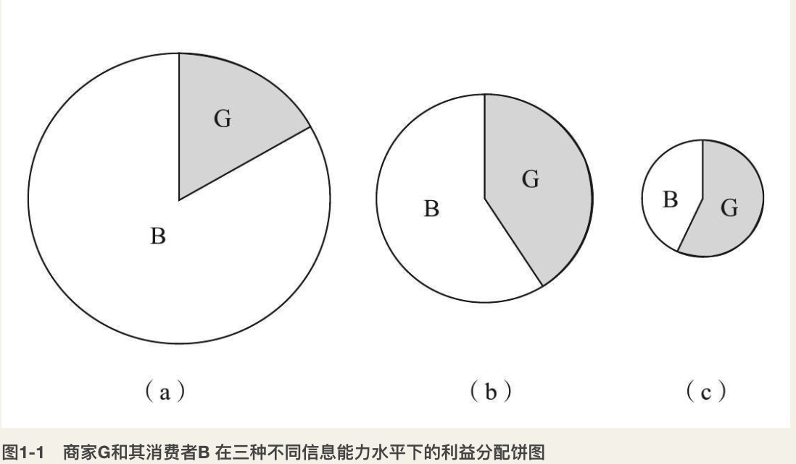
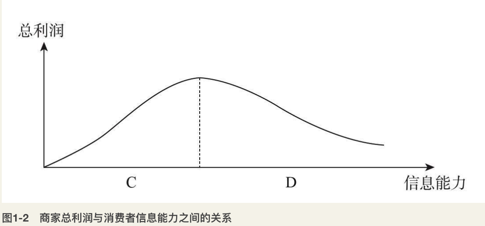
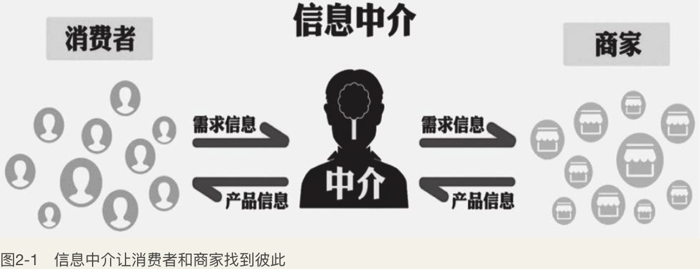
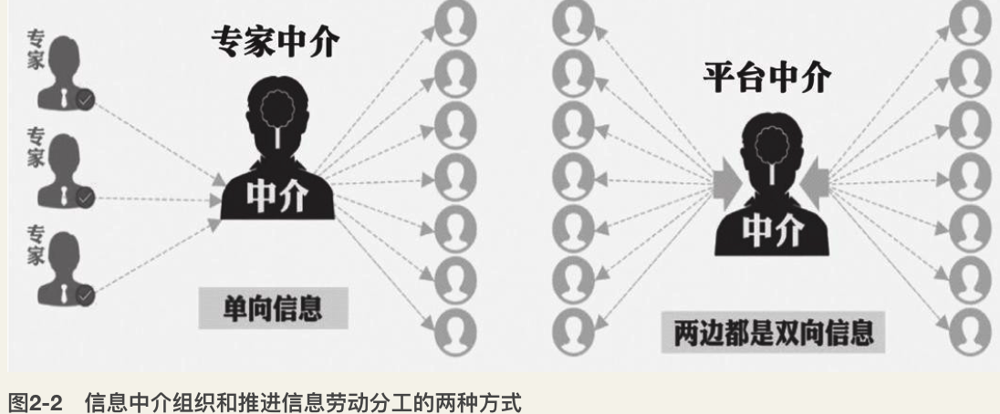

    作者: 张翼成 / 吕琳媛 / 周涛 
    出版社: 四川人民出版社
    副标题: 信息经济的结构
    出版年: 2018-1-1
    页数: 224
    定价: CNY 69.90
    装帧: 精装
    ISBN: 9787220106637

[豆瓣链接](https://book.douban.com/subject/27623458/)

- [01 神奇的魔饼](#01-%e7%a5%9e%e5%a5%87%e7%9a%84%e9%ad%94%e9%a5%bc)
  - [信息能力](#%e4%bf%a1%e6%81%af%e8%83%bd%e5%8a%9b)
  - [魔饼](#%e9%ad%94%e9%a5%bc)
  - [信息竞合](#%e4%bf%a1%e6%81%af%e7%ab%9e%e5%90%88)
  - [不对称性基本原理](#%e4%b8%8d%e5%af%b9%e7%a7%b0%e6%80%a7%e5%9f%ba%e6%9c%ac%e5%8e%9f%e7%90%86)
  - [新魔饼的诞生](#%e6%96%b0%e9%ad%94%e9%a5%bc%e7%9a%84%e8%af%9e%e7%94%9f)
- [02 信息中介](#02-%e4%bf%a1%e6%81%af%e4%b8%ad%e4%bb%8b)
  - [信息中介的形态](#%e4%bf%a1%e6%81%af%e4%b8%ad%e4%bb%8b%e7%9a%84%e5%bd%a2%e6%80%81)
  - [信誉的管理者](#%e4%bf%a1%e8%aa%89%e7%9a%84%e7%ae%a1%e7%90%86%e8%80%85)
  - [信息劳动分工](#%e4%bf%a1%e6%81%af%e5%8a%b3%e5%8a%a8%e5%88%86%e5%b7%a5)
  - [谁为中介的服务埋单](#%e8%b0%81%e4%b8%ba%e4%b8%ad%e4%bb%8b%e7%9a%84%e6%9c%8d%e5%8a%a1%e5%9f%8b%e5%8d%95)
  - [诱惑型中介](#%e8%af%b1%e6%83%91%e5%9e%8b%e4%b8%ad%e4%bb%8b)
  - [个人助理](#%e4%b8%aa%e4%ba%ba%e5%8a%a9%e7%90%86)
- [03 多样性](#03-%e5%a4%9a%e6%a0%b7%e6%80%a7)
  - [信息能力与多样性](#%e4%bf%a1%e6%81%af%e8%83%bd%e5%8a%9b%e4%b8%8e%e5%a4%9a%e6%a0%b7%e6%80%a7)
  - [推动模式vs拉动模式](#%e6%8e%a8%e5%8a%a8%e6%a8%a1%e5%bc%8fvs%e6%8b%89%e5%8a%a8%e6%a8%a1%e5%bc%8f)
  - [效率浪潮vs多样性浪潮](#%e6%95%88%e7%8e%87%e6%b5%aa%e6%bd%aevs%e5%a4%9a%e6%a0%b7%e6%80%a7%e6%b5%aa%e6%bd%ae)
- [04 金融市场](#04-%e9%87%91%e8%9e%8d%e5%b8%82%e5%9c%ba)
  - [认知与现实](#%e8%ae%a4%e7%9f%a5%e4%b8%8e%e7%8e%b0%e5%ae%9e)
- [05 信息市场](#05-%e4%bf%a1%e6%81%af%e5%b8%82%e5%9c%ba)
  - [信号与噪音](#%e4%bf%a1%e5%8f%b7%e4%b8%8e%e5%99%aa%e9%9f%b3)
  - [搜索、耕作和喂食](#%e6%90%9c%e7%b4%a2%e8%80%95%e4%bd%9c%e5%92%8c%e5%96%82%e9%a3%9f)

## 01 神奇的魔饼
- 新的供需关系认为，对于给定信息能力的消费者，他们购买某一产品的概率依赖于产品的质量。信息能力越高，购买概率对质量变化越敏感。这意味着，更懂行的消费者倾向于购买性价比更高的产品。因此，面对更加识货的消费者，商家不但会调整价格，也会去改进产品本身，使得交易量进一步提升。
- 在消费市场中，价格和质量通常由生产者和销售者（统称为商家）决定，但是销量依赖于消费者是否接受这样的价格和质量，可以说是市场上的供需双方共同决定着产品总的利益，这个利益是商家的现金利润和消费者因为购买到商品的满意度的收益之和（前者比后者容易测量）。他们的总收益可以看作一张魔饼，饼的大小依赖于消费者的信息能力以及商家相应采取的行动（调整价格和质量）。一般而言，信息能力越高，饼越大。
- 信息能力的提升促进了经济增长，但前者总是赶不上后者的步伐。也就是说，消费者永远摆脱不了信息缺失的厄运。
- 不管是商家还是消费者，都不会让信息和经济的增长停滞下来。新产品可能给市场带来真正的新奇事物，这将促进经济增长并同时带给消费者新的信息真空。

### 信息能力
一个人对于一个给定产品或任务的信息能力，取决于他自身的属性和外部因素。自身属性指技能和努力，前者包括经验和天赋，后者包括花在这个产品或任务上的时间和功夫。

外部因素也会影响一个人的信息能力。例如，在Airbnb早期，为了让用户能更好地了解信息，创始人改善了展示图片的分辨率。这一简单的方法有效地提升了潜在消费者的信息能力，促进了更多交易。

面对不同产品，一个人的信息能力也有所不同：对于某些产品，这个人或许是专家，而对于其他产品，他却可能一无所知。因此，信息能力是人与产品之间的特定关系。另外，判断一个产品的质量，也不仅仅取决于这个产品是否制作精良，还要考虑是否高度个性化。长沙臭豆腐对有些人来说是美味，而对另一些人来说却感到深恶痛绝，因此质量必须包括适用性，即产品是否适合个人口味。拥有有限信息能力的消费者必须面对这些挑战：

- 首先，找到相关的产品。
- 其次，辨别产品的质量。
- 最后，货比三家做决策。

信息能力在人群中的分布是不均匀的。

平均信息能力水平可以被视为一种公共财产，因为商家通常会以大规模人群为目标：如果平均信息能力保持在较高水平，一个粗心的消费者或者一个外地人仍然可能会获得一个不太差的交易。这是由于那些勤奋的消费者的选择给了商家压力，使得卖家诚惶诚恐，不敢太贪。

本节的目的是要传递这样一个信息：**消费者只能在一定程度上认识一个产品，并且这个程度的改变依赖很多因素。**

### 魔饼
新的供需模型引入了两个新的参数，即**产品质量**和**信息能力**。

主流经济学供需法则指出，如果产品价格便宜，消费者就会买更多。而我们所提出的新的供需关系认为，对于给定信息能力的消费者，他们购买某一产品的概率依赖于产品的质量。信息能力越高，购买概率对质量变化越敏感。因为内行人，例如苹果手机的铁粉，对质量的细微变化都一清二楚，而极端情况下，一个智障人士对于产品的好坏完全无感。这意味着，更懂行的消费者倾向于购买性价比更高的产品。因此，**面对更加识货的消费者，商家不但会调整价格，也会去改进产品本身，使得交易量进一步提升。**

我们所提出的新的供需关系还蕴含一个结论，那就是：**如果消费者能更好地了解产品，那么他们也会购买更多。如果消费者完全不知道产品的质量，即信息能力为零，他们就不会买。**

在消费市场中，价格和质量通常由生产者和销售者（统称为商家）决定，但是销量依赖于消费者是否接受这样的价格和质量，可以说是市场上的供需双方共同决定着产品总的利益，这个利益是商家的现金利润和消费者因为购买到商品的满意度收益之和（前者比后者容易测量）。商家和消费者之间的交易按理说应该是双赢的，但利益往往不是平分的。他们的总收益可以看作一张魔饼，饼的大小依赖于消费者的信息能力以及商家相应采取的行动（调整价格和质量）。**一般而言，信息能力越高，饼越大。这张饼之所以叫作魔饼，是因为一般的饼是已知大小然后去分配，但魔饼的大小取决于其分配方式。**

事实上，提升消费者信息能力会产生两个相反的效果：**一方面，信息能力的提升促进了销售量的增长；另一方面，有效的竞争使得利润率下降，两方面影响共存。我们可以看到在C区域里前者起主要作用，在D区域里后者起主要作用。**

主流经济学认为，一个信息充分的市场会导致充分的竞争，从而利润率将会有效地减少到零。因此，当消费者的信息能力水平持续上升时，商家的利润率被进一步压缩，销售量的增长将不足以弥补单位利润率下降造成的损失，从而形成D区域的总利润下降。当然，消费者并不容易真正对产品的情况了如指掌，而且消费者常常把他的信息能力分散到众多的可选商品中，因此分配到单个商品的信息能力就下降了。所以，相对于完全信息而言，真实市场中消费者的信息能力总是有限的，在这种情况下，增加更多的竞争对手不会进一步降低利润率。总而言之，有限的信息能力导致有限的竞争，这反过来又会导致一个有限的利润率，因此在D区域，总利润不会下降到零。

当消费者的信息能力超过一个特定值的时候利润下降，这成为市场演化的一个主要驱动力。商家不必专注于一个产品太久，新颖和多样化的东西会对消费市场进行扩充。信息能力的提升通常伴随着产品的成熟，利润下降迫使商家选择新的出路：要么寻找新的产品，要么创新技术提升原有产品的生产效率。

### 信息竞合
消费者的信息能力在不断的变化，这种变化既源自他们自身认知的增长，也有来自商家主动的引导。基于这种可变的信息能力，消费者和商家在一个商品生命周期的不同阶段，在信息获取上会形成时而合作、时而竞争的复杂竞合关系。

信息能力的广泛增强成为一种把非经济因素（如认知能力）转化为财富的主要途径，这也就是魔饼的奇妙所在。

 总的来说，消费者信息能力的提升总是给消费者带来利益增长，但对商家却不一定：在C区域里，的确商家的总利润也随着信息能力的提升而增长，而在D区域里反倒下降。因此我们称C区域为合作区域，D区域为竞争区域。在合作区域里，商家会帮助消费者了解产品，从而提升他们的信息能力，但在竞争区域里，商家会使用各种信息手段误导消费大众，也就是说降低他们的信息能力。

商家有动机与手段去加快或减缓消费者信息能力的提升，甚至降低其信息能力。在产品推广初期，商家会尽量提升消费者的信息能力，而在产品后期，商家反倒会阻碍消费者提升信息能力或降低其信息能力。通过这种方式，商家能将图1-2曲线下面的区域拉伸，从而获得更多利润。

### 不对称性基本原理
消费者需求和商家供给之间存在着一个普适的不对称性：一个消费者需要的产品和服务是非常广泛的，而一个商家往往只能提供其中很小的一部分。这种不对称性正是我们理论的根基，因此我们称之为“不对称性基本原理”。消费者和商家的这种不对称性，会成为推动市场经济发展的动力。

- 首先，不对称性基本原理导致了针对同一个商品，消费者和商家的信息能力存在明显差异。
- 其次，不对称性基本原理使得消费者需求的扩展潜能和商家供给的扩展潜能不同。在传统主流经济学中，供给和需求被看作是给定条件，而实际上，消费者的需求和商家的供给必须不断扩大，经济才能增长。对于绝大多数产品而言，消费者并不会绝对忠诚，因此当发现性价比更好的产品后，消费者很自然就会“抛弃”原来的产品。

### 新魔饼的诞生
- 一方面，信息能力的提升使得我们更好地了解商品，从而促进经济增长。
- 另一方面，经济的增长会带来旧产品的升级和新产品的创造，于是我们的信息能力又重新出现了缺失。

**信息能力的提升促进了经济增长，但前者总是赶不上后者的步伐。也就是说，我们永远摆脱不了信息缺失的厄运。**

新产品可能给市场带来真正的新奇事物，这将促进经济增长并同时带给消费者新的信息真空。

简单而言，消费者的信息能力提升了，促进新产品的诞生，产品多了，就会再一次稀释信息能力。所以，即使信息能力提升了，也不见得会比以前看得更清楚，因此消费者需要再次提升信息能力。这是一个无止境的循环往复的动态过程。

## 02 信息中介
- 根据基本原理，经济增长的最有效的方式是帮助消费者。随着信息技术的快速发展，特别是利用这些新的商业模式，善于创新的企业家会抓住帮助信息弱势方的历史机遇，提升消费者的信息能力。我们认为，根据魔饼理论，不贪婪的企业（多帮助，少剥削）将有更好的未来前景，它们会创造出更多的价值。
- 在所有消费者购买的物品中，已经有相当大一部分是由隐性需求触发的。无论消费者喜欢与否，很多商家和他们的营销代理都在挖掘消费者的隐性需求。在经济上，隐性需求也许与显性需求同等重要，而在未来，它们会更重要。
- 与诱惑型中介正好相反，在新兴商业模式中，信息中介可以站在消费者一边，重点为个人消费者服务。这样一个专门的中介被称为个人助理（PA）。我们预测，PA在未来可能取代当前的很多中介，成为匹配消费者需求和商家产品（或服务）的主流商业模式。

### 信息中介的形态
通常消费者和商家通过形形色色的第三方找到彼此，我们称这种第三方为信息中介。信息中介连接消费者和商家，使他们找到彼此（见图2-1）。

**信息中介可以大致分为两种主要模式：中间商模式和经纪人模式。** 前者与传统中间商类似，自己买进卖出并持有商品，同时也提升了消费者的信息能力。后者只是把买卖双方进行信息匹配而不自持商品，并通过成功匹配而获取收益。一般而言，中间商模式的信息中介更靠近商家（商品的生产和提供者），贱买贵卖，赚取差价；经纪人模式的信息中介更靠近消费者，一般不直接从消费者手中收费。

>大型连锁超市是非常典型的中间商模式的信息中介。首先，它是中间商，汇聚了很多供应商的产品，并且是这些产品销售到最终消费者的重要渠道。与此同时，它又是重要的信息中介，因为消费者可以看到琳琅满目的经过分类陈列的商品，并且容易比较相似功能商品的价格和质量，而不必下厂一一考察。

经纪人模式的信息中介很容易辨认，例如股票经纪人、旅行社或房地产经纪人，等等。

>大多数经纪人模式的信息中介都通过互联网提供服务，如拍卖网站eBay.com和电子商务网站淘宝网。谷歌也可以看成是一个中介，虽然我们除了搜索以外很少注意到它这个擦边球匹配的功能。谷歌巨大的经济影响力来源于相对微小的营利性活动：通过赞助的广告来匹配商家和消费者，即用户搜索商家竞价的关键词就会看到相应的广告。有些行业专家，一个人就可以起到重要的信息中介作用。露丝·雷克尔（Ruth Reichl）1993—2001年担任《纽约时报》的美食评论家，她被认为是纽约城市餐饮领域最具影响力的权威之一，甚至最势利的那些餐馆都非常关注她冷不丁的到访。她所扮演的匹配角色，或者说是她的雇主《纽约时报》扮演的匹配角色，实际上是利用了规模经济效应，让一个人的专业知识为成千上万的食客所用。以“勃艮第色彩餐厅指南”而著称的美国餐饮专业评价和评级服务商Zagat，以及中国城市美食体验必不可少的大众点评网，也扮演了类似的角色。只不过相比那些明星美食评论家个人的力量而言，Zagat和大众点评更信赖众多食客综合的反馈意见。

中介这样的第三方有何必要性呢？中介可以有效地提升消费者的信息能力使得魔饼变大。

### 信誉的管理者
**就实现的手段而言，信息中介大体又可细分为两类：专家中介和平台中介。**

**专家中介的优点之一是规模效应**，因为一个雷克尔就能够帮助很多食客，又如CNET.com上几个专家的评论就能让众多买家变得识货。这种规模效应还体现在专家身后有一大批受其影响的消费者，所以商家在面对专家的时候，他不是面对一个人，而是面对一个联盟，因此他必须努力去展示自己，从而客观上提升了这些消费者的信息能力。

**平台中介则使用一种不同的策略。这些中介并不雇用专家给出意见，而是成为消费者自己的评论的幕后管理者。** 例如旅游点评社区猫途鹰（Tripadvisor.com）允许用户评价全球的酒店和餐馆。游客不仅能给商家打分（从一颗星到五颗星），商家还鼓励他们写出具体的经历以便让其他人找到共鸣；Curetogether.com和Patientlikeme.com是病友们分享经历的网站；大众点评网和淘宝网上热门的餐饮和单品上，常常会汇集成千上万的评分和评价，这些都会帮助我们进行选择。

### 信息劳动分工
如图2-2所示，信息中介通过两种不同的方式组织和推进信息分工：他们既可以依赖专家，也可以依赖广大人民群众。

第一种方式非常简单直接，信息中介汇聚整理专家的意见，他们将这些信息直接或者间接地卖给消费者（例如从商家处收取广告费用），同时向专家支付不菲的费用。

这时候，我们就需要信息中介的第二种方式，把普罗大众支离破碎的信息汇聚起来，并且用更好的方式进行展示。

另外，携带一些小众偏好的信息，对于普通大众的作用和对具有同样偏好的人而言是不同的。

>批评一个餐厅的菜太辣，是典型的差评，但是对于少数嗜辣如命的人来说，这却是一个说明该餐厅“值得一试”的信号。如果信息中介知道有100个消费者相互之间口味相近（例如他们都嗜辣如命），而且其中有10个人都去某老辣餐厅吃过饭并且评价上佳，那么信息中介应该把这个餐厅推荐给其他90人，尽管该老辣餐厅普遍评价不会太好，因为大部分不能吃辣的人都会给出差评。

解决上面说的这两个问题，就需要一类特殊的工具：推荐系统。

### 谁为中介的服务埋单
大部分信息中介平台提供的服务主要是针对消费者的。然而，向消费者收取信息服务费是一件异常困难的事情。

首先，信息产品的信息不对称非常严重（请参考第5章内容），消费者作为信息不对称情况下的弱势一方，不能分辨出优质信息服务（付费）与稍次的信息服务（免费），所以他们往往选择后者。例如，音乐网站潘多拉在2005年推出的时候尝试过订阅模式，但是仅持续了三个星期。创始人蒂姆·韦斯特格伦（Tim Westergren）说：“很显然这种模式是不行的，唯一的选择是免费。”

其次，要从许多消费者中收取费用是有难度的，因为这很可能导致交易成本超过所获得的收入。

所以，**信息中介为了生存下去，只能向商家收取费用。** 中介向一方收费而服务另一方，这看起来有点奇怪，但细看却有经济道理。这是因为商家有了信息中介平台之后，既可以增加一个获得更多用户的渠道，又可以通过提升消费者的信息能力，增大它的魔饼，从而提高它的整体收益。

根据不对称性基本原理，经济增长的最有效的方式是帮助消费者。随着信息技术的快速发展，特别是利用这些新的商业模式，善于创新的企业家会抓住帮助信息弱势方的历史机遇，提升消费者的信息能力。我们认为，根据魔饼理论，不贪婪的企业（多帮助，少剥削）将有更好的未来前景，它们会创造出更多的价值。

### 诱惑型中介
我们将介绍利用隐性需求的两种不同类型的商业模式：

- 第一种，中介帮助商家收集消费者信息，即站在商家一边，我们将在本节进行讨论。
- 第二种，中介致力于帮助消费者，即站在消费者一边，我们将在下一节介绍。

前者易做，但可能好景不长；后者则须大范围精心布局，但前景无量。

比如，设计一个很酷的游戏邀请用户来玩，暗中观察他们的行为，从而获得隐性需求的线索。信息中介推出这个游戏，但是不向玩家收费，而是把玩家行为分析的报告卖给商家，甚至直接把可以看到玩家隐秘行为的窥视孔租给商家。通常而言，信息中介直接收集消费者的数据也是很难的，而用户的私密信息在玩游戏的时候会不经意地暴露出来。我们将这样的信息中介称为`诱惑型中介`，他们希望会有更多用户接受这些诱人的服务，从而无意中流露出他们的需求。

### 个人助理
与诱惑型中介正好相反，在新兴商业模式中，信息中介可以站在消费者一边，重点为个人消费者服务。这样一个专门的中介被称为个人助理（Personal Assistant，`PA`）。我们预测，PA在未来可能取代当前的很多中介，成为匹配消费者需求和商家产品（或服务）的主流商业模式。PA原则上拥有全部访问权限，能够获得、抓取并储存消费者发出的所有个人信息碎片，因此它能够获取到的消费者的隐性需求，要比诱惑型中介通过各种擦边球方式偷偷摸摸窥得的一星半点的信息多得多。与诱惑型中介形成鲜明对比的是，PA不会利用消费者的弱点谋利，它的忠诚度是毋庸置疑的，消费者会欣然接受PA像一个贴心的个人助理那样掌管自己线上、线下的生活，满足他们商业与非商业的需求。

**工业革命极大地提高了我们的身体机能，信息革命同样也会极大地扩展我们的脑力能力。**

## 03 多样性
- 信息能力的提升是产品多样化的必要条件。也就是说，如果消费者的信息能力提升，就会有一种力量推动产品变得多样化，如果经济和市场条件具备，那么产品很可能会趋于多样化。另外，信息中介所提供的信息匹配的能力，在产品多样化进程中也扮演了非常重要的角色。
- 推动模式驱动着效率浪潮，而拉动模式则力挺多样性浪潮。如果前者占上风，商家会竞争谁有更高的生产效率，“如何生产”将是主要目标；如果后者获胜，商家则会紧盯消费者的注意力，“生产什么”将成为他们关注的焦点。
- 信息能力的提升可以唤醒消费者多样化需求的天性。因此，在信息能力提升这个持续推动力的作用下，多样性浪潮有望追上效率浪潮，甚至超过它。

我们将看到消费者对产品多样化趋势的主导作用源于两个方面。

**第一个驱动力来自消费者信息能力的提升。**

**第二个驱动力来自消费者互不相同的广泛需求。**

综合以上两点，我们提出多样性原理：**消费者日益提升的总信息能力和因人而异的广泛需求，将驱动商家生产新产品，从而提升产品的多样性。** 实际上，一个多世纪以前，新古典学派创始人、著名经济学家阿尔弗雷德·马歇尔（Alfred Marshall）就说过：“产品的多样化趋势是进步的一个主要原因。”

### 信息能力与多样性
信息能力的提升是产品多样化的必要条件。

**除了消费者自身信息能力的提升是驱动产品多样化的力量之外，信息中介所提供的信息匹配的能力，在产品多样化进程中也扮演了非常重要的角色。**

### 推动模式vs拉动模式
如果消费者主动找到一个产品，我们就称之为“拉”；反之，如果是商家向消费者推销产品，则是“推”。如果可以的话，商家总想把产品推销给每个消费者；而消费者都有各自的偏好，他们很少同时寻找完全相同的产品。**推动模式旨在提高效率，而拉动模式则促进了多样性的提高**。我们可以把当前的多样性趋势归因于从流行的推动模式到新生的拉动模式的转变。

一方面，通过拉动模式，消费者会从自己的首选产品开始主动寻找。另一方面，通过推动模式，生产商则按利润标准来推出产品。

如果拉动模式占据上风，交易更可能发生在消费者的接近首选之中。因为生产商更容易发掘自己的潜能，从那些目前不是利润排序首选项的若干产品中发现利润。事实上，长远来看，如果消费者的首选偏好得到满足，那他们的满意度（又称幸福指数）会带来更多的购买，从而给商家持续的利益。由于不同消费者的首选受个人偏好影响，如果拉动模式占据上风，那么自然地，“拉”来的商品也更加多样化。

那么，拉动模式是否能够占据上风呢？我们的答案是“是”！当然，这也不仅仅是我们的一家之言。2012年，硅谷著名顾问兼作家约翰·哈格尔三世（John Hagel III）及其同事已经观察到，**信息内容也正在从推向拉转变**。下面，我们来讲讲为什么拉动模式能够占据上风。

根据第1章提到的不对称性基本原理，商家比消费者有更大的灵活性和动力来重新调整自己的偏好，因此对商家施加选择压力更有效。所以，如果商家能够知晓消费者个性化的需求，也就是说他们想拉动什么样的产品，商家就能够作出响应。事实上，随着信息技术的发展，商家掌握消费者个性化需求的能力大幅度提升了，其根本原因可以归纳为以下两个方面。

**第一，消费者越来越多地表达自己的偏好**。自从有市场以来，生产商和营销人员总是向消费者推销产品。而在信息时代以前，消费者是没有动力、也不在乎主动表达他的个性化需求的。因为表达这个需求本身不会有什么大的影响（你最多能够向少数几个商家描述自己想要拉动的产品，而这些商家在整个市场中占比很小，也就是说一个消费者在市场上的声音太小），也不会带来实质性的效果（如果你想要一个定制产品，很少有商家愿意为你单独生产，除非你出得起高昂的价格）。但是在信息时代，我们拉的行为多半会委托给第三方去做，例如个人助理和其他中介会了解我们的需求，代我们去四处寻觅。而且我们在搜索引擎和电商平台上留下的搜索和浏览记录，甚至是社交媒体上的发言，也会泄露我们的个性化需求。这个需求的声音是可以通过累积而对市场产生影响的，这在没有信息中介平台的时代是不可想象的。

**第二，商家拥有更好的智能化工具去挖掘消费者的需求**。

拉动模式的兴起把商家的焦点从“如何生产”转向“生产什么”，后者需要商业智能或预测能力，而前者则不用。能适应“拉”的商家具有从消费者零散数据中发现消费者“拉动型需求”的能力，他们强调生产的灵活性，可以针对较小的消费群体进行快速响应，并通过重新定位产品线（颠覆性地）或作出修改（增量地）来调整产品以适应消费者的需求。

### 效率浪潮vs多样性浪潮
推动模式驱动着效率浪潮，而拉动模式则力挺多样性浪潮。如果前者占上风，商家会竞争谁有更高的生产效率，“如何生产”将是主要目标；如果后者获胜，商家则会紧盯消费者的注意力，“生产什么”将成为他们关注的焦点。

信息能力的提升可以唤醒消费者多样化需求的天性。因此，在信息能力提升这个持续推动力的作用下，多样性浪潮有望追上效率浪潮，甚至超过它。

## 04 金融市场
- 在真实的市场中，基本面和认知同样重要，它们以难以量化的方式相互影响着，我们在考虑一只股票的价值或者基本面的时候，必须要把对这只股票的认知（部分表现为当前的价格）考虑在内，换句话说，认知也是一种现实，而不仅仅是对现实的判断和反映。
- 如果信息能力超过一个阈值，你就应该相信自己的理解，只投资你了解的；在低于这个阈值的情况下，混合策略其实是最好的，略微重仓熟悉的股票，其余则投入指数基金中。
- 金融市场可以而且必须采取预防措施，在系统性风险累积到引发全球经济崩盘之前，频繁惩罚粗心大意甚至心怀不轨的金融肇事者。

金融市场的信息具有远远超过消费市场信息的复杂性，具体表现在四个方面。

- 第一，金融信息来源多样且难以量化。
- 第二，金融信息是高度动态的。
- 第三，突发信息可能带来不可估量的巨大影响。
- 第四，金融信息中充满了人为的陷阱。

### 认知与现实
信息，包括虚假信息，以及基于信息所形成的误知，可以在金融市场中带来不可逆转的优势或者不可挽回的损失。这是因为金融市场具有一些自身的特殊性。

首先，金融市场所交易的是对未来前景的预期，所以认知在金融市场中比在消费市场中更重要。

其次，时间对于金融产品的价值特别重要，所以认知偏差所带来的影响往往是不可逆转的。如果因为一个偏离现实的认知，使得某家创业公司得不到及时的资助，那它很可能会在短期内消失，再没有“重见天日”的一天。而一个虚张声势、外强中干的企业，可以通过提前抢占市场主导地位，成为细分行业第一家上市公司，从而压制更有价值的竞争对手。

最后，投资者的从众行为会放大认知偏差的影响，导致难以估量的金融风险。

假设在世界上，你是唯一知道一只股票真实价值的人，这可是一个巨大的利好呀。但如果没有人认同你，那也没什么用。大多数人的行为会另造与你最初的见解不同的现实。你原来认准的真实价值被多数人“绑架”走了。

## 05 信息市场
- 未来的搜索引擎将遵循一种新的范式，即如何搜寻信息会对创建信息有直接的影响，而信息搜索和耕作之间的界限将被彻底打破。搜索由需要的用户发起，而耕作的重点则相反，是由创建者发起，两者相辅相成。
- 反复使用的资源适用于耕作，在长尾处的无数信息则可以通过搜索获取。
- 当前信息耕作还处于初期，信息喂食模式更是才起步。尽管与搜索相比，目前他们的作用还不足以摇撼搜索的霸主地位，但其作用正在逐渐被认可和接受，对社会的变革性影响也将会像农业革命那样惊人。

### 信号与噪音
由于消费者的信息能力参差不齐，而且分辨产品的难易程度也大有不同，因此，他们会对产品产生程度各异的误解，这种误解原则上是无法完全消除的，所以可以认为是“本质噪音”，我们权且称作自然噪音吧。

与自然噪音有别，人为地去歪曲事实则称为人为噪音，比如人为制造复杂性就可以归类于人为噪音。

第三种噪音叫作羊群噪音，来源于某个偶发事件或刻意举动引发的羊群效应。羊群噪音很少单独存在，往往和自然噪音以及人为噪音共栖。一般而言，自然噪音越高，羊群噪音越厉害，因为当消费者自己难以判断产品优劣的时候，就容易受旁人意见的影响。

### 搜索、耕作和喂食
有用的评论主要是由消费者自己写的，而平台中介则按照统一的标准，以一致的格式组织内容。于是，一种新的信息生产和消费模式出现了。信息可以在指定的地方创建与整合，在这些熟知的地方，用户可以轻松地找到他们需要的信息。对比信息搜索，我们不妨将其称为信息耕作。谷歌和维基百科分别是搜索和耕作最知名的例子。许多迹象表明，**`耕作模式`已经开始挑战搜索模式的霸主地位。**

对于信息的消费者而言，耕作相比搜索的优势主要有两个方面。

- 第一个优势是专业化和结构化。
- 第二个优势是质量有保障。

**反复使用的资源适用于耕作，在长尾处的无数信息则可以通过搜索获取。**

另一种更有效的信息消费模式，我们称之为`“喂食”模式`。在该模式下，信息内容主动“喂”到我们“嘴”里，信息提供者通过先进的算法，认为这些喂食的信息可能正是我们想“吃”的。在一些网站中已经嵌入了喂食模式的元素。

对比三种信息消费模式不难发现：

- 搜索引擎，只对自身编入索引的条目进行排名。
- 耕种，要求中介做更多的事，即帮助内容增长。
- 喂食模式是最困难的，信息中介和个人助理不仅需要关注用户的信息消费历史，还要找到与他们兴趣相投的人。

**在浏览－搜索－耕作－喂食这几种模式中，越向左越多样，越向右越高效。**

模式越高效多样性问题越严重，如果没有合适对策的话多样性将受到损害，久而久之，也许“喂食”退化成“喂屎”我们还全然不知，因为信息寡头不会给我们留下其他选择，也不会真正在意信息市场的生态。