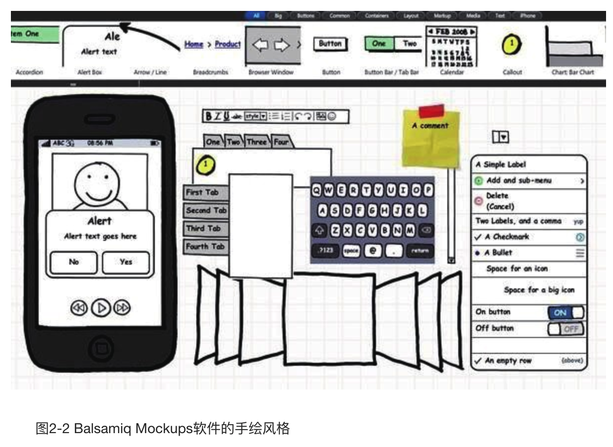
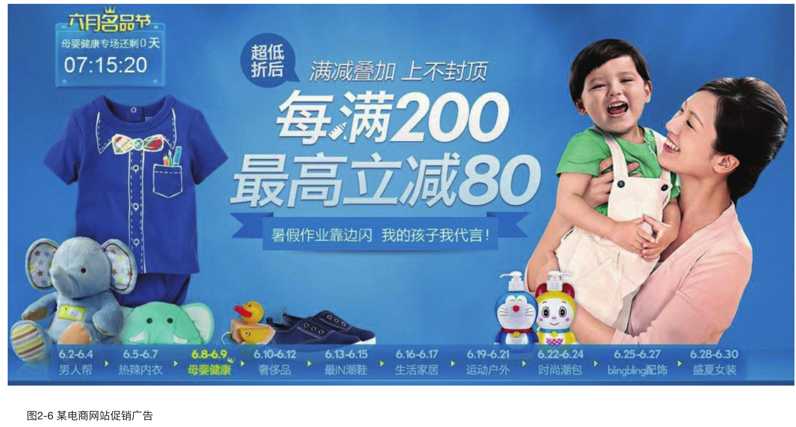

    作者: 刘津 / 李月
    出版社: 人民邮电出版社
    副标题: 用户体验设计师的成长之路
    出版年: 2014-7
    页数: 282
    定价: 69.00
    装帧: 平装
    丛书: 破茧成蝶
    ISBN: 9787115353054

[豆瓣链接](https://book.douban.com/subject/25915629/)

- [第1篇 成为用户体验设计师的信念](#%e7%ac%ac1%e7%af%87-%e6%88%90%e4%b8%ba%e7%94%a8%e6%88%b7%e4%bd%93%e9%aa%8c%e8%ae%be%e8%ae%a1%e5%b8%88%e7%9a%84%e4%bf%a1%e5%bf%b5)
  - [01 什么是用户体验设计](#01-%e4%bb%80%e4%b9%88%e6%98%af%e7%94%a8%e6%88%b7%e4%bd%93%e9%aa%8c%e8%ae%be%e8%ae%a1)
    - [1.1 设计≠艺术](#11-%e8%ae%be%e8%ae%a1%e2%89%a0%e8%89%ba%e6%9c%af)
    - [1.2 邂逅用户体验设计](#12-%e9%82%82%e9%80%85%e7%94%a8%e6%88%b7%e4%bd%93%e9%aa%8c%e8%ae%be%e8%ae%a1)
    - [1.3 用户体验设计的特征](#13-%e7%94%a8%e6%88%b7%e4%bd%93%e9%aa%8c%e8%ae%be%e8%ae%a1%e7%9a%84%e7%89%b9%e5%be%81)
    - [1.4 用户体验设计的精益之道](#14-%e7%94%a8%e6%88%b7%e4%bd%93%e9%aa%8c%e8%ae%be%e8%ae%a1%e7%9a%84%e7%b2%be%e7%9b%8a%e4%b9%8b%e9%81%93)
  - [02 了解用户体验设计师](#02-%e4%ba%86%e8%a7%a3%e7%94%a8%e6%88%b7%e4%bd%93%e9%aa%8c%e8%ae%be%e8%ae%a1%e5%b8%88)
    - [2.1 用户体验相关职位有哪些](#21-%e7%94%a8%e6%88%b7%e4%bd%93%e9%aa%8c%e7%9b%b8%e5%85%b3%e8%81%8c%e4%bd%8d%e6%9c%89%e5%93%aa%e4%ba%9b)
      - [交互设计师](#%e4%ba%a4%e4%ba%92%e8%ae%be%e8%ae%a1%e5%b8%88)
      - [视觉设计师](#%e8%a7%86%e8%a7%89%e8%ae%be%e8%ae%a1%e5%b8%88)
      - [用户研究员](#%e7%94%a8%e6%88%b7%e7%a0%94%e7%a9%b6%e5%91%98)
    - [2.2 用户体验设计师的价值](#22-%e7%94%a8%e6%88%b7%e4%bd%93%e9%aa%8c%e8%ae%be%e8%ae%a1%e5%b8%88%e7%9a%84%e4%bb%b7%e5%80%bc)

## 第1篇 成为用户体验设计师的信念
### 01 什么是用户体验设计
#### 1.1 设计≠艺术
图1-1是艺术大师毕加索的一幅作品。

图1-2是某用户体验设计师的作品，准确地说应该是半成品。内容包含页面草图（线框图）、页面流程、简单的交互说明等。

艺术和设计的区别：艺术是感性的，而设计是相对理性、精密的。艺术所表达的是创作者的个人意识，而设计是为了解决用户具体的问题。

#### 1.2 邂逅用户体验设计
用户体验是什么？用一句话概括就是：你在使用一个产品时的主观感受。用户体验设计又是什么呢？是为了提升用户体验而做的设计了。

#### 1.3 用户体验设计的特征
总结出如下用户体验设计的一些特征。

- 严谨、理性、创意
  - 用户体验设计充满了理性和严谨，因为它首先关注于解决用户的问题，同时也需要优质的创意，帮助用户获得更好的体验。
- 提供特定问题的解决方案
  - 为了避免把设计当做自己无限发挥创意的舞台，以至于出现糟糕的体验。设计师在设计前，请先问问自己，这次设计的目标是什么？要为什么样的人解决什么样的问题？如何解决？
- 不让用户思考
  - 很多设计师喜欢找这样的借口：我这个设计很有创意，用户第一眼看到的时候不会用没关系，他第二次不就会了吗？可惜的是，用户可不会这么想。他第一次遇到挫折的时候，很可能会头也不回地扬长而去……再也没有第二次的机会了。
- 趣味横生
  - 趣味性可以为你的设计加分，让用户产生难以忘怀的奇妙体验。

#### 1.4 用户体验设计的精益之道
- 热爱生活，细心观察，勇于改变
  - 细心观察生活中每一个不如意的地方吧，也许它就是你改变世界的机会。
- 了解人，观察人
  - 做设计是为了解决“人”的问题，是为了让“人”从中获得良好的体验。所以说到底，我们是在做以“人”为中心的设计。那么这就需要了解“人”的想法、行为、习惯等，学会换位思考。
- 理性的思路
  - 遇到问题时，我们该如何思考呢？
- 亲自使用、体验
  - 很多错误的设计之所以频繁出现，就在于设计者自己都很少去使用它，更谈不上发现问题。
- 多听用户的反馈意见
  - 亲自试用并不见得能发现所有问题。毕竟你对这个产品太过熟悉，很多东西已经习以为常，而用户却可能并不了解。
  - 当一个人已经知道某件事时，他就很难想象出自己不知道的话会是一番什么情形。我们可能会嘲笑不会用传真机的博士，却忘记了自己第一次使用时的尴尬场景。
- 留心好的设计，在此基础上优化

### 02 了解用户体验设计师
#### 2.1 用户体验相关职位有哪些
国内的设计团队，一般包含交互设计师、视觉设计师和用户研究员3个职位。

如果把产品比做图2-1左侧的这个服务人员，那么这3个职位的作用正如图中所描述的那样。

##### 交互设计师
最开始我会说：“我是一名交互设计师。”然后发现对面的人一头雾水。看来这种解释很失败！

然后我考虑换个说法：“我是设计互联网产品的。”“哦，那不就是产品经理吗？”我的解释再次失败了！

再后来，我又尝试了一种比较委婉的说法：“我是一名建筑设计师，不过我不设计房子，我设计互联网产品，比如产品的结构、信息层级、使用流程等。”对方听得一知半解，也不知道是懂了还是没懂。

现在我会这样说：“你使用一个网站的时候，有没有出现这种情况，某个功能怎么都找不到，或者点了某个按钮一点反应都没有，再或者填写信息时总是无法成功提交……”对方马上来了兴趣，“有啊有啊，这种情况经常发生啊，尤其是那个该死的xxxx网站……”我马上趁势说：“我们的工作就是改善这种情况，让你使用网站时有一个良好的体验。”对方马上就明白了。

交互设计就是通过分析用户心理模型、设计任务流程、运用交互知识，把业务逻辑（功能规格或内容需求）以用户能理解的方式表达给用户，最终实现产品战略（公司需求和用户需求的最佳平衡点）的过程。

交互设计师的产出物也比较丰富，有竞品分析文档、用户反馈整理、流程图、设计草图、设计原型，等等。其中最常见的是设计原型。设计原型的样式没有固定的标准，手绘、软件绘制都可以，主要是根据各个公司的实际情况而定的，如图2-2、图2-3所示。

图2-3 Axure软件绘制的线框图

##### 视觉设计师
视觉设计师也分为很多种，如平面设计师、原画设计师、推广设计师、界面设计师（UI设计师）等。本文中主要指的是UI设计师。

原画设计师：要求设计者有很强的手绘能力，作品充满艺术表现力。举一个例子，如图2-4所示。

图2-4 原画场景

平面设计师：要求设计者能很好地传达思想，作品有较强的感染力，好的平面作品也不乏艺术感和优秀创意，如图2-5所示。

图2-5 某平面广告

互联网产品的推广运营设计师：要求作品能突出重点、快速抓住眼球，内容越直观越好。因为在互联网上看广告的用户可没什么耐心，他们往往是忙碌且急躁的，没有心情去欣赏什么艺术和创意，如图2-6所示。

界面设计师（UI设计师）：要求设计者既具备一定的交互知识，也具有良好的审美感觉，作品能很好地引导用户操作，同时令用户感受到作品的美感，下次还愿意光顾你的网站，如图2-7所示。

##### 用户研究员
用户研究员，顾名思义，就是专门研究用户的人。用户研究员简称“用研”，数量不多，一般只有大公司或较大的设计团队才有这个职位，对从业人员的专业背景和各项素质要求都较高。他们在产品设计中有着不可忽视的作用，即通过各种分析和研究，深入地了解用户特征、用户行为习惯等，从而为产品、运营、推广、设计决策等提供必要的方向和支持。

用户研究员日常的工作可能有市场分析、竞品分析、创建人物角色、问卷调查、焦点小组、用户访谈、可用性测试，等等。

举几个例子。比如说最近做了一个促销活动，但是效果很不好，就可以找用户研究员做一些简单的调研，来寻找原因。再如，设计师完成设计原型后，用户研究员可以做可用性测试来排查设计问题。还有，产品人员在考虑产品方向和新功能时，也可以找用户研究员调查，看是否符合目标人群需要，等等。

用户研究员的产出物主要是各种类型的用研报告。它更偏向于比较客观和实际的研究结果。具体要怎么解决问题，需要对报告进行深入解读，用户研究员也应通过自己的理解给出一些建议，如图2-9所示。

#### 2.2 用户体验设计师的价值
用户体验设计师具体有什么作用和价值呢？

