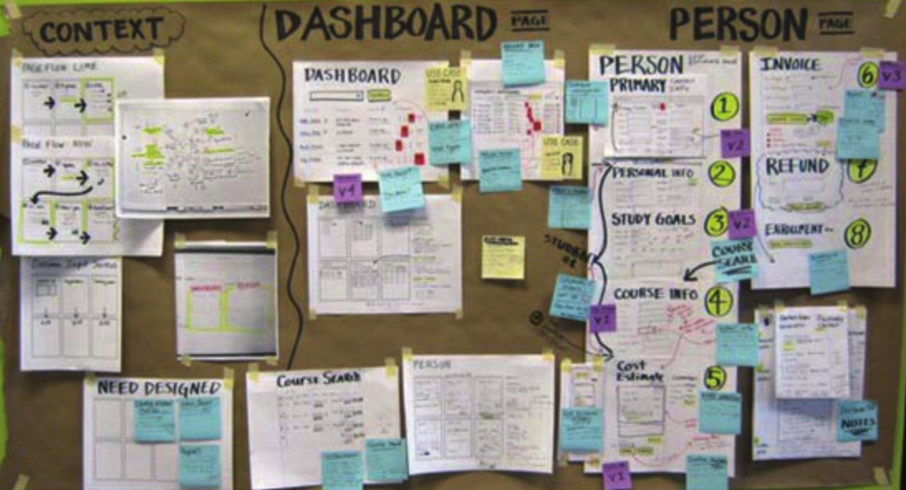
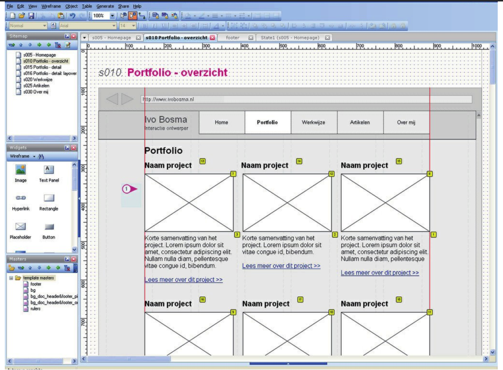
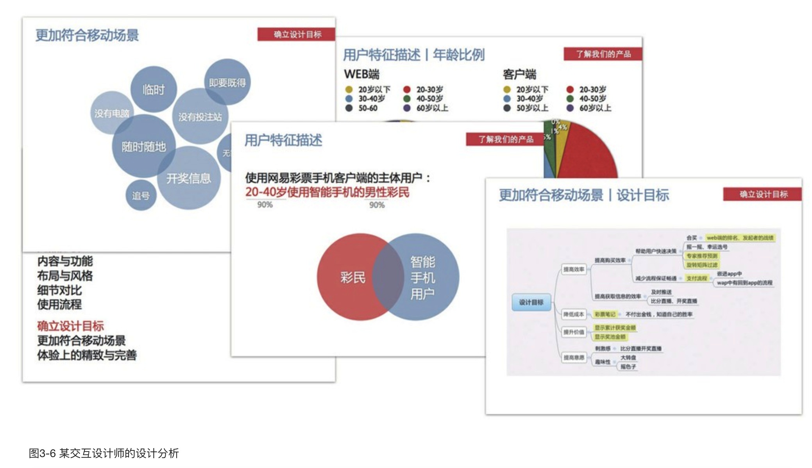
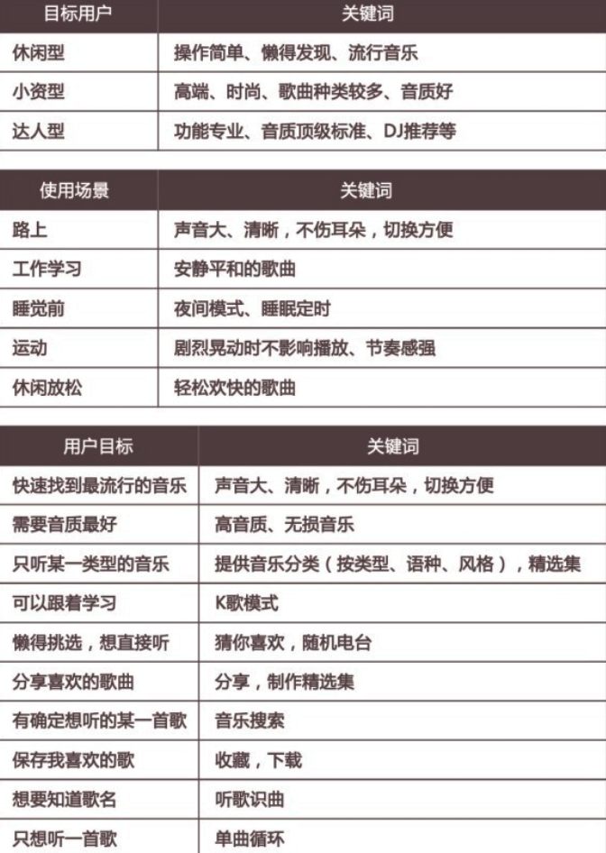
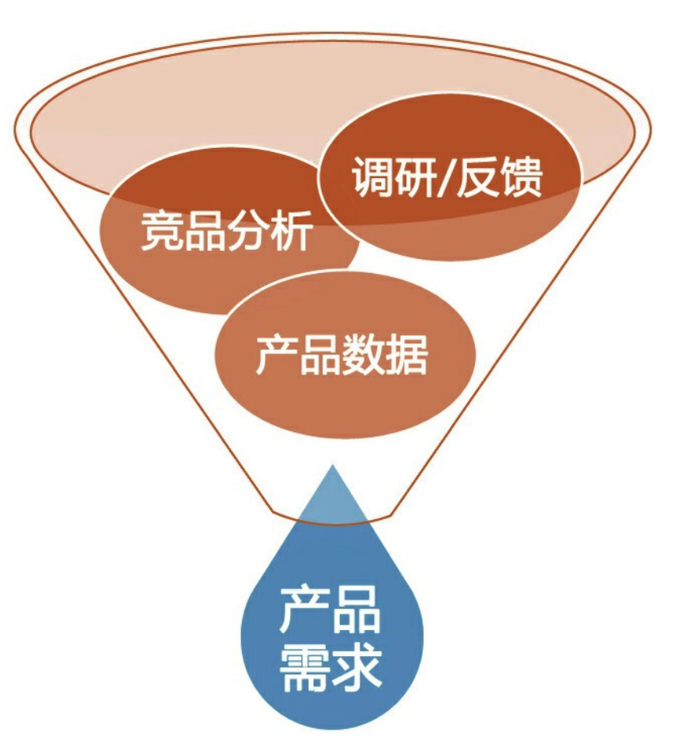
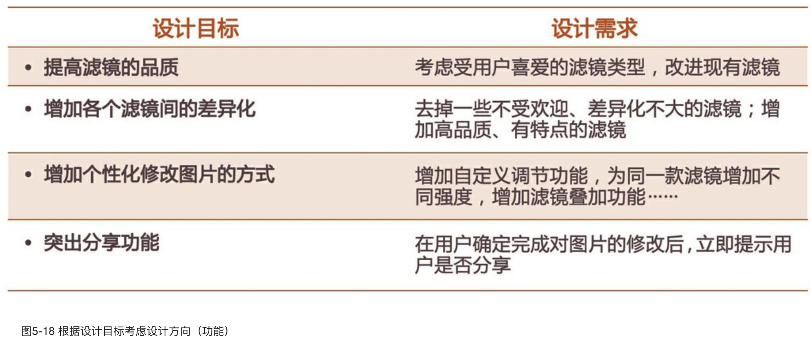
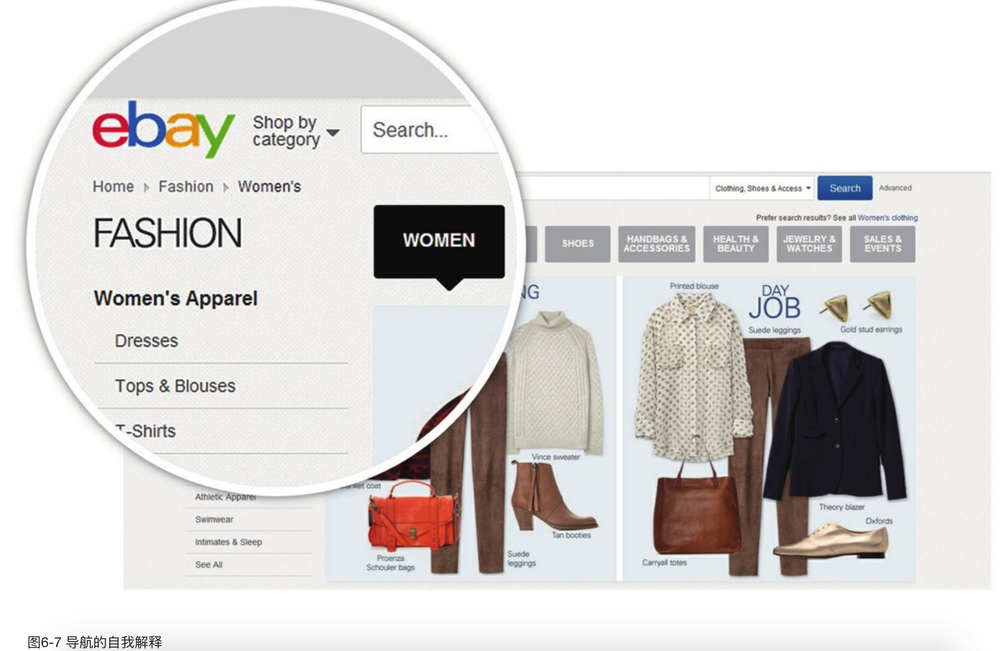
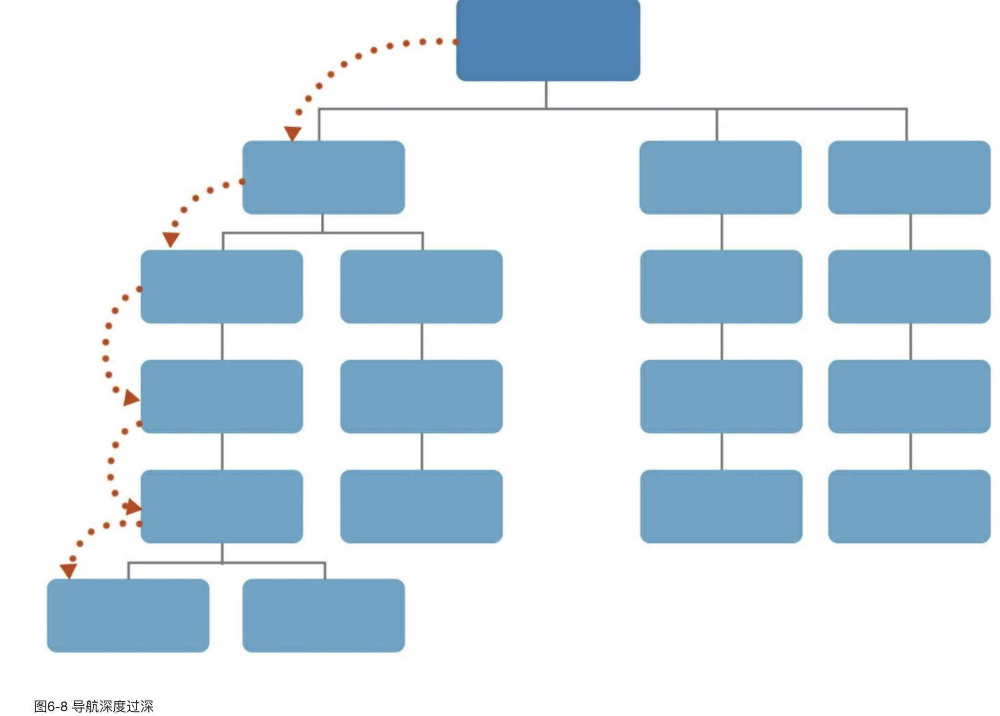
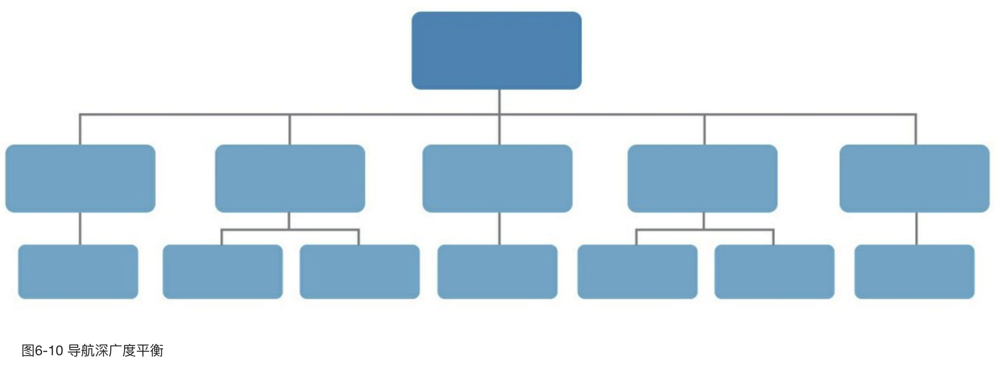
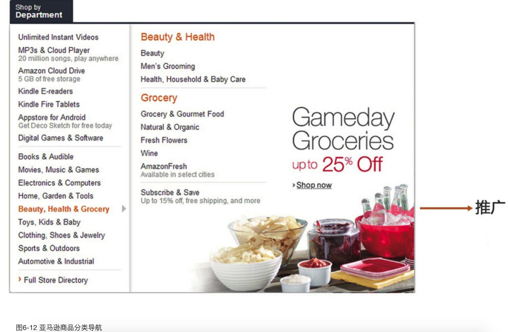

    作者: 刘津 / 李月
    出版社: 人民邮电出版社
    副标题: 用户体验设计师的成长之路
    出版年: 2014-7
    页数: 282
    定价: 69.00
    装帧: 平装
    丛书: 破茧成蝶
    ISBN: 9787115353054

[豆瓣链接](https://book.douban.com/subject/25915629/)

- [第1篇 成为用户体验设计师的信念](#%e7%ac%ac1%e7%af%87-%e6%88%90%e4%b8%ba%e7%94%a8%e6%88%b7%e4%bd%93%e9%aa%8c%e8%ae%be%e8%ae%a1%e5%b8%88%e7%9a%84%e4%bf%a1%e5%bf%b5)
  - [01 什么是用户体验设计](#01-%e4%bb%80%e4%b9%88%e6%98%af%e7%94%a8%e6%88%b7%e4%bd%93%e9%aa%8c%e8%ae%be%e8%ae%a1)
    - [1.1 设计≠艺术](#11-%e8%ae%be%e8%ae%a1%e2%89%a0%e8%89%ba%e6%9c%af)
    - [1.2 邂逅用户体验设计](#12-%e9%82%82%e9%80%85%e7%94%a8%e6%88%b7%e4%bd%93%e9%aa%8c%e8%ae%be%e8%ae%a1)
    - [1.3 用户体验设计的特征](#13-%e7%94%a8%e6%88%b7%e4%bd%93%e9%aa%8c%e8%ae%be%e8%ae%a1%e7%9a%84%e7%89%b9%e5%be%81)
    - [1.4 用户体验设计的精益之道](#14-%e7%94%a8%e6%88%b7%e4%bd%93%e9%aa%8c%e8%ae%be%e8%ae%a1%e7%9a%84%e7%b2%be%e7%9b%8a%e4%b9%8b%e9%81%93)
  - [02 了解用户体验设计师](#02-%e4%ba%86%e8%a7%a3%e7%94%a8%e6%88%b7%e4%bd%93%e9%aa%8c%e8%ae%be%e8%ae%a1%e5%b8%88)
    - [2.1 用户体验相关职位有哪些](#21-%e7%94%a8%e6%88%b7%e4%bd%93%e9%aa%8c%e7%9b%b8%e5%85%b3%e8%81%8c%e4%bd%8d%e6%9c%89%e5%93%aa%e4%ba%9b)
      - [交互设计师](#%e4%ba%a4%e4%ba%92%e8%ae%be%e8%ae%a1%e5%b8%88)
      - [视觉设计师](#%e8%a7%86%e8%a7%89%e8%ae%be%e8%ae%a1%e5%b8%88)
      - [用户研究员](#%e7%94%a8%e6%88%b7%e7%a0%94%e7%a9%b6%e5%91%98)
    - [2.2 用户体验设计师的价值](#22-%e7%94%a8%e6%88%b7%e4%bd%93%e9%aa%8c%e8%ae%be%e8%ae%a1%e5%b8%88%e7%9a%84%e4%bb%b7%e5%80%bc)
      - [用户价值、商业价值](#%e7%94%a8%e6%88%b7%e4%bb%b7%e5%80%bc%e5%95%86%e4%b8%9a%e4%bb%b7%e5%80%bc)
      - [项目价值](#%e9%a1%b9%e7%9b%ae%e4%bb%b7%e5%80%bc)
      - [品牌价值](#%e5%93%81%e7%89%8c%e4%bb%b7%e5%80%bc)
  - [03 设计师的职业困惑](#03-%e8%ae%be%e8%ae%a1%e5%b8%88%e7%9a%84%e8%81%8c%e4%b8%9a%e5%9b%b0%e6%83%91)
    - [3.1 我适合干这行吗](#31-%e6%88%91%e9%80%82%e5%90%88%e5%b9%b2%e8%bf%99%e8%a1%8c%e5%90%97)
    - [3.2 菜鸟怎样入门](#32-%e8%8f%9c%e9%b8%9f%e6%80%8e%e6%a0%b7%e5%85%a5%e9%97%a8)
    - [3.3 去大公司、小公司，还是设计公司](#33-%e5%8e%bb%e5%a4%a7%e5%85%ac%e5%8f%b8%e5%b0%8f%e5%85%ac%e5%8f%b8%e8%bf%98%e6%98%af%e8%ae%be%e8%ae%a1%e5%85%ac%e5%8f%b8)
    - [3.4 什么样的应聘者更容易成功](#34-%e4%bb%80%e4%b9%88%e6%a0%b7%e7%9a%84%e5%ba%94%e8%81%98%e8%80%85%e6%9b%b4%e5%ae%b9%e6%98%93%e6%88%90%e5%8a%9f)
      - [侧重考查设计师什么方面](#%e4%be%a7%e9%87%8d%e8%80%83%e6%9f%a5%e8%ae%be%e8%ae%a1%e5%b8%88%e4%bb%80%e4%b9%88%e6%96%b9%e9%9d%a2)
- [第2篇 修炼用户体验设计师的技能](#%e7%ac%ac2%e7%af%87-%e4%bf%ae%e7%82%bc%e7%94%a8%e6%88%b7%e4%bd%93%e9%aa%8c%e8%ae%be%e8%ae%a1%e5%b8%88%e7%9a%84%e6%8a%80%e8%83%bd)
  - [04 设计流程——设计师具体做什么](#04-%e8%ae%be%e8%ae%a1%e6%b5%81%e7%a8%8b%e8%ae%be%e8%ae%a1%e5%b8%88%e5%85%b7%e4%bd%93%e5%81%9a%e4%bb%80%e4%b9%88)
    - [4.1 设计师如何参与一个具体的项目](#41-%e8%ae%be%e8%ae%a1%e5%b8%88%e5%a6%82%e4%bd%95%e5%8f%82%e4%b8%8e%e4%b8%80%e4%b8%aa%e5%85%b7%e4%bd%93%e7%9a%84%e9%a1%b9%e7%9b%ae)
    - [4.2 在项目中设计师容易遇到的问题](#42-%e5%9c%a8%e9%a1%b9%e7%9b%ae%e4%b8%ad%e8%ae%be%e8%ae%a1%e5%b8%88%e5%ae%b9%e6%98%93%e9%81%87%e5%88%b0%e7%9a%84%e9%97%ae%e9%a2%98)
  - [05 需求分析——拿回产品的主导权](#05-%e9%9c%80%e6%b1%82%e5%88%86%e6%9e%90%e6%8b%bf%e5%9b%9e%e4%ba%a7%e5%93%81%e7%9a%84%e4%b8%bb%e5%af%bc%e6%9d%83)
    - [5.1 和产品经理一起做需求分析](#51-%e5%92%8c%e4%ba%a7%e5%93%81%e7%bb%8f%e7%90%86%e4%b8%80%e8%b5%b7%e5%81%9a%e9%9c%80%e6%b1%82%e5%88%86%e6%9e%90)
      - [5.1.1 不可忽视的产品定位](#511-%e4%b8%8d%e5%8f%af%e5%bf%bd%e8%a7%86%e7%9a%84%e4%ba%a7%e5%93%81%e5%ae%9a%e4%bd%8d)
        - [什么是产品定位？](#%e4%bb%80%e4%b9%88%e6%98%af%e4%ba%a7%e5%93%81%e5%ae%9a%e4%bd%8d)
        - [产品定位的内容](#%e4%ba%a7%e5%93%81%e5%ae%9a%e4%bd%8d%e7%9a%84%e5%86%85%e5%ae%b9)
        - [产品定义](#%e4%ba%a7%e5%93%81%e5%ae%9a%e4%b9%89)
        - [用户需求](#%e7%94%a8%e6%88%b7%e9%9c%80%e6%b1%82)
        - [选择目标用户](#%e9%80%89%e6%8b%a9%e7%9b%ae%e6%a0%87%e7%94%a8%e6%88%b7)
        - [确定产品定位并据此筛选需求](#%e7%a1%ae%e5%ae%9a%e4%ba%a7%e5%93%81%e5%ae%9a%e4%bd%8d%e5%b9%b6%e6%8d%ae%e6%ad%a4%e7%ad%9b%e9%80%89%e9%9c%80%e6%b1%82)
      - [5.1.2 需求从哪儿来](#512-%e9%9c%80%e6%b1%82%e4%bb%8e%e5%93%aa%e5%84%bf%e6%9d%a5)
      - [5.1.3 如何分析与筛选需求](#513-%e5%a6%82%e4%bd%95%e5%88%86%e6%9e%90%e4%b8%8e%e7%ad%9b%e9%80%89%e9%9c%80%e6%b1%82)
        - [如何分析与筛选需求](#%e5%a6%82%e4%bd%95%e5%88%86%e6%9e%90%e4%b8%8e%e7%ad%9b%e9%80%89%e9%9c%80%e6%b1%82)
        - [需求的产生](#%e9%9c%80%e6%b1%82%e7%9a%84%e4%ba%a7%e7%94%9f)
      - [5.1.4 了解需求文档](#514-%e4%ba%86%e8%a7%a3%e9%9c%80%e6%b1%82%e6%96%87%e6%a1%a3)
        - [需求文档应该包含什么内容？](#%e9%9c%80%e6%b1%82%e6%96%87%e6%a1%a3%e5%ba%94%e8%af%a5%e5%8c%85%e5%90%ab%e4%bb%80%e4%b9%88%e5%86%85%e5%ae%b9)
        - [需求文档的后续迭代](#%e9%9c%80%e6%b1%82%e6%96%87%e6%a1%a3%e7%9a%84%e5%90%8e%e7%bb%ad%e8%bf%ad%e4%bb%a3)
    - [5.2 倾听用户的声音](#52-%e5%80%be%e5%90%ac%e7%94%a8%e6%88%b7%e7%9a%84%e5%a3%b0%e9%9f%b3)
      - [5.2.1 拥抱用户](#521-%e6%8b%a5%e6%8a%b1%e7%94%a8%e6%88%b7)
      - [5.2.2 别被用户牵着走](#522-%e5%88%ab%e8%a2%ab%e7%94%a8%e6%88%b7%e7%89%b5%e7%9d%80%e8%b5%b0)
      - [5.2.3 如何对待用户的意见](#523-%e5%a6%82%e4%bd%95%e5%af%b9%e5%be%85%e7%94%a8%e6%88%b7%e7%9a%84%e6%84%8f%e8%a7%81)
    - [5.3 设计师的逆袭](#53-%e8%ae%be%e8%ae%a1%e5%b8%88%e7%9a%84%e9%80%86%e8%a2%ad)
      - [5.3.3 从“功能需求”到“设计需求”](#533-%e4%bb%8e%e5%8a%9f%e8%83%bd%e9%9c%80%e6%b1%82%e5%88%b0%e8%ae%be%e8%ae%a1%e9%9c%80%e6%b1%82)
        - [如何寻找设计目标](#%e5%a6%82%e4%bd%95%e5%af%bb%e6%89%be%e8%ae%be%e8%ae%a1%e7%9b%ae%e6%a0%87)
        - [根据设计目标重新定义需求](#%e6%a0%b9%e6%8d%ae%e8%ae%be%e8%ae%a1%e7%9b%ae%e6%a0%87%e9%87%8d%e6%96%b0%e5%ae%9a%e4%b9%89%e9%9c%80%e6%b1%82)
  - [06 设计规划——从需求到设计草图](#06-%e8%ae%be%e8%ae%a1%e8%a7%84%e5%88%92%e4%bb%8e%e9%9c%80%e6%b1%82%e5%88%b0%e8%ae%be%e8%ae%a1%e8%8d%89%e5%9b%be)
    - [6.1 从需求到界面，隔着一扇门](#61-%e4%bb%8e%e9%9c%80%e6%b1%82%e5%88%b0%e7%95%8c%e9%9d%a2%e9%9a%94%e7%9d%80%e4%b8%80%e6%89%87%e9%97%a8)
      - [6.1.1 如何搞定信息分类](#611-%e5%a6%82%e4%bd%95%e6%90%9e%e5%ae%9a%e4%bf%a1%e6%81%af%e5%88%86%e7%b1%bb)
        - [逻辑归类](#%e9%80%bb%e8%be%91%e5%bd%92%e7%b1%bb)
        - [卡片分类](#%e5%8d%a1%e7%89%87%e5%88%86%e7%b1%bb)
      - [6.1.2 好的导航是成功的一半](#612-%e5%a5%bd%e7%9a%84%e5%af%bc%e8%88%aa%e6%98%af%e6%88%90%e5%8a%9f%e7%9a%84%e4%b8%80%e5%8d%8a)
        - [导航的自我解释](#%e5%af%bc%e8%88%aa%e7%9a%84%e8%87%aa%e6%88%91%e8%a7%a3%e9%87%8a)
        - [深广度平衡](#%e6%b7%b1%e5%b9%bf%e5%ba%a6%e5%b9%b3%e8%a1%a1)
        - [用户所需信息与商业推广信息的平衡](#%e7%94%a8%e6%88%b7%e6%89%80%e9%9c%80%e4%bf%a1%e6%81%af%e4%b8%8e%e5%95%86%e4%b8%9a%e6%8e%a8%e5%b9%bf%e4%bf%a1%e6%81%af%e7%9a%84%e5%b9%b3%e8%a1%a1)
        - [为重要功能和常用功能设置快捷入口](#%e4%b8%ba%e9%87%8d%e8%a6%81%e5%8a%9f%e8%83%bd%e5%92%8c%e5%b8%b8%e7%94%a8%e5%8a%9f%e8%83%bd%e8%ae%be%e7%bd%ae%e5%bf%ab%e6%8d%b7%e5%85%a5%e5%8f%a3)
      - [6.1.3 主要任务与次要任务](#613-%e4%b8%bb%e8%a6%81%e4%bb%bb%e5%8a%a1%e4%b8%8e%e6%ac%a1%e8%a6%81%e4%bb%bb%e5%8a%a1)

# 第1篇 成为用户体验设计师的信念
## 01 什么是用户体验设计
### 1.1 设计≠艺术
图1-1是艺术大师毕加索的一幅作品。

图1-2是某用户体验设计师的作品，准确地说应该是半成品。内容包含页面草图（线框图）、页面流程、简单的交互说明等。

艺术和设计的区别：艺术是感性的，而设计是相对理性、精密的。艺术所表达的是创作者的个人意识，而设计是为了解决用户具体的问题。

### 1.2 邂逅用户体验设计
用户体验是什么？用一句话概括就是：你在使用一个产品时的主观感受。用户体验设计又是什么呢？是为了提升用户体验而做的设计了。

### 1.3 用户体验设计的特征
总结出如下用户体验设计的一些特征。

- 严谨、理性、创意
  - 用户体验设计充满了理性和严谨，因为它首先关注于解决用户的问题，同时也需要优质的创意，帮助用户获得更好的体验。
- 提供特定问题的解决方案
  - 为了避免把设计当做自己无限发挥创意的舞台，以至于出现糟糕的体验。设计师在设计前，请先问问自己，这次设计的目标是什么？要为什么样的人解决什么样的问题？如何解决？
- 不让用户思考
  - 很多设计师喜欢找这样的借口：我这个设计很有创意，用户第一眼看到的时候不会用没关系，他第二次不就会了吗？可惜的是，用户可不会这么想。他第一次遇到挫折的时候，很可能会头也不回地扬长而去……再也没有第二次的机会了。
- 趣味横生
  - 趣味性可以为你的设计加分，让用户产生难以忘怀的奇妙体验。

### 1.4 用户体验设计的精益之道
- 热爱生活，细心观察，勇于改变
  - 细心观察生活中每一个不如意的地方吧，也许它就是你改变世界的机会。
- 了解人，观察人
  - 做设计是为了解决“人”的问题，是为了让“人”从中获得良好的体验。所以说到底，我们是在做以“人”为中心的设计。那么这就需要了解“人”的想法、行为、习惯等，学会换位思考。
- 理性的思路
  - 遇到问题时，我们该如何思考呢？
- 亲自使用、体验
  - 很多错误的设计之所以频繁出现，就在于设计者自己都很少去使用它，更谈不上发现问题。
- 多听用户的反馈意见
  - 亲自试用并不见得能发现所有问题。毕竟你对这个产品太过熟悉，很多东西已经习以为常，而用户却可能并不了解。
  - 当一个人已经知道某件事时，他就很难想象出自己不知道的话会是一番什么情形。我们可能会嘲笑不会用传真机的博士，却忘记了自己第一次使用时的尴尬场景。
- 留心好的设计，在此基础上优化

## 02 了解用户体验设计师
### 2.1 用户体验相关职位有哪些
国内的设计团队，一般包含`交互设计师`、`视觉设计师`和`用户研究员`3个职位。

如果把产品比做图2-1左侧的这个服务人员，那么这3个职位的作用正如图中所描述的那样。

#### 交互设计师
最开始我会说：“我是一名交互设计师。”然后发现对面的人一头雾水。看来这种解释很失败！

然后我考虑换个说法：“我是设计互联网产品的。”“哦，那不就是产品经理吗？”我的解释再次失败了！

再后来，我又尝试了一种比较委婉的说法：“我是一名建筑设计师，不过我不设计房子，我设计互联网产品，比如产品的结构、信息层级、使用流程等。”对方听得一知半解，也不知道是懂了还是没懂。

现在我会这样说：“你使用一个网站的时候，有没有出现这种情况，某个功能怎么都找不到，或者点了某个按钮一点反应都没有，再或者填写信息时总是无法成功提交……”对方马上来了兴趣，“有啊有啊，这种情况经常发生啊，尤其是那个该死的xxxx网站……”我马上趁势说：“我们的工作就是改善这种情况，让你使用网站时有一个良好的体验。”对方马上就明白了。

`交互设计`就是通过分析用户心理模型、设计任务流程、运用交互知识，把业务逻辑（功能规格或内容需求）以用户能理解的方式表达给用户，最终实现产品战略（公司需求和用户需求的最佳平衡点）的过程。

交互设计师的产出物也比较丰富，有竞品分析文档、用户反馈整理、流程图、设计草图、设计原型，等等。其中最常见的是`设计原型`。设计原型的样式没有固定的标准，手绘、软件绘制都可以，主要是根据各个公司的实际情况而定的，如图2-2、图2-3所示。

图2-3 Axure软件绘制的`线框图`

#### 视觉设计师
视觉设计师也分为很多种，如平面设计师、原画设计师、推广设计师、界面设计师（UI设计师）等。本文中主要指的是UI设计师。

`原画设计师`：要求设计者有很强的手绘能力，作品充满艺术表现力。举一个例子，如图2-4所示。

图2-4 原画场景

`平面设计师`：要求设计者能很好地传达思想，作品有较强的感染力，好的平面作品也不乏艺术感和优秀创意，如图2-5所示。

图2-5 某平面广告

`互联网产品的推广运营设计师`：要求作品能突出重点、快速抓住眼球，内容越直观越好。因为在互联网上看广告的用户可没什么耐心，他们往往是忙碌且急躁的，没有心情去欣赏什么艺术和创意，如图2-6所示。

`界面设计师（UI设计师）`：要求设计者既具备一定的交互知识，也具有良好的审美感觉，作品能很好地引导用户操作，同时令用户感受到作品的美感，下次还愿意光顾你的网站，如图2-7所示。

#### 用户研究员
用户研究员，顾名思义，就是专门研究用户的人。用户研究员简称“用研”，数量不多，一般只有大公司或较大的设计团队才有这个职位，对从业人员的专业背景和各项素质要求都较高。他们在产品设计中有着不可忽视的作用，即通过各种分析和研究，深入地了解用户特征、用户行为习惯等，从而为产品、运营、推广、设计决策等提供必要的方向和支持。

用户研究员日常的工作可能有市场分析、竞品分析、创建人物角色、问卷调查、焦点小组、用户访谈、可用性测试，等等。

举几个例子。比如说最近做了一个促销活动，但是效果很不好，就可以找用户研究员做一些简单的调研，来寻找原因。再如，设计师完成设计原型后，用户研究员可以做可用性测试来排查设计问题。还有，产品人员在考虑产品方向和新功能时，也可以找用户研究员调查，看是否符合目标人群需要，等等。

用户研究员的产出物主要是各种类型的用研报告。它更偏向于比较客观和实际的研究结果。具体要怎么解决问题，需要对报告进行深入解读，用户研究员也应通过自己的理解给出一些建议，如图2-9所示。

### 2.2 用户体验设计师的价值
用户体验设计师具体有什么作用和价值呢？

#### 用户价值、商业价值
对于一个百万级用户的产品，如果用户通过优秀的设计能够更快速地完成目标和任务，那么这个产品为用户、为社会创造的价值有多大？如果通过优秀的设计能让每一个用户感到惊喜和快乐，那么这个产品又为社会创造了多大的价值和财富呢？

#### 项目价值
设计师的创意和想法离不开团队成员的支持，否则再好的想法也难以实施。好的用户体验设计师在项目中具备足够的影响力，能够充分组织、调动、协助好其他角色。他的存在既保证了良好的产品体验，又能使得项目顺利、有序地进行下去，对提升项目质量和效率都起到了极大的作用。

- 通过专业能力节省其他环节的时间。
  - 优秀的交互设计师可以快速判断出设计方案的优劣，更可以凭借经验和专业能力更快速地得出可靠的设计方案。一个好的设计师，能够节省产品人员挠头画原型的时间；能够减少产品人员因不断碰壁而不得不反复改原型的时间；避免了整个项目因为一些明显的错误而导致的不必要的迭代；节省了用户研究员做可用性测试的次数（好的交互设计师凭借经验即可发现大部分问题所在，节约可用性测试的时间和成本）；节省了视觉设计师理解、修复不专业的原型稿的时间；节省了前端揣测不完整的原型说明的时间；减少了开发因为需求或交互反复变动的抱怨……
- 跟进各个环节，保证产出物质量。
  - 产品经理虽然也要负责跟进，但是各种功能、开发问题就已经很让人头大了，如果再负责跟进设计细节，那简直要崩溃了。没关系，交互设计师是你坚强的后盾，他会跟进视觉、前端（当然视觉设计师的跟进也很重要）、开发，保证最后上线的结果和设计稿一致，给产品更好的体验。
- 促进统一化及标准化，提升设计效率。
  - 经过多年的积累和发展，设计行业中已形成了一些较通用的原则和方法。另外，设计师经过一段时间的积累，也会逐渐沉淀出适合项目需要的设计规范或模板。这样既保证了设计质量，又提升了设计效率。由产品人员设计界面，短期来看确实很快捷，但由于没有统一的设计标准，每个人的思考方式又很不一样，不利于项目的长期发展。如果再遇到人员调整，就会出现很多问题。
- 促使项目流程更合理，更有规划。
  - 在一个大型团队中，如果没有交互设计师，或没有懂交互知识的人员，项目流程极容易变得混乱。我们常见到如下情况：需求根本没想清楚；原型粗糙，后续工作难以进行；后续发现问题导致交互更改，大家一起返工；原型说明不全，后面每个环节都按照自己的想法添砖加瓦，导致产品离最初目标越来越远……
  - 而交互设计师的出现在一定程度上可以很好地改善这种局面。一方面，交互设计本身有一定的流程和方法，可以尽量避免大家拍脑子想问题；另外，标准的原型、详尽细致的交互说明减少了团队成员的理解和沟通成本，流程自然更井然有序，返工现象也会大大减少。
- 协助产品经理组织各个环节，是整个项目的有力推动者。
  - 交互设计师分析、重塑需求；与用研配合，了解用户特征与行为；设计结构、流程、界面、动态效果；跟进视觉、前端、开发；及时整理线上问题，准备下次迭代……这个过程几乎贯穿了产品周期的始末，并且交互设计师需要与各个环节打交道，沟通协调，PK想法。所以好的交互设计师相当于一个好管家，协助产品经理组织好各个环节，是整个项目有力的推动者。

#### 品牌价值
设计师其实还有一个非常重要的作用，那就是维护和突出公司的整体品牌形象。统一的设计理念及风格可以更好地增强公司品牌识别度，起到非常好的宣传作用，如图2-12所示。

## 03 设计师的职业困惑
### 3.1 我适合干这行吗
至于适合不适合干这行，我觉得最关键的问题在于是否有兴趣及天分。你可以问问自己下面这些问题。

- 你是否热衷于各种好玩又新奇的产品呢？
- 你平时是否喜欢使用各种各样的产品并研究它是否好用呢？
- 你是否更容易发现使用中的各种问题，并积极想办法解决它呢？
- 你是否充满各种灵感和创意？
- 你是否喜欢思考问题，清晰地罗列各种解决方案并寻找其中的逻辑关系，并且乐此不疲呢？
- 在绘制草图的时候，你是否有一种莫名的兴奋感呢？
- 你喜欢跟人沟通和交流、展示你的想法和创意吗？
- 一般来说，你的想法容易得到别人的认可吗？
- 你会精益求精，总是要求自己超出预期吗？

### 3.2 菜鸟怎样入门
笔试题目很简单：“你认为你的手机有哪个地方设计的不好吗？请提出改善建议”。面试官给每个人发了2张白纸。

不会画线框图的我决定用自己的方式来回答这个问题。我认为设计一定是有理有据的，而不完全是在于表现形式。所以我先陈述了一下手机的一些基本使用情况，比如我认为大部分人都只会用到3个功能——打电话、发短信、闹钟（那是大约2009年的时候）。所以要解决设计问题，应该先重点去排查这3个功能的问题。最后我选择了“发短信”这个功能。我将自己置身于一个真实的使用场景，描述自己完成某一个具体的任务（当然这个任务必须得是合理的、经常发生的）时，会发生的一些情况，而目前的设计如何干扰了我完成这个任务，我觉得应该怎样改善更合理之类的……最后洋洋洒洒地写了两大篇纸。看着自己歪七扭八的一手烂字，再看看旁边3位精美的线框图，当时真是欲哭无泪……

后来我问其中一个面试官，为什么我可以得到这个机会。她说：“我们其实不是很注重表现形式，我们注重的是思维。我觉得你的思维很好。有的人可能确实有经验，但光会画图，缺乏必要的思考也是不行的”。

后来，在实习过程中，我很快就学会了画纸面原型，如图3-1所示。但我们大部分时间的工作依然是思考、分析和整理各种文档等基础工作，画图的时间并不是很多。

图3-1 纸面原型示例

### 3.3 去大公司、小公司，还是设计公司
图3-3所示的是部分知名的用户体验设计公司或大公司中知名的设计团队，可供大家参考。更多内容可查看http：//uedfans.cn/等网站。

### 3.4 什么样的应聘者更容易成功
总体来说，可以把没通过的应聘者归纳成如图3-4所示的3种典型类型。

图3-4 失败应聘者典型的三种类型

#### 侧重考查设计师什么方面
- 对用户体验具备浓厚的兴趣。
  - 要想成为一名优秀的用户体验设计师，首先要对这方面有兴趣，有激情。
- 具备良好的素养。
  - 一个不学无术、不懂礼貌、不尊重他人、反应迟钝、缺乏爱心的人是绝对做不好用户体验的。因为做用户体验设计，就是要把冰冷的界面（互联网产品或软件）塑造成一个可以和用户交流的“人”，这个“人”彬彬有礼、善于沟通、聪明伶俐，想用户之所想，急用户之所急，和他互动过的用户都会产生良好的体验。
- 具备强大的思维能力。
  - 就拿交互设计师来说，他需要把抽象的概念转化为具体的页面。
  - 设计师必须有能力去解决一些更深层次的、抽象的问题。这其实涉及一个思考习惯，就是从整体到局部，再到细节，最后回归整体的思考过程。
- 掌握专业的技能。
  - 如果前三者你全都具备了，那么成为一个优秀的设计师只是时间的问题。
  - 某交互设计师的设计分析，如图3-6所示。某交互设计师的原型截图，如图3-7所示。

# 第2篇 修炼用户体验设计师的技能
## 04 设计流程——设计师具体做什么
### 4.1 设计师如何参与一个具体的项目

图4-1 设计师如何参与一个具体的项目

### 4.2 在项目中设计师容易遇到的问题
上述流程虽看起来很合理，但在执行过程中可能困难重重。我们也许会面临如下的挑战。

- 时间紧张，留给设计师的时间太少。
- 一个设计师负责多个项目，没办法一一跟进到底。
- 和项目成员座位距离太远，沟通不便。
- 产品经理不能够清晰阐述需求。
- 设计师专业能力有限。
- 开发人员能力有限，不按照设计稿做，偷工减料。
- 上层领导干预过多。

概括起来无非在于3方面：

- 团队成员的专业能力
- 外界因素的影响
- 团队凝聚力

遵守设计流程有这么重要吗？如果不遵守的话会出现什么后果呢？它们一般会导致如下问题。

- 由于需求不清晰或来回反复导致效率大大降低。
- 方向不明确导致设计方案被反复推翻，设计效果欠佳。
- 原型粗糙、缺乏规范，开发人员理解设计方案的成本增加。
- 上线效果与设计方案相差甚远，人力遭到浪费。
- 上线后不清楚具体效果，为下一次优化更新造成了障碍。

## 05 需求分析——拿回产品的主导权
### 5.1 和产品经理一起做需求分析
在实际工作中，需要从商业、用户、技术三个角度来平衡考虑需求。缺少了任何一个角度都是十分危险的，项目都有可能以失败告终，如图5-1所示。

图5-1 需求考虑的角度

产品经理应该在初始阶段和设计师一起合作，通过融合各自的专业方法，共同完成需求分析。

#### 5.1.1 不可忽视的产品定位
##### 什么是产品定位？
产品定位是产品设计的方向，也是需求文档和设计产出的判断标准。此外，产品定位也使团队成员形成统一的目标和对产品的认识，使团队更有凝聚力，使得沟通效率、工作效率得到了大大提升。因此在确定具体需求之前，一定要首先考虑产品定位是什么。

##### 产品定位的内容
产品定位实际上就是关于产品的目标、范围、特征等约束条件，它包括两方面的内容：产品定义和用户需求。产品定义主要由产品经理从网站角度考虑，用户需求主要由设计师从用户角度考虑。最终的产品定位应该是综合考虑两者关系的结果。需求定义的内容如图5-2所示。

##### 产品定义
产品定义就是用一句话概括某个产品，比如一款专为摄影初学者使用的简单易用的修图软件。这里使用人群是“摄影初学者”，主要功能是“修图”，产品特色是“简单易用”。

##### 用户需求
用户需求主要包括目标用户、使用场景和用户目标。一条用户需求可看作是“目标用户”在“合理场景”下的“用户目标”，其实就是解决“谁”在“什么环境下”想要“解决什么问题”。用户需求其实就是一个个生动的故事，告诉我们用户的真实境况。我们需要了解这些故事，帮助用户解决问题，并在这个过程中让他们感到愉快。

整理出的用户需求范围如下。

- 目标用户：休闲型/小资型/达人型
- 使用场景：上班路上/工作时/睡觉前……
- 用户目标：快速找到最流行的音乐/需要音质最好/只听某一个类型的音乐……

根据上述内容，我们进一步发散，考虑如何更好地解决用户的问题。考虑的内容包含功能、内容、特色等。

用户需求示意描述如图5-3所示。

图5-3 用户需求示意

##### 选择目标用户
前面我们已经列出了长长的清单，里面有不同的用户类型、使用场景和用户目标，这是一个“放”的过程。接下来我们应该从想象回到现实了，从中筛选出我们需要的内容，这是一个“收”的过程。

在目标用户、使用场景、用户目标3个因素中，目标用户是最关键的。一方面，明确目标人群可以使你更专注于服务某一类特定人群，这样更容易提升这类人群的满意度，你的产品也更容易获得成功；另一方面，目标用户的特征对使用场景和用户目标有较大的影响。因此目标用户的选择是非常关键的。

该选择哪种类型作为产品的目标用户，需要综合权衡用户对公司的价值以及潜在需求量。别忘了，平衡商业价值和用户需求本来就是设计师需要特别关注到的。在一个坐标平面上对潜在用户进行分布罗列，坐标平面的2个坐标轴分别是潜在用户量和商业价值（包含对推广、营销成本的考虑），如图5-4所示。

图5-4 通过权衡用户规模和商业价值选择目标人群

综合考虑，我们最终选择了25-35岁的小资型白领作为最主要的目标用户。这部分人群和公司已有用户类型比较吻合、对公司的商业价值更高、推广成本更低（根据每个公司的自身情况考虑），对听音乐有较大的需求，粘度较高，用户需求较明确；休闲型用户需求度较低，粘度也不是很高，是作为次要考虑的目标用户；达人型用户数目最少（专业型的用户一般来说数目都是最少的），且要求较高，比较难以满足，因此是最不重要的用户类型。

##### 确定产品定位并据此筛选需求
- 目标用户：25～35岁，追求潮流、高端音乐品质的白领
- 主要功能：听音乐
- 产品特色：音质佳、更新速度快
- 使用场景：上班路上/工作学习/睡觉前/运动/休闲放松
- 用户目标：需要音质最好/只听某一个类型的音乐/分享喜欢的歌曲/保存喜欢的歌/想知道某首歌曲的歌名……
- 关键词：高端、时尚、歌曲种类较多、切换方便、夜间模式、睡眠定时、防震、高音质、无损音乐/提供音乐分类、精选集/分享、制作精选集/收藏、下载/听歌识曲……

使用场景、用户目标、关键词的结果依赖于不同的思考、调研方法。例如，这里使用的是头脑风暴的方式，如果使用其他的方式可能会得到其他的结果。它们虽不属于产品定位中最核心的部分，但同样对后续的需求文档撰写、设计方向定位起到非常关键的作用。从关键词中，我们已经可以看到产品需求的雏形了。

在整个过程中我们可以看到，产品经理的决策是至关重要的。为了和设计师一起确定产品定位，产品经理需要事先做更多的准备工作，包括：了解市场调研结果，了解市场上同类产品的情况，了解潜在用户的基本情况，了解自身优势与劣势……如果缺乏了这些必要步骤，设计师再怎么努力也无济于事。

#### 5.1.2 需求从哪儿来
在实际项目中，采集需求的主要方式有用户调研、竞品分析、用户反馈（上线后）、产品数据（上线后）等，如图5-5所示。

图5-5 产品需求的来源

还可以试试百度指数、淘宝指数等工具，它们可以告诉你目前的搜索热词、搜索词对应的用户特征、各项数据指标等，非常实用，如图5-6所示。

#### 5.1.3 如何分析与筛选需求
##### 如何分析与筛选需求

图5-7 如何把用户需求转化为产品需求

##### 需求的产生

图5-8 从产品定位到需求优先级

#### 5.1.4 了解需求文档
##### 需求文档应该包含什么内容？
在常规情况下，需求文档应该包含前面提到的产品定位、需求内容、需求优先级等，以及关于需求的详细描述说明。

- 文档修改与审核记录：需求文档如有修改，需要简要记录，如图5-9所示。
- 目录：如内容过多最好提供目录。
- 背景描述：为什么要做这个产品/模块、市场行情、业务目标、产品定位等。
- 用户类型和特征：简单的描述目标用户情况或现有使用人群的情况。
- 项目时间安排：何时启动，何时完成等。
- 信息结构：这里可简单理解为内容或页面的层级，如图5-10所示。可以由设计师和产品经理配合完成，也可由产品经理独立完成，设计师做参考用。
- 整体业务流程说明：对于涉及操作较多的产品/功能，需要业务流程图，帮助设计师和项目成员理解具体的业务逻辑。比如一个广告投放系统，当广告排期被占用时，用户是否可接受相关位置；如不接受，系统如何处理账户金额，等等，如图5-11所示。
- 需求详细说明：每一条需求的详细说明。一个文档里会有若干条这样的说明，如图5-12所示。

图5-10 信息结构示例

##### 需求文档的后续迭代
一般来说，在完成需求文档后，需要进行需求评审。评审时主要看需求有没有明显的漏洞、不合理的地方，在技术上有没有实现难度，能不能按期完成等。评审过后，产品经理会根据大家的意见重新修改。文档迭代3次以上是很正常的现象。

### 5.2 倾听用户的声音
#### 5.2.1 拥抱用户
有的产品经理和设计师还会把目标用户的特征抽象成具体的人物、制作成卡片，贴在自己的办公桌上，时刻提醒自己，这才是我的目标用户，我做需求、设计决策时要围绕他来考虑。他的使用场景、使用目标是什么？我们希望他如何使用我们的产品，以实现我们的商业价值？如图5-13所示，这是一个虚拟的目标用户形象。

#### 5.2.2 别被用户牵着走
用户没有表达出自己的真实需求：人们所说出来的一般只是表面的想法，不一定能代表他们心中的真实诉求。

该用户不是你的目标用户：提意见的用户并不一定是你的目标用户，他的意见也可能没有太大的参考价值。

用户意见不一定专业：用户不同于设计师，他的很多意见只是一种直观感受，不太可能经过缜密的思考。有的时候用户的要求甚至是不合乎常理的。这就需要设计师经过判断和思考，重新审视用户意见的合理性。

#### 5.2.3 如何对待用户的意见
根据目标用户考虑：提出要求的用户是你的目标用户吗？

比如某杀毒类产品面向的主要目标人群是二、三线城市的打工族，他们普遍受文化教育程度较低，不懂得具体的电脑操作知识。这个时候，如果有用户提出需要设置快捷键等高级操作的要求，就可以不予理会。因为这种高级用户不是我们的目标用户。但如果提这类需求的用户过多，就值得思考了。是不是功能或界面设计得过于复杂，没有吸引原定的目标用户，反而吸引了很多高级用户？还是产品的目标用户定位有问题等？这些都是需要我们去思考的。

根据使用场景考虑：用户提出的这个问题一般发生在什么场景？合乎实际的使用情况吗？

人在不同的场景下会有不同的行为。比如，在室内工作时我们倾向于使用台式机工作，而在地铁或公车上习惯拿出手机来看新闻，在家里我们可能又会拿出平板电脑来看美剧……而用户在提各种问题反馈时，可未必会考虑到不同的使用场景，很可能只是根据他当时的使用场景来提出的。

根据用户目标（真实需求）考虑：用户表达出自己的真实需求了吗？

比如用户反馈说客户端上的虚拟键盘太小了，希望能提供放大键盘的设置。用户为什么会提这个要求呢？因为他总是点不准，经常误操作。所以我们其实要解决的是用户误点击的问题，而不是解决键盘大小的问题（毕竟手机的面积有限）。我们可以考虑多种方案，比如，点击瞬间出现一个放大效果、或者增加键盘的有效触摸面积等。

根据产品定位考虑：用户提出的要求符合产品的定位吗？

比如，某新闻应用给自己的产品特色定位是“快速”，那么当有用户反馈新闻更新速度过慢时，就非常值得关注。反之，如果这个新闻应用给自己的特征定位是“精致”，并且里面的新闻内容都是由编辑精心挑选出来的，并以此作为该产品的一大特色。这个时候，如果有用户反馈新闻更新速度慢，就可以忽略。

根据项目资源考虑：用户提出的这个要求需要多少开发资源？价值有多大？需要立即开发吗？

产品经理和设计师不仅要考虑用户体验，还要在项目中平衡商业价值与用户需求。所以，是否要立刻采纳用户的合理意见，还要看项目的实际运作情况。每一个阶段，产品都需要处理很多需求，开发很多的功能，这就需要给这些功能排列优先级。如果某功能实现起来成本过高，而收益甚小，就有可能延后执行。

### 5.3 设计师的逆袭
#### 5.3.3 从“功能需求”到“设计需求”
下面给出了一个理想的需求分析过程和一个现实的需求分析过程，两者进行对比，如图5-16所示。

##### 如何寻找设计目标
比如，现在要对一款摄影类手机应用做优化，产品经理给你的需求文档包含以下几点功能要求。

- 增加滤镜种类。
- 增加批量修改照片的功能。
- 增加自定义调节功能。
- 为同一款滤镜增加不同强度。
- 增加滤镜叠加功能。

我们现在先不要急着去做设计，而是要思考以下问题。既然是做优化，就说明已经有一定的用户基础了。那是不是可以先查一下目前用户的评论和反馈？是不是可以观察身边的人是如何使用的？以下是较有代表性的用户意见。

- 选择滤镜时总是很纠结，找不到自己喜欢的滤镜。
- 同一款滤镜可不可以分为不同强度，如轻度、中度、强度。
- 希望增加滤镜种类。
- 想为同一组照片加相同的滤镜，却很难找到上一次使用的滤镜。
- 希望增加自定义调节功能，可以分别调节照片的亮度、饱和度、对比度。
- 两款滤镜可不可以叠加。

通过对它们进行简单分析后可以发现：产品已经提供了12款滤镜，但用户还是找不到喜欢的，说明滤镜的品质可能欠佳；用户希望增加滤镜种类，可能是由于滤镜的差异化不大，品质一般，难以满足用户的需要；很难找到上次使用的滤镜，可能是因为滤镜的差异化不大；希望增加自定义调节、同一款滤镜的不同强度、滤镜叠加，这些都是用户对滤镜个性化的需求，如图5-17所示。

我们同样也针对竞品做了简单分析，并查看了用户对竞品的评价，询问了身边用户对竞品的意见，最后得出如下结论。

- 大部分竞品提供了个性化修改图片的方式。
- 用户更乐于分享个性化修改过的图片，因为其能体现出自己的风格。
- 用户会使用竞品A美化照片，再使用竞品B分享给好友，因为竞品A的滤镜效果非常有质感，但是竞品A没有分享功能。

从简单的竞品分析中可以得出结论：我们需要更个性化、品质感更好的滤镜，并且应该突出分享功能。

综上所述，我们最终得到了4个设计目标：提升滤镜品质、增加滤镜间的差异化、增加个性化滤镜；突出分享功能。

##### 根据设计目标重新定义需求
通过和产品经理一起讨论、整理思路，最终大家一致认为：对于用户来说，滤镜的品质是第1位的，如果品质不好，差异化再明显也没有用；其次是滤镜的差异化，让用户容易找到自己喜欢的滤镜；至于个性化功能，排在第3位，因为使用这类功能的用户专业度较高，人数也相对少些；最后是突出分享功能，因为只有前面做好了，用户才愿意分享。

综合前面的所有观点，我们得到如下设计目标/优先级，以及对应的设计需求，如图5-18所示。

## 06 设计规划——从需求到设计草图
对于一个网站来说，信息和任务并不是孤立存在，而是互相关联的。用户来到网站既要获取信息，又要完成任务。完成任务的过程中离不开各种信息的提示，而寻找信息又是为了完成一系列任务，如图6-1所示。

### 6.1 从需求到界面，隔着一扇门
#### 6.1.1 如何搞定信息分类
##### 逻辑归类
我们可以使用人们在生活中熟悉的分类逻辑对内容进行组织。

比如，在生活中，要买一件男士T恤，会首先找到商场卖男装的楼层，再找到店铺中摆放上衣的区域去挑选T恤。在电子商务网站对商品进行组织时，同样采用了这种“男装>上装>T恤”的分类方式，如图6-2所示。如果分类方式改成“上装>男装>T恤”，你会不会觉得怪怪的呢？不符合逻辑习惯的分类很容易把用户弄糊涂。

我们还可以将物品按照生活中常见的用途、品类、形状、颜色、材料、品牌等进行分类，通过数字、字母、时间等进行标识。

比如，一个玩具网站可以从适用年龄、玩具类别、特点、品牌几个方面，对玩具进行组织分类，如图6-3所示。

##### 卡片分类
卡片分类是另一种有效的组织信息的方法，可以设计出符合用户心智模型的信息架构。简单地说，卡片分类就是邀请用户“把类似的东西放在一起”。

卡片分类一般可分为2类：开放式和封闭式。

- `开放式`：开放式的卡片分类会给用户足够的自由度来进行信息归类。设计师将完全打乱的卡片分发给用户，用户可以完全自由地决定把卡片分为几组、每组有多少张卡片。最后再由用户为分好组的卡片命名。开放的方式给了用户极大的发挥空间。设计师可能会得到更加丰富的分类结果，如图6-4所示。
- `封闭式`：设计师首先会将导航的架构设计好，确定出导航的个数和名称，再将属于这些类目的卡片分发给用户，让用户根据自己的期望，把卡片归类在不同的导航分类下。如果有些卡片用户不知道该将它分到哪个类目下，可以将它拿出来，所有卡片不一定要全部分完。封闭式的分类更利于掌控，可以用于对信息设计的结果进行验证的阶段，如图6-5所示。

#### 6.1.2 好的导航是成功的一半
##### 导航的自我解释
成功的导航设计可以自我解释，让用户在导航系统中清楚地认识到信息结构和自己所处的位置，为用户解释“我从哪里来？”、“我现在在哪里？”、“我能去哪里？”的问题。

图6-7所示为eBay女装类目下的页面。界面中的导航设计，通过面包屑与页面元素相呼应的方式，使用户理解产品的信息结构。

面包屑“Home>Fashion>Women’s”记录了用户的访问路径，用户可以通过它回到之前访问过的任一层级的页面。界面中的导航设计元素同样反应出网站的信息结构。左上方的网站Logo告诉用户正在访问eBay的服务。无论什么时候，点击这里，都可以回到网站首页。Logo下面的标题“FASHION”告诉用户整个页面的信息都是属于这个分类下。“FASHION”旁边的导航栏中，“WOMEN”一项高亮显示，标明了用户的准确位置。用户可以选择与“WOMEN”平级的导航，浏览“FASHION”类目下的其他内容，也可以通过“WOMEN”下一层级的子导航，寻找更加细分类目下的女装商品。整个导航系统与面包屑相呼应，清楚地解释了“我从哪里来？”、“我现在在哪里？”、“我能去哪里？”的问题。

##### 深广度平衡
在导航的信息组织中，层级的数目可以称为导航的`深度`，每一层级中包含的菜单项数可以称为导航的`广度`。

过深的层级关系容易令用户迷失方向，如图6-8所示。

一次性展示过多选项会令用户患上“选择恐惧症”，很难从中挑出哪一项才是自己想要的，如图6-9所示。

在选择正确的分组后，逐渐关注其下一层级的内容，一步步接近自己想要寻找的信息，如图6-10所示。

##### 用户所需信息与商业推广信息的平衡
对导航的设计，一方面要了解用户的信息需求；另一方面也要了解网站背后的商业目的。用户目标与商业目标之间肯定存在着矛盾。

当用户进入亚马逊浏览商品类目、购买商品时，并不会一开始就被商业推广所干扰，而是在用户选择的内容附近默默地出现相关的推荐广告，如图6-12所示。这样的推广信息更接近用户目标，也更容易被用户所接受。

#####  为重要功能和常用功能设置快捷入口
以淘宝为例，从逻辑上来说，“购物车”属于“我的淘宝”中的内容。“我的淘宝”页面左侧导航的结构，也体现出了这一点。但无论对于用户的购买目标，还是网站的销售目标，购物车都起到了至关重要的作用。用户需要能方便地找到它，网站也希望用户随时能看到它。所以在首页上方的导航栏上，放置了购物车的快速入口。从这个逻辑上看，“购物车”与“我的淘宝”似乎成了平级关系。但用户在使用时，并不会考虑到产品逻辑，只希望在需要时能立刻找到自己想要的功能。如果仅仅为了完美的逻辑，“购物车”就无法直接显示在首页中了。这是对用户目标和商业目标的双重挑战，如图6-14所示。

为重要功能和常用功能设置快捷入口，就像是在原有产品架构的基础上搭建“快捷通道”。用户可以一步步顺着产品的逻辑来寻找所需功能，也可以通过快捷入口，按照自己的行为习惯，快速找到所需功能，如图6-15所示。

但设置快捷入口也是一个需要权衡的过程。必要的“快捷通道”可以提高使用效率，但如果快捷入口过多，产品会变得混乱复杂。同一个功能入口过多，不仅不会提升使用效率，反而会使用户感到迷茫，如图6-16所示。

#### 6.1.3 主要任务与次要任务
通过设计用户任务，并确定主要任务和次要任务，可以帮助我们快速判断界面上内容的主次关系。

