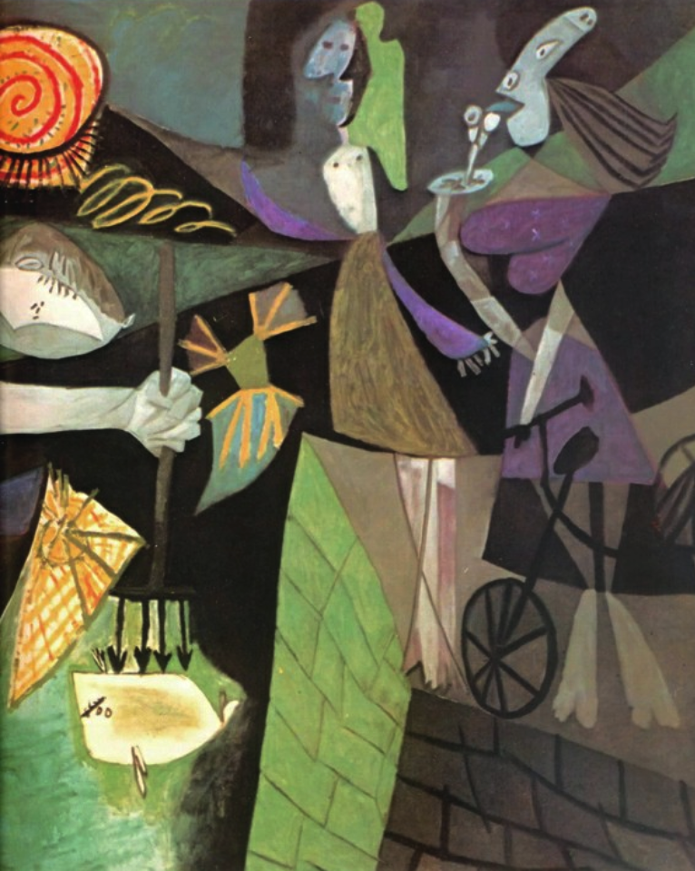

    作者: 刘津 / 李月
    出版社: 人民邮电出版社
    副标题: 用户体验设计师的成长之路
    出版年: 2014-7
    页数: 282
    定价: 69.00
    装帧: 平装
    丛书: 破茧成蝶
    ISBN: 9787115353054

[豆瓣链接](https://book.douban.com/subject/25915629/)

- [第1篇 成为用户体验设计师的信念](#%e7%ac%ac1%e7%af%87-%e6%88%90%e4%b8%ba%e7%94%a8%e6%88%b7%e4%bd%93%e9%aa%8c%e8%ae%be%e8%ae%a1%e5%b8%88%e7%9a%84%e4%bf%a1%e5%bf%b5)
  - [01 什么是用户体验设计](#01-%e4%bb%80%e4%b9%88%e6%98%af%e7%94%a8%e6%88%b7%e4%bd%93%e9%aa%8c%e8%ae%be%e8%ae%a1)
    - [1.1 设计≠艺术](#11-%e8%ae%be%e8%ae%a1%e2%89%a0%e8%89%ba%e6%9c%af)
    - [1.2 邂逅用户体验设计](#12-%e9%82%82%e9%80%85%e7%94%a8%e6%88%b7%e4%bd%93%e9%aa%8c%e8%ae%be%e8%ae%a1)
    - [1.3 用户体验设计的特征](#13-%e7%94%a8%e6%88%b7%e4%bd%93%e9%aa%8c%e8%ae%be%e8%ae%a1%e7%9a%84%e7%89%b9%e5%be%81)
    - [1.4 用户体验设计的精益之道](#14-%e7%94%a8%e6%88%b7%e4%bd%93%e9%aa%8c%e8%ae%be%e8%ae%a1%e7%9a%84%e7%b2%be%e7%9b%8a%e4%b9%8b%e9%81%93)

## 第1篇 成为用户体验设计师的信念
### 01 什么是用户体验设计
#### 1.1 设计≠艺术
图1-1是艺术大师毕加索的一幅作品。

图1-2是某用户体验设计师的作品，准确地说应该是半成品。内容包含页面草图（线框图）、页面流程、简单的交互说明等。

艺术和设计的区别：艺术是感性的，而设计是相对理性、精密的。艺术所表达的是创作者的个人意识，而设计是为了解决用户具体的问题。

#### 1.2 邂逅用户体验设计
用户体验是什么？用一句话概括就是：你在使用一个产品时的主观感受。用户体验设计又是什么呢？是为了提升用户体验而做的设计了。

#### 1.3 用户体验设计的特征
总结出如下用户体验设计的一些特征。

- 严谨、理性、创意
  - 用户体验设计充满了理性和严谨，因为它首先关注于解决用户的问题，同时也需要优质的创意，帮助用户获得更好的体验。
- 提供特定问题的解决方案
  - 为了避免把设计当做自己无限发挥创意的舞台，以至于出现糟糕的体验。设计师在设计前，请先问问自己，这次设计的目标是什么？要为什么样的人解决什么样的问题？如何解决？
- 不让用户思考
  - 很多设计师喜欢找这样的借口：我这个设计很有创意，用户第一眼看到的时候不会用没关系，他第二次不就会了吗？可惜的是，用户可不会这么想。他第一次遇到挫折的时候，很可能会头也不回地扬长而去……再也没有第二次的机会了。
- 趣味横生
  - 趣味性可以为你的设计加分，让用户产生难以忘怀的奇妙体验。

#### 1.4 用户体验设计的精益之道
- 热爱生活，细心观察，勇于改变
  - 细心观察生活中每一个不如意的地方吧，也许它就是你改变世界的机会。
- 了解人，观察人
  - 做设计是为了解决“人”的问题，是为了让“人”从中获得良好的体验。所以说到底，我们是在做以“人”为中心的设计。那么这就需要了解“人”的想法、行为、习惯等，学会换位思考。

