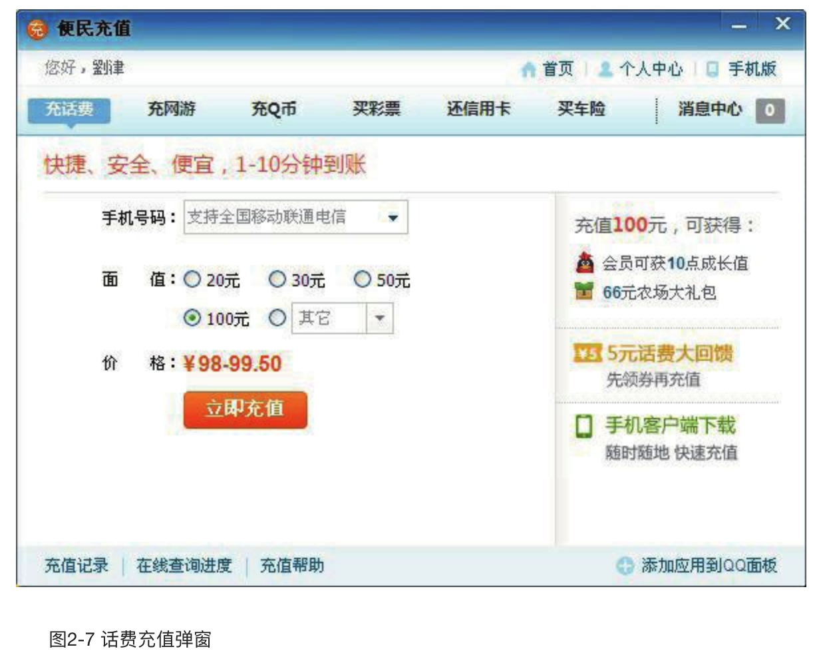
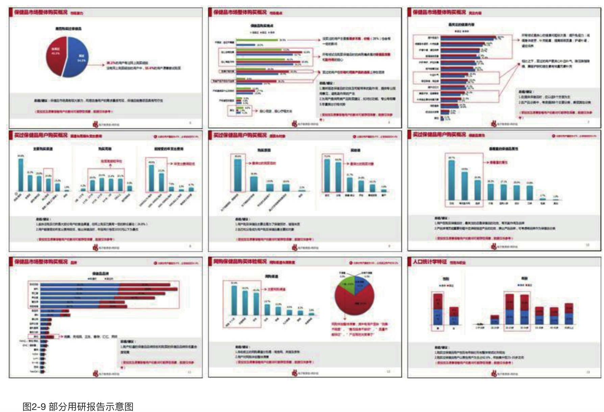
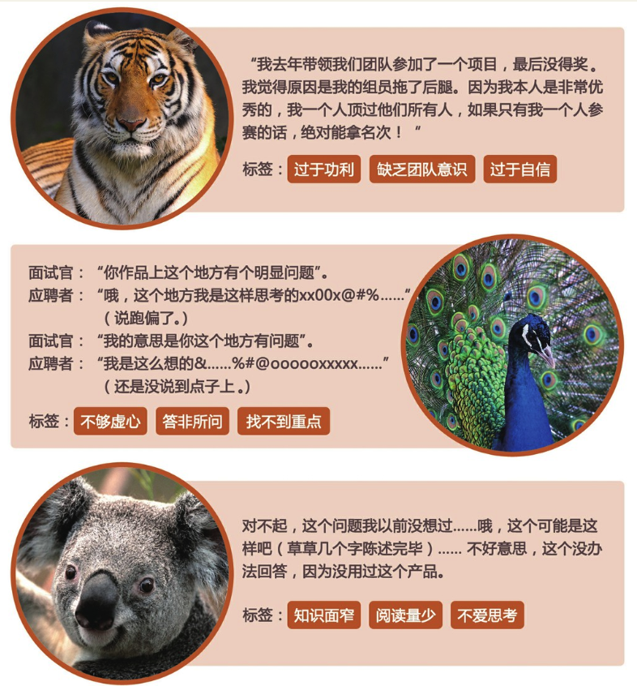

    作者: 刘津 / 李月
    出版社: 人民邮电出版社
    副标题: 用户体验设计师的成长之路
    出版年: 2014-7
    页数: 282
    定价: 69.00
    装帧: 平装
    丛书: 破茧成蝶
    ISBN: 9787115353054

[豆瓣链接](https://book.douban.com/subject/25915629/)

- [第1篇 成为用户体验设计师的信念](#%e7%ac%ac1%e7%af%87-%e6%88%90%e4%b8%ba%e7%94%a8%e6%88%b7%e4%bd%93%e9%aa%8c%e8%ae%be%e8%ae%a1%e5%b8%88%e7%9a%84%e4%bf%a1%e5%bf%b5)
  - [01 什么是用户体验设计](#01-%e4%bb%80%e4%b9%88%e6%98%af%e7%94%a8%e6%88%b7%e4%bd%93%e9%aa%8c%e8%ae%be%e8%ae%a1)
    - [1.1 设计≠艺术](#11-%e8%ae%be%e8%ae%a1%e2%89%a0%e8%89%ba%e6%9c%af)
    - [1.2 邂逅用户体验设计](#12-%e9%82%82%e9%80%85%e7%94%a8%e6%88%b7%e4%bd%93%e9%aa%8c%e8%ae%be%e8%ae%a1)
    - [1.3 用户体验设计的特征](#13-%e7%94%a8%e6%88%b7%e4%bd%93%e9%aa%8c%e8%ae%be%e8%ae%a1%e7%9a%84%e7%89%b9%e5%be%81)
    - [1.4 用户体验设计的精益之道](#14-%e7%94%a8%e6%88%b7%e4%bd%93%e9%aa%8c%e8%ae%be%e8%ae%a1%e7%9a%84%e7%b2%be%e7%9b%8a%e4%b9%8b%e9%81%93)
  - [02 了解用户体验设计师](#02-%e4%ba%86%e8%a7%a3%e7%94%a8%e6%88%b7%e4%bd%93%e9%aa%8c%e8%ae%be%e8%ae%a1%e5%b8%88)
    - [2.1 用户体验相关职位有哪些](#21-%e7%94%a8%e6%88%b7%e4%bd%93%e9%aa%8c%e7%9b%b8%e5%85%b3%e8%81%8c%e4%bd%8d%e6%9c%89%e5%93%aa%e4%ba%9b)
      - [交互设计师](#%e4%ba%a4%e4%ba%92%e8%ae%be%e8%ae%a1%e5%b8%88)
      - [视觉设计师](#%e8%a7%86%e8%a7%89%e8%ae%be%e8%ae%a1%e5%b8%88)
      - [用户研究员](#%e7%94%a8%e6%88%b7%e7%a0%94%e7%a9%b6%e5%91%98)
    - [2.2 用户体验设计师的价值](#22-%e7%94%a8%e6%88%b7%e4%bd%93%e9%aa%8c%e8%ae%be%e8%ae%a1%e5%b8%88%e7%9a%84%e4%bb%b7%e5%80%bc)
      - [用户价值、商业价值](#%e7%94%a8%e6%88%b7%e4%bb%b7%e5%80%bc%e5%95%86%e4%b8%9a%e4%bb%b7%e5%80%bc)
      - [项目价值](#%e9%a1%b9%e7%9b%ae%e4%bb%b7%e5%80%bc)
      - [品牌价值](#%e5%93%81%e7%89%8c%e4%bb%b7%e5%80%bc)
  - [03 设计师的职业困惑](#03-%e8%ae%be%e8%ae%a1%e5%b8%88%e7%9a%84%e8%81%8c%e4%b8%9a%e5%9b%b0%e6%83%91)
    - [3.1 我适合干这行吗](#31-%e6%88%91%e9%80%82%e5%90%88%e5%b9%b2%e8%bf%99%e8%a1%8c%e5%90%97)
    - [3.2 菜鸟怎样入门](#32-%e8%8f%9c%e9%b8%9f%e6%80%8e%e6%a0%b7%e5%85%a5%e9%97%a8)
    - [3.3 去大公司、小公司，还是设计公司](#33-%e5%8e%bb%e5%a4%a7%e5%85%ac%e5%8f%b8%e5%b0%8f%e5%85%ac%e5%8f%b8%e8%bf%98%e6%98%af%e8%ae%be%e8%ae%a1%e5%85%ac%e5%8f%b8)
    - [3.4 什么样的应聘者更容易成功](#34-%e4%bb%80%e4%b9%88%e6%a0%b7%e7%9a%84%e5%ba%94%e8%81%98%e8%80%85%e6%9b%b4%e5%ae%b9%e6%98%93%e6%88%90%e5%8a%9f)
      - [侧重考查设计师什么方面](#%e4%be%a7%e9%87%8d%e8%80%83%e6%9f%a5%e8%ae%be%e8%ae%a1%e5%b8%88%e4%bb%80%e4%b9%88%e6%96%b9%e9%9d%a2)
- [第2篇 修炼用户体验设计师的技能](#%e7%ac%ac2%e7%af%87-%e4%bf%ae%e7%82%bc%e7%94%a8%e6%88%b7%e4%bd%93%e9%aa%8c%e8%ae%be%e8%ae%a1%e5%b8%88%e7%9a%84%e6%8a%80%e8%83%bd)
  - [04 设计流程——设计师具体做什么](#04-%e8%ae%be%e8%ae%a1%e6%b5%81%e7%a8%8b%e8%ae%be%e8%ae%a1%e5%b8%88%e5%85%b7%e4%bd%93%e5%81%9a%e4%bb%80%e4%b9%88)
    - [4.1 设计师如何参与一个具体的项目](#41-%e8%ae%be%e8%ae%a1%e5%b8%88%e5%a6%82%e4%bd%95%e5%8f%82%e4%b8%8e%e4%b8%80%e4%b8%aa%e5%85%b7%e4%bd%93%e7%9a%84%e9%a1%b9%e7%9b%ae)

## 第1篇 成为用户体验设计师的信念
### 01 什么是用户体验设计
#### 1.1 设计≠艺术
图1-1是艺术大师毕加索的一幅作品。

图1-2是某用户体验设计师的作品，准确地说应该是半成品。内容包含页面草图（线框图）、页面流程、简单的交互说明等。

艺术和设计的区别：艺术是感性的，而设计是相对理性、精密的。艺术所表达的是创作者的个人意识，而设计是为了解决用户具体的问题。

#### 1.2 邂逅用户体验设计
用户体验是什么？用一句话概括就是：你在使用一个产品时的主观感受。用户体验设计又是什么呢？是为了提升用户体验而做的设计了。

#### 1.3 用户体验设计的特征
总结出如下用户体验设计的一些特征。

- 严谨、理性、创意
  - 用户体验设计充满了理性和严谨，因为它首先关注于解决用户的问题，同时也需要优质的创意，帮助用户获得更好的体验。
- 提供特定问题的解决方案
  - 为了避免把设计当做自己无限发挥创意的舞台，以至于出现糟糕的体验。设计师在设计前，请先问问自己，这次设计的目标是什么？要为什么样的人解决什么样的问题？如何解决？
- 不让用户思考
  - 很多设计师喜欢找这样的借口：我这个设计很有创意，用户第一眼看到的时候不会用没关系，他第二次不就会了吗？可惜的是，用户可不会这么想。他第一次遇到挫折的时候，很可能会头也不回地扬长而去……再也没有第二次的机会了。
- 趣味横生
  - 趣味性可以为你的设计加分，让用户产生难以忘怀的奇妙体验。

#### 1.4 用户体验设计的精益之道
- 热爱生活，细心观察，勇于改变
  - 细心观察生活中每一个不如意的地方吧，也许它就是你改变世界的机会。
- 了解人，观察人
  - 做设计是为了解决“人”的问题，是为了让“人”从中获得良好的体验。所以说到底，我们是在做以“人”为中心的设计。那么这就需要了解“人”的想法、行为、习惯等，学会换位思考。
- 理性的思路
  - 遇到问题时，我们该如何思考呢？
- 亲自使用、体验
  - 很多错误的设计之所以频繁出现，就在于设计者自己都很少去使用它，更谈不上发现问题。
- 多听用户的反馈意见
  - 亲自试用并不见得能发现所有问题。毕竟你对这个产品太过熟悉，很多东西已经习以为常，而用户却可能并不了解。
  - 当一个人已经知道某件事时，他就很难想象出自己不知道的话会是一番什么情形。我们可能会嘲笑不会用传真机的博士，却忘记了自己第一次使用时的尴尬场景。
- 留心好的设计，在此基础上优化

### 02 了解用户体验设计师
#### 2.1 用户体验相关职位有哪些
国内的设计团队，一般包含交互设计师、视觉设计师和用户研究员3个职位。

如果把产品比做图2-1左侧的这个服务人员，那么这3个职位的作用正如图中所描述的那样。

##### 交互设计师
最开始我会说：“我是一名交互设计师。”然后发现对面的人一头雾水。看来这种解释很失败！

然后我考虑换个说法：“我是设计互联网产品的。”“哦，那不就是产品经理吗？”我的解释再次失败了！

再后来，我又尝试了一种比较委婉的说法：“我是一名建筑设计师，不过我不设计房子，我设计互联网产品，比如产品的结构、信息层级、使用流程等。”对方听得一知半解，也不知道是懂了还是没懂。

现在我会这样说：“你使用一个网站的时候，有没有出现这种情况，某个功能怎么都找不到，或者点了某个按钮一点反应都没有，再或者填写信息时总是无法成功提交……”对方马上来了兴趣，“有啊有啊，这种情况经常发生啊，尤其是那个该死的xxxx网站……”我马上趁势说：“我们的工作就是改善这种情况，让你使用网站时有一个良好的体验。”对方马上就明白了。

交互设计就是通过分析用户心理模型、设计任务流程、运用交互知识，把业务逻辑（功能规格或内容需求）以用户能理解的方式表达给用户，最终实现产品战略（公司需求和用户需求的最佳平衡点）的过程。

交互设计师的产出物也比较丰富，有竞品分析文档、用户反馈整理、流程图、设计草图、设计原型，等等。其中最常见的是设计原型。设计原型的样式没有固定的标准，手绘、软件绘制都可以，主要是根据各个公司的实际情况而定的，如图2-2、图2-3所示。

图2-3 Axure软件绘制的线框图

##### 视觉设计师
视觉设计师也分为很多种，如平面设计师、原画设计师、推广设计师、界面设计师（UI设计师）等。本文中主要指的是UI设计师。

原画设计师：要求设计者有很强的手绘能力，作品充满艺术表现力。举一个例子，如图2-4所示。

图2-4 原画场景

平面设计师：要求设计者能很好地传达思想，作品有较强的感染力，好的平面作品也不乏艺术感和优秀创意，如图2-5所示。

图2-5 某平面广告

互联网产品的推广运营设计师：要求作品能突出重点、快速抓住眼球，内容越直观越好。因为在互联网上看广告的用户可没什么耐心，他们往往是忙碌且急躁的，没有心情去欣赏什么艺术和创意，如图2-6所示。

界面设计师（UI设计师）：要求设计者既具备一定的交互知识，也具有良好的审美感觉，作品能很好地引导用户操作，同时令用户感受到作品的美感，下次还愿意光顾你的网站，如图2-7所示。

##### 用户研究员
用户研究员，顾名思义，就是专门研究用户的人。用户研究员简称“用研”，数量不多，一般只有大公司或较大的设计团队才有这个职位，对从业人员的专业背景和各项素质要求都较高。他们在产品设计中有着不可忽视的作用，即通过各种分析和研究，深入地了解用户特征、用户行为习惯等，从而为产品、运营、推广、设计决策等提供必要的方向和支持。

用户研究员日常的工作可能有市场分析、竞品分析、创建人物角色、问卷调查、焦点小组、用户访谈、可用性测试，等等。

举几个例子。比如说最近做了一个促销活动，但是效果很不好，就可以找用户研究员做一些简单的调研，来寻找原因。再如，设计师完成设计原型后，用户研究员可以做可用性测试来排查设计问题。还有，产品人员在考虑产品方向和新功能时，也可以找用户研究员调查，看是否符合目标人群需要，等等。

用户研究员的产出物主要是各种类型的用研报告。它更偏向于比较客观和实际的研究结果。具体要怎么解决问题，需要对报告进行深入解读，用户研究员也应通过自己的理解给出一些建议，如图2-9所示。

#### 2.2 用户体验设计师的价值
用户体验设计师具体有什么作用和价值呢？

##### 用户价值、商业价值
对于一个百万级用户的产品，如果用户通过优秀的设计能够更快速地完成目标和任务，那么这个产品为用户、为社会创造的价值有多大？如果通过优秀的设计能让每一个用户感到惊喜和快乐，那么这个产品又为社会创造了多大的价值和财富呢？

##### 项目价值
设计师的创意和想法离不开团队成员的支持，否则再好的想法也难以实施。好的用户体验设计师在项目中具备足够的影响力，能够充分组织、调动、协助好其他角色。他的存在既保证了良好的产品体验，又能使得项目顺利、有序地进行下去，对提升项目质量和效率都起到了极大的作用。

- 通过专业能力节省其他环节的时间。
  - 优秀的交互设计师可以快速判断出设计方案的优劣，更可以凭借经验和专业能力更快速地得出可靠的设计方案。一个好的设计师，能够节省产品人员挠头画原型的时间；能够减少产品人员因不断碰壁而不得不反复改原型的时间；避免了整个项目因为一些明显的错误而导致的不必要的迭代；节省了用户研究员做可用性测试的次数（好的交互设计师凭借经验即可发现大部分问题所在，节约可用性测试的时间和成本）；节省了视觉设计师理解、修复不专业的原型稿的时间；节省了前端揣测不完整的原型说明的时间；减少了开发因为需求或交互反复变动的抱怨……
- 跟进各个环节，保证产出物质量。
  - 产品经理虽然也要负责跟进，但是各种功能、开发问题就已经很让人头大了，如果再负责跟进设计细节，那简直要崩溃了。没关系，交互设计师是你坚强的后盾，他会跟进视觉、前端（当然视觉设计师的跟进也很重要）、开发，保证最后上线的结果和设计稿一致，给产品更好的体验。
- 促进统一化及标准化，提升设计效率。
  - 经过多年的积累和发展，设计行业中已形成了一些较通用的原则和方法。另外，设计师经过一段时间的积累，也会逐渐沉淀出适合项目需要的设计规范或模板。这样既保证了设计质量，又提升了设计效率。由产品人员设计界面，短期来看确实很快捷，但由于没有统一的设计标准，每个人的思考方式又很不一样，不利于项目的长期发展。如果再遇到人员调整，就会出现很多问题。
- 促使项目流程更合理，更有规划。
  - 在一个大型团队中，如果没有交互设计师，或没有懂交互知识的人员，项目流程极容易变得混乱。我们常见到如下情况：需求根本没想清楚；原型粗糙，后续工作难以进行；后续发现问题导致交互更改，大家一起返工；原型说明不全，后面每个环节都按照自己的想法添砖加瓦，导致产品离最初目标越来越远……
  - 而交互设计师的出现在一定程度上可以很好地改善这种局面。一方面，交互设计本身有一定的流程和方法，可以尽量避免大家拍脑子想问题；另外，标准的原型、详尽细致的交互说明减少了团队成员的理解和沟通成本，流程自然更井然有序，返工现象也会大大减少。
- 协助产品经理组织各个环节，是整个项目的有力推动者。
  - 交互设计师分析、重塑需求；与用研配合，了解用户特征与行为；设计结构、流程、界面、动态效果；跟进视觉、前端、开发；及时整理线上问题，准备下次迭代……这个过程几乎贯穿了产品周期的始末，并且交互设计师需要与各个环节打交道，沟通协调，PK想法。所以好的交互设计师相当于一个好管家，协助产品经理组织好各个环节，是整个项目有力的推动者。

##### 品牌价值
设计师其实还有一个非常重要的作用，那就是维护和突出公司的整体品牌形象。统一的设计理念及风格可以更好地增强公司品牌识别度，起到非常好的宣传作用，如图2-12所示。

### 03 设计师的职业困惑
#### 3.1 我适合干这行吗
至于适合不适合干这行，我觉得最关键的问题在于是否有兴趣及天分。你可以问问自己下面这些问题。

- 你是否热衷于各种好玩又新奇的产品呢？
- 你平时是否喜欢使用各种各样的产品并研究它是否好用呢？
- 你是否更容易发现使用中的各种问题，并积极想办法解决它呢？
- 你是否充满各种灵感和创意？
- 你是否喜欢思考问题，清晰地罗列各种解决方案并寻找其中的逻辑关系，并且乐此不疲呢？
- 在绘制草图的时候，你是否有一种莫名的兴奋感呢？
- 你喜欢跟人沟通和交流、展示你的想法和创意吗？
- 一般来说，你的想法容易得到别人的认可吗？
- 你会精益求精，总是要求自己超出预期吗？

#### 3.2 菜鸟怎样入门
笔试题目很简单：“你认为你的手机有哪个地方设计的不好吗？请提出改善建议”。面试官给每个人发了2张白纸。

不会画线框图的我决定用自己的方式来回答这个问题。我认为设计一定是有理有据的，而不完全是在于表现形式。所以我先陈述了一下手机的一些基本使用情况，比如我认为大部分人都只会用到3个功能——打电话、发短信、闹钟（那是大约2009年的时候）。所以要解决设计问题，应该先重点去排查这3个功能的问题。最后我选择了“发短信”这个功能。我将自己置身于一个真实的使用场景，描述自己完成某一个具体的任务（当然这个任务必须得是合理的、经常发生的）时，会发生的一些情况，而目前的设计如何干扰了我完成这个任务，我觉得应该怎样改善更合理之类的……最后洋洋洒洒地写了两大篇纸。看着自己歪七扭八的一手烂字，再看看旁边3位精美的线框图，当时真是欲哭无泪……

后来我问其中一个面试官，为什么我可以得到这个机会。她说：“我们其实不是很注重表现形式，我们注重的是思维。我觉得你的思维很好。有的人可能确实有经验，但光会画图，缺乏必要的思考也是不行的”。

后来，在实习过程中，我很快就学会了画纸面原型，如图3-1所示。但我们大部分时间的工作依然是思考、分析和整理各种文档等基础工作，画图的时间并不是很多。

图3-1 纸面原型示例

#### 3.3 去大公司、小公司，还是设计公司
图3-3所示的是部分知名的用户体验设计公司或大公司中知名的设计团队，可供大家参考。更多内容可查看http：//uedfans.cn/等网站。

#### 3.4 什么样的应聘者更容易成功
总体来说，可以把没通过的应聘者归纳成如图3-4所示的3种典型类型。

图3-4 失败应聘者典型的三种类型

##### 侧重考查设计师什么方面
- 对用户体验具备浓厚的兴趣。
  - 要想成为一名优秀的用户体验设计师，首先要对这方面有兴趣，有激情。
- 具备良好的素养。
  - 一个不学无术、不懂礼貌、不尊重他人、反应迟钝、缺乏爱心的人是绝对做不好用户体验的。因为做用户体验设计，就是要把冰冷的界面（互联网产品或软件）塑造成一个可以和用户交流的“人”，这个“人”彬彬有礼、善于沟通、聪明伶俐，想用户之所想，急用户之所急，和他互动过的用户都会产生良好的体验。
- 具备强大的思维能力。
  - 就拿交互设计师来说，他需要把抽象的概念转化为具体的页面。
  - 设计师必须有能力去解决一些更深层次的、抽象的问题。这其实涉及一个思考习惯，就是从整体到局部，再到细节，最后回归整体的思考过程。
- 掌握专业的技能。
  - 如果前三者你全都具备了，那么成为一个优秀的设计师只是时间的问题。
  - 某交互设计师的设计分析，如图3-6所示。某交互设计师的原型截图，如图3-7所示。

## 第2篇 修炼用户体验设计师的技能
### 04 设计流程——设计师具体做什么
#### 4.1 设计师如何参与一个具体的项目
