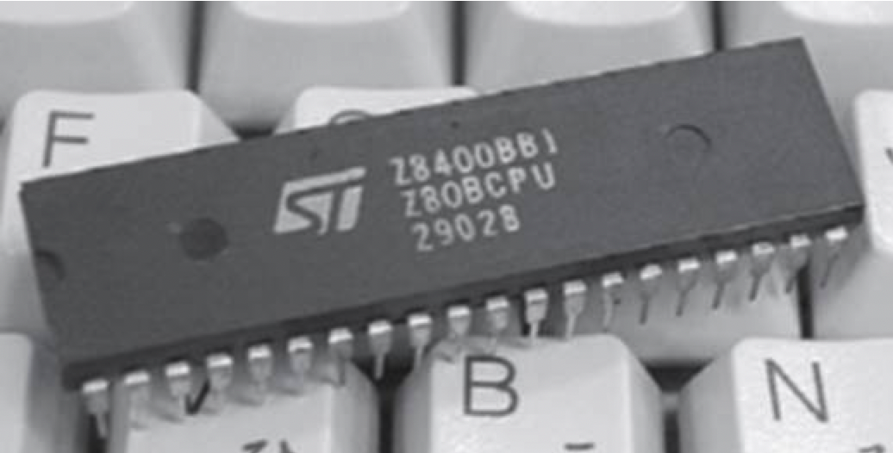
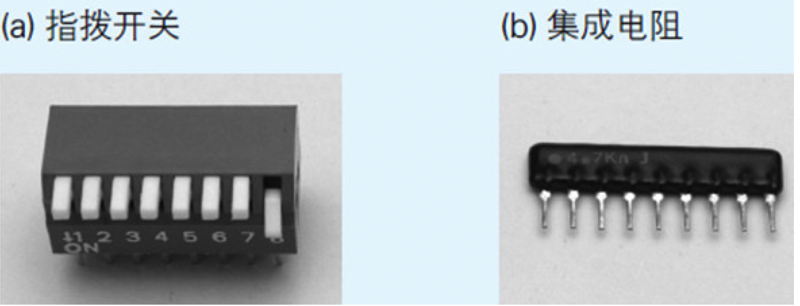

    作者: [日] 矢泽久雄 
    出版社: 人民邮电出版社
    译者: 胡屹 
    出版年: 2015-5
    页数: 272
    定价: 39.00元
    装帧: 平装
    丛书: 图灵程序设计丛书
    ISBN: 9787115392275

[豆瓣链接](https://book.douban.com/subject/26397183/)

- [第1章 计算机的三大原则](#%e7%ac%ac1%e7%ab%a0-%e8%ae%a1%e7%ae%97%e6%9c%ba%e7%9a%84%e4%b8%89%e5%a4%a7%e5%8e%9f%e5%88%99)
  - [1.1计算机的三个根本性原则](#11%e8%ae%a1%e7%ae%97%e6%9c%ba%e7%9a%84%e4%b8%89%e4%b8%aa%e6%a0%b9%e6%9c%ac%e6%80%a7%e5%8e%9f%e5%88%99)
  - [1.2输入、运算、输出是硬件的基础](#12%e8%be%93%e5%85%a5%e8%bf%90%e7%ae%97%e8%be%93%e5%87%ba%e6%98%af%e7%a1%ac%e4%bb%b6%e7%9a%84%e5%9f%ba%e7%a1%80)
  - [1.3软件是指令和数据的集合](#13%e8%bd%af%e4%bb%b6%e6%98%af%e6%8c%87%e4%bb%a4%e5%92%8c%e6%95%b0%e6%8d%ae%e7%9a%84%e9%9b%86%e5%90%88)
  - [1.7稍微预习一下第2章](#17%e7%a8%8d%e5%be%ae%e9%a2%84%e4%b9%a0%e4%b8%80%e4%b8%8b%e7%ac%ac2%e7%ab%a0)
- [第2章 试着制造一台计算机吧](#%e7%ac%ac2%e7%ab%a0-%e8%af%95%e7%9d%80%e5%88%b6%e9%80%a0%e4%b8%80%e5%8f%b0%e8%ae%a1%e7%ae%97%e6%9c%ba%e5%90%a7)
  - [2.1制作微型计算机所必需的元件](#21%e5%88%b6%e4%bd%9c%e5%be%ae%e5%9e%8b%e8%ae%a1%e7%ae%97%e6%9c%ba%e6%89%80%e5%bf%85%e9%9c%80%e7%9a%84%e5%85%83%e4%bb%b6)
  - [2.2电路图的读法](#22%e7%94%b5%e8%b7%af%e5%9b%be%e7%9a%84%e8%af%bb%e6%b3%95)
  - [2.3连接电源、数据和地址总线](#23%e8%bf%9e%e6%8e%a5%e7%94%b5%e6%ba%90%e6%95%b0%e6%8d%ae%e5%92%8c%e5%9c%b0%e5%9d%80%e6%80%bb%e7%ba%bf)
  - [2.4 连接I/O](#24-%e8%bf%9e%e6%8e%a5io)
  - [2.5 连接时钟信号](#25-%e8%bf%9e%e6%8e%a5%e6%97%b6%e9%92%9f%e4%bf%a1%e5%8f%b7)
  - [2.7 连接剩余的控制引脚](#27-%e8%bf%9e%e6%8e%a5%e5%89%a9%e4%bd%99%e7%9a%84%e6%8e%a7%e5%88%b6%e5%bc%95%e8%84%9a)
  - [2.10 输入测试程序并进行调试](#210-%e8%be%93%e5%85%a5%e6%b5%8b%e8%af%95%e7%a8%8b%e5%ba%8f%e5%b9%b6%e8%bf%9b%e8%a1%8c%e8%b0%83%e8%af%95)
- [第3章 体验一次手工汇编](#%e7%ac%ac3%e7%ab%a0-%e4%bd%93%e9%aa%8c%e4%b8%80%e6%ac%a1%e6%89%8b%e5%b7%a5%e6%b1%87%e7%bc%96)
  - [3.1从程序员的角度看硬件](#31%e4%bb%8e%e7%a8%8b%e5%ba%8f%e5%91%98%e7%9a%84%e8%a7%92%e5%ba%a6%e7%9c%8b%e7%a1%ac%e4%bb%b6)
  - [3.2 机器语言和汇编语言](#32-%e6%9c%ba%e5%99%a8%e8%af%ad%e8%a8%80%e5%92%8c%e6%b1%87%e7%bc%96%e8%af%ad%e8%a8%80)
  - [3.3 Z80 CPU的寄存器结构](#33-z80-cpu%e7%9a%84%e5%af%84%e5%ad%98%e5%99%a8%e7%bb%93%e6%9e%84)

## 第1章 计算机的三大原则
### 1.1计算机的三个根本性原则
下面开始介绍计算机的三大原则

1. 计算机是执行输入、运算、输出的机器
2. 程序是指令和数据的集合
3. 计算机的处理方式有时与人们的思维习惯不同

### 1.2输入、运算、输出是硬件的基础
计算机的硬件由大量的`IC`（Integrated Circuit，集成电路）组成（如图1.1所示）。每块IC上都带有许多`引脚`，这些引脚有的用于输入，有的用于输出。IC会在内部对外部输入的信息进行运算，并把运算结果输出到外部。

图1.1 IC的引脚有些用于输入，有些用于输出



### 1.3软件是指令和数据的集合
- 所谓`程序`，是指令和数据的集合。
- 所谓`指令`，就是控制计算机进行输入、运算、输出的命令。

在程序设计中，会为一组指令赋予一个名字，称之为`“函数”`。

程序中的`数据`分为两类，一类是作为指令执行对象的输入数据；一类是从指令的执行结果得到的输出数据。在编程时程序员会为数据赋予名字，称其为`“变量”`。

    output=operate(input)

代码清单1.1 C语言的程序示例片段

```c
int a, b, c;

a=10;
b=20;
c=Average(a,b);
```

- C语言中要在每条指令的末尾写一个分号（；）。
- 等号是赋值给变量的指令。

所谓`编译`就是把用C语言等编程语言编写的文件（源文件）转换成用机器语言（原生代码）文件。

代码清单1.2 机器语言的程序示例

```
C7 45 FC 01 00 00 00 C7 45 F8 02 00 00 00 8B 45
F8 50 8B 4D FC 51 E8 82 FF FF FF 83 C4 08 89 45
F4 8B 55 F4 52 68 1C 30 42 00 E8 B9 03 00 00 83
```

第一个数值C7表示指令，第二个数值45表示数据。

### 1.7稍微预习一下第2章
图1.4 计算机硬件的组成要素


计算机内部主要由被称为IC的元件组成（主要的3种）：CPU（处理器）、内存以及I/O。

- `CPU`是计算机的大脑，在其内部可对数据执行运算并控制内存和I/O。
- `内存`用于存储指令和数据。
- `I/O`负责把键盘、鼠标、显示等周边设备和主机连接在一起，实现数据的输入和输出。

只要用电路把CPU、内存以及I/O上的`引脚`相互连接起来，为每块IC提供电源，再为CPU提供时钟信号，硬件上的计算机就组装起来了。

所谓`时钟信号`，就是由内含晶振（一种利用石英晶体（又称水晶）的压电效应产生高精度振荡频率的电子元件）的、被称为时钟发生器的元件发出的滴答滴答的电信号。

## 第2章 试着制造一台计算机吧
### 2.1制作微型计算机所必需的元件
为了驱动CPU运转，称为“时钟信号”的电信号是必不可少的。这种电信号就好像带有一个时钟，滴答滴答地每隔一定时间就变换一次电压的高低（如图2.2所示）。

图2.2 时钟信号的波形图


输出时钟信号的元件叫“时钟发生器”。时钟发生器中带有晶振，根据其自身的频率（振动的次数）产生时钟信号。时钟信号的频率可以衡量CPU的运转速度，这里使用的是2.5MHz的时钟发生器(2.5MHz（兆赫兹）的话就是2.5*100万=250万次/秒)。

通过拨动`指拨开关来`输入程序，指拨开关是一种由8个开关并排连在一起构成的元件（如照片2.1a所示）。输出程序执行结果的装置是8个`LED（发光二极管）`。

`电阻`是用于阻碍电流流动、降低电压值的元件。

照片2.1 指拨开关和集成电阻



### 2.2电路图的读法
本次制作的微型计算机工作在+5V的直流电下。

图2.4 电源的表示方法


IC的引脚（所谓引脚就是IC边缘露出来的像蜈蚣腿一样的部分）按逆时针方向依次带有一个从1开始递增的序号，数引脚序号时，要先把表示正方向的标志，如半圆形缺口朝向左侧，举例来说，带有14个引脚的7404，其引脚序号如图2.5所示

图2.5 如何数IC的引脚序号


画图时，在引脚的旁边写上引脚的序号，在表示IC的矩形符号中写上表明该引脚作用的代号，代号就是像RD（Read）表示执行读取操作，WR（Write）表示执行写入操作这样的代表了某种操作的符号。

### 2.3连接电源、数据和地址总线
微型计算机所使用的IC属于数字IC。在数字IC中，每个引脚上的电压要么是0V，要么是+5V，通过这两个电压与其他的IC进行电信号的收发。

只要想成0V表示数字0，+5V表示数字1，那么数字IC就是在用二进制数的形式收发信息。

为了指定输入输出数据时的源或目的地，CPU上备有“地址总线引脚”。Z80 CPU的地址总线引脚有16个，用代号A0-A15表示，其中的A表示Address（地址）,0-15表示一个16位的二进制数中各个数字的位置，0对应最后一位，15对应第一位。16个地址总线引脚所能指定的地址共有65536个，用二进制数表示的话就是0000000000000000-1111111111111111。因此，Z80 CPU可以指定65536个数据存储单元（内存存储单元或I/O地址），进行信息的输入输出。

Z80 CPU的数据总线引脚共有8个，用代号D0-D7表示，D表示Data（数据），数字0-7与地址总线引脚代号的规则相同，也表示二进制数中各个数字的位置，Z80 CPU可以一次性地输入输出8比特的数据。

作为内存的TC5517上也有地址总线引脚（A0-A10）和数据总线引脚（D0-D7）。这些引脚需要同Z80 CPU上带有相同代号的引脚相连。一块TC5517上可以存储2048个8比特的数据（如图2.6所示）。

图2.6 TC5517的内部构造


### 2.4 连接I/O
寄存器是位于CPU和I/O中的数据存储器，Z80 PIO上共有4个`寄存器`，2个用于设定PIO本身的功能，2个用于存储与外部设备进行输入输出的数据。

这4个寄存器分别叫做端口A控制、端口A数据、端口B控制和端口B数据。所谓`端口`就是I/O与外部设备之间输入输出数据的场所。

图2.7 Z80 PIO内部结构


### 2.5 连接时钟信号
Z80 CPU和Z80 PIO的运转离不开时钟信号。为了传输时钟信号，就需要把时钟发生器的8号引脚和Z80 CPU的CLK（CLK即Clock，时钟）引脚、Z80 PIO的CLK引脚分别连接起来。时钟发生器的8号引脚与+5V之间的电阻用于清理时钟信号。

### 2.7 连接剩余的控制引脚
CPU、内存、I/O中不但有`地址总线引脚`、`数据总线引脚`，还有其他引脚，通常把这些引脚统称为`“控制引脚”`。

INT引脚是用于从Z80 PIO向Z80 CPU发出中断请求的引脚。所谓`中断`就是让CPU根据外部输入的数据执行特定的程序。

RESET引脚上的值先设置为0再还原成1，CPU就会被重置，重新从内存0号地址上的指令开始顺序向下执行。

`总线`是连接到CPU中数据引脚、地址引脚、控制引脚上的电路的统称。若将BUSRQ引脚的值设为0，则Z80 CPU从电路中`隔离`。当处于这种隔离状态时，就可以不通过CPU，手动地向内存写入程序了。像这样不经过CPU而直接从外部设备读写内存的行为叫`DMA`（Direct Memory Access，直接存储器访问）。

### 2.10 输入测试程序并进行调试
代码清单2.1展示了一段用机器语言编写的测试程序。程序是指令和数据的集合，表示指令或数据的数值为8比特为一个单位存储到内存中的。这段程序只实现了一个简单的功能，那就是通过拨动连接到Z80 PIO上的指拨开关控制LED的亮或灭。

代码清单2.1 用机器语言编写的测试程序

```
地址        程序

00000000    00111110
00000001    11001111
00000010    11010011
00000011    00000010
00000100    00111110
00000101    11111111
00000110    11010011
00000111    00000010
00001000    00111110
00001001    11001111
00001010    11010011
00001011    00000011
00001100    00111110
00001101    00000000
00001110    11010011
00001111    00000011
00010000    11011011
00010001    00000000
00010010    11010011
00010011    00000001
00010100    11000011
00010101    00010000
00010110    00000000
```

接通了微型计算机的电源后，请按下Z80 CPU上的DMA请求开关。在这个状态下，拨动用于输入内存程序和指定内存输入地址的两个指拨开关，

把代码清单2.1所示的程序一行接一行地输入内存。先来输入第一行代码，拨动用于指定地址的指拨开关，设定第一行代码所在的内存地址00000000，然后拨动用于输入程序的指拨开关，设定出程序代码00111110，再按下用于向内存写入程序的按键开关。接下来输入第二行代码，设定内存地址00000001，设定出程序代码11001111，再次按下按键开关。反复进行这三步操作，直到输入完程序代码的最后一行，所有的指令都输入完成后，按下用于重置CPU的按键开关，控制DMA请求的快动开关就会还原成关闭状态，与此同时程序也就运行起来了。

程序一旦运行起来，就可以用第3个指拨开关控制LED的亮与灭。只要拨动指拨开关，LED的亮灭就会随之改变。LED并不会只亮一下，而是一直亮着，时刻保持着指拨开关上的状态。

## 第3章 体验一次手工汇编
### 3.1从程序员的角度看硬件
真正需要了解的硬件信息只有以下7种（如图3.1所示）:

图3.1 编写程序之前需要了解的硬件信息


- CPU（处理器）信息
  - CPU的种类
  - 时钟信号的频率
- 内存信息
  - 地址空间
  - 每个地址中可以存储多少比特的信息
- I/O信息
  - I/O的种类
  - 地址空间
  - 连接着何种周边设备

`机器语言`就是处理器可以直接理解（与生俱来就能理解）的编程语言。机器语言有时也叫做原生代码（Native Code）。

所谓`时钟信号`的`频率`，就是由时钟发生器发送给CPU的电信号的频率。表示时钟信号频率的单位是MHz（兆赫兹=100万回/秒）。我们的微型计算机使用的是2.5MHz的时钟信号，时钟信号是在0和1两个数之间反复变换的电信号，通常把发出一次滴答的时间称为一个`时钟周期`。

在机器语言中，指令执行时所需的时钟周期数取决于指令的类型。程序员可以通过累加时钟周期数估算程序执行的时间。

每个`地址`都标示着一个内存中的数据存储单元，而这些地址所构成的范围就是内存的地址空间。在我们的微型计算机中，地址空间为0-255，每一个地址中可以存储8比特（1字节）的指令或数据。

所谓I/O的地址空间，是指用于指定I/O寄存器的地址范围。

在内存中，每个地址的功能都一样，既可用于存储指令又可用于存储数据。而I/O不同，地址编号不同（即寄存器的类型不同），功能也就不同。

### 3.2 机器语言和汇编语言
在机器语言程序中，虽然都是0和1的组合，但每个组合都是有特定含义的指令或数据。可是对人类来说，如果只看0和1的话，恐怕很难判断各个组合都表示什么。根据表示指令功能的英语单词起一个相似的昵称，并将这个昵称赋予给0和1的组合。这种类似英语单词的昵称叫做“助记符”，使用助记符的编程语言叫做`“汇编语言”`。

汇编语言的语法十分简单，以至于语法只有一个，即把“标签”“操作码（指令）”和“操作数（指令的对象）”并排写在一行上。

代码清单3.2 用汇编语言的代码表示代码清单3.1中的机器语言

标签 | 操作码 | 操作数
---|-----|----
- | LD | A,207
- | OUT | (2),A
- | LD | A,255
- | OUT | (2),A
- | LD | A,207
- | OUT | (3),A
- | LD | A,0
- | OUT | (3),A
LOOP: | IN | A,(0)
- | OUT | (1),A
- | JP | LOOP

- `标签`的作用是为该行代码对应的内存地址起一个名字。
- `操作码`就是表示“做什么”的指令。
- `操作数`表示的是指令执行的对象。

### 3.3 Z80 CPU的寄存器结构
与I/O的寄存器不同，CPU的寄存器不仅能存储数据，还具备对数据进行运算的能力。


