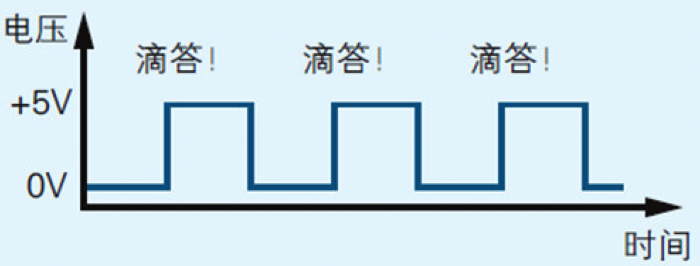

    作者: [日] 矢泽久雄 
    出版社: 人民邮电出版社
    译者: 胡屹 
    出版年: 2015-5
    页数: 272
    定价: 39.00元
    装帧: 平装
    丛书: 图灵程序设计丛书
    ISBN: 9787115392275

[豆瓣链接](https://book.douban.com/subject/26397183/)

- [第1章 计算机的三大原则](#%e7%ac%ac1%e7%ab%a0-%e8%ae%a1%e7%ae%97%e6%9c%ba%e7%9a%84%e4%b8%89%e5%a4%a7%e5%8e%9f%e5%88%99)
  - [1.1计算机的三个根本性原则](#11%e8%ae%a1%e7%ae%97%e6%9c%ba%e7%9a%84%e4%b8%89%e4%b8%aa%e6%a0%b9%e6%9c%ac%e6%80%a7%e5%8e%9f%e5%88%99)
  - [1.2输入、运算、输出是硬件的基础](#12%e8%be%93%e5%85%a5%e8%bf%90%e7%ae%97%e8%be%93%e5%87%ba%e6%98%af%e7%a1%ac%e4%bb%b6%e7%9a%84%e5%9f%ba%e7%a1%80)
  - [1.3软件是指令和数据的集合](#13%e8%bd%af%e4%bb%b6%e6%98%af%e6%8c%87%e4%bb%a4%e5%92%8c%e6%95%b0%e6%8d%ae%e7%9a%84%e9%9b%86%e5%90%88)
  - [1.7稍微预习一下第2章](#17%e7%a8%8d%e5%be%ae%e9%a2%84%e4%b9%a0%e4%b8%80%e4%b8%8b%e7%ac%ac2%e7%ab%a0)
- [第2章 试着制造一台计算机吧](#%e7%ac%ac2%e7%ab%a0-%e8%af%95%e7%9d%80%e5%88%b6%e9%80%a0%e4%b8%80%e5%8f%b0%e8%ae%a1%e7%ae%97%e6%9c%ba%e5%90%a7)
  - [2.1制作微型计算机所必需的元件](#21%e5%88%b6%e4%bd%9c%e5%be%ae%e5%9e%8b%e8%ae%a1%e7%ae%97%e6%9c%ba%e6%89%80%e5%bf%85%e9%9c%80%e7%9a%84%e5%85%83%e4%bb%b6)

## 第1章 计算机的三大原则
### 1.1计算机的三个根本性原则
下面开始介绍计算机的三大原则

1. 计算机是执行输入、运算、输出的机器
2. 程序是指令和数据的集合
3. 计算机的处理方式有时与人们的思维习惯不同

### 1.2输入、运算、输出是硬件的基础
计算机的硬件由大量的`IC`（Integrated Circuit，集成电路）组成（如图1.1所示）。每块IC上都带有许多`引脚`，这些引脚有的用于输入，有的用于输出。IC会在内部对外部输入的信息进行运算，并把运算结果输出到外部。

图1.1 IC的引脚有些用于输入，有些用于输出


### 1.3软件是指令和数据的集合
- 所谓`程序`，是指令和数据的集合。
- 所谓`指令`，就是控制计算机进行输入、运算、输出的命令。

在程序设计中，会为一组指令赋予一个名字，称之为`“函数”`。

程序中的`数据`分为两类，一类是作为指令执行对象的输入数据；一类是从指令的执行结果得到的输出数据。在编程时程序员会为数据赋予名字，称其为`“变量”`。

    output=operate(input)

代码清单1.1 C语言的程序示例片段

```c
int a, b, c;

a=10;
b=20;
c=Average(a,b);
```

- C语言中要在每条指令的末尾写一个分号（；）。
- 等号是赋值给变量的指令。

所谓`编译`就是把用C语言等编程语言编写的文件（源文件）转换成用机器语言（原生代码）文件。

代码清单1.2 机器语言的程序示例

```
C7 45 FC 01 00 00 00 C7 45 F8 02 00 00 00 8B 45
F8 50 8B 4D FC 51 E8 82 FF FF FF 83 C4 08 89 45
F4 8B 55 F4 52 68 1C 30 42 00 E8 B9 03 00 00 83
```

第一个数值C7表示指令，第二个数值45表示数据。

### 1.7稍微预习一下第2章
图1.4 计算机硬件的组成要素


计算机内部主要由被称为IC的元件组成（主要的3种）：CPU（处理器）、内存以及I/O。

- `CPU`是计算机的大脑，在其内部可对数据执行运算并控制内存和I/O。
- `内存`用于存储指令和数据。
- `I/O`负责把键盘、鼠标、显示等周边设备和主机连接在一起，实现数据的输入和输出。

只要用电路把CPU、内存以及I/O上的`引脚`相互连接起来，为每块IC提供电源，再为CPU提供时钟信号，硬件上的计算机就组装起来了。

所谓`时钟信号`，就是由内含晶振（一种利用石英晶体（又称水晶）的压电效应产生高精度振荡频率的电子元件）的、被称为时钟发生器的元件发出的滴答滴答的电信号。

## 第2章 试着制造一台计算机吧
### 2.1制作微型计算机所必需的元件
为了驱动CPU运转，称为“时钟信号”的电信号是必不可少的。这种电信号就好像带有一个时钟，滴答滴答地每隔一定时间就变换一次电压的高低（如图2.2所示）。

图2.2 时钟信号的波形图



输出时钟信号的元件叫“时钟发生器”。时钟发生器中带有晶振，根据其自身的频率（振动的次数）产生时钟信号。时钟信号的频率可以衡量CPU的运转速度。


