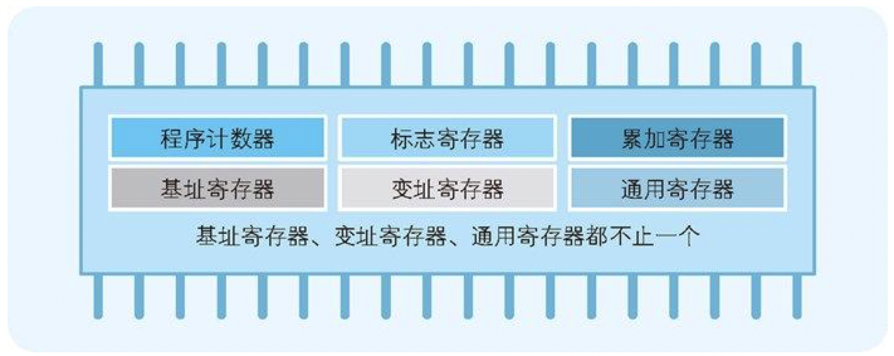

    作者: [日] 矢泽久雄 
    出版社: 人民邮电出版社
    译者: 李逢俊 
    出版年: 2015-4
    页数: 272
    定价: 39.00元
    装帧: 平装
    丛书: 图灵程序设计丛书
    ISBN: 9787115385130

[豆瓣链接](https://book.douban.com/subject/26365491/)

- [1.对程序员来说CPU是什么](#1%e5%af%b9%e7%a8%8b%e5%ba%8f%e5%91%98%e6%9d%a5%e8%af%b4cpu%e6%98%af%e4%bb%80%e4%b9%88)
  - [1.1 CPU的内部结构解析](#11-cpu%e7%9a%84%e5%86%85%e9%83%a8%e7%bb%93%e6%9e%84%e8%a7%a3%e6%9e%90)
  - [1.2 CPU是寄存器的集合体](#12-cpu%e6%98%af%e5%af%84%e5%ad%98%e5%99%a8%e7%9a%84%e9%9b%86%e5%90%88%e4%bd%93)
  - [1.3 决定程序流程的程序计数器](#13-%e5%86%b3%e5%ae%9a%e7%a8%8b%e5%ba%8f%e6%b5%81%e7%a8%8b%e7%9a%84%e7%a8%8b%e5%ba%8f%e8%ae%a1%e6%95%b0%e5%99%a8)
  - [1.4 条件分支和循环机制](#14-%e6%9d%a1%e4%bb%b6%e5%88%86%e6%94%af%e5%92%8c%e5%be%aa%e7%8e%af%e6%9c%ba%e5%88%b6)

## 1.对程序员来说CPU是什么
### 1.1 CPU的内部结构解析
有的 CPU 在一个集成电路中集成了两个 CPU 芯片，我们称之为`双核（dual core）CPU`。

图 1-1　程序运行流程示例

CPU 和内存是由许多晶体管组成的电子部件，通常称为 `IC（Integrated Circuit，集成电路）`。从功能方面来看，如图 1-2 所示，CPU 的内部由`寄存器`、`控制器`、`运算器`和`时钟`四个部分构成，各部分之间由电流信号相互连通。

- `寄存器`可用来暂存指令、数据等处理对象，可以将其看作是内存的一种。根据种类的不同，一个 CPU 内部会有 20～100 个寄存器。
- `控制器`负责把内存上的指令、数据等读入寄存器，并根据指令的执行结果来控制整个计算机。
- `运算器`负责运算从内存读入寄存器的数据。
- `时钟`负责发出 CPU 开始计时的时钟信号。Pentium 2 GHz 表示时钟信号的频率为 2 GHz（1 GHz = 10 亿次 / 秒）。也就是说，时钟信号的频率越高，CPU 的运行速度越快。

图 1-2　CPU 的四个构成部分

通常所说的内存指的是计算机的`主存储器（main memory）` ，简称主存。主存通过控制芯片等与 CPU 相连，主要负责存储指令和数据。

主存位于计算机机体内部，是负责存储程序、数据等的装置。主存通常使用 `DRAM（Dynamic Random Access Memory，动态随机存取存储器）`芯片。DRAM 可以对任何地址进行数据的读写操作，但需要保持稳定的电源供给并时常刷新（确保是最新数据），关机后内容将自动清除。

### 1.2 CPU是寄存器的集合体
程序是把寄存器作为对象来描述的。

`汇编语言`采用助记符（memonic）来编写程序，每一个原本是电气信号的机器语言指令都会有一个与其相应的助记符，助记符通常为指令功能的英语单词的简写。通常我们将汇编语言编写的程序转化成机器语言的过程称为`汇编`；反之，机器语言程序转化成汇编语言程序的过程则称为`反汇编`。

把汇编语言转化成机器语言的程序称为`汇编器（assembler）`。

`机器语言`是指CPU能直接解释和执行的语言。

`高级编程语言`是指能够使用类似于人类语言（主要是英语）的语法来记述的编程语言的总称。

`编译`是指将使用高级编程语言编写的程序转换为机器语言的过程，其中，用于转换的程序被称为`编译器（compiler）`。

表 1-1　寄存器 的主要种类和功能

种类 | 功能
---|---
累加寄存器（accumulator register） | 存储执行运算的数据和运算后的数据
标志寄存器（flag register）| 存储运算处理后的CPU的状态
程序计数器（program counter） | 存储下一条指令所在内存的地址
基址寄存器（base register）| 存储数据内存的起始地址
变址寄存器（index register） | 存储基址寄存器的相对地址
通用寄存器（general purpose register） | 存储任意数据
指令寄存器（instruction register） | 存储指令。CPU内部使用，程序员无法通过程序对该寄存器进行读写操作
栈寄存器（stack register） | 存储栈区域的起始地址

对程序员来说，CPU 是具有各种功能的寄存器的集合体。其中，程序计数器、累加寄存器、标志寄存器、指令寄存器和栈寄存器都只有一个，其他的寄存器一般有多个。

图 1-3　程序员眼中的 CPU（CPU 是寄存器的集合体）

### 1.3 决定程序流程的程序计数器
图 1-4 是程序起动时内存内容的模型。示例中的程序实现的是将 123 和 456 两个数值相加，并将结果输出到显示器上。

`操作系统（operating system）`是指管理和控制计算机硬件与软件资源的计算机程序

图 1-4　内存中配置的程序示例（显示相加的结果）

### 1.4 条件分支和循环机制
程序的流程分为顺序执行、条件分支和循环三种。

- `顺序执行`是指按照地址内容的顺序执行指令。
- `条件分支`是指根据条件执行任意地址的指令。
- `循环`是指重复执行同一地址的指令。

