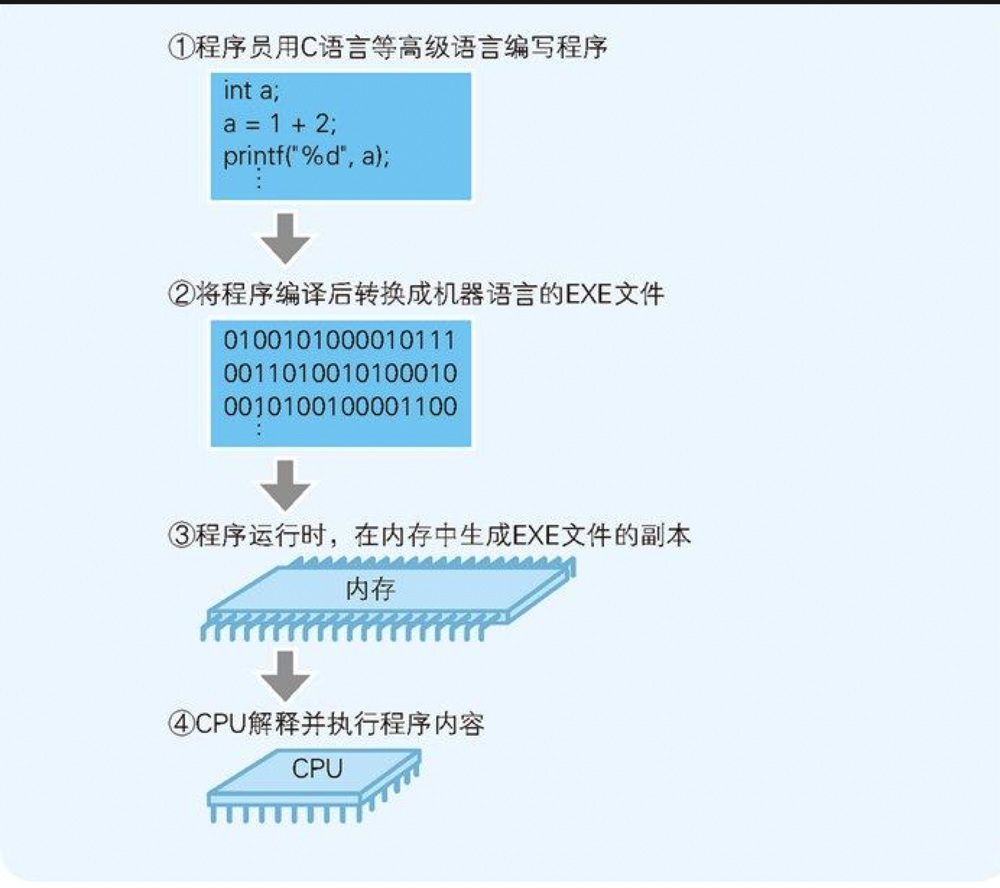

    作者: [日] 矢泽久雄 
    出版社: 人民邮电出版社
    译者: 李逢俊 
    出版年: 2015-4
    页数: 272
    定价: 39.00元
    装帧: 平装
    丛书: 图灵程序设计丛书
    ISBN: 9787115385130

[豆瓣链接](https://book.douban.com/subject/26365491/)

- [1.对程序员来说CPU是什么](#1%e5%af%b9%e7%a8%8b%e5%ba%8f%e5%91%98%e6%9d%a5%e8%af%b4cpu%e6%98%af%e4%bb%80%e4%b9%88)
  - [1.1　CPU 的内部结构解析](#11-cpu-%e7%9a%84%e5%86%85%e9%83%a8%e7%bb%93%e6%9e%84%e8%a7%a3%e6%9e%90)

## 1.对程序员来说CPU是什么
### 1.1　CPU 的内部结构解析
有的 CPU 在一个集成电路中集成了两个 CPU 芯片，我们称之为`双核（dual core）CPU`。

图 1-1　程序运行流程示例

CPU 和内存是由许多晶体管组成的电子部件，通常称为 `IC（Integrated Circuit，集成电路）`。从功能方面来看，如图 1-2 所示，CPU 的内部由`寄存器`、`控制器`、`运算器`和`时钟`四个部分构成，各部分之间由电流信号相互连通。

- `寄存器`可用来暂存指令、数据等处理对象，可以将其看作是内存的一种。根据种类的不同，一个 CPU 内部会有 20～100 个寄存器。
- `控制器`负责把内存上的指令、数据等读入寄存器，并根据指令的执行结果来控制整个计算机。
- `运算器`负责运算从内存读入寄存器的数据。
- `时钟`负责发出 CPU 开始计时的时钟信号。Pentium 2 GHz 表示时钟信号的频率为 2 GHz（1 GHz = 10 亿次 / 秒）。也就是说，时钟信号的频率越高，CPU 的运行速度越快。

图 1-2　CPU 的四个构成部分

