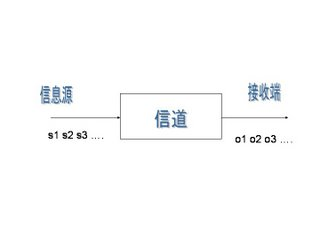
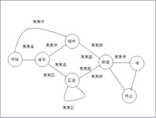
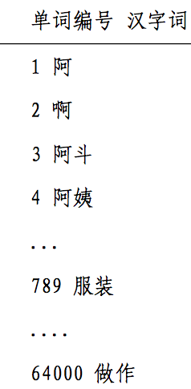
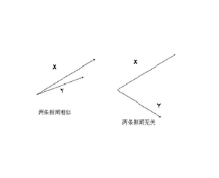
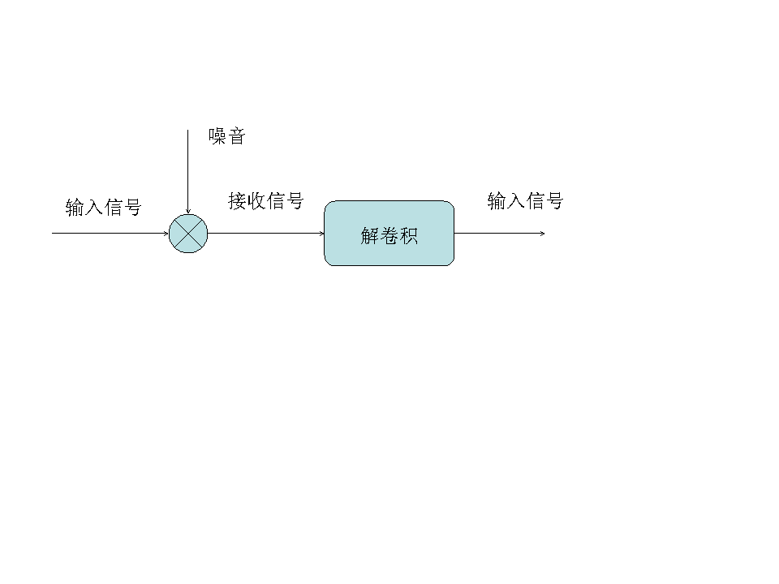
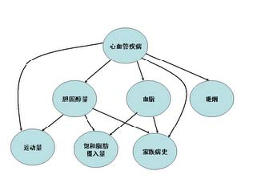
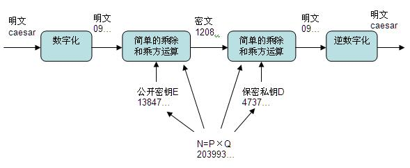
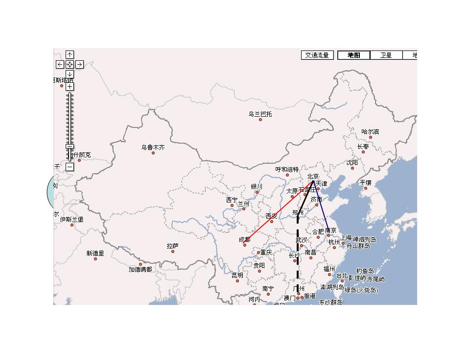
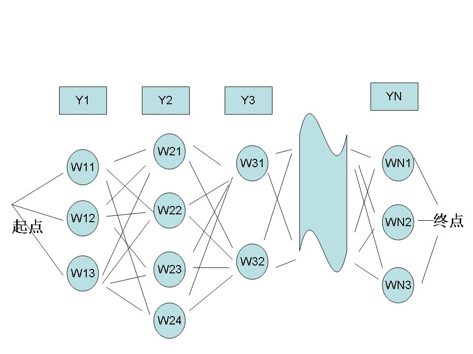

    作者:  [美] 吴军 
    出版社: 人民邮电出版社
    出版年: 2012-5-1
    页数: 272
    定价: 45.00元
    装帧: 平装
    ISBN: 9787115282828

[豆瓣链接](https://book.douban.com/subject/10750155/)

- [一 统计语言模型(马尔可夫假设)](#%e4%b8%80-%e7%bb%9f%e8%ae%a1%e8%af%ad%e8%a8%80%e6%a8%a1%e5%9e%8b%e9%a9%ac%e5%b0%94%e5%8f%af%e5%a4%ab%e5%81%87%e8%ae%be)
- [二 谈谈中文分词(动态规化与维特比算法)](#%e4%ba%8c-%e8%b0%88%e8%b0%88%e4%b8%ad%e6%96%87%e5%88%86%e8%af%8d%e5%8a%a8%e6%80%81%e8%a7%84%e5%8c%96%e4%b8%8e%e7%bb%b4%e7%89%b9%e6%af%94%e7%ae%97%e6%b3%95)
- [三 隐含马尔可夫模型在语言处理中的应用](#%e4%b8%89-%e9%9a%90%e5%90%ab%e9%a9%ac%e5%b0%94%e5%8f%af%e5%a4%ab%e6%a8%a1%e5%9e%8b%e5%9c%a8%e8%af%ad%e8%a8%80%e5%a4%84%e7%90%86%e4%b8%ad%e7%9a%84%e5%ba%94%e7%94%a8)
- [四 怎样度量信息?(信息熵)](#%e5%9b%9b-%e6%80%8e%e6%a0%b7%e5%ba%a6%e9%87%8f%e4%bf%a1%e6%81%af%e4%bf%a1%e6%81%af%e7%86%b5)
- [五 简单之美:布尔代数和搜索引擎的索引(倒排索引)](#%e4%ba%94-%e7%ae%80%e5%8d%95%e4%b9%8b%e7%be%8e%e5%b8%83%e5%b0%94%e4%bb%a3%e6%95%b0%e5%92%8c%e6%90%9c%e7%b4%a2%e5%bc%95%e6%93%8e%e7%9a%84%e7%b4%a2%e5%bc%95%e5%80%92%e6%8e%92%e7%b4%a2%e5%bc%95)
- [六 图论和网络爬虫 (哈希表)](#%e5%85%ad-%e5%9b%be%e8%ae%ba%e5%92%8c%e7%bd%91%e7%bb%9c%e7%88%ac%e8%99%ab-%e5%93%88%e5%b8%8c%e8%a1%a8)
- [七 信息论在信息处理中的应用(信息熵，互信息，相对熵)](#%e4%b8%83-%e4%bf%a1%e6%81%af%e8%ae%ba%e5%9c%a8%e4%bf%a1%e6%81%af%e5%a4%84%e7%90%86%e4%b8%ad%e7%9a%84%e5%ba%94%e7%94%a8%e4%bf%a1%e6%81%af%e7%86%b5%e4%ba%92%e4%bf%a1%e6%81%af%e7%9b%b8%e5%af%b9%e7%86%b5)
- [八 贾里尼克的故事和现代语言处理(隐含马尔可夫模型,BCJR 算法)](#%e5%85%ab-%e8%b4%be%e9%87%8c%e5%b0%bc%e5%85%8b%e7%9a%84%e6%95%85%e4%ba%8b%e5%92%8c%e7%8e%b0%e4%bb%a3%e8%af%ad%e8%a8%80%e5%a4%84%e7%90%86%e9%9a%90%e5%90%ab%e9%a9%ac%e5%b0%94%e5%8f%af%e5%a4%ab%e6%a8%a1%e5%9e%8bbcjr-%e7%ae%97%e6%b3%95)
- [九 如何确定网页和查询的相关性(TF/IDF)](#%e4%b9%9d-%e5%a6%82%e4%bd%95%e7%a1%ae%e5%ae%9a%e7%bd%91%e9%a1%b5%e5%92%8c%e6%9f%a5%e8%af%a2%e7%9a%84%e7%9b%b8%e5%85%b3%e6%80%a7tfidf)
- [十 有限状态机和地址识别](#%e5%8d%81-%e6%9c%89%e9%99%90%e7%8a%b6%e6%80%81%e6%9c%ba%e5%92%8c%e5%9c%b0%e5%9d%80%e8%af%86%e5%88%ab)
- [十一 Google阿卡47的制造者阿米特.辛格博士](#%e5%8d%81%e4%b8%80-google%e9%98%bf%e5%8d%a147%e7%9a%84%e5%88%b6%e9%80%a0%e8%80%85%e9%98%bf%e7%b1%b3%e7%89%b9%e8%be%9b%e6%a0%bc%e5%8d%9a%e5%a3%ab)
- [十二 余弦定理和新闻的分类](#%e5%8d%81%e4%ba%8c-%e4%bd%99%e5%bc%a6%e5%ae%9a%e7%90%86%e5%92%8c%e6%96%b0%e9%97%bb%e7%9a%84%e5%88%86%e7%b1%bb)
- [十三 信息指纹及其应用](#%e5%8d%81%e4%b8%89-%e4%bf%a1%e6%81%af%e6%8c%87%e7%ba%b9%e5%8f%8a%e5%85%b6%e5%ba%94%e7%94%a8)
- [十六 不要把所有的鸡蛋放在一个篮子里-谈谈最大熵模型](#%e5%8d%81%e5%85%ad-%e4%b8%8d%e8%a6%81%e6%8a%8a%e6%89%80%e6%9c%89%e7%9a%84%e9%b8%a1%e8%9b%8b%e6%94%be%e5%9c%a8%e4%b8%80%e4%b8%aa%e7%af%ae%e5%ad%90%e9%87%8c-%e8%b0%88%e8%b0%88%e6%9c%80%e5%a4%a7%e7%86%b5%e6%a8%a1%e5%9e%8b)
- [十七 闪光的不一定是金子 -- 谈谈搜索引擎作弊问题 (解卷积)](#%e5%8d%81%e4%b8%83-%e9%97%aa%e5%85%89%e7%9a%84%e4%b8%8d%e4%b8%80%e5%ae%9a%e6%98%af%e9%87%91%e5%ad%90----%e8%b0%88%e8%b0%88%e6%90%9c%e7%b4%a2%e5%bc%95%e6%93%8e%e4%bd%9c%e5%bc%8a%e9%97%ae%e9%a2%98-%e8%a7%a3%e5%8d%b7%e7%a7%af)
- [十八 矩阵运算和文本处理中的分类问题(奇异值分解)](#%e5%8d%81%e5%85%ab-%e7%9f%a9%e9%98%b5%e8%bf%90%e7%ae%97%e5%92%8c%e6%96%87%e6%9c%ac%e5%a4%84%e7%90%86%e4%b8%ad%e7%9a%84%e5%88%86%e7%b1%bb%e9%97%ae%e9%a2%98%e5%a5%87%e5%bc%82%e5%80%bc%e5%88%86%e8%a7%a3)
- [十九 马尔可夫链的扩展贝叶斯网络 (Bayesian Networks)](#%e5%8d%81%e4%b9%9d-%e9%a9%ac%e5%b0%94%e5%8f%af%e5%a4%ab%e9%93%be%e7%9a%84%e6%89%a9%e5%b1%95%e8%b4%9d%e5%8f%b6%e6%96%af%e7%bd%91%e7%bb%9c-bayesian-networks)
- [二十一 布隆过滤器(Bloom Filter)](#%e4%ba%8c%e5%8d%81%e4%b8%80-%e5%b8%83%e9%9a%86%e8%bf%87%e6%bb%a4%e5%99%a8bloom-filter)
- [二十二 由电视剧《暗算》所想到的-谈谈密码学的数学原理](#%e4%ba%8c%e5%8d%81%e4%ba%8c-%e7%94%b1%e7%94%b5%e8%a7%86%e5%89%a7%e6%9a%97%e7%ae%97%e6%89%80%e6%83%b3%e5%88%b0%e7%9a%84-%e8%b0%88%e8%b0%88%e5%af%86%e7%a0%81%e5%ad%a6%e7%9a%84%e6%95%b0%e5%ad%a6%e5%8e%9f%e7%90%86)
- [二十三 输入一个汉字需要敲多少个键-谈谈香农第一定律](#%e4%ba%8c%e5%8d%81%e4%b8%89-%e8%be%93%e5%85%a5%e4%b8%80%e4%b8%aa%e6%b1%89%e5%ad%97%e9%9c%80%e8%a6%81%e6%95%b2%e5%a4%9a%e5%b0%91%e4%b8%aa%e9%94%ae-%e8%b0%88%e8%b0%88%e9%a6%99%e5%86%9c%e7%ac%ac%e4%b8%80%e5%ae%9a%e5%be%8b)
- [二十四 从全球导航到输入法-谈谈动态规划](#%e4%ba%8c%e5%8d%81%e5%9b%9b-%e4%bb%8e%e5%85%a8%e7%90%83%e5%af%bc%e8%88%aa%e5%88%b0%e8%be%93%e5%85%a5%e6%b3%95-%e8%b0%88%e8%b0%88%e5%8a%a8%e6%80%81%e8%a7%84%e5%88%92)

## 一 统计语言模型(马尔可夫假设)
在很多涉及到自然语言处理的领域,如机器翻译、语音识别、印刷体或手写体识别、拼写纠错、汉字输入和文献查询中,我们都需要知道一个文字序列是否能构成一个大家能理解的句子,显示给使用者。对这个问题,我们可以用一个简单的统计模型来解决这个问题。

如果 S 表示一连串特定顺序排列的词 $w_1, w_2,..., w_n$ , 换句话说,S 可以表示某一个由一连串特定顺序排练的词而组成的一个有意义的句子。现在,机器对语言的识别从某种角度来说, 就是想知道 S 在文本中出现的可能性,也就是数学上所说的 S 的 概率用 P(S) 来表示。利用条件概率的公式,S 这个序列出现的概率等于每一个词出现的概率相乘,于是 P(S) 可展开为:

$P(S) = P(w_1)P(w_2|w_1)P(w_3|w_1w_2)...P(w_n|w_1w_2...w_{n-1})$

其中 $P(w_1)$ 表示第一个词 $w_1$ 出现的概率;$P(w_2|w_1)$是在已知第一个词的前提下,第二个词出现的概率;以次类推。不难看出,到了词$w_n$,它的出现概率取决于它前面所有词。从计算上来看,各种可能性太多,无法实现。因此我们假定任意一个词 $w_i$ 的出现概率只同它前面的词 $w_{i-1}$ 有关(即马尔可夫假设), 于是问题就变得很简单了。现在,S 出现的概率就变为:

$P(S) = P(w_1)P(w_2|w_1)P(w_3|w_2)...P(w_i|w_{i-1})...$

接下来的问题就是如何估计$P(w_i|w_{i-1})$。现在有了大量机读文本后,这个问题变得很简单,只要数一数这对词$(w_{i-1},w_i)$在统计的文本中出现了多少次,以及$w_{i-1}$本身在同样的文本中前后相邻出现了多少次,然后用两个数一除就可以了,

$P(w_i|w_{i-1}) = \frac{P(w_{i-1},w_i)}{P(w_{i-1})}$


## 二 谈谈中文分词(动态规化与维特比算法)
用 “查字典” 法,其实就是我们把一个句子从左向右扫描一遍,遇到字典里有的词就标识出来,遇到复合词(比如 “上海大学”)就找最长的词匹配,遇到不认识的字串就分割成单字词,于是简单的分词就完成了。

这种方法一个明显的不足是当遇到有二义性(有双重理解意思)的分割时就无能为力了。比如,对短语 “发展中国家” 正确的分割是“发展-中-国家”,而从左向右查字典的办法会将它分割成“发展-中国-家”,显然是错了。另外,并非所有的最长匹配都一定是正确的。比如“上海大学城书店”的正确分词应该是 “上海-大学城-书店,” 而不是 “上海大学-城-书店”。

利用统计语言模型分词的方法,可以用几个数学公式简单概括如下:

我们假定一个句子 S 可以有几种分词方法,为了简单起见我们假定有以下三种:

```
A1, A2, A3, ..., Ak,
B1, B2, B3, ..., Bm
C1, C2, C3, ..., Cn
```

其中,A1, A2, B1, B2, C1, C2等等都是汉语的词。那么最好的一种分词方法应该保证分完词后这个句子出现的概率最大。 也就是说如果 A1,A2,..., Ak 是最好的分法,那么 (P 表示概率):

```
P(A1,A2,A3,...,Ak) > P(B1,B2,B3,...,Bm)
P(A1,A2,A3,...,Ak) > P(C1,C2,C3,...,Cn)
```

如果我们穷举所有可能的分词方法并计算出每种可能性下句子的概率,那么计算量是相当大的。因此,我们可以把它看成是一个动态规划(Dynamic Programming)的问题,并利用 “维特比”(Viterbi) 算法快速地找到最佳分词。

## 三 隐含马尔可夫模型在语言处理中的应用
自然语言是人类交流信息的工具。很多自然语言处理问题都可以等同于通信系统中的解码问题 -- 一个人根据接收到的信息,去猜测发话人要表达的意思。这其实就象通信中,我们根据接收端收到的信号去分析、理解、还原发送端传送过来的信息。 

以下该图就表示了一个典型的通信系统:



其中 $s_1,s_2,s_3...$表示信息源发出的信号。$o_1, o_2, o_3...$是接受器接收到的信号。通信中的解码就是根据接收到的信$o_1, o_2, o_3...$还原出发送的信号$s_1,s_2,s_3...$。

当我们观测到语音信$o_1, o_2, o_3$时,我们要根据这组信号推测出发送的句子 $s_1,s_2,s_3$。显然,我们应该在所有可能的句子中找最有可能性的一个。用数学语言来描述,就是在已$o_1, o_2, o_3$的情况下, 求使得条件概率

$P(s_1,s_2,s_3,...|o_1,o_2,o_3....)$ 达到最大值的那个句子$s_1,s_2,s_3...$

当然,上面的概率不容易直接求出,于是我们可以间接地计算它。利用贝叶斯公式并且省掉一个常数项,可以把上述公式等价变换成

$P(o_1,o_2,o_3....|s_1,s_2,s_3,...)P(s_1,s_2,s_3,...)$

其中$P(o_1,o_2,o_3....|s_1,s_2,s_3,...)$表示某句话$s_1,s_2,s_3...$被读成 $o_1, o_2, o_3...$的可能性, 而$P(s_1,s_2,s_3,...)$ 表示字串 $s_1,s_2,s_3...$本身能够成为一个合乎情理的句子的可能性,所以这个公式的意义是用发送信号为$s_1,s_2,s_3...$这个数列的可能性乘以 $s_1,s_2,s_3...$本身可以一个句子的可能性,得出概率。

我们在这里做两个假设:

* $s_1,s_2,s_3...$是一个马尔可夫链,也就是说,$s_i$ 只由$s_{i-1}$决定 (详见系列一);
* 第i时刻的接收信号$o_i$只由发送信号$s_i$决定(又称为独立输出假设, 即 $P(o_1,o_2,o_3....|s_1,s_2,s_3,...) = P(o_1|s_1)P(o_2|s_2)P(o_3|s_3)...$。


那么我们就可以很容易利用算法 Viterbi 找出上面式子的最大值,进而找出要识别的句子 $s_1,s_2,s_3...$。满足上述两个假设的模型就叫隐含马尔可夫模型。我们之所以用“隐含”这个词,是因为状态$s_1,s_2,s_3...$是无法直接观测到的。

隐含马尔可夫模型的应用远不只在语音识别中。在上面的公式中,如果我们把$s_1,s_2,s_3...$当成中文,$o_1,o_2,o_3...$当成对应的英文,那么我们就能利用这个模型解决机器翻译问题; 如果我们$o_1,o_2,o_3...$当成扫描文字得到的图像特征,就能利用这个模型解决印刷体和手写体的识别。

$P(o_1,o_2,o_3....|s_1,s_2,s_3,...)$,在语音识别中它被称为“声学模型” (Acoustic Model), 在机器翻译中是“翻译模型” (Translation Model)而在拼写校正中是“纠错模型”(Correction Model)。而$P(s_1,s_2,s_3...)$就是我们在系列一中提到的语言模型。

## 四 怎样度量信息?(信息熵)
1948 年,香农提出了“信息熵”的概念,才解决了对信息的量化度量问题。

一条信息的信息量大小和它的不确定性有直接的关系。比如说,我们要搞清楚一件非常非常不确定的事,或是我们一无所知的事情,就需要了解大量的信息。相反,如果我们对某件事已经有了较多的了解,我们不需要太多的信息就能把它搞清楚。所以,从这个角度,我们可以认为,**信息量的度量就等于不确定性的多少**。

“谁世界杯冠军”。香农指出,它的准确信息量应该是

$-(p_1logp_1+p_2logp_2+ ... +p_{32}logp_{32})$,

其中,$p_1,p_2,...,p_{32}$分别是这32个球队夺冠的概率。香农把它称为“信息熵” (Entropy),一般用符号H表示,单位是比特。有兴趣的读者可以推算一下当32个球队夺冠概率相同时,对应的信息熵等于五比特。有数学基础的读者还可以证明上面公式的值不可能大于五。对于任意一个随机变量 X (比如得冠军的球队),它的熵定义如下:

$H(X) \equiv -\sum_x p(x)log_2[P(x)]$

变量的不确定性越大,熵也就越大,把它搞清楚所需要的信息量也就越大。

有了“熵”这个概念,我们就可以回答本文开始提出的问题,即一本五十万字的中文书平均有多少信息量。我们知道常用的汉字(一级二级国标)大约有7000字。假如每个字等概率,那么我们大约需要 13 个比特(即13位二进制数)表示一个汉字。但汉字的使用是不平衡的。实际上,前 10% 的汉字占文本的 95%以上。因此,即使不考虑上下文的相关性,而只考虑每个汉字的独立的概率,那么,每个汉字的信息熵大约也只有8-9个比特。如果我们再考虑上下文相关性,每个汉字的信息熵只有 5 比特左右。所以,一本五十万字的中文书,信息量大约是 250 万比特。 如果用一个好的算法压缩一下,整本书可以存成一个320KB的文件。如果我们直接用两字节的国标编码存储这本书,大约需要1MB大小,是压缩文件的三倍。这两个数量的差距,在信息论中称作`“冗余度”(redundancy)`。需要指出的是我们这里讲的250万比特是个平均数,同样长度的书,所含的信息量可以差很多。如果一本书重复的内容很多,它的信息量就小,冗余度就大。

## 五 简单之美:布尔代数和搜索引擎的索引(倒排索引)
现在我们看看文献检索和布尔运算的关系。比如我们要找有关原子能应用的文献,但并不想知道如何造原子弹。我们可以这样写一个查询语句“原子能 AND 应用 AND (NOT 原子弹)”,表示符合要求的文献必须同时满足三个条件:

- 包含原子能
- 包含应用
- 不包含原子弹

早期的文献检索查询系统大多基于数据库,严格要求查询语句符合布尔运算。今天的搜索引擎相比之下要聪明的多,它自动把用户的查询语句转换成布尔运算的算式。当然在查询时,不能将每篇文献扫描一遍,来看看它是否满足上面三个条件,因此需要建立一个索引。

最简单索引的结构是用一个很长的二进制数表示一个关键字是否出现在每篇文献中。有多少篇文献,就有多少位数,每一位对应一篇文献,1 代表相应的文献有这个关键字,0 代表没有。 比如关键字“原子能”对应的二进制数是0100100001100001...,表示第二、第五、第九、第十、第十六篇文献包含着个关键字。注意,这个二进制数非常之长。同样,我们假定“应用”对应的二进制数是 0010100110000001...。那么要找到同时包含“原子能”和“应用”的文献时,只将这两个二进制数进行布尔运算AND。根据上面的真值表,我们知道运算结果是0000100000000001...。表示第五篇,第十六篇文献满足要求。

当然,由于这些二进制数中绝大部分位数都是零,我们只需要记录那些等于1的位数即可。于是,搜索引擎的索引就变成了一张大表:表的每一行对应一个关键词,而每一个关键词后面跟着一组数字,是包含该关键词的文献序号。

## 六 图论和网络爬虫 (哈希表)
如何自动下载互联网所有的网页呢,它要用到图论中的遍历(Traverse)算法。互联网其实就是一张大图,我们可以把每一个网页当作一个节点,把那些超链接(Hyperlinks)当作连接网页的弧。

假定我们从一家门户网站的首页出发,先下载这个网页,然后通过分析这个网页,可以找到藏在它里面的所有超链接,也就等于知道了这家门户网站首页所直接连接的全部网页,诸如雅虎邮件、雅虎财经、雅虎新闻等等。我们接下来访问、下载并分析这家门户网站的邮件等网页,又能找到其他相连的网页。我们让计算机不停地做下去,就能下载整个的互联网。当然,我们也要记载哪个网页下载过了, 以免重复。在网络爬虫中,我们使用一个称为“哈希表”(Hash Table)的列表纪录网页是否下载过的信息。

## 七 信息论在信息处理中的应用(信息熵，互信息，相对熵)
我们在系列一中谈到语言模型时,没有讲如何定量地衡量一个语言模型的好坏。我们知道,语言模型是为了用上下文预测当前的文字,模型越好,预测得越准,那么当前文字的不确定性就越小。

`信息熵`正是对不确定性的衡量,因此信息熵可以直接用于衡量统计语言模型的好坏。贾里尼克从信息熵出发,定义了一个称为语言模型复杂度(Perplexity)的概念,直接衡量语言模型的好坏。一个模型的复杂度越小,模型越好。李开复博士在介绍他发明的Sphinx语音识别系统时谈到,如果不用任何语言模型(即零元语言模型)时,复杂度为997,也就是说句子中每个位置有 997个可能的单词可以填入。如果(二元)语言模型只考虑前后词的搭配不考虑搭配的概率时,复杂度为60。虽然它比不用语言模型好很多,但是和考虑了搭配概率的二元语言模型相比要差很多,因为后者的复杂度只有20。

信息论中仅次于熵的另外两个重要的概念是“`互信息`” (Mutual Information)和“`相对熵`”(Kullback-Leibler Divergence)。

“互信息”是信息熵的引申概念,它是对两个随机事件相关性的度量。比如说今天随机事件北京下雨和随机变量空气湿度的相关性就很大,但是和姚明所在的休斯敦火箭队是否能赢公牛队几乎无关。互信息就是用来量化度量这种相关性的。在自然语言处理中,经常要度量一些语言现象的相关性。比如在机器翻译中, 最难的问题是词义的二义性(歧义性)问题。比如 Bush 一词可以是美国总统的名字,也可以是灌木丛。

相对熵用来衡量两个正函数是否相似,对于两个完全相同的函数,它们的相对熵等于零。在自然语言处理中可以用相对熵来衡量两个常用词(在语法上和语义上)是否同义,或者两篇文章的内容是否相近等等。利用相对熵,我们可以到处信息检索中最重要的一个概念:词频率-逆向文档频率(`TF/IDF`)。

## 八 贾里尼克的故事和现代语言处理(隐含马尔可夫模型,BCJR 算法)
在贾里尼克以前,科学家们把语音识别问题当作人工智能问题和模式匹配问题。而贾里尼克把它当成通信问题,并用两个隐含马尔可夫模型(声学模型和语言模型)把语音识别概括得清清楚楚。

贾里尼克和波尔,库克以及拉维夫对人类的另一大贡献是 BCJR 算法,这是今天数字通信中应用的最广的两个算法之一(另一个是维特比算法)。

## 九 如何确定网页和查询的相关性(TF/IDF)
我们知道,短语“原子能的应用”可以分成三个关键词:原子能、的、应用。根据我们的直觉,我们知道,包含这三个词多的网页应该比包含它们少的网页相关。当然,这个办法有一个明显的漏洞,就是长的网页比短的网页占便宜,因为长的网页总的来讲包含的关键词要多些。因此我们需要根据网页的长度,对关键词的次数进行归一化,也就是用关键词的次数除以网页的总字数。我们把这个商称为“关键词的频率”,或者“单文本词汇频率”(Term Frequency),比如,在某个一共有一千词的网页中“原子能”、“的”和“应用”分别出现了 2 次、35 次 和 5 次,那么它们的词频就分别是 0.002、0.035 和 0.005。 我们将这三个数相加,其和 0.042 就是相应网页和查询“原子能的应用”。

相关性的一个简单的度量。概括地讲,如果一个查询包含关键词 $w_1,w_2,...,w_N$, 它们在一篇特定网页中的词频分别是: $TF_1, TF_2, ..., TF_N$。 (TF: term frequency)。 那么,这个查询和该网页的相关性就是:

$TF_1 + TF_2 + ... + TF_N$。

在上面的例子中,词“的” 站了总词频的 80% 以上,而它对确定网页的主题几乎没有用。 我们称这种词叫“应删除词”(Stopwords),也就是说在度量相关性是不应考虑它们的频率。

一个词预测主题能力越强,权重就越大,反之,权重就越小。我们在网页中看到“原子能”这个词,或多或少地能了解网页的主题。我们看到“应用”一次,对主题基本上还是一无所知。因此,“原子能“的权重就应该比应用大。

应删除词的权重应该是零。

如果一个关键词只在很少的网页中出现,我们通过它就容易锁定搜索目标,它的权重也就应该大。反之如果一个词在大量网页中出现,我们看到它仍然不很清楚要找什么内容,因此它应该小。概括地讲,假定一个关键词 w 在 Dw网页中出现过,那么Dw越大,w的权重越小,反之亦然。 在信息检索中,使用最多的权重是“逆文本频率指数”(Inverse document frequency缩写为IDF),它的公式为log(D/ Dw)其中D是全部网页数。

我们假定中文网页数是D= 10亿,应删除词“的”在所有的网页中都出现,即Dw=10 亿,那么它的IDF=log(10 亿/10 亿)= log (1) = 0。假如专用词“原子能”在两百万个网页中出现,即Dw=200万, 则它的权重IDF=log(500) =6.2。又假定通用词“应用”,出现在五亿个网页中,它的权重IDF = log(2),则只有 0.7。

利用 IDF,上述相关性计算个公式就由词频的简单求和变成了加权求和,即 $TF_1 \times IDF_1 + TF_2 \times IDF_2 +... + TF_N \times IDF_N$。

TF/IDF(term frequency/inverse document frequency) 的概念被公认为信息检索中最重要的发明。在搜索、文献分类和其他相关领域有广泛的应用。

## 十 有限状态机和地址识别
一个有限状态机是一个特殊的有向图,它包括一些状态(节点)和连接这些状态的有向弧。每一个有限状态机都有一个启始状态和一个终止状态和若干中间状态。每一条弧上带有从一个状态进入下一个状态的条件。



使用有限状态机识别地址,关键要解决两个问题,即通过一些有效的地址建立状态机,以及给定一个有限状态机后,地址字串的匹配算法。

上述基于有限状态机的地址识别方法在实用中会有一些问题:当用户输入的地址不太标准或者有错别字时,有限状态机会束手无策,因为它只能进行严格匹配。为了解决这个问题,我们希望有一个能进行模糊匹配、并给出一个字串为正确地址的可能性。为了实现这一目的,科学家们提出了基于概率的有限状态机。这种基于概率的有限状态机和离散的马尔可夫链(详见前面关于马尔可夫模型的系列)基本上等效。

## 十一 Google阿卡47的制造者阿米特.辛格博士
辛格、Matt Cutts、马丁和我四个人当时一同研究和解决网络搜索中的作弊问题(Spam)。我们需要建一个分类器,我以前一直在学术界工作和学习,比较倾向找一个很漂亮的解决方案。我设计了一个很完美的分类器,大约要花三个月到半年时间来实现和训练,而辛格认为找个简单有效的办法就行了。我们于是尽可能简化问题,一、两个月就把作弊的数量减少了一半。

## 十二 余弦定理和新闻的分类
Google 的新闻是自动分类和整理的。所谓新闻的分类无非是要把相似的新闻放到一类中。

我们来看看怎样找一组数字,或者说一个向量来描述一篇新闻。回忆一下我们在“如何度量网页相关性”一文中介绍的TF/IDF的概念。对于一篇新闻中的所有实词,我们可以计算出它们的单文本词汇频率/逆文本频率值(TF/IDF)。不难想象,和新闻主题有关的那些实词频率高,TF/IDF 值很大。我们按照这些实词在词汇表的位置对它们的 TF/IDF 值排序。

比如,词汇表有六万四千个词,分别为



在一篇新闻中,这 64,000 个词的 TF/IDF 值分别为


如果单词表中的某个词在新闻中没有出现,对应的值为零, 那么这 64,000 个数,组成一个 64,000 维的向量。我们就用这个向量来代表这篇新闻,并成为新闻的特征向量。如果两篇新闻的特征向量相近,则对应的新闻内容相似,它们应当归在一类, 反之亦然。

假定三角形的三条边为 a,b 和 c,对应的三个角为 A,B 和 C,那么角 A 的余弦

$cosA=\frac{b^2+c^2-a^2}{2bc}$

如果我们将三角形的两边 b 和 c 看成是两个向量,那么上述公式等价于

$cosA=\frac{<b,c>}{|b||c|}$

其中分母表示两个向量 b 和 c 的长度,分子表示两个向量的内积。

举一个具体的例子,假如新闻 X 和新闻 Y 对应向量分别是$x_1,x_2,...,x_{64000}$ 和 $y_1,y_2,...,y_{64000}$, 那么它们夹角的余弦等于,

$cos\theta=\frac{x_1y_1+x_2y_2+\cdots+x_{64000}y_{64000}}{\sqrt{x_1^2+x_2^2+\cdots+x_{64000}^2} \cdot \sqrt{y_1^2+y_2^2+\cdots+y_{64000}^2}}$

当两条新闻向量夹角的余弦等于一时,这两条新闻完全重复 (用这个办法可以删除重复的网页);当夹角的余弦接近于一时, 两条新闻相似,从而可以归成一类;夹角的余弦越小,两条新闻越不相关。



## 十三 信息指纹及其应用
我们在图论和网络爬虫一文中提到,为了防止重复下载同一个网页,我们需要在哈希表中纪录已经访问过的网址(URL)。但是在哈希表中以字符串的形式直接存储网址,既费内存空间,又浪费查找时间。现在的网址一般都较长。

假定网址的平均长度为一百个字符,那么存贮 200 亿个网址本身至少需要 2 TB,即两千 GB 的容量,考虑到哈希表的存储效率一般只有 50%,实际需要的内存在 4 TB 以上。即使把这些网址放到了计算机的内存中,由于网址长度不固定,以字符串的 形式查找的效率会很低。因此,我们如果能够找到一个函数,将这 200 亿个网址随机地映射到128 二进位即 16 个字节的整数空间,比如将上面那个很长的字符串对应成一个如下的随机数:

    893249432984398432980545454543

这样每个网址只需要占用16个字节而不是原来的一百个。这就能把存储网址的内存需求量降低到原来的 1/6。这个 16 个字节的随机数,就称做该网址的`信息指纹(Fingerprint)`。

产生信息指纹的关键算法是伪随机数产生器算法(prng)。这种方法产生的数字并不很随机,也就是说两个不同信息很有可能有同一指纹。现在常用的 MersenneTwister 算法要好得多。

信息指纹的用途远不止网址的消重,信息指纹的的孪生兄弟是密码。信息指纹的一个特征是其不可逆性, 也就是说, 无法根据信息指纹推出原有信息,这种性质, 正是网络加密传输所需要的。比如说,一个网站可以根据用户的 Cookie 识别不同用户,这个 cookie 就是信息指纹。但是网站无法根据信息指纹了解用户的身份,这样就可以保护用户的隐私。

从加密的角度讲 MersenneTwister,算法并不好,因为它产生的随机数有相关性。互联网上加密要用基于加密伪随机数产生器(csprng)。常用的算法有 MD5 或者 SHA1 等标准,它们可以将不定长的信息变成定长的 128 二进位或者 160 二进位随机数。

## 十六 不要把所有的鸡蛋放在一个篮子里-谈谈最大熵模型
最大熵原理指出,当我们需要对一个随机事件的概率分布进行预测时,我们的预测应当满足全部已知的条件,而对未知的情况不要做任何主观假设。在这种情况下,概率分布最均匀,预测的风险最小。因为这时概率分布的信息熵最大,所以人们称这种模型叫“最大熵模型”。

匈牙利著名数学家、信息论最高奖香农奖得主希萨(Csiszar)证明,**对任何一组不自相矛盾的信息,这个最大熵模型不仅存在,而且是唯一的**。而且它们都有同一个非常简单的形式 -- 指数函数。下面公式是根据上下文(前两个词) 和主题预测下一个词的最大熵模型,其中 w3 是要预测的词(王晓波或者王小波)w1和w2是它的前两个字(比如说它们分别是“出版”,和“”),也就是其上下文的一个大致估计,subject 表示主题。

$P(w_3|w_1,w_2,subject)=\frac{e^{\lambda_1(w_1,w_2,w_3)+\lambda_2(subject,w_3)}}{Z(w_1,w_2,subject)}$

在上面的公式中,有几个参数lambda和Z,他们需要通过观测数据训练出来。最原始的最大熵模型的训练方法是一种称为通用迭代算法 GIS(generalized iterative scaling) 的迭代算法。GIS 的原理并不复杂,大致可以概括为以下几个步骤:

* 假定第零次迭代的初始模型为等概率的均匀分布。
* 用第 N 次迭代的模型来估算每种信息特征在训练数据中的分布,如果超过了实际的,就把相应的模型参数变小;否则, 将它们变大。
* 重复步骤 2 直到收敛。

第一个在实际信息处理应用中验证了最大熵模型的优势的,是宾夕法尼亚大学马库斯的另一个高徒原 IBM 现微软的研究员拉纳帕提(Adwait Ratnaparkhi)。拉纳帕提的聪明之处在于他没有对最大熵模型进行近似,而是找到了几个最适合用最大熵模型、而计算量相对不太大的自然语言处理问题,比如词性标注和句法分析。拉纳帕提成功地将上下文信息、词性(名词、动词和形容词等)、句子成分(主谓宾)通过最大熵模型结合起来,做出了当时世界上最好的词性标识系统和句法分析器。

## 十七 闪光的不一定是金子 -- 谈谈搜索引擎作弊问题 (解卷积)
抓作弊的方法很像信号处理中的去噪音的办法。学过信息论和有信号处理经验的读者可能知道这么一个事实,我们如果在发动机很吵的汽车里用手机打电话,对方可能听不清;但是如果我们知道了汽车发动机的频率,我们可以加上一个和发动机噪音相反的信号,很容易地消除发动机的噪音,这样,收话人可以完全听不到汽车的噪音。事实上,现在一些高端的手机已经有了这种检测和消除噪音的功能。消除噪音的流程可以概括如下:



在图中,原始的信号混入了噪音,在数学上相当于两个信号做`卷积`。噪音消除的过程是一个`解卷积`的过程。这在信号处理中并不是什么难题。因为第一,汽车发动机的频率是固定的,第二, 这个频率的噪音重复出现,只要采集几秒钟的信号进行处理就能做到。从广义上讲,只要噪音不是完全随机的、并且前后有相关性,就可以检测到并且消除。(事实上,完全随机不相关的高斯白噪音是很难消除的。)

搜索引擎的作弊者所作的事,就如同在手机信号中加入了噪音,使得搜索结果的排名完全乱了。但是,这种人为加入的噪音并不难消除,因为作弊者的方法不可能是随机的(否则就无法提高排名了)。而且,作弊者也不可能是一天换一种方法,即作弊方法是时间相关的。因此,搞搜索引擎排名算法的人,可以在搜集一段时间的作弊信息后,将作弊者抓出来,还原原有的排名。

## 十八 矩阵运算和文本处理中的分类问题(奇异值分解)
在自然语言处理中,最常见的两类的分类问题分别是,将文本按主题归类(比如将所有介绍亚运会的新闻归到体育类)和将词汇表中的字词按意思归类(比如将各种体育运动的名称个归成一类)。

从理论上讲, 余弦定理这种算法非常好。但是计算时间特别长。通常,我们要处理的文章的数量都很大,至少在百万篇以上,二次回标有非常长,比如说有五十万个词(包括人名地名产品名称等等)。如果想通过对一百万篇文章两篇两篇地成对比较,来找出所有共同主题的文章,就要比较五千亿对文章。现在的计算机一秒钟最多可以比较一千对文章,完成这一百万篇文章相关性比较就需要十五年时间。注意,要真正完成文章的分类还要反复重复上述计算。

在文本分类中,另一种办法是利用矩阵运算中的奇异值分解 (Singular Value Decomposition,简称 SVD)。首先,我们可以用一个大矩阵A来描述这一百万篇文章和五十万词的关联性。这个矩阵中,每一行对应一篇文章,每一列对应一个词。


在上面的图中,M=1,000,000,N=500,000。第 i 行,第 j 列的元素,是字典中第 j 个词在第 i 篇文章中出现的加权词频 (比如,TF/IDF)。读者可能已经注意到了,这个矩阵非常大, 有一百万乘以五十万,即五千亿个元素。

`奇异值分解`就是把上面这样一个大矩阵,分解成三个小矩阵相乘,如下图所示。比如把上面的例子中的矩阵分解成一个一百万乘以一百的矩阵X,一个一百乘以一百的矩阵B,和一个一百乘以五十万的矩阵 Y。这三个矩阵的元素总数加起来也不过1.5亿,仅仅是原来的三千分之一。相应的存储量和计算量都会小三个数量级以上。


三个矩阵有非常清楚的物理含义。第一个矩阵X中的每一行表示意思相关的一类词,其中的每个非零元素表示这类词中每个词的重要性(或者说相关性),数值越大越相关。最后一个矩阵 Y 中的每一列表示同一主题一类文章,其中每个元素表示这类文章中每篇文章的相关性。中间的矩阵则表示类词和文章之间的相关性。因此,我们只要对关联矩阵A进行一次奇异值分解,我们就可以同时完成了近义词分类和文章的分类。(同时得到每类文章和每类词的相关性)。

## 十九 马尔可夫链的扩展贝叶斯网络 (Bayesian Networks)
系列中多次提到马尔可夫链(MarkovChain),它描述了一种状态序列,其每个状态值取决于前面有限个状态。这种模型,对很多实际问题来讲是一种很粗略的简化。在现实生活中,很多事物相互的关系并不能用一条链来串起来。它们之间的关系可能是交叉的、错综复杂的。比如在下图中可以看到,心血管疾病和它的成因之间的关系是错综复杂的。显然无法用一个链来表示。



我们可以把上述的有向图看成一个网络,它就是`贝叶斯网络`。其中每个圆圈表示一个状态。状态之间的连线表示它们的因果关系。比如从心血管疾病出发到吸烟的弧线表示心血管疾病可能和吸烟有关。当然,这些关系可以有一个量化的可信度(belief),用一个概率描述。我们可以通过这样一张网络估计出一个人的心血管疾病的可能性。在网络中每个节点概率的计算,可以用贝叶斯公式来进行,贝叶斯网络因此而得名。由于网络的每个弧有一个可信度,贝叶斯网络也被称作信念网络 (belief networks)。

使用贝叶斯网络必须知道各个状态之间相关的概率。得到这些参数的过程叫做训练。和训练马尔可夫模型一样,训练贝叶斯网络要用一些已知的数据。比如在训练上面的网络,需要知道一些心血管疾病和吸烟、家族病史等有关的情况。相比马尔可夫链,贝叶斯网络的训练比较复杂,从理论上讲,它是一个**NP-complete问题**。

## 二十一 布隆过滤器(Bloom Filter)
布隆过滤器是由巴顿.布隆于一九七零年提出的。它实际上是一个很长的二进制向量和一系列随机映射函数。

假定我们存储一亿个电子邮件地址,我们先建立一个十六亿二进制(比特),即两亿字节的向量,然后将这十六亿个二进制全部设置为零。对于每一个电子邮件地址X,我们用八个不同的随机数产生器(F1,F2, ...,F8) 产生八个信息指纹(f1, f2, ..., f8)。再用一个随机数产生器 G 把这八个信息指纹映射到1到十六亿中的八个自然数g1,g2,...,g8。现在我们把这八个位置的二进制全部设置为一。当我们对这一亿个 email 地址都进行这样的处理后。一个针对这些 email 地址的布隆过滤器就建成了。(见下图)


现在,让我们看看如何用布隆过滤器来检测一个可疑的电子邮件地址Y是否在黑名单中。我们用相同的八个随机数产生器(F1,F2,...,F8)对这个地址产生八个信息指纹s1,s2,...,s8,然后将这八个指纹对应到布隆过滤器的八个二进制位,分别是t1,t2,...,t8。如果Y在黑名单中,显然, t1,t2,..,t8 对应的八个二进制一定是一。这样在遇到任何在黑名单中的电子邮件地址,我们都能准确地发现。

**布隆过滤器决不会漏掉任何一个在黑名单中的可疑地址**。但是,它有一条不足之处。也就是**它有极小的可能将一个不在黑名单中的电子邮件地址判定为在黑名单中**,因为有可能某个好的邮件地址正巧对应个八个都被设置成一的二进制位。好在这种可能性很小。我们把它称为`误识概率`。

## 二十二 由电视剧《暗算》所想到的-谈谈密码学的数学原理
我们以给上面的单词 Caesar 加解密来说明它的原理。我们先把它变成一组数,比如它的 Ascii 代码 X=099097101115097114(每三位代表一个字母)做明码。现在我们来设计一个密码系统,对这个明码加密。

* 找两个很大的素数(质数)P 和 Q,越大越好,比如 100 位长的, 然后计算它们的乘积 N=P×Q,M=(P-1)×(Q-1)。
* 找一个和 M 互素的整数 E,也就是说 M 和 E 除了 1 以外没有公约数。
* 找一个整数 D,使得 E×D 除以 M 余 1,即 E×D mod M= 1。


在世界上先进的、最常用的密码系统就设计好了,其中 E是公钥谁都可以用来加密,D 是私钥用于解密,一定要自己保存好。乘积 N 是公开的,即使敌人知道了也没关系。

现在,我们用下面的公式对 X 加密,得到密码 Y。

$X^E\ mod\ N = Y$

好了,现在没有密钥 D,神仙也无法从Y中恢复X。如果知道D,根据费尔马小定理,则只要按下面的公式就可以轻而易举地从 Y 中得到 X。

$Y^D\ mod\ N=X$

这个过程大致可以概况如下:



## 二十三 输入一个汉字需要敲多少个键-谈谈香农第一定律
我们假定常用的汉字在二级国标里面,一共有6700个作用的汉字。如果不考虑汉字频率的分布,用键盘上的 26 个字母对汉字编码,两个字母的组合只能对 676 个汉字编码,对 6700 个汉字编码需要用三个字母的组合,即编码长度为三。当然,聪明的读者马上发现了我们可以对常见的字用较短的编码对不常见的字用较长的编码,这样平均起来每个汉字的编码长度可以缩短。我们假定每一个汉字的频率是

$p_1, p_2, p_3, ..., p_{6700}$

它们编码的长度是

$L_1, L_2, L_3, ..., L_{6700}$

那么,平均编码长度是

$p_1 \times L_1 + p_2 \times L_2 + ... + p_{6700} \times L_{6700}$

`香农第一定理`指出:这个编码的长度的最小值是汉字的信息熵,也就是说任何输入方面不可能突破信息熵给定的极限。

汉字的信息熵

$H = -p_1logp_1 - ... - p_{6700} logp_{6700}$。

我们如果对每一个字进行统计,而且不考虑上下文相关性,大致可以估算出它的值在十比特以内,当然这取决于用什么语料库来做估计。如果我们假定输入法只能用26个字母输入,那么每个字母可以代表 log26=4.7 比特的信息,也就是说,输入一个汉字平均需要敲 10/4.7= 2.1 次键。

我们把汉字组成词,再以词为单位统计信息熵,那么,每个汉字的平均信息熵将会减少。这样,平均输入一个字可以少敲零点几次键盘。不考虑词的上下文相关性,以词为单位统计,汉字的信息熵大约是 8 比特作用,也就是说,以词为单位输入一个汉字平均只需要敲 8/4.7=1.7 次键。

我们再考虑上下文的相关性,对汉语建立一个基于词的统计语言模型我们可以将每个汉字的信息熵降到 6 比特作用,这时,输入一个汉字只要敲 6/4.7=1.3 次键。

## 二十四 从全球导航到输入法-谈谈动态规划
所有的导航系统采用的都是动态规划的办法(DynamicProgramming)，以上面的问题为例,当我们要找从北京到广州的最短路线时,



我们先不妨倒过来想这个问题:假如我们找到了所要的最短路线(称为路线一),如果它经过郑州,那么从北京到郑州的这条子路线(比如是北京->保定->石家庄->郑州,称为子路线一),必然也是所有从北京到郑州的路线中最短的。否则的话,我们可以假定还存在从北京到郑州更短的路线(比如北京-> 济南->徐州->郑州,称为子路线二),那么只要用这第二条子路线代替第一条,我们就可以找到一条从北京到广州的全程更短的路线(称为路线二),这就和我们讲的路线一是北京到广州最短的路线相矛盾。其矛盾的根源在于,我们假设的子路线二或者不存在,或者比子路线一还来得长。

在实际实现算法时,我们又正过来解决这个问题,也就是说,要想找到从北京到广州的最短路线,先要找到从北京到郑州的最短路线。当然,聪明的读者可能已经发现其中的一个“漏洞”, 就是我们在还没有找到全程最短路线前,不能肯定它一定经过郑州。不过没有关系,只要我们在图上横切一刀,这一刀要保证将任何从北京到广州的路一截二,如下图。


那么从广州到北京的最短路径必须经过这一条线上的某个城市(图中蓝色的菱形)。我们可以先找到从北京出发到这条线上所有城市的最短路径,最后得到的全程最短路线一定包括这些局部最短路线中的一条,这样,我们就可以将一个“寻找全程最短路线”的问题,分解成一个个小的寻找局部最短路线的问题。只要我们将这条横切线从北京向广州推移,直到广州为止,我们的全程最短路线就找到了。

那么动态规划和我们的拼音输入法又有什么关系呢?其实我们可以将汉语输入看成一个通信问题,而输入法则是一个将拼音串到汉字串的转换器。每一个拼音可以对应多个汉字,一个拼音串就可以对应图论中的一张图,如下:



其中,Y1,Y2,Y3,......,YN是使用者输入的拼音串,W11,W12,W13是第一个音Y1的候选汉字,W21,W22,W23,W24 是对应于Y2的候选汉字,以此类推。从第一个字到最后一个字可以组成很多很多句子,我们的拼音输入法就是要根据上下文找到一个最优的句子。如果我们再将上下文的相关性量化,作为从前一个汉字到后一个汉字的距离,那么,寻找给定拼音条件下最合理句子的问题就变成了一个典型的“最短路径”问题,我们的算法就是动态规划。
