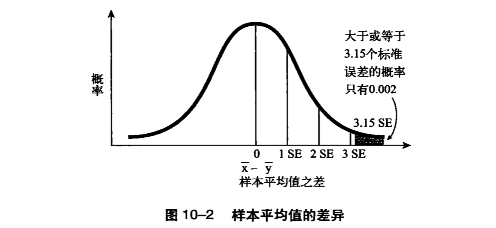
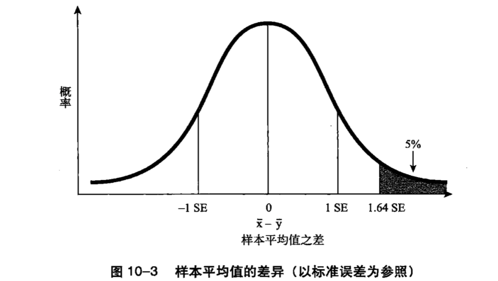

    作者:  [美] 查尔斯·韦兰
    出版社: 中信出版社
    副标题: 除去大数据的枯燥外衣,呈现真实的数字之美
    译者:  曹槟
    出版年: 2013-9
    页数: 308
    定价: CNY 42.00
    装帧: 平装
    ISBN: 9787508642154

[豆瓣链接](https://book.douban.com/subject/25717380/)

- [描述统计学](#%e6%8f%8f%e8%bf%b0%e7%bb%9f%e8%ae%a1%e5%ad%a6)
- [正态分布](#%e6%ad%a3%e6%80%81%e5%88%86%e5%b8%83)
- [中位数&平均数](#%e4%b8%ad%e4%bd%8d%e6%95%b0%e5%b9%b3%e5%9d%87%e6%95%b0)
- [百分率](#%e7%99%be%e5%88%86%e7%8e%87)
- [相关系数](#%e7%9b%b8%e5%85%b3%e7%b3%bb%e6%95%b0)
- [DNA序列](#dna%e5%ba%8f%e5%88%97)
- [概率的乘积&概率之和](#%e6%a6%82%e7%8e%87%e7%9a%84%e4%b9%98%e7%a7%af%e6%a6%82%e7%8e%87%e4%b9%8b%e5%92%8c)
- [大数定律](#%e5%a4%a7%e6%95%b0%e5%ae%9a%e5%be%8b)
- [伪阴性&伪阳性](#%e4%bc%aa%e9%98%b4%e6%80%a7%e4%bc%aa%e9%98%b3%e6%80%a7)
- [麦都定律&赌徒悖论&回归平均数](#%e9%ba%a6%e9%83%bd%e5%ae%9a%e5%be%8b%e8%b5%8c%e5%be%92%e6%82%96%e8%ae%ba%e5%9b%9e%e5%bd%92%e5%b9%b3%e5%9d%87%e6%95%b0)
- [中心极限定理](#%e4%b8%ad%e5%bf%83%e6%9e%81%e9%99%90%e5%ae%9a%e7%90%86)
- [统计推断与假设检验](#%e7%bb%9f%e8%ae%a1%e6%8e%a8%e6%96%ad%e4%b8%8e%e5%81%87%e8%ae%be%e6%a3%80%e9%aa%8c)
  - [计算均值的标准误差](#%e8%ae%a1%e7%ae%97%e5%9d%87%e5%80%bc%e7%9a%84%e6%a0%87%e5%87%86%e8%af%af%e5%b7%ae)
  - [单尾假设](#%e5%8d%95%e5%b0%be%e5%81%87%e8%ae%be)
  - [双尾假设](#%e5%8f%8c%e5%b0%be%e5%81%87%e8%ae%be)
- [百分比](#%e7%99%be%e5%88%86%e6%af%94)
- [回归分析](#%e5%9b%9e%e5%bd%92%e5%88%86%e6%9e%90)

## 描述统计学
p8:描述统计学存在的意义就是简化，因此不可避免地会丢失一些内容和细节。（所有的指标都会丢失信息，或者说在某些场景下表达力不足。）

## 正态分布
p32:正态分布。数值位于平均值1个标准差的范围之内68.2%;2个标准差之内95.4%;3个标准差之内99.7%。


## 中位数&平均数
p54：`中位数`的决定性特征——不考虑数据距离中间位置有多远或是多近，而是关注它们是高于中间位置还是低于中间位置——反而成为它的弱点。与之相反，`平均数`恰恰是由数据分布决定的。

## 百分率
p59：百分率会夸大其词。让增长出现“爆炸”的方法之一就是与一个非常低的起点进行百分比比较。另一面是一个庞大数额的微小比例也会是一个很大的数字。（中位数，均值，百分率通常是无聊政客玩的宣传把细）

## 相关系数
p76：相关关系并不等于因果关系。
- 如何计算相关系数(身高与体重的相关性)：
  - 将每个学生的身高转换为标准值：(身高-平均身高)/标准差；
  - 将每个学生的体重转换为标准值：(体重-平均体重)/标准差；
  - 将每个学生的体重标准值 * 身高标准值；
  - 将第三步求得的乘积再相加，再除以统计对象的数量。


- `相关系数`（`correlation coefficient`）的数学公式：$r=\frac{1}{n}\sum_{i=1}^n\frac{(x_i-\bar{x})}{\delta_x}\frac{(y_i-\bar{y})}{\delta_y}$
- R代码

```r
> height<-c(74,66,68,69,73,70,60,63,67,70,70,70,75,62,74)
> weight<-c(193,133,155,147,175,128,100,128,170,182,178,118,227,115,211)
> cor(height,weight)
[1] 0.8260258
> plot(height,weight)
```

## DNA序列
p89：事实上我们的DNA序列中有超过99%的片段都是完全一样的。基因数量越多，取证的准确率也就越高。换言之，DNA样本与多个人的DNA相吻合的概率也就越低。DNA证据都是估计出来的概率。无血缘关系的两个人第9组基因吻合的概率仅为1130亿分之一。

## 概率的乘积&概率之和
p90：两个独立事件同时发生的概率取决于两个事件各自的概率，也就是说，事件A与事件B同时发生的概率是这两个事件发生`概率的乘积`。假如你对发生这个事件或发生那个事件的感兴趣，也就是出现结果A或出现结果B的概率(假设两个事件是相互独立的)，这个概率就是A和B各自的`概率之和`：A概率+B概率。

## 大数定律
p94：`大数定律`（`Law of Large Numbers`），即随着试验次数的增多，结果的平均值会越来越接近期望值。

## 伪阴性&伪阳性
p100：实际阳性而检测为阴性：伪阴性。即漏掉了实际的患病者。实际阴性而检测为阳性：伪阳性。误判为患者。
* p190：垃圾邮件过滤。伪阳性(I类错误)：把一些不是垃圾邮件的邮件屏蔽掉了；伪阴性(II类错误)：把一些垃圾邮件筛选到了收件箱；倾向于伪阴性(II类错误)。
* 癌症筛选。伪阳性(I类错误)：误诊为癌症；伪阴性(II类错误)：癌症没有被诊断出来；倾向于伪阳性(I类错误)。
* 打击恐怖分子。伪阳性(I类错误)：把无辜的人送进监狱；伪阴性(II类错误)：恐怖分子逍遥法外；伪阳性(I类错误)和伪阴性(II类错误)都是不可容忍的。
* 零假设：是垃圾邮件，患癌症，是恐怖分子。

## 麦都定律&赌徒悖论&回归平均数
p120：误用概率：
1. 想当然地认为事件之间不存在联系。“麦都定律”。
2. 对两个事件的统计独立一无所知。“赌徒悖论”和蓝球运动员的“手感”。
3. 回归平均数。大数定律。回归平均数会与“赌徒悖论”相排斥。

## 中心极限定理
p151:`中心极限定理`(central limit theorem)
- 一个大型样本的正确抽样与其代表的群体存在相似关系。每个样本之间肯定会存在差异，但是任一样本与整体之间存在巨大差异的概率较低。
- 通过运用中心极限定理，可得出如下推理：
  - 如果我们掌握了某个群体的具体信息，就能推理出从这个群体中正确抽取的随机样本的情况。
  - 如果我们掌握了某个正确的样本的具体信息(均值和标准差)，就能对其所代表的群体做出精确推理。
  - 如果我们掌握了某个样本的数据，以及某个群体的数据，就能推理出该群体是否就是该群体的样本之一。
  - 如果我们已知两个样本的基本特性，就能推理出这两个样本是否取自同一个群体。
- 根据中心极限定理，任意一个群体的样本均值都会围绕在该群体的整体均值周围，并且呈正态分布。不论所研究的群体是怎样的分布，就算样本所在的群体不是正态分布，也不影响其样本均值的正态分布形态。
- 标准误差被用来衡量样本均值的离散性：
  - 标准差是用来衡量群体中所有个体的离散性。
  - 标准误差衡量的仅仅是样本均值的离散性。
  - 标准误差就是所有样本均值的标准差。
  - $SE=\frac{s}{\sqrt{n}}$
    - SE:标准误差
    - s：抽样群体的标准差
    - n：样本数
  - 68%的样本均值会在群体均值的一个标准误差范围之内，95%的样本均值会在群体均值的两个标准误差范围之内，99.7%的样本均值会在群体均值3个标准误差范围之内。
  - 群体均值：162；标准差36；人数：60。标准误差：$\frac{36}{\sqrt{60}}=4.6$
  - “双尾”假设检验(p151:中心极限定理2.3)：
    - 零假设：该样本来自于某群体。
    - 显著性水平为0.05。
    - 如果抽样得到的样本均值在152.8~171.2（两个SE）则可认为该样本来自于群体，否则可认为该样本并非来自某群体。

## 统计推断与假设检验
p191:统计推断与假设检验

### 计算均值的标准误差
- 均值比较公式:$\frac{\bar{x}-\bar{y}}{\sqrt{\frac{s_x^2}{n_x}+\frac{s_y^2}{n_y}}}$
  - $\bar{x}$:样本x的均值
  - $\bar{y}$:样本y的均值
  - $s_x$:样本x的标准差
  - $s_y$:样本y的标准差
  - $n_x$:样本x的数量
  - $s_y$:样本y的数量
- 零假设：两个样本的均值相等。
- 上面公式计算的是两个平均值之差与标准误差之间的比值。假如这两个样本的均值相等(即它们取自同一个群体)，那么它们的均值之差小于一个标准误差的概率为68%，小于两个标准误差的概率为95%，以此类推。
- 例两个样本的均值之差为71.6立方厘米，标准误差为22.7，两者相除为3.15，也就是说，两个样本的均值相差3个以上的标准误差。所以这两个样本来自同一个群体，其差距如此之大的概率是非常低的(拒绝零假设)。



### 单尾假设
- 零假设：篮球运动员与普通人身高无明显差异。备选假设：篮球运动员比普通人高
-  显著性水平0.05
-  如果零假设成立，那么均值差异大于等于1.64个标准误差的概率只有5%。如果两组人的身高之差位于该区域内，那么我们就可以推翻零假设。



### 双尾假设
- 零假设：篮球运动员与普通人身高无明显差异。备选假设：篮球运动员与普通人身高与明显差异(可以高也可以矮)
- 显著性水平0.05，分布在正态分布两侧，每侧的概率为0.025，分别表示显著的高和显著的矮。两种情况加起来为0.05。


## 百分比
p202：民意测验(百分比)

- 百分比的标准误差公式:$SE=\sqrt{\frac{p(1-p)}{n}}$
  - p:某个特定观点的回应者比例
  - (1-p)：代表不同观点的回应者比例
  - n：样本在所有回应者的数量
- “选举民意测验”：500位选民，53%投给共和党，45%投给民主党，2%投给第三方候选人。$SE=\sqrt{\frac{0.53(1-0.53)}{500}}=0.02236$
  - 样本比例约有68%的概率落在最终结果一个标准误差的范围内，即：有68%的可能性：
    - 共和党53%
    - 民主党47%
    - 独立党派2%
    - 误差幅度±2%
  - 样本比例约有95%的概率落在最终结果2个标准误差的范围内，即：有95%的可能性
    - 共和党53%
    - 民主党47%
    - 独立党派2%
    - 误差幅度±4%
  - 如果没有新的数据补充的情况下，想要提高民意调查的正确率，就只能降低预测的精度。

## 回归分析
p224回归分析：假设通过最小二乘法(OLS)计算得到：体重=-135+4.5×身高
- 回归系数：$R^2$ ，假设=0.25，表示我们的样本中有75%的体重数据无法在回归方程上表现出来。当$R^2=0$时，表示我们的回归方程式预测样本中个体体重的能力并没有比“平均值”好多少；当$R^2=1$时，表示我们的回归方程式能够完美地预测样本中每个人的体重。
- 由中心极限定理可知，一个正确抽取的大型样本的均值并不会偏离其所在群体的均值，同样的，不同变量之间的关系(如体重和身高)不会因为样本的不同而发生特别大的变化，当然前提是这些样本来自同一个群体，而且都是正确抽取的大型样本。这个关系不是中心极限定理中的正态分布，而是`t分布`。t分布实际上指的是各种不同容量样本的概率密度集体或“家族”。具体来说，样本中所包含的个体数量越多，那我们在分配适当的分布区间来评价研究结论时所拥有的“自由度”就越高。
- 假设我们正在计算一个回归方程式
  - 零假设：某个具体变量的回归系数为0.
  - 在得到结果后，我们便可以计算出一个t统计量，也就是所得系数与该系数标准误差的比。
  - 当t统计量足够大时，也就是我们观察得到的系数与零假设相差甚远，那么就可以在某个显著水平基础上推翻零假设。