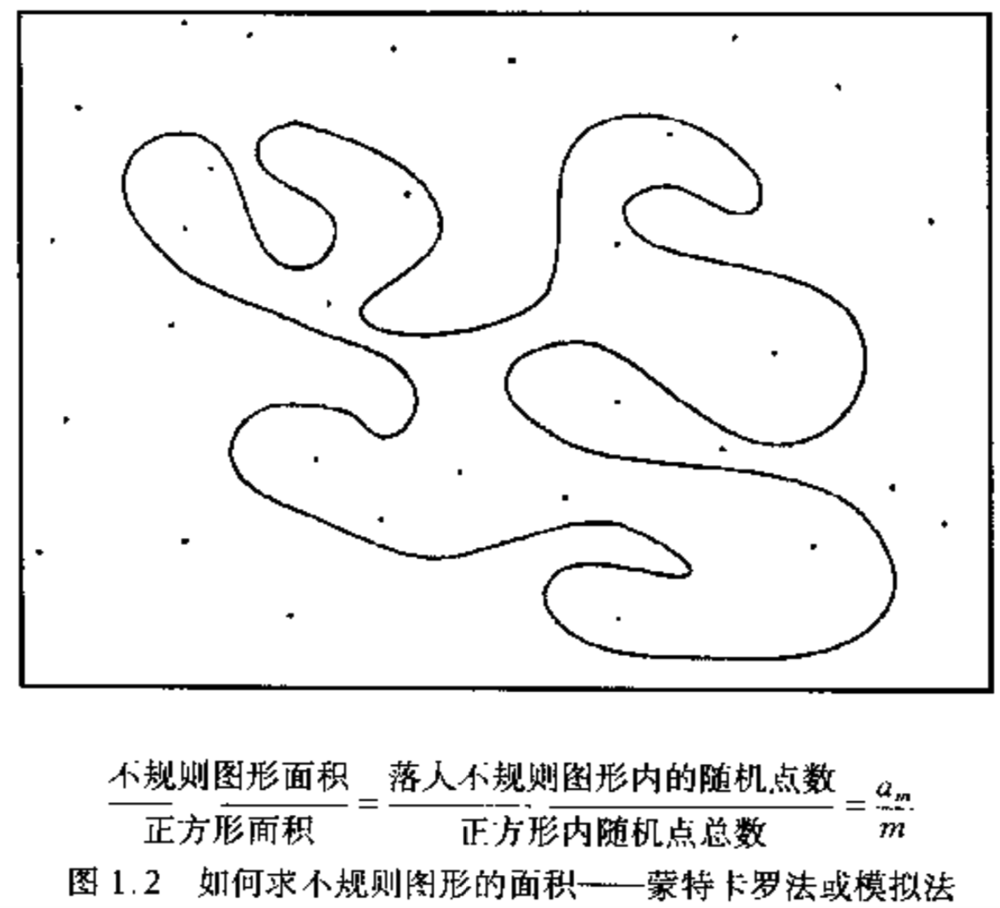

    作者:  C·R·劳
    出版社: 科学出版社
    副标题: 怎样运用偶然性
    原作名: Statistics and Truth: Putting Chance to Work
    出版年: 2004-7-1
    页数: 132
    定价: 22.00元
    装帧: 平装
    ISBN: 9787030122223

[豆瓣链接](https://book.douban.com/subject/1238685/)

- [蒙特卡罗(Monte Carlo)方法](#%e8%92%99%e7%89%b9%e5%8d%a1%e7%bd%97monte-carlo%e6%96%b9%e6%b3%95)
- ["赌徒悖论”](#%22%e8%b5%8c%e5%be%92%e6%82%96%e8%ae%ba)
- [如何调查问卷一个很敏感的问题](#%e5%a6%82%e4%bd%95%e8%b0%83%e6%9f%a5%e9%97%ae%e5%8d%b7%e4%b8%80%e4%b8%aa%e5%be%88%e6%95%8f%e6%84%9f%e7%9a%84%e9%97%ae%e9%a2%98)
- [偶然性与必然性](#%e5%81%b6%e7%84%b6%e6%80%a7%e4%b8%8e%e5%bf%85%e7%84%b6%e6%80%a7)
- [模糊性](#%e6%a8%a1%e7%b3%8a%e6%80%a7)
- [$\pi$的小数点后的位数是随机的吗？（卡方检验）](#pi%e7%9a%84%e5%b0%8f%e6%95%b0%e7%82%b9%e5%90%8e%e7%9a%84%e4%bd%8d%e6%95%b0%e6%98%af%e9%9a%8f%e6%9c%ba%e7%9a%84%e5%90%97%e5%8d%a1%e6%96%b9%e6%a3%80%e9%aa%8c)
- [三种逻辑推理方法](#%e4%b8%89%e7%a7%8d%e9%80%bb%e8%be%91%e6%8e%a8%e7%90%86%e6%96%b9%e6%b3%95)

## 蒙特卡罗(Monte Carlo)方法
p7：如何求某正方形内一不规则图形的面积。假设到某一步n时，落入不规则图形的点数为$a_m$，落入整个正方形中的点数为m，由大数定律:$n \to \infty, \frac{a_m}{m}$ 趋向于真实比值。



## "赌徒悖论”
p11：纠正（p117）：连续出现几次硬币正面，赌徒们坚信接下来反面的概率超过1/2。一次实验中以很小的机会发生的事件，当样本足够大时必然会发生，并且可以在任何时候发生并不需要归因于任何特别的理由。

## 如何调查问卷一个很敏感的问题
p12：对敏感问题的随机反应：如何调查问卷一个很敏感的问题？

```
S：你吸大麻么？
T：你的电话号码的末尾数是偶数吗？
a=吸大麻的人数，是未知的要估计的参数
b=电话号码的末尾数是偶数的人的比例，已知
p=回答“是”的人的比率，已知
```

提问者并不知道回答者回答的哪个问题，回答者通过抛硬币的方式决定回答哪个问题。a+b=2p,a的估计值为2p-b。

## 偶然性与必然性
p24：现实中的每一现象都是二者不规则的混合。

## 模糊性
p26：立法中的模糊性所起的重要作用：

* 为了允许提出新的观点，法律过程中用到的分类必须保留一定的模糊性
* 对一种法规来说，如果清楚地写明了它就完全可以不含模糊性而只应用于某一特殊的情形，这仅仅是一种情况。然而，幸运的是，与判案法一样，法规和宪法，都不可避免地存在模糊性。

## $\pi$的小数点后的位数是随机的吗？（卡方检验）
p27：列出$\pi$

小数点后1000位数，这1000个数中0，1，…，9出现的频数：

数字 | 0 | 1 | 2 | 3 | 4 | 5 | 6 | 7 | 8 | 9
---|---|---|---|---|---|---|---|---|---|--
频数 | 93 | 116 | 103 | 102 | 93 | 97 | 94 | 95 | 101 | 106
期望值 | 100 | 100 | 100 | 100 | 100 | 100 | 100 | 100 | 100 | 100

检验观察频数与期望值偏离程度的卡方统计量为4.20，这个值小于自由度为9的卡方检验临界值。这表明观察频数与期望值很接近。另一种方法是考虑小数点后五位数一组的集合中奇数的个数：

奇数个数 | 0 | 1 | 2 | 3 | 4 | 5
-----|---|---|---|---|---|--
频数 | 7 | 31 | 54 | 61 | 41 | 6
期望值 | 6.25 | 31.25 | 62.5 | 62.5 | 31.25 | 6.25

检验频数与期望值一致的卡方值为4.336，小于自由度为5的卡方检验临界值。（二项分布：6.25=1/2^5 × 200，31.25=5 × 1/2 × 1/2^4 × 200）

卡方统计量:

$\chi^2=\sum\frac{(A-E)^2}{E}=\sum_{i=1}^k\frac{(A_i-E_i)^2}{E_i}=\sum_{i=1}^k\frac{(A_i-np_i)^2}{np_i}(i=1,2,...,k)$

- $A_i$为i水平的观察频数
- $E_i$为i水平的期望频数
- n为总频数
- $p_i$为i水平的期望频率
- i水平的期望频数$T_i$等于总频数n×i水平的期望概率$p_i$，k为单元格数
- 当n比较大时，$\chi^2$统计量近似服从k-1个自由度的卡方分布

零假设$H_0$：观察频数与期望频数没有差别。

卡方值的计算与意义:$\chi^2$值表示观察值与理论值之问的偏离程度。计算这种偏离程度的基本思路如下。

1. 设A代表某个类别的观察频数，E代表基于$H_0$计算出的期望频数，A与E之差称为`残差`。
2. 显然，残差可以表示某一个类别观察值和理论值的偏离程度，但如果将残差简单相加以表示各类别观察频数与期望频数的差别，则有一定的不足之处。因为残差有正有负，相加后会彼此抵消，总和仍然为0，为此可以将残差平方后求和。
3. 另一方面，残差大小是一个相对的概念，相对于期望频数为10时，期望频数为20的残差非常大，但相对于期望频数为1000时20的残差就很小了。考虑到这一点，人们又将残差平方除以期望频数再求和，以估计观察频数与期望频数的差别。

由卡方的计算公式可知，当观察频数与期望频数完全一致时，$\chi^2$值为0；观察频数与期望频数越接近，两者之间的差异越小，$\chi^2$值越小；反之，观察频数与期望频数差别越大，两者之间的差异越大，$\chi^2$值越大。换言之，大的$\chi^2$值表明观察频数远离期望频数，即表明远离假设。小的$\chi^2$值表明观察频数接近期望频数，接近假设。因此，$\chi^2$是观察频数与期望频数之间距离的一种度量指标，也是假设成立与否的度量指标。如果$\chi^2$值“小”，研究者就倾向于不拒绝$H_0$；如果$\chi^2$值大，就倾向于拒绝$H_0$。

## 三种逻辑推理方法
p34:
- 演绎法：在演绎推理下没有产生超过前提的新知识，因为所有推出的命题是蕴含在公理之内的。
  - 哥德尔证明了：基于所给定公理系统的推理，人们不能证明由该公理系统不可能导致矛盾的结果。
  - 同时也证实了一个推断，即如果某个公理系统中，可以同时演绎命题P及其否定命题，那么这个公理系就能使我们导出任何我们想要得到的矛盾。
- 归纳法：由观测的数据去匹配一个假设，从而由特殊推向一般的逻辑推理过程。由此而产生新的知识，但是由于在数据和假设之间缺乏一对一的对应关系，这是一种带有不确定性的知识。
- 诱导法：新理论的产生完全不基于任何数据信息，而是凭直觉或瞬间的相像。

知识的发展依赖于三个逻辑过程：
1. 归纳：基于观察到的数据信息产生新知识。
2. 诱导：由直观而不是数据信息产生新知识。
3. 演绎：证明所提出的理论。