    作者:  [意] 卡洛·罗韦利 
    出版社: 博集天卷 | 湖南文艺出版社
    出品方: 博集天卷
    副标题: 量子引力之旅
    原作名: Reality Is Not What It Seems：The Journey to Quantum Gravity
    译者: 杨光 
    出版年: 2017-11
    页数: 248
    定价: 49.00
    装帧: 精装
    ISBN: 9787535795489

[豆瓣链接](https://book.douban.com/subject/27156306/)

- [第一部分 源头](#%e7%ac%ac%e4%b8%80%e9%83%a8%e5%88%86-%e6%ba%90%e5%a4%b4)
  - [1.微粒](#1%e5%be%ae%e7%b2%92)
  - [2.经典](#2%e7%bb%8f%e5%85%b8)
- [第二部分 革命的开端](#%e7%ac%ac%e4%ba%8c%e9%83%a8%e5%88%86-%e9%9d%a9%e5%91%bd%e7%9a%84%e5%bc%80%e7%ab%af)
  - [3.阿尔伯特](#3%e9%98%bf%e5%b0%94%e4%bc%af%e7%89%b9)
  - [4.量子](#4%e9%87%8f%e5%ad%90)
- [第三部分 量子空间与关联的时间](#%e7%ac%ac%e4%b8%89%e9%83%a8%e5%88%86-%e9%87%8f%e5%ad%90%e7%a9%ba%e9%97%b4%e4%b8%8e%e5%85%b3%e8%81%94%e7%9a%84%e6%97%b6%e9%97%b4)
- [第四部分 超越时空](#%e7%ac%ac%e5%9b%9b%e9%83%a8%e5%88%86-%e8%b6%85%e8%b6%8a%e6%97%b6%e7%a9%ba)

## 第一部分 源头
### 1.微粒
米利都派领悟到，通过灵活运用观察与推理，而不是在幻想、古代神话或宗教中寻找答案——最重要的是以敏锐的方式运用批判性思维——才有可能不断修正我们的世界观，发现隐藏在普遍观点之中的实在的新面向，才有可能发现新事物。

德谟克利特体系的理念极其简单：整个宇宙由无限的空间构成，其中有无数原子在运动。空间没有界限；没有上也没有下；没有中心，也没有边界。原子除了形状以外别无特性。它们没有重量、颜色与味道。“甜是从俗约定的，苦是从俗约定的，热是从俗约定的，冷是从俗约定的，颜色也不例外，实际上只有原子和虚空”。

原子是不可分割的；它们是实在的基本微粒，无法继续被分割，万物都由它们组成。它们在空间中自由移动，相互碰撞；它们彼此勾连在一起，互相推拉。相似的原子彼此吸引。

这就是世界的构成，这就是实在。

### 2.经典
去除了毕达哥拉斯主义中烦冗无用的神秘主义包袱，吸收提炼了其中实用的启示：数学是理解与描述世界最合适的语言。这个洞见意义深远，这也正是西方科学成功的原因之一。

伽利略完成了人类历史上的第一次实验，实验科学就源于伽利略。实验很简单：他让物体自由下落，使物体做亚里士多德的自然运动，并尝试精确测量其下落速度。

实验结果意义重大：物体并不像人们以为的那样，以某一恒定速度下落。物体的速度在运动过程中逐渐增大。在这个过程中，保持不变的并非下落的速度，而是加速度，即速度增大的快慢。并且神奇的是，对所有物体来说这个加速度都是相同的。伽利略第一个对这一加速度进行了粗略的测量，发现它是个常量，其大小大约是9.8米每秒的平方，也就是说，物体每下落一秒，其速度就增大9.8米每秒。请记住这个数字。

这是人们发现的描述地球上物体的第一个数学定律：`自由落体定律`。

通过对小月亮进行简单计算，牛顿推导出了万有引力的大小随距离的变化关系，其比值我们今天称为`牛顿引力常数`，用字母G表示，代表“引力”（Gravity）。在地球上，这个力使物体下落；在天上，它使行星和卫星在轨道上运动，这二者是同一种力。

牛顿力学的世界十分简单，可以总结为图2.1和图2.2。


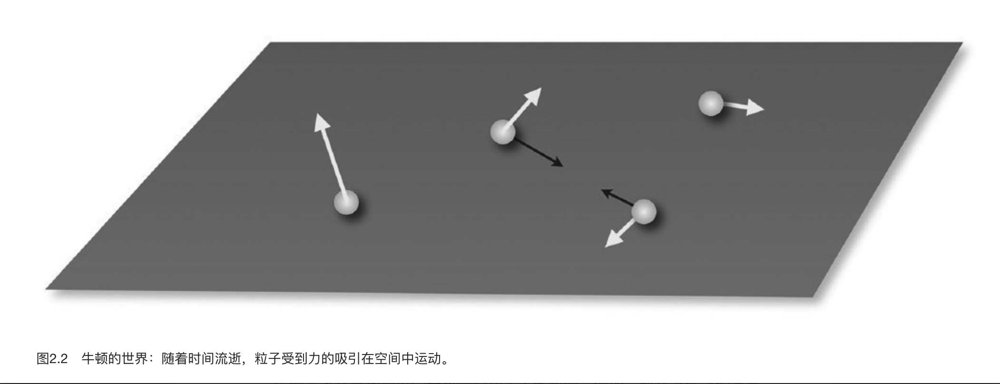

法拉第:存在某种电磁体激发的实体布满空间，并且作用在物体上（推或拉）。法拉第凭直觉知道的这种实体，今天我们称之为“场”。

那么场到底是什么呢？法拉第把它看作很多束非常细（无穷细）的线，充满空间；就像是巨大的隐形蜘蛛网，填满我们周围的一切。他把这些线称作“力线”，因为从某个角度来说，这些线“承载了力”：它们把电磁力从一个物体传递到另一个物体，就像伸缩的电线一样（图2.4）。


牛顿对于他本人所引入的超距作用也感到困惑。

>引力是物质内在固有、必不可少的，因此一个物体可以穿越真空对远处的另一物体产生影响，在没有任何媒介的情况下，其作用和力可以从一个物体传到另一物体，这一点对我来说十分荒谬，我相信任何有能力进行哲学思考的人都不会如此认为。引力一定是由某一媒介根据特定法则持续产生作用的，至于这种媒介是物质还是非物质，就留给我的读者思考了。

引入新的实体——`场`——使法拉第完全背离了牛顿简洁优美的本体论：世界不再只由在空间中随时间流逝而运动的粒子组成。一名新演员——场——登上了舞台。

麦克斯韦立刻意识到这个观念如金子一般可贵。他把法拉第仅用寥寥数语解释的洞见，转述成了一整页方程。这些方程现在被称为麦克斯韦方程组，它们描述了电磁场的特征，是法拉第力线的数学表达。

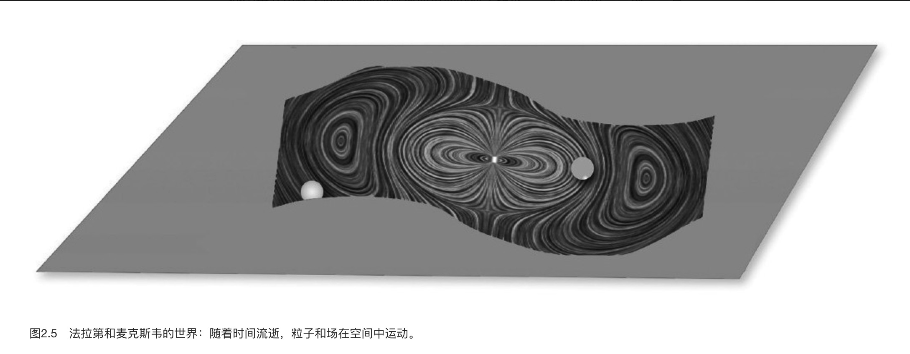

麦克斯韦意识到，他的方程预言法拉第的力线可以振动起伏，就像海浪一样。他计算了法拉第力线波动的传播速度，结果竟然……与光速相同！为什么呢？麦克斯韦领悟到：因为光只不过是法拉第力线的飞速振动！法拉第和麦克斯韦不仅解决了电与磁如何运动的问题，与此同时作为一个副产品，他们也指出了光是什么。

麦克斯韦认识到，他的方程组预言法拉第力线也能够以更低的频率振动，即比光慢得多的频率。因此，必然存在着由带电物体运动产生的没有人能够看到的其他波动，也会使其他带电物体运动。使一个带电物体振动，必然可以激发电磁波，进而产生电流。仅仅几年过后，由麦克斯韦从理论上预测的这些波，就被德国物理学家海因里希·赫兹（Heinrich Hertz）发现；又过了几年，伽利尔摩·马可尼（Guglielmo Marconi）制造出了第一台收音机。


## 第二部分 革命的开端
### 3.阿尔伯特
请将所有过去、现在与未来的事件（相对于你正在阅读的这一时刻），想象为如图3.1那样排列。


爱因斯坦的发现是说，这个图表是错误的。实际上，事实应该按照图3.2那样的方式来描绘。

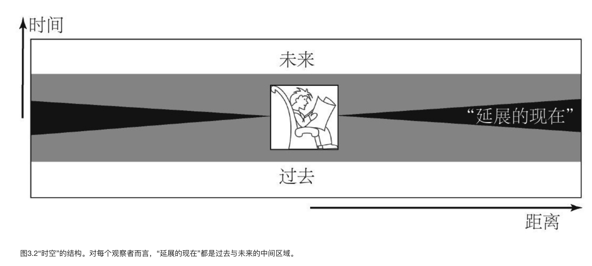

在一个事件的过去与未来之间（例如，你正在阅读的此时此刻与你的过去与未来之间），存在一个“中间区域”，一个“延展的现在”，一个既非过去亦非未来的区域。这就是`狭义相对论`的发现。

这个既不在过去也不在未来的中间区域时间非常短，取决于相对你而言事件发生的位置，就像图3.2中画的那样。事件离你的距离越远，延展的现在持续的时间就越长。


我在火星而你在地球，我问了你一个问题，你一听到就立刻回话，但你的回复要在我提出问题一刻钟后才传到我这儿。这一刻钟的时间相对于你回答我的时刻而言既不在过去也不在未来。爱因斯坦领悟到的关于自然的重要事实就是，这一刻钟是无法避免的：我们无法把它消除。

这表明说火星上某一事件“正在”发生没有意义，因为“现在”并不存在（图3.3）。从专业术语来讲，我们说爱因斯坦领悟到 **“绝对的同时性”并不存在：宇宙中并不存在“现在”发生的事件**。宇宙中发生的事件不能用一系列的、一个接一个的“现在”来描述；它有着如图3.2中的更复杂的结构。这幅图描绘了物理学中的时空：一组过去与未来的事件，以及既不是过去也不是未来的事件；这些事件并不在一瞬间形成，它们本身要持续一段时间。

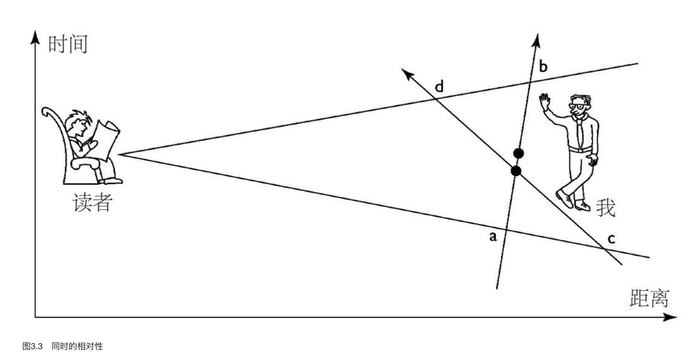

这个理论还有另一个含义，会产生重大的影响。在新的力学中，“能量”与“质量”合二为一，如同时间与空间合二为一，电场与磁场合二为一。在1905年以前，有两个看似确定无疑的普遍定律：`质量守恒定律`与`能量守恒定律`。第一个定律已经被化学家广泛证实了：质量在化学反应中不发生改变。第二个——能量守恒定律——直接由牛顿方程推导出来，被认为是最没有争议的定律之一。但爱因斯坦意识到能量与质量是同一实体的两面，就如电场和磁场是同一种场的两个面向，空间和时间是同一事物即时空的两个面向。这表明，质量本身并不守恒；能量——按照当时理解的那样——也不守恒。一种可以转化为另一种，只存在一个守恒定律，而非两个。**守恒的是质量与能量的总和，而非其中任意一个。一定存在某个过程，可以把能量转化为质量，或把质量转化为能量。**

爱因斯坦快速计算出了通过转化一克物质可以得到多少能量，结果就是著名的公式$E=mc^{2}$。c是光速。

图3.2与3.3描绘的时间与空间交织在一起的结构，就是物理学家口中的“时空”（图3.4）。

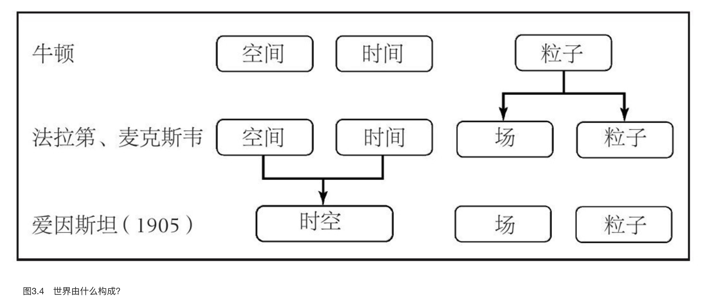

牛顿已经解释了物体下落与行星公转的原因，他设想了一种所有物体间互相吸引的力：“引力”。但这种力是如何在中间没有任何媒介的情况下吸引遥远物体的，这点他一直无法理解。正如我们已经看到的，牛顿本人也怀疑，在不接触物体间的力的概念中，有某些东西被遗漏了；地球要想吸引月球，二者之间应该存在某种能够传递这种力的东西。两百年之后，法拉第找到了答案——不是引力，而是电磁力的答案：场。电磁场可以传递电磁力。

到了这一步，逻辑清晰的人都会明白，引力肯定也有它的法拉第力线。类比来看，太阳与地球间的引力，或是地球与下落物体间的引力，很明显也是源于一种场——在这里是引力场。

世界并不是由空间、粒子、电磁场、引力场组成，而只是由粒子与场组成，除此之外别无其他，没有必要把空间作为附加要素加进来。牛顿的空间就是引力场，或者反过来说也一样：引力场就是空间。（图3.5）

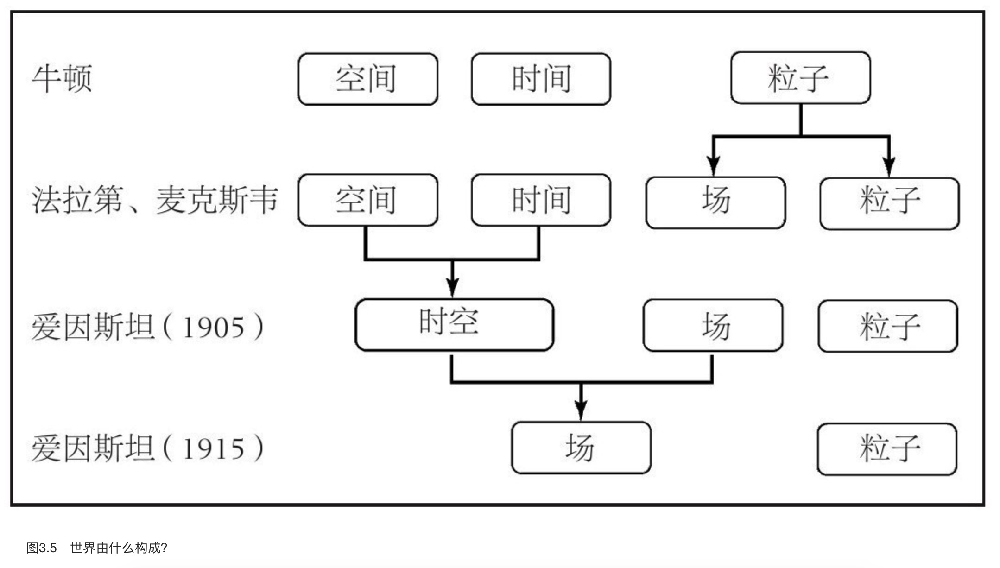

我们是在一个巨大的、活动的软体动物内部（爱因斯坦的比喻）。太阳使其周围的空间弯曲，地球并不是由于神秘超距作用的吸引才围绕太阳运动，而是在倾斜的空间中沿直线运动。就像在漏斗中转动的珠子：不存在什么由漏斗中心产生的神秘的力，是漏斗壁弯曲的特点使珠子旋转。行星环绕太阳运动、物体下落，都是因为它们周围的空间是弯曲的（图3.6）。

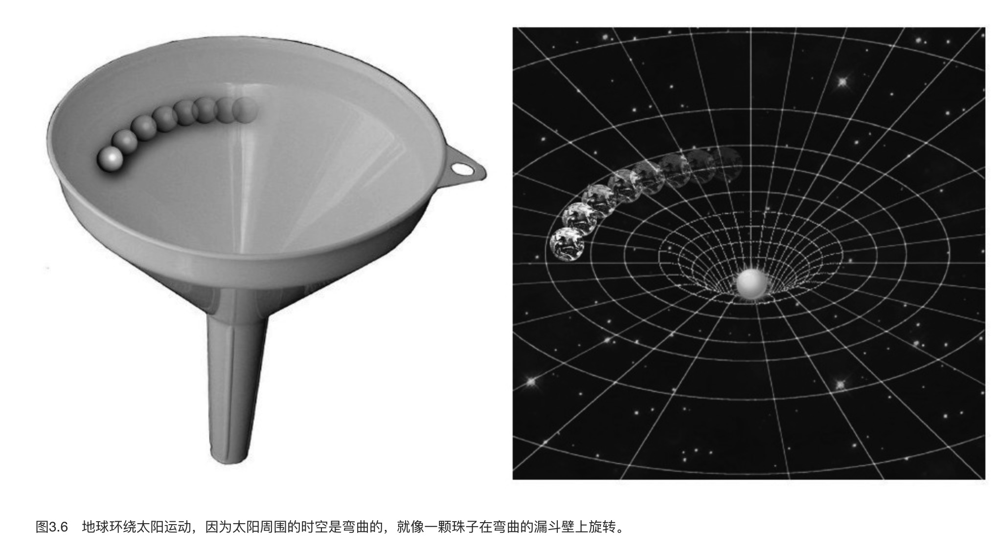

更准确地说，弯曲的不是空间，而是时空。

理念就此成形，爱因斯坦剩下的问题就是要找到方程，让这个理念变得坚实。

黎曼的成果是任何维度的弯曲空间（或时空）的属性都可用一个特定的数学对象来描述，我们称之为黎曼曲率，用字母R表示。以平原、小山与山脉为例，平原表面的曲率R等于零，是平的——也就是“没有曲率”——曲率不等于零的地方则是山谷和小山；在山峰的顶点，曲率有最大值，也就是最不平坦或最弯曲。运用黎曼的理论，可以描述三维或四维弯曲空间的形状。

爱因斯坦付出了巨大努力，并且向比自己数学更好的朋友寻求帮助，终于学会了黎曼数学——他写出了一个方程，其中R正比于物质的能量。也就是说，有物质的地方空间弯曲得更多。

$R_{ab}-\frac{1}{2}Rg_{ab}+\Lambda g_{ab}=8\pi GT_{ab}$

1915年时这个方程甚至更简单，因为爱因斯坦在两年后（我在后面会提到）加入的术语$Λg^{ab}$还没有出现。$R_{ab}$取决于黎曼曲率， $\frac{1}{2}Rg_{ab}$表示时空的曲率；$T_{ab}$代表物质的能量；G就是牛顿发现的常数：决定引力大小的常数。

他甚至犯了个物理上的愚蠢错误（他没有意识到他在寻找的解答是不稳定的），只是为了避免承认其理论的预言：宇宙要么在收缩，要么在膨胀。他修改了方程，试图避免膨胀的含义，正因如此他把$Λg^{ab}$这一项加入了上面的方程里。但这也是个错误，加进来的项是正确的，却无法改变这一事实：方程预言宇宙必然在膨胀。爱因斯坦缺少足够的勇气去相信他自己的方程。

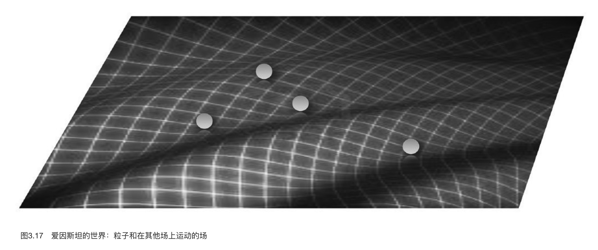

### 4.量子
1900年，马克思·普朗克（Max Planck）尝试计算热平衡态的箱子中电磁波的数量。为了得到能重现实验结果的公式，他最终使用了一个看似没有多大意义的小技巧：他假设电场的能量是以“量子”分配的，也就是一小包一小包的能量。他假定每包能量的大小取决于电磁波的频率（也就是颜色），对于频率为ν的波，每个量子或者说每个波包的能量为：

E=hν

这个公式就是量子力学的起点；h是个新的常数，今天我们称之为`普朗克常数`，它决定了频率为ν的辐射每包有多少能量。常数h决定了一切量子现象的尺度。

今天我们把这些能量包称为“光子”，得名于光的希腊文φωζ。`光子`是光的微粒，光的量子。爱因斯坦在文章中写道：

>在我看来，如果我们假设光的能量在空间中的分布是不连续的，我们就能更好地理解有关黑体辐射，荧光，紫外线产生阴极射线，以及其他一些有关光的产生和转化的现象。根据这个假设，从点光源发射出的一束光线的能量，并不会在越来越广的空间中连续分布，而是由有限数目的“能量量子”组成，它们在空间中点状分布，作为能量发射和吸收的最小单元，能量量子不可再分。

玻尔研究了在世纪之交时人们开始探索的原子结构。实验表明，原子就像个小型太阳系：质量都集中在中心很重的原子核上，很轻的电子环绕它运动，就像行星围绕太阳转。然而这个模型却无法解释一个简单的事实，那就是：物质是有颜色的。

由于颜色是光的频率，光由物质以特定的频率发射。描绘特定物质频率的集合被称为这种物质的`“光谱”`，光谱就是不同颜色光线的集合，其中特定物质发出的光会被分解（比如被棱镜分解）。几种元素的光谱如图4.2所示。

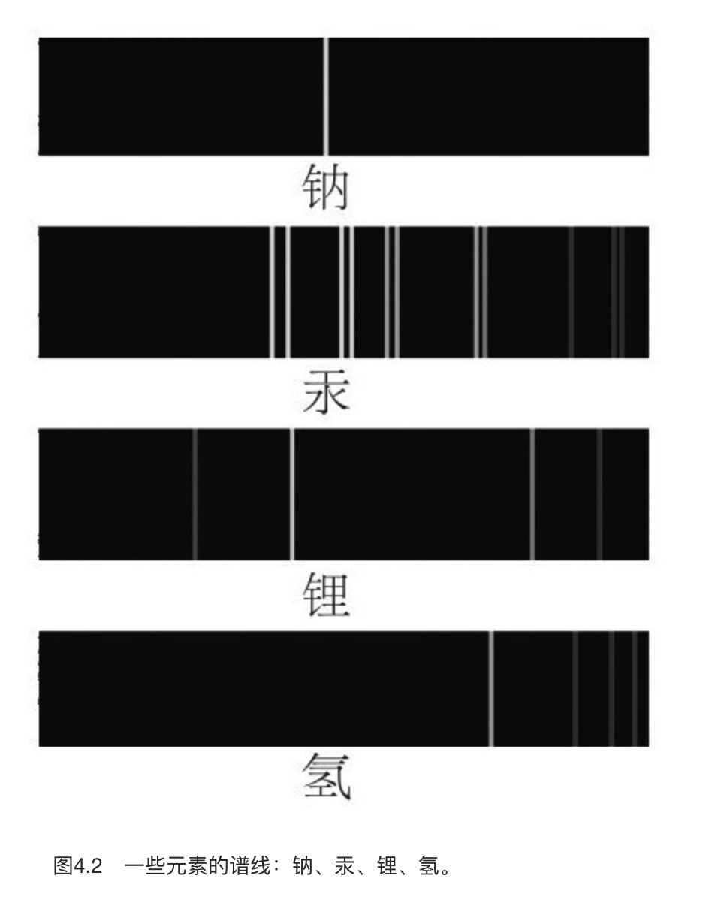

为什么原子的光谱不是颜色的连续谱，而只是几条分离的线？用专业术语来说，为何是`“分立的”`而非连续的？

玻尔假设电子只能在离原子核特定的距离处存在，也就是只能在特定的轨道上，其尺度由普朗克常数h决定。电子可以在能量允许的情况下从一个轨道“跳跃”到另一个轨道，这就是著名的`“量子跃迁”`。电子在这些轨道运动的频率决定了发出的光的频率。由于电子只能处于特定的轨道，因此只能发射特定频率的光。

海森堡极其兴奋地回到家，立刻投入计算中。过了一会儿，他得到了一个令人不安的理论：在对粒子运动进行基本描述时，并不能描述粒子在任意时刻的位置，而只能描述它在某些瞬间的位置——粒子与其他物质相互作用的那些瞬间。
 
这就是量子力学的第二块基石，其最难理解的要点是事物之间`相关性`的那一面。电子不是始终存在，而是在发生相互作用时才存在，它们在与其他东西碰撞时才突然出现。从一个轨道到另一个轨道的量子跃迁实际上是它们真实的存在方式：电子就是从一个相互作用到另一个相互作用跃迁的集合。当没有东西扰动它时，电子不存在于任何地方。

这种不确定性是量子力学的第三块基石：人们发现概率在原子层面起作用。如果我们拥有关于初始数据的充分信息，牛顿物理学就可以对未来进行精准的预测，然而在量子力学中，即使我们能够进行计算，也只能计算出事件的概率。这种微小尺度上决定论的缺失是大自然的本质。电子不是由大自然决定向左还是向右运动，它是随机的。宏观世界表面上的决定论只是由于微观世界的随机性基本上会相互抵消，只余微小的涨落，我们在日常生活中根本无法察觉到。

狄拉克的量子力学允许我们做两件事情。首先是计算一个物理量可以取哪些值，这被称为“计算物理量的取值范围”；它体现了事物的分立性。当一个物体（如原子、电磁场、分子、钟摆、石头、星星等）与其他物体相互作用时，能计算出的是在相互作用过程中物理量可以取的值（相关性）。狄拉克的量子力学允许我们做的第二件事是，计算一个物理量的某个值在下一次相互作用中出现的概率，这被称作“计算跃迁的振幅”。概率体现了理论的第三个特征：`不确定性`。理论不会给出唯一的预测，而是给出概率。

电子与其他构成世界的粒子，都是场的量子化——与法拉第和麦克斯韦的场相似的“量子场”，遵循分立性与量子的概率。狄拉克写出了电子与其他基本粒子的场的方程，法拉第引入的场与粒子的明显差别消失了。

与狭义相对论相容的量子理论的一般形式被称为`量子场论`，它构成了今日粒子物理学的基础。粒子是场的量子化，正如光子是光的量子化。所有的场都在相互作用中表现出分立的结构。

如今量子力学和量子场及其粒子提供了对自然极其有效的描述。世界并不是由粒子和场组成的，而只有一种实体：量子场。再也没有随着时间流逝在空间中运动的粒子了，存在的只有量子场，其基本事件发生在时空之中。


我认为**量子力学揭示了事物本性的三个面向：分立性、不确定性与世界结构的相关性。**

首先是自然界中基本分立性的存在。

量子力学的第一个含义就是，**系统内部能够存在的信息有一个上限：系统所处的可区分状态的数量是有限的。无穷是有限的，是理论的第一个重要方面，这正是德谟克利特窥见的自然的分立性。普朗克常量h衡量了这一分立性的基本尺度。**

世界是一系列分立的量子事件，这些事件是不连续的、分立的、独立的；它们是物理系统之间的相互作用。电子、一个场的量子或者光子，并不会在空间中遵循某一轨迹，而是在与其他东西碰撞时出现在特定的位置和时间。它会在何时何地出现呢？我们无法确切地知道。量子力学把不确定性引入了世界的核心。未来真的无法预测。这就是量子力学带来的第二个重要经验。

理论并没有描述事物本来如何：它描述的是事物如何出现和事物之间如何相互作用。它没有描述哪里会有一个粒子，而是描述了粒子如何向其他粒子展现自己。存在的事物被简化为可能的相互作用的范围。实在成了相互作用，实在成了关联。

在量子力学描述的世界中，实在只存在于物理系统之间的关联之中。并不是事物进入关联，而是关联是“事物”的基础。量子力学的世界不是物体的世界，它是事件的世界。事物通过基本事件的发生而建立，就像哲学家尼尔森·古德曼（Nelson Goodman）在20世纪50年代写出的美妙语句那样：“物体是一个不变的过程。”一块石头是在一定时间内保持其结构的量子振动，就像海浪再次融入大海前会暂时维持其形态一样。

量子力学描述的不是物体：它描述的是过程，以及过程之间连接点的事件。

总结一下，量子力学发现了世界的三个特征：

- `分立性`。系统状态的信息是有限的，由普朗克常数限定。
- `不确定性`。未来并非完全由过去决定。我们所见的严格的规律性最终是统计学上的。
- `关联性`。自然的事件永远是相互作用。系统的全部事件都相对于另一系统而出现。

量子力学教会我们，不要以处在某一状态的“物体”的角度来思考世界，而应该从“过程”的角度来思考。过程就是从一次相互作用到另一次相互作用的历程。物体的属性只有在相互作用的瞬间才以分立的方式呈现，也就是只在这些过程的边缘，只在与其他物体发生关联时才出现。无法对其做出完全确定的预测，只能进行概率性的预测。

## 第三部分 量子空间与关联的时间
引力场的描述没有把量子力学考虑进来，没有解释场是量子场这一事实；量子力学的阐述没有考虑到由爱因斯坦的方程描述的时空弯曲。

爱因斯坦明白，空间和时间是一种物理场即引力场的表现形式。玻尔、海森堡和狄拉克很清楚，物理场具有量子特性：分立性、概率性、通过相互作用显现。由此可见，空间与时间一定也是具有这些奇特属性的量子实体。

那么量子空间是什么呢？量子时间又是什么呢？这就是被我们称为`量子引力`的问题。

其结果是普遍意义上的：当把量子力学与广义相对论结合在一起时，我们会发现空间的分割是有极限的。在某一特定尺度以下，没有东西能够进入。更准确地说，那里什么都不存在。

空间的最小区域有多小呢？计算十分简单：我们只需要计算一个粒子在坠入它自己的黑洞之前的最小尺寸，结果就显而易见了。最小的长度大约是：

$\sqrt{\frac{hG}{c^3}}$

在平方根符号下有我们已经遇到过的三个自然常数：在第二章中讨论过的牛顿常数G，决定了引力的强度；第三章中讨论相对论时介绍的光速c，揭示了延展的现在；还有第四章中的普朗克常数h，决定了量子分立性的尺度。这三个常数的存在证明我们确实是在考察与引力（G）、相对论（c）和量子力学（h）有关的东西。

用这种方法确定的长度$L_{P}$，被称为`普朗克长度`。它本应被称为布朗斯坦长度，但事实就是这样。从数值上看，它大约等于$10^{-33}$厘米，也就是……非常小。

还记得法拉第力线——传递电场力、在法拉第看来充满空间的那些线吗？作为“场”的概念起源的那些线？在惠勒-德维特方程的解中出现的闭合线就是引力场的法拉第力线。

但是现在有两个新的要素要加进法拉第的理念之中。

第一个就是我们正在处理的量子理论。在量子理论中，一切都是不连续的。法拉第力线无限连续的蛛网现在与真正的蛛网十分相似：它具有数量有限的单独的线。每一条决定惠勒-德维特方程解的线都描述了这张网内的一条线。

第二个新的方面，也是最关键的一个，在于我们正在讨论引力，因此正如爱因斯坦理解的那样，我们并不是在讨论侵入空间的场，而是在讨论空间结构本身。量子引力场的法拉第力线就是编织空间的线。

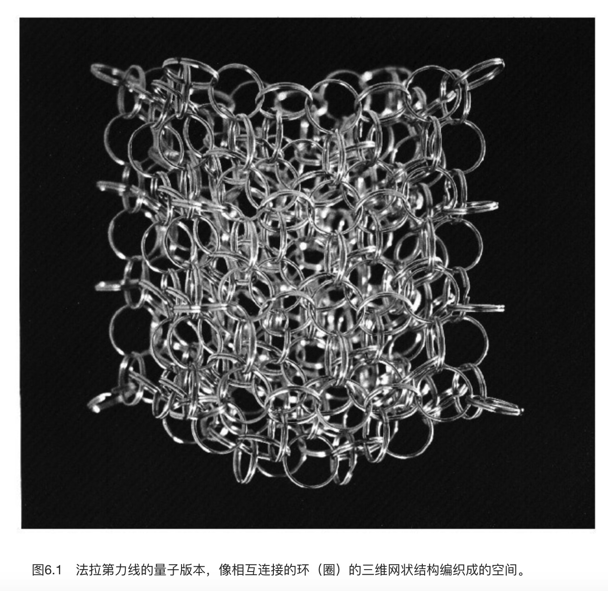

理解这些解的物理学关键在于这些线的交叉点。这些点被称为“节点”，节点之间的线被称为“连线”，一组相交线形成了“图”，也就是由连线连接的节点的组合，如图6.3所示。

计算表明，如果没有节点的话，物理空间就没有体积。换句话说，空间的体积存在于图中的节点，而非存在于线中。这些线把位于节点处的单个体积“连在一起”。

体积是一个取决于空间几何的几何量，但空间几何——就像爱因斯坦理解的那样，也像我在第三章描述的那样——是引力场。因此体积是引力场的属性，表示在房间的墙体之间有多少引力场。但引力场是个物理量，和所有物理量一样都遵从量子力学法则。体积也和所有物理量一样，不能取任意值，而只能取特定值，就像我在第四章描述的那样。如果你还记得的话，所有可能取值的集合被称为“谱”。因此应该存在一个`“体积谱”`（图6.2）。

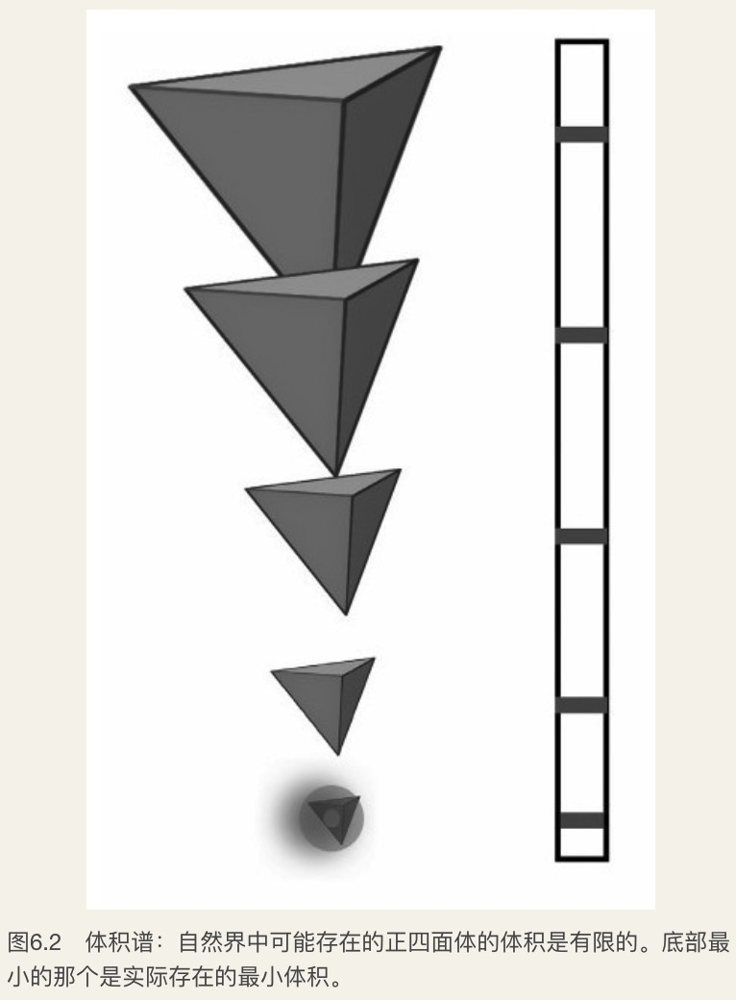

图中的节点表示体积的离散包，对光子而言，只能取特定的大小，可以用狄拉克的量子方程进行计算。图中的每个节点n都有其自身体积$ν_{n}$——体积谱中的一个数字。节点是构成物理空间的基本量子，图中的每个节点都是一个“空间的量子粒子”。显现的结构如图6.3所示。

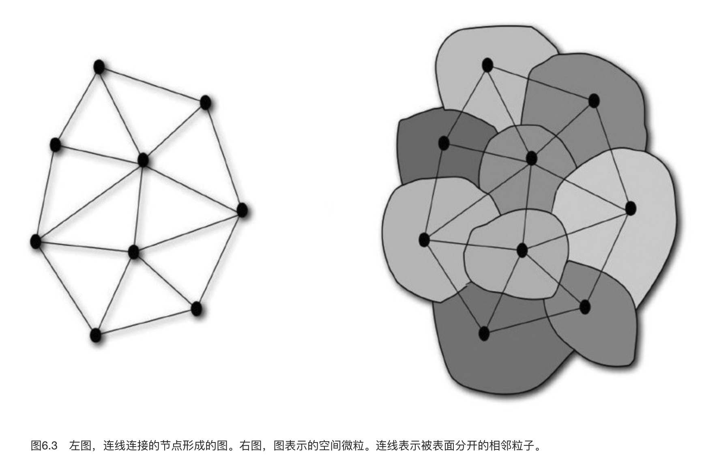

一条连线是法拉第力线的单个量子。现在我们可以理解它表示的含义了：如果你把两个节点想象为两块小的“空间区域”，这两个区域会被一个微小表面分开，这个表面的大小就是其面积。继体积之后的第二个量，就是与每条线有关的面积，标示出空间量子网络的特征。

面积与体积一样，也是个物理量，有自己的谱，可以用狄拉克方程进行计算。面积不是连续的，它是分立的。任意小的面积是不存在的。

空间看起来是连续的，只不过是因为我们无法感知这些单个空间量子极其微小的尺度。

当我们说房间的体积，比如说是100立方米时，我们实际上是在数空间的微粒——它所包含的引力场的量子。在一个房间里，这个数值会有超过100个数字。当我们说这页纸的面积是200平方厘米，我们实际上是在数整张纸中网络或圈的连线的数目。这本书的一页纸，其量子数大约有70个数字。

总结一下，`圈量子引力理论`，或者说`圈理论`，以一种相当保守的方式整合了广义相对论与量子力学，因为它并没有引入这两个理论以外的任何其他假设，只是进行了重写来使二者相容，但其结果却是颠覆性的。

广义相对论告诉我们空间是动态的东西，就像电磁场：一个活动的巨大软体动物，可以弯曲伸展，我们栖居其中。量子力学告诉我们每种场都由量子构成，也就是存在着精细的分立结构。因此物理空间作为一种场，也由量子构成。表示其他量子场特征的分立结构也表示量子引力场的特征，因此也表示空间的特征。我们预言会有引力的量子，正如存在光量子，电磁场的量子，以及量子场的量子——粒子。但空间是引力场，引力场的量子就是空间的量子：空间的分立成分。

**圈量子引力的核心预言是空间不是连续体，不是无限可分的，它由“空间原子”组成**，比最小的原子核的十亿分之十亿分之一还要小。

还记得阿喀琉斯追龟吗？芝诺说，阿喀琉斯在追上这个移动缓慢的生物之前要跑完无穷多的距离，这种观点我们接受起来有些困难。

但在自然之中真的如此吗？在阿喀琉斯和乌龟之间真的存在任意短的间隔吗？去谈论一毫米的十亿分之十亿分之十亿分之一，然后再分割无穷多次，真的有意义吗？

对几何数量的量子谱的计算表明，**答案是否定的：任意小的空间并不存在，空间的可分性有个下限，它虽然是非常小的尺度，但确实存在。**

阿喀琉斯不需要跑无穷多步才能追上乌龟，因为在有限大小的微粒组成的空间中，无穷小的步子并不存在。英雄会离乌龟越来越近，最终以一次量子飞跃赶上它。

在描述空间量子态的图中，每个节点标有体积v，每条线标有半整数j。具有这些附加信息的图被称为`自旋网络（Spin Network）`，见图6.4。

光子（电磁场的量子）和图中节点（引力的量子）的重要差别在于光子存在于空间之中，而引力子构成空间本身。光子由它们所在的位置来描述。空间的量子没有存在的位置，因为它们就是位置本身。只有一条信息可以描述它们的空间特征：它们相邻的也就是紧挨着的其他空间量子的信息。这一信息由图中的连线表示。由连线连接的两个节点是邻近的两个节点，它们是互相接触的两个空间微粒，这种“接触”建造了空间的结构。


引力的量子不在空间中，它们本身就是空间。描述引力场量子结构的自旋网络不在空间之中，它们并不占据空间。空间单个量子的位置只由连线及其表示的关系来定义。

在第四章中我曾证明，可以通过观察一个完成闭合回路的箭头的指向是原来的方向还是出现了偏折，来度量空间的曲率。理论的数学层面确定了自旋网络中每个闭合回路的曲率，这让求时空的曲率值成为可能，也可以根据自旋网络的结构来求引力场的力。

现在，不仅要涉及量子力学的分立性，还有另一个事实，演化是概率性的——自旋网络的演化也是随机的。我会在下一章专门讲时间的时候来谈这一点。

还有一点是，物质不是它本身的样子，而是它们相互作用时的样子。自旋网络不是实体，它们描述了空间对物体的作用。就像电子不在任何位置，而是弥散在无处不在的概率云中，空间实际上也不是由单个的自旋网络形成，而是由覆盖所有可能的自旋网络范围的概率云构成。

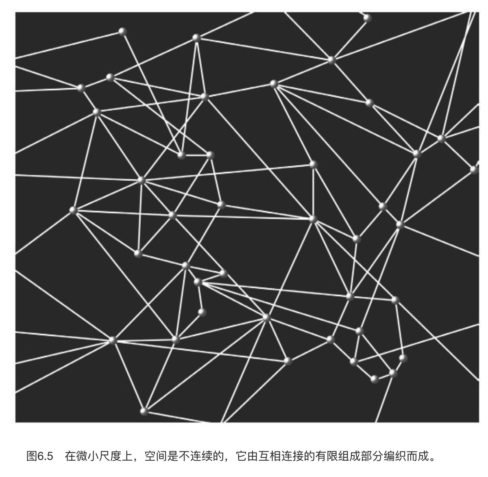

在极其微小的尺度上，空间是一群涨落的引力子，它们之间相互作用，一起对物体产生作用，在这些相互作用中以自旋网络和相互关联的微粒来显现自己。

物理空间就由这些永不停息的关联网络织就。这些线本身不在任何地方；它们不在任何位置，而是通过相互作用创造位置。空间由引力子之间的相互作用创造。

我们不能把时间看作一个记录宇宙生命的巨大宇宙时钟。一个多世纪以来我们已经知晓，我们应该把时间看成局部的现象：宇宙中的每个物体都有它自己的时间之流，其速度由当地的引力场决定。

但是当我们把引力场的量子特性考虑进来的时候，即使是局部时间的概念也不再起作用。在普朗克尺度上，量子事件不再按照时间的流逝先后发生。在某种意义上，时间不再存在。

说时间不存在是什么意思呢？

首先，时间变量从基本方程中消失并不意味着一切都是静止的，不表示改变不会发生。刚好相反，这表明变化是普遍存在的。这只是表明：基本过程不再能够被形容为“一个瞬间接着另一个瞬间”。在空间量子极其微小的尺度上，自然之舞不再追随唯一的乐团指挥手中那根棒子挥出的同一节拍，每个物理过程都遵循着自己的节奏，独立于邻近的其他过程。时间的流逝是世界所固有的，是世界与生俱来的，从量子事件之间的关系中产生。这些量子事件正是世界本身，产生它们自己的时间。

据传说，伽利略是在比萨大教堂里偶然发现的这个想法，当时他正注视着一个巨大的蜡烛吊灯缓慢摆动，那个吊灯现在还在那儿。（这个传说是虚构的，因为吊灯实际上是在伽利略去世几年之后才吊上去的，但这是个好故事。也许当时有另一个吊灯在那儿。）我们的科学家在一个宗教仪式期间观察着摆动，很明显他没怎么被这个仪式吸引，他正在通过数自己脉搏的跳动来测量吊灯每次摆动的持续时间。他越来越兴奋，发现每次摆动期间脉搏跳动的次数都是相同的：当吊灯变慢、振幅变小的时候也不发生改变。摆动一直持续相同的时间。

这是个很棒的故事，但反思一下的话，它给我们留下了困惑——这一困惑直抵时间问题的核心。伽利略怎么知道他自己脉搏的跳动都维持相同的时间呢？

伽利略之后没过多长时间，医生开始用手表——实际上也是钟摆，来测量病人的脉搏。所以我们用脉搏来确保钟摆的摆动是均匀的，然后又用钟摆来确认脉搏跳动的均匀。这难道不是一种循环吗？这表明什么呢？

这表明实际上我们从未测量时间本身；我们一直在测量物理量A、B、C（振动、跳动和许多其他量），把一个量与另一个量进行比较，也就是说，我们测量的是函数A（B）、B（C）、C（A）等。我们可以数每次摆动脉搏跳动多少次；秒表嘀嗒一次有多少次振动；钟楼的钟声之间我的秒表嘀嗒了多少次……

牛顿在他的书中很明确地指出我们无法测量时间t，但如果我们假定时间存在，就可以建立一个描述自然的有效框架。

如果我们想要广泛理解世界，想要理解在量子引力影响下的我们不那么熟悉的情形下世界如何运作，我们就需要放弃这个模型。自行流逝的时间t以及事物相对于它演化的观念不再奏效。世界不再由在时间中演化的方程来描述。我们需要做的只是列举出我们实际观察到的变量A、B、C，写出表达这些变量之间关系的方程，就足够了。也就是我们观察到的关系A（B）、B（C）、C（A）的方程，而不是我们没有观察到的函数A（t）、B（t）、C（t）。

我们必须学会不以事物在时间中变化而是以其他方式来思考世界。事物只是相对于另一事物发生变化。在基本层面，时间不存在。我们通常对时间流逝的感觉只是在宏观尺度上的一种有效近似，这主要是源于我们只能以粗糙的方式感知世界。

思考一个过程，比如绿色桌面上两个台球的碰撞。想象一颗红球朝着一颗黄球的方向运动；逐渐接近，然后碰撞，两个球沿不同的方向运动。这个过程和所有过程一样，发生在有限的空间范围内——比如说在一张大约两米宽的桌子上——并且持续有限间隔的时间——比如三秒钟。要在量子引力的语境中处理这个过程，需要把空间和时间包含进过程本身（图7.1）。

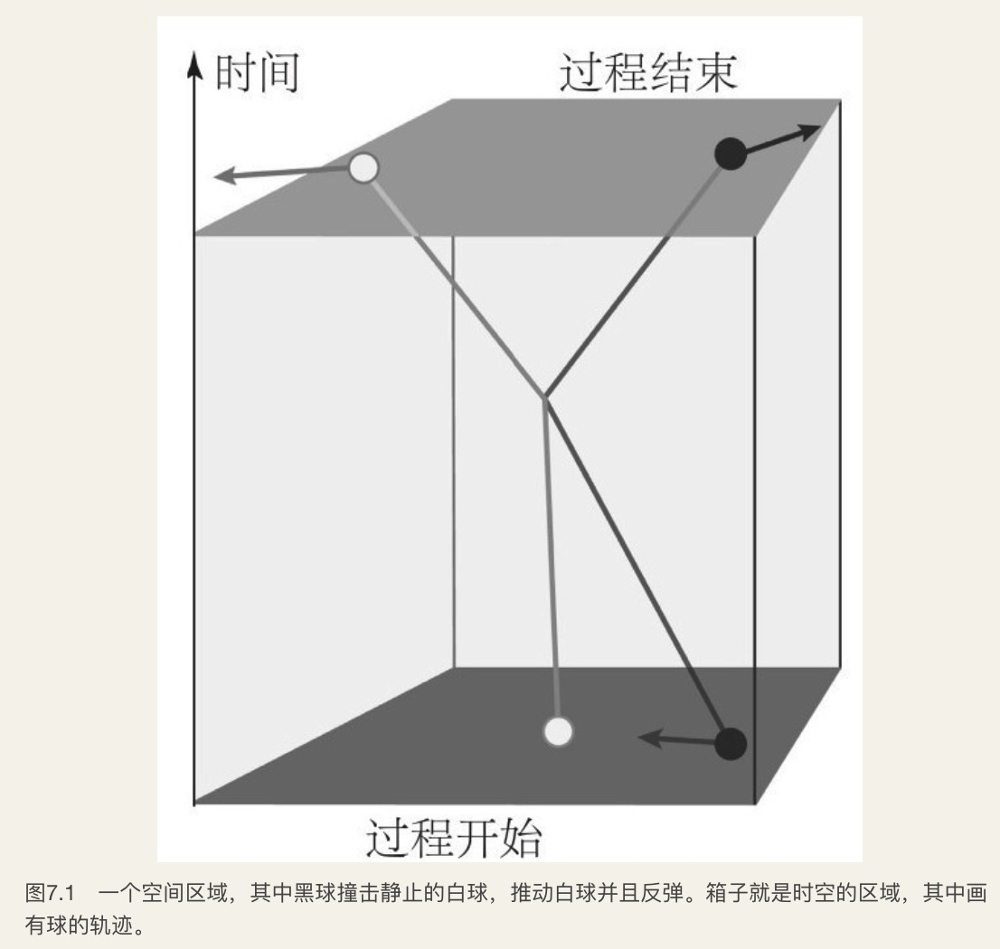

换句话说，我们不能只描述两个球，也要描述它们周围的一切：桌子与任何其他物体，以及从运动开始到过程结束这段时间内它们所在的空间。

由此我们得到的是一个时空箱（如图7.1所示）：有限的时空，即几立方米，几秒钟时间。这个过程不发生在时间内，这个箱子不在时空之内，它包含时空。这不是个在时间之内的过程，正如空间微粒不在空间内。时光的流逝只是过程本身的量度，正如引力量子不在空间内，它们本身构成空间。

理解量子引力如何运作的关键就在于，不只要考虑两个球的物理过程，还要考虑整个箱子定义的全过程，以及它所涉及的全部，包括引力场。

现在让我们回到海森堡的独特洞见：**量子力学并没有告诉我们在过程中发生了什么，而是告诉了我们把过程的初始状态和最终状态结合到一起的概率**。在我们的例子中，初始状态与最终状态由时空箱边界所发生的一切给出。

圈量子引力方程可以给我们的是与给定箱子的可能边界联系在一起的概率——球以某个特定形态从箱子里出来的概率，或者它们进入另一个箱子的概率。

这个概率如何计算呢？回忆一下我在讨论量子力学时描述过的费曼路径积分。量子引力中的概率也可以用同样的方式来计算——通过考虑具有相同边界的所有可能的“轨迹”。由于我们把时空的动力学包含在内，这意味着要考虑具有相同边界的所有可能时空。

量子力学假定，在两个球进入的初始边界与它们离开的最终边界之间，没有确定的时空，球也没有确定的轨迹。存在一个量子“云”，其中包含所有可能的时空和所有可能的轨迹。发现球从某个方向离开的概率可以通过对所有可能的时空求和来进行计算。

如果量子空间具有自旋网络结构，时空会有什么结构呢？之前在计算中提到的时空会是什么样子呢？

它一定是个自旋网络的“历史”。假设我们取自旋网络的一张图，然后移动它，那么网络中的每个节点都会画出一条线，如图7.1中的球，图中的每条线运动，会画出一个面（例如运动的线段画出矩形）。但除此之外，一个节点可以扩展为两个或多个节点，就像一个粒子可以分裂为两个或更多粒子。反过来，两个或更多的节点可以结合成一个。这样，图像便会如图7.2中一样演化。

图7.2中右边描绘的图像是一个“自旋泡沫”（Spinfoam）。面相交于线，随后交汇于顶点，形成如肥皂泡的泡沫（图7.3），之所以叫“自旋泡沫”是因为泡沫的表面带有自旋，正如图中连线所描述的每一个演化。


要计算一个过程的概率，我们必须对箱子里所有可能与这一过程具有同样边界的自旋泡沫求和。自旋泡沫的边界是自旋网络及其上的物质。

圈量子引力方程通过对既定边界的自旋泡沫求和来表述这一过程的概率。原则上用这种方法可以计算任何物理事件的概率。

在量子引力中出现了很美妙的事情：这两种计算方法成了同一种。图7.2描绘的在量子引力中用来计算物理过程的时空泡沫，既可以用费曼图解释，也可以用格点近似来解释。因此，标准模型的这两种计算方法原来是一种通用方法的特殊情况：对量子引力自旋泡沫求和。


空间是个自旋网络，它的节点代表基本微粒，连线描述其相邻关系。时空在这些自旋网络相互转化的过程中产生，这些过程由对自旋泡沫求和来描述。自旋泡沫表示自旋网络的历史，图中的节点相互结合与分开，形成分立时空。

**世界由什么构成？** 现在答案很简单了：粒子是量子场的量子；光由场的量子形成；空间也只不过是由量子构成的场；时间也在这个场的过程中形成。换句话说，世界完全由量子场构成（图7.8）。

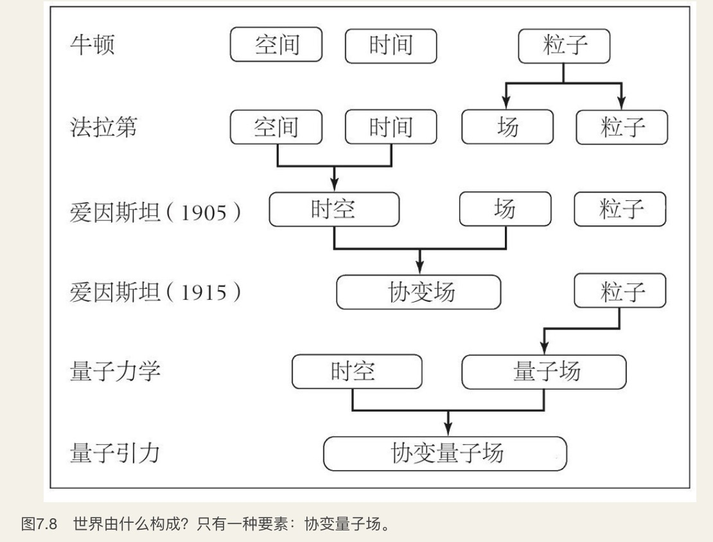

爱因斯坦广义相对论中的弯曲连续空间，与平直统一空间中量子力学的分立量子之间的分裂消融了，显著的矛盾不复存在。时空连续体与空间量子之间的关系，就如同电磁波与光子之间的关系。光子在大尺度上的近似形象就是波，波以光子的形式相互作用。连续空间和时间是引力量子在大尺度上的近似形象，引力量子是空间和时间相互作用的方式。相同的数学一致地描述了量子引力场和其他量子场。

康德断言，知识的主体与客体是不可分的，他在这点上也许是正确的，但他把牛顿的空间和时间看作知识的先验形式，看成理解世界必不可少的基本原理的一部分，这一点肯定是错误的。这一基本原理已经发展了，并且随着我们知识的增长，还在继续演变。

## 第四部分 超越时空
让我们想象一个致密的宇宙，由于自身的重量被挤压得极其微小。根据爱因斯坦方程，这个宇宙会被无限压缩，在某个点上会完全消失，就像陷入原子核的电子。如果我们忽略量子力学，这就会是爱因斯坦方程预言的大爆炸。

但如果我们把量子力学考虑进来，宇宙就不会被无限压缩，量子斥力会使其反弹。收缩的宇宙不会坍缩成一个点：它会反弹并开始膨胀，好像是由爆炸形成的一样（图8.3）。

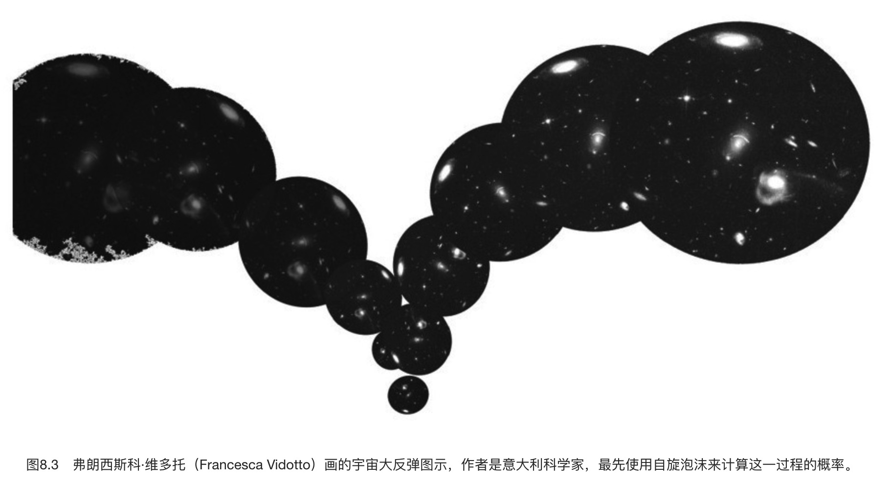

一个宇宙从收缩到膨胀，穿越大反弹阶段的概率可以用上一章描述过的时空箱方法来计算。用连接收缩宇宙和膨胀宇宙的自旋泡沫，就可以完成计算。

这些年在基础物理学中有三个重要的实验结果。第一个是日内瓦欧洲核子研究组织发现了希格斯玻色子（图9.1）。第二个是由普朗克卫星（图9.2）做出的观测，测量数据在2013年公之于众，证实了标准宇宙模型。第三个是在2016年的头几个月公布的首次探测到引力波。这些是自然最近给我们的三个信号。


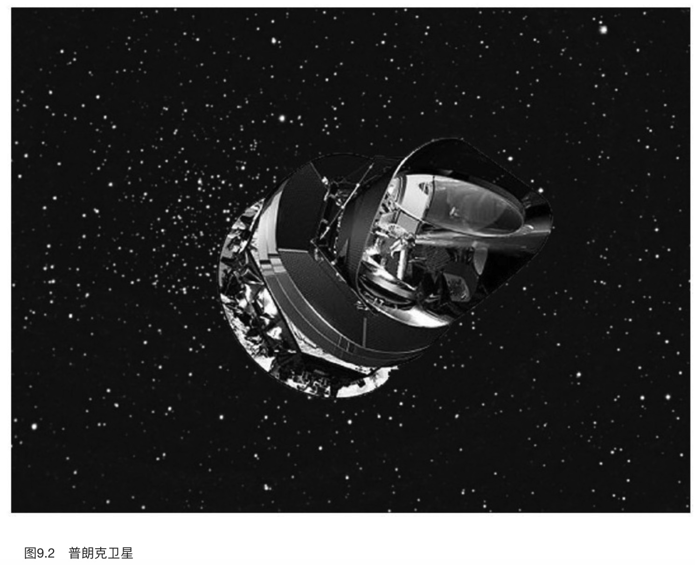

希格斯玻色子的发现强有力地证明了基于量子力学的基本粒子标准模型的正确性，这是对三十年前做出的预言的验证。对基于广义相对论和宇宙常数的标准宇宙模型而言，普朗克卫星的观测结果是个坚实的证据。对已经诞生了一百年的广义相对论来说，探测到引力波是个惊人的证据。

目前我提到的三个实验结果已经为自然发声：“不要再幻想着新的场或奇怪的粒子；附加的维度，其他对称性，平行宇宙，弦，或是别的什么。拼图十分简单，就是广义相对论、量子力学和标准模型。下一步也许‘只是’把它们以正确的方式进行整合的问题。”这对量子引力共同体来说是个让人欣慰的建议，因为这正是理论的假设：广义相对论、量子力学和与之相容的标准模型，再无其他。那些根本性的概念上的推论：空间的量子化、时间的消失——并不是大胆的假说，它们是在认真对待我们最优秀理论的基本洞见后得出的合理推论。

狭义相对论也许可以总结为发现了一切物理系统都存在一个最大速度。量子力学可以总结为发现了每个物理系统都存在信息的最大值。最小的长度是普朗克长度Lp，最大速度是光速c，信息的总和由普朗克常数h决定。这些内容总结在表格11.1里。

表11.1　理论物理学发现的基本极限


信息的概念在1948年由美国数学家、工程师克劳德·香农（Claude Shannon）给出了明确的定义，十分简洁：**信息是对某件事可供选择的多少的量度**。例如，如果我掷一枚骰子，它可以落在六个面中任意一个上。当我们看到它落在某个面上时，就有了信息量N=6，因为可能的选择总共有6个。如果我不知道你的生日是在一年中的哪一天，那么就有365种不同的可能。如果你告诉我日期，我就有了信息N=365，依此类推。

科学家用一个代表“香农信息”的量S来度量信息，而不是用可能选择的数量N。S被定义为以2为底的N的对数：$S=log_{2}N$。使用对数的好处在于计量单位S=1对应着N=2（因为$1=log_{2}2$），使得信息的单位成为最小的可选数字：在两个可能中做出选择。这个计量单位叫作`“比特”`。

**为何信息的概念如此有用，甚至可能是理解世界的基础呢？原因很微妙：它衡量了一个物理系统与另一物理系统交流的能力。**

德谟克利特真的提出一切都可以还原为原子了吗？让我们更仔细地审视下。德谟克利特说当原子结合时，重要的是它们的形式，在结构中的排列方式，以及它们结合的方式。他以字母表中的字母为例：只有大约二十个字母，但“它们可以按照不同的方式组合，来创造喜剧或者悲剧，荒唐的故事或史诗”。

在这一理念中不只有原子：关键在于原子之间结合的方式。但是在一个只有其他原子的世界中，它们结合的方式之间又会有什么关联呢？

如果原子也是一个字母表，谁能够读懂用这个字母表写出的词语呢？

答案十分微妙：原子排列的方式与其他原子排列的方式相互关联。因此，从技术上来讲，一组原子具有信息，可以精确感知到另一组原子。

**世界不只是碰撞的原子网络，它也是成组的原子之间关联的网络，物理系统之间交互信息的真实网络。**

统计力学的创始人、奥地利科学家路德维希·玻尔兹曼（Ludwig Boltzmann）最先弄清了其中的原因。热是分子随机的微观运动：当茶热一些的时候，分子的运动更剧烈。为什么它会冷却下来呢？玻尔兹曼做出了一个绝妙大胆的假设：因为冷空气和热茶水中分子可能状态的数量少于热空气和冷茶水中分子可能状态的数量。组合状态会从可能状态较少的情形演化为可能状态较多的情形。

如果茶水凉了，一小部分能量会传递到周围空气中，因此，茶水分子的运动会变慢，空气分子的运动会变快。如果计算丢失的信息，会发现它增加了。然而，如果是茶水从周围更冷的空气中吸收了热量，丢失的信息会变少，即我们知道的会更多。但信息不会从天上掉下来，它无法自己增加，因为我们不知道的东西，就是不知道。因此，茶水在与冷空气接触时无法自己加热。这听起来有点神奇，但很有效：我们可以只根据信息不会平白无故增加这条经验，来预测热如何运作。

S=k log W

这一公式表达了（丢失的）信息是可能的选择数量的对数，是香农的重要理念。玻尔兹曼指出，这个量与热力学中的熵一致。`熵`就是“丢失的信息”，也就是前面有负号的信息。熵的总量只能增加，因为信息只能够减少。

量子力学的一个重要结论就是信息是有限的。在经典力学中测量一个物理系统时，我们能够得到的可能结果的数量是无穷的；但是多亏了量子力学，我们明白了实际上这个数量是有限的。量子力学可以理解为发现了自然界中的信息总是有限的。

实际上，量子力学的整个结构都可以根据信息按照如下方式来解读和理解。一个物理系统只有在与其他物理系统相互作用时才显现。于是，对物理系统的描述也是相对于另一与之相互作用的物理系统给出的。因此，对系统的任何描述都是对一个系统所具有的关于另一系统的信息的描述，即两个系统之间的关联。如果用这种方式来解释，按照物理系统具有的关于其他物理系统的信息来描述，量子力学的神秘之处就没有那么深奥难懂了。

最终，一个系统的描述只不过是总结过去所有与之发生的相互作用，并使用它们来预测未来相互作用的影响。

量子力学的整个形式结构很大程度上可以表述为两条简单的基本原理：
1. 任何物理系统中的相关信息是有限的。
2. 你永远能够得到一个物理系统的新信息。

在这里，“相关信息”是我们拥有的关于一个给定系统的信息，由我们过去与之发生的相互作用得来：信息允许我们预测与这个系统未来相互作用的结果。第一条基本原理表示了量子力学的分立性特征：只存在数量有限的可能性。第二条表示了其不确定性特征：总是存在一些无法预测的事，让我们能得到新的信息。当我们得到关于某一系统新的信息时，相关信息的总量不能无限增加（由于第一条基本原理），之前信息的一部分变得不相关了，也就是说，它对预测未来不再有任何作用。在量子力学中，当我们与一个系统相互作用时，我们不仅是了解到一些内容，也“删去”了关于系统的一部分相关信息。

**惠勒创造了“万物源于比特”的说法来表达这一点，表示“一切都是信息”。**

于是，信息又出现在量子引力的语境里。回忆一下：任何表面的面积都是由与这个表面相交的圈的自旋决定的。这些自旋是离散量，每一个都对面积起作用。

具有固定面积的表面可能由这块面积上的基本量子以许多不同方式形成，比如说以N种方式。如果你知道表面的面积，但不确切知道这块面积的量子是怎样分布的，你就丢失了关于这个表面的信息。这就是计算黑洞热量的方式之一：被一块特定面积的表面包围的黑洞，这一面积的量子可能有N种不同的分布。就像那杯茶一样，其中的分子可能以N种不同的方式运动。因此我们可以把丢失信息的量，也就是熵，与黑洞联系起来。

与黑洞联系在一起的信息量直接取决于黑洞的面积A：黑洞越大，丢失的信息越多。

当信息进入黑洞后，就不能从外面找回了。但是进入黑洞的信息携带了能量，黑洞变大了，增加了面积。从外面看来，在黑洞中丢失的信息现在表现为与黑洞表面积联系在一起的熵。

但是情况一点也没有更明了，因为如我们在上一章看到的，黑洞会发出热辐射，非常缓慢地蒸发，变得越来越小，最终有可能消失，融入普朗克尺度下构成空间的微观黑洞的海洋中。当黑洞收缩时，陷入黑洞的信息去哪儿了呢？理论物理学家正在争论这个问题，没人有完全明确的答案。

我相信，这一切都表明，为了理解世界的基本原理，我们需要把三个基本要素融合在一起，而不止是两个：不只是广义相对论与量子力学，还包括热理论，也就是统计力学与热力学，我们也可以称之为信息理论。

在宇宙的基本方程中，有很多日常概念不再起作用；例如“上”与“下”，“热”与“冷”，所以共有的日常概念从基础物理学中消失，这并没有什么特别奇怪的。然而，一旦我们接受了这个观念，很明显就会碰到下一个问题。我们如何找回日常经验的概念？它们在特定的环境中是如何形成的呢？

例如，“上”和“下”的概念没有进入牛顿方程中，但在一张没有绝对上下的图中，我们知道它们的含义。在一个大物体比如行星附近，“上”和“下”是有意义的。“下”表示邻近的大物体施加引力的方向，朝向大物体；“上”表示相反的方向。“热”和“冷”也一样：在微观层面没有“热”或“冷”的物体，但是当我们把大量微观成分放在一起，按平均值进行描述时，“热”的概念就出现了：热的物体单个成分的平均速度会升高。我们可以在特定的情形下理解“上”和“热”的含义，比如邻近存在物质，或我们只处理很多分子的平均值时，等等。

对“时间”来说也是类似的：时间的概念可能在基本层面没有作用，但它在我们的生活中会起到重要作用，就像“上”和“热”那样。如果时间不能用于描述世界的基本层面，那么“时间的流逝”意味着什么呢？

答案很简单。时间的起源也许和热的起源很相似：**它来自许多微观变量的平均值。**

时间和温度之间存在联系是个古老又反复出现的观点。如果你想一下的话，会发现有时间流逝的一切现象都与温度有关。时间的显著特点是向前移动，不会向后移动，也就是不可逆的。与热无关的力学现象则是可逆的。

当石头接触地面并停下来时，你就会提出反对意见了：因为如果你倒着看影片，就会看到石头自己从地上跳起来，而这令人难以置信。但是当石头接触地面并且停下来，它的能量去哪儿了呢？它加热了地面！**在热量产生的那个时刻，过程就不可逆转了：过去与未来区分开来。一直是热量并且只有热量才能把过去与未来区别开。**

这是普遍存在的。燃烧的蜡烛会转化为烟——烟无法转化为蜡烛——而蜡烛会产生热量。一杯滚烫的茶水冷却，不再升温：它会散发热量。我们活着，变老：产生热量。我们的旧自行车会随着时间磨损：通过摩擦产生热量。想想太阳系，首先粗略来看，太阳系像一个巨大的持续运转的机械装置，始终保持原样。它不产生热量，实际上如果你倒过来看，也不会觉得有什么奇怪的地方。但是更仔细观察的话，不可逆的现象也存在：太阳正在消耗其可燃氢，最终会耗尽并熄灭：太阳也在变老，在产生热量。月亮看起来像是永恒不变地环绕地球运动，一直维持原状，然而实际上它在缓慢远离地球。这是因为月亮引起了潮汐，潮汐稍微加热了海洋，从而与月亮交换了能量。无论何时，当你去思考一个要证明时间流逝的现象时，都会发现是通过热量的产生来证明的。没有热量，时间就没有选定的方向。

`热时间`的概念把这种经验颠倒过来，也就是不去探究时间怎样产生热量的损耗，而是询问热量如何产生时间。

**热时间的概念在于，时间的概念也源自我们只与许多变量的平均值相互作用这一事实。**

只要我们拥有对一个系统的完整描述，系统的所有变量就具有同等的地位，没有哪个充当时间变量。也就是说：没有变量与不可逆现象相关。但只要我们用许多变量的平均值来描述系统，我们就有了一个优先选取的变量，其作我们用许多变量的平均值来描述系统，我们就有了一个优先选取的变量，其作用和通常的时间一样，也就是热量随之耗散的时间，我们日常经验的时间。

因此时间并不是世界的基本组成部分，但看起来却是，因为世界如此浩瀚，我们只是世界里的微小系统，只与无数的微观变量平均后的宏观变量相互作用。在日常生活中，我们从没见过单个的基本粒子，或者单个空间量子。我们看到石头、高山和朋友的脸庞——我们所看到的这些东西，每一个都由无数的基本要素组成。**我们始终在与平均值发生关联，平均值的运作就是：损耗热量，并且从中产生时间。**

理解这个概念的难点在于我们很难想象一个没有时间的世界，很难想象时间以一种近似的方式出现。我们太习惯于认为实在存在于时间之中。我们是生活在时间里的生物，我们存在于时间里，并且被时间滋养。我们是这种由微观变量平均值产生的时间的结果。

时间是我们忽略了事物微观物理状态的结果。时间是我们所没有的信息。

时间是我们的无知。

**实在就是编织成世界的关联网络、交互信息网络**。我们把周围的实在切割成客体，但实在不是由离散的客体组成的，它是变化的，流动的。想一想大海的波浪，一个波浪在哪里终结，从哪里开始？想想高山，一座山从哪里开始，在哪里结束？它在地表之下又延续多远？这些都是没有什么意义的问题，因为一个海浪和一座山不是独立存在的客体，它们是我们把世界切分后理解世界的方式，以便进行讨论。这些界限是任意划分、约定俗成的，使用起来很方便：比起海浪与高山，它们更多取决于我们（作为物理系统）。它们是组织我们所拥有的信息的方式，或者说，是我们所拥有的信息的形式。

充分思考的话，这对任何物体都适用，也包括生命体。这就是问剪掉一半的指甲后“我”仍然是“我”还是已经“不是我”没什么意义的原因；如同问猫留在沙发上的毛发仍然是猫的一部分，还是不是；或一个孩子的生命到底是何时开始的：是在他成为胎儿很久以前，有个人第一次梦到他，还是他第一次形成自我形象，抑或是他第一次呼吸，认识了自己的名字？我们可以使用各种其他的约定，它们都很有用，但是很随意。它们是思考的方式，可以在复杂的实在中为我们指明方向。

**生命体是一个系统，会不断更新自己来维持自身，不断与外界相互作用。在这些生物体中，只有那些更新更有效率的才能继续生存，因此生命体会展现出适合它们维持生存的特质**。出于这种原因，它们是可以被解释的，我们根据意图与目的来对它们进行解释。生物世界目的论的一面（这是达尔文的重大发现）是对繁衍中有效的复杂形式进行选择的结果，但是在一个多变的环境中持续生存的有效方式就是与外在世界维持更好的关联，其关键就是信息——去收集、存储、传递、精练信息。由于这个原因，DNA、免疫系统、感觉器官、神经系统、复杂的大脑、语言、书籍、亚历山大图书馆、电脑与维基百科才得以存在：它们把信息处理的效率最大化——处理对生存有利的关联。

信息的概念在我们理解世界的努力中发挥了重要的作用。从交流到基因的基础，从热力学到量子力学，一直到量子引力，信息的概念作为理解的工具正在普及。**世界不应该被理解为无组织的原子的集合——而应该被理解为一种映射游戏，以这些原子组合形成的结构之间的关联为基础。**

德谟克利特给出了一种奇特的“人”的定义：**人是我们所知的一切**。乍看起来似乎很愚蠢，没有意义，但事实并非如此。

研究德谟克利特的重要学者萨洛蒙·卢里亚（Salomon Luria）评论说，德谟克利特留给我们的不是陈词滥调。人的本性不是他的内在结构，而是他置身其中的个人、家庭、社会相互作用的网络。是这些“造就”了我们，保护着我们。作为人类，我们是他人了解的我们，我们了解的自己，以及他人所了解的我们的信息。我们是交互信息的丰富网络中复杂的节点。

这是个不存在于空间也不在时间中演化的世界，一个只由相互作用的量子场组成的世界，通过密集的相互作用网络产生空间、时间、粒子、波与光（图13.1）。

```
延续着，延续着，充满生命，与死亡；
温柔，却怀有敌意；清晰，却不可知晓。
```

诗继续道：

```
由瞭望台，放眼望去，眼界所及，直挂天际。
```

一个没有无穷的世界，其中无穷小不存在，因为这片浩瀚有个最小尺度，在它之下空无一物。空间量子与时空泡沫混合，事物的结构诞生于交互信息，编织成世界不同区域间的关联。一个我们能用一组方程来描述的世界。也许，还要进行修正。

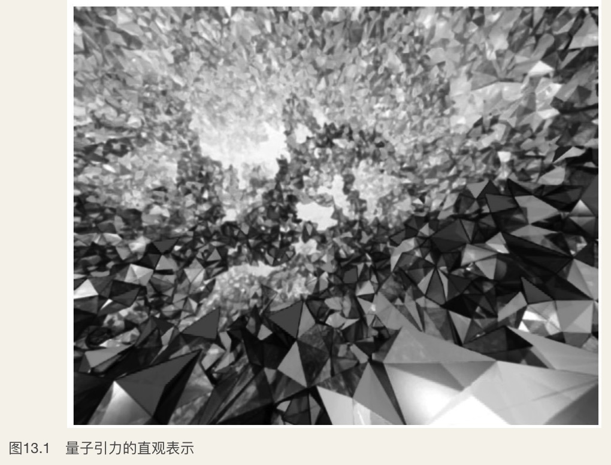