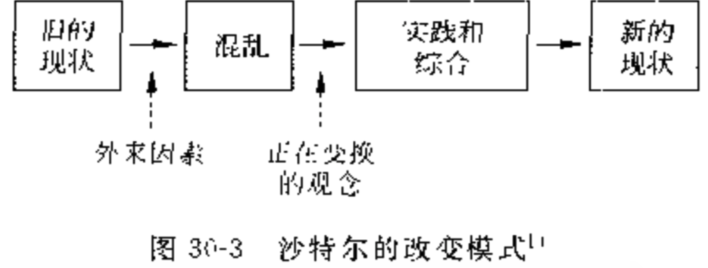

    作者: Tom DeMarco / Timothy Lister 
    出版社: 清华大学出版社
    原作名: Peopleware
    译者: UML China 
    出版年: 2003-6
    页数: 354
    定价: 35.00元
    装帧: 平装(无盘)
    ISBN: 9787302063841

[豆瓣链接](https://book.douban.com/subject/1108725/)

- [第一部分 管理人力资源](#%E7%AC%AC%E4%B8%80%E9%83%A8%E5%88%86-%E7%AE%A1%E7%90%86%E4%BA%BA%E5%8A%9B%E8%B5%84%E6%BA%90)
  - [第1章 在今天的某个地方,一个项目正在失败](#%E7%AC%AC1%E7%AB%A0-%E5%9C%A8%E4%BB%8A%E5%A4%A9%E7%9A%84%E6%9F%90%E4%B8%AA%E5%9C%B0%E6%96%B9%E4%B8%80%E4%B8%AA%E9%A1%B9%E7%9B%AE%E6%AD%A3%E5%9C%A8%E5%A4%B1%E8%B4%A5)
  - [第2章 做吉士汉堡,卖吉士汉堡](#%E7%AC%AC2%E7%AB%A0-%E5%81%9A%E5%90%89%E5%A3%AB%E6%B1%89%E5%A0%A1%E5%8D%96%E5%90%89%E5%A3%AB%E6%B1%89%E5%A0%A1)
    - [错误限额](#%E9%94%99%E8%AF%AF%E9%99%90%E9%A2%9D)
    - [管理:莽汉的定义](#%E7%AE%A1%E7%90%86%E8%8E%BD%E6%B1%89%E7%9A%84%E5%AE%9A%E4%B9%89)
    - [人员储备](#%E4%BA%BA%E5%91%98%E5%82%A8%E5%A4%87)
    - [一个稳定状态的项目就是死胡同](#%E4%B8%80%E4%B8%AA%E7%A8%B3%E5%AE%9A%E7%8A%B6%E6%80%81%E7%9A%84%E9%A1%B9%E7%9B%AE%E5%B0%B1%E6%98%AF%E6%AD%BB%E8%83%A1%E5%90%8C)
  - [第3章 维也纳在等候你](#%E7%AC%AC3%E7%AB%A0-%E7%BB%B4%E4%B9%9F%E7%BA%B3%E5%9C%A8%E7%AD%89%E5%80%99%E4%BD%A0)
    - [使用西班牙人的理论的管理](#%E4%BD%BF%E7%94%A8%E8%A5%BF%E7%8F%AD%E7%89%99%E4%BA%BA%E7%9A%84%E7%90%86%E8%AE%BA%E7%9A%84%E7%AE%A1%E7%90%86)
    - [来自后方的一句话](#%E6%9D%A5%E8%87%AA%E5%90%8E%E6%96%B9%E7%9A%84%E4%B8%80%E5%8F%A5%E8%AF%9D)
    - [世上没有加班这回事](#%E4%B8%96%E4%B8%8A%E6%B2%A1%E6%9C%89%E5%8A%A0%E7%8F%AD%E8%BF%99%E5%9B%9E%E4%BA%8B)
    - [生产力:赢得战役和输掉战争](#%E7%94%9F%E4%BA%A7%E5%8A%9B%E8%B5%A2%E5%BE%97%E6%88%98%E5%BD%B9%E5%92%8C%E8%BE%93%E6%8E%89%E6%88%98%E4%BA%89)
  - [第4章 质量——如果时间许可](#%E7%AC%AC4%E7%AB%A0-%E8%B4%A8%E9%87%8F%E5%A6%82%E6%9E%9C%E6%97%B6%E9%97%B4%E8%AE%B8%E5%8F%AF)
    - [逃避优秀](#%E9%80%83%E9%81%BF%E4%BC%98%E7%A7%80)
    - [质量是免费的,但......](#%E8%B4%A8%E9%87%8F%E6%98%AF%E5%85%8D%E8%B4%B9%E7%9A%84%E4%BD%86)
  - [第5章 重新研究帕金森定律](#%E7%AC%AC5%E7%AB%A0-%E9%87%8D%E6%96%B0%E7%A0%94%E7%A9%B6%E5%B8%95%E9%87%91%E6%A3%AE%E5%AE%9A%E5%BE%8B)
    - [来自新南威尔士大学的一些数据](#%E6%9D%A5%E8%87%AA%E6%96%B0%E5%8D%97%E5%A8%81%E5%B0%94%E5%A3%AB%E5%A4%A7%E5%AD%A6%E7%9A%84%E4%B8%80%E4%BA%9B%E6%95%B0%E6%8D%AE)
    - [帕金森定律主题的变化](#%E5%B8%95%E9%87%91%E6%A3%AE%E5%AE%9A%E5%BE%8B%E4%B8%BB%E9%A2%98%E7%9A%84%E5%8F%98%E5%8C%96)
  - [第6章 苦杏仁苷](#%E7%AC%AC6%E7%AB%A0-%E8%8B%A6%E6%9D%8F%E4%BB%81%E8%8B%B7)
    - [七个女妖](#%E4%B8%83%E4%B8%AA%E5%A5%B3%E5%A6%96)
- [第二部分:办公环境](#%E7%AC%AC%E4%BA%8C%E9%83%A8%E5%88%86%E5%8A%9E%E5%85%AC%E7%8E%AF%E5%A2%83)
  - [第8章 “在早上9点到下午5点之间,你在这里从未把任何事做完”](#%E7%AC%AC8%E7%AB%A0-%E5%9C%A8%E6%97%A9%E4%B8%8A9%E7%82%B9%E5%88%B0%E4%B8%8B%E5%8D%885%E7%82%B9%E4%B9%8B%E9%97%B4%E4%BD%A0%E5%9C%A8%E8%BF%99%E9%87%8C%E4%BB%8E%E6%9C%AA%E6%8A%8A%E4%BB%BB%E4%BD%95%E4%BA%8B%E5%81%9A%E5%AE%8C)
    - [工作场所的影响](#%E5%B7%A5%E4%BD%9C%E5%9C%BA%E6%89%80%E7%9A%84%E5%BD%B1%E5%93%8D)
  - [第9章 在空间上省钱](#%E7%AC%AC9%E7%AB%A0-%E5%9C%A8%E7%A9%BA%E9%97%B4%E4%B8%8A%E7%9C%81%E9%92%B1)
    - [吉尔伯定律](#%E5%90%89%E5%B0%94%E4%BC%AF%E5%AE%9A%E5%BE%8B)
    - [闭着眼度量](#%E9%97%AD%E7%9D%80%E7%9C%BC%E5%BA%A6%E9%87%8F)
  - [第10章 脑力时间 vs.体力时间](#%E7%AC%AC10%E7%AB%A0-%E8%84%91%E5%8A%9B%E6%97%B6%E9%97%B4-vs%E4%BD%93%E5%8A%9B%E6%97%B6%E9%97%B4)
    - [顺流](#%E9%A1%BA%E6%B5%81)
    - [无止境地被打断](#%E6%97%A0%E6%AD%A2%E5%A2%83%E5%9C%B0%E8%A2%AB%E6%89%93%E6%96%AD)
    - [在顺流状态下的时间计算](#%E5%9C%A8%E9%A1%BA%E6%B5%81%E7%8A%B6%E6%80%81%E4%B8%8B%E7%9A%84%E6%97%B6%E9%97%B4%E8%AE%A1%E7%AE%97)
    - [E-因子](#e-%E5%9B%A0%E5%AD%90)
  - [第11章 电话](#%E7%AC%AC11%E7%AB%A0-%E7%94%B5%E8%AF%9D)
    - [改良的电话道德规范](#%E6%94%B9%E8%89%AF%E7%9A%84%E7%94%B5%E8%AF%9D%E9%81%93%E5%BE%B7%E8%A7%84%E8%8C%83)
- [第三部分:适当人选](#%E7%AC%AC%E4%B8%89%E9%83%A8%E5%88%86%E9%80%82%E5%BD%93%E4%BA%BA%E9%80%89)
  - [第14章 霍恩布洛尔因子](#%E7%AC%AC14%E7%AB%A0-%E9%9C%8D%E6%81%A9%E5%B8%83%E6%B4%9B%E5%B0%94%E5%9B%A0%E5%AD%90)
    - [公司的熵](#%E5%85%AC%E5%8F%B8%E7%9A%84%E7%86%B5)
  - [第15章 雇用一个变戏法的人](#%E7%AC%AC15%E7%AB%A0-%E9%9B%87%E7%94%A8%E4%B8%80%E4%B8%AA%E5%8F%98%E6%88%8F%E6%B3%95%E7%9A%84%E4%BA%BA)
    - [雇员流动率的隐性成本](#%E9%9B%87%E5%91%98%E6%B5%81%E5%8A%A8%E7%8E%87%E7%9A%84%E9%9A%90%E6%80%A7%E6%88%90%E6%9C%AC)
    - [永恒思想](#%E6%B0%B8%E6%81%92%E6%80%9D%E6%83%B3)
  - [第17章 自愈系统](#%E7%AC%AC17%E7%AB%A0-%E8%87%AA%E6%84%88%E7%B3%BB%E7%BB%9F)
    - [确定系统和非确定系统](#%E7%A1%AE%E5%AE%9A%E7%B3%BB%E7%BB%9F%E5%92%8C%E9%9D%9E%E7%A1%AE%E5%AE%9A%E7%B3%BB%E7%BB%9F)
    - [方法论的隐含意义](#%E6%96%B9%E6%B3%95%E8%AE%BA%E7%9A%84%E9%9A%90%E5%90%AB%E6%84%8F%E4%B9%89)
    - [霍桑效应](#%E9%9C%8D%E6%A1%91%E6%95%88%E5%BA%94)
- [第四部分:生产力不断增长的团队](#%E7%AC%AC%E5%9B%9B%E9%83%A8%E5%88%86%E7%94%9F%E4%BA%A7%E5%8A%9B%E4%B8%8D%E6%96%AD%E5%A2%9E%E9%95%BF%E7%9A%84%E5%9B%A2%E9%98%9F)
  - [第18章 整体大于部分的总和](#%E7%AC%AC18%E7%AB%A0-%E6%95%B4%E4%BD%93%E5%A4%A7%E4%BA%8E%E9%83%A8%E5%88%86%E7%9A%84%E6%80%BB%E5%92%8C)
    - [胶冻团队的概念](#%E8%83%B6%E5%86%BB%E5%9B%A2%E9%98%9F%E7%9A%84%E6%A6%82%E5%BF%B5)
    - [歇斯底里的乐观主义的管理](#%E6%AD%87%E6%96%AF%E5%BA%95%E9%87%8C%E7%9A%84%E4%B9%90%E8%A7%82%E4%B8%BB%E4%B9%89%E7%9A%84%E7%AE%A1%E7%90%86)
    - [团队和私党](#%E5%9B%A2%E9%98%9F%E5%92%8C%E7%A7%81%E5%85%9A)
  - [第19章 黑衣团队](#%E7%AC%AC19%E7%AB%A0-%E9%BB%91%E8%A1%A3%E5%9B%A2%E9%98%9F)
  - [第20章 团队自杀](#%E7%AC%AC20%E7%AB%A0-%E5%9B%A2%E9%98%9F%E8%87%AA%E6%9D%80)
  - [第21章 一顿意大利通心粉晚宴](#%E7%AC%AC21%E7%AB%A0-%E4%B8%80%E9%A1%BF%E6%84%8F%E5%A4%A7%E5%88%A9%E9%80%9A%E5%BF%83%E7%B2%89%E6%99%9A%E5%AE%B4)
    - [这里发生了什么事?](#%E8%BF%99%E9%87%8C%E5%8F%91%E7%94%9F%E4%BA%86%E4%BB%80%E4%B9%88%E4%BA%8B)
    - [促使团队形成的亲和力](#%E4%BF%83%E4%BD%BF%E5%9B%A2%E9%98%9F%E5%BD%A2%E6%88%90%E7%9A%84%E4%BA%B2%E5%92%8C%E5%8A%9B)
- [第五部分:应该很开心地在这里工作](#%E7%AC%AC%E4%BA%94%E9%83%A8%E5%88%86%E5%BA%94%E8%AF%A5%E5%BE%88%E5%BC%80%E5%BF%83%E5%9C%B0%E5%9C%A8%E8%BF%99%E9%87%8C%E5%B7%A5%E4%BD%9C)
  - [第24章 混乱和秩序](#%E7%AC%AC24%E7%AB%A0-%E6%B7%B7%E4%B9%B1%E5%92%8C%E7%A7%A9%E5%BA%8F)
  - [第25章 “自由电子”](#%E7%AC%AC25%E7%AB%A0-%E8%87%AA%E7%94%B1%E7%94%B5%E5%AD%90)
    - [但为什么是我?](#%E4%BD%86%E4%B8%BA%E4%BB%80%E4%B9%88%E6%98%AF%E6%88%91)
    - [叫醒巨人](#%E5%8F%AB%E9%86%92%E5%B7%A8%E4%BA%BA)
- [第六部分:《人件》续集](#%E7%AC%AC%E5%85%AD%E9%83%A8%E5%88%86%E4%BA%BA%E4%BB%B6%E7%BB%AD%E9%9B%86)
  - [第27章 再访团队自杀](#%E7%AC%AC27%E7%AB%A0-%E5%86%8D%E8%AE%BF%E5%9B%A2%E9%98%9F%E8%87%AA%E6%9D%80)
    - [那些该死的海报和招贴牌](#%E9%82%A3%E4%BA%9B%E8%AF%A5%E6%AD%BB%E7%9A%84%E6%B5%B7%E6%8A%A5%E5%92%8C%E6%8B%9B%E8%B4%B4%E7%89%8C)
    - [加班:一种未预料到的负面效应](#%E5%8A%A0%E7%8F%AD%E4%B8%80%E7%A7%8D%E6%9C%AA%E9%A2%84%E6%96%99%E5%88%B0%E7%9A%84%E8%B4%9F%E9%9D%A2%E6%95%88%E5%BA%94)
  - [第28章 竞争](#%E7%AC%AC28%E7%AB%A0-%E7%AB%9E%E4%BA%89)
  - [第30章 使变更成为可能](#%E7%AC%AC30%E7%AB%A0-%E4%BD%BF%E5%8F%98%E6%9B%B4%E6%88%90%E4%B8%BA%E5%8F%AF%E8%83%BD)
  - [第31章 人力资本](#%E7%AC%AC31%E7%AB%A0-%E4%BA%BA%E5%8A%9B%E8%B5%84%E6%9C%AC)
  - [第32章 公司的学习](#%E7%AC%AC32%E7%AB%A0-%E5%85%AC%E5%8F%B8%E7%9A%84%E5%AD%A6%E4%B9%A0)

# 第一部分 管理人力资源
## 第1章 在今天的某个地方,一个项目正在失败
**本质上,我们工作中的主要问题,与其说是技术问题,不如说是社会学问题。**

## 第2章 做吉士汉堡,卖吉士汉堡
### 错误限额
培养一种不允许出错的气氛只会让人们产生防备心理。他们不会尝试那些可能会很糟糕 的事情。如果你把生硬的方法论强加给员工,不允许员工做出任何关键决策,以免他们不正确地做出决策,如果你试图使开发过程系统化,你就是在鼓励这种防备心理的工作态度。

相反的方法是**鼓励人们犯一些错误。** 你有时可以询问你的下属走进了怎样的死胡同,并且确实让他们理解“无”并不是最好的答案。当人们犯错误时,应该祝贺他们——那是他们所得到报偿的一部分。

### 管理:莽汉的定义
“管理就是赶驴”。这种说法等同于这样的观点:经理给出他们的所有想法,而他们手下的人仅仅按照他的吩咐去做就可以了。你也许可以“赶”人,迫使他们动起来,但你不能迫使他们去创造、去发明、去思考。在从长远的角度来看这样做是没有用的:**对任何一个员工来说,没有比因他的积极性不够而不得不由他的老板来“补充”的感觉更令人泄气了。**

### 人员储备
每个员工的独特性是接连不断的烦恼。另一方面,**天生的(管理)人的经理意识到独特性对项目的融洽关系重要而有效。** 独特性是要培养的东西。

### 一个稳定状态的项目就是死胡同
项目生命中的唯一稳定状态是死后僵硬。除非你在管理一个取消了的或正准备取消的项目,项目管理的全部焦点应当是开发工作的动力学,然而我们评估一个人在一个新项目中的价值的方法经常是基于他们的稳定特征:他们能写多少行代码或他们能建立多少文档。我们很少去注意他们每个人如何适合一个整体。

催化剂是重要的,因为项目总是处于一种变化的状态之中 。**能够帮助一个项目凝聚起来 的人比得上两个只做工作的人。**

## 第3章 维也纳在等候你
### 使用西班牙人的理论的管理
西班牙人的理论坚持认为地球上只有一个固定数量的价值,因此通向积累财富的道路就是学会从土地或者从人身上更有效地榨取财富。而英国人的理论认为价值可以通过天才和技术创造出来。因此英国就产生了工业革命,而西班牙人就转动起了车轮,开始开拓疆土和剥削在新大陆的印第安人。他们从海上运回大量的黄金,他们所有努力带来的却是通货膨胀(太多的金钱追逐太少的有用货物)。

持西班牙人的理论的经理梦想通过不付钱要求员工加班加点的简单手段达到新的生产力水平,他们将一周所要做的任何工作除以40小时,而不是员工实际投入的80小时或90小时。

### 来自后方的一句话
虽然你的员工在办公室也许被“更长时间、更努力地工作”这句话所影响,但从他们家里听到的是完全不同的话语。在家里听到的那句话是“生活已离你而去,你的要洗的衣服堆满了壁橱,你的小宝宝没人抱了,你的配偶正开始朝其它地方张望着。旋转木马的人生只剩下一圈了,只有最后一次中奖机会了,如果你把你的生活用到COBOL上......”。

### 世上没有加班这回事
加班就像冲刺:在马拉松赛跑中,对那些还有剩余能量的人来说,最后几百码是非常重要的,但是如果你在第一个一英里开始冲刺,你只是在浪费时间。**对经理而言,如果试图让人冲刺得太多,结果只会失去人的尊重。**

### 生产力:赢得战役和输掉战争
下面评价一下公司在改进生产力方面要做的一些典型的事情:
* 强迫人们加班加点
* 产品开发过程的机械化
* 在产品质量上的妥协(关于这一点详见下一章)
* 生产过程的标准化

这些措施中的任何一个都会潜在地降低工作的趣味性和满意度。因此,改进生产力的过 程是在冒险使人才流动幅度加剧。这不是说你不付出人才流动的代价你就不能改进生产力。这只是说无论何时开始达到更高的生产力你需要把人才流动考虑进去。否则,你完成的“改进”会与你的关键人才的损失相抵消。

**人们在受到时间重压的时候不是工作得更好,只是工作得更快。为了工作得更快,他们不得不牺牲产品的质量和他们对自己工作的满意度。**

## 第4章 质量——如果时间许可
我们都有一种强烈的倾向,就是把我们的自尊与我们生产的产品联系在一起——不是产品的数量而是产品的质量。你采取的可能会危害产品质量的任何措施都可能让你的员工产生直接反对你的情绪。

### 逃避优秀
允许接受购买者而不是生产者设定的质量标准,就是我们所说的逃避优秀。只要你忽视 对生产者的态度和效力产生的影响,一个从市场导出的质量标准似乎有重要的意义。

从长远的观点来看,以市场为基础的质量耗费成本更大,这里的教训是:远远超过最终用户需求的质量是一种取得更高生产力的手段。

### 质量是免费的,但......
把质量和生产力的效应相联系的真正信息需要用稍有不同的术语来表达:质量是免费的,但只是对于那些愿意为此付出巨大代价的人而言。

## 第5章 重新研究帕金森定律
认为工作的扩展是为了填充为之分配的时间,这就是当今著名的`帕金森定律`。

### 来自新南威尔士大学的一些数据
表5-3根据估算方法的得出的生产力(全部结果)

### 帕金森定律主题的变化
将帕金森定律稍作点变化,会产生一些在许多公司惊人地真实的事情:公司繁忙的工作有膨胀填满工作日的趋势。

## 第6章 苦杏仁苷
苦杏仁苷是从一种略带苦味的杏仁里榨取出来的无色液体。在瑞典,你可以在杂货店里用杏仁汁的价格买到这种原料,并且你可以像其它任何一种榨汁一样把它用在烘烤中。在墨西哥,你可以用五十美元一滴的价格买它来“治疗”致命的癌症,当然,它治不了任何疾病。所有证据表明这是一种残酷的欺诈行为。但由于根本没有其他任何人向他们提供药物,不管这些小贩多么令人不可容忍,晚期的患者还是会相信苦杏仁苷小贩的吆喝。非常绝望中的人不会认真考虑这些证据。

同样,很多经理们也是“非常绝望的”,并且他们的绝望使得他们极易成为一种声称能提高生产力的技术苦杏仁苷的牺牲品。

### 七个女妖
软件管理的七个不真实的期望：

1.有使你的生产力剧增的新诀窍,你已经错过了。

回答:你不会愚蠢到错过如此重要的东西。你在不停地研究新的方法,试图找出最重要的方法。你已经采取的或可能采取的方法好像没有一个能真正使你的生产力得到快速提高。虽然他们所做的是保持每个人健康:人们喜欢让他们的头脑保持全神贯注的状态去学习、去提高。你所错过的有些神奇的革新的线路纯粹是一种特权阶级为了兜售它而采取的恐惧战略。

2.其他经理的成效是正100%、200%或者更多。

回答:忘掉它。向你吹嘘的一种典型的魔术工具着重用于生命周期的汇编和测试部分,但即使编码和测试工作完全除掉不算,你也不能指望你有百分之百的收获,其中仍然要做分析、谈判、编定规格说明书、培训、验收测试、转型和裁员等事情。

3.技术正飞快地发展,而你正在被淘汰。

回答:是的,技术是在飞速发展,但是(又是高科技幻觉)你所做的大部分工作并不是真正的高科技。当机器已经发生了巨大变化时,商业软件的开发却已经是相当静态的。我们仍然要花费大部分的时间用于客户需求和规格说明方面――我们工作中的低技术部分。软件业界的生产力每年都提高了3%到5%,仅略微比钢铁工业和汽车工业好一点点。

4.改变语言将使你收获巨大。

回答:语言是很重要的,因为它们影响着你思考问题的方式,但话又说回来,它们只能对项目的实现部分产生影响。由于他们过分夸张的吹嘘,我们一些更新的语言就成了苦杏仁苷。例如,我们可以用肯定的语气说,在开发一个新的应用程序的时候,用PowerBuilder也许要比用COBOL好,但即使在使用PowerBuilder之前也有比COBOL更好的方法:各种专用工具能使查询和更新相当简单。除非你面对过去几十年的变迁一直在睡大觉,否则你会明白,一种语言的改变不会为你带来很多的好处,它也许给你百分之五的收获(不是蔑视这个数字),但不会再多了。

5.因为未完成的项目堆积如山,你需要立即加倍地提高生产力。

回答:太多地谈论堆积如山的软件项目是一种荒诞的谈论。我们都知道项目的最终实际成本会大大超过我们一开始估计的成本。因此,一个今年没有建立的系统的成本(由于我们没有能力在今年内建立它)被乐观地估计为它实际可能要花费的成本的一半甚至还不到一半。被牢牢地定在荒诞的堆积如山的项目中的那个典型项目的存在,是因为它有几乎足以证明建立这个项目的优势,甚至还有最乐观的成本推算。如果我们知道那个项目的实际成本,我们就会明白那个项目为什么会这样:一个经济上的失败者。那个项目不应当放在未完成的堆积如山的项目里,而应当丢在废弃的字纸堆里。

6.其它任何事情你都顺其自然,是不是你对手下的软件开发人员也放任自由?

回答:这是高科技幻觉的另一个变种:相信软件开发人员能轻松地完成可以自动化的工作。他们的主要工作是人类交流,将用户表达的需求组织成正式的过程,不管我们怎么改变软件生命周期,这项工作是必需的,并且它不可能自动完成。

7.如果将你手下的人置于很大的压力下,他们会工作得更好。

回答:他们不会工作得更好——相反,他们的乐趣减少了。

# 第二部分:办公环境
有一百万种方法使你丢掉一个工作日,但却没有一种方法把它补回来。

## 第8章 “在早上9点到下午5点之间,你在这里从未把任何事做完”
早到、晚归或者在家中安静工作永远是对办公环境的一种控诉。

### 工作场所的影响
在成绩顶部1/4的人,那些做练习大多数做得最快又最好的人,他们的工作空间与在成绩底部1/4的那些人的工作空间根本不同,前者的工作空间是安静的,更具有私密性,更不容易受干扰,而且工作空间更大。

## 第9章 在空间上省钱
### 吉尔伯定律
两年前有一次在伦敦开会,我花了一个下午的时间和汤姆•吉尔伯在一起, 他是《软件度量》(Software Metrics)的作者,并发表了十几篇有关度量开 发过程的论文。我发现一个使他热情高涨的方法就是提及你需要知道的东西是 “无法度量的”。他不同意。那天他支持了我的观点,并说明了他所认为的一个有关可度量性的基本事实。那个观点一看就那么睿智、那么令人鼓舞以至于我以吉尔伯定律为标题逐字逐句地把它记在我的日记里:

>跟完全不去度量相比,总有一些方法可以度量你想度量的东西。

吉尔伯定律向你许诺度量不是免费的或者甚至不是廉价的,而且它可能不是完美的,只是比没有什么东西更好。

### 闭着眼度量
有关个人的数据不能用于管理,公司每个人都知道这一点。所收集个人情况数据的使用必须有利于个人。度量方案是一个自评的练习,只有对(内容)进行净化后的平均值才能为老板所用。

## 第10章 脑力时间 vs.体力时间
### 顺流
在一心一意动脑筋工作的时候,人们在意识上处于一种心理学家称为`顺流(Flow)的状态`。顺流是一种陷入沉思的状态。在这种状态下,有一种精神欢快的轻松意识,一种大部分情况下都感觉不到时间在流逝的意识:“我开始工作。我抬头看,已经过了3个小时。”没有意识去努力,而工作进行得很顺利。

### 无止境地被打断
如果平均5分钟有电话打入,而你陷入沉思的阶段是15分钟,那么投入顺流状态的时间(工作时间)总共需要20分钟。多接几个电话,半天就没有了。

与有效时间的浪费同样重要的是伴随而来的挫折感。不断尝试想进入顺流状态,却常常被打断的人是个不快乐的人,他急于从挫折中恢复过来以便意识到他周围的环境。与渴望的沉思相反,他被不停地引导到现代办公室试图强加于他的混杂多变的指令中。

### 在顺流状态下的时间计算
顺流和陷入深思的现象给了我们一个更现实的、确定时间如何运用于开发任务的方法。重要的不是你出勤的时间数量,而是你正在发挥所有的潜力在工作上的时间数量。顺流状态下的一小时能真正地完成一些事情,但是夹在十次打断工作中间的十段6分钟的工作时段却不能完成任何事情。

### E-因子
`E-因子=不被打扰的时间/体力出勤的时间`

## 第11章 电话
### 改良的电话道德规范
我们必须学会问自己:这则消息或这个问题值得打扰工作吗?我能一边等一个答复一边继续工作吗?这个信息需要立即予以重视吗?如果不是,它能等多久而不出问题呢?

一旦问了这些问题,你最好的通信方式经常是显而易见的,除了一个问题:这种方式可靠吗?例如,你的电子邮件在那儿呆多久?是现在读它还是直接把它放到本地的文件夹中?

作为一些不受干扰的脑力劳动时间的报答,人们必须每天至少有一部分时间可以受干扰,每个人必须同意安排合理的次数来检查电子邮件——比如,每天3次左右。

# 第三部分:适当人选
## 第14章 霍恩布洛尔因子
### 公司的熵
**管理的热力学第二定律:公司的熵总是在增加。**

## 第15章 雇用一个变戏法的人
### 雇员流动率的隐性成本
雇员流动率成本占所有人力资源开支的50%。但是那只是流动率看得见的成本。有一笔可怕的、看不见的、更加糟糕的成本。在流动率很高的公司,人们倾向于一个毁灭性的短期观点,因为他们知道自己不打算长期呆在那里。

我们中的许多人逐渐相信晋升早的公司较有活力。这是自然的,因为作为比较年轻的员工我们急于向前。但是从公司观点看来,较晚的晋升是一种健康的做法,在一些流动率较低的公司,只有在公司工作了十年以后才能晋升到一级管理层,(例如,很长时间以来,IBM等一些大公司就这样做的。)最低层的人平均至少有5年工作经验。这样的层级是低而扁平的。

### 永恒思想
人们喜欢呆在最好的公司,因为有一个你希望呆在那里的普遍意识。有最低人才流动率的公司的一个共同特点是广泛地进行再培训。

我们可以证明再培训不是补充一个新岗位最便宜的方式。在短期时间内解雇需要再培训的人而雇用已经有经验的人总是更便宜。大多数公司这样做,但最好的公司不这样做。他们意识到再培训有助于建立在低人才流动率产生的绩效和强有力的社区意识。他们意识到所花费的成本是值得的。

## 第17章 自愈系统
### 确定系统和非确定系统
当你对一个以前全由人工操作的系统进行自动化时,它好像完全是可确定的,于是新系统只能做出它的建立者设计好的响应。因此系统丢失了自愈的质量。所要求的任何响应必须放在首要位置,如果系统需要修改,那只能在操作过程以外进行。

### 方法论的隐含意义
小m方法论是一个人着手让工作做好的􏰃研究方法。它不是在一􏰃厚厚的书中,而是在执行工作的人脑子里。这样的方法论由两部分组成:一个恰当的计划(特别是针对手边的工作)和一个实现计划所必需的大量技巧。一个人几乎不能反对小方法论:没有它工作甚至不可能开始。但是大方法论却大相径庭。

大M方法论试图把思考集中起来,所有有意义的决定都是由大方法论的作者,而不是由指定做那项工作的人考虑的。那些采纳大方法论的人有大方法论所提出的一长串好处的列表,包括标准化,文件的同一性,管理控制,艺术级的技术。这些组成了大方法论的明显框架。这个隐蔽的框架更简单更粗糙:项目人员不够聪明,不能进行思考。

### 霍桑效应
在1932年春,效益专家在霍桑西部电子公司进行了一系列测试,以确定不同的环境参数对生产力的影响。他们试着提高亮度水平,然后他们发现生产力提高了。然后他们试着把亮度水平降低,他们又注意到生产力更高了。他们推测关掉全部的灯或许会使生产力提高到极致。似乎正在发生的是,改变本身还没有改变这种行为重要。**人因为与众不同而具有魅力,他们喜欢被注意,也容易被革新所欺骗。这就是所说的霍桑效应。** 广义上它是指当人们在尝试新东西时他们会做得更好。

为了让霍桑效应为你工作, 你必须将非标准的方法视为准则。无论什么标准都应简短而 灵活。描述强加给手下的所有标准不能超过十页。

# 第四部分:生产力不断增长的团队
## 第18章 整体大于部分的总和
### 胶冻团队的概念
胶冻团队是一群紧密结合在一起的人,其整体大于部分的总和。这样一个团队的产量,要比在非胶冻形式下同样的人产量大。同样重要的是,人们从工作中得到的快乐比你所期望的工作本身的本质所给予的要更多。

**一旦一个团队开始胶冻,获得成功的可能性显著上升。** 该团队将会势不可挡,成为追求成功不可抗拒的力量。管理这些有不可抗拒的力量的团队是一种真正的快乐。你将大部分时间花在为他们清除道路上的障碍上,并保证其他人不会挡路,他们会说:“瞧,伙计们,他们来了,让开点,抓紧你们的帽子。”

### 歇斯底里的乐观主义的管理
相信员工会自觉接受小组目标,是一个管理方面天真的乐观主义信号,而个人将自己与小组目标联系到一起的机制更复杂。

一个团队的目的不是达到目标而是向目标看齐。

一个好的团队有“精英意识”。团队成员感觉到他们是独特事物的一部分。他们觉得他们比公司的其他人更好。他们有骄傲自大的SWAT(特殊武器与战术部队)般的态度,这种态度经常会隐隐地冒犯不是这个小组成员的人。

通常,胶冻团队对他们建立的产品有着共有的情感。

### 团队和私党
团队与私党的区别正如微风与冷风的区别一样。冷风与微风有不同的意思:它们都是指“凉的气流”。如果你发觉凉的气流令人觉得适宜,就称之为微风;如果你发觉它冻人,就称之为冷风。

## 第19章 黑衣团队
黑衣团队最初由已经证明自己在软件测试方面比自己的同事略胜一筹的人组成。他们因此更有动力。

一些奇迹正在发生:团队正在形成它自己的特色。这种特色由对手测试哲学塑造而成――在团队成员间逐渐形成的,不得不想要和期望发现缺陷的哲学。他们根本不是在支持开发人员,而是正好相反。他们乐于把程序(和程序员)放到一种不是测试而是折磨的工序下面。把你的程序带到黑衣团队面前测试,就像是出现在Ming the Merciless面前。

## 第20章 团队自杀
团队自杀的简短技术列表展示如下:
* 防范性管理
* 官僚作风
* 物理上的分离
* 员工的时间分割
* 产品质量要求降低
* 假的截止期限
* 派系控制

## 第21章 一顿意大利通心粉晚宴
### 这里发生了什么事?
好的经理会为团队提供频繁而又容易一起实现成功的机会。这些机会可以是很小的、起向导作用的子方案,或示范,暗示等,可以是使团队快速养成一起去获得成功习惯的任何东西。最好的成功是没有明显管理的成功,在这样的成功中,团队工作起来如同一个亲切的同事集体。

### 促使团队形成的亲和力
以下介绍一个健康公司的亲和力建设策略的要素的简单列表:
* 质量崇拜
* 提供许多令人满意的完形
* 建立精英意识
* 允许和鼓励异端
* 保持和保护成功的团队
* 提供战略但不是战术指导

质量崇拜对于团队胶冻而言它是焦点。

对于一些人来说这可能是新闻,但是人类时不时地需要再次确定他或她走的方向是对的。人类的团队也需要这样做。这种再次确定源自于心理学家所说的完形。完形是当整体的每个部分就位时,那种令人满意的“锵”声音。

当团队来到一起后,经常(进行)完形非常重要。团队成员需要养成一起成功和喜欢这样做的习惯。这是机制的组成部分,团队根据它建立士气。

成功管理的􏰃􏰁是使每一个人朝着同一个方向努力,然后使他们热情高涨,高涨到任何事物即使是他们的经理也不能阻止他们前进步伐的程度。

# 第五部分:应该很开心地在这里工作
## 第24章 混乱和秩序
爱思考的经理可能会感觉到有必要把一些已丢失的 、曾赋与工作如此多的能量的无序放回原处 。这会导致一种建设性地重新引进少量无序的政策。一旦这个概念被如此大胆地阐述,汇编以下执行这项政策的方法清单相当简单:
* 前导项目：一个前导项目是指在一个项目中 ,你将厚厚的标准书放在一边而尝试一些新的 、未经证明的技术的项目 。
* 战争游戏：战争游戏有助于评价你的强项和弱项 ,并有助于公司观察自身的强项和弱项 。
* 发表独创性意见的自由讨论：头脑风暴会是一种精心构造的交互式会议 ,尤其以创新的洞察力为目标 。
* 煽动性的培训经验。
* 培训,旅游,会议,庆祝会以及休养所。

## 第25章 “自由电子”
最好的经理的标志是具备这样的能力:能够挑出少数能恰当地把前景和成熟混合在一起的关键人才,并使之不受约束。这样的一个经理知道他或她真的不能给这些自然的自由电子下指示。他们已经进步到了这样的程度:在公司的最好利益方面,他们自己的指示比任何可能自上而下的指示都更正确。这时,就不要挡他们的道了。

### 但为什么是我?
一个人单独行事不可能对任何有意义的改变产生影响。如果某件事情严重地失去了良好状态(例如工作场所太嘈杂了),提高人们对这一点的意识无济于事。那么就不再是你的问题了。是每个人的问题。

### 叫醒巨人 
你的公司内部可能有沉睡的巨人,如果公司处在危险之中他会醒来。如果有太多的熵,太缺乏共同意识,公司会处在危险中。巨人是你的同事与下属——耐心几乎耗尽的理性的男人和女人们组成的团体。

# 第六部分:《人件》续集
## 第27章 再访团队自杀
### 那些该死的海报和招贴牌
大多数团队自杀的危害形式通过有效地贬低某项工作或者贬低做此项工作的人表现出来。

>团队精神......允许平凡的人达到非凡结果的原动力

>“领导的速度决定了一群人的速率”

### 加班:一种未预料到的负面效应
总之,延长加班时间是一种导致生产力下降的技巧。额外的工时几乎总被负面影响所抵消。即使你不考虑团队分裂这种后果,这一点也是确确实实的。当你考虑到团队成员对加班的不同承受能力往往导致团队分裂,这种反面的案例就变得很有说服力了。

## 第28章 竞争
一起工作的人们之间受日益增强的竞争的长期影响是什么?最早的牺牲品之一是那个健康团队中普遍存在的容易而且有效率的同级训练。内部竞争会对训练产生直接影响,使训练变得困难或不可能。经理为提高团队内部竞争而做的任何事情不得不被看成团队自杀行为。以下是一些倾向于产生团队自杀性负作用的管理行为:
* 年薪或绩效考评
* 目标管理(MBO)
* 褒奖出色完成任务的某些员工
* 奖励、奖金、红利与绩效挂钩
* 用几乎任何形式测量绩效

爱德华兹·戴明(W.EdwardsDeming)在1982年出版的书《走出危机》中,他提出了他的广为遵循的“十四点”。其中第12B点几乎被看成后车之鉴的反思。

拆除那些会剥夺管理人员和工程人员为技艺感到骄傲的权利的障碍。这就(尤其)意味着废除年薪、绩效考评和目标管理。

戴明的观点是目标管理(MBO)或相类似的行为是在管理上的一种逃避。用简单的外 来的激励因素去刺激绩效,经理们总是为他们自己开脱罪责。

无论你称它为“团队”、“剧团”或“和谐的工作组”都不重要;重要的是使所有的团队能够懂得,个人的成功注定要与整体的成功相联系。

## 第30章 使变更成为可能

沙特尔模型是如此重要,因为它提醒我们,混乱是改变这一整体的一个组成部分,在更幼稚的两阶段模型里,我们不希望混乱,当发生混乱时,我们就错误地把它看成是新的现状,由于新现状显得如此混乱,我们就想,“哦,看起来好像我们在吹牛,我们还是改回到原来的状态吧。”改回去的信息在那些充满雄心改变现状的人中间必定会越来越响,越来越清晰。当你正在寻找它的时候,你理智地处理此事的机会大大提高了。

## 第31章 人力资本
一笔费用是一笔用完了的钱。在月底,钱用完了,取暖费就是这样(或者无论这笔费用干什么用的)。另一方面,一笔投资是用一种资产去买另外一种资产。价值没有被用完,只是从一种形式转换成为另外一种形式。如果你把一笔支出看成一笔投资而不是一笔费用的话,也就是就说你在将支出资本化。

## 第32章 公司的学习
高科技公司可以以惊人的速度积累经验,但是不能保证他们在学习方面能保持正轨。如果一个公司使它自己转向去考虑经验所展示出的东西,经验就变成了学习。这种改变有以下两种不同的形式,我们分别加以讨论:

* 公司逐渐向它的员工灌输新技艺新方法。
* 公司重新自我设计以便按不同的方式运转。

在第一种情况中,改变是增加了的人力资本的直接结果(详情见第31章)。如果重新培训的人走了,投资就损失了,学习也就没有了。在第二种情况中,改变只是暂时存在于那些进行重新设计的人的脑子里。它可能成为公司主要知识的一部分,但是它只是临时存在于参加者中的头脑中。

无论在哪种情况下,自我改变的公司不得不面对以下无法减少的风险:学习受公司留住人才的能力的限制。

成功学习的公司总是以有强有力的中层管理层为特点。为了培养一个重要的学习中心,中层经理们必须彼此沟通并且学会一起有效、和谐地共事。

在一个由经理们组成的团队中工作有助于形成我们在二十章和二十七章中所提到的团队自杀效应:团队成员有防范心理,为官僚所累,分配做零碎的工作,在物质上则是被分开,被强迫加班,被煽动着相互竞争。所有那些不支持他们的因素的存在,使得他们不可能形成一个有意义的整体。

使事情更糟糕的是,他们没有为了使团队胶冻所需要的任何东西:工作产品的共同所有权意识。

