    作者: 克里伯格 
    出版社: 清华大学
    副标题: 我们如何实施Scrum
    译者: 李剑 
    出版年: 2011-1
    页数: 166
    定价: 29.00元
    ISBN: 9787302243335

[豆瓣链接](https://book.douban.com/subject/5501718/)

- [第2章 我们怎样编写产品backlog](#%e7%ac%ac2%e7%ab%a0-%e6%88%91%e4%bb%ac%e6%80%8e%e6%a0%b7%e7%bc%96%e5%86%99%e4%ba%a7%e5%93%81backlog)
  - [额外的故事字段](#%e9%a2%9d%e5%a4%96%e7%9a%84%e6%95%85%e4%ba%8b%e5%ad%97%e6%ae%b5)
  - [我们如何让产品backlog停留在业务层次上](#%e6%88%91%e4%bb%ac%e5%a6%82%e4%bd%95%e8%ae%a9%e4%ba%a7%e5%93%81backlog%e5%81%9c%e7%95%99%e5%9c%a8%e4%b8%9a%e5%8a%a1%e5%b1%82%e6%ac%a1%e4%b8%8a)
- [第3章 我们怎样准备sprint计划](#%e7%ac%ac3%e7%ab%a0-%e6%88%91%e4%bb%ac%e6%80%8e%e6%a0%b7%e5%87%86%e5%a4%87sprint%e8%ae%a1%e5%88%92)
- [第4章 我们怎样制定sprint计划](#%e7%ac%ac4%e7%ab%a0-%e6%88%91%e4%bb%ac%e6%80%8e%e6%a0%b7%e5%88%b6%e5%ae%9asprint%e8%ae%a1%e5%88%92)
  - [为什么产品负责人必须参加](#%e4%b8%ba%e4%bb%80%e4%b9%88%e4%ba%a7%e5%93%81%e8%b4%9f%e8%b4%a3%e4%ba%ba%e5%bf%85%e9%a1%bb%e5%8f%82%e5%8a%a0)
  - [为什么不能在质量上让步](#%e4%b8%ba%e4%bb%80%e4%b9%88%e4%b8%8d%e8%83%bd%e5%9c%a8%e8%b4%a8%e9%87%8f%e4%b8%8a%e8%ae%a9%e6%ad%a5)
  - [sprint 计划会议日程](#sprint-%e8%ae%a1%e5%88%92%e4%bc%9a%e8%ae%ae%e6%97%a5%e7%a8%8b)
    - [确定sprint目标](#%e7%a1%ae%e5%ae%9asprint%e7%9b%ae%e6%a0%87)
    - [决定sprint要包含的故事](#%e5%86%b3%e5%ae%9asprint%e8%a6%81%e5%8c%85%e5%90%ab%e7%9a%84%e6%95%85%e4%ba%8b)
    - [产品负责人如何对sprint放哪些故事产生影响](#%e4%ba%a7%e5%93%81%e8%b4%9f%e8%b4%a3%e4%ba%ba%e5%a6%82%e4%bd%95%e5%af%b9sprint%e6%94%be%e5%93%aa%e4%ba%9b%e6%95%85%e4%ba%8b%e4%ba%a7%e7%94%9f%e5%bd%b1%e5%93%8d)
  - [团队怎样决定把哪些故事放到sprint里面](#%e5%9b%a2%e9%98%9f%e6%80%8e%e6%a0%b7%e5%86%b3%e5%ae%9a%e6%8a%8a%e5%93%aa%e4%ba%9b%e6%95%85%e4%ba%8b%e6%94%be%e5%88%b0sprint%e9%87%8c%e9%9d%a2)
    - [我们用的是哪种估算技术](#%e6%88%91%e4%bb%ac%e7%94%a8%e7%9a%84%e6%98%af%e5%93%aa%e7%a7%8d%e4%bc%b0%e7%ae%97%e6%8a%80%e6%9c%af)
    - [我们为何使用索引卡](#%e6%88%91%e4%bb%ac%e4%b8%ba%e4%bd%95%e4%bd%bf%e7%94%a8%e7%b4%a2%e5%bc%95%e5%8d%a1)
    - [使用计划扑克做时间估算](#%e4%bd%bf%e7%94%a8%e8%ae%a1%e5%88%92%e6%89%91%e5%85%8b%e5%81%9a%e6%97%b6%e9%97%b4%e4%bc%b0%e7%ae%97)
    - [把故事拆分成更小的故事](#%e6%8a%8a%e6%95%85%e4%ba%8b%e6%8b%86%e5%88%86%e6%88%90%e6%9b%b4%e5%b0%8f%e7%9a%84%e6%95%85%e4%ba%8b)
    - [把故事拆分成任务](#%e6%8a%8a%e6%95%85%e4%ba%8b%e6%8b%86%e5%88%86%e6%88%90%e4%bb%bb%e5%8a%a1)
- [第5章 我们怎样让别人了解我们的sprint](#%e7%ac%ac5%e7%ab%a0-%e6%88%91%e4%bb%ac%e6%80%8e%e6%a0%b7%e8%ae%a9%e5%88%ab%e4%ba%ba%e4%ba%86%e8%a7%a3%e6%88%91%e4%bb%ac%e7%9a%84sprint)
- [第6章 我们怎样编写sprint backlog](#%e7%ac%ac6%e7%ab%a0-%e6%88%91%e4%bb%ac%e6%80%8e%e6%a0%b7%e7%bc%96%e5%86%99sprint-backlog)
- [第7章 我们怎样布置团队房间](#%e7%ac%ac7%e7%ab%a0-%e6%88%91%e4%bb%ac%e6%80%8e%e6%a0%b7%e5%b8%83%e7%bd%ae%e5%9b%a2%e9%98%9f%e6%88%bf%e9%97%b4)
- [第9章 我们怎样进行sprint 演示](#%e7%ac%ac9%e7%ab%a0-%e6%88%91%e4%bb%ac%e6%80%8e%e6%a0%b7%e8%bf%9b%e8%a1%8csprint-%e6%bc%94%e7%a4%ba)
  - [sprint演示检查列表](#sprint%e6%bc%94%e7%a4%ba%e6%a3%80%e6%9f%a5%e5%88%97%e8%a1%a8)
- [第10章 我们怎样做sprint 回顾](#%e7%ac%ac10%e7%ab%a0-%e6%88%91%e4%bb%ac%e6%80%8e%e6%a0%b7%e5%81%9asprint-%e5%9b%9e%e9%a1%be)
  - [我们如何组织回顾](#%e6%88%91%e4%bb%ac%e5%a6%82%e4%bd%95%e7%bb%84%e7%bb%87%e5%9b%9e%e9%a1%be)
- [第12章 怎样制定发布计划，处理固定价格的合同](#%e7%ac%ac12%e7%ab%a0-%e6%80%8e%e6%a0%b7%e5%88%b6%e5%ae%9a%e5%8f%91%e5%b8%83%e8%ae%a1%e5%88%92%e5%a4%84%e7%90%86%e5%9b%ba%e5%ae%9a%e4%bb%b7%e6%a0%bc%e7%9a%84%e5%90%88%e5%90%8c)
  - [定义你的验收标准](#%e5%ae%9a%e4%b9%89%e4%bd%a0%e7%9a%84%e9%aa%8c%e6%94%b6%e6%a0%87%e5%87%86)
  - [对最重要的条目进行时间估算](#%e5%af%b9%e6%9c%80%e9%87%8d%e8%a6%81%e7%9a%84%e6%9d%a1%e7%9b%ae%e8%bf%9b%e8%a1%8c%e6%97%b6%e9%97%b4%e4%bc%b0%e7%ae%97)
- [第13章 我们怎样结合使用Scrum和XP](#%e7%ac%ac13%e7%ab%a0-%e6%88%91%e4%bb%ac%e6%80%8e%e6%a0%b7%e7%bb%93%e5%90%88%e4%bd%bf%e7%94%a8scrum%e5%92%8cxp)
  - [结对编程](#%e7%bb%93%e5%af%b9%e7%bc%96%e7%a8%8b)
  - [测试驱动开发（TDD）](#%e6%b5%8b%e8%af%95%e9%a9%b1%e5%8a%a8%e5%bc%80%e5%8f%91tdd)
  - [持续集成](#%e6%8c%81%e7%bb%ad%e9%9b%86%e6%88%90)
  - [代码集体所有权](#%e4%bb%a3%e7%a0%81%e9%9b%86%e4%bd%93%e6%89%80%e6%9c%89%e6%9d%83)
  - [充满信息的工作空间](#%e5%85%85%e6%bb%a1%e4%bf%a1%e6%81%af%e7%9a%84%e5%b7%a5%e4%bd%9c%e7%a9%ba%e9%97%b4)
  - [代码标准](#%e4%bb%a3%e7%a0%81%e6%a0%87%e5%87%86)
  - [可持续的开发速度/精力充沛地工作](#%e5%8f%af%e6%8c%81%e7%bb%ad%e7%9a%84%e5%bc%80%e5%8f%91%e9%80%9f%e5%ba%a6%e7%b2%be%e5%8a%9b%e5%85%85%e6%b2%9b%e5%9c%b0%e5%b7%a5%e4%bd%9c)
- [第14章 我们怎样做测试](#%e7%ac%ac14%e7%ab%a0-%e6%88%91%e4%bb%ac%e6%80%8e%e6%a0%b7%e5%81%9a%e6%b5%8b%e8%af%95)
- [第15章 我们怎样管理多个Scrum团队](#%e7%ac%ac15%e7%ab%a0-%e6%88%91%e4%bb%ac%e6%80%8e%e6%a0%b7%e7%ae%a1%e7%90%86%e5%a4%9a%e4%b8%aascrum%e5%9b%a2%e9%98%9f)
  - [最佳的团队规模](#%e6%9c%80%e4%bd%b3%e7%9a%84%e5%9b%a2%e9%98%9f%e8%a7%84%e6%a8%a1)
  - [是否使用特定的团队](#%e6%98%af%e5%90%a6%e4%bd%bf%e7%94%a8%e7%89%b9%e5%ae%9a%e7%9a%84%e5%9b%a2%e9%98%9f)
    - [方式1：特定于组件的团队](#%e6%96%b9%e5%bc%8f1%e7%89%b9%e5%ae%9a%e4%ba%8e%e7%bb%84%e4%bb%b6%e7%9a%84%e5%9b%a2%e9%98%9f)
    - [方式2：跨组件的团队](#%e6%96%b9%e5%bc%8f2%e8%b7%a8%e7%bb%84%e4%bb%b6%e7%9a%84%e5%9b%a2%e9%98%9f)
  - [是否在sprint之间重新组织团队](#%e6%98%af%e5%90%a6%e5%9c%a8sprint%e4%b9%8b%e9%97%b4%e9%87%8d%e6%96%b0%e7%bb%84%e7%bb%87%e5%9b%a2%e9%98%9f)
  - [兼职团队成员](#%e5%85%bc%e8%81%8c%e5%9b%a2%e9%98%9f%e6%88%90%e5%91%98)
  - [交错的每日例会](#%e4%ba%a4%e9%94%99%e7%9a%84%e6%af%8f%e6%97%a5%e4%be%8b%e4%bc%9a)
- [第17章 ScrumMaster检查列表](#%e7%ac%ac17%e7%ab%a0-scrummaster%e6%a3%80%e6%9f%a5%e5%88%97%e8%a1%a8)
  - [sprint开始阶段](#sprint%e5%bc%80%e5%a7%8b%e9%98%b6%e6%ae%b5)
  - [每一天](#%e6%af%8f%e4%b8%80%e5%a4%a9)
  - [在sprint结束时](#%e5%9c%a8sprint%e7%bb%93%e6%9d%9f%e6%97%b6)

## 第2章 我们怎样编写产品backlog
产品backlog是Scrum的核心，也是一切的起源。

我们叫它`故事（story）`，有时候也叫做`backlog条目（事项）`。

- `ID`统一标识符，就是个自增长的数字而已。以防重命名故事以后找不到它们。
- `Name（名称）`  简短的、描述性的故事名。比如“查看你自己的交易明细”。它必须要含义明确，这样开发人员和产品负责人才能大致明白我们说的是什么东西，跟其他故事区分开。它一般由2到10个字组成。
- `Importance（重要性）`  产品负责人评出一个数值，指示这个故事有多重要。例如10或150。分数越高越重要。
- `Initial estimate（初始估算）`  团队的初步估算，表示与其他故事相比，完成该故事所需的工作量。最小的单位是`故事点（story point）`，一般大致相当于一个“理想的人天”（man-day）。
    - 问一下你的团队，“如果可以投入最适合的人员来完成这个故事（人数要适中，通常为2个），把你们锁到一个屋子里，有很多食物，在完全没有打扰的情况下工作，那么需要几天，才能给出一个经过测试验证、可以交付的完整实现呢？”如果答案是“把3个人关在一起，大约需要4天时间”，那么初始估算的结果就是12个故事点。
    - 不需要保证这个估值绝对无误（比如两个故事点的故事就应该花两天时间），而是要保证相对的正确性（即，两个点的故事所花费的时间应该是四个点的故事所需的一半）。
- `How to demo（如何做演示）`  它大略描述了这个故事应该如何在sprint 演示上进行示范，本质就是一个简单的测试规范。“先这样做，然后那样做，就应该得到……的结果。”
    - 如果你在使用TDD（测试驱动开发），那么这段描述就可以作为验收测试的伪码表示。
- `Notes（注解）`  相关信息、解释说明和对其他资料的引用等等。一般都非常简短。

### 额外的故事字段
- `Track（类别）`  当前故事的大致分类，例如“后台系统”或“优化”。这样产品负责人就可以很容易选出所有的“优化”条目，把它们的级别都设得比较低。类似的操作执行起来都很方便。
- `Components（组件）`  通常在Excel文档中用“复选框”实现，例如“数据库，服务器，客户端”。团队或者产品负责人可以在这里进行标识，以明确哪些技术组件在这个故事的实现中会被包含进来。
- `Requestor（请求者）`  产品负责人可能需要记录是哪个客户或相关干系人最先提出了这项需求，在后续开发过程中向他提供反馈。
- `Bug tracking ID（Bug跟踪ID）`  如果你有个bug跟踪系统，就像我们用的Jira一样，那么了解一下故事与bug之间的直接联系就会对你很有帮助。

### 我们如何让产品backlog停留在业务层次上
指出如何解决问题的应该是开发团队，产品负责人只需要关注业务目标。

只要发现这种面向技术的故事，我一般都会问产品负责人 “但是为什么呢”这样的问题，一直问下去，直到我们发现内在的目标为止。然后再用真正的目标来改写这个故事（“提高在后台系统中搜索并生成表单的响应速度”）。

## 第3章 我们怎样准备sprint计划
**在sprint计划会议之前，要确保产品backlog的井然有序**。

- 只能有一个产品backlog和一个产品负责人（对于一个产品而言）。
- 所有重要的backlog条目都已经根据重要性被评过分，不同的重要程度对应不同的分数。
- 其实，重要程度比较低的backlog条目，评分相同也没关系，因为它们在这次sprint计划会议上可能根本不会被提出来。
- 无论任何故事，只要产品负责人相信它会在下一个sprint实现，那它就应该被划分到一个特有的重要性层次。
- 分数只是用来根据重要性对backlog条目排序。假如A的分数是20，而B的分数是100，那仅仅是说明B比A重要而已，绝不意味着B比A重要五倍。如果B的分数是21而不是100，含义也是一样的！
- 最好在分数之间留出适当间隔，以防后面出现一个C，比A重要而不如B重要。当然我们也可以给C打一个20.5分，但这样看上去就很难看了，所以我们还是留出间隔来！
- 产品负责人应当理解每个故事的含义（通常故事都是由他来编写的，但是有的时候其他人也会添加一些请求，产品负责人对它们划分先后次序）。他不需要知道每个故事具体是如何实现的，但是他要知道为什么这个故事会在这里。

## 第4章 我们怎样制定sprint计划
sprint计划会议会产生一些实实在在的成果：

- sprint目标
- 团队成员名单（以及他们的投入程度，如果不是100%的话）
- sprint backlog（即sprint中包括的故事列表）
- 确定好sprint演示日期
- 确定每日Scrum会议的时间和地点

### 为什么产品负责人必须参加
为什么整个团队和产品负责人都必须要参加sprint计划会议？每个故事都含有三个变量，它们两两之间都对彼此有着强烈依赖。

`范围（scope）`和`重要性（importance）`由产品负责人设置。`估算（estimate）`由团队设置。

### 为什么不能在质量上让步
我尽力把`内部质量`和`外部质量`分开。

- 外部质量是系统用户可以感知的。运行缓慢、让人迷糊的用户界面就属于外部质量低劣。
- 内部质量一般指用户看不到的要素，它们对系统的可维护性有深远影响。可维护性包括系统设计的一致性、测试覆盖率、代码可读性和重构等等。

经验告诉我：牺牲内部质量是一个糟糕透顶的想法。现在节省下来一点时间，接下来的日子里你就要一直为它付出代价。一旦我们放松要求，允许代码库中暗藏问题，后面就很难恢复质量了。

### sprint 计划会议日程
#### 确定sprint目标
sprint目标需要回答这个根本的问题，“我们为什么要进行这个sprint？为什么我们不直接放假算了？”要想从产品负责人的口中诱导出sprint目标，你不妨一字不差地问他这个问题看看。

#### 决定sprint要包含的故事
哪些故事需要从产品 backlog拷贝到sprint backlog中，如下图所示。

每个矩形都表示一个故事，按重要性排序。最重要的故事在列表顶部。矩形尺寸表示故事大小（也就是以故事点估算的时间长短）。括号的高度表示团队`估算的生产率`（estimated velocity），也即团队认为他们在下一个sprint中所能完成的故事点数。

#### 产品负责人如何对sprint放哪些故事产生影响
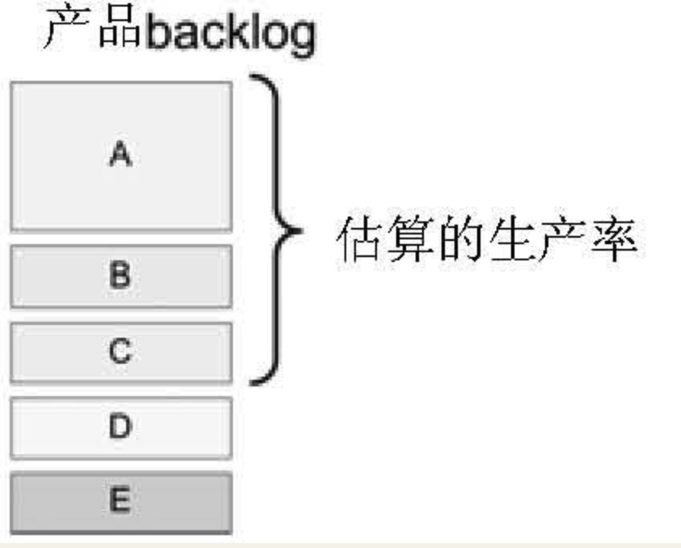

产品负责人很失望，因为故事D不会被放到sprint里面。

首先，他可以重新设置优先级。如果他给故事D赋予最高的重要级别，团队就不得不把它先放到sprint里面来（在这里需要把C扔出去）。

其次，他可以更改范围——缩小故事A的范围，直到团队相信故事D能在这个sprint里完成为止。

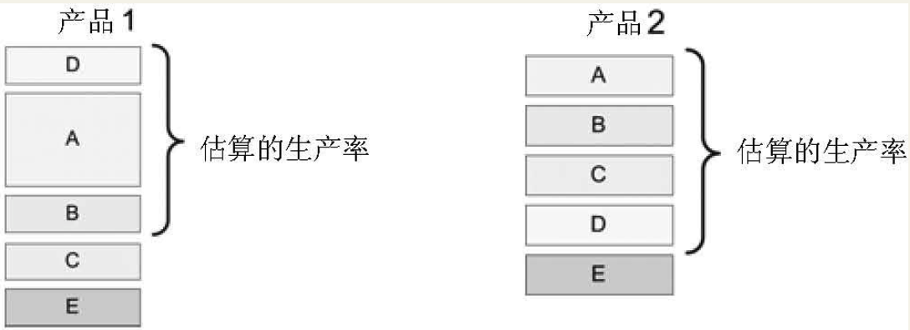

最后，他还可以拆分故事。产品负责人判断出故事A中某些方面实际并不重要，所以他把A分成两个故事A1和A2，赋给它们不同的重要级别。

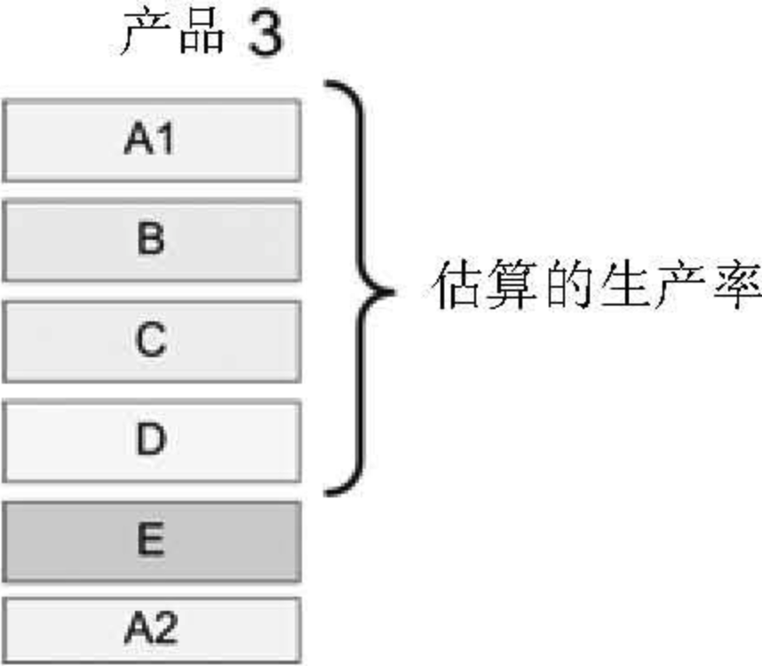

### 团队怎样决定把哪些故事放到sprint里面
我们在这里使用两个技术。

1. 本能反应。
2. 生产率计算。

下图中，左边是sprint启动时的`估算的生产率`，右边是sprint结束时的`实际生产率`。每个矩形都是一个故事，里面的数字表示这个故事的原始估算。

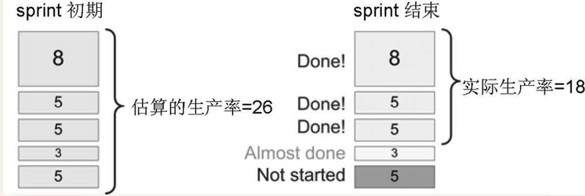

那个sprint里面**差不多(Almost)** 可以完成的故事怎么处理？为什么我们在实际生产率里面没把它的部分故事点数算进来？呵呵，这就突出表现了Scrum的要求（实际上也是敏捷软件开发和精益制造的要求）：把事情完全做完！达到可以交付的状态！事情只做了一半，它的价值就是0（也许还会是负数）。

看看团队的历史。看看他们在过去几个sprint里面的生产率是多少，然后假定在下一个sprint里面生产率差不多不变。

这项技术也叫 **“昨日天气”（yesterday’s weather）** 。要想使用该技术，必须满足两个条件：团队已经完成了几个sprint（这样就可以得到统计数据），会以几乎完全相同的方式（团队长度不变，工作状态等条件不变）来进行下一个sprint。当然也不是绝对如此。

我们估算的单位是**故事点（story point）**，差不多可以对应于“理想化的人-天”。一个理想化的人-天是完美、高效、不受打扰的一天，但这种情况太少见了。我们还必须考虑到各种因素，例如要把未计划到的工作添加到sprint中、人们患病不能工作等等。

那我们的估算生产率肯定要比50少了。少多少呢？我们引入 **“投入程度”（focus factor）** 这个词来看一下。

把上一个sprint中完成的所有故事的原始估算加起来，得到的和就是**实际生产率**。

从上面的公式中可以看出，下个sprint的估算生产率是20个故事点。这表明团队这个sprint中所能做的故事点数之和不能超过20。

#### 我们用的是哪种估算技术
上面提到了好几种技术——直觉反应、基于昨日天气的生产率计算、基于可用人-天和估算投入程度的生产率计算。那我们用的是什么？一般我们都是结合起来用。

#### 我们为何使用索引卡
要想收到好的效果，不妨创建一些索引卡，把它们放到墙上（或一张大桌子上）。

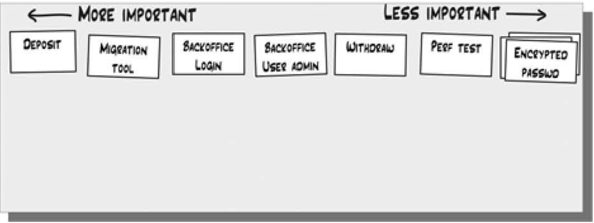

这种用户体验比计算机和投影仪好得多，理由如下。

- 大家站起来四处走动=> 他们可以更长时间地保持清醒，并留心会议进展。
- 他们有更多的个人参与感（而不是只有那个拿着键盘的家伙才有）。
- 多个故事可以同时编辑。
- 重新划分优先级变得易如反掌——挪动索引卡就行。
- 会议结束后，索引卡可以拿出会议室，贴在墙上的任务板上（参见第6章“我们怎样编写sprint backlog”）。

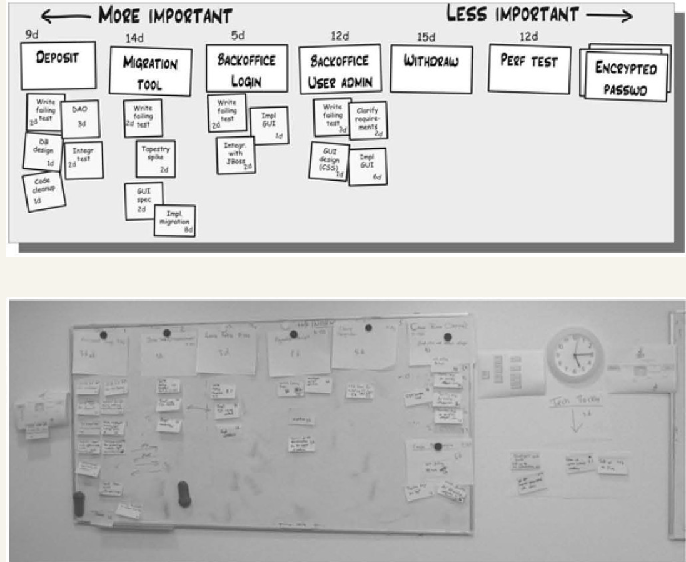

我们不会让任务拆分出现在产品backlog中，原因如下。

- 任务拆分的随机性比较强，在sprint进行中，它们常常会发生变化，不断调整，所以保持产品backlog的同步很让人头大。
- 产品负责人不需要关心这种程度的细节。

#### 使用计划扑克做时间估算
每个人都会得到如下图所示的13张纸牌。在估算故事的时候，每个人都选出一张纸牌来表示他的时间估算（以故事点的方式表示），并把它正面朝下扣在桌上。

下面这些卡片比较特殊。

- 0 = “这个故事已经完成了”或者“这个故事根本没啥东西，几分钟就能搞定”。
- ? = “我一点概念都没有。没想法。”
- 咖啡杯 = “我太累了，先歇会吧。”

#### 把故事拆分成更小的故事
故事不应该太短，也不应太长（从估算的角度出发）。如果你有一大堆0.5个故事点的故事，那你恐怕就会成为微观管理的受害者了。与之相反，40个点的故事，到最后很可能只能部分完成，这样不会为公司带来任何价值，只会增加管理成本。

#### 把故事拆分成任务
“任务”和“故事”的区别是什么呢？故事是可以交付的东西，是产品负责人所关心的。任务是不可交付的东西，产品负责人对它也不关心。

## 第5章 我们怎样让别人了解我们的sprint
“sprint信息页”

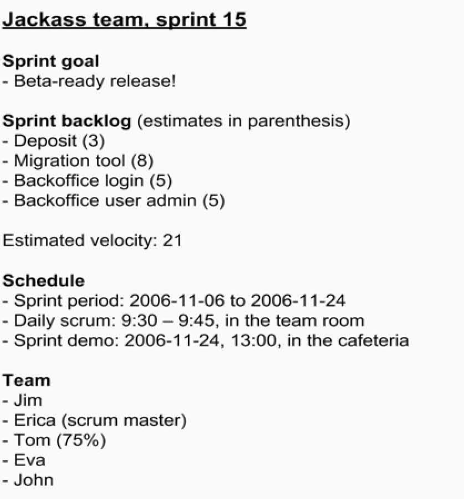

sprint 计划会议一结束，ScrumMaster就创建这个页面，把它放到wiki上，给整个公司发一封“垃圾”邮件。见下图。

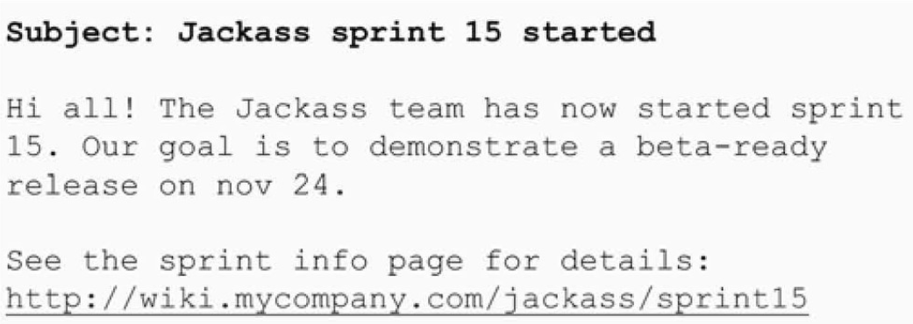

我们在wiki上还有如下图所示的“dashboard”页面，链接到所有正在进行的sprint。

sprint接近尾声时，ScrumMaster会把即将来临的演示告知每个人。

## 第6章 我们怎样编写sprint backlog
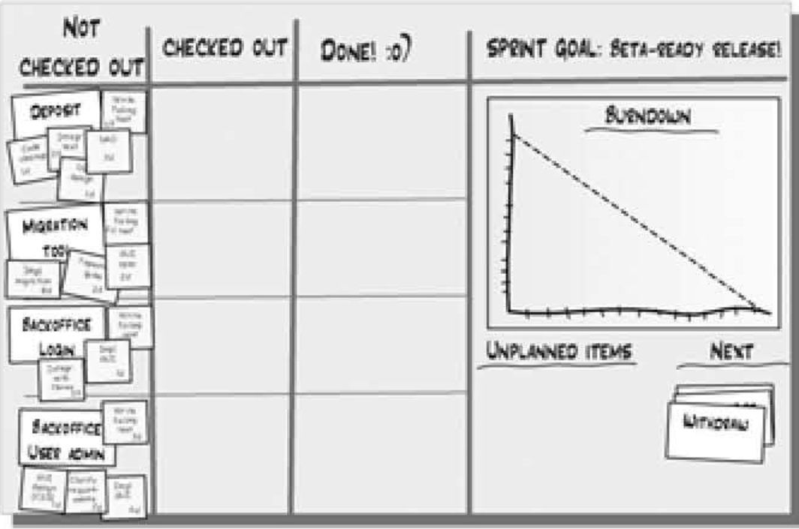

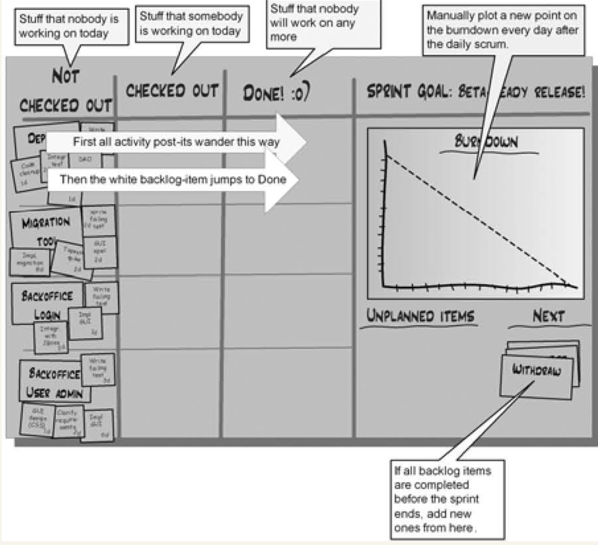

在首次每日例会以后，任务板可能会变成下图这样。

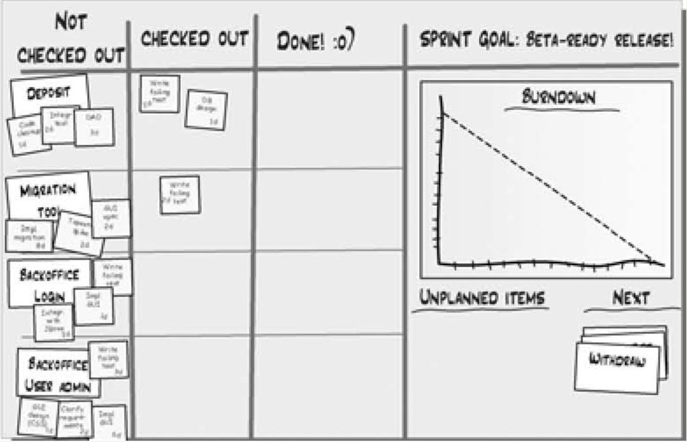

几天以后，任务板可能会如下图所示。

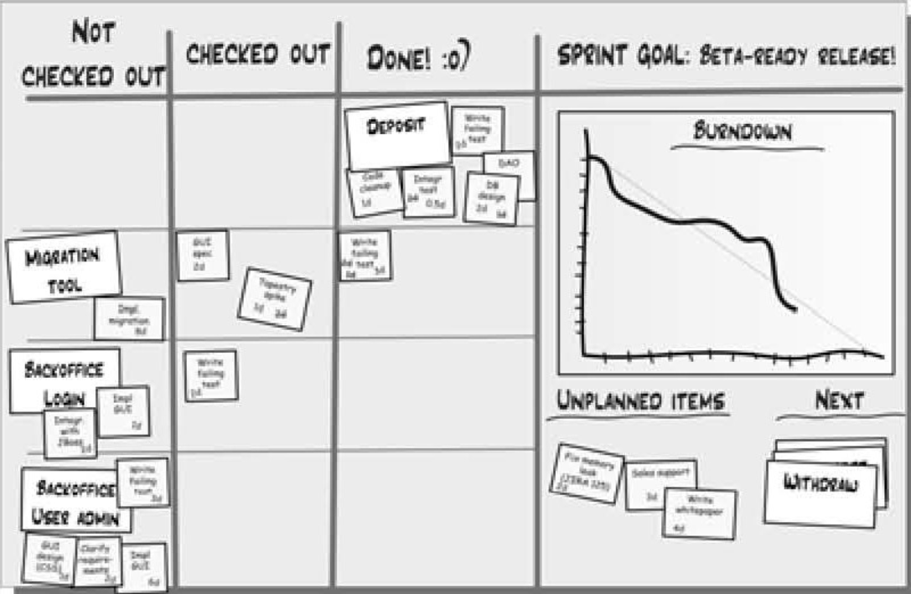

任务板警示标记：

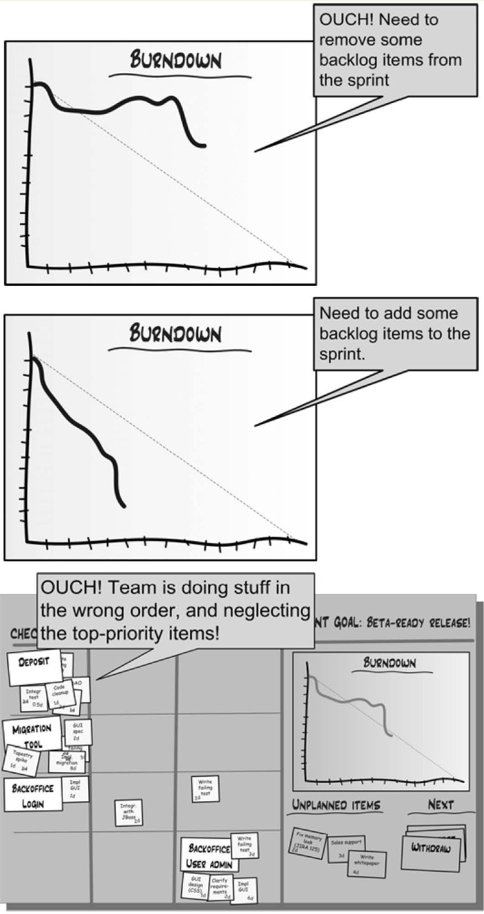

## 第7章 我们怎样布置团队房间
让团队坐在一起！

“一起”具有以下含义。
- **互相听到**  所有人都可以彼此交谈，不必大声喊，不必离开座位。
- **互相看到**  所有人都可以看到彼此，都能看到任务   板——不用非得近到可以看清楚内容，但至少可以看到个大概。
- **隔离**  如果你们整个团队突然站起来，自发形成一个激烈的设计讨论，团队外的任何人都不会被打扰到。反之亦然。

## 第9章 我们怎样进行sprint 演示
### sprint演示检查列表

- 确保清晰阐述了sprint目标。如果在演示上有些人对产品一无所知，那就花上几分钟来进行描述。
- 不要花太多时间准备演示，尤其是不要做花里胡哨的演讲。把那些玩意儿扔一边去，集中精力演示可以实际工作的代码。
- 节奏要快，也就是说要把准备的精力放在保持演示的快节奏上，而不是让它看上去好看。
- 让演示关注于业务层次，不要管技术细节。注意力放在“我们做了什么”，而不是“我们怎么做的”。
- 可能的话，让观众自己试一下产品。
- 不要演示一大堆细碎的bug修复和微不足道的特性。你可以提到一些，但是不要演示，因为它们通常会花很长时间，而且会分散大家的注意力，让他们不能关注更加重要的故事。

## 第10章 我们怎样做sprint 回顾
### 我们如何组织回顾
根据情况不同，我们常用的做法也会有些差异，但是一般都会做以下这些事情。

- 根据要讨论的内容范围，设定时间为1至3个小时。
- 参与者包括产品负责人，整个团队还有我自己。
- 我们换到一个封闭的房间中，或者舒适的沙发角，或者屋顶平台等等类似的场所。只要能够在不受干扰的情况下讨论就好。
- 我们一般不会在团队房间中进行回顾，因为这往往会分散大家的注意力。
- 指定某人当秘书。
- ScrumMaster向大家展示sprint backlog，在团队的帮助下对sprint做总结。包括重要事件和决策等。
- 我们会轮流发言。每个人都有机会在不被人打断的情况下讲出自己的想法，他认为什么是好的，哪些可以做得更好，哪些需要在下个sprint中改变。
- 我们对预估生产率和实际生产率进行比较。如果差异比较大的话，我们会分析原因。
- 快结束的时候，ScrumMaster对具体建议进行总结，得出下个sprint需要改进的地方。

## 第12章 怎样制定发布计划，处理固定价格的合同
### 定义你的验收标准
下面是验收标准规则的一个例子。

- 所有重要性>=100的条目都必须在1.0版中发布，不然我们就会被罚款到死翘翘。
- 所有重要性在50—99之间的条目应该在1.0中发布，不过也许我们可以在紧接着的一个快速发布版中完成这些。
- 重要性在25—49之间的条目也都是需要的，不过可以在1.1版中发布。
- 重要性< 25的条目都是不确定的，也许永远不会用到。

下面是一个产品backlog的例子，根据上面的规则有不同标识。

- 130—100 = 必须在1.0版中发布（banana – pear）
- 95—600 = 应该在1.0版中发布（raisin – onion）
- 40—10 = 也许可以以后再做（grapefruit – peach）

### 对最重要的条目进行时间估算

把图中的含义换成文字来表述就显得有些罗嗦。

- 让团队来做估算。
- 不要让他们花太多时间。
- 确保他们理解时间估算只是粗略估算，而不是承诺。

## 第13章 我们怎样结合使用Scrum和XP
### 结对编程
下面是到目前为止有关结对编程的一些结论。

- 结对编程可以提高代码质量。
- 结对编程可以让团队的精力更加集中。（比如坐在你后面的那个人会提醒你，“嘿，这个东西真的是这个sprint必需的吗？”）
- 令人惊奇的是，很多强烈抵制结对编程的开发人员根本就没有尝试过，而一旦尝试之后就会迅速喜欢上它。
- 结对编程令人精疲力竭，不能全天都这样做。
- 常常更换结对是有好处的。
- 结对编程可以增进团队间的知识传播，速度快到令人难以想象。
- 有些人就是不习惯结对编程。不要因为一个优秀的开发人员不习惯结对编程就把他置之不理。
- 可以把代码审查作为结对编程的替代方案。
- “领航员”（不用键盘的家伙）应该自己也有一台机器。不是用来开发，而是在需要的时候稍稍做一些探索尝试、当“司机”（使用键盘的家伙）、遇到难题的时候查看文档，等等。

### 测试驱动开发（TDD）
测试驱动开发意味着你要先写一个自动测试，然后编写恰好够用的代码，让它通过这个测试，接着对代码进行重构，主要是提高它的可读性和消除重复。整理一下，然后继续。

### 持续集成
每天晚上，持续构建服务器都会从头构建产品，并且向我们的内部文档门户上发布二进制文件（ears，wars等）、文档、测试报告、测试覆盖率报告和依赖性分析报告等等。有些产品也会被自动部署到测试环境中。

### 代码集体所有权
我们已经证实，如果团队拥有高度的代码集体所有权，这个团队就会非常健壮，比如某些关键人物生病了，当前的sprint也不会因此嗝屁着凉。

### 充满信息的工作空间
所有团队都可以有效利用白板和空的墙壁空间。很多房间的墙上都贴满了各种各样关于产品和项目的信息。

### 代码标准
不久前我们开始定义代码标准。它的用处很大，要是我们早这样做就好了。

### 可持续的开发速度/精力充沛地工作
很多有关敏捷软件开发的书都声称：加班工作在软件开发中会降低生产率。

## 第14章 我们怎样做测试
下面是在sprint中需要完成的非编程性任务的例子：

- 搭建测试环境
- 明确需求
- 与运营部门讨论部署的操作细节
- 编写部署文档（版本说明，RFC，或任何在你们组织中要写的东西）
- 和外界的资源进行联系（例如GUI设计师）
- 改进构建脚本
- 将故事进一步拆分成任务
- 标识出来自开发人员的核心问题并协助解决这些问题

实际上，应该安排每周只完成3个特性，多余的时间用来攻克测试的瓶颈。

- 让一些开发人员去做测试人员的工作（呃，他们会因此而爱你的……）。
- 实现一些工具或脚本，用来简化测试工作。
- 增加更多的自动化测试代码。
- 延长sprint长度，把验收测试放到sprint里面来。
- 把一些sprint定义为“测试sprint”，其中整个团队都作为验收测试团队进行工作。
- 雇佣更多测试人员（即使这会意味着减少开发人员）。

这些解决方案我们全都试过（除了最后一点）。最好的长期解决方案当然是第2点和第3点，即更好的工具与脚本，还有测试自动化。

## 第15章 我们怎样管理多个Scrum团队
我的经验是，宁可团队数量少，人数多，也比弄上一大堆总在互相干扰的小团队强。要想拆分小团队，必须确保他们彼此之间不会产生互相干扰！

### 最佳的团队规模
在我读过的大多数书中，5到9个人被公认为是“最佳的”团队构成人数。

### 是否使用特定的团队
假设你们的技术选型包括下面三种主要组件。

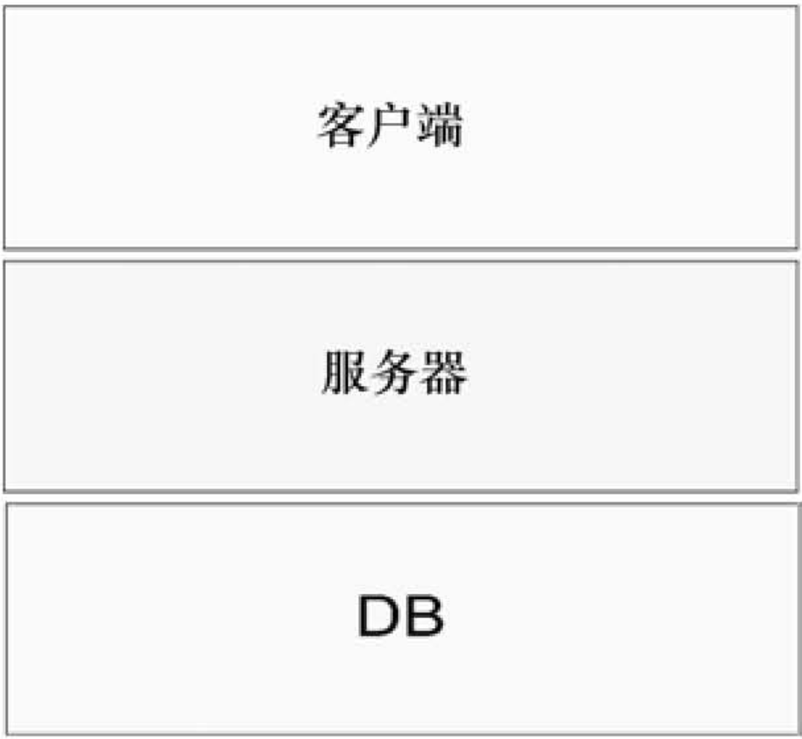

#### 方式1：特定于组件的团队
方式之一是创建针对特定组件展开工作的团队，例如“客户端团队”、“服务器团队”和“DB团队”。

我们以这种方式开始。但效果不太好，要是大多数故事都涉及到多个组件就更糟了。

比如：如果有一个名为“留言板，可供用户在上面给彼此留言”的故事。这个特性需要更新客户端的用户界面，向服务器中添加逻辑，还要增加数据库中的表。

这就意味着这三个团队——客户端团队、服务器团队和DB团队需要协作来完成这个故事。情况不妙啊!

#### 方式2：跨组件的团队
第二种方式是创建跨组件的团队，也就是说团队的职责不会被束缚在任何特定的组件上。

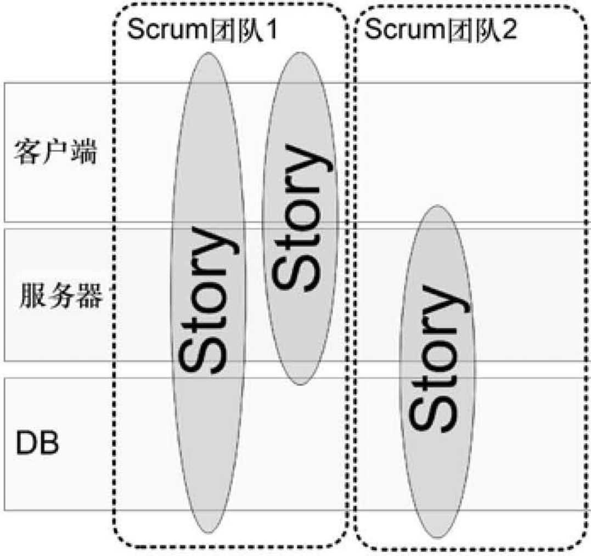

如果大多数故事都包括多个组件，那这种团队划分方式的效果就很好。每个团队都可以自己实现包括客户端、服务器和DB三部分的完整故事。

### 是否在sprint之间重新组织团队
“团队凝聚力”是Scrum的核心要素之一，如果一个团队合作工作达多个sprint之久，他们就会变得非常紧密。他们会学会如何达成团队涌流（group flow）[请参见http://en.wikipedia.org/wiki/Flow_(psychology)，译者注]，生产力会提升至难以置信的地步。

### 兼职团队成员
如果有一个人需要把他的时间分配给多个团队，就像上面提到的DBA一样，那最好让他有一个主要从属的团队。找出最需要他的团队，把它当作他的“主队”。如果没有其他人把他拖走，那他就得参加这个团队的每日scrum会议、sprint计划会议、回顾等等。

### 交错的每日例会
如果有太多的Scrum团队参与单个产品的开发，而且他们都在同一时刻进行每日例会，那你就遇到问题了。产品负责人（以及像我一样爱管闲事的家伙）因此每天只能参加一个团队的每日例会。

所以我们要求团队避免在同一时刻进行每日例会。

## 第17章 ScrumMaster检查列表
### sprint开始阶段
- sprint计划会议之后，创建sprint信息页面。
- 在wiki上创建从dashboard指向所创建页面的 链接。
- 把页面打印出来，贴在通过你们团队工作区域之外的墙上，让经过的人都可以看到。
- 给每个人发邮件，声明新的sprint已经启动。邮件中要包括sprint目标和指向sprint信息页面的链接。
- 更新sprint数据文档。加入估算生产率、团队大小和sprint长度等。

### 每一天
- 确保每日Scrum会议可以按时开始和结束。
- 为了保证sprint可以如期完成，需要适当地增删故事。
- 确保产品负责人了解这些变化。
- 确保团队可以及时得知sprint backlog和燃尽图的最新状况。
- 确保存在的问题和障碍都能被解决，并报告给产品负责人以及（或者）开发主管。

### 在sprint结束时
- 进行开放式的sprint演示。
- 在演示开始前一两天，就要通知到每个人。
- 与整个团队以及产品负责人一起开sprint回顾会议。开发主管也应该受邀参加，他可以把你们的经验教训大范围传播开来。
- 更新sprint数据文档。加入实际生产率和回顾会议中总结出的关键点。
