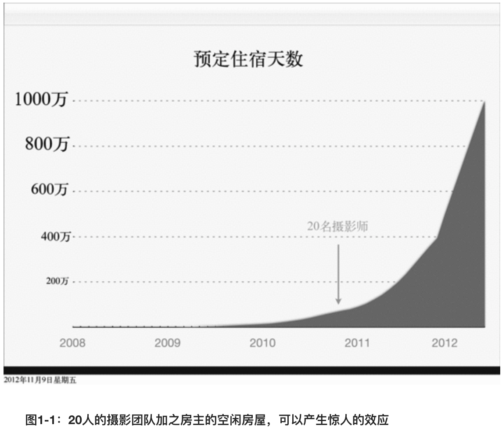
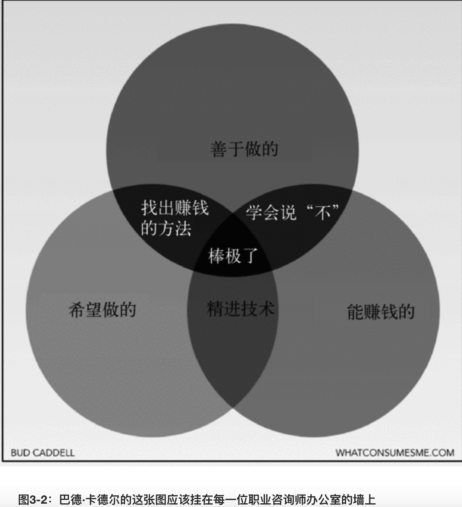
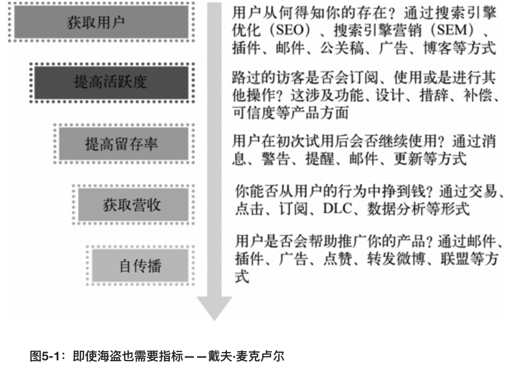
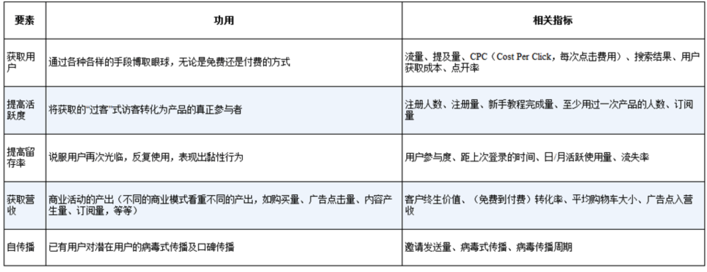
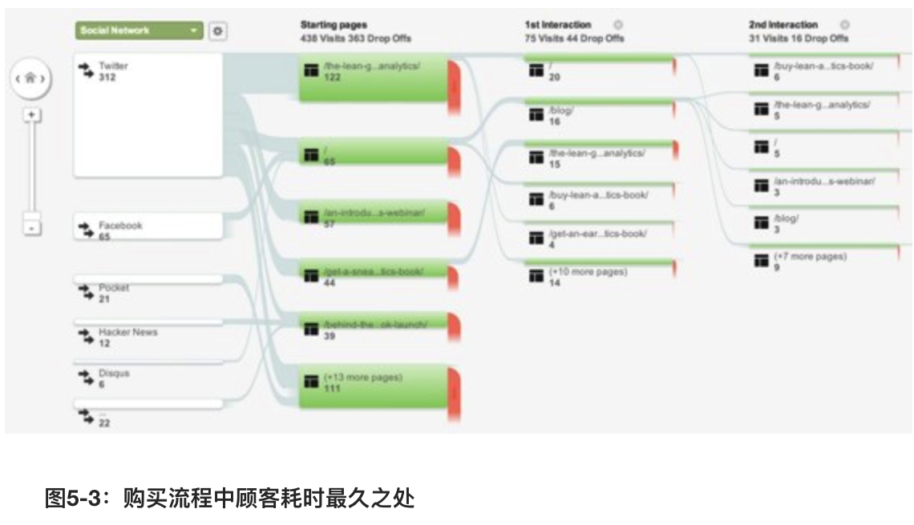
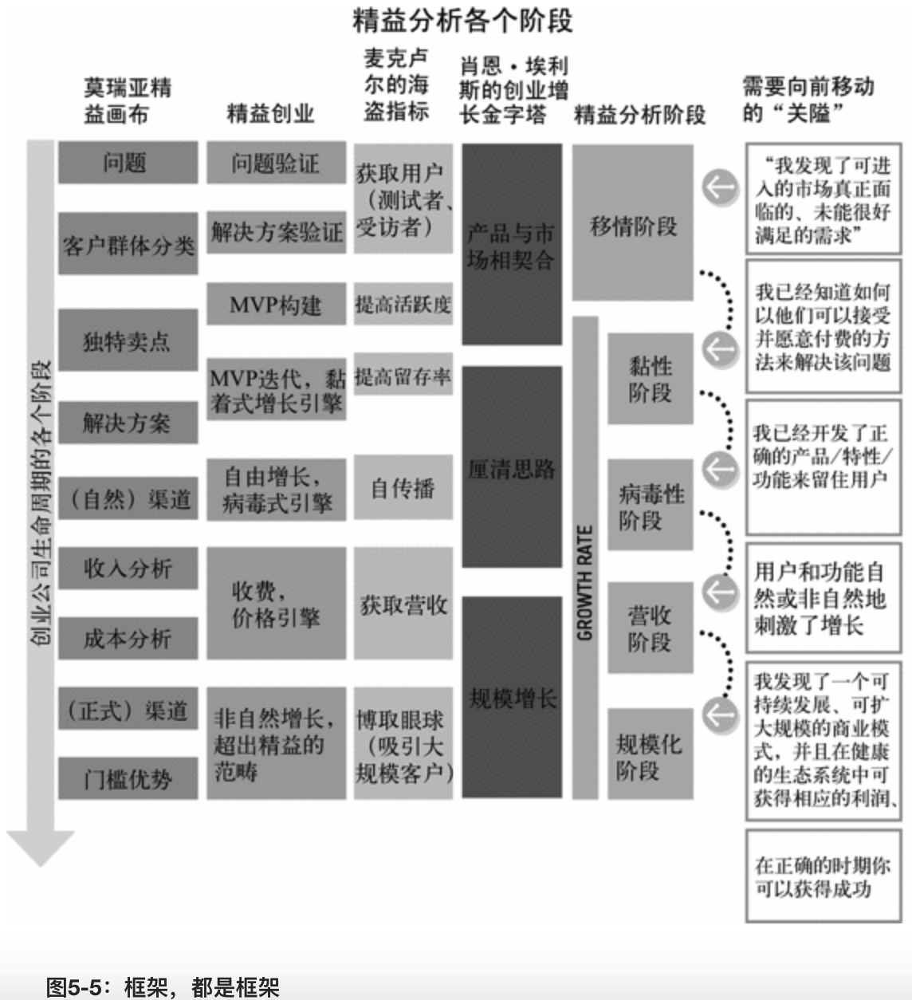
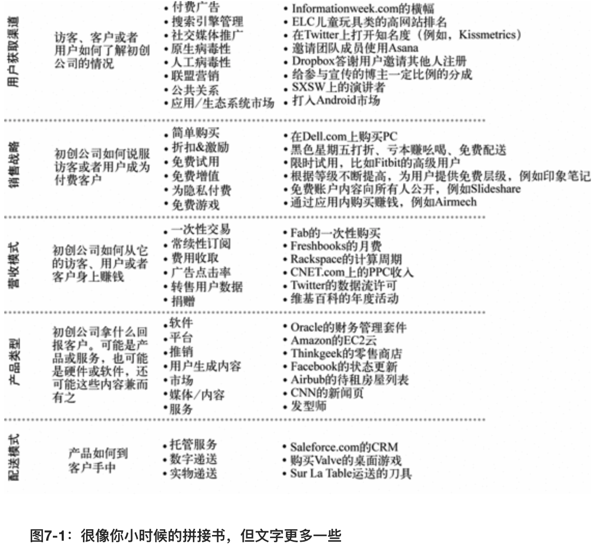
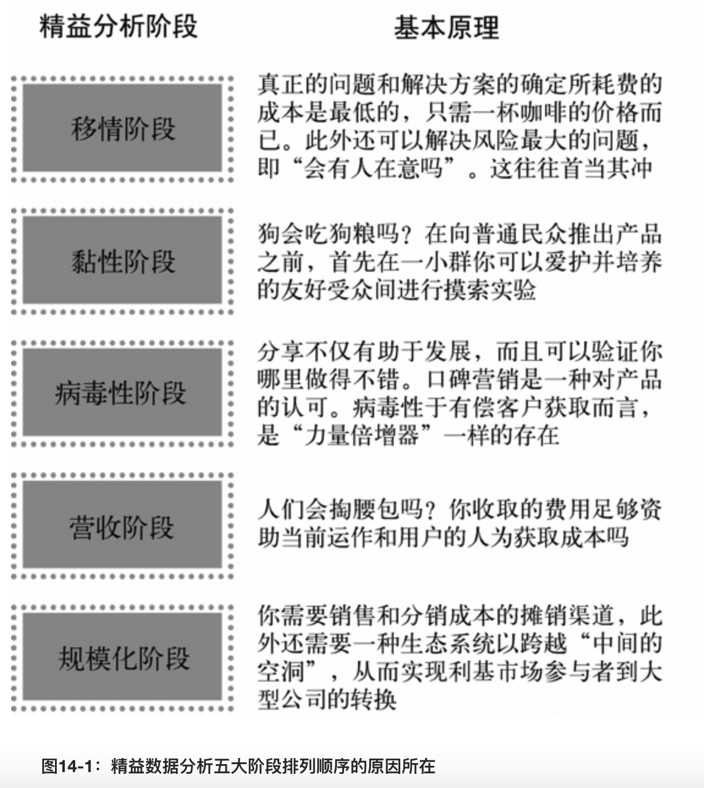
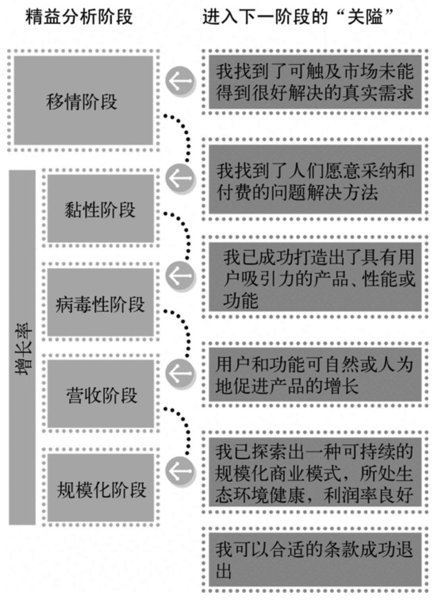
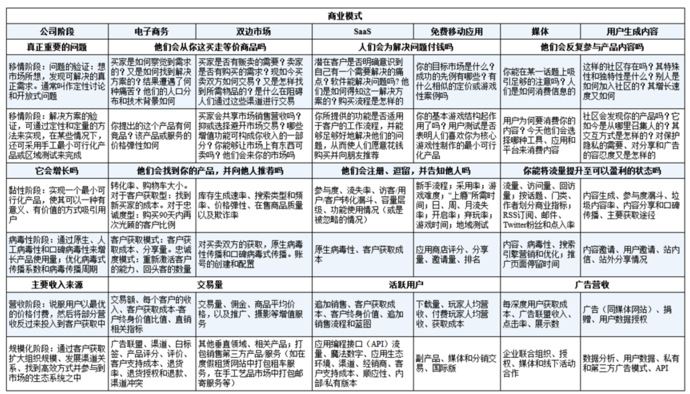

    作者: [加] 阿利斯泰尔·克罗尔 / [加] 本杰明·尤科维奇 
    出版社: 人民邮电出版社
    原作名: Lean Analytics:Use Data to Build a Better Startup Faster
    译者: 韩知白 / 王鹤达 
    出版年: 2014-12
    页数: 356
    定价: 79.00元
    装帧: 平装
    丛书: 精益系列
    ISBN: 9787115374769

[豆瓣链接](https://book.douban.com/subject/26278639/)

- [第一部分 别再欺骗自己了](#第一部分-别再欺骗自己了)
  - [第1章 我们都在说谎](#第1章-我们都在说谎)
    - [Airbnb的上门摄影服务：增长中的增长（案例分析）](#airbnb的上门摄影服务增长中的增长案例分析)
  - [第2章 创业的记分牌](#第2章-创业的记分牌)
    - [什么是好的数据指标](#什么是好的数据指标)
    - [“妈妈圈”的成功之路（案例分析）](#妈妈圈的成功之路案例分析)
    - [HighScore House对“活跃用户”的定义（案例分析）](#highscore-house对活跃用户的定义案例分析)
  - [第3章 你把生命献给谁](#第3章-你把生命献给谁)
  - [第4章 以数据为导向与通过数据获取信息](#第4章-以数据为导向与通过数据获取信息)
- [第二部分 找到当前的正确指标](#第二部分-找到当前的正确指标)
  - [第5章 数据分析框架](#第5章-数据分析框架)
    - [戴夫·麦克卢尔的海盗指标说](#戴夫麦克卢尔的海盗指标说)
    - [埃里克·莱斯的增长引擎说](#埃里克莱斯的增长引擎说)
    - [肖恩·埃利斯的创业增长金字塔](#肖恩埃利斯的创业增长金字塔)
  - [第6章 第一关键指标的约束力](#第6章-第一关键指标的约束力)
  - [第7章 你所在的商业领域](#第7章-你所在的商业领域)
  - [第8章 商业模式一：电子商务](#第8章-商业模式一电子商务)
  - [第9章 商业模式二：SaaS](#第9章-商业模式二saas)
  - [第10章 商业模式三：免费移动应用](#第10章-商业模式三免费移动应用)
  - [第11章 商业模式四：媒体网站](#第11章-商业模式四媒体网站)
  - [第12章 商业模式五：用户生成内容](#第12章-商业模式五用户生成内容)
  - [第13章 商业模式六：双边市场](#第13章-商业模式六双边市场)
  - [第14章 创业阶段的划分](#第14章-创业阶段的划分)
  - [第15章 阶段1：移情](#第15章-阶段1移情)
    - [找到需要解决的问题（即如何验证问题）](#找到需要解决的问题即如何验证问题)
    - [表明所发现问题值得解决的征兆（模式）](#表明所发现问题值得解决的征兆模式)
    - [精益创业实战及如何开展一次成功的客户访谈（模式）](#精益创业实战及如何开展一次成功的客户访谈模式)
    - [如何避免引导受访者（模式）](#如何避免引导受访者模式)
  - [第16章 阶段2：黏性](#第16章-阶段2黏性)
  - [第17章 阶段3：病毒性](#第17章-阶段3病毒性)
  - [第18章 阶段4：营收](#第18章-阶段4营收)
  - [第19章 阶段5：规模化](#第19章-阶段5规模化)
  - [第20章 模式+阶段决定你跟踪的指标](#第20章-模式阶段决定你跟踪的指标)

## 第一部分 别再欺骗自己了
### 第1章 我们都在说谎
#### Airbnb的上门摄影服务：增长中的增长（案例分析）
该服务起源于一种假设，即“附有专业摄影照片的房源要更抢手，因此房主肯定会愿意申请Airbnb提供的此项服务。”这一假设出自Airbnb创始团队的直觉，他们感觉专业摄影服务将有助于业务的开展。

开发了一款**专人接待式最小可行化产品（Concierge Minimum Viable Product）**，从而迅速验证了自己的假设。

>什么是“专人接待式最小可行化产品”
>
>在精益创业理论中，最小可行化产品指足以向市场传达你所主张的价值的最小化产品。但定义中并未对产品的真实程度做出要求。例如，如果你正在考虑创建一种拼车服务，则可以试着用人工牵线搭桥这种原始方式将司机和乘客联系在一起。
>
>这是一种专人接待式方法。它可以让你认识到，有时并不值得你为了产品（即便是最小化产品）的开发而耗费时间与金钱。你需要调研的风险是“人们会接受陌生人的搭车吗”，而显然不是“我能开发出一款配对司机与乘客的应用软件吗”。专人接待式最小可行化产品并不会大规模生产，但却可以在短时间内以最低的成本帮你尽快测试自己的想法。

Airbnb最小可行化产品最初的测试表明，附有专业摄影照片的房源所获订单数是市场平均值的2~3倍。这验证了创始团队最初的假设。结果，房主均表示非常欢迎Airbnb向他们提供专业摄影服务。

总结

- Airbnb团队有预感，更好的照片可以提高租住量。
- 他们利用专人接待式最小可行化产品测试了这一想法，在保证能够得到有效结果的前提下，尽量降低测试中的投入。
- 若试验证明效果良好，他们便马上跟进必要资源，然后向所有客户推出此项服务。

### 第2章 创业的记分牌
**对于创业公司而言，之所以进行数据分析，是为了在资金耗尽以前，找到正确的产品和市场。**

#### 什么是好的数据指标
- 好的数据指标是比较性的。
- 好的数据指标是简单易懂的。
- 好的数据指标是一个比率。

比率之所以是最佳的数据指标，有如下几个原因。
- 比率的可操作性强，是行动的向导。
- 比率是天生的比较性指标。
- 比率还适用于比较各种因素间的相生和相克（正相关和负相关）。
- 好的数据指标会改变行为。

数据指标之间的**耦合现象**也值得注意。譬如转化率（访客中真正发生购买行为的比例）通常就是和购买所需时间（客户需要花多长时间才能完成购买）相绑定的；二者相结合可以告诉你很多关于现金流的信息。类似地，病毒式传播系数（viral coefficient，平均每个用户邀请来的新用户数）和病毒传播周期（viral cycle time，用户完成一次邀请所需的时间）共同推动产品的普及率。当你开始探寻生意背后的关键数字时，就会注意到这些数据对；它们的背后隐藏着最重要的数据指标：营收、现金流，或产品普及率。

想要找出正确的数据指标，有五点需要牢记在心。

- 定性指标与量化指标
    - 定性指标通常是非结构化的、经验性的、揭示性的、难以归类的；量化指标则涉及很多数值和统计数据，提供可靠的量化结果，但缺乏直观的洞察。
    - 定量数据排斥主观因素；定性数据吸纳主观因素。
- 虚荣指标与可付诸行动的指标
    - 虚荣指标看上去很美，让你感觉良好，却不能为你的公司带来丝毫改变。相反，可付诸行动的指标可以帮你遴选出一个行动方案，从而指导你的商业行为。
    - 每当看到一个指标，就应该下意识地问自己：“依据这个指标，我将如何改变当前的商业行为？”
    - “总注册用户数”（或“总用户数”）其实就是一个虚荣指标，这个数字只会随着时间增长（经典的“单调递增函数”）。它并不能传达关于用户行为的信息：他们在做什么？是否对你有价值？他们中的很多人可能只是注册了一下，就再没有使用过。
    - “总活跃用户数”稍微好些，前提是你对“活跃用户”定义正确。但它依然是一个虚荣指标，也只会随着时间增长，除非你犯了什么严重的错误。
    - 可付诸行动的指标，是“活跃用户占总用户数的百分比”（活跃用户占比）。这个指标揭示了产品的用户参与度，因而显得格外关键。当产品作出调整时，这个指标也会相应地变化。如果调整的思路是正确的，这个占比就应该上升。这就意味着，它可以指导你试验、学习和迭代。
    - 另一个值得关注的指标是“单位时间内新用户的数量”（或“新用户增速”），它对比较不同营销手段的优劣往往很有帮助。举一个网上营销的例子：第一周将广告投放在Facebook上，第二周改投在社交新闻网站reddit上，第三周试试谷歌关键字（Google AdWords），第四周轮到了职业社交网站LinkedIn。在不同时间段进行对照试验得到的结果并不一定精确，但相对而言比较简单。更重要的是，它能指导你的行动：如果Facebook确实比LinkedIn更具广告效应，那么接下来该怎么做就不言自明了。
    - 8个需要提防的虚荣数据指标（模式）
        - **点击量。** 这是互联网洪荒年代所使用的指标，随便什么网站，只要上面可点的东西多，这个数字都会很高。相比之下，你更应统计点击的人数。
        - **页面浏览量（PV值）。** 这个指标只比点击量稍好一点点，因其统计的是网页被访客请求的次数。除非你的商业模式直接与PV值挂钩（即展示广告），你还是更应统计（访问的）人数。
        - **访问量。** 你的100访问量究竟来自于1个访问了100次的用户，还是100个访问了1次的用户？它无法指导行动。
        - **独立访客数。** 只能显示有多少人访问了网页，却不能告诉你这些人在页面上做了什么？他们为什么停留？是否离开了？
        - **粉丝/好友/赞的数量。** 计算粉丝/好友的数量只是一场毫无意义的人气比赛，除非你能让他们做对你有利的事。你在社交平台上振臂一呼时，有多少粉丝会响应？只有知道了这个数字，他们才对你有意义。
        - **网站停留时间（time on site）/浏览页数（number of pages）。** 用这两个指标来替代客户参与度或活跃度并非明智之举，除非你的商业模式与这两个指标相绑定。而且，它们并非一定能说明问题。比如，客户在客服或投诉页面上停留了很长时间，不见得是什么好事。
        - **收集到的用户邮件地址数量。** 有很多人对你的创业项目感兴趣，这很好。但是，如果不知道他们中有多少人会真正打开你的邮件（并为你邮件中的内容买单），纵使有再多人在你的邮件列表上也是枉然。更好的做法是：向一部分注册用户发送测试邮件，看他们是否会按照邮件中的提示去做。
        - **下载量。** 尽管有时会影响你在应用商店中的排名，但下载量本身并不带来价值；你需要衡量的是：应用下载后的激活量、账号创建量，等等。
- 探索性指标与报告性指标
    - 探索性指标是推测性的，提供原本不为所知的洞见，帮助你在商业竞争中取得先手优势。报告性指标则让你时刻对公司的日常运营、管理性活动保持信息通畅、步调一致。
- 先见性指标与后见性指标
    - 先见性指标用于预言未来；后见性指标则用于解释过去。
- 相关性指标与因果性指标
    - 如果两个指标总是一同变化，则说明它们是相关的；如果其中一个指标可以导致另一个指标的变化，则它们之间具有因果关系。如果你发现你能控制的事（比如播放什么样的广告）和你希望发生的事（比如营收）之间存在因果关系，那么恭喜你，你已拥有了改变未来的能力。

分析师特别关心那些能推动公司业绩增长的指标，即**关键绩效指标（KPI）**。

#### “妈妈圈”的成功之路（案例分析）
“朋友圈”的构想很简单：它允许你将Facebook好友分类到不同的圈子，以便进行指定圈子的分享。2007年9月，在Facebook发布开发者平台后不久，麦克·格林菲尔德等人共同创办了这家公司。这个时机近乎完美：Facebook正在成为一个极速获取用户的病毒式开放平台，同时也成就了很多创业公司。

到2008年中期，“朋友圈”已经拥有1000万用户。麦克视用户增长为首要使命，他说“这就像是在抢地盘”，“朋友圈”显然已在病毒式传播。然而，一个问题出现了：只有很少的用户在真正地使用这个产品。

麦克发现，只有不到20%的圈子在创建后有过活动的迹象。“1000万的注册用户每月能为我们带来几百万的独立访客数，可我们深知这个成绩对于一个通用社交网络来说还不够好。一旦收费，变现效果可能不佳。”

麦克开始探寻背后的原因。

他首先查看了用户数据库，想搞清楚用户们都做了些什么。当时，公司还没有一套可以做深度数据分析的系统，但这并不妨碍麦克进行一些探索性的分析。**最后他发现，有一个用户群体在其他群体活跃度较低的情况下，撑起了整个产品的用户参与度——这就是妈妈群体。** 以下是他的发现：

- 妈妈群体之间所发的站内信平均比其他站内信长50%；
- 她们在帖子中附图片的概率比其他人群高115%；
- 她们在Facebook上进入多回合深入对话的概率比其他人群高110%；
- 她们的好友在被邀请入应用后，成为高参与度用户的概率比其他用户高50%；
- 她们点击Facebook提醒的概率比其他人群高75%；
- 她们点击Facebook新鲜事内容的概率比其他人群高180%；

她们接受应用邀请的概率比其他人群高60%。这些数字实在是太有说服力了。于是，在2008年6月，麦克和他的团队完全调整了产品重心，作出了关键转型。2008年10月，**他们在Facebook上发布了“妈妈圈”社交产品。**

总结
- “朋友圈”这个社交图谱应用出现在了正确的时间（Facebook刚启动开放平台时）和正确的地点（Facebook站内应用），只是找错了市场。
- 通过分析用户的行为模式和理想行为的分布，发掘高活跃度用户的共同点，公司找到了与自身产品相匹配的市场。
- 在找准目标以后，不遗余力地聚焦，直至更改产品名称。要么坚定地转型，要么缴械投降，准备好放弃部分已有的成就，这就是“妈妈圈”成功的秘诀。

#### HighScore House对“活跃用户”的定义（案例分析）
HighScore House始于一个简单的应用程序：家长能通过它罗列出希望孩子们完成的家务活及挑战，为其打分；而孩子们则能完成任务，获取分值，并将这些虚拟的分值兑换成他们想要的奖励。

当HighScore House发布他们的最小可行化产品时，有几百个志愿家庭愿意参与内部测试。当时，几位创始人摸着石头过河，为最小可行化产品的成功下了这样的定义：家长和孩子每周每人使用产品至少四次。达到这一阈值的家庭称为“活跃用户”。这个成功的标准定得很高，但清晰扼要。

然而，一个多月过去了，活跃家庭的百分比他们预期目标的要低。

这时，创始人之一、时任CEO的凯尔·希曼做出了一个关键的决定：他拿起了电话。凯尔与几十位家长通了话，从那些已注册却并不活跃的家长们开始。首先，他打给那些完全抛弃了High Score House的家长（所谓的流失用户），了解到很多人离开的原因是HighScore House解决的并不是他们的紧要问题。这没什么大不了的，创始团队从未假设过这款产品适用于所有家长——对于一个创业产品而言，“所有家长”这个市场显然定义得过大了。凯尔将精力放在寻找家长中的一个子市场，一个能认同HighScore House价值的家长人群，方便他聚焦于更加细分的领域。

接下来，凯尔给那些正在使用HighScore House，但不够活跃的家庭去了电话。他们中的很多家长都对产品给予了正面评价：“我们在使用HighScore House。它是一个很棒的产品。因为有了它，我的孩子终于能够坚持每天叠被子了！”

从这些家长处得到的回应令创始团队十分惊喜。尽管他们中的大多数每周仅使用HighScore House一到两次，但这已经足以使他们认可产品的价值了。从这些电话访谈中，凯尔学到了细分市场，了解了产品对哪类家庭更具吸引力。他开始认识到，他们一开始设定的划分活跃/ 非活跃用户的准绳实际上并不能很好地反映实际用户的参与度。

这并不是说HighScore House团队不该在一开始提出这样一条准绳。如果没有那个设想，他们也就不会为了修正准绳而学到这些东西，凯尔也不可能拿起电话。然而现在，他真正地理解了他的用户，定量数据与定性数据相结合是他成功的关键。

总结

- HighScore House团队过早、过于激进地划了一条用于区分用户活跃度的准绳——一个不可能完成的任务；
- HighScore House团队通过快速试验提高了活跃用户的数量，但是活跃用户的百分比总体没有很大提高；
- 他们开始明智地拿起电话联系客户，发现那些低于假设“活跃度”阈值的用户能够从产品中获取很大价值。

数据分析启示

- 首先，了解你的客户。没有比直接与客户和用户对话更有效的手段了。
- 其次，尽早做出一些假设并定下你认为可称为“成功”的目标，但切忌在试验中迷失自己。如果需要，可以降低指标的阈值，但并不是为了制造达到这个阈值的假象：这样只会自欺欺人。

### 第3章 你把生命献给谁
**精益画布**是呈现在一张纸上的可视化简明商业计划书，体现你正在进行的、可付诸行动的商业计划。

巴德·卡德尔用一张极其简单的图概括了人们该如何选择职业，如图3-2所示。

### 第4章 以数据为导向与通过数据获取信息
数学在优化已知系统方面可以做得很好，而人类更善于发现新的系统。换言之，渐进式的改变可以达到局部极限，创新则可能导致全局洗牌。

## 第二部分 找到当前的正确指标
### 第5章 数据分析框架
#### 戴夫·麦克卢尔的海盗指标说
**“海盗指标”** 这一术语由风险投资人戴夫·麦克卢尔创造，得名于五个成功创业关键元素的首字母缩写。麦克卢尔将创业公司最需要关注的指标分为五大类：获取用户（Acquisition）、提高活跃度（Activation）、提高留存率（Retention）、获取营收（Revenue）和自传播（Referral），简称**AARRR**。

#### 埃里克·莱斯的增长引擎说
- 黏着式增长引擎
    - 重点是让用户成为回头客，并且持续使用你的产品，它和戴夫·麦克卢尔的提高留存率阶段这个概念类似。
    - 衡量黏性最重要的KPI就是客户留存率。除此之外，流失率和使用频率也是非常重要的指标。
    - 衡量黏性也不能全看留存率，它还和频率有关，这解释了为什么你需要跟踪“距上次登录的时间”这样的指标。
- 病毒式增长引擎
    - 所谓病毒式传播归根结底就是一件事情：让声名传播出去。
    - 此引擎的关键指标是病毒式传播系数，即每个用户所带来的新用户数。
    - 仅考虑病毒式传播系数还不够，你还需要衡量哪些用户行为形成了一个病毒传播周期（循环）。
    - 还有其他一些因素也与病毒性相关，包括用户完成一次邀请所需的时间（或叫病毒传播周期）以及病毒性的类别。
- 付费式增长引擎
    - 机器上的两个调节旋钮是客户终生价值（CLV）和客户获取成本（CAC）。
    - 一种衡量方法是看客户盈亏平衡时间，也就是你收回获取一位客户的成本所需的时间。
#### 肖恩·埃利斯的创业增长金字塔

长漏斗：图5-3显示了由Google Analytics提供的社交访客流程分析。

### 第6章 第一关键指标的约束力
**OMTM**（One Metric That Matters，**第一关键指标**）。第一关键指标，就是一个在当前阶段高于一切、需要你集中全部注意力的数字。

切忌因能跟踪的数据太多而被带跑了注意力。你**可以捕捉所有的数据，但只关注其中重要的那些。**

使用第一关键指标的四大理由
1. 它回答了现阶段最重要的问题。
1. 它促使你得出初始（区别创业成败的）基线并建立清晰的目标。
1. 它关注的是整个公司层面的健康。
1. 它鼓励一种实验文化。

### 第7章 你所在的商业领域
创业的增长少不了齐曼名句中的这五个“杠杆”。

- **更多的商品**意味着推出新产品和新服务，最理想的当然是那些你知道客户想要的，不然开发出来没人用，没人买，白白浪费了时间。而对于企业内部创业而言，这个杠杆更多意味着使用精益方法进行新产品研发，而非重新创办一家企业。
- **更多的人**意味着获取更多的用户，最理想的还是通过病毒性和口碑传播，利用一些付费广告当然也无可厚非。然而最聪明的用户获取方式，是把添加新用户做成产品的一部分，例如Dropbox、Skype或是一个可以邀请外部用户的项目管理工具，这使用户在使用的过程中自动为你添加新用户，同时在邀请中融入一种个人化的推荐口吻。
- **更频繁**意味着高用户黏性（这样他们才能成为回头客），低流失率（这样他们才不会离开），以及反复使用（这样他们才能用得更频繁）。
- **更多的钱**意味着追加销售，将用户愿意支付的价格最大化，最大化他们点击广告为你带来的营收、最大化他们生成内容的数量，或是最大化他们在游戏内购买虚拟物品的开支。
- **更有效率**意味着降低完成以及支持服务的成本，同时还意味着通过尽量少打付费广告，多利用口碑营销来降低获取客户的成本。

商业模式拼接书
- **获取渠道**：人们是如何得知你的。
- **销售手段**：如何说服访问者在你的身上花钱，继而成为你的客户。最常见的情况是要么直接要钱，要么提供某种稀缺或独家资源来说服他们付费，比如限时限量，无广告，附加功能，或是隐私的需要。
- **营收来源**：你如何收钱。钱既可以直接来自于你的客户（通过支付），也可以间接来自于你的客户（通过广告，导流量，客户行为分析，等等）。收钱的方式可以是交易、订阅、按用量计费、广告收入、转售数据、捐款等多种形式。
- **产品类型**：你在收钱之外提供了什么价值？
- **送达模式**：你如何将你的产品送至客户手中。

### 第8章 商业模式一：电子商务
- 转化率
    - 访客中发生购买行为的比例。
- 年均购买率
    - 每位买家的年均购买次数。
    - 转化率虽然重要，却并非电商的全部。电商不以转化率论成败，有数不尽的电商不论转化率的高低，最终均获得了成功。转化率的大小取决于电商类型以及用户的购买习惯。棺材每个人一生可能只会买一副，但蔬菜水果却要一周买好几次。
    - 90天内重复购买率是判断电商所属类型的绝好指示剂。实际上所谓的电商类型也并非绝对，但至少可以帮助你知道到底是该着重培养忠诚度还是努力获取新用户。
- 平均购物车大小
    - 买家下单时平均每单的钱数。
    - 转化率方程的另一半是购物车大小。作为网店店主，你不仅想知道有多少人买了你的东西，还想知道他们都花了多少钱。你可能会发现，有的推广活动可成功勾起人们的购物欲，但有的则效果不佳。
- 弃买率
    - 买家开始购买流程后放弃购买的比例。
    - ClickTable等工具可自动分析表单内各步骤的弃买率，从而有助于找到转化过程的瓶颈，即客户流失的具体步骤。
- 客户获取成本
    - 获取一位客户所需的平均成本。
- 平均每位客户营收
    - 平均每位客户终其一生在该网店消费的总金额。
    - 平均每位客户营收（或客户终身价值）对于所有电商模式而言都十分重要，不管侧重点是新客户的获取还是忠诚度的培养（或是双管齐下）。
- 导入流量最多的关键字
    - 大家都在搜的且与你有关的词汇，同时也有助于了解相邻产品或市场。
- 热门搜索词
    - 既包括能带来营收的词汇，也包括没能带来任何结果的词汇。
- 推荐引擎有效性
    - 买家将推荐商品加入购物车的可能性。
- 病毒性
    - 口碑，以及平均每个访问量带来的分享次数。
- 邮件列表有效性
    - 邮件中链接的点击率，以及招揽回头客的能力。

你想要的归根结底还是**平均每位客户的高营收**，或是**高客户终身价值（Customer Lifetime Value，CLV）**，因为这才是真正维持商业模式的关键。

要点
- 明确自己应关注的是忠诚度还是客户的获取十分重要，这决定了整套市场营销策略和网店的许多功能。
- 站内外搜索日渐成为寻找购买商品的常用方式。
- 尽管转化率、重复购买率以及购物车的大小十分重要，但真正起作用的指标是它们三者的积，即平均每位客户营收。
- 不要忽视现实世界中的问题，如送货、库房、物流和库存等。

### 第9章 商业模式二：SaaS
- 眼球
    - 网站吸引访客的效果如何。
- 参与度
    - 有多少访客注册成为了免费版或试用版的用户（如果你有免费版或试用版的话）。
- 黏性
    - 有多少客户真正在使用你的产品。
- 转化率
    - 有多少免费用户最终成为了付费客户，这其中又有多少人升级到了更贵的服务级别。
- 平均每位客户营收
    - 单位时间内平均每位客户带来的营收。
- 客户获取成本
    - 获取一位付费客户的所需成本。
- 病毒性
    - 客户邀请他人或向他人推荐公司产品的可能性以及所需时间。
- 追加销售
    - 是什么促使客户支付更多费用，以及这种情况的发生频率。
- 系统正常运行时间和可靠性
    - 公司会面临多少用户投诉、问题升级或服务争端问题。
- 流失率
    - 单位时间内流失的用户和付费客户人数。
- 终身价值
    - 客户使用产品期间的付费总额。

### 第10章 商业模式三：免费移动应用
- 下载量
    - 应用的已下载数量，以及应用商店排名和评分等相关指标。
- 客户获取成本（CAC）
    - 获取一位用户和付费客户的所需成本。
- 应用运行率
    - 有多少下载用户真正开启了该项应用，并注册了账号。
- 活跃用户/玩家比例
    - 每天/月保持活跃在线的用户比例，即日活跃用户数（Daily Active Users，DAU）和月活跃用户数（Monthly Active Users，MAU）。
- 付费用户率
    - 有多少用户曾支付过费用。
- 首次付费时间
    - 用户激活后需要多久才会开始付费
- 用户平均每月营收（monthly Average Revenue Per User，ARPU）
    - 该指标是购买和广告的收入总和，通常还包括特定于某个应用程序的信息，例如哪一屏或哪个物品最能吸引用户购买。此外还需跟踪ARPPU，即平均每位付费用户营收（Average Revenue Per Paying User）。
- 点评率
    - 在应用商店为应用评分或评论的用户比例。
- 病毒性
    - 平均每位用户可以邀请多少新用户。
- 流失率
    - 卸载应用或一定时间段内没有开启过应用的用户比例。
- 客户终身价值
    - 用户在使用应用期间为公司贡献的营收。

### 第11章 商业模式四：媒体网站
- 访客与流失率
    - 访客人数及忠诚度。
- 广告库存
    - 可供变现的广告展示次数。
- 广告价格
    - 有时以印象成本计算，即以网页内容和来访人群为基础，计算网站通过广告展示次数而获得的收入。
- 点击率
    - 真正点击广告的访客比例。
- 内容与广告间的平衡
    - 实现广告库存与媒体内容的平衡，以最大化网站的总体性能。

### 第12章 商业模式五：用户生成内容
- 活跃访客数
    - 访客回访频率，以及每次来访的停留时间。
- 内容生成
    - 以某种方式与内容进行互动的访客比例，包括生成内容以及顶/踩行为等。
- 参与度漏斗的变化
    - 网站是否有效地增加了用户参与度。
- 生成内容的价值
    - 内容的商业价值，如捐款或广告收入等。
- 内容分享和病毒性
    - 内容是如何被分享的，分享又是如何有利于网站发展的。
- 消息提醒的有效性
    - 看到推送通知、邮件通知或其他提醒时，给予回应的用户比例。

### 第13章 商业模式六：双边市场
- 买卖双方的人数增长
    - 买卖双方人数的增长速率（通过回访人数测定）。
- 库存增长
    - 卖家新增库存（如新上架商品等）的速率，以及商品页面的完整性。
- 搜索有效性
    - 买家的搜索内容，以及该内容是否与所建库存相匹配。
- 转化漏斗
    - 商品售出的转化率，以及各种可用于显示有助于商品出售的细分因素，如第1章Airbnb案例中的专业房产摄影。
- 评分以及欺诈迹象
    - 买卖双方的相互评分、欺诈迹象以及评论语气。
- 定价指标
    - 如在市场中实行竞价机制（就像eBay那样），则需关注卖家的定价是否过高或过低。

长远看来，你往往可以买到供给，却买不到需求。**在注意力经济中，参与度高且专心的用户基础可谓是无价之宝。** 这就是为什么沃尔玛可以迫使供应商给出优惠条件，也是为什么亚马逊作为一个卖家还可以建立起一个商家的网络市场。当谈及可持续的竞争优势时，**需求要强过供给。**

### 第14章 创业阶段的划分
1. **移情。** 你需要深入目标市场，着手解决人们关心的问题，从而促使消费者愿意为你的商品买单。这就意味着你必须走出办公楼，采访他人并发放调查问卷。
1. **黏性。** 黏性来自好的产品。你需要了解自己能否找到已发现问题的解决方案。如果产品糟糕到访客一看到就会厌恶地离开的程度，那么再大力的推广也是毫无意义的。
1. **病毒性。** 在保证产品或服务的黏性后，即可开始口碑营销。你要以对产品或服务感兴趣的新访客为对象，测试网站的用户获取能力和新手流程，因为你已经从现有用户处获得了品质保证。同时，病毒性也可加大付费推广的效力。因此，为实现客户的获取，应在利用广告等非自然方法付费营销以前，确保产品或服务的病毒性。
1. **营收。** 该阶段应着手盈利事宜，但并不意味着此前不存在收费行为。对于许多公司而言，即使是第一名客户也是要付费的。只能说相较于营收，此前你要更为关注客户的增长。之前你负责推出免费试用版、免费饮料或样书，而现今则将重点放在了营收的最大化和优化上。
1. **规模性。** 盈利后，公司即可从自身发展模式切换至市场扩张模式。你需要从新的垂直领域和地理位置获取更多的客户。同时，还可投资不同的分销渠道，帮助增长用户基础。这是因为在这一阶段，与客户的直接交流已没有那么重要。

### 第15章 阶段1：移情
在移情阶段，你将重点放在了定性反馈的收集上，并主要通过有关问题和解决方案的用户访谈来完成这一工作。你旨在找到一个值得解决的问题，以及足以获取早期用户的解决方案。

#### 找到需要解决的问题（即如何验证问题）
- 问题足以让人感到困扰
    - 人充满了惰性。但你想要人们采取行动，并能够以一种有助于你的企业发展的方式来完成这件事。这就要求人们的处境足够窘迫，从而不得不按照你的希望去做事，如注册和付费等。
- 有足够多的人感到困扰
    - 只为一个人解决问题的行为叫作咨询。你需要一个潜在市场。营销者希望受众能够达到群内同质化（即群内成员的喜好存在一定的共性）以及群际异质化（即可按照某种特定方式，利用定制信息区分和瞄准各细分市场）。
- 他们已在试图解决这一问题
    - 如果问题真实存在并已得到充分认识，则人们一定会想办法加以解决。也许由于没有其他良策，他们正在手动解决这一问题。无论当前的解决方案是什么，它起初都将是你最大的对手，因为对于人们来说，它才是最容易的解决办法。

#### 表明所发现问题值得解决的征兆（模式）
- 他们想立刻掏钱购买。
- 他们正主动尝试（或曾经尝试）解决当前问题。
- 他们很健谈，并且提出了很多相关问题，表现出了对问题的兴趣。
- 他们身体前倾、生气勃勃（积极的肢体语言）。

#### 精益创业实战及如何开展一次成功的客户访谈（模式）
- 力争面对面地访谈。你不仅想听到访谈内容，还想看到客户在访谈时的姿态如何。在面对面的访谈过程中，人的注意力往往会更加集中，因此回馈的质量也会更高。
- 选择中立场所。若选择去受访者办公室，则会让访谈感觉上更像是一次销售宣传。找一家咖啡店或其他休闲场所为佳。
- 避免录音。阿什指出，根据他的个人经验，受访者在录音时会更加拘谨，从而导致访谈质量下降。
- 确保有一个脚本。尽管脚本会因时间的推移而稍作调整，但不要为了“得到想要的答案”而故意修改脚本，或是为了己方的利益而操纵脚本。在整个访谈过程中，你必须保持诚实。
    - 简要地为访谈流程做好准备。此阶段应告知受访者接下来将要讲到的内容或提到的问题。强调访谈的目的，从而使受访者保持良好的心态。
    - 通过收集人口统计资料来检测客户群。询问受访者一些基本问题，以更多地了解其个人信息并获悉其所代表的细分市场。这些问题在很大程度上取决于受访人群。最终，你希望了解客户的业务或生活方式（以想要解决的问题为背景环境），并更多地了解其所扮演的角色。
    - 通过讲故事来设置问题情境。讲述你发现待解决问题的过程，以及你认为这些问题重要的原因，从而使受访者与你产生共鸣。如果你真的是在自挠其痒，做到这点想必要容易得多。如果你尚未搞清楚问题所在，或是对待解决问题没什么好的假设，则均会在此刻显现出来。
    - 通过让受访者对问题排序来检测问题。重申一遍你所描述的所有问题，然后让受访者按照重要程度排序。不要挖掘得过深，但务必问问是否存在你未曾提及的其他相关问题。
    - 检验解决方案。了解受访者的世界观。让客户自由发表意见并保持倾听状态。在受访者按照重要程度为所有问题排序后，询问目前各大问题的解决方案。此处不需要脚本，让受访者畅所欲言吧。这也是在访谈中进行定性评估，以判断所发现问题是否值得解决的环节所在。访谈可能会很顺利，受访者也许会求你解决问题，又或许没那么顺利，受访者可能对此没什么兴趣，也就是说你所设想的情况显然与现实脱节了。
    - 在访谈结束前提出一些要求。你不想在此详细讨论解决方案，因为这会让人感觉太像电话推销了，但应使用高级别的销售辞令以保持受访者的兴致。理想情况下，你希望在己方做好准备的前提下，受访者能够配合有关解决方案的访谈。这些早期的受访者就是你最初的客户，同时你还希望受访者可以推荐更多的人作为访谈对象。

#### 如何避免引导受访者（模式）
- 不表明自己的意图
- 保证问题的真实性
    - 要想得到真实的回答，方法之一就是使受访者感到不自在。
    - 问题问得越具体，得到的答案就越真实。
- 刨根问底
    - 客户开发访谈中有一个很棒的技巧，即连续追问三次为什么。虽然这会让你听起来像是个两岁小孩，但确实很起作用。
- 寻找其他蛛丝马迹
    - 在访谈过程中，你需要直接与受访者打交道。找位同事在旁记笔记，并要求其注意受访者的非语言信号。

### 第16章 阶段2：黏性
在步入病毒性阶段以前，你需要证明两件事。
1. 人们是否在如你所料地使用着产品？如果没有，也许你应该转型至新的用例或市场，就像PayPal从PalmPilot转型至网页支付，Autodesk放弃桌面自动化而专注于设计工具时所做的那样。
1. 人们是否从你的产品中得到了足够多的价值？他们也许会喜欢你的产品，但如果他们不愿为此付费、点击广告或邀请好友，你可能还是没有生意可做。

### 第17章 阶段3：病毒性
欲计算病毒式传播系数，需：
1. 首先计算出邀请率，即用发出的邀请数除以现有用户数；
2. 然后计算出邀请的接受率，即用新注册数或新用户数除以总邀请数；
3. 最后将二者相乘。

### 第18章 阶段4：营收
- 即便你在某重要方面有着健康的增长速率（如用户数量或参与度），如果不能将其转化为金钱并支付成本的话，依然没有太大的意义。
- 商业模式的转型可立即改变你的第一关键指标。
- 每家公司都处于一个生态系统之中，本例即指阅读者、网站媒体和广告商的生态系统。转型到一个新的市场通常要比创造一个全新的产品容易些，转型成功后，该新市场即可帮你认识到应该首先打造的产品是什么。

营收阶段总结

- 营收阶段的核心公式是用客户收益回报减去客户获取成本。这就是可推动你增长的投资回报。
- 你的重心已从证明自己拥有好的产品转移到证明你在做一份真正的生意。为此，你的指标也从使用模式转移到了各种营业比率。
- 把企业想象成一个能把少量钱转化成更多钱的机器。投入与回报的金额比例，以及可以投入的最大数额，都决定着企业的价值。
- 你试图找到应该关注的重点，如客户每单更高的消费、更多的客户、更高的效率以及更高的频率等。
- 如果事情进展得不顺利，也许把初始产品转型到新市场，要比从头再来更加简单。
- 尽管你的目标是增长，但你仍应适时留意一下收支平衡的情况，因为一旦你的收入能够弥补所有的支出，就能够无限期地存活下去。

### 第19章 阶段5：规模化
- 在规模化阶段，你对自己的产品和市场已经有了清楚的了解。你的指标在这时应侧重于所处生态系统的健康程度，以及你进入新市场的能力。
- 你开始关心薪酬、API流量、渠道关系以及竞争者。然而就在之前，这一切还都是干扰信号。
- 你要清楚自己是更注重效率还是差异化。在规模化阶段想要二者兼顾十分困难。如果你追求效率，就需节约成本；如果你追求差异化，则需扩大利润率。
- 随着公司的发展，你需要在同一时间关注不止一个指标。为不同的指标建立一个层级关系，以使策略、战术和执行与公司的长期目标相一致。我们称其为三个3。

### 第20章 模式+阶段决定你跟踪的指标
精益数据分析的核心思想是：得知自己的商业模式和创业阶段后，即可跟踪并优化当前的创业第一关键指标。

