    作者: 闫泽华 
    出版社: 中信出版社
    副标题: 把内容变成价值的效率系统
    出版年: 2018-4-30
    页数: 264
    定价: 58.00元
    装帧: 平装
    ISBN: 9787508685274

[豆瓣链接](https://book.douban.com/subject/30199061/)

- [Part01 关于内容推荐](#part01-%e5%85%b3%e4%ba%8e%e5%86%85%e5%ae%b9%e6%8e%a8%e8%8d%90)
  - [走近内容推荐](#%e8%b5%b0%e8%bf%91%e5%86%85%e5%ae%b9%e6%8e%a8%e8%8d%90)
    - [推荐系统架构初探](#%e6%8e%a8%e8%8d%90%e7%b3%bb%e7%bb%9f%e6%9e%b6%e6%9e%84%e5%88%9d%e6%8e%a2)
  - [推荐的起点：断物识人](#%e6%8e%a8%e8%8d%90%e7%9a%84%e8%b5%b7%e7%82%b9%e6%96%ad%e7%89%a9%e8%af%86%e4%ba%ba)
    - [断物](#%e6%96%ad%e7%89%a9)
    - [识人](#%e8%af%86%e4%ba%ba)
  - [推荐算法：物以类聚，人以群分](#%e6%8e%a8%e8%8d%90%e7%ae%97%e6%b3%95%e7%89%a9%e4%bb%a5%e7%b1%bb%e8%81%9a%e4%ba%ba%e4%bb%a5%e7%be%a4%e5%88%86)
    - [物以类聚：基于内容属性的相似性推荐](#%e7%89%a9%e4%bb%a5%e7%b1%bb%e8%81%9a%e5%9f%ba%e4%ba%8e%e5%86%85%e5%ae%b9%e5%b1%9e%e6%80%a7%e7%9a%84%e7%9b%b8%e4%bc%bc%e6%80%a7%e6%8e%a8%e8%8d%90)
    - [人以群分：基于用户行为的协同过滤](#%e4%ba%ba%e4%bb%a5%e7%be%a4%e5%88%86%e5%9f%ba%e4%ba%8e%e7%94%a8%e6%88%b7%e8%a1%8c%e4%b8%ba%e7%9a%84%e5%8d%8f%e5%90%8c%e8%bf%87%e6%bb%a4)
  - [从算法到应用](#%e4%bb%8e%e7%ae%97%e6%b3%95%e5%88%b0%e5%ba%94%e7%94%a8)
    - [场景划分](#%e5%9c%ba%e6%99%af%e5%88%92%e5%88%86)
    - [交互界面](#%e4%ba%a4%e4%ba%92%e7%95%8c%e9%9d%a2)
    - [推荐系统评估指标](#%e6%8e%a8%e8%8d%90%e7%b3%bb%e7%bb%9f%e8%af%84%e4%bc%b0%e6%8c%87%e6%a0%87)
  - [连接内容与人](#%e8%bf%9e%e6%8e%a5%e5%86%85%e5%ae%b9%e4%b8%8e%e4%ba%ba)
    - [内容的冷启动](#%e5%86%85%e5%ae%b9%e7%9a%84%e5%86%b7%e5%90%af%e5%8a%a8)
    - [用户的冷启动](#%e7%94%a8%e6%88%b7%e7%9a%84%e5%86%b7%e5%90%af%e5%8a%a8)
    - [兴趣探索](#%e5%85%b4%e8%b6%a3%e6%8e%a2%e7%b4%a2)
    - [用户消费的角度](#%e7%94%a8%e6%88%b7%e6%b6%88%e8%b4%b9%e7%9a%84%e8%a7%92%e5%ba%a6)
    - [自媒体与平台](#%e8%87%aa%e5%aa%92%e4%bd%93%e4%b8%8e%e5%b9%b3%e5%8f%b0)
      - [自媒体评估](#%e8%87%aa%e5%aa%92%e4%bd%93%e8%af%84%e4%bc%b0)
  - [常见的推荐问题](#%e5%b8%b8%e8%a7%81%e7%9a%84%e6%8e%a8%e8%8d%90%e9%97%ae%e9%a2%98)
    - [推荐重复](#%e6%8e%a8%e8%8d%90%e9%87%8d%e5%a4%8d)
    - [推荐密集](#%e6%8e%a8%e8%8d%90%e5%af%86%e9%9b%86)
    - [易反感内容](#%e6%98%93%e5%8f%8d%e6%84%9f%e5%86%85%e5%ae%b9)
    - [时空限定内容](#%e6%97%b6%e7%a9%ba%e9%99%90%e5%ae%9a%e5%86%85%e5%ae%b9)
  - [带着偏见看推荐](#%e5%b8%a6%e7%9d%80%e5%81%8f%e8%a7%81%e7%9c%8b%e6%8e%a8%e8%8d%90)
    - [信息茧房](#%e4%bf%a1%e6%81%af%e8%8c%a7%e6%88%bf)
    - [推荐会导致Low？](#%e6%8e%a8%e8%8d%90%e4%bc%9a%e5%af%bc%e8%87%b4low)
      - [1. 三问内容质量](#1-%e4%b8%89%e9%97%ae%e5%86%85%e5%ae%b9%e8%b4%a8%e9%87%8f)
      - [2. 为什么会觉得推荐内容格调低劣](#2-%e4%b8%ba%e4%bb%80%e4%b9%88%e4%bc%9a%e8%a7%89%e5%be%97%e6%8e%a8%e8%8d%90%e5%86%85%e5%ae%b9%e6%a0%bc%e8%b0%83%e4%bd%8e%e5%8a%a3)
      - [3. 更平衡的产品设计](#3-%e6%9b%b4%e5%b9%b3%e8%a1%a1%e7%9a%84%e4%ba%a7%e5%93%81%e8%ae%be%e8%ae%a1)
    - [编辑、算法与社交，三分天下？](#%e7%bc%96%e8%be%91%e7%ae%97%e6%b3%95%e4%b8%8e%e7%a4%be%e4%ba%a4%e4%b8%89%e5%88%86%e5%a4%a9%e4%b8%8b)
  - [面对推荐系统](#%e9%9d%a2%e5%af%b9%e6%8e%a8%e8%8d%90%e7%b3%bb%e7%bb%9f)
    - [核心指标的拟合](#%e6%a0%b8%e5%bf%83%e6%8c%87%e6%a0%87%e7%9a%84%e6%8b%9f%e5%90%88)
    - [业务的理解](#%e4%b8%9a%e5%8a%a1%e7%9a%84%e7%90%86%e8%a7%a3)
- [Part02 关于自媒体](#part02-%e5%85%b3%e4%ba%8e%e8%87%aa%e5%aa%92%e4%bd%93)
  - [好内容为什么没人看](#%e5%a5%bd%e5%86%85%e5%ae%b9%e4%b8%ba%e4%bb%80%e4%b9%88%e6%b2%a1%e4%ba%ba%e7%9c%8b)
  - [自媒体的数据分析](#%e8%87%aa%e5%aa%92%e4%bd%93%e7%9a%84%e6%95%b0%e6%8d%ae%e5%88%86%e6%9e%90)
    - [数据收集与处理](#%e6%95%b0%e6%8d%ae%e6%94%b6%e9%9b%86%e4%b8%8e%e5%a4%84%e7%90%86)
    - [降低数据使用门槛](#%e9%99%8d%e4%bd%8e%e6%95%b0%e6%8d%ae%e4%bd%bf%e7%94%a8%e9%97%a8%e6%a7%9b)
    - [内容阅读分析](#%e5%86%85%e5%ae%b9%e9%98%85%e8%af%bb%e5%88%86%e6%9e%90)
      - [一次打开](#%e4%b8%80%e6%ac%a1%e6%89%93%e5%bc%80)
      - [阅读体验](#%e9%98%85%e8%af%bb%e4%bd%93%e9%aa%8c)
    - [粉丝增长分析](#%e7%b2%89%e4%b8%9d%e5%a2%9e%e9%95%bf%e5%88%86%e6%9e%90)
  - [自媒体运营](#%e8%87%aa%e5%aa%92%e4%bd%93%e8%bf%90%e8%90%a5)
    - [标题党的开山鼻祖](#%e6%a0%87%e9%a2%98%e5%85%9a%e7%9a%84%e5%bc%80%e5%b1%b1%e9%bc%bb%e7%a5%96)
    - [自媒体：在商言商](#%e8%87%aa%e5%aa%92%e4%bd%93%e5%9c%a8%e5%95%86%e8%a8%80%e5%95%86)
    - [让用户愿意点击你的内容](#%e8%ae%a9%e7%94%a8%e6%88%b7%e6%84%bf%e6%84%8f%e7%82%b9%e5%87%bb%e4%bd%a0%e7%9a%84%e5%86%85%e5%ae%b9)
    - [粉丝运营：新时代的新问题](#%e7%b2%89%e4%b8%9d%e8%bf%90%e8%90%a5%e6%96%b0%e6%97%b6%e4%bb%a3%e7%9a%84%e6%96%b0%e9%97%ae%e9%a2%98)
    - [MCN：矩阵思路](#mcn%e7%9f%a9%e9%98%b5%e6%80%9d%e8%b7%af)
    - [典型MCN分析：新片场](#%e5%85%b8%e5%9e%8bmcn%e5%88%86%e6%9e%90%e6%96%b0%e7%89%87%e5%9c%ba)
  - [自媒体变现](#%e8%87%aa%e5%aa%92%e4%bd%93%e5%8f%98%e7%8e%b0)
    - [变现入门：平台分成](#%e5%8f%98%e7%8e%b0%e5%85%a5%e9%97%a8%e5%b9%b3%e5%8f%b0%e5%88%86%e6%88%90)
    - [内容分发的江湖客：做号者](#%e5%86%85%e5%ae%b9%e5%88%86%e5%8f%91%e7%9a%84%e6%b1%9f%e6%b9%96%e5%ae%a2%e5%81%9a%e5%8f%b7%e8%80%85)
      - [第一步：积攒账号](#%e7%ac%ac%e4%b8%80%e6%ad%a5%e7%a7%af%e6%94%92%e8%b4%a6%e5%8f%b7)
      - [第二步：生产内容](#%e7%ac%ac%e4%ba%8c%e6%ad%a5%e7%94%9f%e4%ba%a7%e5%86%85%e5%ae%b9)
      - [第三步：变现探索](#%e7%ac%ac%e4%b8%89%e6%ad%a5%e5%8f%98%e7%8e%b0%e6%8e%a2%e7%b4%a2)
  - [广告变现：品牌的溢价](#%e5%b9%bf%e5%91%8a%e5%8f%98%e7%8e%b0%e5%93%81%e7%89%8c%e7%9a%84%e6%ba%a2%e4%bb%b7)
    - [广告中介：是否是一门好生意](#%e5%b9%bf%e5%91%8a%e4%b8%ad%e4%bb%8b%e6%98%af%e5%90%a6%e6%98%af%e4%b8%80%e9%97%a8%e5%a5%bd%e7%94%9f%e6%84%8f)
    - [自营电商：隔行如隔山](#%e8%87%aa%e8%90%a5%e7%94%b5%e5%95%86%e9%9a%94%e8%a1%8c%e5%a6%82%e9%9a%94%e5%b1%b1)
    - [自媒体电商问卷](#%e8%87%aa%e5%aa%92%e4%bd%93%e7%94%b5%e5%95%86%e9%97%ae%e5%8d%b7)
      - [1. 内容与商品变现紧密度是怎样的？](#1-%e5%86%85%e5%ae%b9%e4%b8%8e%e5%95%86%e5%93%81%e5%8f%98%e7%8e%b0%e7%b4%a7%e5%af%86%e5%ba%a6%e6%98%af%e6%80%8e%e6%a0%b7%e7%9a%84)
      - [2. 短期收益预估如何？](#2-%e7%9f%ad%e6%9c%9f%e6%94%b6%e7%9b%8a%e9%a2%84%e4%bc%b0%e5%a6%82%e4%bd%95)
      - [3. 电商团队的预估效果如何？](#3-%e7%94%b5%e5%95%86%e5%9b%a2%e9%98%9f%e7%9a%84%e9%a2%84%e4%bc%b0%e6%95%88%e6%9e%9c%e5%a6%82%e4%bd%95)
      - [4. 供应链稳定度的预估效果如何？](#4-%e4%be%9b%e5%ba%94%e9%93%be%e7%a8%b3%e5%ae%9a%e5%ba%a6%e7%9a%84%e9%a2%84%e4%bc%b0%e6%95%88%e6%9e%9c%e5%a6%82%e4%bd%95)
    - [典型案例：年糕妈妈](#%e5%85%b8%e5%9e%8b%e6%a1%88%e4%be%8b%e5%b9%b4%e7%b3%95%e5%a6%88%e5%a6%88)
  - [内容付费](#%e5%86%85%e5%ae%b9%e4%bb%98%e8%b4%b9)
    - [缘何付费，规模几何](#%e7%bc%98%e4%bd%95%e4%bb%98%e8%b4%b9%e8%a7%84%e6%a8%a1%e5%87%a0%e4%bd%95)
      - [消费背景](#%e6%b6%88%e8%b4%b9%e8%83%8c%e6%99%af)
      - [消费意图](#%e6%b6%88%e8%b4%b9%e6%84%8f%e5%9b%be)
      - [消费决策](#%e6%b6%88%e8%b4%b9%e5%86%b3%e7%ad%96)
      - [规模几何](#%e8%a7%84%e6%a8%a1%e5%87%a0%e4%bd%95)

# Part01 关于内容推荐
## 走近内容推荐
### 推荐系统架构初探
推荐是一个协作与进化的过程：

对内容而言，每一个用户既是消费者又是决策者，被认可的内容得以进一步扩散，不被认可的内容则被系统纠偏，以免给更多人造成负面影响。

对用户而言，每一次行为反馈都在不断地完善自己的数字躯体（用户画像），而系统的兴趣探索行为，也在进一步给这幅画像补充更多维度。

## 推荐的起点：断物识人
### 断物
想要把内容推荐给人，首先需要充分理解内容的特点到底是什么。

更好的提取和表达待推荐内容的特点，就是断物的意义所在。

断物最简单的方式就是“贴标签”。

**标签是我们对多维事物的降维理解，抽象出事物更具有表意性、更为显著的特点**。在不同的应用场景下，我们会对标签全集进行有针对性地投射，有倾向性地选用不同的标签以换取信息匹配效率最大化。

通常来说，分类是树状的，是自上而下依次划分的。在分类体系里，每个节点都有严格的父类继承关系，在兄弟节点层都具有可以被完全枚举的属性值。比如，将人类属性基于性别划分为男女，就能够覆盖全部人类属性了。由于树状的层次结构性较好，所以在内容的分类查找领域有很多应用。比如，在淘宝购物时筛选的路径如图2–1所示，就是一种分类体系的应用场景之一。

通常，我们建议由专家系统进行编辑分类，这样才能够最大化分类结构的可用性。

标签是网状的，更强调表达属性关系（has a）而非继承关系（is a），只有权重大小之分，不强调包含与被包含关系。这就使得相对于分类而言，标签的灵活性更强。在权威性方面，标签是弱化的，每个用户都可参与进来，基于自己的偏好贴标签，从而借助规模效应实现对信息表意完备性的覆盖。

### 识人
与“断物”相对应，我们可以直观地把“识人”理解为给目标用户贴标签的过程，通过标签来描述一个用户的特征集合。

## 推荐算法：物以类聚，人以群分
### 物以类聚：基于内容属性的相似性推荐
有了完善的物品画像，我们就可以基于其固有属性来计算物品与物品之间的相似度，从而推荐与用户历史消费相似的新物品。

### 人以群分：基于用户行为的协同过滤
协同推荐可以分为三个子类：基于物品（Item-based）的协同、基于用户（User-based）的协同和基于模型（Model-based）的协同。

**基于用户的协同就契合了上面的例子，其基础思路分为两步：第一步，找到那些与你在某一方面口味相似的人群（比如你们都是新手爸妈，倾向于同一种教育理念）；第二步，将这一人群喜欢的新东西推荐给你。**

如图3–1中，用户A和用户C都阅读了内容A和内容C，用户B阅读了内容B。基于阅读行为来看用户相似度，用户A和用户C更为相似。那么，当用户C阅读了新内容D之后，这一内容就应当推荐给用户A。

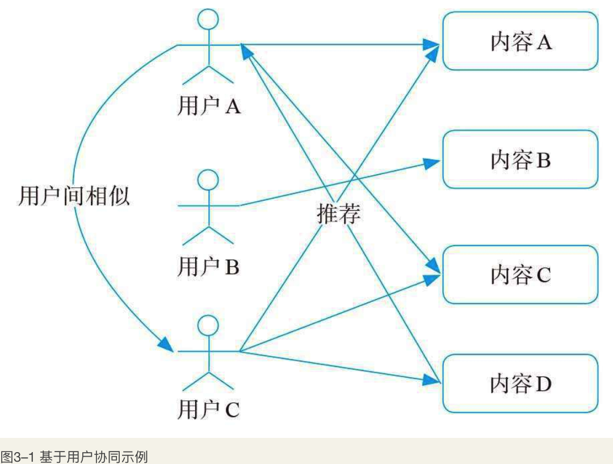

**基于物品的协同，其推荐的基础思路是：先确定你喜欢什么物品，再找到与之相似的物品推荐给你。只是物品与物品间的相似度不是从内容属性的角度衡量的，而是从用户反馈的角度衡量的。**

比如图3–2中，内容A和内容C都被用户B、C阅读，从阅读行为的角度看，两篇内容更相似。那么，当用户A阅读了内容A时，系统就选择与内容A相似的内容C，将其推荐给用户A。

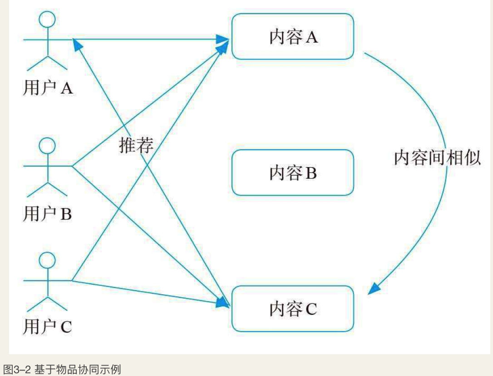

大家一度认为基于物品的协同要优于基于用户的协同，这是因为大型电商网站的用户数量往往远大于商品数量，且商品的更新频率相对较低，基于物品的协同能够以离线运算的方式获得更好的推荐效果。但对新闻推荐系统、社交性推荐系统等而言，其物品是海量和频繁更新的，故而基于用户的协同也有着相应的用武之地。

基于模型的协同，是用用户的喜好信息来训练算法模型，实时预测用户可能的点击率。比如，在Netflix的系统中就将受限玻尔兹曼机（Restricted Boltzmann Machines，RBM）神经网络应用于协同过滤。将深度学习应用于基于模型的协同，也成了业界广泛使用的方式。

## 从算法到应用
### 场景划分
垂类个性化推荐视频，如图4–1中的悬疑电影推荐、浪漫电影推荐，应用了`PVR（Personalized Video Ranker）算法`，针对每个用户推荐个性化的内容。这使得用户在同一类目下（如图4–1中的悬疑电影、浪漫电影）也会有不同的消费体验。

基于用户的消费历史推荐（`Because You Watched`），如图4–1中“因为您观看了电影，为您推荐”，这种场景与电商网站“买了某商品的用户还购买了某某商品”很类似。推荐算法会计算两个物品之间的相似度：既可以是基于内容特征本身的相似度，也可以是基于协同过滤的相似度。通过计算相似度产出候选集，并在该集合之上进行个性化的排序和推荐。

基于Top（排名靠前）热榜的推荐，应用了`Top-N Video Ranker算法`。与PVR算法应用于特定垂直类目不同，Top-N Video Ranker算法选择的是多个召回序列的头部结果，优中选优，基于全品类内容提供推荐。

基于时下流行的推荐，Netflix应用`Trending Now算法`给用户推荐他们可能关心的短期热点，从分钟维度到天的维度不等。典型的应用场景有两种：周期性消费（节假日、重要赛事等），如情人节一定是爱情电影的消费高峰期；短期热门事件消费，如发生飓风后，有关飓风的纪录片或电影就会有一段短暂的消费高峰。对应到电商场景，这种季节性消费的特点也会比较明显，如不同季节的服饰购买需求、不同时节的农产品购买需求等。

继续观看的场景。推荐运用`Continue Watching算法`，基于用户未看完的内容或正在追的剧集进行推荐。在这一场景下，并不是将用户未看完的内容以时间逆序罗列，而是综合考虑了上一次的观看时间、观看行为（暂停在了开头、结尾）等进行动态调序。此外，考虑到存在家庭账号共享的行为，算法也会进一步基于设备信息来推断当前这一用户是谁，从而展示相应的观看历史。

搜索的场景。推荐在搜索的场景下主要用于搜索词和搜索结果的补充推荐。以图4–3左侧为例，用户搜索“usual”，但对应的影片“The Usual Suspects”系统中并未收录，从而用户得到的反馈是基于搜索意图的推荐结果；在图4–3右侧，用户输入了“fren”，除了界面右上角为搜索结果外，其余都是推荐结果，界面左下方展示了搜索词的补全，右下方展示了“French Movie”的推荐结果。

### 交互界面
以最常见的推荐理由为例，这一设计广泛应用于内容推荐、电商推荐的场景。如图4–4和图4–5所示，亚马逊提供的是“购买此商品的顾客也同时购买”商品推荐列表，微信看一看提供的是“好友都在读”“技术大咖在读”内容推荐标签。

**从工程的角度出发，推荐理由提升了推荐系统的透明性，让用户明白为什么会推荐该种类型的内容。站在业务的角度，会更多地从促成转化入手，即什么样的推荐理由可以增加说服力，引发用户认同。**

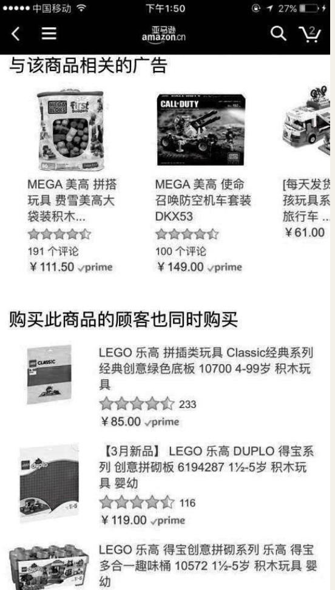

比如“技术大咖在读”这样的标签，从信息量上来看，弱化为“技术”足矣，保留此种说法的目的是为了满足用户的虚荣感。这跟服装店里导购员对你说的“美女，这件衣服好适合你啊，穿上特别显瘦”是一个道理。

输入框，通过提示的方式引导用户从口味、环境、服务的角度来切入，避免无话可说的情况；图片上传，以积分和后续的等级体系、抽奖反馈来激励用户；推荐菜，直接展示了热门菜供用户选择。各种引导和降低输入成本的措施，促进了单页面的内容积累量增加。

交互界面的迭代辅助了用户的决策，引导用户按照系统所期望的方式前进，以实现提升系统指标的最终目的。因此，对推荐系统而言，有着“交互界面 > 数据 > 算法”的说法。

### 推荐系统评估指标
**推荐准确度**。对应到内容推荐系统中，表现为对用户点击的预判（点击率）和对消费情况的预判（点击后的各种主动行为、停留时长）。由于准确度评估是可以复用既有数据进行离线计算的，故通常用于各种算法的迭代。比如，想设计一款新的算法以提升评论量，那么，就将历史上同一用户评论过的内容和未评论的内容输入算法，如果算法能够给前者打分更高，就意味着算法的准确率更高。

**推荐覆盖度（多样性）**。好的推荐系统是能够给用户提供视野范围之外的内容的：从用户的角度看，可以评估用户的展示历史中各种题材、类目、话题的丰富程度如何，丰富度越高代表个体体验的多样性越好；从内容的角度看，可以评估有推荐展示的内容占整体内容量的比例，或整个内容分发体系的基尼系数。

以Netflix为例，站在视频是否被播放的角度，使用了`ECS（Effective Catalog Size，有效条目数量）`指标来衡量系统推荐的多样性。如果系统内绝大多数的播放都来自同一部视频，ECS指标接近1；如果系统内每部视频都有相近的播放量，ECS指标将等于影片数。更高的ECS指标代表了更好的覆盖度。

如图4–7所示，对比了应用个性化推荐算法和只采用热门排序算法的情况，两者的ECS指标相差近4倍，即系统中有更多长尾的视频都得到了有效地展示和播放。

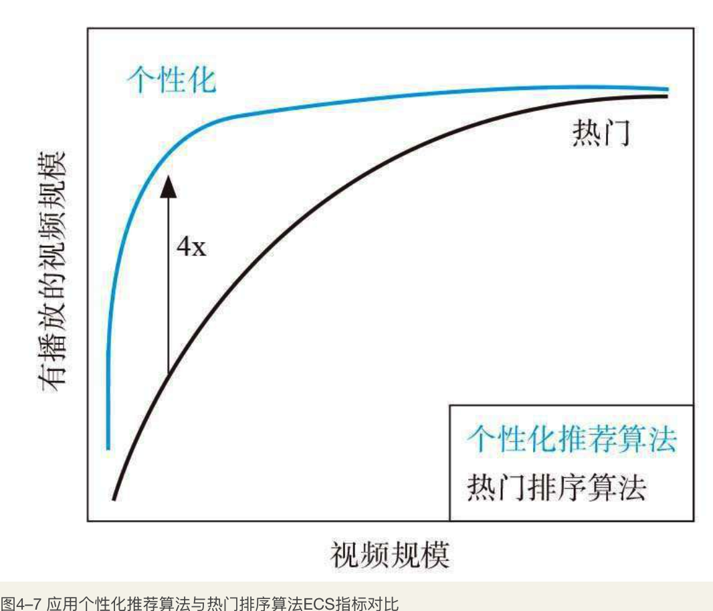

**援引公开博文**。脸谱网建立了一套完整的人工评估系统，分为三个部分：一对一用户访谈（One-on-One Interviews），面向常住外包团队（千量级）的人工评估（Feed Quality Panel），面向普通用户（万量级）在应用内投放的问卷（Global Surveys）。其中，人工评估有多种表现形式：

1. 给出两篇内容，让用户进行点对点的对比。
2. 给单篇内容提供打分选项，建议用户从内容与自身偏好的相关性、内容的信息量等角度给予1~5分的评分。
3. 以提出开放性问题的方式来收集用户对自己信息流的反馈。

借助人工问卷反馈，我们也可以发现一些有趣的现象。比如，用户更愿意在信息流的头部看到那些自己愿意互动的内容或是那些自己觉得更重要的信息。基于此，脸谱网对排序算法进行了调整，对用户互动预估（点赞、评论）较高的内容和用户更愿意首先看到的内容进行了提权。

## 连接内容与人
### 内容的冷启动
在推荐系统中，一篇内容借助探索性展示完成了从0到1的用户反馈积累过程。

在这个冷启动过程中，如果没能得到足够的正面用户反馈（点击行为和阅读体验），系统就会认为这篇内容是不受欢迎的，为了控制负面影响，就会逐步降低这篇内容的推荐量；反之，如果内容在冷启动过程中顺利找到了自己的目标人群，收获了很高的点击率，就有可能被推荐系统快速放大，具有了成为爆款的可能。因此，“冷启动决定一篇内容的命运”的说法丝毫不为过。

如推荐算法部分所提到的，在内容被提交进入系统伊始，由于缺乏用户行为反馈，推荐系统更依赖于内容本身的固有属性来进行冷启动。

基于内容的展示和消费，这些属性可以拆分为内容展现维度和内容消费维度。

其中，内容展现维度是列表页展现给用户的信息，如标题、封面、发布时间等。

内容消费维度包括作者层和内容层两方面：作者层内容消费维度是指，作者的粉丝群体更应该看到该作者的新内容，一个过往表现更好的作者可以得到更高的冷启动推荐量；内容层内容消费维度是指分类信息、关键词、命中的实体和话题等，用于判断内容与用户的偏好是否匹配。

没有点击就没有阅读体验，推荐系统首先考虑的就是表现层信息与用户的匹配度。在不同的应用场景中，用户决策的依据是不一样的，信息的表现方式也是不一样的，故需要结合不同应用的展现方式进行个案分析。以内容在信息流中的展示样式为例，展示出来的信息有标题、封面、作者信息（头像、名称）、发布时间等（如图5–1）。

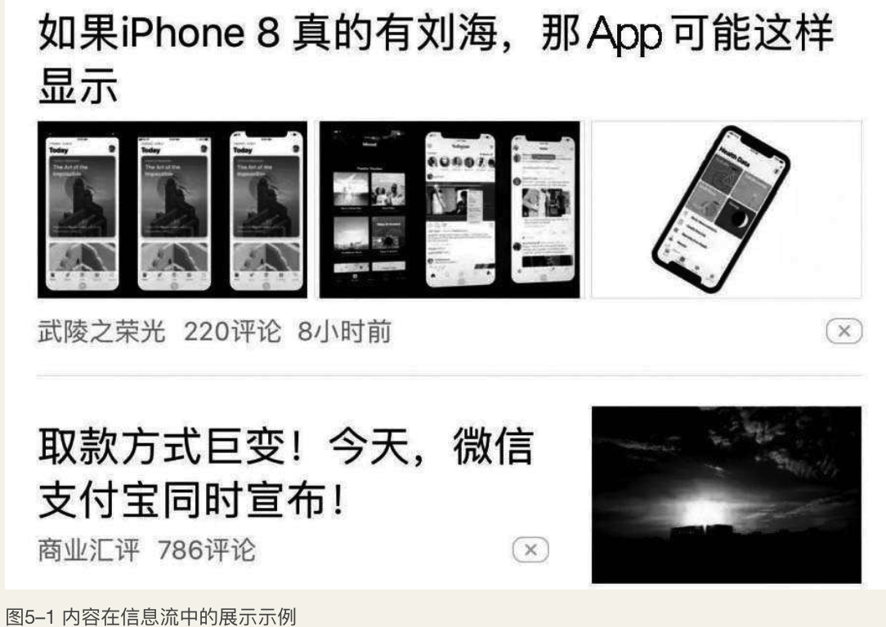

对新发布的内容而言，评论数和发布时间是可以忽略的，那么，展示的重点就集中在标题、封面和作者信息上：标题吸引人，封面清晰、表意明确，作者名称有权威度、与内容的领域保持一致等。

图5–1中展示的两篇内容其实都存在一些偏差：上方的内容作者名为“武陵之荣光”，对关心内容发布来源的用户来说，作者名称的权威度不够，看上去更像一个地区账号；下方的内容从作者名称看有一定可信度，但只选用了单图方式且图的表意同标题并无直接关联，不足以对用户构成有效引导。选用单图模式的另外一个问题在于，内容在信息流里的高度变矮了，不利于获取用户的注意和点击。

如前面算法部分所提到的，系统采用协同过滤的方式来对内容进行扩散，只有满意度较高的点击才算得上是对内容的有效正向反馈。冷启动阶段就是为了收获尽可能多的正向反馈，所以在预判用户有点击意图之后，还需要进一步考虑阅读体验是否同用户相匹配，即内容消费层的信息。

例如，对NBA领域的内容而言，有的是从球赛报道的角度，有的是从赛事版权的角度，还有的是从体育娱乐产业、泛娱乐经济的角度。它们在表现层展现的标题、封面的差异或许不太大，但是在内容的主题、作者或行文用字上，必然存在差异。系统通过分析作者过往的表现（如财经类作者的内容更容易倾向财经角度）、统计词频（如提及版权、分销，还是比分、MVP等关键字）等方式来预估这篇内容的分类话题属性以及用户点击后是否会满意。

就题材而言，图文载体可供系统分析的信息相对丰富。对视频载体或短内容来说，由于文本信息匮乏，系统会更倾向于从标题、描述、作者维度来预估其点击率和内容质量。

在实践中，我们经常会碰到由于冷启动有误导致内容推荐出现偏差的情况。先来看几个例子：

- 视频标题：“普京曾经实习的单位，最厉害的国家狗仔队是如何工作的”
- 短内容标题：“感恩一起战斗的日子，感谢我的战友”
- 视频标题：“堪比电影中出现的场景：死神来了！”

第一个视频标题可以拆分为“普京”“单位、实习、工作”“狗仔队”三部分。第二个短内容标题，从文本特征上来看，基本上命中“战斗”“战友”。第三个视频标题，只从标题上来看，基本上命中电影《死神来了》。

但事实上，第二个短内容的场景是某个艺人在戏剧杀青后的感言。第三个视频内容描述的是车祸中某人很幸运地躲开了多车相撞，内容如图5–2所示。

上述三个内容，除了第一个内容标题命中了“普京”，使得其冷启动不至于偏差太大之外，其余两篇内容都在冷启动阶段折戟沉沙，没能获得进一步的曝光。

为了优化内容的冷启动，我们还是会从展现层和消费层分别着手：

- 在展现层，需要探寻面向不同载体、不同人群的，更适合的表现形式。比如：对小视频应用（抖音、快手）来说，更适合突出创作者主体，以竖屏的方式展示；对于高质量后平台强推的作品，以预览动图作为封面可以增强其吸引力。
- 在消费层，一方面，需要尽可能挖掘和完善不同载体的特征、权重。比如：对视频而言，长度信息、画面清晰度都可以成为补充的特征；对短内容而言，在冷启动阶段应尽量放大作者的权重，优先推荐给其粉丝和准粉丝群体，用以证明内容消费的价值。
- 另一方面，也需要从作者层面着手，引导作者主动完善内容信息。比如，给视频增加简介和标注，尽量选择自定义封面而非视频截图等，帮助系统获得更多可供冷启动使用的信息。业界也有公司采用专门的运营标注团队，对高质量视频进行系统化的标签完善和建设工作。

### 用户的冷启动
在用户冷启动的场景中，推荐服务的一大目标是：用户的留存率。

### 兴趣探索
在冷启动环节里，应用推荐技术本质上还是以“留住用户”为第一要务：尽快发现用户的主要兴趣点，并推荐和这一兴趣相关的内容以换取更高的点击率。而当新用户已经成了老用户，在已经实现短期留住用户的前提下，推荐系统需要在一定程度上牺牲短期点击率来探索用户更广泛的兴趣，从而获得用户长期留存率的提升。

### 用户消费的角度
如果我们把对新类目的探索概括为“以规模换效果”，那么，对用户新兴趣的探索便可以概括为“以时间换效果”：只要用户在应用内停留的时间足够长，就有机会通过各种中低频的方式来完善用户画像。

一方面，随着用户停留时长的增加，会产生更多的主动动作，如评论、关注、搜索、调整频道顺序、主动访问不同功能页等，这些主动动作都会给用户画像补充新的信息。比如，当用户搜索特定关键词“嘻哈”时，就代表他对这类内容产生了短期兴趣。

另一方面，系统也会基于用户已有的偏好进行更广泛的兴趣探索。如在用户冷启动部分提到的，系统会基于统计学的概率——喜欢A的用户有多大概率喜欢B，喜欢A和B的用户有多大概率喜欢C——来给用户推荐新领域的内容，逐步探索和完善用户画像。理论上，如果我们划定一定比例的展示量用于新兴趣探索，那么，只要用户的停留时间够长，系统内的兴趣分类就一定能够被探索完毕。

对于用户的兴趣探索，一个值得注意的问题是：小众兴趣的探索和丢失。这个问题本身是因小众兴趣的供给不足引起的。比如，用户的兴趣偏好是“马龙+乒乓球”，但系统内这类内容只有100条，是个很小的兴趣点。

从探索的角度来看，内容太少会导致试错的成本太高，一次负反馈就会影响后续的探索过程：一旦因为上下文、场景等关系用户没有点击，系统就会转向其他兴趣点，从而错过此类内容的发现。

从消费的角度来看，即使系统发现了用户的小众兴趣，但是若干次刷新之后这类内容就被消费完毕了。之后，由于缺乏足够的优质内容供给，用户会在相当长的时间内没有办法触达此类内容。系统基于时间进行衰减处理，小众兴趣就会慢慢地被淡化和丢失。

应对小众兴趣，一方面需要扩充系统的资源池，让小众兴趣也有足够的内容覆盖，另一方面也需要通过产品设计鼓励用户更主动地进行强表达行为（如收藏、关注），一次关注行为显然比一次点击行为更经得起长时间的衰减。

### 自媒体与平台
站在平台去看自媒体，我们会分别从评估、服务、引导三个角度进行阐述。

#### 自媒体评估
机器推荐时的作者权重计算、运营资源投入时的分配选择、新功能内测时的定向邀请，都要求我们对自媒体有相对合理可信的评估体系。虽然各大内容分发平台在内部都有着各自的细则，但其整体评估基调还是可以透过它们公布的指数信息或评级信息得以了解一二。

首先摘录头条号指数的介绍。

- 原创度：平台鼓励作者进行原创，并手动、优先在头条号平台发表内容。
- 健康度：将用户对自媒体发布文章的阅读行为进行分析和统计，用户每一次有价值的点击、停留、点赞、评论、收藏等都会为其账号加分。
- 垂直度：一方面考虑自媒体发文的专注程度，发文领域越专注其分值就越高；另一方面考虑自媒体的更新频率，发布频率高也会有助于获得更高的分数。
- 关注度：主要取决于自媒体的粉丝绝对数量、活跃情况（粉丝阅读评论情况），是对自媒体粉丝运营的考量。
- 传播度：指已发布内容的影响力，主要取决于自媒体的累计阅读量、累计播放量。

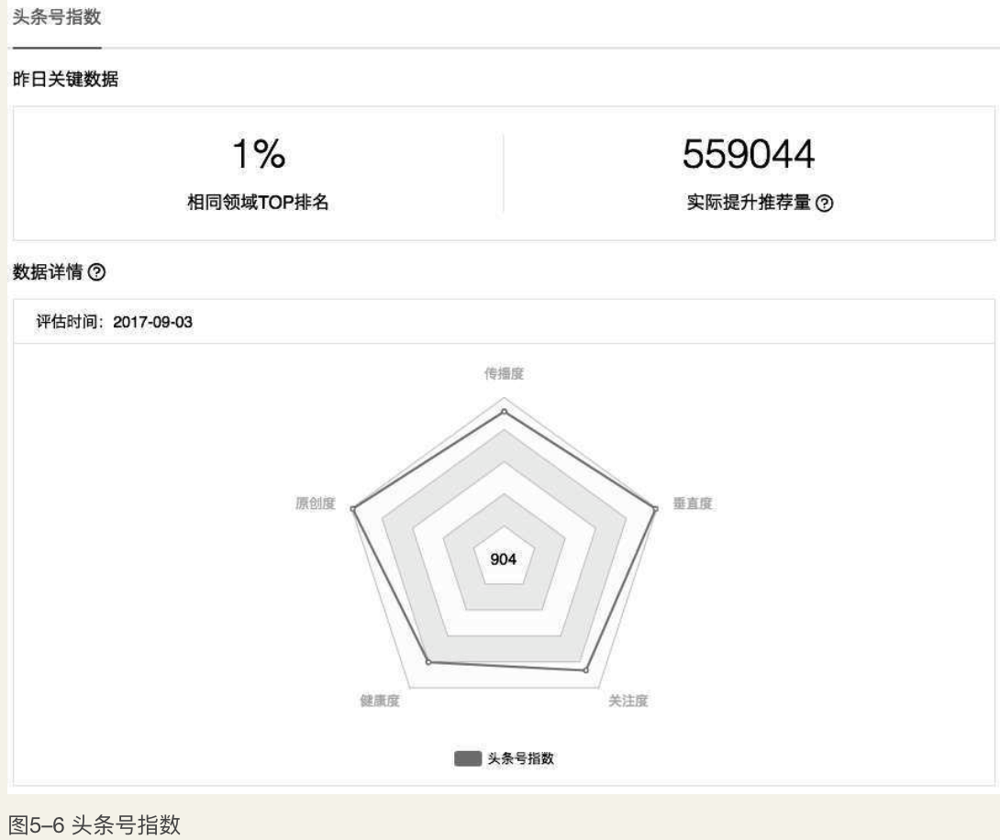

表5–1 其他平台评估方式

**适合平台的内容价值**：不同的平台多多少少都会有自己的调性，外来的和尚未必合适，只有适应自家平台水土的才能够念出真经。比如，快手的“大神”到了美拍未必会卖座，美拍平台应该基于自身平台的特点来衡量作者价值，健康度衡量的就是这方面的价值。它基于内容在平台上的点击阅读表现，给出自媒体在平台上的合理价值预估，而不追求全网PR（Publish Relations，宣传效果）意义上的“优质自媒体”。

**基于平台的持续贡献**：平台希望自媒体能够持续稳定地创作专业内容，擅长体育的就持续深耕体育类目，擅长历史的就不断产出历史评说。原创度、垂直度、传播度就是对这方面进行衡量。原创度高的账号由于具备创作能力，其内容质量的稳定性、内容题材的独特性通常会高于搬运作者；垂直度高的作者更新频率稳定，产出内容领域垂直；所有基于平台的投入最后都会反馈在累计阅读量的持续增长，即传播度的维度上。

**依托于平台的作者品牌**：一篇泛泛而谈的内容，你可能会阅读完毕，但绝对不会想要关注，能够让用户产出一探“结出果子的是哪棵苹果树”念头的，一定是更有价值的作者。从平台的角度看，一个具有粉丝凝聚力的自媒体账号，是有助于提升平台留存率的，因而更值得肯定。这也就是为什么在已经有了健康度这一指标可以反映单篇内容质量之后，还要引入关注度指标，用于衡量用户对作者价值的认可程度。

以头条号指数为例，一方面指数本身对内容推荐量有加成的作用（如头条号指数图中的实际提升推荐量），另一方面其同时关联了各种运营工具的开通权限。如：双标题双封面、热词分析、外图封面可以帮助作者获得更多的流量和更好的消费体验；商品、粉丝必见、扩展链接则可以帮助作者获得更高的扩展性和商业变现可能（如图5–9所示）。

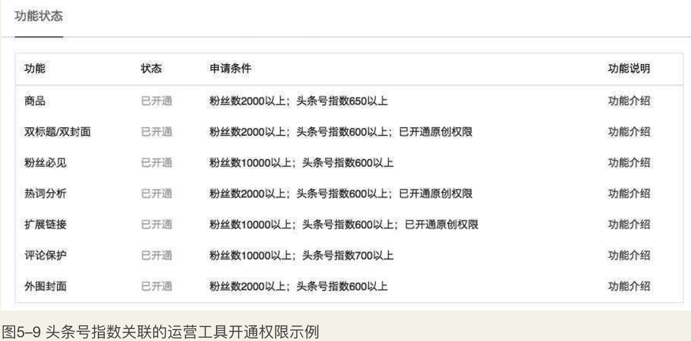

## 常见的推荐问题
### 推荐重复

四种场景分别对应了内容重复的四种处理方式：

- 情况A（甲、乙两篇内容，列表页和详情页都相同）：
从消费角度来看，甲、乙两篇内容对用户来说是具有替代性的。用户消费了甲内容之后，大概率不需要再消费乙内容了。那么，对推荐系统来说，就需要从甲、乙两篇内容中进行选择，选出应当展示给用户的内容。因此，问题从内容选择转变为信息源选择，需要深究重复构成的原因和内容的消费特点。
    - 搬运号对原创内容的抄袭：展示原创内容，对搬运者进行惩罚。
    - 媒体机构发布的新闻通稿：选择首发、权威度高的媒体，或是基于用户订阅关系，给用户推荐他订阅的自媒体。
    - 热点转发内容：在这种场景下“被谁转发”是有一定信息量的。我们会基于用户跟转发者关系的紧密度来判断是否需要展示，紧密度低则不展示。
    - 对于某些具有重复消费属性的内容，如音乐、评书、相声等，可以通过产品设计方式（如历史记录、再看一次、收藏列表、播单等形式）让同样的内容重复出现。
- 情况B（甲、乙两篇内容，列表页不同但详情页相同）：
    - 在转载的情况下，一篇内容以不同的“妆容”展现在列表页当中。这时就需要进一步分析，以确定用户是否看过此内容。
    - 如果用户点击过甲内容，那么给他推荐乙内容的必要性是不大的，因为从点击后的消费体验来看，用户并没有获得额外收益。如果用户没有点击过甲内容，那么乙内容因为发布者、标题、封面的不同，带给用户的列表页消费预判是不一样的，也就有了进一步推荐的必要性。头条号的脑洞功能“双标题+双封面”就是一个实际的应用。
- 情况C（甲、乙两篇内容，列表页相同但详情页不同）：
    - 典型的例子如红烧肉的做法、郭德纲最新爆笑相声等，尽管用户点击后的消费体验不同，但是相似的列表页展示会给用户带来消费决策上的困惑。
    - 如果用户点击过了甲内容，他十有八九会以为乙内容与甲内容是重复的，从而忽略；如果用户在列表页看过但是没有点击甲内容，他也会大概率地错过乙内容。对于这种情况，应该拉长两篇内容的推荐间隔，将其视作一个密集打散问题处理。
- 情况D（甲、乙两篇内容，列表页和详情页都不同）：
    - 这种情况是最简单的。两篇完全不同的内容，互相不构成对用户消费预判的影响，分别推荐即可。

### 推荐密集
导致推荐密集的原因，一方面是因为用户的短期兴趣点通常比较明确，会因为特定事件或人物而快速聚焦。

另一方面则是因为推荐系统对用户的兴趣点理解不够，或是仅追求点击导向而放大了用户的强兴趣相关内容，从而忽视了用户的弱兴趣相关内容。

但是，不同用户短期兴趣点的衰减速度是不可预知的。比如，对于阅兵的内容，可能到第三天就无人提及了。有关NBA的赛事报道在赛季结束后，也再无更新。为了防止用户体验发生断崖式的下跌，从产品角度来看，还是希望避免一次刷新中出现内容过度密集的情况。通常，我们采用滑动窗口规则，即连续多条规则尽可能在多个维度打散，降低用户的视觉密集感。

### 易反感内容
如图6–2所示，列表页中展现出了标题和封面信息供用户判断，用户点击了前两篇内容，没有点击第三篇内容。

从内容质量维度看，低质量的内容一定会引发用户的反感，如文不对题的标题党、传播虚假信息或耸人听闻信息的猎奇党、质量低下的无聊水文、因时间识别错误导致的旧闻问题等。如图6–2中第二篇内容的情况，用户在被标题吸引点击后可能很快就会退出，或是在内容当中举报，留下负面评论内容等。我们可以通过用户的反馈行为来发现第二类内容，以降低它们对用户体验的影响。

通常，我们将没有被点击的内容视作对用户无损，它起到了如兴趣探索、广告变现等作用。但在实践过程中，我们发现有部分内容会因题材问题而非质量问题，对部分敏感用户的列表页消费体验造成负向影响，我们将之归结为易反感内容。常见的易反感内容有：

- 鬼神类内容：如灵异故事、UFO（不明飞行物）等
- 恐怖血腥类内容：如蛇、野生动物等
- 迷信类内容：如算命、风水等

对易反感内容而言，先要识别得准，再要推荐得好。

识别过程采用的是数据产品中定量分析处理问题的通用流程：分析影响面、定义标准、数据收集标注、模型评估。

就易反感内容的影响面而言，用户的反馈量统计就是一个衡量标准。将一定周期内用户的反馈进行整理和标注，对应到不同的易反感内容类别上，就得到了各个类别的影响面情况（如表6–2所示）。

表6–2 用户反馈量统计示例

在确认了问题的影响面和优先级之后，就需要针对各类问题达成一致可理解的定义。在这一环节中，我们需要抽离出问题最重要的抽象信息，让第一次看到这些信息的人也能迅速明白这类问题的主要表征是怎样的；然后，辅以大量的正例、负例，以帮助参与的人能够通过例证更好地对齐理解、把握尺度。比如，对迷信类内容的标注为：

表6–3 迷信类内容标注示例

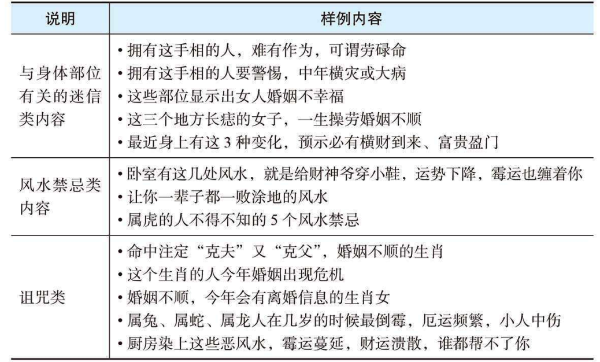

数据收集与标注是为模型训练做准备的。基于对标准的理解，标注人员通过双盲校验的方式标注出足够进行模型训练的数据。

在研发产出识别模型后，产品经理还需要对模型的准确度和召回度进行评估。在不同的应用场景下，准确和召回的平衡度是不一样的。在易反感问题上：如果要强化读者端的体验，尽量不让用户看到易反感的内容，就需要重视召回率，宁肯误删也不能漏删；如果要强化作者端体验，希望作者的内容尽量不要被误删，则需要重视准确率，适当露出一些置信度低的结果或增加人工复审捞回流程以保证内容不至于被错杀。

### 时空限定内容
在时效性上，不同的内容有不同的保鲜期。

短时效性内容，以赛事、股市信息为代表。这类内容具有保质期短、时效性强的特点。它们可能会每半小时更新一次。在新版本的消息出来后，旧的消息就完全没有价值了。比如：演唱会预告的内容，就不应该在演唱会之后再推荐出来；赛事结束后，中场的消息就不应该再展示了。

中时效性内容，通常可以覆盖绝大多数新闻内容，涉及最近发生的新闻事件，以天和周为时效性周期。比如，与电视剧《权力游戏》相关的内容生产与消费通常与电视剧播出节奏保持一致，在剧集播出之后，其热度逐渐衰减。

长时效性内容，具有跨时间维度的消费价值，可以是知识、案例分析等非虚构内容，也可以是小说、散文等虚构内容。

对大型推荐系统来说，在处理内容时效性问题上，需要平衡两方面的问题：长时效性内容推荐的日期短了，会造成资源浪费；短时效性内容推荐的时间长了，会对用户体验造成伤害。因此，推荐系统会基于内容的特点预判不同内容的衰减周期和推荐策略。

## 带着偏见看推荐
### 信息茧房
一种普遍观点是：机器算法主导的精准分发，在提升阅读体验的同时，也极易导致由信息收窄带来的一叶障目。即在算法分发下，用户将深陷信息茧房当中。

### 推荐会导致Low？
#### 1. 三问内容质量
让我得以请教纸媒对内容的衡量标准。其曾供职的报社，对优质内容的衡量标准如下：

- 受众角度：读者关注面广，在社会上引起较大反响，为报纸争得明显的效益或荣誉，收获普遍好评的热点、焦点新闻稿。
- 策划角度：富有策划、创新意识，极具冲击力和感染力的报道。
- 深度角度：分析透彻，有独到见解的深度报道。
- 题材角度：重大独家新闻，重大调查性报道。

大量的案例分析，我们能够抽离出一些客观指标，也能达成一些平台审核层的主观一致标准，以较少争议、控制误伤量的方式给出评判“内容质量差、不宜传播”的标准：

- 真实性上：歪曲事实，虚假信息等。
- 阅读体验上：无意义内容，错别字连篇，文不对题，语句不通顺、掺杂广告等。
- 价值引导上：不正确的价值观导向，煽动对立情绪，低俗色情等。

#### 2. 为什么会觉得推荐内容格调低劣
其一，推荐准确性问题。

一方面，每个人的认知程度是不同的，如果一篇内容是低于我们认知水平的，那我们一定会觉得它质量一般、内容格调偏低劣。

其二，用户无意识反馈问题。

想象一下，当一篇八卦新闻和一篇深度分析同时出现，你会做出怎样的选择？站在马斯洛需求模型的金字塔前，本我制造了足够大的需求。你点击一篇娱乐八卦，很有可能是本能驱动的下意识行为。你更多地点击娱乐八卦又给了推荐系统对于此类内容更强的反馈信息，从而增加对此类内容的推荐。如果从推荐系统的点击预估角度看，更接地气的内容超过高大上的内容几乎是必然的。

#### 3. 更平衡的产品设计
假如我们在点击一篇内容重复度很高的娱乐八卦和点击一篇行业深度分析之间，倾向于认为后者更有价值，那就需要找到更好的方式来衡量一次阅读的价值，从而引导推荐系统的分发流程，比如：

- 内容稀缺度：越垂直的内容越稀缺，小类目下的内容点击可能比大类目下的内容点击更有价值。
- 作者角度：从全局来看，每个垂直赛道都会跑出有广泛知名度的内容品牌，它们的内容往往更适合广泛传播；从用户个体来看，某些用户会对内容来源而非内容类目更加敏感，这就需要放大作者的相似度以降低内容的相似度。
- 互动行为：不同的行为代表了用户不同的意图。阅读行为仅仅是一种个体行为，点赞、评论都代表了用户对内容更感兴趣，而分享则意味着用户愿意为之传播和背书，可能权重更大。

### 编辑、算法与社交，三分天下？
先抛出个人的结论：编辑（中心人工主导）分发、算法（机器主导）分发、社交（离散人工主导）分发各有千秋。内容分发服务追求的是分发所能触及的这一远景，为了达成这一远景，就需要探寻每一种分发更适合的应用场景。

如果我们简化算法推荐过程，将推荐的因素收敛到编辑、社交、模型三种因素，那么，一个内容在系统中的得分可以表示为下列公式：

`内容得分= a×编辑因素 + b×社交因素 + c×模型因素`

a、b、c分别为三种因素的权重。

## 面对推荐系统
哪个才是一款产品的核心指标呢？

我个人给出的答案是：有价值用户的长期留存。

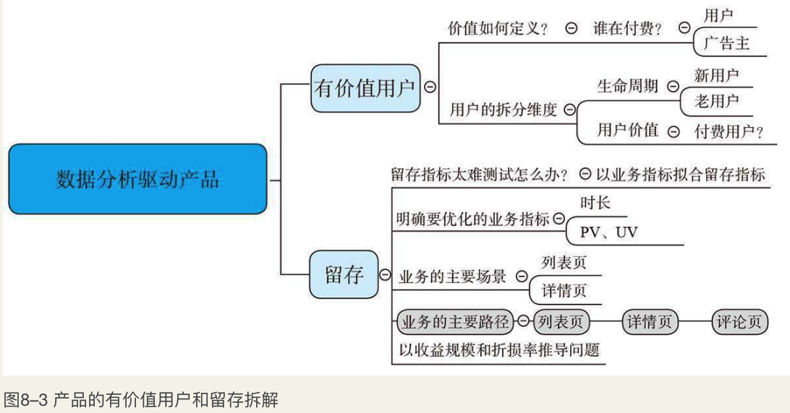

下面我们将结合图8–3来做简单的拆解。有价值的用户是指能够最终给公司带来收入的用户，长期留存可以保证收入的稳定性和可持续性。

在价值的定义上，根据具体付费方的不同，可以大致分为C（消费者）端收费、B（企业）端收费，在不同的产品中，其盈利方式和有价值用户的定义会有所不同。

- 以信息流产品为例，有价值的用户可能是那些点击或浏览信息流广告的用户。
- 以游戏产品为例，有价值的用户可能是付费的“氪金”玩家。
- 以直播产品为例，有价值的用户可能是打赏的金主。
- 以职场社交产品为例，有价值的用户可能是活跃在这一产品上的、可被招聘和挖掘的职业用户。

### 核心指标的拟合
不同产品的核心业务指标通常是：
- 对于信息流产品，可能是点击率、停留时长。
- 对于社交类产品，可能是用户的关系数，以及基于这些关系所能产生的消费量。
- 对于直播类产品，可能是观看时长、关注的主播数量。

### 业务的理解
以优化登录率这个任务为例，国内手机软件的登录框提供的登录方式通常有手机号、微信、微博、QQ等。对于这几种方式之间的选择，我们会发现不同手机软件的做法各异：

- 爱奇艺：默认手机号登录，点击“更多登录方式”才提供弹出框选择更多登录。
- 得到：并列提供微信登录和手机登录。
- 今日头条：并列提供手机号、微信、QQ登录。
- 豆瓣：优先提供手机号、邮箱登录，页面下方提供微博和微信登录。
- 腾讯新闻：只提供QQ、微信登录。

# Part02 关于自媒体
## 好内容为什么没人看
- 第一，质量不等于销量。
- 第二，与其抱怨没有推荐量，不如来谈谈怎么推荐得更好。
    - 我们可以将内容的阅读体验指标化、可衡量化，以进行进一步的分析，可以切入的角度如：
        - 点击率：酒香也怕巷子深。如果点击率太差，先别废话，回炉改封面和标题去。
        - 阅读反馈：点赞、评论数与阅读量的比例，是否与其过往的内容一样？还是降到了平均线以下？如果是，那说明要么是这篇内容质量有问题，要么是推荐系统推荐的目标人群不对。

## 自媒体的数据分析
### 数据收集与处理
BuzzFeed开始探究一篇内容的传播轨迹，开发了一套名为POUND（Process for Optimizing and Understanding Network Diffusion，网络传播优化及理解流程）的系统，通过给同一页面的不同分享追加不同参数的方式，来追溯内容在网络上的传播过程。

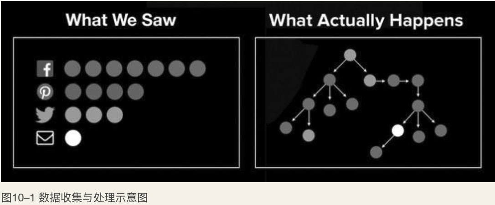

因为社交传播对内容的影响力贡献巨大，BuzzFeed在衡量内容价值时，会更看重社交分享所带来的阅读量，并以病毒传播提升系数（Viral Lift）指标来衡量这一过程。

### 降低数据使用门槛
对于不熟悉编程语言的员工，能够在其Looker数据平台上以可视化的方式查看不同来源的数据，直观地了解内容的传播轨迹和传播效果。无论是文字编辑、视频编辑，还是业务分析师、商业广告支持人员，BuzzFeed希望员工都能够更清晰地认知到自己的每一项工作所产生的数据反馈，及时了解目标受众到底关心什么、究竟喜欢什么，按需调整自己的工作策略。对数据的重视和应用像基因一样，已经嵌入BuzzFeed的每一个部门。

BuzzFeed以数据驱动媒体的方式或许可以给我们借鉴：内容创作和内容分发可以是数据化的，科技的辅助应用或许能给变革者带来超越其他媒体前辈的机会。

### 内容阅读分析
#### 一次打开
对于粉丝分发平台，一次打开率的计算公式为“一次打开率=阅读量/粉丝量”；对于推荐分发平台，一次打开率的计算公式为“一次打开率=应用内阅读量/推荐量”。一次打开率对于不同分发模式的平台有不同的意义：

- 在粉丝分发平台上，与阅读量相比，一次打开率能更好地衡量自媒体账号的价值。为了保证更高的一次打开率，需要更科学地获取精准粉丝、重视粉丝群体的互动维护，使自身能够始终保持较高的粉丝触达率。
- 对于推荐分发平台，一次打开率考量了自媒体对平台分发特点的认知和对内容包装的功力。一次打开率（推荐点击率）高意味着具有成为爆款的可能，甚至会收获比粉丝分发平台更大的阅读量。

#### 阅读体验
平均消费比例越高，代表用户的认可度越高、消费体验越好。参考这一指标通常会给我们很多有意思的发现：

- 片头：很多短视频综艺节目都会有自己的片头，越长的片头通常会带来越高的跳出率。类似前贴片广告，在用户对内容品牌没有强认知的情况下，片头实际上降低了他们获取内容的效率。一般建议将节目品牌插入内容播放过程中，作为转场画面以获得品牌曝光量与播放量的平衡。
- 片尾：在内容质量尚可的前提下，片尾广告的触达率通常都不错，如何提升转化率，考量的就是自媒体的引导性内容制作功力了。由于看完了整个视频，所以自媒体在片尾引导用户关注自己的效果要比片头好一些。
- 相同字数的内容、多图内容的平均阅读速度一般略快，这可能是因为用户的注意力主要被图片吸引，从而更容易略过文字的部分。
- 对于推荐算法分发的系统，跳出率会存在一定的偏差。比如，标题中使用了歧义词导致系统将其分发给了非目标用户，这部分用户的头部跳出率通常很高。

图10–5为图文和视频的消费完成情况分析。在一些垂直网站，如优酷、喜马拉雅，对内容的跳出点给出了更为详尽的分析数据。

对于转发指标，我们可以套用BuzzFeed病毒传播系数的计算方式：

    Viral Lift = 1 + 传播阅读量 / 一次阅读量。

### 粉丝增长分析
首先，我们引入三个概念：LTV、CAC和ROI。
- LTV（Life Time Value）：一个粉丝从关注该自媒体的那一天开始到取消关注或者脱离平台，能够带来的收益，通常按渠道来计算。如果某个渠道或某个平台的用户不精准、付费意愿差，那么这个渠道的用户LTV就相对较低。
- CAC（Customer Acquisition Cost，用户获取成本）：同样跟渠道有关，自媒体需要持续发现低价、优质的渠道，抢占红利期。比如，2015年年初，微信广点通渠道的公众号涨粉，单个用户获取成本只有1~2元。
- ROI（Return On Investment，投资回报率）：其计算公式为ROI =（收入–成本）/成本。应用于粉丝增长场景就是ROI =（LTV – CAC）/CAC，衡量的是自媒体从一个粉丝身上挣到的钱是否能够覆盖获取这个粉丝的成本。

通常，我们应该做“ROI>1”的事情，这样才能够保证业务的可持续发展。

## 自媒体运营
### 标题党的开山鼻祖
纸媒标题党的鼻祖，或许应该追溯到1985年。那一年，一本名叫《知音》的纸媒在武汉诞生，由此开创了一个名叫“知音体”的时代。还记得那年的报亭，一本以时尚女性作为封面的杂志在众杂志中脱颖而出，以硕大的字体呼喊出其本期的内容：

- 《再大的恨放下吧，唤醒前夫赢得亲情一片天》（2007年第35期）
- 《风之谷啊我的妹妹，哥哥的未来献给你》（2007年第7期）
- 《外婆杀孙啊可怜的疯狂，血案几多亲情泪》（2008年第18期）

可以用一份数据来证明《知音》的辉煌：《知音》是排行全球前五强的著名大刊，也常年稳居中国杂志发行量第一的宝座，月发行量一度达到700万份。

### 自媒体：在商言商
对于熟识的朋友，我一再建议：即使团队再小，也应该设置一个负责内容宣发的职位。

### 让用户愿意点击你的内容
以今日头条的平台为例：三段式标题、三幅封面图、使用双标题可以说是必须要使用的功能。

- 三段式标题，是将标题分为三个部分，这样能够承载更多信息量，使用户更容易理解，而层层递进的方式也让表述更为清晰。比如，“北京第一网红餐厅，不用服务员盘子满天飞，出餐到用餐仅17秒”，“宁波最后的书场，6块钱听一下午，火爆数十年如今只剩80位听众”，给读者留有悬念、制造冲突或是以问句结尾等方式，通常能够吸引更多用户的点击。
- 三张封面图，是基于App内容展示样式所做出的必然选择。对内容来说，有三图、无图、一图三种样式。三图的样式无论在展示的高度还是在视觉冲击力方面都毫无疑问地具有优势，能够更好地吸引用户点击。结合已有的实验数据来看，对于同一篇内容，使用三图方式的点击率是略高于单图、显著高于无图样式的。
- 双标题其实是个续命的脑洞功能。推荐引擎依赖冷启动的反馈来决定一篇内容可能达到的分发量级。双标题，给了一篇内容两次冷启动的机会，降低了好作品被埋没的概率。

### 粉丝运营：新时代的新问题
在当下，自媒体是否选择把内容从平台A导流到微信或微博，其实是个生意经：

    导流收益 = 平台A阅读量 × 平台A到微信平台的转粉率 × 微信的粉丝变现效率
    不导流收益 = 平台A阅读量 × 平台A的转粉率 × 平台A的粉丝变现效率

### MCN：矩阵思路
MCN是个舶来词，全称为“Multi-Channel Network”。援引维基百科的定义，MCN给视频自媒体（YouTube称之为频道，即Channel）提供如产品、研发、推广（cross-promotion）、数字版权服务、商业化变现等方面的支持，通过与自媒体分成来获得营收。

对平台方而言，同MCN合作的最大收益在于沟通与管理成本的降低。在1万个独立创作者和100个MCN机构之间，平台显然会倾向于同后者沟通，大量烦琐的运营指导、质量监测工作相当于转嫁给MCN来完成。

对自媒体而言，同MCN合作能够在分发层（流量）和变现层（收入）获得收益。以YouTube上的MCN工作方式为例：

- 数据分析：借助YouTube的数据分析支持，MCN可以开发出相应的系统对视频内容的受欢迎程度进行分析，对目标人群进行刻画，辅助创作者更好地创作受欢迎的内容。图11–1即为MCN利用YouTube数据接口产出的分析。
- 流量优化：深刻理解平台规则和运营特点的MCN，有十多个不同的渠道可以在YouTube上获取流量。比如：结合目标人群特点进行搜索的SEO优化，在旗下多个节目间利用annotations（注解）进行流量流转，进行数字化广告投放，等等。
- 内容变现：在YouTube平台内部，MCN有机会获取更高的广告分成，并帮助视频创作者获得官方的原创扶持资金；在YouTube平台之外，还可以帮助创作者承接广告业务、同电视台合作进行短剧制作和IP衍生品服务等。

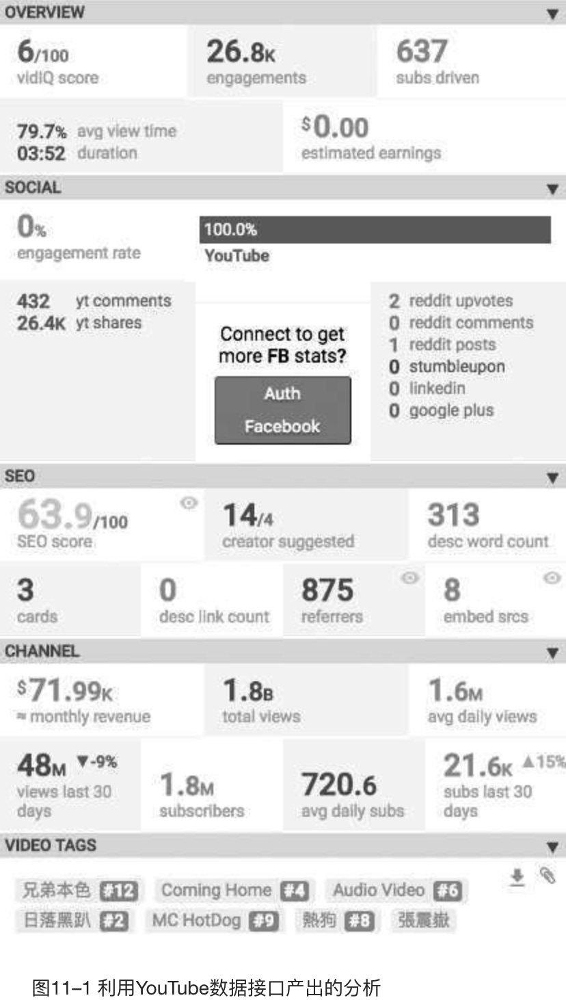

早期的MCN类似于经纪公司，通常更倾向于同头部IP合作。通过精选一批有影响力或有潜力的视频创作者，对其内容进行深度包装、广告合作来获得低频大额的广告及衍生品收入。这一时期的MCN公司，更多的是运营人力密集型产业。

而随着YouTube平台的运营规则趋于稳定，数据接口和投放接口不断开放，依附其上的MCN公司也逐步完成了从运营人力密集型产业向研发人力密集型产业的转变。自动化程度的提高大大降低了服务成本，使MCN的服务能够普惠到更多作者，从最初签约门槛数十万量级订阅一路降低到了万量级甚至更低。

在同Maker Studio（YouTube的大型视频提供商之一）沟通的过程中，我不止一次地听到他们谈论基于YouTube开放平台所做的数据分析和创作管理，不仅能够帮助他们更快速地发掘出有潜力的视频作者，发现搜索趋势指导创作，还能够借助机器投放批量完成账号与账号间的互推、不同广告位置的露出平台等。

在国外，典型的MCN公司有：

- Awsomeness TV，YouTube上青少年订阅量第一的频道，拥有460万订阅用户，月均千万浏览量。2013年，Awsomeness TV被梦工厂以3300万美元收购。
- Maker Studio，共辖7万个频道，用户涵盖方方面面，月均数十亿次播放。2014年，该公司被迪士尼以5亿美元收购。

一个新的概念又来了，那就是MPN（Multi-Platform Network），即多平台网络。从MCN到MPN的迁移，实际代表了分发渠道的变革：对美国市场而言，自媒体视频流量不再是YouTube一家独大了。

当脸谱网宣布其视频播放量超越YouTube时，一直深度依赖YouTube的MCN迎来了新的变局，流量的出口从未如此繁荣：YouTube、Vine、Instagram等社交性平台，Netflix、Hulu等SVOD（付费点播）平台，以及传统的HBO、AMC、NBC（美国全国广播公司）等OTT（互联网电视台）平台。如牧民逐水草而居，寻求更多元流量的MCN必然会对接不同的平台方，试图获取更多的利益。

### 典型MCN分析：新片场
新片场是国内由视频创作者社区“V电影”发展而来的一家MCN公司，并于2015年登陆新三板，成为一家上市公司。

在创作者对接上，新片场目前管理着300多个频道，全网累计粉丝破2亿，播放量破60亿。其内容分为自制和签约两部分。对于A类内容，为了增强控制往往以自制或投资控股等方式进行强连接，其余内容则是通过签约的方式弱关联。新片场体系中影响面比较大的短视频品牌，几乎全都是自营品牌，如“造物集”“魔力美食”“小情书”等。

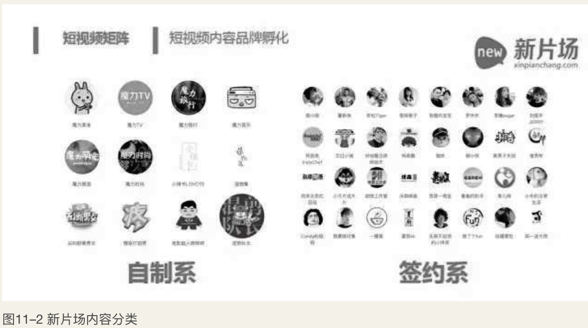

在收益变现上，除了基础的平台方流量分成外，新片场也在探索如周边衍生、软广植入、内容电商、IP孵化等方式。根据新片场年报，2016年公司在周边产品及衍生品方面实现收入400万元；旗下视频品牌造物集开设的电商店铺，实现年营收五六百万元；与雪碧合作的软广视频“6种方法让雪碧更好喝”在微博上的播放量突破1000万次；双十一期间，与淘宝、天猫共同尝试做内容电商，推出“脑洞研究所”“会动的好货”“礼遇季”等短视频节目，以内容传播带动商品销售等。

此外，新片场需要注意的一个问题是：受限于短视频市场的整体变现情况，MCN目前还没那么赚钱。尽管新片场在短视频部分的分成收益、广告变现已经相对很高了，但是分析其财报，我们可以发现：真正构成公司大规模收益的是通过网络电影、网络剧从视频网站获得了可观的内容点播分成收入（如图11–3）。

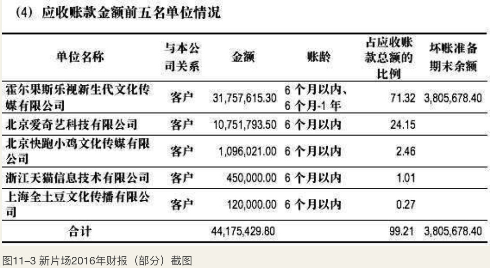

## 自媒体变现
从我个人的观察来看，自媒体的收益来源可以分为两种：流量变现和内容变现。前者将内容作为流量入口，基于流量进行后续的变现行为；后者将内容作为产品，借助内外部流量来推销内容。

### 变现入门：平台分成
流量变现的最初级形式就是依靠平台的分成实现收益，这也是原创实力较弱或者知名度不够的腰部账号的主要收入来源之一。

对于腰部账号，收入覆盖成本是必须考虑的运营问题。如果先期不考虑采取内容投放或付费运营的方式，单纯依靠内容从平台获取流量，那么主要的成本就是人力资源成本。

以每个编辑月收入10000元计算，再考虑五险一金和办公支出，对于公司来说，每个编辑的月成本在15000元左右。以每月20个工作日计算，那么每日每人需要至少创造出750元的收入，才刚够覆盖其人力成本。

问题就收敛为：这750元，从哪里来？

答案是一个简单的公式：

    分成收益 = 阅读量 ×CPM

根据发展阶段的不同，各平台对于千次阅读CPM的广告分成也不同，通常在0.5~5元的范围内波动。对于发展初期的平台，由于需要快速吸引作者入驻、实现内容覆盖和作者覆盖的目标，故通常采用平台高额补贴的方式进行刺激，作者能够获得的CPM通常较高，存在一定的溢价情况。

对于成熟阶段的平台，内部的流量分布和分成机制趋于稳定，外部的用户群体和社会知名度也达到一定量级，作者能够获得的CPM较为稳定，但是整体收入得益于流量规模，也相对稳定。

对优质的原创账号而言，除了分成收入外，还有来自各家平台的激励和扶持奖金。结合各家平台已经公布的计划，单个账号的月激励额度普遍在万元左右。

- 头条号：千人万元计划、礼遇计划（在原有收益基础上，头条号平台综合内容质量、原创度和数据表现，每月向100名创作者提供1万元奖励）
- 大鱼号：量子计划、大鱼计划（每期评选出超过1000名创作者获得万元奖金）
- 百家号：“百＋”计划（上榜作者有机会获得最高一万元的创作奖金）
- 企鹅号：芒种计划（100%的广告分成加原创补贴）
回归最开始的数学题，750元的日收入从哪里来？如果仅依赖平台分成，以CPM为1元来计算的话，那么每日需要获得75万次的全平台阅读量，单平台要保持十万次以上的规模。

### 内容分发的江湖客：做号者
#### 第一步：积攒账号
要想通过平台分成获利，首先需要有大批量的账号，通过多个账号的分成累积最后获得相对可观的收入。目前，内容平台对于账号注册的基础配置通常为：手持身份证验证 + 手机号码验证。

“手持身份证验证？太原始了，基本上通过‘在线搜索 + PS（图像处理）’的方式就可以绕过去。真正的大杀器是批量处理短信和银行卡。”老A不屑地说。

对于手机号码部分，我原本的认知如图12–1所示的机器，在一些测试平台也有广泛的应用。

孰料，真正让老A这样的做号者如虎添翼的是如图12–2所示的设备：猫池（ModemPool）。猫池是一种可以同时接入大量SIM卡（用户身份识别卡），模拟手机进行短信收发、语音拨打、流量上网的设备，在银行业、邮局、交易所券商等场景下有广泛的应用。图12–2中展示的就是64口的猫池，单机能够同时接入64张SIM卡，通过软件处理短信验证码。

“等等，手机SIM卡不是已经实名制了吗？为什么还有这么多SIM卡流出呢？”我追问道。

“喏。”老A指指路边的共享单车，“我们用的是那玩意儿。”
原来，这些用于接码的卡并非我们常用的手机SIM卡，而是我们提供给企业用于智能交通、物流管控的专项卡：物联网卡。我们生活中最为熟悉的共享单车摩拜与ofo，其用于定位和解锁的智能锁，就是通过物联网卡与服务端进行通信的。

与普通的SIM卡相比，物联网卡对于做号者的吸引之处在于：

- 零月租或者低月租，大多按照使用的流量进行付费。在某销售物联网卡的代理公司网站上，我查询到的价格是每100M 8元。
- 凭公司营业执照办理，可以一次性大批量办理。某些代理公司因追求业绩而疏于管理，可以在购买者没有营业执照的情况下，代办和代发物联网卡。
- 有语音卡和短信卡两种，前者可以双向接打电话和收发短信，而后者只能接收短信、价格更低廉。

老A向我展示了如图12–3所示的银行卡、身份证、网银U盾和手机卡，行话称为“四件套”，行情价在千元左右。考虑到目前有四五家比较大的提供分成的内容平台，只要单家平台月收入超过200元，一个月就能够收回投入成本。

#### 第二步：生产内容
在老A的团队里，批量内容生产分为两个步骤：背景调研和快速洗稿。

背景调研，是老A投入最大精力做的事情，主要用来确定平台内容创作的大方向，分为全网热点和平台特点两部分。

全网热点用来洞悉自身领域内部的用户需求，确定账号基调。老A通过“360趋势”来确定每个行业中的热门关键词和热门主题。以健身账号为例，通过搜索“健身”可以得知，与之高度关联的有“中老年健身与气功”“囚徒健身”“keep（一款具有社交属性的健身工具类产品）”“八段锦”等关键字，这些关键字共同确定了这个健身账号后续发文的基调。

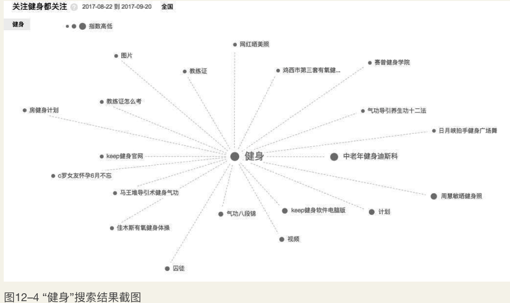

“只要所有内容围绕这些关键字开展，就不会太跑偏。”他说道，“我们这也算科学选题了。”

在选题确定之后，老A下一步确定的是平台的调性，看主题下的哪些文章适合这个平台。具体来说，就是在对应平台上搜索主题下的热门关键字，找到那些高阅读量、高评论量的内容标题进行拆分，以分析平台用户或平台分发机制的具体偏好。以搜索“八段锦”为例，高评论量的标题有：

- 八段锦健身有奇效，练习诀窍你掌握了吗？
- 健身气功八段锦视频教学口令版
- 1分钟学会八段锦

“这些标题的评论量高就说明读者是想学，那所有面向老年人的关于气功的内容都得围绕练习、学习、教学展开。算法分发是要让机器读懂的，标题就得把‘练习’‘口令’这些关键字都带上。”老A讲出了兴致，眼闪着光。

确定了领域热门主题和平台热门关键字之后，就进入了原稿选择和洗稿阶段。“这个简单，谁火选谁。”选择一篇领域内的高热内容作为框架，保持主题不变开始洗稿。关于洗稿的方式，老A总结出了三个“东西”法则：“东拉西扯、东拼西凑、指东骂西”。

- 东拉西扯：交代背景和关键字。比如要写八段锦，那就得介绍八段锦的背景，管它是野史还是正史，先摘抄几句再说。如果近来某个人物比较火，就捎带一句“某某也时常练习八段锦”。
- 东拼西凑：以原文为模板，在网上搜索与之相近的内容，每篇内容摘录一小段，和原文混在一起构成新的内容。拼凑出来的内容，读起来倒也还算通顺，还能够骗过市面上主要的消重软件。
- 指东骂西：在内容的结尾部分就该制造冲突了。谈论八段锦的内容，要么制造中西医之争，比如西医说八段锦纯属伪科学，没什么用处；要么制造中外之争，比如八段锦被拿去申请世界文化遗产了等。

三个“东西”法则下来，一篇火热的原文就已经被改得面目全非、难辨本来面目了。“剩下的就是配上好封面，起个好标题，看命了。”老A言道，最后又追加一句，“不过，我的命目前看起来好像都还不错。”

“一天产量能有多少？”我问道。

“比较有门槛的领域，一小时能洗四五篇；一般领域的内容，一天能洗30篇吧；要是娱乐科技的内容，一天我能洗出七八十篇。”

#### 第三步：变现探索
按照一个人一天30篇，每篇5000次的阅读量来计算，一个人一天的流量就有15万。同时分发在四个平台上，一个人一天能够有60万的阅读量。即使按照最低的CPM 0.5元计算，一个人一天也能够带来300元的收入，全月带来6000元营收。按照每人月工资4000元来计算，一个人能给老A带来的收入是2000元左右。

“一个人身上能赚2000元，你有多少人啊？”

“纠正一个问题，一个人身上能赚4000元。”老A说道，“我雇的可是清一色的大学生实习，开社会实践证明的那种。”

## 广告变现：品牌的溢价
平台广告分成和自己售卖内容软广的关系，就好比普通橙子和褚橙的销售，在曝光量不变的情况，自有品牌带来的收入溢价不止10倍。也正因为独自承接广告能够显著改善自媒体的收入情况，这也成了大多数原创账号努力的第一个节点目标。

二更COO（首席运营官）皮行早就在某次分享中提道：“内容即广告，广告即内容。用户看完这条内容不会产生反感，反而喜欢看这个广告。二更的营收来源中，超过70%来自商业视频原生广告的定制。”

“广告即内容”，这种内容原生广告的形式或许为自媒体实现广告销售与粉丝体验共赢提供了一条出路。

当一个自媒体能够独立承接广告后，它也正式从内容平台的投稿者转化成了利用内容平台进行流量分发的媒体角色。达到这一层次的账号，往往一个大单就能够覆盖一个月的成本。个中翘楚如公众号“咪蒙”，网传头条广告价格每则60万元，二条每则35万元更是令一般自媒体望尘莫及。

### 广告中介：是否是一门好生意
如前面章节中所提及的，由于目前各分发平台的信息化程度不够，使得中国的MCN公司很难像国外同行那样规模化地给海量创作者提供全面的服务（数据分析、平台运营、数字化投放、广告对接等）。自媒体服务中相对容易标准化的一环——广告对接就被抽离了出来，促成了更容易规模化的广告中间商生意。

广告中间商，做的是信息不对称的中介生意。一边是对预算精打细算的广告主难以找到匹配的自媒体，一边是没有足够知名度或单独招商无门的自媒体，广告中间商将两者对接并从中赚取中介费用，类似网盟的模式。如图12–10，即为微梦对自己模式的描述。

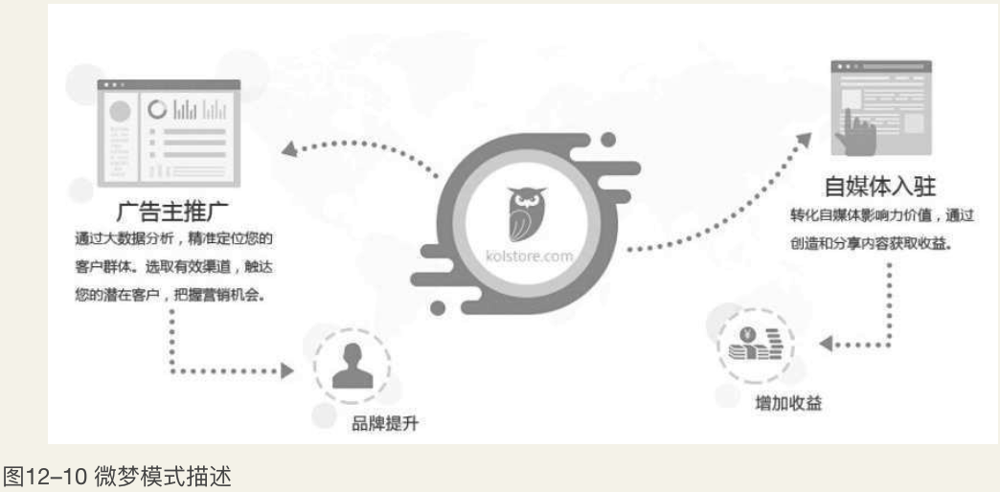

相对于独立广告中间商，平台从事广告中介业务，可以说存在碾压性的优势：在数据层面，它掌握着最真实、可信的自媒体分发数据和用户画像，只有官方才知道广告内容超过十万次的阅读量中哪些是真的，哪些是刷的；在流量层面，又直接掌握着平台内各种流量分发渠道。网上流传这样一种说法：如果不通过某平台自己的广告分发平台下单的话，那么自媒体在该平台的广告分发是很难有大流量的。

在数据与流量的双重优势下，当平台决定下水的时候，广告中间商的冬天，还会远吗？

何以过冬？投靠平台，垄断创作端，拥抱未知。

投靠平台：以天下秀为例，能获得平台的注资是最佳策略。背靠大树好乘凉，只要平台不倒，就能利用足够的信息优势和规则优势傲视群雄。

垄断创作端：除了自媒体官方之外，广告中间商可能是最了解自媒体数据的一群人了。利用自己的数据优势去发现早期自媒体，在其尚未出头之时便深度绑定变成长期发展最好的选择，这跟MCN的选择会比较类似。比如，微播易就自营和投资了大量微信公众号，火星文化也先后投资了青藤文化、雯思东方等账号。

拥抱未知：和自媒体内容蹭热点一样，广告中间商也需要持续地追热点。

- 追新的行业热点：比如，短视频火了，要第一时间支持短视频广告；移动直播热了，又要第一时间联合平台进行广告服务。
- 追新的平台热点：在新兴平台着力拓展主营分发业务的时候，是不太顾得上广告中介业务的，这就给了中间商窗口发展红利期。中间商可以复用其他平台的运营模式，快速绑定平台上的新作者，探索平台的变现可能。

### 自营电商：隔行如隔山
不甘于被媒体属性束缚的自媒体有更大的愿景，它们开始进一步深挖自己的流量价值和粉丝价值、提供附加服务，从而引出了流量变现的第三个阶段：自营电商。

简单地说，“平台分成→自营广告→自营电商”的进程可以理解为：

- 委托平台卖广告
- 自己来卖广告
- 给自己卖广告

### 自媒体电商问卷
#### 1. 内容与商品变现紧密度是怎样的？
客观上，不同的内容品类与商品变现的紧密程度是不一样的，有的品类离钱更近，有的离钱更远。你的内容品类，适合卖货吗？如果适合的话，适合卖哪些货？

从新榜和有赞共同提供的销售数据来看，文化类与育儿类公众号的内容转化效率最高。在有赞平台开店的头部大号中，文化类与育儿类的店铺数量仅占总店铺数量的24%，却斩获了71%的销售额，相当于1/4的店铺卖出了3/4的销量。而店铺数量较多的民生类与时事类大号，销售额却只占总销售额的1%。

内容与商品的关联性、商品本身的消费特点共同影响用户的消费决策，不恰当的选品往往会影响销售额。比如，各种自媒体都会尝试销售自身的周边产品（鼠标垫、纸袋、水杯之类），这类商品只能算用户的情怀充值，复购率较低。而一些标品，如数码3C产品、婴儿奶粉、纸尿裤等，用户更容易前往已有的电商平台消费，转化率较低。

#### 2. 短期收益预估如何？
自媒体销售商品，多用自己的内容进行商品内容的推送和介绍。因此，对打算尝试商品销售的自媒体来说，需要意识到这个推送位置本身是有价值的，应当比较商品内容与承接广告二者间收益的不同。

    商品内容利润=销量 ×利润－成本=（阅读量×购买转化率）×（客单价×毛利率）－（内容运营成本＋电商运营成本）
    广告内容利润= 收入－成本＝广告收入－内容运营成本

假如你的公众号已经能够承接单条6万元的广告了，如果销售客单价为100元、毛利率为30%的商品，就需要销售2000件才能在收入层持平。值得注意的是，在成本层，自媒体团队在实操过程中往往会忽视对电商运营成本的核算。比如售前咨询、售中资询、售后服务，这几项耗费人力的事情基本与销售量保持线性增长关系。

此外，上述公式只比较了单次销售的情况，自媒体如果缺乏持续稳定的SKU（库存量单位）建设，那么商品销售就会成“三天打鱼，两天晒网”，无法形成规模化效果。

通常，我们建议自媒体以类似淘宝客、京东客的方式切入，自己筛选、分发与淘宝、京东对应的商品，以降低电商部分的运营成本，先进行选品准确率、商品销售转化率的打磨与评估。经过多次销售行为，确认商品收入能与广告收入持平后，再去触探电商运营、销售链建设等复杂度更高的环节，试图在利润环节与广告持平。

#### 3. 电商团队的预估效果如何？
在验证了自身的商品变现能力后，自媒体团队就可以正式下场做电商了，从电商选品到电商内容编写再到售后服务，组建自己的电商团队。

首先要从选品环节切入，符合自身的调性是第一标准。自媒体需要从自身的粉丝构成和账号定位出发来进行商品的筛选，不能仅追求高大上，更要追求符合调性的购买转化。以科技自媒体“差评”为例，在其电商运营早期，选择了很多高大上的黑科技产品，不仅购买转化率不高，用户的反馈也逐渐变得冷淡。直到一款单价为40元的创意商品Sticker销售2000多件，才促使差评重新审视自己的选品策略。结合粉丝“18~25岁、70%为男性、集中在学生群体、多为互联网从业者和对科技感兴趣的人、消费力不强、相对理性”的特点，差评将自己的选品策略调整为新奇但客单价不高的“小黑科技”产品。赚钱当然也是另一大目标，但不刻意追求大品牌，以自己的内容品牌给产品价值背书，“小众、非标、贴牌”成了大量自媒体的选择。

选对了商品，还需要借助包装对内容进行推荐。同内容要追求点击率、分享指标一样，商品推介内容同样要求制作精良，考核阅读指标和购买转化指标。

商品选对了，内容包装好了，销售额上去了，自媒体就又迎来了甜蜜的新烦恼：客服电话响个不停，售前的商品咨询，售后的问题解答，物流配送的及时性等各种细枝末节的事情。哪个环节掉链子都会影响消费者的体验，造成掉粉。

#### 4. 供应链稳定度的预估效果如何？
对电商运营团队来说，进一步的压力来自供应链的稳定程度：生产、仓储、物流，哪个环节跟不上都够自媒体头疼的。如果说物流问题影响用户体验，仓储问题加剧成本负担，那么生产质量问题就扎扎实实地影响了品牌的公信力。

鉴于供应链的复杂度，有些自媒体选择“做轻”的模式，即只做选品，通过与供应商合作，交由供应商仓储发货。徐沪生认为，一碰库存就是巨大的成本。尽管一条2017年的销售额预估为10亿元，但目前公司仍然选择无库存的电商平台模式，库存、发货均由供应商负责。

### 典型案例：年糕妈妈
2016年年底，我参加了有赞4周年的年会，会上年糕妈妈CEO林威的发言让我得以一窥自媒体自营电商的门道。彼时，年糕妈妈的月销售额就已经稳定在5000万元左右了。援引年糕妈妈的自我剖析：

- 坚持良好的内容，其前50万粉丝是零推广费用，靠内容传播获取来的。
- 稳定的供应链，包括：自建仓库，全国有三个货仓，双十一支持发货60万件；建立跨境货仓，覆盖海淘业务。
- 1/3的独家代理产品，保证利润率。
- 自己造货，加速品牌变现过程，保证利润率。

会上，林威分享了这样一种观点：对于“内容电商”这一概念，电商才是主体，其商业逻辑的链条是“内容→粉丝→复购”的传导过程。在整个过程中，内容主要起到推广的作用，即内容好坏影响的只是电商的获客成本。但对电商来说，最看中的并非获客成本而是复购率。在复购环节，影响用户决策的就不仅仅是内容的阅读体验了，电商本身的下单、物流、客服体系同样重要。自媒体做电商最大的阻碍，不是缺懂内容、懂粉丝的文化人，而是缺懂货品、懂供应链的生意人。

## 内容付费
### 缘何付费，规模几何
#### 消费背景
为什么搬到线上后，内容付费可以有更大的想象空间？

第一，当然是服务体验的提升。

对图书杂志有购买意愿，对线下的讲座培训有购买意愿，对电影、话剧等娱乐形式有消费意愿，这充分说明用户对内容是有消费需求的。当内容从实体型或线下型转变为线上型的时候，其使用体验是有延展和增益的。

第二，小额付费、版权意识增强客观上完成了对用户群体的教育。

基于微信、支付宝的在线支付方式的便捷性是远胜往昔的，用户越来越习惯使用手机进行小额的、及时性的消费。随着版权市场的日趋规范，音乐会员、视频会员的付费规模日趋增长，对用户也是有正面教育意义的。

#### 消费意图
用户对内容的消费意图，分为功利性诉求和非功利性诉求。功利性诉求在于解决自己的问题，最突出的是各类型应试需求的课程（如考研培训、公务员考试培训等）；非功利性诉求是通过内容消费来满足自己的好奇心或达到对某个领域的初步了解甚至深度学习的目的。

通过考试，是刚需且反人性的，大部分人的应试准备过程都需要被督促。四六级培训、考研培训、公务员考试培训、专业考试培训等是功利性消费的典型，有着明确的消费预期和结果量化方式。

学知识，是刚需但需要自驱。比如，新手父母学习非暴力沟通、职场人士补习英语等，都是为了解决真实存在的问题。但是否能够学完，学完之后是解决了问题还是仅仅解决了焦虑感，就因人而异了。比如，我曾经付费英语流利说的半年课程，在对应的百人学员群里，能够完成整个学期课程的人，只有百分之三四的样子。

长见识，是非刚需，甚至可以归类为泛娱乐化消费的范畴。比如，听郎朗讲如何弹钢琴、听从业者讲OFO（线上线下融合）市场运营，更多是为开眼界；消费李翔商业周刊，更多是获取谈资。在这种场景下，用户不会有明确的结果预期（即需要收获什么），只要“大开眼界+不明觉厉”就已经很好了。

#### 消费决策
进一步地，用户是如何做出消费决策的呢？

核心还是一个字：值，即用户对内容的价值预期与内容价格相匹配。

价值预期的构成可以有很多种，比如内容本身的价值、主讲人的品牌价值、平台的品牌背书等。

内容本身的价值，最直接的体现是用户感知到内容消费是对自己有帮助的，可以迅速转化为产出。参考企鹅智库的调查数据：能提高工作效率或收入的知识和经验最被用户认可，有63.3%的人有意愿付费；有关职业与学业的发展建议，也达到将近四成的付费意愿。因而，内容产品“功利性”的包装成了不少知识出品方的选择：

- “好好说话”的定位是：“从沟通、说服、辩论、演说到谈判，教给用户一整套应付生活场景需求的话术。”
- 李笑来的“通往财富自由之路”，其定位更是直接体现在了专栏标题上。其主讲的主题为“一小时建立终生受用的阅读操作系统”的知乎Live，更是吸引了超过12万人的参与，刷新了知乎Live单场最多参与人数的纪录。

“功利化”的内容包装更容易促成付费，我们参看知乎上参与人数较多的直播，大多主打实用性的特点。

主讲人的品牌价值，市面上销售量较高的内容大多都在此列。罗永浩的“罗永浩的创业课”、李开复的“十堂人工智能课”、高晓松的“矮大紧指北”都可以说是主讲人自带流量光环的典范。

平台的品牌背书，如李翔、王煜全的专栏销售，尽管他们已经是各自行业中的翘楚，但是在大众内容消费市场的知名度并不高。马云、柳传志等大咖对李翔的背书，罗振宇对王煜全的力荐，以及“得到”早期对罗辑思维粉丝流量的依赖，都构成了对这些内容价值预期的背书。

#### 规模几何
第一种，与图书市场类似。图书消费同样有解决问题型和消遣型的诉求，与内容消费类似。此外，国人对于书籍的消费通常是购买而不是借阅，因而更有借鉴意义。2016年，我国图书市场规模为690亿元，扣除教辅（占比17%）和少儿读物（占比20%），剩余部分的市场规模约434亿元。

第二种，与视频网站付费会员类似。视频网站的会员付费行为大多是被独有或头部内容所驱动，从这个角度看与内容付费有一定的相似性。援引相关统计数据，2016年全网视频付费用户数约为7500万，规模达到96亿元；预计2017年全年付费用户将超过1亿，在ARPU（每用户平均收入）值保持不变的情况下，规模将达到128亿元。目前，大家普遍对视频付费会员市场保持乐观态度，预计未来还会有进一步的增长。

目前，得到、喜马拉雅、知乎三家的年营收额加起来乐观预估在30亿元以内；独立的头部IP，如樊登读书会、吴晓波频道等营收规模都刚刚过亿元；其他的内容IP营收多在千万元、百万元量级。
