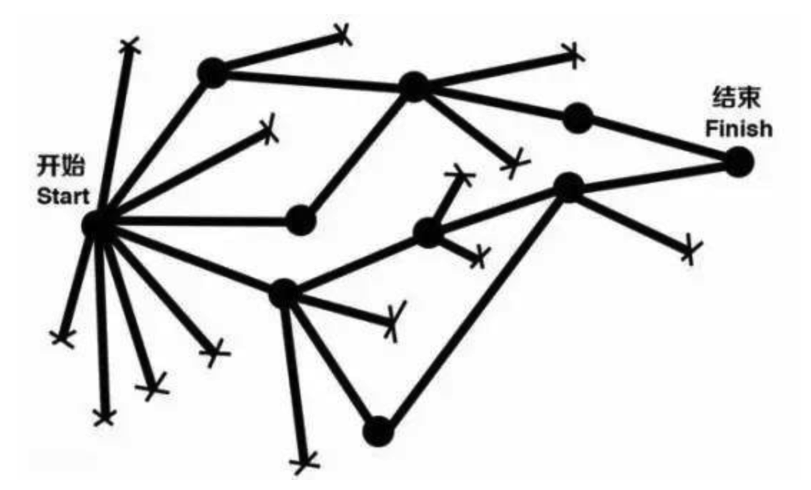

    作者: 黄有璨 
    出版社: 电子工业出版社
    副标题: 我的互联网运营方法论与自白
    出版年: 2016-9-1
    页数: 332
    定价: 59.00元
    装帧: 平装
    ISBN: 9787121298097

[豆瓣链接](https://book.douban.com/subject/26873486/)

- [第1章 运营是什么？](#%E7%AC%AC1%E7%AB%A0-%E8%BF%90%E8%90%A5%E6%98%AF%E4%BB%80%E4%B9%88)
  - [经典意义上的4大运营模块](#%E7%BB%8F%E5%85%B8%E6%84%8F%E4%B9%89%E4%B8%8A%E7%9A%844%E5%A4%A7%E8%BF%90%E8%90%A5%E6%A8%A1%E5%9D%97)
  - [在互联网公司内，“运营”与“市场”的区别与关联](#%E5%9C%A8%E4%BA%92%E8%81%94%E7%BD%91%E5%85%AC%E5%8F%B8%E5%86%85%E8%BF%90%E8%90%A5%E4%B8%8E%E5%B8%82%E5%9C%BA%E7%9A%84%E5%8C%BA%E5%88%AB%E4%B8%8E%E5%85%B3%E8%81%94)
- [第2章 运营之“光”](#%E7%AC%AC2%E7%AB%A0-%E8%BF%90%E8%90%A5%E4%B9%8B%E5%85%89)
- [第3章 运营的一些核心技能&工作方法](#%E7%AC%AC3%E7%AB%A0-%E8%BF%90%E8%90%A5%E7%9A%84%E4%B8%80%E4%BA%9B%E6%A0%B8%E5%BF%83%E6%8A%80%E8%83%BD%E5%B7%A5%E4%BD%9C%E6%96%B9%E6%B3%95)
  - [关于内容的运营](#%E5%85%B3%E4%BA%8E%E5%86%85%E5%AE%B9%E7%9A%84%E8%BF%90%E8%90%A5)
    - [3.3.1 内容的定位、调性和基本原则](#331-%E5%86%85%E5%AE%B9%E7%9A%84%E5%AE%9A%E4%BD%8D%E8%B0%83%E6%80%A7%E5%92%8C%E5%9F%BA%E6%9C%AC%E5%8E%9F%E5%88%99)
    - [3.3.2 UGC型的内容生产生态如何持续？](#332-ugc%E5%9E%8B%E7%9A%84%E5%86%85%E5%AE%B9%E7%94%9F%E4%BA%A7%E7%94%9F%E6%80%81%E5%A6%82%E4%BD%95%E6%8C%81%E7%BB%AD)
    - [3.3.3 PGC型的内容生产生态如何持续？](#333-pgc%E5%9E%8B%E7%9A%84%E5%86%85%E5%AE%B9%E7%94%9F%E4%BA%A7%E7%94%9F%E6%80%81%E5%A6%82%E4%BD%95%E6%8C%81%E7%BB%AD)
      - [（一）如何写出好的、用户爱看爱传播的单篇内容？](#%E4%B8%80%E5%A6%82%E4%BD%95%E5%86%99%E5%87%BA%E5%A5%BD%E7%9A%84%E7%94%A8%E6%88%B7%E7%88%B1%E7%9C%8B%E7%88%B1%E4%BC%A0%E6%92%AD%E7%9A%84%E5%8D%95%E7%AF%87%E5%86%85%E5%AE%B9)
      - [（二）如何长期保证PGC内容体系的供应能力和做好长期内容规划？](#%E4%BA%8C%E5%A6%82%E4%BD%95%E9%95%BF%E6%9C%9F%E4%BF%9D%E8%AF%81pgc%E5%86%85%E5%AE%B9%E4%BD%93%E7%B3%BB%E7%9A%84%E4%BE%9B%E5%BA%94%E8%83%BD%E5%8A%9B%E5%92%8C%E5%81%9A%E5%A5%BD%E9%95%BF%E6%9C%9F%E5%86%85%E5%AE%B9%E8%A7%84%E5%88%92)
    - [3.3.4 如何思考内容的“组织”与“流通”？](#334-%E5%A6%82%E4%BD%95%E6%80%9D%E8%80%83%E5%86%85%E5%AE%B9%E7%9A%84%E7%BB%84%E7%BB%87%E4%B8%8E%E6%B5%81%E9%80%9A)
      - [（一）内容的组织](#%E4%B8%80%E5%86%85%E5%AE%B9%E7%9A%84%E7%BB%84%E7%BB%87)
        - [1.单篇内容的组织&标准建立](#1%E5%8D%95%E7%AF%87%E5%86%85%E5%AE%B9%E7%9A%84%E7%BB%84%E7%BB%87%E6%A0%87%E5%87%86%E5%BB%BA%E7%AB%8B)
        - [2.相关内容的聚合](#2%E7%9B%B8%E5%85%B3%E5%86%85%E5%AE%B9%E7%9A%84%E8%81%9A%E5%90%88)
        - [3.整体内容的导览和索引](#3%E6%95%B4%E4%BD%93%E5%86%85%E5%AE%B9%E7%9A%84%E5%AF%BC%E8%A7%88%E5%92%8C%E7%B4%A2%E5%BC%95)
        - [4.核心拳头内容的呈现](#4%E6%A0%B8%E5%BF%83%E6%8B%B3%E5%A4%B4%E5%86%85%E5%AE%B9%E7%9A%84%E5%91%88%E7%8E%B0)
      - [（二）内容的流通](#%E4%BA%8C%E5%86%85%E5%AE%B9%E7%9A%84%E6%B5%81%E9%80%9A)
        - [1.对内流通的常见做法](#1%E5%AF%B9%E5%86%85%E6%B5%81%E9%80%9A%E7%9A%84%E5%B8%B8%E8%A7%81%E5%81%9A%E6%B3%95)
        - [2.对外流通的常见做法](#2%E5%AF%B9%E5%A4%96%E6%B5%81%E9%80%9A%E7%9A%84%E5%B8%B8%E8%A7%81%E5%81%9A%E6%B3%95)
  - [3.4 转化型文案的常见写作方法](#34-%E8%BD%AC%E5%8C%96%E5%9E%8B%E6%96%87%E6%A1%88%E7%9A%84%E5%B8%B8%E8%A7%81%E5%86%99%E4%BD%9C%E6%96%B9%E6%B3%95)
    - [（一）什么是转化型文案](#%E4%B8%80%E4%BB%80%E4%B9%88%E6%98%AF%E8%BD%AC%E5%8C%96%E5%9E%8B%E6%96%87%E6%A1%88)
    - [（二）短文案的写作](#%E4%BA%8C%E7%9F%AD%E6%96%87%E6%A1%88%E7%9A%84%E5%86%99%E4%BD%9C)
    - [（三）中长型文案的写作](#%E4%B8%89%E4%B8%AD%E9%95%BF%E5%9E%8B%E6%96%87%E6%A1%88%E7%9A%84%E5%86%99%E4%BD%9C)
      - [方法1](#%E6%96%B9%E6%B3%951)
      - [方法2](#%E6%96%B9%E6%B3%952)
      - [方法3](#%E6%96%B9%E6%B3%953)
  - [3.5 为何说“标题党”和“段子手”们都很难成为内容领域的顶尖高手？](#35-%E4%B8%BA%E4%BD%95%E8%AF%B4%E6%A0%87%E9%A2%98%E5%85%9A%E5%92%8C%E6%AE%B5%E5%AD%90%E6%89%8B%E4%BB%AC%E9%83%BD%E5%BE%88%E9%9A%BE%E6%88%90%E4%B8%BA%E5%86%85%E5%AE%B9%E9%A2%86%E5%9F%9F%E7%9A%84%E9%A1%B6%E5%B0%96%E9%AB%98%E6%89%8B)
    - [（一）](#%E4%B8%80)
    - [（二）](#%E4%BA%8C)
    - [（三）](#%E4%B8%89)
    - [（四）](#%E5%9B%9B)
    - [（五）](#%E4%BA%94)
    - [（六）](#%E5%85%AD)
    - [（七）](#%E4%B8%83)
    - [（八）](#%E5%85%AB)
  - [3.6 关于撬动用户互动参与意愿的8个指导原则](#36-%E5%85%B3%E4%BA%8E%E6%92%AC%E5%8A%A8%E7%94%A8%E6%88%B7%E4%BA%92%E5%8A%A8%E5%8F%82%E4%B8%8E%E6%84%8F%E6%84%BF%E7%9A%848%E4%B8%AA%E6%8C%87%E5%AF%BC%E5%8E%9F%E5%88%99)
    - [3.6.1 8个指导原则详述](#361-8%E4%B8%AA%E6%8C%87%E5%AF%BC%E5%8E%9F%E5%88%99%E8%AF%A6%E8%BF%B0)
- [第4章 运营的一些宏观规律和逻辑](#%E7%AC%AC4%E7%AB%A0-%E8%BF%90%E8%90%A5%E7%9A%84%E4%B8%80%E4%BA%9B%E5%AE%8F%E8%A7%82%E8%A7%84%E5%BE%8B%E5%92%8C%E9%80%BB%E8%BE%91)
  - [4.1 运营背后的客观规律：从“层次感”到“非线性”](#41-%E8%BF%90%E8%90%A5%E8%83%8C%E5%90%8E%E7%9A%84%E5%AE%A2%E8%A7%82%E8%A7%84%E5%BE%8B%E4%BB%8E%E5%B1%82%E6%AC%A1%E6%84%9F%E5%88%B0%E9%9D%9E%E7%BA%BF%E6%80%A7)
  - [4.3 如何结合产品业务类型规划运营路径？](#43-%E5%A6%82%E4%BD%95%E7%BB%93%E5%90%88%E4%BA%A7%E5%93%81%E4%B8%9A%E5%8A%A1%E7%B1%BB%E5%9E%8B%E8%A7%84%E5%88%92%E8%BF%90%E8%90%A5%E8%B7%AF%E5%BE%84)
    - [（一）商业逻辑](#%E4%B8%80%E5%95%86%E4%B8%9A%E9%80%BB%E8%BE%91)
    - [（二）典型用户行为频次](#%E4%BA%8C%E5%85%B8%E5%9E%8B%E7%94%A8%E6%88%B7%E8%A1%8C%E4%B8%BA%E9%A2%91%E6%AC%A1)
    - [（三）用户间是否通过产品结成某种关系](#%E4%B8%89%E7%94%A8%E6%88%B7%E9%97%B4%E6%98%AF%E5%90%A6%E9%80%9A%E8%BF%87%E4%BA%A7%E5%93%81%E7%BB%93%E6%88%90%E6%9F%90%E7%A7%8D%E5%85%B3%E7%B3%BB)
- [4.4 如何搭建一款成熟产品的运营体系？](#44-%E5%A6%82%E4%BD%95%E6%90%AD%E5%BB%BA%E4%B8%80%E6%AC%BE%E6%88%90%E7%86%9F%E4%BA%A7%E5%93%81%E7%9A%84%E8%BF%90%E8%90%A5%E4%BD%93%E7%B3%BB)
- [4.5 理解社区/社群的典型运营路径和逻辑](#45-%E7%90%86%E8%A7%A3%E7%A4%BE%E5%8C%BA%E7%A4%BE%E7%BE%A4%E7%9A%84%E5%85%B8%E5%9E%8B%E8%BF%90%E8%90%A5%E8%B7%AF%E5%BE%84%E5%92%8C%E9%80%BB%E8%BE%91)

## 第1章  运营是什么？
### 经典意义上的4大运营模块
就目前而言，互联网行业内相对比较有一致共识的4大运营职能划分是：内容运营、用户运营、活动运营和产品运营。

- 内容运营
    - 内容运营这样一个分支，其实核心要解决的问题是：围绕着内容的生产和消费搭建起来一个良性循环，持续提升各类跟内容相关的数据，如内容数量、内容浏览量、内容互动数、内容传播数等。
- 用户运营
    - 跟内容运营相似，所谓用户运营这样一个分支，其实核心要解决的问题，也是围绕着用户的新增—留存—活跃—传播以及用户之间的价值供给关系建立起来一个良性的循环，持续提升各类跟用户有关的数据，如用户数、活跃用户数、精英用户数、用户停留时间等。
- 活动运营
    - 至于活动运营，核心就是围绕着一个或一系列活动的策划、资源确认、宣传推广、效果评估等一系列流程做好全流程的项目推进、进度管理和执行落地。
- 产品运营
    - 所谓产品运营，其实要做的事情，就是通过一系列各式各样的运营手段（比如活动策划、内外部资源拓展和对接、优化产品方案、内容组织等），去拉升某个产品的特定数据，如装机量、注册量、用户访问深度、用户访问频次、用户关系对数量、发帖量等。

### 在互联网公司内，“运营”与“市场”的区别与关联
市场所做的一切，都应该瞄准着扩大品牌、产品的用户认知和提升产品的无形价值，比如，发了一篇介绍品牌的软文，被浏览了10万次，但没有形成任何转化，这个事情在市场的角度来看，是有意义的——这确保了这10万个看到文章的用户在下一次具体触碰到可能会使用你产品的场景时，有更大的可能性会想到你。

而运营所做的一切，都应该瞄准着具体的用户使用场景或转化场景，所做的一切，也更多都是引导和铺垫，最终目的也往往是为了更好地实现用户转化，提升具体的产品数据。

如果要更宏观地讲，其实我们可以把“运营”理解为：为了要连接好产品和用户，你可能会使用的一切手段。基于这个层面来理解的话，概念层面的“运营”应当是要大于“市场”的。

## 第2章  运营之“光”
一般来讲，所有的工作都可以归类到以下两种属性中去：

- 纯粹的职能支持类工作；
- 目标导向类工作。

前一种创造的价值感很低，但后一种创造的价值感则会越来越高。

其实初级选手和中高级选手们的一个显著差别，往往就是初级选手只会被动做事情，或者是在方向不明的情况下纯靠拍脑袋去行动，但中高级选手们，一定要把事情想清楚，找到目标和更容易有所产出的地方，才会开始投入执行。

这两种状态之间的对比，有点像下面这两张在网上被传得很火的图。

而最终，你也会发现，运营工作中的很大一个组成部分就是如何通过不断思考、判断和执行，找到投入产出比较优的路径和方法，来达成你想要的结果。

做运营，我建议大家不要只单纯关注为了关注业绩、结果和转化去做那种“竭泽而渔”的运营。好比你要强推个啥东西，就满世界各种群里去发，且还老这么干，就是典型的竭泽而渔。

相对更好的方式，可能是考虑下这个东西的潜在价值，比如同样是一个活动，适合谁参加不适合谁参加，具体可能解决什么问题，都提前讲清楚，再给出些个人立场上中肯的建议，就会好一点。

好比我和朋友们创办的三节课到2016年上半年为止，居然可以拥有超过100个来自于各大互联网公司的志愿者，也是基于相似的逻辑。这些志愿者们对我们的感觉，大致是如下这样的：

>既然你们已经拿出了足够的诚意和时间来做好你们的课程和内容，且我们感受得到这种用心，那么我们愿意无条件喜欢你们、帮助你们，跟你们来一起做点儿性感、好玩、有价值的事。

这样的逻辑，其实是一种“回报后置”式的逻辑。它更加强调我们专注于给用户创造价值，并相信，当你创造的价值足够多的时候，用户一定会愿意给予你无条件的认可和回报，且这种回报，有时甚至会超出你的预期。

你会发现，包括众筹、打赏等在内的很多近一两年开始从互联网衍生并普及开来了的模式，背后的核心逻辑，都是这种“回报后置”式的。

但，说起来容易，真正做起来，除非你真的可以发自内心地相信，以一种“回报后置”式的理念和方式去做事，最终真的可以带来超乎你想象的回报，并彻底践行之。否则，仍然没有任何意义。

然而，只关注当前利益的老板并没有听。再然后，那款产品很快就死了。

把我可能得到的潜在回报先丢到一边，而是只专注于为用户们去创造出来一些令他们惊喜的价值，真正把你的用户作为你身边真实的朋友来对待——这样的行事方式终会为你赢得更多的回报。

我一直认为，一个真的能够依靠一个人撬动起成千上万用户们的强烈认同和参与的运营，是必须要具备点儿“回报后置”式的意识和行事风格的。

## 第3章  运营的一些核心技能&工作方法
### 关于内容的运营
#### 3.3.1  内容的定位、调性和基本原则
三节课是一个只关注产品与运营的、有温度的微信公众号。

我们希望三节课这个微信公众号可以具备的标签以及我们对其进行拆解落地的逻辑就会是这样。

- 原创。我们的内容90%以上都是原创。
- 有实例。我们60%以上的内容都是真实的产品&运营案例分析、评论和方法论输出。
- 有态度。我们总会在我们的内容中持续强调和输出以下几个态度——“言胜于行”、“不性感，毋宁死”、“唯有爱与用户不可辜负”。
- 有情趣。我们时而会有10%～20%的搞笑趣味内容。
- 有温度。我们偶尔还会有点人文关怀式的内容。

你的定位和调性已经特别明确了，那么在内容运营的链条上，可能起码还有3个“点”是需要关注和各个击破的。

这3个点，一曰内容的生产，二曰内容的组织和包装，三曰流通。

1. **好的内容往往都是有自己的主线的，当然了，类似散文、诗这样的东西除外**。这个主线，如果是论述型或观点型的内容，那就是观点和论据是否清晰；如果是叙事性的内容，那就是故事脉络是不是清楚（可能以时间为主线，也可能以人物、地点为主线等，但一定需要有一个主线）；如果是盘点总结性的内容，那就是其盘点框架（比如分成几个维度等）是否全面清晰。框架清晰的内容，更易于用户的消费和理解。
2. **在一篇内容中，逻辑较复杂或需要对比或需要传递某种特别感觉的部分，需要尽量用图表或图文的方式来表现**。
3. 好的内容往往是围绕着用户的感知来进行表达和叙述的，这会让你的内容对用户而言是易读的。所以，但凡想要抛出一个生僻概念或结论希望获得用户认可的时候，一定要通过大量事实型的描述来做好铺垫和引导。

#### 3.3.2  UGC型的内容生产生态如何持续？
我们来看一下一个UGC社区的典型内容生产通路（注意，这里只关注生产），应该讲，几乎所有UGC产品从初始到逐渐成熟的内容生产通路，都是符合这个逻辑的。

- 第一个环节，是内容初始化。
    - 简单说，当你新上线了一个UGC的产品，这个产品最初一定是什么也没有的，所以，你能想象一个什么也没有、看起来一点人气也没有的产品会有用户愿意进来玩吗？因而，为了能够让这个产品对用户还能有点儿吸引力，你要做的第一步就是先往里灌点儿东西，让它看起来先能有点儿人气。
- 第二个环节，叫作少量用户加入生产。
    - 氛围铺垫好了，你总得需要一些有能力生产优质内容的人迈出第一步，去开始在这个你搭建的氛围下玩耍和生产内容。
    - 而，这批吃螃蟹的人，往往是不可能从天而降的，他们需要你去邀请和私下做大量的沟通，才会过来。且理论上这批人如果本身就是一批意见领袖或小圈子里的名人，会更容易形成标杆效应，带动更多人加入社区。
- 第三个环节，叫作内容生产者激励。
    - 简而言之，你在第二步搞定的那些用户，如果想要让他们愿意长期留下来玩和贡献内容，你总需要让他们有一些动因。好比说，这里能让他们得到更大的影响力，这里能让他们得到更多的存在感和被关注感，这里能让他们得到更多物质激励，这些都可以成为他们留下来的动因。全看你的团队和社区氛围更适合哪一种。
- 第四个环节，是更多新用户进入。
    - 这一步，你要做的事就是把社区内已有的优质内容尽可能地输送到外部形成传播，同时也借助其他一些手段来带动用户数的增加。
- 而第五个环节，则是鼓励和引导更多用户加入生产。这里可做的事又有以下几个维度。
    - 一是在产品和文案等各种层面加强引导。
    - 二是不断制造话题，借助话题来引发用户参与的意愿。
    - 三是要通过“造典型、树标杆”的方式来为用户树立榜样。

#### 3.3.3  PGC型的内容生产生态如何持续？
##### （一）如何写出好的、用户爱看爱传播的单篇内容？
首先，就单篇内容来说，其实也是存在一个小的生产流程的，大概有四个步骤：

>选题策划→资料收集&整理→内容加工生产→内容组织&呈现

首先是**选题策划**，这可能是整个内容生产流程中权重最高的一个环节。很多时候，选题和策划做得好不好，可能就已经决定了一篇内容60%以上的命运。

- 我的第一个方法，就是要学会收集灵感。
    - 对我而言，灵感的来源主要源自于以下几种场景：阅读、与人交谈、独自思考、得到某些特殊经历后的触动。我所养成的一个极好的习惯是：每当灵感出现时，我总会第一时间把它记录下来，至于记录的工具，通常是手机。而记录到什么程度，则自己判定，有时可能只是记一个主题就可以，有时则要记下来更多具体的素材。
    - 记录下来的部分，在我的机器里大概长这个样子，你看到的下面这整个列表，都是我所收集下来的灵感。这些我随时记录下来的灵感，将来既可能单独成为一篇文章，也很可能成为我撰写某篇文章的素材。
- 我的第二个方法，就是先明确**内容框架**，再逐次填充细节。这个方法可以让你的写作变得更顺畅。我个人的写作内容类型主要分两种：一种是说明议论型，或者叫作**归纳型**内容；另一种则是讲故事型，也可以叫作**演绎型**内容。
    - 归纳型的内容，往往是高度结构化的，你通常需要围绕着某一个或某几个中心点从几个不同的方面来进行阐述，所以，你可以先把相应内容的逻辑框架搭建出来，它通常会呈现一种类金字塔状的结构（即多个分支论点支撑一个核心论点）。
        - 比如，下面就是我在写作本书的引言“为什么我觉得互联网的下一个时代将是运营驱动的？”时拟定出来的大致内容逻辑框架，这样清晰的结构其实往往会更易于用户理解。
        - 
    - 而演绎型的内容，往往更强调内容情节的转折起伏和细节的刻画。虽然从内容结构来说它没那么层次分明、逻辑清晰，但即便是故事演绎，也需要一条故事主线，所以你仍然可以把故事的主线或主要情节先梳理出来，然后再逐次去把每一个情节润色得足够精彩生动。
        - 比如，下面就是我们在写作“老板让我3天内搞出来一个有爆点的NB活动，于是……”这篇故事性内容的时候拟定的大体故事情节框架。
        - 

要知道，用户阅读你的内容，也是会慢慢形成一些特别的认知和阅读习惯的，假如你的编排风格动不动就更改，其实是在给用户增添阅读烦恼。

##### （二）如何长期保证PGC内容体系的供应能力和做好长期内容规划？
在一个PGC的体系下，所有内容生产者都应该对你而言是相对可控的，所以，你只需要把内容生产任务逐层分解拆分下去落实到人，再通过相应的机制和手段确保内容可以被按期生产出来就好了。

举个例子，三节课公众号就是一个典型的PGC内容的生产体系，它的内容定位和调性我们之前已经说过了，大概是如下这样的。

- 原创。我们的内容90%以上都是原创。
- 有实例。我们60%以上的内容都是真实的产品&运营案例分析、评论和方法论输出。
- 有态度。我们总会在我们的内容中持续强调和输出以下几个态度——“行胜于言”、“不性感，毋宁死”、“唯有爱与用户不可辜负”。
- 有情趣。我们时而会有10%～20%的搞笑趣味内容。
- 有温度。我们偶尔还会有点人文关怀式的内容。

假如你的PGC内容生产源是签约作者，可能你还需要辅以机制约束，物质激励，人肉跟进陪聊、施压、心灵关怀、压力排解等一系列软硬兼施的手段……

#### 3.3.4  如何思考内容的“组织”与“流通”？
##### （一）内容的组织
###### 1.单篇内容的组织&标准建立
在这个层次上，常用的手段，是对于内容的样式、构成等进行一系列标准化的约束，通过这些约束让你的内容整体风格、阅读体验看起来更一致、更有识别度，质量更有保障，甚至让内容生产的效率更高。

例如，豆瓣在过去10年里始终如一地保持着全站内容都必须是接近于宋体10号字、单倍行距的“豆瓣体”，在字体、字号、行距等方面均不允许用户进行任何更改，正是依靠这样的约束，豆瓣的内容识别度和阅读体验才10年来始终得以保持一致。

###### 2.相关内容的聚合
在这个层次上，常用的手段有专题、话题、相关推荐、精选等。总之，就是找到一个中心点，去把N多单篇的内容组织聚合到一起，然后整体打包并推送展现给用户，由此放大整体内容的价值。

###### 3.整体内容的导览和索引
如果说前两个层次瞄准的都仍然是一个短期、单点的问题，到了这个层次，我们就需要带着更多长期、整体的视角来思考问题了。

简单说，当你的内容基数已经足够大了之后，用户的访问行为很可能将不再是一种“我给你推送啥你就消费啥”的被动行为，而更多会成为一种“我想自己来找点儿我想要的东西”的主动行为。此时，我们必须要在内容的组织方面更多考虑如何更好地迎合用户的这种主动访问行为。

在这个层次下，我们常用的手段包括分类、搜索导引、优先推荐机制、信息流等。

这里我们可能要先界定一下，即便是主动访问式的内容消费行为，也会再细分为两类。一是“闲逛”式的，即用户在访问时可能没什么特定的目的，就是为了打发消磨时间，就想随意看看。二是“目的导向”式的，即用户在访问时就是为了解决某个特定的问题，或者就是为了查询某个特定资料。

如果你在负责的是一款内容型产品，你可能需要先界定清楚，大多数情况下，你的用户访问行为，到底更接近于以上两类中的哪一类呢？因为围绕着这两种行为，我们的整体内容组织解决方案可能是不一样的。

比如说，围绕着用户 **“闲逛”式** 的行为，我们的内容组织解决方案可能比较适合通过信息流这种可以随意刷新、随机获取信息的方式，或者比较突出热门话题、官方推荐、最新最热等内容的方式。这样的方式，重在可以让用户以较小的成本获取到一些能够给自己带来刺激或价值的内容。

而围绕着用户 **“目的导向”式**的行为，我们的内容组织解决方案则可能更适合通过分类、加强搜索体验和导引等方式。这样的方式，重在给予用户一条明确的路径和查询线索，来帮助用户可以更高效地找到自己想要的内容。

###### 4.核心拳头内容的呈现
就像我们之前提到的，任何一款内容型产品，都需要让自己的内容具备特定的调性、风格和用户识别度。而在你的内容绝对数量比较多的时候，你尤其需要在用户第一次访问你的产品时，把这种特定的调性和识别度传递给用户，让他们能够记住你。

而在这个部分，常用的手段比如通过站内Banner，各种核心推荐位甚至浮层、弹窗等，把你最具有代表性的内容呈现给用户。

##### （二）内容的流通
这里简单解释一下，所谓 **“内容的流通”**，就是当你已经有了一定数量的内容后，你可能需要考虑以某种方式让你已有的内容可以流动起来，通过流动令之展现在用户面前，从而让用户可以发现和消费它。

内容的流通，又有两个维度。

- 一是对内的流通，即在你本身的产品内部，内容可以如何更好地流通起来并与用户形成匹配。
- 二是对外的流通，即如何通过一些机制或手段，让我们站内已有的内容可以流通到外部平台去（如微博、朋友圈），带来内容的传播和用户转化。

###### 1.对内流通的常见做法
- 内容运营人员的人为干预和组织
- 算法的智能推荐
- 依靠用户关系和用户行为

###### 2.对外流通的常见做法
这里也有两种做法。一是通过产品机制、运营手段等鼓励用户自发地把一些优质内容分享到外部第三方平台。二是依赖于运营人员主观挑选一部分优质内容，将其分享到第三方平台，并获取到更多人的关注。

### 3.4  转化型文案的常见写作方法
#### （一）什么是转化型文案
所谓转化型的文案，就是这个文案的目的是特定的，它被写出来的唯一意义，就是要引导用户完成某个特定行为，俗称一次转化。

#### （二）短文案的写作
短文案的写作，典型的比如标题，我们在此也主要以标题为例。

而，要把短文案写得达到及格分以上，能带来比较好的转化率，其实并不太需要多么高超的写作技巧和华丽的辞藻，只需要懂得一点点写作原则，再找到合适的写作切入角度，再用人都能听懂的大白话表达出来，就足够了。

最简单通俗的可以提升短文案转化率的两个原则，是：

第一，**傍大款**。即，有意识地跟某些明显势能更高、影响力更强的人或事物形成关联，通过关联者更高更强的影响力刺激用户的点击访问意愿。这个方法，尤其适用于你要推送的这个东西的知名度和影响力可能还不足以刺激到用户的时候。

第二，**颠覆认知**。即，有意识地抛出某些可能会颠覆用户常识性认知，甚至有点儿不可思议的观点或言论，从而引发用户的好奇心，借此撬动用户的点击访问意愿。

#### （三）中长型文案的写作
中长型文案，往往至少一两百字，内容信息量会更大，不比普遍20字以内解决问题的短文案，突出重点，能迅速在一两个点上撬动用户兴趣就好。

所以，中长型文案可能需要讲一点点逻辑和内容结构，通过一点一点的信息外露，逐步把用户的兴趣和欲望烘托勾引起来，并最终形成转化。

##### 方法1
方法1其实是一种文案写作结构和递进逻辑，参见下图。

简而言之，在一个中长型文案中，我们需要先有一部分内容引起用户的注意，再逐步激发起他的兴趣，勾起其欲望，最后促成用户行动，带来转化。

##### 方法2
方法2也是另一种略有不同的文案写作结构，参见下图。

在这种逻辑下，我们往往会以一个故事的方式把用户代入某个情景，然后围绕着这个情景制造出某些关键矛盾，引起用户的好奇，再基于这些矛盾提出关键问题，最后顺水推舟，把问题的解决方案推送给用户。

##### 方法3
中长型转化文案的第三种写作方法，就比较简单了。它的逻辑是：把用户在一个转化行为前可能会面临和思考的所有问题都依次列出来，然后一一对问题进行解答和说服用户。

### 3.5  为何说“标题党”和“段子手”们都很难成为内容领域的顶尖高手？
#### （一）
常见的辛苦的“内容运营”，现在基本又分为两拨人，一拨类似网站编辑，每天审稿、选稿、组稿、各种Ctrl+C&Ctrl+V，他们往往对网站流量、PV等数据负责。

另一拨人则是我们现在常说的“新媒体运营”，他们往往管着一个微信公众号，每天满世界各种转载，各种编段子修图追热点，他们往往对微信公众号粉丝数、阅读数等负责。

这两群人存在着一个共有的尴尬：

他们总是会被老板天天拿着大棒在后面要KPI，因为KPI的存在，导致他们当中的大部分人很多时候做的事情是机械化的，甚至是忽略内容价值而强奸用户式的（例如，给某篇屎一样的内容取一个博人眼球的标题），这导致他们往往没什么成就感，并且特别迷茫，不知道自己的价值和未来在哪里。

再具体一点讲，我认为大部分内容岗位从业者们面临的核心问题都是：

他们几乎都只会基于短期来考虑我可以在内容上玩点什么小花样或小技巧，以让其可以有助于我短期数据指标的拉升，而很少有人能够真正静下心来想想自己在做的内容长期而言对于用户有何价值。

#### （二）
在过去很长一段时间里，内容在互联网的世界中都是被人视作一种手段而存在的，而很少被人视作目的。就像上面说的，我们更在乎内容如何能迅速给我们带来更多流量，而并不太愿意去考虑和关注内容本身的长期价值。

举个例子，在过去十几二十年里，人们消费内容的核心入口，其实有两个，一是搜索，二是内容门户。

#### （三）
然而，到了今天，形势却正在发生着变化——你会发现，内容的价值正在回归。

你会发现，今天人们消费内容的入口，慢慢已经从百度变成了朋友圈或知乎这样的地方，这个事和SEO开始不存在关系了。相反，决定你的内容能不能被更多人消费的，是你的内容是否能够得到更多人的转发和推荐。

换句话说，内容本身的价值、打动力，与内容的传播、用户消费几率等，已经越来越合一了，用户在内容面前的话语权越来越大，而不再是渠道。一个内容能不能火，本质上越来越取决于用户是否愿意认可它、传播它，而不是核心渠道是否能够推荐它。

内容价值的回归，给了那些有能力做好内容的人一个机会——今天，人们真的是有可能仅仅只通过持续的优质内容输出来给自己建立起强大的影响力，让自己变得很牛、很强大。

#### （四）
首先，我相信内容本身的最大力量在于其通过持续内容输出面向用户构建起来的某种强烈的“信任感”。

#### （五）
第二，我相信，内容的核心打动力，往往来自于内容生产者不同于他人的、极度细致入微和深度的经历、体验和思考。

#### （六）
第三，我相信，你应该把你的内容当作一种“与读者交朋友”的形式。

若是面向朋友做内容，你也应有伦理。

所谓伦理，核心只有一点：跟你从认识一个朋友到愿意无保留地相信他是漫长的过程一样，也要相信通过内容来与用户建立信任是一件长期的事情，所以在内容面前，凡事不妨都往长远去看一步。

#### （七）
第四，我相信，你更应该围绕着你发自内心相信的、喜欢的东西来做内容。让你的内容与你的人，尽可能是“合一”的。

#### （八）
最后，我还相信，一个做内容的人，其个人价值会与他依靠内容获得用户认可的能力成绝对正比，而只会与他依靠内容吸引用户眼球的能力成阶段性正比。

也就是说，如果你只是能够依靠内容吸引用户眼球，短期博得流量，那么你的个人价值是有天花板和上限的，且这种上限会到来得很快。

但，如果你能做到的事情是能依靠内容获得用户的认可，那你的个人价值会越来越大，且没有上限。因为你一旦具备了这种能力，它一定会随时间的变化而越来越强，且认可你的人也一定会越来越多。

所以，我们来总结一下，假如你也喜欢做内容，想要在内容上能够做出来些超级性感的事情，我能给你的最诚恳的建议，是下面这些：

- 要相信内容的价值和力量，不要只把内容当作一种工具和手段，以“让我做的内容能得到用户认同”为导向，而不要以“让我的内容可以吸引更多眼球为导向”；
- 把内容当作一种“与用户交朋友”的手段，每次做一篇内容或推荐一篇内容时都想一想，假如你现在是在面对一个你最好的朋友，你是否愿意把这篇内容推荐给他？以及你会怎么推荐？
- 让自己更有节制，让你做的内容更符合你的本心，尽量多做自己喜欢和相信的内容，不要逢迎讨好，也不要一味自High吹牛；
- 把体验新奇有趣的事物和对之持续进行思考变成一种习惯，要从细节中去发现一些不同的东西，理解对细节的刻画、呈现和渲染往往才是内容的打动力所在。

### 3.6  关于撬动用户互动参与意愿的8个指导原则
#### 3.6.1  8个指导原则详述
- 方法1：物质激励
    - 第一个方法最为简单粗暴——以直接物质奖励刺激用户参与某个行动的意愿。
- 方法2：概率性事件
    - 人似乎天然喜欢相信命运的裁决。然而人也总是憧憬自己会有不错的好运气。
    - 二者累加在一起，决定了大部分人在面临一个“抽奖”这样结果不太确定的概率性事件时，总是愿意去尝试一下的——毕竟，要是结果不佳，自己损失不大；要是结果良好，那必然是赚了啊（这个时候几乎不会有人去考虑自己中奖的几率有多大）。
    - 例如，下图是苏宁去年8.18大促的一个首页活动，就是个老虎机。
    - 
- 方法3：营造稀缺感
    - 用户对于充裕的东西天然无感，但具备稀缺感的东西却往往能带给用户更强烈的刺激。
    - 所以，假如你发现一个东西对于用户的吸引力有限，潜在的一个思路是：你可以试着给它添加一些边界，通过让它变得更加稀缺来带给用户更强的行动动机。
    - 举例，试考虑感受一下以下几种情况，哪一种会让你的行动欲望更强：
        - 老黄新书《运营之光》正式上市了，快来买吧！
        - 老黄新书《运营之光》正式上市，限时两天抢购八折，两天后立即恢复原价！
        - 老黄新书《运营之光》首批精装版抢先上市，仅300本！参与XX活动立即获得，错过本次，再等3个月！
- 方法4：激发竞争意识
    - 比如说，我们很熟悉的“微信运动”排行榜。
- 方法5：赋予用户某种炫耀、猎奇的可能性
    - 说个真实的例子，三节课在2016年愚人节时曾经做过一个刷屏级的H5——“一秒帮你入职Facebook”，单日传播量在50万以上。
    - 其实，从产品功能、机制等各方面来说，这个H5都并不复杂。它的核心有且只有两点：
        - 这个东西能给用户一个“炫耀、秀自己”的理由，让用户愿意把它分享到自己的社交媒体；
        - 这个东西发到朋友圈这样的地方，能够让看到它的人产生好奇，进而与发布者产生互动，为双方都带来社交价值，进而带来新一波传播。
- 方法6：营造强烈情绪&认同感
    - 比如说，对比以下两种表述：
        - 三节课提供产品经理和产品运营的课程，业内最牛，特别牛，快来报名上课吧！
        - 我们是几名互联网行业的产品经理和运营，从业十年，从不知名小公司一路成为BAT等一线互联网公司总监。这十年生涯，我们全靠自己摸爬滚打走过。其中尤其记得，在我们入行的前3年里，从没有人跟你系统讲过，到底什么是产品，什么是运营，产品和运营该怎么做？这个只能靠自己摸索来得到成长过程，痛苦低效且漫长无助。经历了这些的我们，太知道对于新人来说，拥有一套成体系，能把产品和运营讲清楚，且还富有一定实践指导性的学习内容，是多么迫切，多么需要。这成为了我们想要做好这套课程的初心。如今，历时3年，线下授课累计超过1000小时后，我们终于把它变成了一套在线课程。希望它能够帮到你一点点。
- 方法7：赋予尊崇感&被重视感
    - 例1：去年年底，某组织在上海举办一个大会，邀请我去参加，专门私下给我发了个高逼格的邀请函，我收到后受宠若惊，虽然无法分身前往，但还是发了个朋友圈表示感谢+帮助扩散，如图。
    - 
    - 例2：小米早期的米粉之狂热和给力，人所周知。但很多人不太清楚的是，小米为这群米粉们做了些什么。如下是小米论坛的两张截图，你可以看到，两个截图都是小米用户们在论坛中提出的反馈建议。而针对这些建议，小米早期会保证在24小时内几乎一定会给出反馈，1周内确认解决，且每一个问题当前的进展，都会实时更新。
    - 
- 方法8：通过对比营造超值感
    - 这一方法的核心逻辑在于：通过一系列对比，突出某个产品或某项服务的超值感，进而给予你一个进行决策的理由。
    - 比如说，下图是LinkedIn站内的增值服务套餐，共有3类。
    - 
    - 试问，假如你是一个用户，有意愿购买相应套餐，你会优先考虑哪一个？我猜，大部分人会考虑第二类，也就是“求职版”的套餐。原因也很简单——看起来它的性价比最优啊！

## 第4章  运营的一些宏观规律和逻辑
### 4.1  运营背后的客观规律：从“层次感”到“非线性”
**规律一：带着短视的线性思维投入运营工作中，往往很难做好运营。**

什么是线性思维？

即：只考虑单一结果导向的思维。

比如说，销售类的工作，无论老板还是员工，都只看销售订单数和销售额。

再比如，推广类工作，我们也只会看你投放了多少钱，拉到了多少个用户。

**规律二：一款产品在其早期过于关注用户增长，甚至出现“爆红”等现象，往往反而会加速其死亡。**

**规律三：早期产品的运营，一定要围绕着“口碑”来进行。**

这个部分我们要聊的东西，其实侧面解答了上面提到的“规律二”为何是成立的。

要把你的早期用户当作你最好的朋友来看待，这其实是个常识。

### 4.3  如何结合产品业务类型规划运营路径？
运营是一件复杂度远超局外人想象的事情。 

具体来说，这种复杂度体现在如下几方面：

- 一款产品，因其业务类型的差异，其运营过程中核心关注点是不一样的（如，高频使用型产品和低频使用型产品、消费型产品和非消费型产品就完全不同）；
- 一款产品，因其产品形态的差异，其运营体系的搭建以及其运营通路也是完全不同的（如，工具类产品与社交类产品、内容型产品与平台型产品）；
- 一款产品，依其发展所处的不同阶段，每一阶段的运营侧重点也千差万别（如，一款成熟型的产品和一款刚上线的早期产品，运营要解决的问题基本也完全不一样）；
- 即便目标和运营侧重点完全一致，为了实现同一个目的，运营上具体可以采用的手段也是多种多样的（如，为了搞定10万新增用户，我可以策划个事件，可以做效果广告投放，也可以发一堆软文……）。

基本上，一个初中级运营和一个高级运营间最常见的分水岭，也在于前者只能关注执行，后者则具备能力去完成策略制定、更长线的运营方案规划，以及运营操盘。

如果要让自己具备类似的策略制定和操盘能力，需要满足哪些前提条件呢？我认为可能有以下几点：

1. 对各类运营手段非常熟悉。从写文案到做传播，从活动策划执行到广告投放，从运营群到管理一个社区，从线下地推到线上的用户维系，它们当中的大部分你都需要能够搞清楚背后的逻辑，以及具备落地执行的能力。
1. 有过一些复杂度较高的运营项目操盘经验。比如说，曾经依靠一个投入了十几个人资源，涉及开发、产品设计、渠道推广、整体传播等各环节的中大型运营活动达成了用户新增几十万的目标。
1. 能够理解一款产品在其不同发展阶段的运营侧重点会有何不同。
1. 能够站在商业模式和业务逻辑的层面上，理解不同业务类型、不同商业模式的产品，其运营上最大的核心突破口和核心要点可能是什么。
1. 能够结合产品形态及产品的核心业务逻辑完成和搭建起来一个足以支撑该业务顺畅运转起来的运营体系。

上述5点中，第1点和第2点需要你自己通过时间去慢慢实践、积累、沉淀和给自己争取创造机会。

这里，我们来重点聊聊第4点，即，根据产品不同的业务类型和商业模式，寻找运营上的核心突破口和核心要点。

纵览整个互联网世界，我觉得，绝大部分产品的运营工作如何规划，都可以从三个维度分别来评估，最后再把三个维度下分别评估得出的结论汇总到一起，得出一个指导性的方向。

这三个维度：一是商业逻辑，二是典型用户行为频次，三是用户与其他用户间是否会通过你的产品而形成某种关系。

#### （一）商业逻辑
**商业逻辑1：直接面向用户售卖某种商品或服务获得赢利**

这样的产品商业逻辑最为直接，它们存在的目的就是为了把某些商品或服务直接销售给用户，并从中获利。

它的核心在于：是否能找到足够好、足够多的商品，以足够低的成本、足够顺畅地将其售卖出去，并确保整体售卖流程的顺畅程度。

具备的核心能力就是：

- 商品和货源的选择和拓展能力（即，要有能力找到更优、更多的可售卖商品）；
- 商品包装和营销能力（即，能否以尽可能低的成本把商品卖出去）；
- 供应链全程服务能力（即，从用户产生下单行为到最后完成消费的全过程服务能力，其中有可能包括了仓储、配送、服务人员管理等环节）。

例如，唯品会、聚美优品、当当网等自营电商，运营端往往会被划分成几个子团队：
- 品类运营。该团队决定网站内会上线哪些商品分类以及每一阶段主推哪些商品分类，偏策略。
- 商品运营。该团队主要负责商品的定价、定量、上下架（即决定某段时间内库存中该商品的储备数量，备货太多占据仓储成本，备货太少可能影响销售收入）。
- 供应链团队。该团队主要负责涉及供应商对接、仓储、进出库、物流、配送等相关的所有环节管理。
- 营销团队。该团队主要负责定期策划各种大型促销活动和制定相应促销策略，周期性拉动站内销售额上升。每逢类似双十一、6.18前后，这个团队是最忙的。

**商业逻辑2：免费+增值服务**

该类产品的商业逻辑是：我为用户免费提供一部分产品或服务，在此基础上通过一部分付费增值服务获得赢利。

其核心在于：是否能获取到足够多的用户，是否能够让用户对产品形成依赖，以及是否可以更顺利地撬动用户为增值服务买单。 

同样逆推一下，该类产品需要运营端具备的核心能力是：

- 免费试用用户的获取能力；
- 用户的使用习惯和依赖性培养；
- 用户日常使用行为到付费服务之间的路径搭建；
- 最终的增值服务或第三方付费服务的售卖。

**商业逻辑3：免费+流量or数据变现**

该类产品的商业逻辑是：通过为用户提供产品或服务，慢慢积累起海量访问流量或数据，然后再基于已有的流量和数据通过引入有付费意愿的第三方实现变现（即售卖流量、售卖数据等）。

而这一逻辑的核心往往在于：是否能获取到足够多的用户，用户忠诚度是否足够，是否能积累下来可以持续带来新流量的数据或内容，是否可以积累下来付费方愿意为之付费的内容、数据或特定氛围。

继续逆推，则该类产品需要运营端具备的核心能力是：

- 引导用户发生特定行为、搭建特定氛围的能力；
- 持续维系住用户形成用户活跃度的能力；
- 对于内容、数据和现有重点用户资源等的整合能力。

#### （二）典型用户行为频次
基本上这里也有几种可能：

- 用户基本使用你的产品功能或核心服务是一次性的；
- 用户使用你的产品功能或核心服务频次中低，比如数月一次，甚至1～2年一次；
- 用户使用你的产品功能或核心服务频次较高，比如至少每周一次。

#### （三）用户间是否通过产品结成某种关系
一旦你的产品是这种“让用户间建立关系”型的产品，就意味着一点，即产品中的相关用户体验你可能是无法完全掌控的，因为它们在很大程度上取决于用户会在上面遇到什么样的人，经历什么样的事。

## 4.4  如何搭建一款成熟产品的运营体系？
运营工作有两个导向，一是拉新，二是用户维系。

对于一款互联网产品，其运营体系的搭建可能会围绕着如下几个维度来进行思考，并完成具体运营工作的规划：

- 需要有一些基础动作可以保证产品主要业务的顺畅运转；
- 在上一点的基础上，重点关注开源、节流，围绕着开源和节流要形成一些固定动作；
- 界定清楚产品内部是否存在某些关键性的用户行为，通过梳理用户引导流程、运营机制等确保这一用户行为的发生几率；
- 核心用户的界定和维系机制建立；
- 阶段性通过活动、事件、营销等手段扩大产品知名度、实现用户增长。

## 4.5  理解社区/社群的典型运营路径和逻辑
一个社区/社群从无到有到成熟起来，我认为其成长路径里有这么几个关键节点：

1. 创建和初始化；
2. 信任感与价值确立；
3. 去中心化，社区成员之间关系网的构建；
4. 社区的“自生长”。
