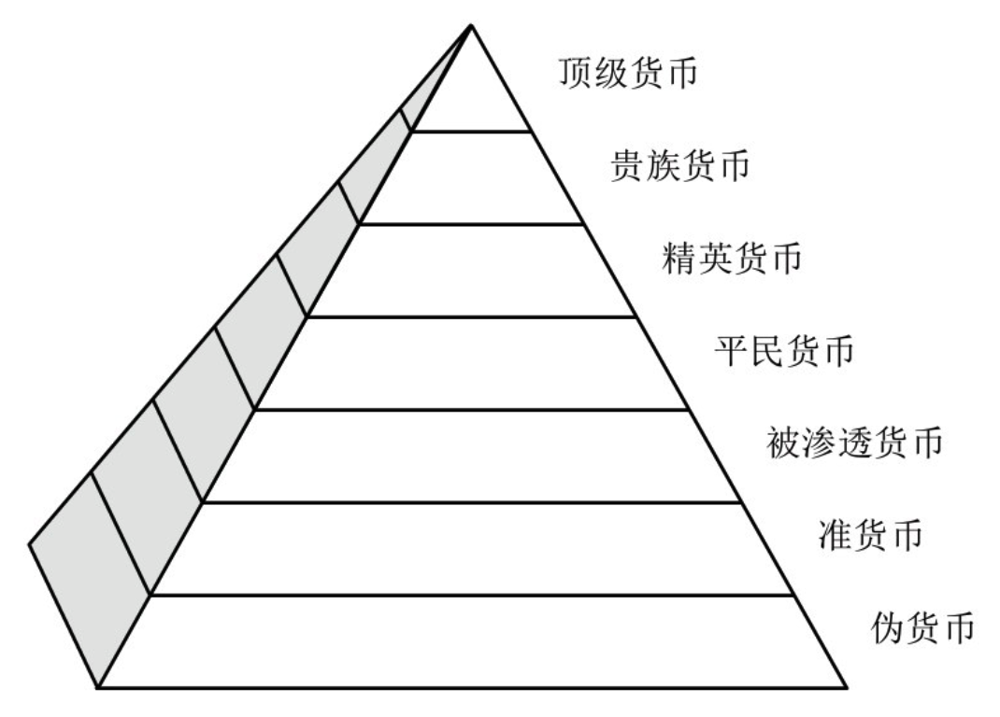

    作者: [美]本杰明·J.科恩
    出版社: 中信出版集团股份有限公司
    副标题: 从货币读懂未来世界格局
    出版年: 2017-10-1
    页数: 324
    定价: 65
    装帧: 精装
    ISBN: 9787508679112

[豆瓣链接](https://book.douban.com/subject/27155227/)

- [第一章 国际货币](#%e7%ac%ac%e4%b8%80%e7%ab%a0-%e5%9b%bd%e9%99%85%e8%b4%a7%e5%b8%81)
  - [动机](#%e5%8a%a8%e6%9c%ba)
  - [选择](#%e9%80%89%e6%8b%a9)
  - [货币金字塔](#%e8%b4%a7%e5%b8%81%e9%87%91%e5%ad%97%e5%a1%94)
  - [收益与成本](#%e6%94%b6%e7%9b%8a%e4%b8%8e%e6%88%90%e6%9c%ac)

## 第一章 国际货币
### 动机
货币的三种职能（交易媒介、计价单位、价值储藏）在两个分析层面（私人市场和官方政策）展开，就得到六种货币职能。以上分类如表1.1所示。

表1.1 国际货币职能

分析层面/功能 | 交易媒介 | 计价单位 | 价值储藏
--------|------|------|-----
私人 | 外汇买卖，贸易结算 | 贸易计价 | 投资
官方 | 干预 | 锚 | 储备

用某研究成果中的话来说：“在一个分散化的汇兑市场上，通过间接汇兑而不是各种货币的直接汇兑，即某种大家普遍接受的交易媒介，就不必诉诸‘需求的两两配对’。”使用某种单一货币的交易量越大，搜集信息和货币之间转换的成本就越小。货币理论家把这种收益称作货币的“网络外部性”，简单说来就是货币的网络价值。

### 选择
通常来说，争夺市场份额，正是货币国际化进程的本质。因此典型的情况是，一种货币要想获得国际地位，就必须具有竞争力。

就经济因素而言，对货币的需求大体上主要由三方面性质决定：

1. 至少在货币走出国界的初始阶段，人们普遍对该货币的未来价值具有信心。换言之，该货币需要具备可靠的连续记录，表明它拥有较低的通货膨胀率和较小的通胀波动。较高和波动较大的通胀率，会增加人们获取信息与进行价格计算的成本。如果人们无法对一种货币的购买力形成比较有把握的预测，那么在跨境交易中就不大愿意使用它。
2. 该货币应当具备汇兑便利和本金确定的性质，即应具有高度的交易流动性且能够对资产价值进行合理的预期。实现这两点的关键在于，需要有一套高度发达的金融市场体系，并且对外国充分开放。金融市场体系一定不能因高昂的交易成本，或各种正式与非正式的进入障碍而运行不畅；同时又必须具备较高水平的深度、广度和恢复能力——对一个有效的金融部门来说，这三点是最根本的特征。所谓深度（depth），是指金融市场有能力保持相对较大的市价盘，而不至于对个别资产价格造成重大冲击。所谓广度（breadth），是指交易量和充分的市场竞争能够确保卖出方（ask）与买入方（bid）的价差较小。而恢复能力（resilience），是指市场价格有能力从异常的大卖盘或大买盘中迅速恢复过来。对几乎所有的（就算不是全部）金融债权来说，二级市场必须是完全可操作的。
3. 该货币必须能够支撑起一个广泛的交易网络，因为最能促进人们对该货币接受程度的，无过于预期其他人也会接受它。从历史上来看，这一因素通常意味着经济体的绝对规模很大，并且高度融入世界市场体系。经济体的规模越大，其货币的使用者自然也就越多；如果货币发行国同时也是一个主要的贸易国，那么其货币的网络外部性就会进一步增强。

就政治因素而言，国内和国际两方面的因素都要考虑。从国内方面来说，货币发行国的政治稳定和有效治理似乎是最重要的。对于货币的潜在使用者来说，如果其背后没有对财产权的充分保护和对法治原则的真正尊重，那么该货币就不太可能具有吸引力。同样，如果货币发行国的政治体制不能有效地进行政策管理，那么其货币也很难具有吸引力。

从国际方面来说，英镑和美元的历史经验表明，安全性问题或许也是相当重要的因素。在私人层面，军力强大的国家可以为紧张不安的投资者提供一个安全的“避风港”。强大的国防能够保证投资环境更加安全。在官方层面，各国政府对不同货币的偏好，可能会受到更广泛的对外政策关系的影响，例如传统的庇护（patron-client）关系，非正式的安全保障关系，正式的军事同盟关系，等等。在19世纪，英镑地位的上升与强大的大英帝国——日不落帝国——的出现同步，这只是纯粹的时间巧合吗？当今，世界上绝大多数大量持有美元的国家（中国和俄罗斯除外），与美国都是正式或非正式的同盟关系，这也是偶然的吗？货币发行国在国外展现国力的能力越强，友邦和盟国就越有可能放心地使用该国货币。

### 货币金字塔
近半个世纪以前，著名的英国学者苏珊·斯特兰奇第一次对世界上使用最广泛的货币进行了系统的分类。斯特兰奇将货币分为四种类型：中性货币、顶级货币、宗主国货币以及协商货币。中性货币（neutral currencies）是指纯粹通过经济因素（价值稳定、网络外部性等）来吸引市场参与者的货币。除了经济因素之外，如果货币发行国还能在相关的组织和发行区域中发挥主导力量，那么这种货币就可以称为顶级货币（top currencies）。宗主国货币（master currencies）源于正式的依附性关系——例如殖民地关系，并且依赖于一定程度的强制。相比之下，协商货币（negotiated currencies）则更多地依靠劝说，并且通过外交谈判或非正式的谅解来推动或维持货币在国外的使用。

世界货币的等级制特征（见图1.1）。货币金字塔的顶部尖细，这一位置被一种或少数几种占支配地位的货币所占据，塔身向下越来越宽，表示货币的竞争力逐级递减。位于金字塔顶端的货币，包括了斯特兰奇定义的四种货币类型。

七种货币类型如下：

顶级货币。我们同意斯特兰奇的用法，使用同样的标签表示同样的含义，这一高贵的等级只留给世界上最受尊崇的货币——在绝大多数类型（即便不是全部类型）的跨境交易使用中占据主导地位，并且几乎在全世界范围内通用，并不局限于特定的地理区域。在现代，可以说只有两种货币真正达到了这一高贵的地位：第一次世界大战之前的英国英镑和第二次世界大战之后的美国美元。

贵族货币（Patrician Currency）。位于顶级之下的货币，也用于多种途径的跨境交易活动，不过，虽然其使用范围并不小，但仍未占据主导地位；换言之，这些货币用途虽广，但仍未达到在世界范围内通用的程度。从历史上来看，这一类货币当中，有些类似于斯特兰奇分类中的中性货币，仅因其经济属性而具有吸引力；有些则更接近于她所谓的宗主国货币和协商货币。当前，贵族货币中显然包括欧元，在大多数跨境交易用途中，欧元的使用仅次于美元。近年来，其他唯一重要的贵族货币是日本的日元，虽然其受欢迎的程度最近有所下降。很多观察家都预料，中国的人民币将很快跨入贵族货币的行列。

精英货币（Elite Currency）。这一类货币对于一定程度的国际交易来说，具有充分的吸引力，但是其分量不足以在国界之外发挥直接的影响力。这一层级是更加外围的国际性货币，并且种类不少。这一类型的货币或许对应于斯特兰奇所谓的中性货币。当前，精英货币的名单中应当包括英国英镑（遗憾的是，英镑再也不是顶级货币，甚至连贵族货币都算不上），以及瑞士法郎、澳大利亚元和加拿大元。因其固有的经济属性，所有这些货币在一定程度上都在全球货币和金融市场上使用。此外，在南太平洋地区和非洲南部，澳大利亚元和南非兰特分别发挥着汇率锚和储备货币的重要作用。

平民货币（Plebeian Currency）。精英货币再下一层，就是平民货币，这一类货币更为普通，在国际上的使用极为有限。这些货币的发行国主要是体量较小的工业化国家（如挪威和瑞典），中等收入的新兴经济体（如新加坡、韩国和中国台湾），以及较富裕的石油出口国（如科威特、沙特阿拉伯和阿拉伯联合酋长国）。在国内，平民货币多少还能保持它在传统货币功能方面的垄断地位，但在国外却几乎没什么影响力（就像古罗马时期的平民或普通百姓）。除了用于一定数量的贸易计价之外，这一类货币很少用于跨境交易活动。

被渗透货币（Permeated Currency）。这一类型的货币，即使在其国内，竞争力也受到实实在在的抑制，抑制途径是经济学家所谓的“货币替代”——作为本国货币的替代，本国居民更加偏爱使用某种流行的外国货币。虽然名义上货币的领域与发行国政府的控制范围一致，但外国货币仍会替代本国货币，尤其是作为价值储藏的途径，于是进一步凸显了本国货币的弱势地位，被渗透货币面临着来自外国货币的侵蚀。从现有的迹象来看，当前被渗透货币的分布其实非常广泛，涵盖了许多发展中国家，特别是拉丁美洲和东南亚地区的经济体。

准货币（Quasi-Currency）。再下面一层的货币，同样会被外国货币所替代，并且不仅作为价值储藏的手段被替代，而且在很大程度上其计价单位和交易媒介的功能也被替代。因此，准货币虽然在名义上能够保持其法定的流通领域，但在实际的大多数用途中人们都拒绝使用它。准货币的使用领域更多的是法律意义上的，而不是实际意义上的。现有的证据表明，世界上许多脆弱的经济体，其货币的确类似于这种低劣层级的准货币。

伪货币（Pseudo-Currency）。货币金字塔的最下面一层，只是名义上的货币，即伪货币。伪货币最明显的例子是诸如巴拿马银币（balboa）这样的代用货币，在伪货币的国家，往往以更强势的外国货币如美元作为法定货币。有时候，伪货币以及许多小规模的被渗透货币和准货币，被人们轻蔑地斥为“垃圾货币”。

### 收益与成本

