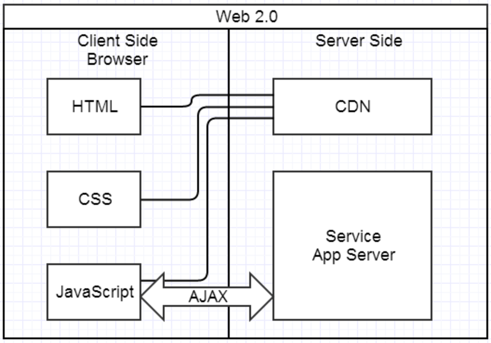
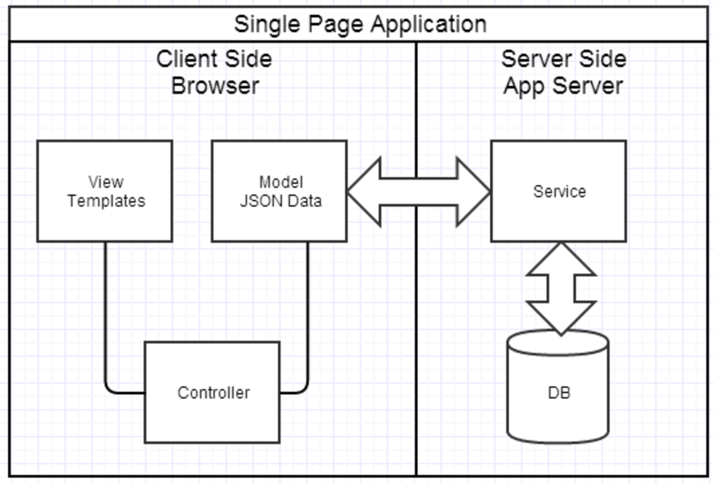
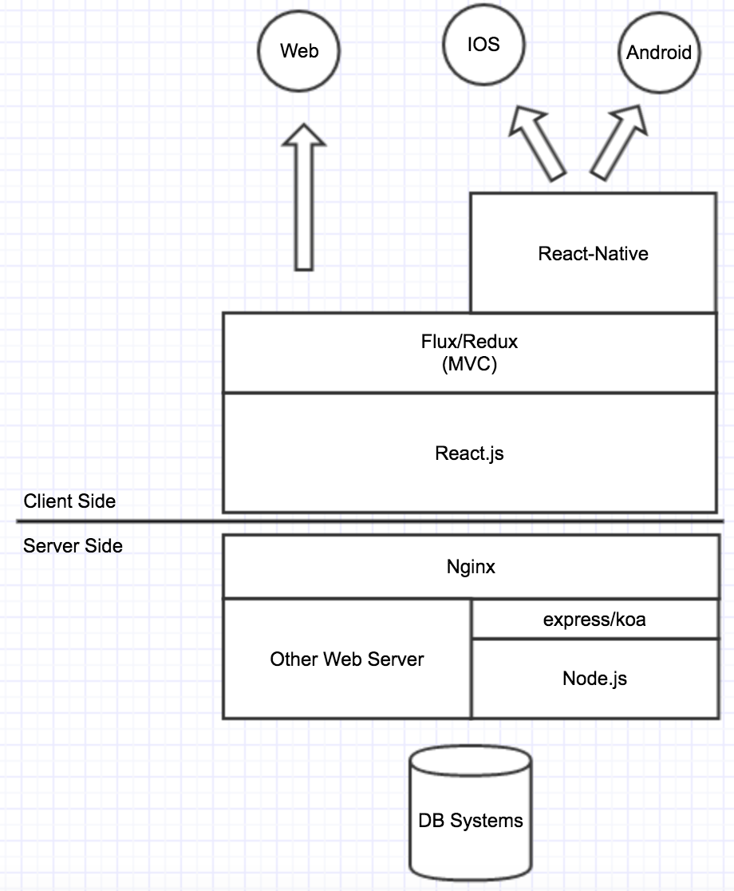

# 前端架构演变

## Web1.0 前端架构
Web1.0展示层基本以静态为主，服务端把界面生成好，浏览器来展示，拿J2EE举例：

这个图里，JSP响应浏览器端的请求，把HTML生成出来，跟相关的JavaScript和CSS一起拿出去展示。

前端的逻辑是基本可忽略的，所谓的组件化，把某一块界面包括它的业务逻辑一起打成一个端到端的组件，而且逻辑基本上都是在服务端控制，大致结构如下图所示。

## Web2.0 前端架构
Web2.0如下图所示，因为实际上HTML、CSS、JavaScript这些都逐渐静态化(不通过JSP/ASP/PHP生成)，所以不再需要把它们放在应用服务器上，可以把它们放在专门的高性能静态服务器上，再进一步发展，可以是CDN。前端跟后端的通信，基本都是通过AJAX来，也会有一些其他的比如WebSocket之类，总之尽量少刷新了。

### SPA
Web2.0发展出所谓The Single-Page App(单页应用)，指的是在一个页面上集成多种功能，甚至整个系统就只有一个页面，所有的业务功能都是它的子模块，通过特定的方式挂接到主界面上。它是AJAX技术的进一步升华，把AJAX的无刷新机制发挥到极致，因此能造就与桌面程序媲美的流畅用户体验。

ExtJS/JQuery都是单页应用框架的典型，它们问题是对代码的组织是缺乏约束的，如何在代码急剧膨胀的情况下控制每个模块的内聚性，并且适当在模块之间产生数据传递与共享，就成为了一种有挑战的事情。

为了解决单页应用规模增大时候的代码逻辑问题，出现了不少MVC框架（及其变异品种MVP，MVVM等），它们的基本思路都是在JS层创建模块分层和通信机制。

### MVC框架
对比Web1.0的MVC框架，拿J2EE的Struts举例，这里面的V，就负责了整个前端的渲染，而且是服务端的渲染，也就是输出HTML。如下图所示：

在SPA场景下，浏览器端形成了自己的MVC等层次，这里的V已经变成客户端渲染了，通常会使用一些客户端的HTML模版或组件(这里涉及JS的两大流派，Angular使用的是动态模板技术，React则使用代码组件)去实现，而模型和控制器，也相应地在浏览器端形成了。

### SPA的缺陷
经典的单页面应用像 Gmail 能快速的响应用户行为， 而不是只为了渲染页面就往返服务器。MVC模式看起来像这样:

大部分的逻辑都在客户端，（视图，模版，控制，数据处理，国际化等）为数据提供处理接口， 服务器端可以使用任意一种语言编写， 如 Ruby、Python、Java，它最多的也就是提供一个空的HTML页面， 一旦JavaScript文件被下载，它们将被执行以及在客户端初始化， 从中获取数据并直接渲染HTML页面。

但是它也存在几个显著的问题：

1. SEO：如果一个应用只运行在客户端的话是不能通过HTML进行”爬虫”的，所以它默认是不可被SEO的（搜索引擎优化）；
2. Performance：如果服务器不能直接渲染整个HTML页面，而是通过JavaScript去做这些事儿，用户将会在加载完整个页面之前看到几秒钟的空页面或者一直加载控件；
3. Maintainability：在理想情况下我们在要创建一个分层明确低耦合的应用程序， 来避免少量的应用逻辑代码在前后端重复（通常是前后端使用不同的语言开发）. 常见的例子比如 日期/货币格式化，表单验证， 流程逻辑。

## Isomorphic JavaScript
Airbnb尝试使用”Isomorphic JavaScript”进行构建. 这是一个可以在客户端和服务端都运行的JavaScript应用. 一个“isomorphic”应用看起来是这样：

应用和视图层逻辑都可以在前后端运行， 这样就依次解决上述所有问题 — 性能优化， 好的维护性， 可以被SEO，更有状态的Web应用。

通过Node.js，一个快速的， 稳定的运行在服务器端的JavaScript， 通过创建适当的抽象， 就可以在服务器端和客户端运行逻辑代码 — 这就是“isomorphic JavaScript“的定义。

## React-Native
React.JS的本质是一套Component的复用机制。采用它的一个基本动力在于，几乎所有基于树形方式组织的UI，都可以得益于 React.JS 的Virtual DOM所带来的性能提升。

一旦开始用React.JS，你会发现传统 Web 开发方法在远离你。你更多地考虑通过Component来分离你的UI，而不是DOM、CSS和JS。当你越来越多地以Component为边界来组织和思考，一个全局的HTML文件，CSS文件的作用越来越少。React的出现，前所未有地淡化了传统的HTML,CSS,JS三者相对独立的组织和编程方式，甚至降低了对jQuery的需求。这个思想，从本质上更像之前 Rich Client 的开发方式。

由于DOM地位的淡化，使得React出现其他各种Render方式成为可能，今天出现了React-Canvas，将层次结构渲染到Canvas上，也许明天就会出现 React-GL，将UI渲染到 WebGL Canvas上，后天将UI渲染到了PDF甚至SVG中。这些都能从React的基本技术和架构上得益。

从这个角度想，React-Native就很自然出现，只不过这块画布从Web DOM(或者Canvas)变成了iOS的UIView。

并且它通过Bridge方式调用原生的系统组件，性能损失低，React Native通信机制（以IOS为例）：

## 泛前端架构选型

server端
- DB Systems:关系型数据库，NoSQL，HDFS等
- Other Web Server:云端API，机器学习Predict API等
- Node.js:服务器端js渲染
- express/koa:node.js Web应用框架
- Nginx:static files, redirects, SSL certificates, gzip, error pages等

client端
- React.js:
- Flux/Redux:基于React的MVC框架
- React-Native:
