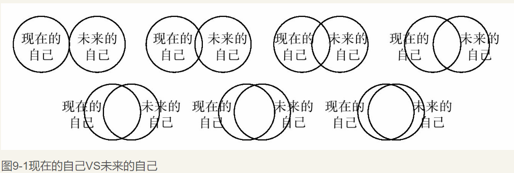

    作者: [美] 沃尔特·米歇尔（Walter Mischel） 
    出版社: 北京联合出版公司
    副标题: 自控力养成圣经
    原作名: The Marshmallow Test：Why Self-Control is The Engin
    译者: 任俊 / 闫欢 
    出版年: 2016-10-1
    页数: 262
    定价: CNY 59.90
    装帧: 平装
    丛书: 湛庐文化·心视界
    ISBN: 9787550288676

[豆瓣链接](https://book.douban.com/subject/26894686/)

<!-- TOC -->

- [推荐序-棉花糖决定未来的奥秘](#推荐序-棉花糖决定未来的奥秘)
- [源起](#源起)
  - [初衷](#初衷)
    - [青春期：更有竞争力和更好的学习成绩](#青春期更有竞争力和更好的学习成绩)
    - [成人后：更高的教育水平和社交能力](#成人后更高的教育水平和社交能力)
    - [中年大脑扫描：更加活跃的前额叶皮层](#中年大脑扫描更加活跃的前额叶皮层)
  - [选择](#选择)
    - [策略一：分心](#策略一分心)
    - [策略二：将诱惑物抽象化](#策略二将诱惑物抽象化)
    - [策略三：冷静聚焦](#策略三冷静聚焦)
    - [孩子们如何看待自己的行为](#孩子们如何看待自己的行为)
  - [大脑](#大脑)
    - [热情绪系统](#热情绪系统)
    - [冷认知系统](#冷认知系统)
    - [影响延迟满足能力的两大因素](#影响延迟满足能力的两大因素)
    - [有毒的压力](#有毒的压力)
  - [家庭](#家庭)
    - [婴儿对母亲的依恋行为预示了孩子未来的延迟满足能力](#婴儿对母亲的依恋行为预示了孩子未来的延迟满足能力)
    - [脆弱的根源](#脆弱的根源)
    - [过度控制的母亲反而会适得其反](#过度控制的母亲反而会适得其反)
  - [习惯](#习惯)
    - [抵抗诱惑的“如果-那么”计划](#抵抗诱惑的如果-那么计划)
    - [从努力的控制中去除努力](#从努力的控制中去除努力)
  - [信任](#信任)
    - [既然未来不会来，我为什么还等待](#既然未来不会来我为什么还等待)
    - [大脑中的图景](#大脑中的图景)
  - [培养](#培养)
- [拓展](#拓展)
  - [掌控](#掌控)
    - [执行功能：成功人生的必备技能](#执行功能成功人生的必备技能)
    - [共情：了解和通往他人思想的窗户](#共情了解和通往他人思想的窗户)
    - [掌控感：“我就是能”](#掌控感我就是能)
    - [乐观：对成功的期待](#乐观对成功的期待)
  - [自我](#自我)
    - [多重自己](#多重自己)
    - [一切都是为了未来的自己](#一切都是为了未来的自己)
  - [时间](#时间)
    - [心理距离](#心理距离)
    - [通过增加心理距离来控制欲望](#通过增加心理距离来控制欲望)
    - [如何让吸烟者自己戒烟](#如何让吸烟者自己戒烟)
  - [距离](#距离)
    - [自我疏离：以墙上一只苍蝇的视角看待一切](#自我疏离以墙上一只苍蝇的视角看待一切)
    - [当孩子开始自我反思时](#当孩子开始自我反思时)
  - [人际](#人际)
    - [在人际关系中过于敏感的不良后果](#在人际关系中过于敏感的不良后果)
  - [情绪](#情绪)
    - [自我提升](#自我提升)
    - [情绪会如何扭曲思维](#情绪会如何扭曲思维)
    - [为什么有的人对自己感觉过于良好](#为什么有的人对自己感觉过于良好)
    - [过度自信往往弊大于利](#过度自信往往弊大于利)
  - [动机](#动机)
    - [不同语境下的自我控制](#不同语境下的自我控制)
    - [人们并不会在各个方面都运用自控力](#人们并不会在各个方面都运用自控力)
  - [社交](#社交)
    - [寻找“热点”](#寻找热点)
    - [每个人只会在特定的条件下表现出一致行为](#每个人只会在特定的条件下表现出一致行为)
    - [如何找出让自己感到压力的特定事件](#如何找出让自己感到压力的特定事件)
    - [自控可以冷却攻击倾向](#自控可以冷却攻击倾向)
  - [恐惧](#恐惧)
  - [热爱](#热爱)
    - [相比努力增强意志力，找准目标与方向更重要](#相比努力增强意志力找准目标与方向更重要)
    - [过度延迟满足和缺乏延迟满足一样毫无建树](#过度延迟满足和缺乏延迟满足一样毫无建树)
    - [何时应该享受当下：榜样的力量](#何时应该享受当下榜样的力量)
    - [动力和努力：绿色小组](#动力和努力绿色小组)
- [实施](#实施)
  - [学校](#学校)
  - [父母](#父母)
    - [基本原则：冷却现在、加热未来](#基本原则冷却现在加热未来)
    - [“如果-那么”计划](#如果-那么计划)
    - [预先承诺计划的失败与成功](#预先承诺计划的失败与成功)
    - [对诱惑重新评估](#对诱惑重新评估)
    - [自我疏离：做一只墙上的苍蝇](#自我疏离做一只墙上的苍蝇)

<!-- /TOC -->

# 推荐序-棉花糖决定未来的奥秘
该书中有三个结论是米歇尔教授的**核心观点**。

1. 延迟满足能力在人们的早期生活中即是可见和可测量的，它对人一生中的幸福和精神充实、身体健康等方面具有长期而深远的影响。
1. 延迟满足这种能力是一项可以习得的认知技能，其认知策略可以改善和提高。
1. 自控力能够发挥多大作用不仅仅取决于技能，更取决于内化的目标、指导人生旅程的价值观和战胜沿途挫折的强大能力。

显然，在延迟满足能力的背后有着更为重要的因素，那就是动机，而 **决定动机的往往是价值观**。所以，米歇尔教授指出，延迟满足与自我控制，这两者是一种能力和认知技能，就像任何一种能力，能否运用主要依赖于动机。因此，比执行功能更重要的是目标与动力。要想成功地实现目标，自控力是必不可少的，但是给予我们方向和动力（内驱力）的是我们的人生目标。

# 源起
## 初衷
BJ.凯西指出，延迟能力低下者似乎是被一种比较强烈的“机器”所驱使着，而可以高度延迟的人有一个较好的心理“刹车系统”。这项研究点出了关键之处，终生处于低自控力水平的个体在其日常生活中的多数情况下并没有控制上的困难，只有在面对非常有吸引力的诱惑时，他们在行为和大脑活动方面才会出现显著的冲动控制问题。

### 青春期：更有竞争力和更好的学习成绩
总体来看，那些能够坚持更长时间的学龄前儿童大都获得了更好的SAT成绩，而其中，那些坚持时间最短的孩子（最后三名）比起那些坚持时间最长的孩子（前三名），总体分数整整差了210分。

### 成人后：更高的教育水平和社交能力
在25～30岁期间，那些曾在实验中坚持更长时间的人自我报告说，他们更有能力去追逐并达到长期目标，更少地使用有风险的药物，也达到了更高的教育水平，体重指数也明显低很多。他们在面对人际交往问题时更加游刃有余，更容易适应，同时可以更好地维系亲密的人际关系（我会在第12章阐述这个问题）。

### 中年大脑扫描：更加活跃的前额叶皮层
这些男校友的大脑图片显示，那些在棉花糖实验中对诱惑坚持更久以及在日后不断地将自控力保持在一个较高水平的人，他们的脑前区回路有着非常显著的激活，这一区域的神经活动会整合激励及控制过程，而其他人则没有这种激活。那些可以高度延迟的人，他们的前额叶皮层区域更加活跃，而这个区域恰恰是用来有效解决问题、创造性思考、克制冲动行为的。相比之下，那些延迟能力低下的人，他们中脑的皮层更加活跃，尤其是当他们试图去控制自己对诱人的刺激的反应时，这种情形更明显。中脑这个区域处在大脑深处更加原始的部分，与人们的欲望、快感及成瘾有关。

这项研究点出了关键之处，终生处于低自控力水平的个体在其日常生活中的多数情况下并没有控制上的困难，只有在面对非常有吸引力的诱惑时，他们在行为和大脑活动方面才会出现显著的冲动控制问题。

## 选择
- 在棉花糖实验中，成功延迟满足的孩子主要运用了三大策略：分心策略、抽象化策略、冷静聚焦策略。
- 分心策略：让孩子用手蒙住眼睛，或者是完全将头转向别的地方以避免看到奖励物；或者把按铃和盘子往外推，使之尽量远离自己，甚至把盘子推到了桌子边缘。最后一招是闭上眼睛试图去睡觉。
- 抽象化策略：给孩子看奖励物的图片而不是真实的奖励物，等待会变得容易许多。当然，图片必须和真实的奖励物一致。
- 冷静聚焦策略：更加关注奖励物抽象、认知性、信息性方面的特征（它是圆的、白的、软的、小的），比如提示孩子们将棉花糖想象成圆形的云朵。

### 策略一：分心
成功的延迟者们创造了很多方法让自己分心，使自己在矛盾中冷静下来，强调自己现在正在经历考验。

当孩子的有趣想法被激活后，实验人员离开了房间，这时孩子们等待的时间平均要多出10分钟以上，甚至当奖励物被暴露在外时也是如此。他们自己形成的愉快想象可以抵消那些实际存在的奖励物的强烈诱惑，这使得他们可以和在奖励物被遮挡的情况下等待同样长的时间。当分心想象没有被很好利用时，他们等待的时间会短于1分钟。

### 策略二：将诱惑物抽象化
一个想要的物品的图片，而不是诱惑本身会使得孩子们更容易去等待。

面对奖励物图片的孩子们，延迟满足的时间平均是18分钟，但当他们假装面对的图片是真实的物品时，他们等待的时间要低于6分钟。而相比他们面对真实奖励物时平均只能坚持不到1分钟的情况，他们在想象那是一幅图片时却可以等待18分钟。他们在脑海中想象的图片战胜了桌上真实呈现的物体。

### 策略三：冷静聚焦
首先，一个诱惑性的刺激有着冲动聚焦作用：它促使你想要去吃棉花糖，这么去做能感到强烈的愉悦。其次，它还提供描述性、非感性的特征信息：它是圆的、白色的、厚的、软的，可以食用的。所以，刺激对我们的效果取决于我们如何在脑海中呈现它。如果将大量注意力集中在这种刺激的冲动聚焦一面——棉花糖柔软又好吃的一面，或是烟瘾上来后吸两口的感觉，这种冲动聚焦会自动产生冲动行为：去吃棉花糖或者吸烟。相比之下，一个冷静聚焦且更加关注刺激的抽象性、认知性、信息性方面的特征时（它是圆的、白的、软的、小的），它们只会告诉你那像什么，并不会加剧其诱惑性，这允许你冷静地思考而不是立刻就要得到。

那些学龄前儿童所经历的情感同样会对他们在多长时间内按下按铃产生影响。如果实验人员在离开房间前通过诱惑物建议孩子们去想一些能令他们感到悲伤的事情（比如因为没有人帮助他们而哭泣时），孩子们会像被建议去想奖励物一样很快就停止等待。如果孩子们想的是一些愉快的事情，他们等待的时间会是三倍长：平均接近14分钟。

总之，我们在感觉不好时很难去选择延迟满足。

对于奖励物的情感越炙热，欲望越强烈，人们越难在做出冲动行为时冷静下来。实验人员给在以色列的公立学校的大约7 000名四年级和六年级学生提供了一些可供选择的不同选项：奖励物数量（一个或两个）、延迟时间（立即或一周，一周或一个月）、诱惑物（巧克力、钱、蜡笔）。意料之中的是，他们中的大多数人选择了可以为蜡笔延迟等待，而对于巧克力却很困难。就像每一个节食的人都知道的，当冰箱门打开或者服务员端上甜点的那一刹那，诱惑物的冲动特质便开始发挥作用。

这种力量并不是来自于刺激，而在于精神上如何界定：如果你更换了想象它的方式，那么它对你感觉上的影响确实会发生变化。如果你想象有一只蟑螂曾经在厨房中咬过那块巧克力蛋糕，那么等它被作为甜点端上餐桌时就会对你失去诱惑。

棉花糖实验使我确信，如果人们可以改变自己在精神层面上呈现刺激的方式，他们就可以运用自我控制并从控制自己行为的冲动刺激中逃脱，以免沦为冲动控制的受害者。

这种力量来自前额叶皮层，一旦被激活，就会以几乎不会停止的方式通过改变对它们评估的方式来冷却冲动诱人的刺激。

### 孩子们如何看待自己的行为
这次，实验人员不会离开房间让孩子们开始等待，而是会留下来询问他们什么样的条件会有助于他们等待。比如，我们会问：“如果把棉花糖放在盘子上，让你可以看见，等待会变得更容易吗？那如果把棉花糖放在盘子下你看不到的地方呢？”

大多数3岁的孩子都无法理解问题，也就不知道该回答什么。4岁的孩子理解了问题，但是他们常常会选择最差的策略：将奖励物暴露在外面，看着它，想着它有多么好吃。当被问及为什么会选择将奖励物放在外面时，他们说：“因为这样会使我感到高兴。”“我就是想看看它。”或者“它太美味了。”很明显，这些想法都聚焦在他们想要的（“我喜欢它”），而不是领悟或者关注到看到奖励物会使他们的等待变得更加困难。他们希望想要的东西就真切地放在自己的眼皮底下。在面对暴露在外的奖励物时，他们击败了自己去等待的庄严意图，以致看到自己已经按下按铃拿到奖励物时自己也会感到惊讶。他们不仅没能正确预测出自己的行为，而且还坚持创造着使自己不可能完成延迟满足的条件。

在5～6岁的时候，大多数孩子更喜欢选择隐藏奖励物，同时把不断拒绝唤醒有关奖励物的想法作为一种自我控制策略。取而代之的是，他们会让自己对诱惑分心（“只是去唱歌”或者“我猜我要回到外太空”或者“我想我要去洗个澡”）。当他们再长大一些时，他们会慢慢开始看到以及不断重申这两种可能性的价值（“如果我选择等待，那么我可以得到两颗棉花糖；但如果我按下按铃，那么我只能得到一颗”）。同时，他们会通过指示性语言建议自己：“我会说‘不，不要去按下按铃’，如果我按下按铃，老师就会进来，我就只能拿到一颗了。”

大多数孩子似乎在12岁时才能意识到冷却思想冲动的重要性，那时，他们才可以领悟到对于奖励物的冲动会击败你关于延迟满足的想法。反之，冷却思想（例如，将棉花糖转移为蓬松的云朵）却可以减低他们的欲望从而让等待变得更加容易，正如一个男孩所说的：“我总不能去吃那蓬松的云朵吧。”

## 大脑
- 长久的压力会损害前额叶皮层，不利于自我控制。因此，有效的自控往往需要有效的压力应对策略，从而将压力降至最低水平。
- 短暂避开热情绪系统的方法是，想象其他人会怎么做。因为在替别人做热情绪选择时，自己往往会更容易用到冷认知系统。

### 热情绪系统
在大脑边缘系统中，一个形似杏仁的神经元组织，即`杏仁核`尤为重要。它对人类诸如害怕等情绪反应以及饥饿与性行为起着核心作用。杏仁核能快速调动身体的行为，并且永不会停止，它会一直运作，不让大脑多加思考或是顾虑后果。

弗洛伊德认为，本我是大脑无意识的结构，包括性欲和攻击性的生理冲动，这些生理冲动往往寻求即刻满足和压力减轻却从不考虑后果。就如弗洛伊德所说的本我一样，热情绪系统是自动的，并且常常是无意识运作的。但在弗洛伊德看来，热情绪系统不仅仅服务于性欲和攻击性的冲动，它还能自动快速地触发消费性行为、觉醒以及冲动行为，它情绪化、简单，也是条件反射性的。

高压会触发热情绪系统。这种反应在人类进化史中是有适应性的，当人类面对迎面而来的狮子，其热情绪系统会被触发，并会自发地以不可思议的速度（以每毫秒计）迅速逃跑进行自我保护，因此，热情绪系统在许多性命攸关、需要快速反应的紧急状况下仍然发挥着它的价值。然而在一个给定的情况下，当成功取决于保持冷静、事先计划、理性处理问题等因素时，这种热情绪反应就不管用了。所以，热情绪系统在一个人成长的早期占有优势地位，这也就使得学龄前儿童很难掌握自我控制。

### 冷认知系统
冷认知系统位于大脑`前额叶皮层`的中心位置，该系统是可控制的，对一些关于未来的决策和自控都起着重要作用。

高压会削弱冷认知系统、加强热情绪系统，这一点尤其值得注意。**冷热系统是连续不断地进行相互作用的：一方活跃，另一方便会消沉**。

### 影响延迟满足能力的两大因素
年龄也是一个关键因素。在棉花糖实验中，大多数不满4岁的孩子都不能延迟满足自己的需求。相比之下，在某些研究中，60%的12岁孩子都能等待长达25分钟。

性别是另一个关键因素。男孩感兴趣的女孩却不一定感兴趣，反之亦然（例如，男孩大多对灭火器和剑感兴趣，女孩可能会对娃娃和化妆盒感兴趣）。但即使是诱惑物的价值相当，他们受到的鼓励也相当，女孩还是比男孩展现出了更好的忍耐力。

### 有毒的压力
压力持续的时间越长，认知能力受伤害就会越严重，伤害也越持久，并最终导致精神和身体上的疾病。

## 家庭
- 在孩子刚出生的几个月，看护人应该将孩子的注意力从那些导致不安情绪的内容上转移到他们感兴趣的活动上，可以让他们学会从不安和压力中自我转移、更加冷静。
- 过度控制孩子的父母很有可能暗中破坏了孩子自控力的发育，因此，父母要注意着重培养孩子自主解决问题的能力。

### 婴儿对母亲的依恋行为预示了孩子未来的延迟满足能力
那些在“陌生情境”的最后30秒转移自己注意力的孩子，他们长到5岁时在棉花糖实验中也能通过更有效地转移注意力等待第二颗棉花糖。对比而言，没有成功将注意力从母亲身上移开的孩子在3年后也没能完成延迟满足，很快就按了铃。这些研究结果都强调了在孩子成长早期调节注意力来控制并缓解压力的重要性。

### 脆弱的根源
孩子6岁前的成长经历就成为他们抑制冲动，学会自我控制与情绪控制，发展移情能力、警觉和良知的基础。

### 过度控制的母亲反而会适得其反
孩子一旦能够控制自己与母亲之前的距离，也就能在母亲做决定时不完全听从母亲的控制，在5岁时参与棉花糖实验也就可以等待更长的时间。

过度控制孩子的父母事实上会冒风险，很有可能暗中破坏了孩子自控力的发育，而那些支持并鼓励孩子自主解决问题的父母反倒更可能让孩子成功地在棉花糖实验中吃到第二颗棉花糖。

## 习惯
- 如果-那么”计划有助于成功实现自我控制，它不仅在外部环境中的“如果”出现时奏效（当闹铃响时、当我进入酒吧），而且当“暗示”是你的内部状态（当我正渴望某件事、当我正感到无聊、当我感到焦虑）时会同样奏效。通过一定的练习，相关的情境就会起到暗示的作用，使得“如果-那么”计划变得自动化而不再需要努力。

### 抵抗诱惑的“如果-那么”计划
让我们试着想一些你能做的，以抵挡小丑先生箱的诱惑。让我们想一想……一件你可以做的事情是：当小丑先生箱制造“嗡嗡”声，让你看它并跟它玩时，你只能看自己的工作，而不是看它，并且说：“不，我不能，我正在工作。”而当你说了它，做了它，它说，“看我。”然后你说：“不，我不能，我正在工作。”

这种“如果-那么”计划详细说明了诱惑人的热刺激——“当小丑先生说看它并跟它玩时”，并把它连接到了“诱惑-抑制”回应：“那么你只能不看它，并对自己说“我不会看小丑先生箱的”。通过这种计划训练的学龄前儿童减少了自己注意力分散的时间并且能继续工作。即使小丑先生成功地分散了他们的注意力，这种破坏平均持续不到5秒钟，并且孩子们在钉板上平均插入了138个钉子。与此相反，那些没有通过这种计划训练的孩子每次注意力分散平均长达24秒，仅能插入97个钉子，表现出了极大的差异性。

### 从努力的控制中去除努力
当它们变得自动化，这样的“如果-那么”计划就会把努力从努力控制中去除：你能够欺骗热系统本能地、无意识地为你工作。然后，当你的冷系统休息时，热系统会在你需要时让你自动表现出你想要的行为。但是，除非你将抵制计划合并到热系统中，否则当你最需要它时，它不太可能被激活。这是因为，当你面临诱惑时，你的情绪会被激发，压力会增加，这会促使热系统加速，触发快速、自动的“去”回应，从而使冷系统减弱。如果没有完善的“如果-那么”计划，当强烈的诱惑抵达——无论是来自小丑先生箱闪烁的灯光、菜单上的巧克力甜点，还是商务会议后酒吧里富有魅力的同事，自动地“去”回应很可能会取胜。然而，一旦“如果-那么”计划建立，它们在不同的环境下、面对不同的群体和年龄组，都能产生很好的效果，并且它们能够帮助人们更有效率地完成难度大的目标——那些他们以前认为自己不可能达到的目标。

## 信任
### 既然未来不会来，我为什么还等待
从童年开始，就有太多的人生活在一个不可信、靠不住的世界里，在这个世界里，延迟的更大奖励物的承诺常常得不到实现，这样的经历会让等待没有任何意义，不如抓住手里现有的东西，无论它是大是小。当学龄前儿童有过一次承诺者失信于他们的经历，他们便不愿意等待两颗而愿意现在就拿到一颗棉花糖的做法也就不那么令人意外了。这些常识性的预期早就被实验证实，实验表明，当人们不再期待迟来的奖励会兑现时，他们的行为就会变得更加理性，并且不会选择等待。

### 大脑中的图景
再次重申，两个系统——一个处理即刻奖励和威胁的 **热系统**，另一个处理延迟结果的 **冷系统**是同时工作的，当一个比较活跃时，另一个就相对不活跃。接下来的挑战是，我们要弄清楚何时应该让热系统主导你的选择，以及何时、如何让冷系统苏醒过来并发挥作用。

## 培养
- 先天决定：气质论
- 后天环境影响一切
- 先天基因与后天环境相互塑造

遗传的天赋是行为的一个重要决定性因素，然而同样重要的是早年在母亲身边的环境，它对基因的作用有着强大的冲击作用。

# 拓展
## 掌控
- 执行功能为我们抑制和冷却冲动提供了可能，每一个成功等待的孩子的执行功能都有三个共同特点：第一，必须牢记自己选择的目标和两种可能性（“如果我现在吃了一个，过会儿就不能得到两个了”）；第二，必须注意自己实现目标的过程，通过灵活利用技巧来减少诱惑或转移自己对诱惑物的注意及认知，并在这一过程中做出必要的修正；第三，必须抑制冲动性反应，比如阻止想诱惑物有多么吸引人，或者伸出手去摸诱惑物等做法，这些做法更有可能会阻止自己实现目标。
- 保持乐观与对成功的期待意义非凡，要让孩子认为自己是一个能运用努力和能坚持的人，同时把自己看作是积极结果的原因。

### 执行功能：成功人生的必备技能
运用冷系统中叫作“执行功能”（executive function，简称EF）的部分对成功的自控至关重要，这是一种让我们对思想、冲动、行为和情绪进行深思熟虑、有意识控制的认知能力。执行功能为我们提供了抑制和冷却冲动的可能，提供了让我们思考和灵活部署注意力的方法，从而帮助我们更好地追求和达到目标。这套技能和神经机制对构建一个成功的人生非常必要。

### 共情：了解和通往他人思想的窗户
执行功能也与理解他人思想和感情的能力有关，它可以帮助孩子们发展关于推断他人意图、预判交流对象反应的“心智理论”（theory of mind），所以执行功能可以帮助我们理解和考虑他人的情绪、动机和行为，并识别出他人可能与我们大不相同的看法和反应。它还可以帮助我们掌握他人的思想和意图，让我们对他人正在经历的情绪感同身受。

### 掌控感：“我就是能”
孩子对自我的认知——认为自己是一个能运用努力和能坚持下去的人，同时把自己看作是积极结果的原因，这两点被帮助他们获得成功的自控力所滋养着。

孩子们的自我效能感和自我力量感会成为他们成功的基础，并形成了基于现实的乐观期盼，就这样，每一次成功都增加着下一次成功的概率。

### 乐观：对成功的期待
总的来说，孩子在生命早期所拥有的成功和掌控方面的经验会使他们变得更愿意，也更有能力去坚持追求目标，形成对成功的乐观预期，应对成长过程中不可避免的沮丧、失败和诱惑。孩子们获得的控制感、主导感以及乐观期待会变成人生故事里的关键连接（即主动因素）。

## 自我
### 多重自己
仔细看看图9-1的两个圆圈，现在的自己和未来的自己从没有重叠慢慢移动到几乎完全重叠，选择一对你认为最能描绘期望中的自己与未来10年的自己的情形最相似的圆圈，并标记出来。

研究人员指出，如果我们感觉与未来的自己有更强烈的连续性，我们也可能为了未来的自己牺牲更多当下的快乐。

### 一切都是为了未来的自己
那些感到与未来的自己有紧密联系的人会更多地思考自己的行为产生的长期后果，正是这种对未来后果的关注，使得他们不愿意去做贪婪、自私的决定。

## 时间
- 一生中，我们需要做出各种各样的决定，但面对的却是同一个挑战——关于自我控制的挑战。为了抵制诱惑我们必须冷却诱惑，让诱惑远离自己，使诱惑变得抽象化。可为了思考未来，我们又不得不加热诱惑，使它变得迫在眉睫、变得生动清晰。为了计划未来，诱惑帮助我们至少简短地预见了未来的生活，仿佛另一种可能的情景就在眼前展开一样。这允许我们预见到自己的选择的结果，使我们既对生活充满热情又能冷静思考，进而抱有最乐观的希望。
    - 通过增加心理距离可以实现自控，比如学龄前儿童将棉花糖远远地推开，增加的心理距离帮助其抵制了诱惑。
    - 如果你想抵抗未来某件事（换新工作、去异国旅行）在眼前的诱惑，你应该假想自己正在做这件事——通过本质上地预演，尽量生动、充满细节地模仿这件事情。这减少了为了眼前利益的无意识倾向行为，增加了对未来结果的注意，有助于加强自我控制。
    - 如何戒烟：利用简单的认知策略——转变自己的时间观，从关注“现在”转向关注“未来”来控制自己的欲望。如在面对烟瘾诱惑时想象一个正在接受癌症化疗的老烟民，尽可能深刻、生动地了解吸烟所导致的长期结果，从而将对烟草的渴望变成自己厌恶的东西。

### 心理距离
当我们幻想未来或思考过去时，我们正在跨越一个单向维度：`心理距离`（psychological distance）。这个距离可能是时间方面的（现在和过去或是将来）、空间方面的（近与远）、社会方面的（自我与陌生人）和确定性方面的（确定与假设）。心理距离越大，人们就越会在更加抽象和更高的层次上进行信息加工，并且逐渐通过冷静的认知体系得到控制。

### 通过增加心理距离来控制欲望
人们可以利用简单的认知策略——转变自己的时间观，从关注“现在”到转向关注“未来”来控制自己的欲望。你可以把这种策略转变为具体的“如果-那么”计划，让无意识的吸烟欲望刺激一个人关注未来的消极影响——让这些未来的消极影响足够生动、清晰，从而压制住当下的欲望。

### 如何让吸烟者自己戒烟
我常常假想自己是一位癌症患者，正在准备做下一阶段的放射治疗，阻止你的行为是很有用的。这种形象化方式是克服不良嗜好的第一步，因为不良嗜好所导致的后果可能要很久之后才能显露，但预防糟糕后果却需要即刻的自我控制和延迟满足。这要求我们去做那些确实不是自然而然就能够做出来的事：激活热系统来呈现未来的可怕后果会比当前的诱惑更有力，然后运用冷系统来中和诱惑所产生的欲望或者利用热系统让自己生厌的方法来重新评价眼前的诱惑。最初这个过程可能需要付出大量努力，但是过了一段时间之后，这一过程就会变成自动化的了。

## 距离
- 自我疏离：以墙上一只苍蝇的视角来描述整件事情，并以这种角度来理解自身的情感，从而冷却热系统，启动冷系统，更理智地想清楚一切。
- 自我疏离之后的重新审视：以冷却情绪的影响为目的重新评估强烈的负面刺激和经验，降低热系统的活跃度，自控才有可能。

### 自我疏离：以墙上一只苍蝇的视角看待一切
为了拉长自身与自身情感之间的距离，我们要求另外一半的学生以一只黏在墙上的苍蝇的视角来描述自己的整个经历，并试图以这种角度来理解自身的情绪感受。从自我疏离的角度，学生们的反应就没有那么情绪化了，也不会表现得那么自我中心主义，反而更加抽象、客观。

### 当孩子开始自我反思时
正如我们之前所作的成年人组实验一样，“自我疏离组”的孩子能够将重点从情景复述及再次点燃怒火方面转移到对事件的重新思考中，他们不再那么生气，对整件事情也有了更客观的认识，不再对他人充满愤怒，并且最终能够平复自己的怒气。这项发现来自不同被试特征的样本，且无论性别、种族或是社会经济地位，孩子们都在这项实验中表现出了一致性。

## 人际
- 当人际关系高度敏感型的人在社交中被排挤或拒绝时，他可以力通过深呼吸、战略性地调节自己的想法、思考自己的长期目标等方式让自己冷静、放松下来，并运用“如果-那么”计划把那些激起心中愤怒的外因（“如果”她去看报纸而不是关注我的话）和内因（“如果”我开始感到愤怒）连接到自控策略（“那么”我就开始深呼吸并从100开始倒数）。

### 在人际关系中过于敏感的不良后果
与人际关系敏感度较低的人相比，人际关系高度敏感型的人在维持长久关系上表现得更差。

无论运用的是哪种测量标准，在孩童期间自控力较差的孩子长大后很有可能处于社会底层，健康水平、经济水平均处于低水平，但是犯罪率却较高。

2011年新西兰达尼丁的实验结果与我们在20世纪60年代后期在斯坦福大学“惊喜屋”里得出的结果具有如此惊人的一致性。自控力，尤其是孩童期间的自控力，对一个人的未来有着极大的预测价值。

## 情绪
- 高度自控的人都能善用情绪的力量，正是心理免疫系统允许我们保持自我感觉良好、聪敏、有价值，这种积极的情绪有利于实现自控。但是，过度自信的人也会让自己陷于风险中。

### 自我提升
我们要为这种自我提升的方式喝彩，起一个类似“自我肯定”的积极名字。

泰勒的团队指出，这些善于自我提升的人，在与同类人比较时有着高强度的自我肯定，而这实际上是因为他们的长期生理压力水平较低。从生理上讲，这主要是下丘脑-脑垂体-肾上腺轴（HPA）的作用，它能调节人体的多方面机能，不管是消化还是体温、情感还是性欲、体力还是生理免疫系统。HPA同时也能显示出我们在应对压力和痛苦时的能力强弱。优秀的自我提升者相对于那些较弱的自我提升者来说有着更健康的HPA轴轮廓激活水平，他们在处理威胁时能更好地控制自己的热系统，因为他们激发了自身的冷静交感神经活动，使它们处于一个相对平稳的水平上。不管是古代人类祖先面对可怕的食肉动物，还是当代人面临威胁、压力时，这些自我提升者都更容易自我安抚、调理，以恢复元气，从而确保自己从容淡定地面对下一个挑战。

这种高估的自夸可能会帮助大多数人免受抑郁症困扰。

### 情绪会如何扭曲思维
最惊人的发现是，当悲伤的情绪和自认为会失败的心情相结合时，就会产生非常糟糕的结果。那些情绪悲伤的学生会对有关他们表现的消极信息反馈产生过度反应，比起那些情绪积极的得到相同信息反馈的学生，他们对自己完成任务的表现评价更低，并对完成下一组任务抱有更低的期望。

### 为什么有的人对自己感觉过于良好
心智理论是一种重要的精神能力，它在我们的童年早期就开始显现出来。心智理论让我们懂得：我们的信念可能是错的；事物看起来的样子可能与现实有很大差距；对于同一个事件，不同的人会有不同的看法和见解。

那些渴望让他人对自己产生好感的自我提升者有一个巨大的优势：他们可以建立一段互帮互助又彼此满意的亲密关系，这样的亲密关系不仅有显而易见的好处，而且还能增强他们的个人能力和自尊心。

### 过度自信往往弊大于利
那些乐观淡定、自控力强的决策者对这些损失视而不见，免遭压力的伤害。与那些马上就对损失感到焦虑并及时停手的低自控者相比，这些高度自控者会损失更多的财产。最终，在某些情况下，这些缺乏自信、总是处在焦虑中不善于自控的人能够提前结束这场风险。

## 动机
### 不同语境下的自我控制
就像任何一种技能，只有当我们有需要运用它时，自控力才会发挥作用。这种技能是稳定的，但却受动机的制约。

### 人们并不会在各个方面都运用自控力
- 想要运用自控力，要先了解自己的动机。

## 社交
- 找到自己的“热点”，即那些极易引发情绪激烈反应的事件。一旦发现了这些热点，我们就可以预言在未来的相似情形下的反应，发现自己的弱点，以便我们更好地控制自己的行为。
- 应对压力的第一步：每天记录详细的结构性生活日记，其中包括让自己产生压抑情绪的因素，同时也记录自己对这些因素的反应，就可以持续追踪特定的能引起压力的心理情形和反应方式。一旦知道了某个“如果”刺激或情形会激发你想要调整的行为，你就可以根据这种定位来改变自己原来的反应模式。

### 寻找“热点”

研究人员发现，每个孩子都有独一无二的引发攻击性行为的高发危险区：在这个特定场合下的攻击性程度远远大于其他同龄人在同样场合下的攻击性程度，这里的攻击性行为主要指语言攻击性行为，这是对下列言辞的一种委婉说法，比如“你去死吧”“你戴眼镜的样子看上去真蠢”“你个死变态”，同时加上通常使用的下流语言和相关手势等。

### 每个人只会在特定的条件下表现出一致行为
每个人的一致之处只是他独特的“如果-那么”模式，这个模式不仅帮助我们预言了一个人会展现出多少特定的行为特征，也预言了他在什么时间、什么地方、会以哪种方式做出这种行为。

这些发现让我在回答记者关于克林顿总统是否值得信赖的问题时变得更容易，和白宫实习生在椭圆形办公室里的不当行为并不意味着他就会丧失第二天在玫瑰园里与其他国家元首决定或协商国家大事的责任心，人们不能期望用特定情境下的某一个行为来预测总统随后在其他情境下的责任感如何。

### 如何找出让自己感到压力的特定事件
如果想通过有目的的干预使得她能正确应对压力的话，帮助珍妮找到能让其产生或不产生压力的心理情境以及她在这些情境下的反应方式是干预措施的第一步。

一旦你知道了某个“如果”刺激或情境会激发你想要调整的行为，你就可以根据这种定位来改变原来的评价和反应模式。

### 自控可以冷却攻击倾向
不管一个人多么善于自控，仍旧有些情形是意志力不起作用的，以至于会出现那些看似不合理、令人抓狂的行为。

## 恐惧
- 克服恐惧的关键在于，重获自控力，进而重新建立连接，即通过深度肌肉放松和呼吸放松运动帮助患者发展出所需的抗焦虑反应，再将放松反应与恐惧刺激物相连，一直持续到恐惧感逐渐消失。

## 热爱
- 善用认知的巨大潜力：如果你认为坚持做一项困难的任务对你来说就像是打了鸡血般振奋，那么这样的心态便会让你远离意志力疲劳！
- 模范的力量：如果你想让你的孩子采用严格的自我嘉奖标准，最好是你一方面指导他们采用这样的标准，一方面用自己的行为竖起模范。如果你不能坚持，或者严格对待自己的孩子却宽容律己，很有可能你的孩子会采用你所树立起来的自我嘉奖标准，而不是采用你强加在他们身上的标准。

### 相比努力增强意志力，找准目标与方向更重要
罗伊·鲍迈斯特（Roy Baumeister）和他的同事认为，意志力至关重要，但也是一种很容易在短时间内耗尽的有限的生理资源。他们的“自制力强度模型”提出，自我控制取决于某种依赖有限能量的内部容量。

根据这种模型，自我控制就像一条肌肉：当你积极运用意志力，自我损耗就发生了，这条肌肉也马上开始疲劳。

对于努力坚持，动力理论说直接表明：无论是我们精力充沛，还是需要休息、小睡、自我奖励、释放内心的“蚱蜢”时，其实都是心态、自我标准以及目标在发挥作用，指导着我们的行为。

### 过度延迟满足和缺乏延迟满足一样毫无建树
总是延迟满足、持续工作和等待更多的棉花糖，有时并不是明智的选择。

### 何时应该享受当下：榜样的力量
成人榜样的性格特点和行为举止影响着年幼的孩子们去学习、模仿以及把这些传递给别人。

### 动力和努力：绿色小组
马克的成功表明了，从内心深处就相信这样的理论非常重要：结合着炯炯燃烧的雄心和不断地努力与磨砺，以及提供鼓舞人心的榜样和支持的社会环境，这样的意志力将是可以无限发展的。

# 实施
总的来说，关于掌握自我控制，有以下几个关键结论：

1. 意料之中的是，有些人所具备的抵抗诱惑和管理负面情绪的能力比别人强。
1. 令人惊讶的是，这些差异最早在学龄前阶段就可以看出来，随着时间的流逝，这些差异对于大部分人来说都是不容易改变的，而且，在很大程度上能够从心理和生理方面预示着生命进程的最后结果。
1. 意志力是一种与生俱来的品质，人们要么具备很多，要么不具备（但是无论以哪种方式都不能使它做任何改变），这种对意志力的传统认识是错误的。相反，自我控制技巧，包括在认知和情感方面，都是能习得、加强和管理的，当你需要使用的时候，它会自动激活。这对于一些人来说很容易，因为情感热烈的奖励和诱惑对于他们来说不是很具备吸引力，同时，他们也更善于冷却这些热诱惑。但是，不管天生的自控力多么好或不好，我们都可以改进自己的自我控制技巧，以及帮助我们的孩子去改进；同时，在试图发展自控力的过程中，我们也可能遭遇失败；此外，即使具备强大的自控力，我们也可能会因缺乏目标、价值观以及社会环境的支持而无法建设性地使用这些能力。
1. 我们不必成为社会学和生物学的受害者。自我控制技巧可以保护我们免受自身弱点所带来的痛苦；这些技巧可能不会完全消除缺陷，但是可以帮助我们与缺陷更好地相处。例如，一个人际关系高度敏感的人如果能够很好地自我控制，那么他可以更好地维护那段他害怕失去的人际关系。
1. 自控不仅包括决心；为了更容易地培养意志力和坚持不懈的能力（经常也被叫作决心），还需要策略和洞察力以及目标和动力。

## 学校
- 简单的冥想和专注力练习也可以大幅度提高执行功能，从而实现自我控制。
- “专注力练习”：让自己毫不费力地意识到自己在此时此刻产生的每一种情绪、感觉或者想法，客观、直接地接受和承认所体验到的一切。
- 成年人和老人也可以通过相对简单的干预提高执行功能。最显著的就是体育锻炼，即使是短时间适度的运动量也可。事实上，任何减少孤独，提供社会帮助，加强人与人之间连接的事情都是有效的。
- 将培养高延迟能力纳入学校的课程设置，注重对孩子的性格教育。

## 父母
- 自控的核心策略是冷却“现在”并加热“未来”，即把你面前的诱惑在时空上推得远远的，然后把延迟产生的结果放在头脑中尽可能拉到现在。
- 运用“如果-那么”计划，让自控自动被与之相关的刺激物触发，比如“如果我看见一家酒吧，那么我就会穿过街道去街的另一边”，并尽可能多地实施“如果-那么”计划，从而把“努力”从自控的过程中去除。
- 自我疏离，即以墙上一只苍蝇的视角，在一定距离之外观察在第三方身上发生了什么。
- 帮助孩子提升自主感的4大策略：①帮助他们在人生早期认识到自己的每一种选择都会带来一种结果。②父母可以更好地创造让孩子走向成功的环境。一个重要的策略是和孩子一起完成令人愉快但具有挑战性且越来越难的任务。③帮助儿童形成“增量增长”的思维模式，使其将自己的天赋、能力、智力看作付出努力就能培养的技巧和能力。④你希望孩子成为什么样，就以身作则做个榜样。

情绪大脑对于即时回报过高评估和延迟回报过低评估的倾向指明，我们想要进行自我控制时需要做什么：我们需要通过冷却“现在”和加热“未来”来扭转进程。学龄前儿童成功地示范了如何实现这种扭转，他们通过身体上远离事物来冷却自己当前的即时诱惑。他们把棉花糖推到桌子的边缘，坐在椅子上转身朝向另一个方向，然后创造虚构的方法故意转移自己的注意力，并且在做所有这一切的同时牢记着自己的目标（两颗棉花糖）。在我们建议使用冷却策略来帮助他们延迟以获得更多回报的实验中，他们通过认知转换事物来冷却自己的即时诱惑，使棉花糖变得更抽象并且与自己在心理上的距离更远，这使得自我控制对他们来说更简单，能够等待我们都不忍去看的时长。

### 基本原则：冷却现在、加热未来
不论什么年龄，**自控的核心策略都是冷却“现在”并加热“未来”——把你面前的诱惑在时空上推得远远的，然后把延迟产生的结果放在头脑中尽可能拉到现在**。

### “如果-那么”计划
在生活中，“如果-那么”计划帮助成年人和儿童控制自己的行为的效果比他们设想的可能还要好。**如果我们合理运用这些精心预演的计划，自我控制响应会被与之相关的刺激物自动触发（“如果我靠近冰箱，那么我也不会把冰箱门打开”；“如果我看见一家酒吧，那么我就会穿过街道去街的另一边”；“如果我的闹钟在早上7点钟响起，那么我就会起床去锻炼”）**。我们越多地预演和实施“如果-那么”计划，自控就会变得越自动，从而把努力从自我控制的过程中拿走。

**设计一个“如果-那么”计划的第一步就是确认那些触发你想要控制的冲动性反应的热点**。

**一种确认自己热点的方法是持续追踪我们失控的瞬间，人们追踪触发自己压力的特定心理事件，确认每一个压力产生的情境并标注压力的强度**。

### 预先承诺计划的失败与成功
要想使预先承诺计划发挥作用，就要把它们转换为“如果-那么”计划。

### 对诱惑重新评估
像是戒烟、节食、控制脾气或者为退休积攒工资而不是把钱花出去之类的行为，消极的后果都产生在遥远的未来且是不确定的，并不是快速而必然的。它们是抽象的，而不是一块疼痛的火辣辣的疥疮或者胃肠不适。因此，你需要重新评估以使它们更具体（想象医生正在向你展示你患癌症的肺的X光照片并告知你这个坏消息的场景），然后想象未来就是现在。

### 自我疏离：做一只墙上的苍蝇
伴随着压力的增加，热系统也会更占优势，压制冷系统的作用，触发一种恶性循环：压力增大→热系统占优势→消极情绪→长期痛苦→沮丧加深→失控→慢性压力→心理和生理上越来越多的不良后果→压力增大。

从这个陷阱中跳出来，能够暂时中止我们关于自己和世界习惯性的自我沉浸式观察。再回顾痛苦的经历——不是通过你自己的眼睛，而是好像你在一定距离之外观察，像是墙上的一只苍蝇，观察在第三方身上发生了什么，这种视角的转换改变了这段经历被评估和理解的方式。增加与事件的心理距离可以减少压力，冷却热系统，还可以使用前额叶皮层重新评估发生的事情，由此你才能把事情弄清楚，给这件事情画上一个句号，然后继续前进。
