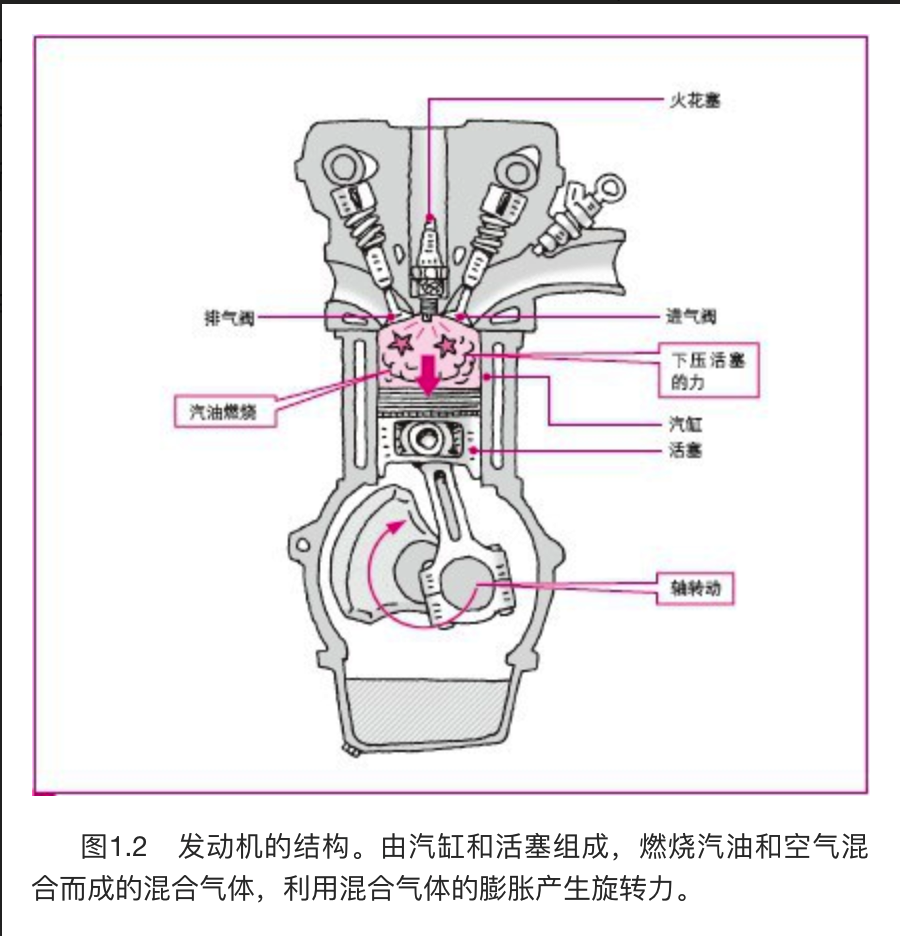
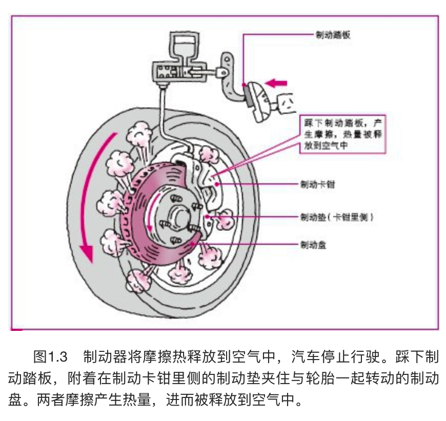

    作者: ［日］ 御堀直嗣 
    出版社: 人民邮电出版社
    原作名: クルマはなぜ走るのか
    译者: 卢扬 
    出版年: 2013-12
    页数: 296
    定价: 39.00
    装帧: 平装
    丛书: 图灵新知
    ISBN: 9787115330321

[豆瓣链接](https://book.douban.com/subject/25761310/)

## 第1章 汽车的五大要素
### 1.1 汽车的五大要素
`行驶`、`转向`和`停车`这三大要素，加上`舒适性`和`安全性`，构成了汽车的五大要素。

### 1.2 使汽车发动的物理原理

发动机中有汽缸和活塞，汽油在汽缸中的燃烧室内进行燃烧。由汽油和空气混合而成的混合气体被送入燃烧室内，燃烧发热后膨胀。

气体（混合气体）膨胀下压活塞，从而带动活塞下的轴转动。发动机输出的旋转力传递到轮胎，使轮胎转动。这样一来，汽车便“因热而动”了。

那么停车时又是怎样的呢？是用制动器使轮胎停止转动的。制动时，制动垫夹住与轮胎一起转动的制动盘。接着，盘和垫之间就会产生摩擦，摩擦产生热量（图1.3）。

这与天冷的时候摩擦双手就会暖和是一样的道理，因为双手摩擦会产生热量。制动盘与制动垫相互摩擦，生成的热量被释放到空气中。

这样一来，通过将旋转轮胎转化成的热量释放到空气中，使汽车减速直至停止。不只是汽车，自行车等的制动原理也是一样，即“因热而停”。

