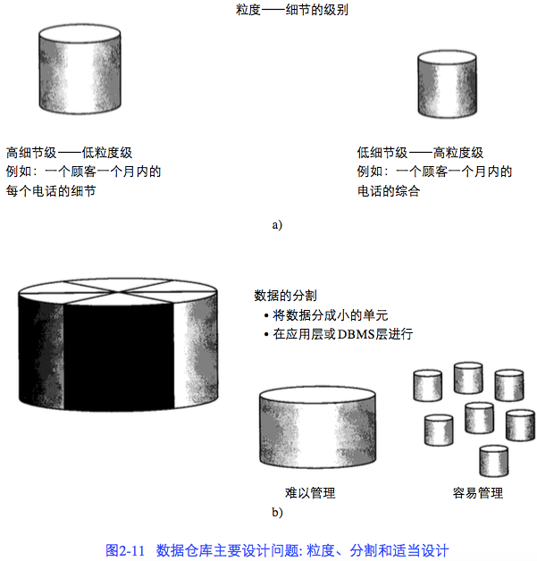
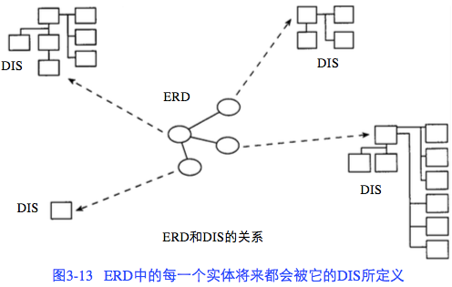
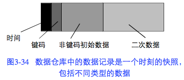
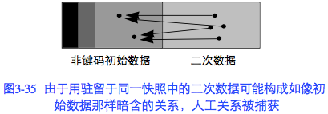
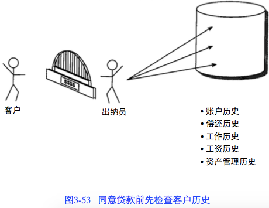
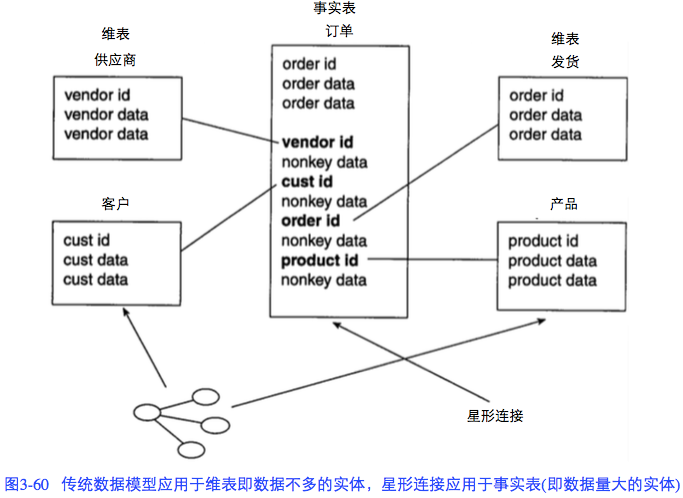

    作者: 荫蒙
    出版社: 机械工业出版社
    副标题: （原书第4版）
    原作名: Building the Data Warehouse
    译者: 王志海
    出版年: 2006-8-1
    页数: 311
    定价: 39.00元
    装帧: 平装
    丛书: 计算机科学丛书
    ISBN: 9787111191940

[豆瓣链接](https://book.douban.com/subject/1881631/)

- [第1章 决策支持系统的发展](#%e7%ac%ac1%e7%ab%a0-%e5%86%b3%e7%ad%96%e6%94%af%e6%8c%81%e7%b3%bb%e7%bb%9f%e7%9a%84%e5%8f%91%e5%b1%95)
- [第2章 数据仓库环境](#%e7%ac%ac2%e7%ab%a0-%e6%95%b0%e6%8d%ae%e4%bb%93%e5%ba%93%e7%8e%af%e5%a2%83)
  - [2.1 数据仓库的结构](#21-%e6%95%b0%e6%8d%ae%e4%bb%93%e5%ba%93%e7%9a%84%e7%bb%93%e6%9e%84)
  - [2.2 面向主题](#22-%e9%9d%a2%e5%90%91%e4%b8%bb%e9%a2%98)
  - [2.3 第1天到第n天的现象](#23-%e7%ac%ac1%e5%a4%a9%e5%88%b0%e7%ac%acn%e5%a4%a9%e7%9a%84%e7%8e%b0%e8%b1%a1)
  - [2.4 粒度](#24-%e7%b2%92%e5%ba%a6)
  - [2.5 探查与数据挖掘](#25-%e6%8e%a2%e6%9f%a5%e4%b8%8e%e6%95%b0%e6%8d%ae%e6%8c%96%e6%8e%98)
  - [2.6 活样本数据库](#26-%e6%b4%bb%e6%a0%b7%e6%9c%ac%e6%95%b0%e6%8d%ae%e5%ba%93)
  - [2.7 分区设计方法](#27-%e5%88%86%e5%8c%ba%e8%ae%be%e8%ae%a1%e6%96%b9%e6%b3%95)
  - [2.8 数据仓库中的数据组织](#28-%e6%95%b0%e6%8d%ae%e4%bb%93%e5%ba%93%e4%b8%ad%e7%9a%84%e6%95%b0%e6%8d%ae%e7%bb%84%e7%bb%87)
  - [2.9 审计与数据仓库](#29-%e5%ae%a1%e8%ae%a1%e4%b8%8e%e6%95%b0%e6%8d%ae%e4%bb%93%e5%ba%93)
  - [2.10 数据的同构/异构](#210-%e6%95%b0%e6%8d%ae%e7%9a%84%e5%90%8c%e6%9e%84%e5%bc%82%e6%9e%84)
  - [2.11 数据仓库中的数据清理](#211-%e6%95%b0%e6%8d%ae%e4%bb%93%e5%ba%93%e4%b8%ad%e7%9a%84%e6%95%b0%e6%8d%ae%e6%b8%85%e7%90%86)
  - [2.12 报表与体系结构化环境](#212-%e6%8a%a5%e8%a1%a8%e4%b8%8e%e4%bd%93%e7%b3%bb%e7%bb%93%e6%9e%84%e5%8c%96%e7%8e%af%e5%a2%83)
  - [2.13 各种环境中的操作型窗口](#213-%e5%90%84%e7%a7%8d%e7%8e%af%e5%a2%83%e4%b8%ad%e7%9a%84%e6%93%8d%e4%bd%9c%e5%9e%8b%e7%aa%97%e5%8f%a3)
  - [2.14 数据仓库中的错误数据](#214-%e6%95%b0%e6%8d%ae%e4%bb%93%e5%ba%93%e4%b8%ad%e7%9a%84%e9%94%99%e8%af%af%e6%95%b0%e6%8d%ae)
- [第3章 设计数据仓库](#%e7%ac%ac3%e7%ab%a0-%e8%ae%be%e8%ae%a1%e6%95%b0%e6%8d%ae%e4%bb%93%e5%ba%93)
  - [3.1 从操作型数据开始](#31-%e4%bb%8e%e6%93%8d%e4%bd%9c%e5%9e%8b%e6%95%b0%e6%8d%ae%e5%bc%80%e5%a7%8b)
  - [3.2 数据/过程模型与体系结构化环境](#32-%e6%95%b0%e6%8d%ae%e8%bf%87%e7%a8%8b%e6%a8%a1%e5%9e%8b%e4%b8%8e%e4%bd%93%e7%b3%bb%e7%bb%93%e6%9e%84%e5%8c%96%e7%8e%af%e5%a2%83)
  - [3.3 数据仓库与数据模型](#33-%e6%95%b0%e6%8d%ae%e4%bb%93%e5%ba%93%e4%b8%8e%e6%95%b0%e6%8d%ae%e6%a8%a1%e5%9e%8b)
  - [3.4 数据模型和反复开发](#34-%e6%95%b0%e6%8d%ae%e6%a8%a1%e5%9e%8b%e5%92%8c%e5%8f%8d%e5%a4%8d%e5%bc%80%e5%8f%91)
  - [3.5 规范化/反规范化](#35-%e8%a7%84%e8%8c%83%e5%8c%96%e5%8f%8d%e8%a7%84%e8%8c%83%e5%8c%96)
  - [3.6 元数据](#36-%e5%85%83%e6%95%b0%e6%8d%ae)
  - [3.7 数据周期-时间间隔](#37-%e6%95%b0%e6%8d%ae%e5%91%a8%e6%9c%9f-%e6%97%b6%e9%97%b4%e9%97%b4%e9%9a%94)
  - [3.8 转换和集成的复杂性](#38-%e8%bd%ac%e6%8d%a2%e5%92%8c%e9%9b%86%e6%88%90%e7%9a%84%e5%a4%8d%e6%9d%82%e6%80%a7)
  - [3.9 数据仓库记录的触发](#39-%e6%95%b0%e6%8d%ae%e4%bb%93%e5%ba%93%e8%ae%b0%e5%bd%95%e7%9a%84%e8%a7%a6%e5%8f%91)
  - [3.10 概要记录](#310-%e6%a6%82%e8%a6%81%e8%ae%b0%e5%bd%95)
  - [3.11 管理大量数据](#311-%e7%ae%a1%e7%90%86%e5%a4%a7%e9%87%8f%e6%95%b0%e6%8d%ae)
  - [3.12 创建多个概要记录](#312-%e5%88%9b%e5%bb%ba%e5%a4%9a%e4%b8%aa%e6%a6%82%e8%a6%81%e8%ae%b0%e5%bd%95)
  - [3.13 从数据仓库环境到操作型环境](#313-%e4%bb%8e%e6%95%b0%e6%8d%ae%e4%bb%93%e5%ba%93%e7%8e%af%e5%a2%83%e5%88%b0%e6%93%8d%e4%bd%9c%e5%9e%8b%e7%8e%af%e5%a2%83)
  - [3.14 数据仓库数据的直接操作型访问](#314-%e6%95%b0%e6%8d%ae%e4%bb%93%e5%ba%93%e6%95%b0%e6%8d%ae%e7%9a%84%e7%9b%b4%e6%8e%a5%e6%93%8d%e4%bd%9c%e5%9e%8b%e8%ae%bf%e9%97%ae)
  - [3.15 数据仓库数据的间接访问](#315-%e6%95%b0%e6%8d%ae%e4%bb%93%e5%ba%93%e6%95%b0%e6%8d%ae%e7%9a%84%e9%97%b4%e6%8e%a5%e8%ae%bf%e9%97%ae)
  - [3.16 数据仓库数据的间接使用](#316-%e6%95%b0%e6%8d%ae%e4%bb%93%e5%ba%93%e6%95%b0%e6%8d%ae%e7%9a%84%e9%97%b4%e6%8e%a5%e4%bd%bf%e7%94%a8)
  - [3.17 星形连接](#317-%e6%98%9f%e5%bd%a2%e8%bf%9e%e6%8e%a5)
  - [3.18 支持操作型数据存储](#318-%e6%94%af%e6%8c%81%e6%93%8d%e4%bd%9c%e5%9e%8b%e6%95%b0%e6%8d%ae%e5%ad%98%e5%82%a8)
  - [3.19 需求和Zachman框架](#319-%e9%9c%80%e6%b1%82%e5%92%8czachman%e6%a1%86%e6%9e%b6)

# 第1章 决策支持系统的发展
1. 决策支持系统(Decision Support System,DSS) p1
2. 信息管理系统(Information Management System,IMS) p6
3. 集成数据库管理系统(Integrated Database Management System, IDMS) p6

# 第2章 数据仓库环境
数据仓库的特点 p20

1. 面向主题性
1. 集成（多个数据源）
1. 非易失性
1. 随时间变化

## 2.1 数据仓库的结构
数据仓库环境中存在着不同的细节级 p23

- 早期细节级
- 当前细节级
- 轻度综合数据级（数据集市级）
- 高度综合数据级

## 2.2 面向主题
- 数据仓库面向在高层企业数据模型中已定义好的企业主题域。p23
- 访问概率高且存储空间小的数据存放在快速且相对昂贵的存储介质上;访问概率低且存 储空间大的数据存放在廉价、慢速的存储介质上。 p24
- “粒度转换”，综合级，细节级 p25

## 2.3 第1天到第n天的现象
建立数据仓库是进化的，而非革命性的 p26

## 2.4 粒度
粒度 p28

双重粒度级别 p32

## 2.5 探查与数据挖掘
数据仓库中粒度化的数据不但可以支持数据集市还可以支持探查与数据挖掘过程。 p34

## 2.6 活样本数据库
- 周期刷新，真实档案或轻度综合数据的一个子集 p34
- 判断样本（记录的选中标准）p35

## 2.7 分区设计方法
数据分区是指把数据分散到可独立处理的物理单元中 p35

## 2.8 数据仓库中的数据组织
- 简单堆积数据与轮转综合数据存储 p38
- 其他数据组织形式 p40
  - 简单堆积
  - 轮转综合
  - 简单直接
  - 连续

## 2.9 审计与数据仓库
即使能对数据仓库进行审计,也不应该从中进行审计。不进行这种审计的主要原因如下: p41

- 原先在数据仓库中没有的数据会突然出现。
- 当需要审计能力时,数据进入数据仓库的定时会发生急剧变化。
- 当需要审计能力时,数据仓库的备份和恢复限制会发生急剧变化。
- 在仓库中审计数据,会使仓库中数据的粒度处在一个非常的级别上。

## 2.10 数据的同构/异构
- 主题域 p41
- 对每一个主题域还有更细的划分 p41
- 数据仓库中数据的标准划分 p42
  - 主题域
  - 表
  - 数据在表中的出现

## 2.11 数据仓库中的数据清理
数据清理或数据细节转化主要有以下几种方式: p42

- 数据加入到失去原有细节的一个轮转综合文件中。
- 数据从高性能的介质 (如DASD) 转移到大容量介质上。
- 数据从系统中实际清除。
- 数据从体系结构的一个层次转到另一个层次,比如从操作型层次转到数据仓库层次。

## 2.12 报表与体系结构化环境
p43

## 2.13 各种环境中的操作型窗口
- 在数据仓库中,发现5~10年这样漫长的档案数据是很常见的。p44
- 在操作型环境中发现的档案数据的时间范围称之为数据的“操作型窗口”,它一般不很长,只能从一个星期到两年。p44

## 2.14 数据仓库中的错误数据
- 更新错误条目 p45
- 加入修正条目
- 重新设置正确值

# 第3章 设计数据仓库
## 3.1 从操作型数据开始
- 一致性处理 p48
- 编码不一致 p48
- 原有数据在不同的DBMS下可能以多种不同格式存储 p49
- 从操作型环境到数据仓库有三种装载工作要做：p49
  - 装载档案数据
  - 装载在操作型系统中的现有数据
  - 将上次数据仓库刷新以来在操作型环境中不断发生的变化（更新）从操作型环境中装载到数据仓库中

## 3.2 数据/过程模型与体系结构化环境
- 过程模型：仅仅适用于操作型环境 p51
- 数据模型：既可用于操作型环境，又可用于数据仓库环境 p51
- 过程模型一般（整个或部分地）包括一下内容：p51
  - 功能分解
  - 第零层上下文图
  - 数据流图
  - 结构图
  - 状态转换图
  - HIPO图
  - 伪代码

## 3.3 数据仓库与数据模型
- 稳定性分析 p52
- 有三个层次的数据建模:高层建模(ERD,实体关系层),中间层建模(DIS,数据项集),底层建模(物理层)。 p54

- 图3-14显示了中间层数据模型的构造。这里有四个基本的构造:
  - 初始数据组。
  - 二次数据组。
  - 连接件,表示主要主题域间的数据关系。
  - 数据“类型”。
  - 物理数据模型：关系表 p59

## 3.4 数据模型和反复开发
迭代开发方式 p60

## 3.5 规范化/反规范化
- 将这些表物理合并，使得I/O代价最小化 p62
- 创建数据数组 p62
- 有意引入冗余数据 p63
- 当访问概率有很大悬殊时,要对数据做进一步分离 p64
- 在物理数据库的设计中引入导出(即计算出的)数据可以减少I/O p64
- 创造性索引或创造性概要文件 p65
- 参照完整性 p65

- 数据仓库中的快照 p65

- 由事件触发的快照有四个基本组成部分：
  - 关键字
  - 时间单元
  - 只与关键字相关的主要数据
  - 作为快照过程的一部分而被捕获但与主要数据和关键字都无直接关系的二级数据
- 人工关系 p67

## 3.6 元数据
典型地,元数据记录: p67

- 程序员所知的数据结构。
- DSS分析员所知的数据结构。
- 数据仓库的源数据。
- 数据加入数据仓库时的转换。
- 数据模型。
- 数据模型和数据仓库的关系。
- 抽取数据的历史记录。

参照数据 p68

## 3.7 数据周期-时间间隔
数据周期：所谓数据周期是指从操作型环境数据发生改变起,到这个变化反映到数据仓库中所用的时间。p69

## 3.8 转换和集成的复杂性
下面就是所要 完成的某些功能。 p71

- 从原始操作型环境到数据仓库环境的数据抽取需要实现技术上的变化。
- 从操作型环境中选择数据是非常复杂的。为了判定一个记录是否可进行抽取处理,往 往需要完成对多个文件中其他记录的多种协调查询,需要进行键码读取,连接逻辑等。
- 操作型环境中的输入键码在输出到数据仓库之前往往需要重新建立。
- 数据被重新格式化。举一个简单例子:有关日期的输入数据格式是YY/MM/DD,当它被写入输出文件时,需要转化为DD/MM/YY的格式。
- 数据将被清理。在某些情况下,为了保证输入数据的正确性,需要一个简单的算法。 在复杂情况下,需要调用人工智能的一些子程序把输入数据清理为可接受的输出形式。
- 存在多个输入数据源。
- 当存在多个输入文件时,进行文件合并之前要首先进行键码解析。这意味着如果不同 的输入文件使用不同的键码结构。那么,完成文件合并的程序必须提供键码解析功能。
- 当存在多个输入文件时,这些文件的顺序可能不相同甚至互不相容。
- 可能会产生多个输出结果。同一个数据仓库的创建程序会产生不同概括层次之上的结果。
- 需要提供缺省值。
- 对抽取选择输入的数据,其效率通常是一个问题。
- 经常需要进行数据的汇总。
- 在数据元素从操作型环境到数据仓库的数据转移过程中,对数据元素的重命名应该进行跟踪。
- 必须被读的输入的记录有着不常见的或不标准的格式。下面列出了必须读的各种输入类型:
  - 固定长度的记录
  - 不定长记录
  - 出现不定
  - 重复出现
  - 必须进行转换。
- 这一点也许是最糟糕的:建立在旧的传统程序逻辑中的数据之间的关系必须被理解、被解开,这样,这些文件才能被用来作为输入。而这些关系常常是深奥难懂的,没有可供参考的文档资料。
- 必须进行数据格式的转换。EBCDIC到ASCII的转换(或反过来)必须进行。
- 必须考虑到进行大容量输入的问题。
- 数据仓库的设计必须符合企业数据模型。
- 数据仓库反映的是对信息的历史需求,而操作型环境是体现对信息目前的需求。
- 数据仓库着眼于企业的信息化需求,而操作型环境则着眼于精确到秒的企业日常事务需求。
- 必须考虑到新创建的将要传入数据仓库的输出文件的传输。有些情况下这是很容易做到的;在另一些情况下就不那么容易了,尤其是跨操作系统的情况。

## 3.9 数据仓库记录的触发
p73

## 3.10 概要记录
p74

## 3.11 管理大量数据
p75

- 首先，只要进行了数据聚集，就会丢失一些细节数据。有时，丢失细节数据并不一定是件坏事。
- 在建立概要记录的同时建立历史细节的备用层。

## 3.12 创建多个概要记录
当概要记录放在操作型数据存储区（Operational Data Store，ODS），可以以OLTP的方式存取。p76

## 3.13 从数据仓库环境到操作型环境
p76

也可以存在数据“回流”。

## 3.14 数据仓库数据的直接操作型访问
p77

有一些严格的、不能让步的限制：
- 从响应时间的角度来讲,这个请求必须能够忍受冗长的响应时间。它可能在经过24个小时后才被响应,这意味着请求数据仓库数据的操作处理并不具有在线特性。
- 所请求的数据量必须是最小量的。数据的传输是以字节计的,而不是兆字节或千兆字节。
- 管理数据仓库所用到的技术必须与管理操作型环境所用到的技术一致,如容量、协议等。
- 从数据仓库取得的准备传输到操作型环境的数据必须不做或做最小的格式化。

## 3.15 数据仓库数据的间接访问
航班公司的佣金计算系统 p78

零售个性化系统 p79

信用审核 p81

## 3.16 数据仓库数据的间接使用
下面是间接使用数据仓库数据时应考虑的因素。p82

- 分析程序:
  - 拥有许多人工智能的特征。
  - 可以运行在任何可用的数据仓库中。
  - 在后台运行,这样处理时间就不是一个问题(至少不是一个大问题)。
  - 程序的运行与数据仓库发生变化的速度一致。
- 周期性刷新
  - 不是经常进行。
  - 采用一种替代模式操作。
  - 从支持数据仓库的技术传送数据到支持操作型环境的技术。
- 联机预分析数据文件
  - 每个数据单元仅仅包括少量的数据。
  - 总体上可以包含大量的数据(因为可以有很多的数据单元)。
  - 准确地包含了联机处理人员所需要的东西。
  - 不被修改,但是定期全部刷新。
  - 是联机高性能环境的一部分。
  - 访问效率高。
  - 可以访问单个数据单元,而不是以块的形式访问数据。

## 3.17 星形连接
数据集市 p83
- 数据集市很大程度上是根据需求来形成的，这与数据仓库不同。
- 首先要对自数据集市上进行的处理的需求有很多了解。

数据仓库 p83
- 数据仓库是为一个非常大的群体服务的，正因为如此，数据仓库对于任何一个需求集合而言，性能和便捷性都不是最优的。

星形连接 p83
- 用来管理载入数据集市中某个实体的大量数据的设计结构。
- 行星连接中央的“订单”称作“事实表”。
- 周围的其他实体（“零件”、“日期”、“供应商”和“发货”）称作“维表”。

- 文本数据常常出现在维表中，数值数据常出现在事实表中。p84
- 通过预连接数据和建立有选择的数据冗余，设计者大大简化和调整访问和分析的数据，这正是数据集市所需要的。p84
- 数据仓库中的数据是粒度化的数据集市中的数据是紧凑和综合的。数据必须周期性地从数据仓库移到数据集市。p85

## 3.18 支持操作型数据存储
操作型数据存储（ODS）有四类：

1. 从操作型环境到ODS的数据更新是同步进行的。
2. 操作型环境与ODS的数据更新之间有2-3个小时的间隔。
3. 操作型环境与ODS的数据更新的同步是在夜间完成的。
4. 从数据仓库到这类ODS的更新是不预先规化的。

## 3.19 需求和Zachman框架
p87

1. 数据仓库不是由处理需求建造成的，而是根据企业需求而设计的。
1. 聚集和组织企业需求的最好的办法之一是叫做Zachman框架的方法。

