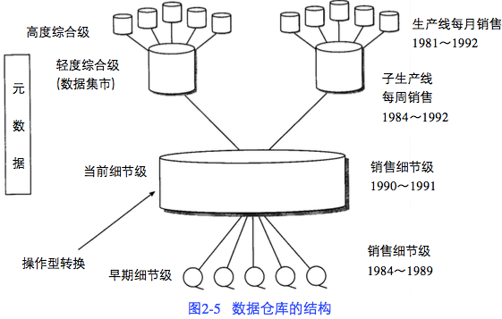

    作者: 荫蒙
    出版社: 机械工业出版社
    副标题: （原书第4版）
    原作名: Building the Data Warehouse
    译者: 王志海
    出版年: 2006-8-1
    页数: 311
    定价: 39.00元
    装帧: 平装
    丛书: 计算机科学丛书
    ISBN: 9787111191940

[豆瓣链接](https://book.douban.com/subject/1881631/)

- [第1章 决策支持系统的发展](#%e7%ac%ac1%e7%ab%a0-%e5%86%b3%e7%ad%96%e6%94%af%e6%8c%81%e7%b3%bb%e7%bb%9f%e7%9a%84%e5%8f%91%e5%b1%95)
- [第2章 数据仓库环境](#%e7%ac%ac2%e7%ab%a0-%e6%95%b0%e6%8d%ae%e4%bb%93%e5%ba%93%e7%8e%af%e5%a2%83)
  - [2.1 数据仓库的结构](#21-%e6%95%b0%e6%8d%ae%e4%bb%93%e5%ba%93%e7%9a%84%e7%bb%93%e6%9e%84)
  - [2.2 面向主题](#22-%e9%9d%a2%e5%90%91%e4%b8%bb%e9%a2%98)
  - [2.3 第1天到第n天的现象](#23-%e7%ac%ac1%e5%a4%a9%e5%88%b0%e7%ac%acn%e5%a4%a9%e7%9a%84%e7%8e%b0%e8%b1%a1)
  - [2.4 粒度](#24-%e7%b2%92%e5%ba%a6)
  - [2.5 探查与数据挖掘](#25-%e6%8e%a2%e6%9f%a5%e4%b8%8e%e6%95%b0%e6%8d%ae%e6%8c%96%e6%8e%98)
  - [2.6 活样本数据库](#26-%e6%b4%bb%e6%a0%b7%e6%9c%ac%e6%95%b0%e6%8d%ae%e5%ba%93)
  - [2.7 分区设计方法](#27-%e5%88%86%e5%8c%ba%e8%ae%be%e8%ae%a1%e6%96%b9%e6%b3%95)
  - [2.8 数据仓库中的数据组织](#28-%e6%95%b0%e6%8d%ae%e4%bb%93%e5%ba%93%e4%b8%ad%e7%9a%84%e6%95%b0%e6%8d%ae%e7%bb%84%e7%bb%87)
  - [2.9 审计与数据仓库](#29-%e5%ae%a1%e8%ae%a1%e4%b8%8e%e6%95%b0%e6%8d%ae%e4%bb%93%e5%ba%93)
  - [2.10 数据的同构/异构](#210-%e6%95%b0%e6%8d%ae%e7%9a%84%e5%90%8c%e6%9e%84%e5%bc%82%e6%9e%84)
  - [2.11 数据仓库中的数据清理](#211-%e6%95%b0%e6%8d%ae%e4%bb%93%e5%ba%93%e4%b8%ad%e7%9a%84%e6%95%b0%e6%8d%ae%e6%b8%85%e7%90%86)
  - [2.12 报表与体系结构化环境](#212-%e6%8a%a5%e8%a1%a8%e4%b8%8e%e4%bd%93%e7%b3%bb%e7%bb%93%e6%9e%84%e5%8c%96%e7%8e%af%e5%a2%83)
  - [2.13 各种环境中的操作型窗口](#213-%e5%90%84%e7%a7%8d%e7%8e%af%e5%a2%83%e4%b8%ad%e7%9a%84%e6%93%8d%e4%bd%9c%e5%9e%8b%e7%aa%97%e5%8f%a3)
  - [2.14 数据仓库中的错误数据](#214-%e6%95%b0%e6%8d%ae%e4%bb%93%e5%ba%93%e4%b8%ad%e7%9a%84%e9%94%99%e8%af%af%e6%95%b0%e6%8d%ae)

# 第1章 决策支持系统的发展
1. 决策支持系统(Decision Support System,DSS) p1
2. 信息管理系统(Information Management System,IMS) p6
3. 集成数据库管理系统(Integrated Database Management System, IDMS) p6

# 第2章 数据仓库环境
数据仓库的特点 p20

1. 面向主题性
1. 集成（多个数据源）
1. 非易失性
1. 随时间变化

## 2.1 数据仓库的结构
数据仓库环境中存在着不同的细节级 p23

- 早期细节级
- 当前细节级
- 轻度综合数据级（数据集市级）
- 高度综合数据级

## 2.2 面向主题
- 数据仓库面向在高层企业数据模型中已定义好的企业主题域。p23
- 访问概率高且存储空间小的数据存放在快速且相对昂贵的存储介质上;访问概率低且存 储空间大的数据存放在廉价、慢速的存储介质上。 p24
- “粒度转换”，综合级，细节级 p25

## 2.3 第1天到第n天的现象
建立数据仓库是进化的，而非革命性的 p26

## 2.4 粒度
粒度 p28

双重粒度级别 p32

## 2.5 探查与数据挖掘
数据仓库中粒度化的数据不但可以支持数据集市还可以支持探查与数据挖掘过程。 p34

## 2.6 活样本数据库
- 周期刷新，真实档案或轻度综合数据的一个子集 p34
- 判断样本（记录的选中标准）p35

## 2.7 分区设计方法
数据分区是指把数据分散到可独立处理的物理单元中 p35

## 2.8 数据仓库中的数据组织
- 简单堆积数据与轮转综合数据存储 p38
- 其他数据组织形式 p40
  - 简单堆积
  - 轮转综合
  - 简单直接
  - 连续

## 2.9 审计与数据仓库
即使能对数据仓库进行审计,也不应该从中进行审计。不进行这种审计的主要原因如下: p41

- 原先在数据仓库中没有的数据会突然出现。
- 当需要审计能力时,数据进入数据仓库的定时会发生急剧变化。
- 当需要审计能力时,数据仓库的备份和恢复限制会发生急剧变化。
- 在仓库中审计数据,会使仓库中数据的粒度处在一个非常的级别上。

## 2.10 数据的同构/异构
- 主题域 p41
- 对每一个主题域还有更细的划分 p41
- 数据仓库中数据的标准划分 p42
  - 主题域
  - 表
  - 数据在表中的出现

## 2.11 数据仓库中的数据清理
数据清理或数据细节转化主要有以下几种方式: p42

- 数据加入到失去原有细节的一个轮转综合文件中。
- 数据从高性能的介质 (如DASD) 转移到大容量介质上。
- 数据从系统中实际清除。
- 数据从体系结构的一个层次转到另一个层次,比如从操作型层次转到数据仓库层次。

## 2.12 报表与体系结构化环境
p43

## 2.13 各种环境中的操作型窗口
- 在数据仓库中,发现5~10年这样漫长的档案数据是很常见的。p44
- 在操作型环境中发现的档案数据的时间范围称之为数据的“操作型窗口”,它一般不很长,只能从一个星期到两年。p44

## 2.14 数据仓库中的错误数据
- 更新错误条目 p45
- 加入修正条目
- 重新设置正确值

