    作者: Jeff Nickoloff
    出版社: Manning Publications
    出版年: 2016-3-31
    页数: 300
    定价: USD 49.99
    装帧: Paperback
    ISBN: 9781633430235

[豆瓣链接](https://book.douban.com/subject/26409789/)

- [Welcome to Docker](#welcome-to-docker)
  - [What is Docker?](#what-is-docker)
    - [Containers are not virtualization](#containers-are-not-virtualization)
    - [Running software in containers for isolation](#running-software-in-containers-for-isolation)
  - [What problems does Docker solve](#what-problems-does-docker-solve)
    - [Getting organized](#getting-organized)
    - [Improving portability](#improving-portability)
    - [Protecting your computer](#protecting-your-computer)
  - [Example: “Hello, World”](#example-hello-world)
- [Running software in containers](#running-software-in-containers)
  - [Getting help with the Docker command line](#getting-help-with-the-docker-command-line)
  - [Controlling containers: building a website monitor](#controlling-containers-building-a-website-monitor)
    - [Creating and starting a new container](#creating-and-starting-a-new-container)
    - [Running interactive containers](#running-interactive-containers)
    - [Listing, stopping, restarting, and viewing output of containers](#listing-stopping-restarting-and-viewing-output-of-containers)
  - [Solved problems and the PID namespace](#solved-problems-and-the-pid-namespace)
  - [Eliminating metaconflicts: building a website farm](#eliminating-metaconflicts-building-a-website-farm)
    - [Flexible container identification](#flexible-container-identification)
    - [Container state and dependencies](#container-state-and-dependencies)
  - [Building environment-agnostic systems](#building-environment-agnostic-systems)
    - [Read-only file systems](#read-only-file-systems)
    - [Environment variable injection](#environment-variable-injection)
  - [Building durable containers](#building-durable-containers)
    - [Automatically restarting containers](#automatically-restarting-containers)
    - [Keeping containers running with supervisor and startup processes](#keeping-containers-running-with-supervisor-and-startup-processes)
  - [Cleaning up](#cleaning-up)
- [Software installation simplified](#software-installation-simplified)
  - [Identifying software](#identifying-software)
    - [What is a repository?](#what-is-a-repository)
    - [Using tags](#using-tags)
  - [Finding and installing software](#finding-and-installing-software)
    - [Docker Hub from the command line](#docker-hub-from-the-command-line)
    - [Using alternative registries](#using-alternative-registries)
    - [Images as files](#images-as-files)
    - [Installing from a Dockerfile](#installing-from-a-dockerfile)
  - [Installation files and isolation](#installation-files-and-isolation)
    - [Image layers in action](#image-layers-in-action)
    - [Layer relationships](#layer-relationships)
    - [Container file system abstraction and isolation](#container-file-system-abstraction-and-isolation)
- [Persistent storage and shared state with volumes](#persistent-storage-and-shared-state-with-volumes)
  - [Introducing volumes](#introducing-volumes)
    - [Volumes provide container-independent data management](#volumes-provide-container-independent-data-management)
    - [Using volumes with a NoSQL database](#using-volumes-with-a-nosql-database)
  - [Volume types](#volume-types)
    - [Bind mount volumes](#bind-mount-volumes)
    - [Docker-managed volumes](#docker-managed-volumes)
  - [Sharing volumes](#sharing-volumes)
    - [Host-dependent sharing](#host-dependent-sharing)
    - [Generalized sharing and the volumes-from flag](#generalized-sharing-and-the-volumes-from-flag)
  - [The managed volume life cycle](#the-managed-volume-life-cycle)
    - [Volume ownership](#volume-ownership)
    - [Cleaning up volumes](#cleaning-up-volumes)
  - [Advanced container patterns with volumes](#advanced-container-patterns-with-volumes)
    - [Volume container pattern](#volume-container-pattern)
    - [Data-packed volume containers](#data-packed-volume-containers)
    - [Polymorphic container pattern](#polymorphic-container-pattern)
- [Network exposure](#network-exposure)
  - [Networking background](#networking-background)
    - [Basics: protocols, interfaces, and ports](#basics-protocols-interfaces-and-ports)
    - [Bigger picture: networks, NAT, and port forwarding](#bigger-picture-networks-nat-and-port-forwarding)
  - [Docker container networking](#docker-container-networking)
    - [The local Docker network topology](#the-local-docker-network-topology)
    - [Four network container archetypes](#four-network-container-archetypes)
  - [Closed containers](#closed-containers)
  - [Bridged containers](#bridged-containers)
    - [Reaching out](#reaching-out)
    - [Custom name resolution](#custom-name-resolution)
    - [Opening inbound communication](#opening-inbound-communication)
    - [Inter-container communication](#inter-container-communication)
    - [Modifying the bridge interface](#modifying-the-bridge-interface)
  - [Joined containers](#joined-containers)
    - [The best reasons to use joined containers](#the-best-reasons-to-use-joined-containers)
  - [Open containers](#open-containers)
  - [Inter-container dependencies](#inter-container-dependencies)
    - [Introducing links for local service discovery](#introducing-links-for-local-service-discovery)
    - [Link aliases](#link-aliases)
    - [Environment modifications](#environment-modifications)
    - [Link nature and shortcomings](#link-nature-and-shortcomings)
- [Limiting risk with isolation](#limiting-risk-with-isolation)
  - [Resource allowances](#resource-allowances)
    - [Memory limits](#memory-limits)
    - [CPU](#cpu)
    - [Access to devices](#access-to-devices)
  - [Shared memory](#shared-memory)
    - [Using an open memory container](#using-an-open-memory-container)
  - [Understanding users](#understanding-users)
    - [Introduction to the Linux user namespace](#introduction-to-the-linux-user-namespace)
    - [Working with the run-as user](#working-with-the-run-as-user)
    - [Users and volumes](#users-and-volumes)
  - [Adjusting OS feature access with capabilities](#adjusting-os-feature-access-with-capabilities)
  - [Running a container with full privileges](#running-a-container-with-full-privileges)
  - [Stronger containers with enhanced tools](#stronger-containers-with-enhanced-tools)
    - [Specifying additional security options](#specifying-additional-security-options)
    - [Fine-tuning with LXC](#fine-tuning-with-lxc)
- [Packaging software in images](#packaging-software-in-images)
  - [Building Docker images from a container](#building-docker-images-from-a-container)
    - [Packaging Hello World](#packaging-hello-world)
    - [Preparing packaging for Git](#preparing-packaging-for-git)
    - [Reviewing file system changes](#reviewing-file-system-changes)
    - [Committing a new image](#committing-a-new-image)
    - [Configurable image attributes](#configurable-image-attributes)
  - [Going deep on Docker images and layers](#going-deep-on-docker-images-and-layers)
    - [An exploration of union file systems](#an-exploration-of-union-file-systems)
    - [Reintroducing images, layers, repositories, and tags](#reintroducing-images-layers-repositories-and-tags)
    - [Managing image size and layer limits](#managing-image-size-and-layer-limits)
  - [Exporting and importing flat file systems](#exporting-and-importing-flat-file-systems)
  - [Versioning best practices](#versioning-best-practices)
- [Build automation and advanced image considerations](#build-automation-and-advanced-image-considerations)
  - [Packaging Git with a Dockerfile](#packaging-git-with-a-dockerfile)
  - [A Dockerfile primer](#a-dockerfile-primer)
    - [Metadata instructions](#metadata-instructions)
    - [File system instructions](#file-system-instructions)
  - [Injecting downstream build-time behavior](#injecting-downstream-build-time-behavior)
  - [Using startup scripts and multiprocess containers](#using-startup-scripts-and-multiprocess-containers)
    - [Environmental preconditions validation](#environmental-preconditions-validation)
    - [Initialization processes](#initialization-processes)
  - [Building hardened application images](#building-hardened-application-images)

# Welcome to Docker
## What is Docker?
### Containers are not virtualization
Virtual machines provide virtual hardware on which an operating system and other programs can be installed. They take a long time (often minutes) to create and require significant resource overhead because they run a whole copy of an operating system in addition to the software you want to use.

Unlike virtual machines, Docker containers don’t use hardware virtualization. Programs running inside Docker containers interface directly with the host’s Linux kernel. Because there’s no additional layer between the program running inside the container and the computer’s operating system, no resources are wasted by running redundant software or simulating virtual hardware.

### Running software in containers for isolation


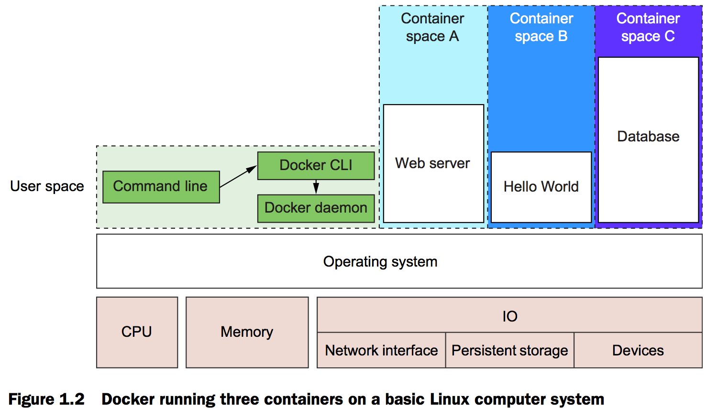

Figure 1.2 also shows three running containers. Each is running as a child process of the `Docker daemon`, wrapped with a container, and the delegate process is running in its own memory subspace of the user space. **Programs running inside a container can access only their own memory and resources as scoped by the container.**

The containers that Docker builds are isolated with respect to eight aspects.The specific aspects are as follows:

- PID namespace—Process identifiers and capabilities
- UTS namespace—Host and domain name
- MNT namespace—File system access and structure
- IPC namespace—Process communication over shared memory
- NET namespace—Network access and structure
- USR namespace—User names and identifiers
- chroot()—Controls the location of the file system root
- cgroups—Resource protection

A `Docker image` is a bundled snapshot of all the files that should be available to a program running inside a container. You can create as many containers from an image as you want. But when you do, containers that were started from the same image don’t share changes to their file system. When you distribute software with Docker, you distribute these images, and the receiving computers create containers from them. Images are the shippable units in the Docker ecosystem.

## What problems does Docker solve
### Getting organized
Today, without Docker, applications are spread all over the file system and end up creating a messy web of interactions.


Docker keeps things organized by isolating everything with containers and images.

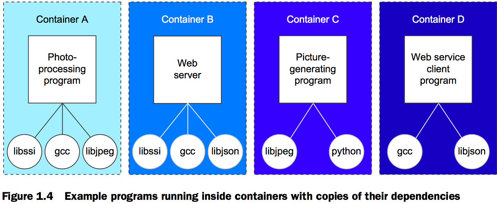

### Improving portability
At present, Docker runs natively on Linux and comes with a single virtual machine for OS X and Windows environments.

### Protecting your computer
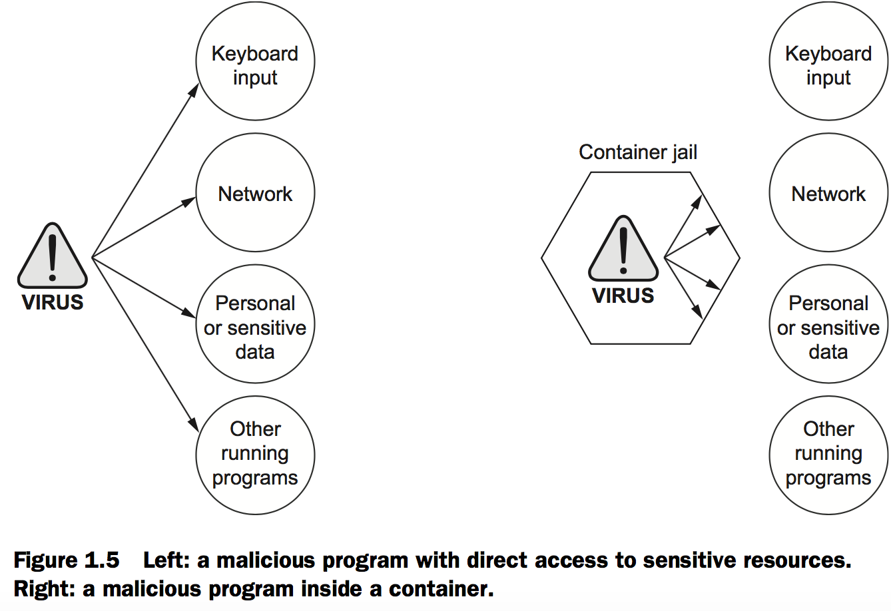

## Example: “Hello, World”
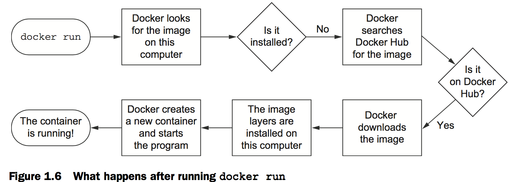


# Running software in containers
## Getting help with the Docker command line
`docker help` gives you only high-level information about what commands are available. To get detailed information about a specific command, include the command in the COMMAND argument.

```
docker help cp
```

That will display a usage pattern for `docker cp`, a general description of what the command does, and a detailed breakdown of its arguments.

## Controlling containers: building a website monitor
This example uses three containers. The first will run NGINX; the second will run a program called a mailer. Both of these will run as detached containers. `Detached` means that the container will run in the background, without being attached to any input or output stream. A third program, called an agent, will run in an interactive container.

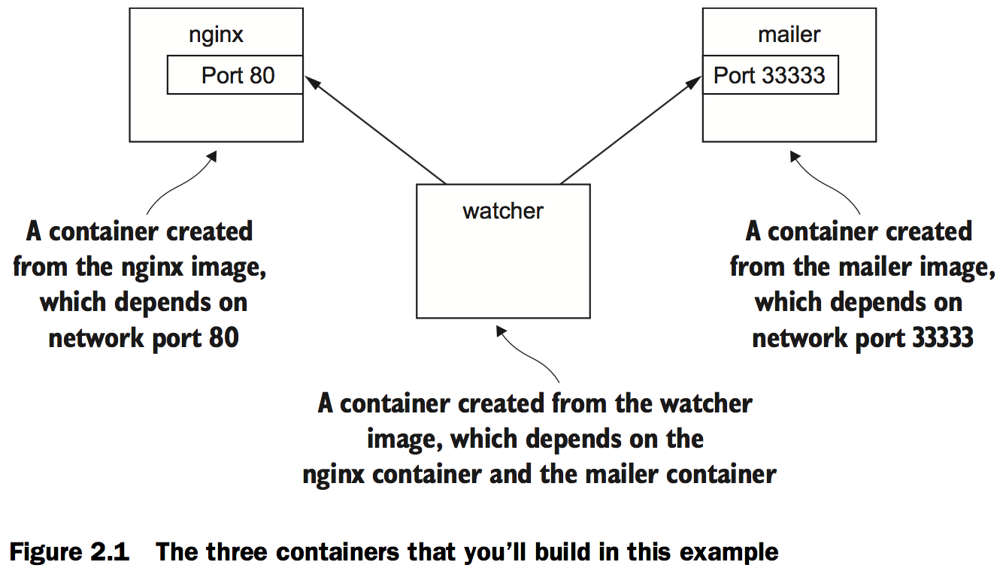

### Creating and starting a new container

```
docker run --detach \
    --name web nginx:latest # Note the detach flag
```

When you run this command, Docker will install nginx:latest from the NGINX repository hosted on Docker Hub and run the software.

Running detached containers is a perfect fit for programs that sit quietly in the background. That type of program is called a `daemon`.

```
docker run -d \
    --name mailer \ # Start detached
```

This command uses the short form of the `--detach` flag to start a new container named mailer in the background.

### Running interactive containers
```
docker run --interactive --tty \
    --link web:web \
    --name web_test \
    busybox:latest /bin/sh # Create a virtual terminal and bin stdin
```

The command uses two flags on the `run` command: --interactive (or -i) and –-tty (or –t). First, the `--interactive` option tells Docker to keep the standard input stream (stdin) open for the container even if no terminal is attached. Second, the `--tty` option tells Docker to allocate a virtual terminal for the container, which will allow you to pass signals to the container.

To finish the work for your client, you need to start an agent. This is a monitoring agent that will test the web server as you did in the last example and send a message with the mailer if the web server stops.

```
docker run -it \
    --name agent \
    --link web:insideweb \
    --link mailer:insidemailer \
    dockerinaction/ch2_agent # Create a virtual terminal and bind stdin
```

### Listing, stopping, restarting, and viewing output of containers
```
docker ps
```

Running the command will display the following information about each running container:
* The container ID
* The image used
* The command executed in the container
* The time since the container was created
* The duration that the container has been running
* The network ports exposed by the container
* The name of the container

At this point you should have three running containers with names: web, mailer, and agent.

Choose the appropriate ones to restart the containers that were missing from the list of running containers.

```
docker restart web
docker restart mailer
docker restart agent
```

Examine the logs for each container. Start with the web container:

```
docker logs web
```

That should display a long log with several lines that contain this substring:

```
"GET / HTTP/1.0" 200
```

Examine the log output for mailer and agent as well:

```
docker logs mailer
docker logs agent
```

The `docker logs` command has a flag, `--follow` or `-f`, that will display the logs and then continue watching and updating the display with changes to the log as they occur.

The `docker stop` command tells the program with PID #1 in the container to halt.

```
docker stop web    # Stop the web server by stopping the container
docker logs mailer # Wait a couple seconds and check the mailer logs
```

Look for a line at the end of the mailer logs that reads like:

```
“Sending email: To: admin@work  Message: The service is down!”
```

## Solved problems and the PID namespace
```
docker run -d --name namespaceA \
    busybox:latest /bin/sh -c "sleep 30000"
docker run -d --name namespaceB \
    busybox:latest /bin/sh -c "nc -l -p 0.0.0.0:80"


docker exec namespaceA ps # 1
docker exec namespaceB ps # 2
```

Command 1 above should generate a process list similar to the following:

```
PID   USER     COMMAND
  1   root     /bin/sh -c sleep 30000
  5   root     sleep 30000
  6   root     ps
```

Command 2 above should generate a slightly different process list:

```
PID   USER     COMMAND
  1   root     /bin/sh -c nc -l -p 0.0.0.0:80
  7   root     nc -l -p 0.0.0.0:80
  8   root     ps
```

Without a PID namespace, the processes running inside a container would share the same ID space as those in other containers or on the host. A container would be able to determine what other processes were running on the host machine. Worse, namespaces transform many authorization decisions into domain decisions. That means processes in one container might be able to control processes in other containers.

Like most Docker isolation features, you can optionally create containers without their own PID namespace. You can try this yourself by setting the `--pid` flag on `docker create` or `docker run` and setting the value to host.

```
docker run --pid host busybox:latest ps # Should list all processes running on the computer
```

This is a basic software conflict example. You can see it in action by trying to run two copies of NGINX in the same container:

```
docker run –d --name webConflict nginx:latest
docker logs webConflict # The output should be empty
docker exec webConflict nginx -g 'daemon off;' # Start a second nginx process in the same container
```

The last command should display output like:

```
2015/03/29 22:04:35 [emerg] 10#0: bind() to 0.0.0.0:80 failed (98:
Address already in use)
nginx: [emerg] bind() to 0.0.0.0:80 failed (98: Address already in use)
...
```

Run each in a different container, like this:

```
docker run -d --name webA nginx:latest # Start the first nginx instance
docker logs webA                       # Verify that it is working, should be empty
docker run -d --name webB nginx:latest # Start the second instance
docker logs webB                       # Verify that it is working, should be empty
```

## Eliminating metaconflicts: building a website farm
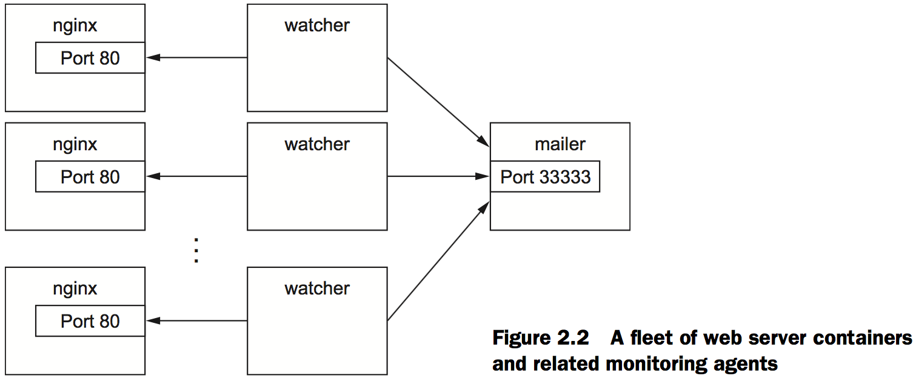

### Flexible container identification
```
docker run -d --name webid nginx # Create a container named "webid"
docker run -d --name webid nginx # Create another container named "webid"
```

The second command here will fail with a conflict error:

```
FATA[0000] Error response from daemon: Conflict. The name "webid" is
already in use by container 2b5958ba6a00. You have to delete (or rename)
that container to be able to reuse that name.
```

By default Docker assigns a unique (human-friendly) name to each container it creates. You can always rename the container with the `docker rename` command:

```
docker rename webid webid-old    # Rename the current web container to "webid-old"
docker run -d --name webid nginx # Create another container named "webid"
```

In addition to the name, Docker assigns a unique identifier that was mentioned in the first example. These are hex-encoded 1024-bit numbers and look something like this:

```
7cb5d2b9a7eab87f07182b5bf58936c9947890995b1b94f412912fa822a9ecb5
```

You can use these identifiers in place of the container name with any command that needs to identify a specific container. For example, you could use the previous ID with a `stop` or `exec` command:

```
docker exec \
    7cb5d2b9a7eab87f07182b5bf58936c9947890995b1b94f412912fa822a9ecb5 \
ps
docker stop \
    7cb5d2b9a7eab87f07182b5bf58936c9947890995b1b94f412912fa822a9ecb5
```

In most Docker interfaces, you’ll see container IDs truncated to their first 12 characters. So the previous two commands could be written like this:

```
docker exec 7cb5d2b9a7ea ps
docker stop 7cb5d2b9a7ea
```

When a new container is started in detached mode, the container ID will be written to the terminal (stdout).

```
docker create nginx
```

The result should be a line like:

```
b26a631e536d3caae348e9fd36e7661254a11511eb2274fb55f9f7c788721b0d
```

You can simply assign that result to a shell variable and use it again later:

```
CID=$(docker create nginx:latest) # This will work on POSIX-compliant shells
echo $CID
```

Both the `docker run` and `docker create` commands provide another flag to write the ID of a new container to a known file:

```
docker create --cidfile /tmp/web.cid nginx # Create a new stopped container
cat /tmp/web.cid                           # Inspect the file
```

For example, if you want to get the truncated ID of the last created container, you can use this:

```
CID=$(docker ps --latest --quiet) # This will work on POSIX-compliant shells
echo $CID

CID=$(docker ps -l –q)            # Run again with the short-form flags
echo $CID
```

If you want to get the full container ID, you can use the `--no-trunc` option on the `docker ps` command.

### Container state and dependencies
```
MAILER_CID=$(docker run -d dockerinaction/ch2_mailer) # Make sure mailer from first example is running
WEB_CID=$(docker create nginx)
AGENT_CID=$(docker create --link $WEB_CID:insideweb \
    --link $MAILER_CID:insidemailer \
    dockerinaction/ch2_agent)
```

Neither of the new containers you started appears in the list of containers because docker ps shows only running containers by default. Those containers were specifically created with `docker create` and never started (the exited state). To see all the containers (including those in the exited state), use the `-a` option:

```
docker ps -a
```

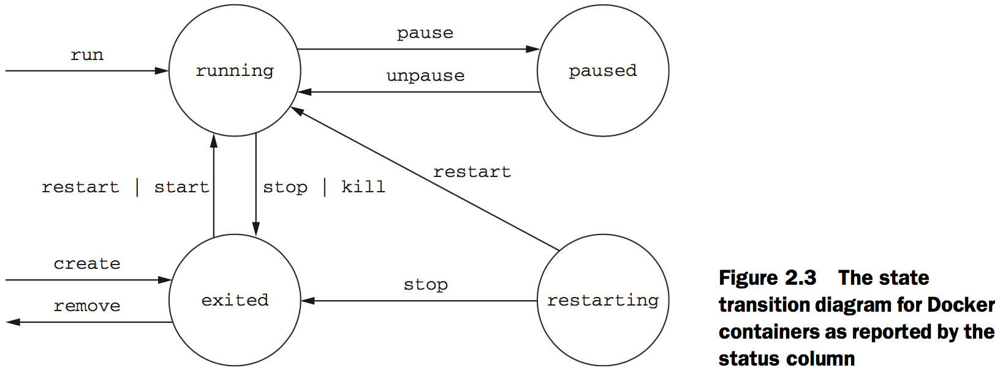

Now that you’ve verified that both of the containers were created, you need to start
them. For that you can use the `docker start` command:

```
docker start $AGENT_CID
docker start $WEB_CID
```

Docker reported a message like this one:

```
Error response from daemon: Cannot start container 03e65e3c6ee34e714665a8dc4e33fb19257d11402b151380ed4c0a5e38779d0a: Cannot link to a non running container: /clever_wright AS /modest_hopper/ insideweb
FATA[0000] Error: failed to start one or more containers
```

You need to start the web container first:

```
docker start $WEB_CID
docker start $AGENT_CID
```

The `link mechanism` injects IP addresses into dependent containers, and containers that aren’t running don’t have IP addresses.

Whether you’re using `docker run` or `docker create`, the resulting containers need to be started in the reverse order of their dependency chain.

At this point you can put everything together into one concise script that looks like the following:

```
MAILER_CID=$(docker run -d dockerinaction/ch2_mailer)
WEB_CID=$(docker run -d nginx)
AGENT_CID=$(docker run -d \
    --link $WEB_CID:insideweb \
    --link $MAILER_CID:insidemailer \
    dockerinaction/ch2_agent)
```

## Building environment-agnostic systems
Docker has three specific features to help build environment-agnostic systems:
* Read-only file systems
* Environment variable injection
* Volumes

### Read-only file systems
Using the `--read-only` flag:
```
docker run -d --name wp --read-only wordpress:4
docker inspect --format "{{.State.Running}}" wp
```

The `docker inspect` command will display all the metadata (a JSON document) that Docker maintains for a container.

In this case, the container isn’t running. To determine why, examine the logs for the container:

```
docker logs wp
```

That should output something like:

```
error: missing WORDPRESS_DB_HOST and MYSQL_PORT_3306_TCP environment variables
Did you forget to --link some_mysql_container:mysql or set an external db with -e WORDPRESS_DB_HOST=hostname:port?
```

You can install MySQL using Docker just like WordPress:

```
docker run -d --name wpdb \
    -e MYSQL_ROOT_PASSWORD=ch2demo \
    mysql:5
```

Once that is started, create a different WordPress container that’s linked to this new database container:

```
docker run -d --name wp2 \ # Use a unique name
    --link wpdb:mysql \    # Create a link to the database
    -p 80 --read-only \
    wordpress:4
```

Check one more time that WordPress is running correctly:

```
docker inspect --format "{{.State.Running}}" wp2
```

You can tell that WordPress failed to start again. Examine the logs to determine the cause:

```
docker logs wp2
```

There should be a line in the logs that is similar to the following:

```
... Read-only file system: AH00023: Couldn't create the rewrite-map mutex
(file /var/lock/apache2/rewrite-map.1)
```

You need to use a volume to make that exception.

```
# Start the container with specific volumes for read only exceptions
docker run -d --name wp3 --link wpdb:mysql -p 80 \
    -v /run/lock/apache2/ \  # Create specific volumes for writeable space
    -v /run/apache2/ \
    --read-only wordpress:4
```

An updated version of the script you’ve been working on should look like this:

```
SQL_CID=$(docker create -e MYSQL_ROOT_PASSWORD=ch2demo mysql:5)
docker start $SQL_CID
MAILER_CID=$(docker create dockerinaction/ch2_mailer)
docker start $MAILER_CID
WP_CID=$(docker create --link $SQL_CID:mysql -p 80 \
    -v /run/lock/apache2/ -v /run/apache2/ \
    --read-only wordpress:4)
docker start $WP_CID
AGENT_CID=$(docker create --link $WP_CID:insideweb \
    --link $MAILER_CID:insidemailer \
    dockerinaction/ch2_agent)
docker start $AGENT_CID
```

### Environment variable injection
```
docker run --env MY_ENVIRONMENT_VAR="this is a test" \ # Inject an environment variable
    busybox:latest \
    env                                                # Execute the env command inside the container
```

The `--env` flag or `-e` for short—can be used to inject any environment variable.

You’ll need to use environment variable injection to set the database name for each independent site:

```
docker create --link wpdb:mysql \
    -e WORDPRESS_DB_NAME=client_a_wp wordpress:4 # For client A
docker create --link wpdb:mysql \
    -e WORDPRESS_DB_NAME=client_b_wp wordpress:4 # For client B
```

First, set the computer to run only a single MySQL container:

```
DB_CID=$(docker run -d -e MYSQL_ROOT_PASSWORD=ch2demo mysql:5)
MAILER_CID=$(docker run -d dockerinaction/ch2_mailer)
```

Then the site provisioning script would be this:

```
if [ ! -n "$CLIENT_ID" ]; then  # Assume $CLIENT_ID variable is set as input to script
    echo "Client ID not set”
    exit 1
fi

WP_CID=$(docker create \
    --link $DB_CID:mysql \      # Create link using DB_CID
    --name wp_$CLIENT_ID \
    -p 80 \
    -v /run/lock/apache2/ -v /run/apache2/ \
    -e WORDPRESS_DB_NAME=$CLIENT_ID \
    --read-only wordpress:4)
docker start $WP_CID
AGENT_CID=$(docker create \
    --name agent_$CLIENT_ID \
    --link $WP_CID:insideweb \
    --link $MAILER_CID:insidemailer \
    dockerinaction/ch2_agent)
docker start $AGENT_CID
```


## Building durable containers
### Automatically restarting containers
Using the `--restart` flag at container-creation time, you can tell Docker to do any of the following:
* Never restart (default)
* Attempt to restart when a failure is detected
* Attempt for some predetermined time to restart when a failure is detected
* Always restart the container regardless of the condition

Docker uses an exponential backoff strategy for timing restart attempts.

```
docker run -d --name backoff-detector --restart always busybox date
```

Then after a few seconds use the trailing logs feature to watch it back off and restart:

```
docker logs -f backoff-detector
```

### Keeping containers running with supervisor and startup processes
A supervisor process, or init process, is a program that’s used to launch and maintain the state of other programs. On a Linux system, PID #1 is an init process. It starts all the other system processes and restarts them in the event that they fail unexpectedly.

Using a supervisor process inside your container will keep the container running in the event that the target process—a web server, for example—fails and is restarted.

Start an example container:

```
docker run -d -p 80:80 --name lamp-test tutum/lamp
docker top lamp-test
```

The top subcommand will show the host PID for each of the processes in the container.

To get that list, run the following exec subcommand:

```
docker exec lamp-test ps
```

The process list generated will have listed apache2 in the CMD column:

```
PID TTY   TIME CMD
1 ?       00:00:00 supervisord
433 ?     00:00:00 mysqld_safe
835 ?     00:00:00 apache2
842 ?     00:00:00 ps
```

```
docker exec lamp-test kill <PID>
```

Running this command will run the Linux kill program inside the lamp-test container and tell the apache2 process to shut down. The container logs will clearly show these events:

```
...
... exited: apache2 (exit status 0; expected)
... spawned: 'apache2' with pid 820
... success: apache2 entered RUNNING state, process has stayed up for >
      than 1 seconds (startsecs)
```

A common alternative to the use of init or supervisor programs is `using a startup script` that at least checks the preconditions for successfully starting the contained software. These are sometimes used as the default command for the container. For example, the WordPress containers that you’ve created start by running a script to validate and set default environment variables before starting the WordPress process. You can view this script by overriding the default command and using a command to view the contents of the startup script:

```
docker run wordpress:4 cat /entrypoint.sh
```

Running that command will result in an error messages like:

```
error: missing WORDPRESS_DB_HOST and MYSQL_PORT_3306_TCP environment variables
...
```

Entrypoints are perfect places to put code that validates the preconditions of a con- tainer.

```
docker run --entrypoint="cat" \ # Use "cat" as the entrypoint
    wordpress:4 /entrypoint.sh  # Pass /entrypoint.sh as the argument to cat
```

## Cleaning up
To remove a container from your computer, use the `docker rm` command.

```
docker rm wp
```

If you try to remove a container that’s running, paused, or restarting, Docker will display a message like the following:

```
 Error response from daemon: Conflict, You cannot remove a running container.
             Stop the container before attempting removal or use -f
        FATA[0000] Error: failed to remove one or more containers
```

The processes running in a container should be stopped before the files in the con- tainer are removed. You can do this with the docker stop command or by using the `-f` flag on `docker rm`. The key difference is that when you stop a process using the -f flag, Docker sends a `SIG_KILL` signal, which immediately terminates the receiving process. In contrast, using `docker stop` will send a `SIG_HUP` signal.

You can avoid the cleanup burden by specifying --rm on the command. Doing so will automatically remove the container as soon as it enters the exited state.

```
docker run --rm --name auto-exit-test busybox:latest echo Hello World
docker ps -a
```

You should also use the -v flag for reasons.The docker CLI makes it is easy to compose a quick cleanup command:

```
docker rm -vf $(docker ps -a -q)
```

# Software installation simplified


## Identifying software
An `image` is a file. It holds files that will be available to containers created from it and metadata about the image. This metadata contains information about relationships between images, the command history for an image, exposed ports, volume definitions, and more.

Images have identifiers, so they could be used as a name and version for the software, but in practice it’s rare to actually work with raw image identifiers. They are long, unique sequences of letters and numbers. Each time a change is made to an image, the image identifier changes.

### What is a repository?
A `repository` is a named bucket of images. The name is similar to a URL. A repository’s name is made up of the name of the host where the image is located, the user account that owns the image, and a short name.

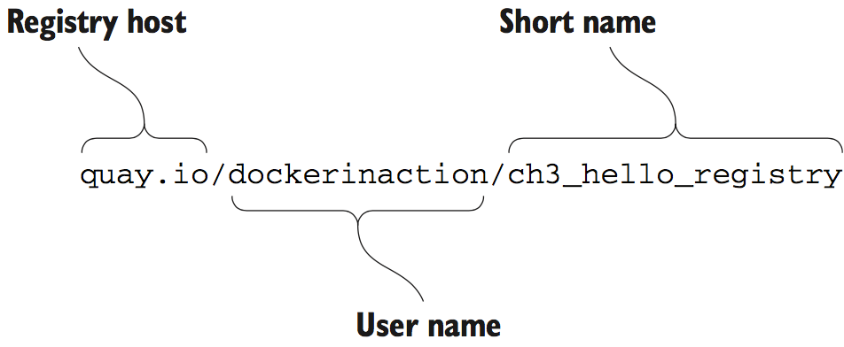

A repository can hold several images. Each of the images in a repository is identified uniquely with `tags`.

### Using tags
Tags are both an important way to uniquely identify an image and a convenient way to create useful aliases. Whereas a `tag` can only be applied to a single image in a repository, a single image can have several tags.

## Finding and installing software
`Docker Hub` is a registry and index with a website run by Docker Inc. When you issue a `docker pull` or `docker run` command without specifying an alternative registry, Docker will default to looking for the repository on Docker Hub.

### Docker Hub from the command line
Docker Hub also provides a set of official repositories that are maintained by Docker Inc. or the current software maintainers. These are often called `libraries`.

### Using alternative registries
An alternative registry:

```
docker pull quay.io/dockerinaction/ch3_hello_registry:latest
```

The full pattern is as follows:

```
[REGISTRYHOST/][USERNAME/]NAME[:TAG]
```

### Images as files
Figure 3.5 demonstrates `docker save` by creating a file from BusyBox.


### Installing from a Dockerfile
A `Dockerfile` is a script that describes steps for Docker to take to build a new image.

## Installation files and isolation
### Image layers in action
The two images you’re going to install are dockerinaction/ch3_myapp and dockerinaction/ch3_myotherapp.

```
docker pull dockerinaction/ch3_myapp
docker pull dockerinaction/ch3_myotherapp
```

When you installed ch3_myapp, Docker determined that it needed to install the openjdk-6 image because it’s the direct dependency (parent layer) of the requested image. When Docker went to install that dependency, it discovered the dependencies of that layer and downloaded those first. **Once all the dependencies of a layer are installed, that layer is installed.**

By default, the `docker images` command will only show you repositories.

- dockerinaction/ch3_myapp
- dockerinaction/ch3_myotherapp
- java:6

```
docker rmi \
    dockerinaction/ch3_myapp \
    dockerinaction/ch3_myotherapp \
    java:6
```

The `docker rmi` command allows you to specify a space-separated list of images to be removed.

### Layer relationships


In figure 3.7, the parents of the common Java 6 image are labeled using the first 12 digits of their UID. These layers contain common libraries and dependencies of the Java 6 software. Docker truncates the UID from 65 (base 16) **digits to 12 for the benefit of its human users.**

### Container file system abstraction and isolation
Docker uses a variety of `union file systems` and will select the best fit for your system.

# Persistent storage and shared state with volumes
## Introducing volumes
A `volume` is a mount point on the container’s directory tree where a portion of the host directory tree has been mounted.

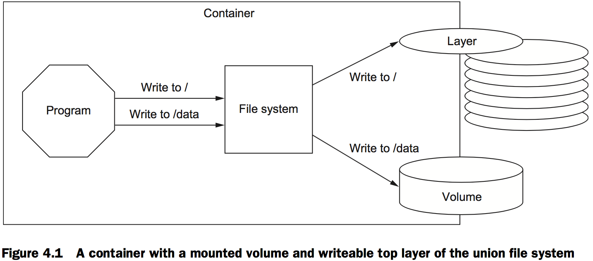

### Volumes provide container-independent data management
Semantically, a volume is a tool for segmenting and sharing data that has a scope or life cycle that’s independent of a single container.

Images are appropriate for packaging and distributing relatively static files like programs; volumes hold dynamic data or specializations.

### Using volumes with a NoSQL database
Get started by creating a single container that defines a volume. This is called a `volume container`.

```
docker run -d \
    --volume /var/lib/cassandra/data \ # Specify volume mount point inside the container
    --name cass-shared \
    alpine echo Data Container
```

You’re going to use the volume it created when you create a new container running Cassandra:

```
docker run -d \
    --volumes-from cass-shared \ # Inherit volume definitions
    --name cass1 \
    cassandra:2.2
```

After that, both containers have a volume mounted at /var/lib/cassandra/data that points to the same location on the host’s directory tree. Next, start a container from the cassandra:2.2 image, but run a Cassandra client tool and connect to your running server:

```
docker run –it --rm \
    --link cass1:cass \
    cassandra:2.2 cqlsh cass
```

First, look for a keyspace named docker_hello_world:

```sql
select *
from system.schema_keyspaces
where keyspace_name = 'docker_hello_world';
```

Cassandra should return an empty list. This means the database hasn’t been modified by the example. Next, create that keyspace with the following command:

```
create keyspace docker_hello_world
with replication = {
    'class' : 'SimpleStrategy',
    'replication_factor': 1
};
```

Now that you’ve modified the database, you should be able to issue the same query again to see the results and verify that your changes were accepted. The following command is the same as the one you ran earlier:

```sql
select *
from system.schema_keyspaces
where keyspace_name = 'docker_hello_world';
```

This time Cassandra should return a single entry with the properties you specified when you created the keyspace.

Quit the CQLSH program to stop the client container:

```
# Leave and stop the current container
quit
```

Continue cleaning up the first part of this example by stopping and removing the Cassandra node you created:

```
docker stop cass1
docker rm -vf cass1
```

If the modifications you made are persisted, the only place they could **remain is the volume container**.

You can test this by repeating these steps. Create a new Cassandra node, attach a client, and query for the keyspace. Figure 4.2 illustrates the system and what you will have built.

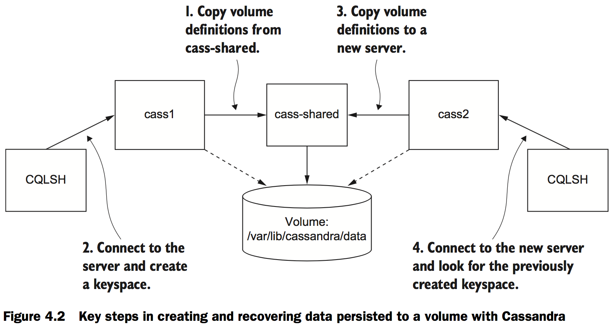

The next three commands will test recovery of the data:

```
docker run -d \
            --volumes-from cass-shared \
            --name cass2 \
            cassandra:2.2
docker run –it --rm \
          --link cass2:cass \
          cassandra:2.2 \
          cqlsh cass
select *
from system.schema_keyspaces
where keyspace_name = 'docker_hello_world';
```

The last command in this set returns a single entry, and it matches the keyspace you created in the previous container. This confirms the previous claims and demonstrates **how volumes might be used to create durable systems.**

Make sure to remove that volume container as well:

```
quit
docker rm -vf cass2 cass-shared
```

## Volume types
There are two types of volume. The first type of volume is a `bind mount`. Bind mount volumes use any user-specified directory or file on the host operating system. The second type is a `managed volume`. Managed volumes use locations that are created by the Docker daemon in space controlled by the daemon, called Docker managed space.

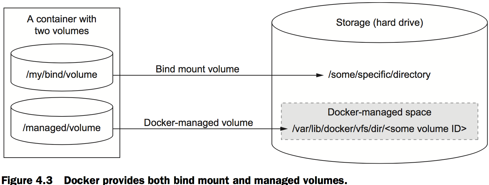

### Bind mount volumes
Bind mount volumes are useful if you want to share data with other processes running outside a container, such as components of the host system itself.

The following command will start an Apache HTTP server where your new directory is bind mounted to the server’s document root:

```
docker run -d --name bmweb \
    -v ~/example-docs:/usr/local/apache2/htdocs \
    -p 80:80 \
    httpd:latest
```

Docker provides a mechanism to mount volumes as read-only. You can do this by appending :ro to the volume map specification. In the example, you should change the run command to something like the following:

```
docker rm -vf bmweb
docker run --name bmweb_ro \
    --volume ~/example-docs:/usr/local/apache2/htdocs/:ro \
    -p 80:80 \
    httpd:latest
```

The first problem with bind mount volumes is that they tie otherwise portable container descriptions to the file system of a specific host.

The next big problem is that they create an opportunity for conflict with other containers.

Bind mount volumes are appropriate tools for workstations or machines with specialized concerns. It’s better to avoid these kinds of specific bindings in generalized platforms or hardware pools.

### Docker-managed volumes
Managed volumes are created when you use the -v option (or --volume) on docker run but only specify the mount point in the container directory tree.

```
docker run -d \
    -v /var/lib/cassandra/data \ # Specify volume mount point inside container
    --name cass-shared \
    alpine echo Data Container
```

Docker created each of the volumes in a directory controlled by the Docker daemon on the host:

```
docker inspect -f "{{json .Volumes}}" cass-shared
```

The inspect subcommand will output a list of container mount points and the corresponding path on the host directory tree. The output will look like this:

```
{"/var/lib/cassandra/data":"/mnt/sda1/var/lib/docker/vfs/dir/632fa59c..."}
```

The Volumes key points to a value that is itself a map.

## Sharing volumes
### Host-dependent sharing
Two or more containers are said to use host-dependent sharing when each has a bind mount volume for a single known location on the host file system.

```
mkdir ~/web-logs-example     # Set up a known location
docker run --name plath -d \
    -v ~/web-logs-example:/data \ # Bind mount the location into a log-writing container
    dockerinaction/ch4_writer_a
docker run --rm \
    -v ~/web-logs-example:/reader-data \ # Bind mount the same location into a container for reading
    alpine:latest \
    head /reader-data/logA
cat ~/web-logs-example/logA # View the logs from the host
docker stop plath           # Stop the writer
```

The next example starts four containers—two log writers and two readers:

```
docker run --name woolf -d \
    --volume ~/web-logs-example:/data \
    dockerinaction/ch4_writer_a
docker run --name alcott -d \
    -v ~/web-logs-example:/data \
    dockerinaction/ch4_writer_b
docker run --rm --entrypoint head \
    -v ~/web-logs-example:/towatch:ro \
    alpine:latest \
    /towatch/logA
docker run --rm \
    -v ~/web-logs-example:/toread:ro \
    alpine:latest \
    head /toread/logB
```

### Generalized sharing and the volumes-from flag
```
docker run --name fowler \
            -v ~/example-books:/library/PoEAA \
            -v /library/DSL \
            alpine:latest \
            echo "Fowler collection created."
docker run --name knuth \
    -v /library/TAoCP.vol1 \
    -v /library/TAoCP.vol2 \
    -v /library/TAoCP.vol3 \
    -v /library/TAoCP.vol4.a \
    alpine:latest \
    echo "Knuth collection created"
docker run --name reader \
    --volumes-from fowler \ # List all volumes as they were copied into new container
    --volumes-from knuth \
    alpine:latest ls -l /library/
docker inspect --format "{{json .Volumes}}" reader # Checkout volume list for reader
```

In this example you created two containers that defined Docker-managed volumes as well as a bind mount volume. To share these with a third container without the --volumes-from flag, you’d need to inspect the previously created containers and then craft bind mount volumes to the Docker-managed host directories.

## The managed volume life cycle
### Volume ownership
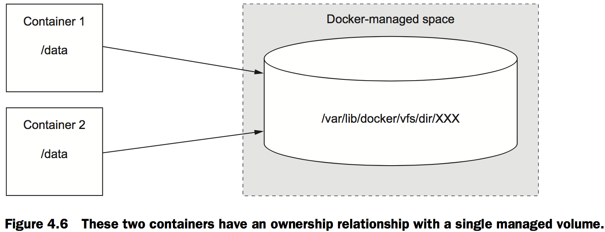

A container owns all managed volumes mounted to its file system, and multiple containers can own a volume like in the fowler, knuth, and reader example.

### Cleaning up volumes
Docker can delete managed volumes when deleting containers. Any managed volumes that are referenced by other containers will be skipped, but the internal counters will be decremented.


## Advanced container patterns with volumes
### Volume container pattern
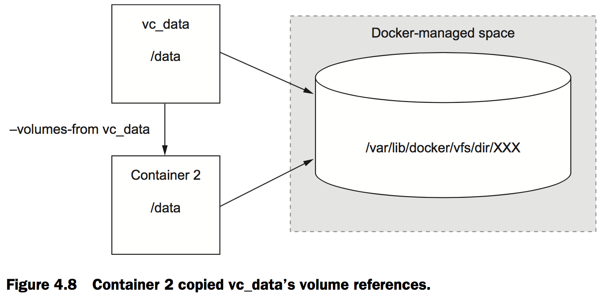

### Data-packed volume containers


```
docker run --name dpvc \ # Copy image content into a volume
    -v /config \
    dockerinaction/ch4_packed /bin/sh -c 'cp /packed/* /config/'

docker run --rm --volumes-from dpvc \ # List shared material
    alpine:latest ls /config

docker run --rm --volumes-from dpvc \ # View shared material
    alpine:latest cat /config/packedData

docker rm -v dpvc # Remember to use –v when you clean up
```

### Polymorphic container pattern
Consider a situation where an operational issue has occurred. In order to triage the issue, you might need tools available in an image that you had not anticipated when the image was built. But if you mount a volume where you make additional tools available, you can use the docker exec command to run additional processes in a container:
```
docker run --name tools dockerinaction/ch4_tools # Create data-packed volume container with tools

docker run --rm \
    --volumes-from tools \
    alpine:latest \
    ls /operations/* # List shared tools

docker run -d --name important_application \
    --volumes-from tools \ # Start another container with shared tools
    dockerinaction/ch4_ia

docker exec important_application /operations/tools/someTool # Use shared tool in running container

docker rm -vf important_application # Shut down the application

docker rm -v tools # Clean up the tools
```

You can inject files into otherwise static containers to change all types of behavior.

```
docker run --name devConfig \
    -v /config \
    dockerinaction/ch4_packed_config:latest \
    /bin/sh -c 'cp /development/* /config/'
docker run --name prodConfig \
    -v /config \
    dockerinaction/ch4_packed_config:latest \
    /bin/sh -c 'cp /production/* /config/'
docker run --name devApp \
    --volumes-from devConfig \
    dockerinaction/ch4_polyapp
docker run --name prodApp \
    --volumes-from prodConfig \
    dockerinaction/ch4_polyapp
```

In this example, you start the same application twice but with a different configuration file injected.

# Network exposure
## Networking background
### Basics: protocols, interfaces, and ports
A `protocol` with respect to communication and networking is a sort of language.

A network `interface` has an address and represents a location.

It’s common for computers to have two kinds of interfaces: an Ethernet interface and a loopback interface. `An Ethernet interface` is used to connect to other interfaces and processes.`A loopback interface` isn’t connected to any other interface.

In keeping with the mailbox metaphor, a `port` is like a recipient or a sender.

### Bigger picture: networks, NAT, and port forwarding
A `bridge` is an interface that connects multiple networks so that they can function as a single network, as shown in figure 5.3.


## Docker container networking
Docker is concerned with two types of networking: `single-host virtual networks` and `multi-host networks`. Local virtual networks are used to provide container isolation. Multi-host virtual networks provide an overlay where any container on a participating host can have its own routable IP address from any other container in the network.

### The local Docker network topology


### Four network container archetypes
The four are archetypes are these:

- Closed containers
- Joined containers
- Bridged containers
- Open containers

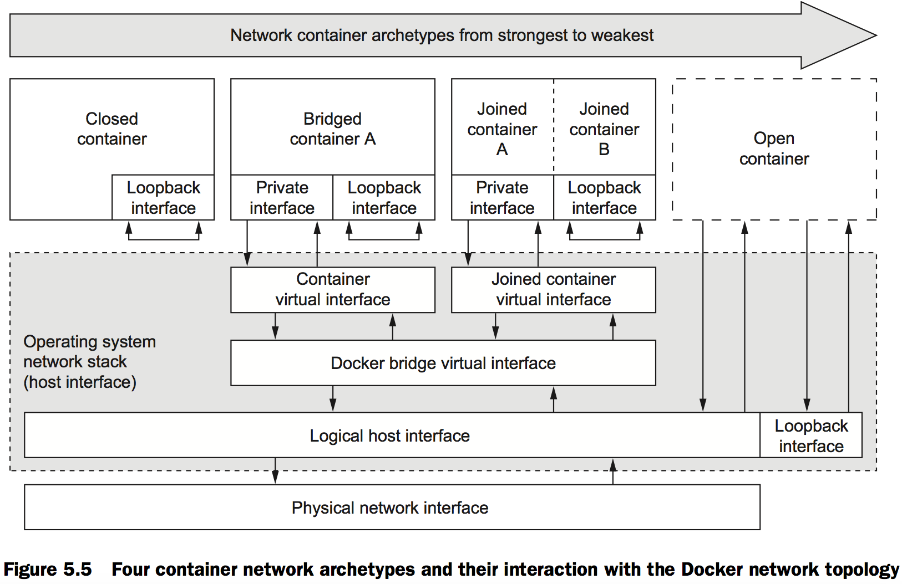

## Closed containers
Processes running in such a container will have access only to a loopback interface.

You can tell Docker to create a closed container by specifying `none` with the `--net` flag as an argument to the docker run command:

```
docker run --rm \
    --net none \    # Create a closed container
    alpine:latest \
    ip addr         # List the interfaces
```

Running this example, you can see that the only network interface available is the loopback interface, bound to the address 127.0.0.1. This configuration means three things:

- Any program running in the container can connect to or wait for connections on that interface.
- Nothing outside the container can connect to that interface.
- No program running inside that container can reach anything outside the container.

If you’re connected to the internet, try to reach a popular service that should always be available. In this case, try to reach Google’s public DNS service:

```
docker run --rm \
    --net none \      # Create a closed container
    alpine:latest \
    ping -w 2 8.8.8.8 # Ping Google
```

This attempt should fail with a message like “ping: send-to: Network is unreachable.”

## Bridged containers
### Reaching out
The most common reason to choose a bridged container is that the process needs access to the network.

To create a bridged container you can either omit the `--net` option to the docker run command or you can set its value to `bridge`.

```
docker run --rm \
    --net bridge \   # Join the bridge network
    alpine:latest \
    ip addr          # List the container interfaces
```

This time omit the --net flag to see that bridge is the default Docker network container type:

```
docker run --rm \      # Note omission of the --net option
    alpine:latest \
    ping -w 2 8.8.8.8  # Run ping command against Google
```

You’ll see your container run a ping test for two seconds and report on the network statistics gathered.

### Custom name resolution
First, the docker run command has a `--hostname` flag that you can use to set the host name of a new container.

```
docker run --rm \
    --hostname barker \ # Set the container host name
    alpine:latest \
    nslookup barker     # Resolve the host name to an IP address
```

This example creates a new container with the host name barker and runs a program to look up the IP address for the same name. Running this example will generate out- put that looks something like the following:

```
Server:    10.0.2.3
Address 1: 10.0.2.3

Name:      barker
Address 1: 172.17.0.22 barker
```

The IP address on the last line is `the bridge IP address` for the new container. The IP address provided on the line labeled Server is `the address of the server that provided the mapping`.

Setting the host name of a container is useful when programs running inside a container need to look up their own IP address or must self-identify. Because other containers don’t know this hostname, its uses are limited.

The second option for customizing the DNS configuration of a container is the ability to specify one or more DNS servers to use.

```
docker run --rm \
    --dns 8.8.8.8 \     # Set primary DNS server
    alpine:latest \
    nslookup docker.com # Resolve IP address of docker.com
```

There are a few important notes on setting your own DNS server:
- The value must be an IP address. If you think about it, the reason is obvious; the container needs a DNS server to perform the lookup on a name.
- The --dns=[] flag can be set multiple times to set multiple DNS servers (in case one or more are unreachable).
- The --dns=[] flag can be set when you start up the Docker daemon that runs in the background. When you do so, those DNS servers will be set on every container by default. But if you stop the daemon with containers running and change the default when you restart the daemon, the running containers will still have the old DNS settings. You’ll need to restart those containers for the change to take effect.

The third DNS-related option, `--dns-search=[]`, allows you to specify a DNS search domain, which is like a default host name suffix.

```
docker run --rm \
    --dns-search docker.com \ # Set search domain
    busybox:latest \
    nslookup registry.hub     # Look up shortcut for registry.hub.docker.com
```

This command will resolve to the IP address of registry.hub.docker.com because the DNS search domain provided will complete the host name.

Suppose you maintain a single DNS server for your development and test environ- ments. Rather than building environment-aware software (with hard-coded environment-specific names like myservice.dev.mycompany.com), you might consider using DNS search domains and using environment-unaware names (like myservice):

```
docker run --rm \
    --dns-search dev.mycompany \ # Note dev prefix
    busybox:latest \
    nslookup myservice           # Resolves to myservice.dev.mycompany

docker run --rm \
    --dns-search test.mycompany \ # Note test prefix
    busybox:latest \
    nslookup myservice            # Resolves to myservice.test.mycompany
```

Like providing custom DNS servers, you can provide several custom search domains for the same container.

```
docker run --rm \
    --dns-search mycompany \
    --dns-search myothercompany ...
```

The last DNS feature to consider provides the ability to override the DNS system. This uses the same system that the --hostname flag uses. The `--add-host=[]` flag on the docker run command lets you provide a custom mapping for an IP address and host name pair:

```
docker run --rm \
    --add-host test:10.10.10.255 \ # Add host entry
    alpine:latest \
    nslookup test                  # Resolves to 10.10.10.255
```

All the custom mappings live in a file at /etc/hosts inside your container.

```
docker run --rm \
    --hostname mycontainer \ # Set host name
    --add-host docker.com:127.0.0.1 \ # Create host entry
    --add-host test:10.10.10.2 \      # Create another host entry
    alpine:latest \
    cat /etc/hosts   # View all entries
```

This should produce output that looks something like the following:

```
172.17.0.45  mycontainer
127.0.0.1    localhost
::1          localhost ip6-localhost ip6-loopback
fe00::0      ip6-localnet
ff00::0      ip6-mcastprefix
ff02::1      ip6-allnodes
ff02::2      ip6-allrouters
10.10.10.2   test
127.0.0.1    docker.com
```

### Opening inbound communication
The docker run command provides a flag, `-p=[]` or `--publish=[]`, that you can use to create a mapping between a port on the host’s network stack and the new container’s interface. The format of the mapping can have four forms:

- `<containerPort>`
  - This form binds the container port to a dynamic port on all of the host’s interfaces:`docker run -p 3333 ...`
- `<hostPort>:<containerPort>`
  - This form binds the specified container port to the specified port on each of the host’s interfaces:`docker run -p 3333:3333...`
- `<ip>::<containerPort>`
  - This form binds the container port to a dynamic port on the interface with the specified IP address:`docker run -p 192.168.0.32::2222 ...`
- `<ip>:<hostPort>:<containerPort>`
  - This form binds the container port to the specified port on the interface with the specified IP address:`docker run -p 192.168.0.32:1111:1111 ...`

If you can accept a dynamic or ephemeral port assignment on the host, you can use the `-P`, or `--publish-all`, flag.

```
docker run -d --name dawson \
    -p 5000 \ # Expose all ports
    -p 6000 \
    -p 7000 \
    dockerinaction/ch5_expose

docker run -d --name woolery \
    -P \ # Expose relevant ports
    dockerinaction/ch5_expose
```

The docker run command provides another flag, `--expose`, that takes a port number that the container should expose.

```
docker run -d --name philbin \
    --expose 8000 \ # Expose another port
    -P \            # Publish all ports
    dockerinaction/ch5_expose
```

The `port` subcommand takes either the container name or ID as an argument and produces a simple list with one port map entry per line:

```
docker port philbin
```

Running this command should produce a list like the following:

```
5000/tcp -> 0.0.0.0:49164
6000/tcp -> 0.0.0.0:49165
7000/tcp -> 0.0.0.0:49166
8000/tcp -> 0.0.0.0:49163
```

### Inter-container communication


In order to make sure that you have a full appreciation for this openness, the following command demonstrates how containers can communicate over this network:

```
docker run -it --rm dockerinaction/ch5_nmap -sS -p 3333 172.17.0.0/24
```

This command will run a program called nmap to scan all the interfaces attached to the bridge network. In this case it’s looking for any interface that’s accepting connec- tions on port 3333.

When you start the Docker daemon, you can configure it to disallow network con- nections between containers. You can achieve this by setting `--icc=false` when you start the Docker daemon:

```
docker -d --icc=false ...
```

### Modifying the bridge interface
Docker provides three options for customizing the bridge interface that the Docker daemon builds on first startup. These options let the user do the following:
- Define the address and subnet of the bridge
- Define the range of IP addresses that can be assigned to containers
- Define the maximum transmission unit (MTU)

Using the `--bip` flag (which stands for bridge IP), you can set the IP address of the bridge interface that Docker will create and the size of the subnet using a classless inter-domain routing (CIDR) formatted address. CIDR notation provides a way to spec- ify an IP address and its routing prefix.

Suppose you want to set your bridge IP address to 192.168.0.128 and allocate the last 128 addresses in that subnet prefix to the bridge network. In that case, you’d set the value of --bip to 192.168.0.128/25. To be explicit, using this value will create the docker0 interface, set its IP address to 192.168.0.128, and allow IP addresses that range from 192.168.0.128 to 192.168.0.255. The command would be similar to this:

```
docker -d --bip "192.168.0.128" ...
```

With a network defined for the bridge, you can go on to customize which IP addresses in that network can be assigned to new containers. To do so, provide a similar CIDR notation description to the `--fixed-cidr` flag.

Working from the previous situation, if you wanted to reserve only the last 64 addresses of the network assigned to the bridge interface, you would use 192.168.0.192/26. When the Docker daemon is started with this set, new containers will receive an IP address between 192.168.0.192 and 192.168.0.255. The only caveat with this option is that the range specified must be a subnet of the network assigned to the bridge:

```
docker -d --fixed-cidr "192.168.0.192/26"
```

By protocol, Ethernet interfaces have a maximum packet size of 1500 bytes. This is the configured default. In some specific instances you’ll need to change the MTU on the Docker bridge.

```
docker -d –mtu 1200
```

Configure your bridge interface and then tell the Docker daemon to use it instead of docker0 when you start the daemon. The flag to use is `-b` or `--bridge`.If you’ve configured a bridge named mybridge, you’d start Docker with a command like
the following:

```
docker -d -b mybridge ...
docker -d --bridge mybridge ...
```

## Joined containers
```
docker run -d --name brady \
    --net none alpine:latest \
    nc -l 127.0.0.1:3333
docker run -it \
    --net container:brady \
    alpine:latest netstat –al
```

By running these two commands you create two containers that share the same network interface. Because the first container is created as a closed container, the two will only share that single loopback interface. The container value of the `--net` flag lets you specify the container that the new container should be joined with. Either the container name or its raw ID identifies the container that the new container should reuse.

Containers joined in this way will maintain other forms of isolation. They will maintain different file systems, different memory, and so on. But they will have the exact same network components.

### The best reasons to use joined containers
Use joined containers when you want to use a single loopback interface for communication between programs in different containers.

Use joined containers if a program in one container is going to change the joined network stack and another program is going to use that modified network.

Use joined containers when you need to monitor the network traffic for a program in another container.

## Open containers
Open containers are dangerous. They have no network container and have full access to the host’s network.

```
docker run --rm \
    --net host \ # Create an open container
    alpine:latest ip addr
```

This type of container is created when you specify `host` as the value of the `--net` option on the docker run command:

When you execute ip addr inside that container, you can inspect all the host machine’s network interfaces.

## Inter-container dependencies
### Introducing links for local service discovery
When you create a new container, you can tell Docker to link it to any other container.

Adding a link on a new container does three things:
- Environment variables describing the target container’s end point will be created.
- The link alias will be added to the DNS override list of the new container with the IP address of the target container.
- Most interestingly, if inter-container communication is disabled, Docker will add specific firewall rules to allow communication between linked containers.

### Link aliases
```
docker run --link a:alias-a --link b:alias-b --link c:alias-c ...
```

For example, the following script is included in dockerinaction/ch5_ff to validate that a link named “database” has been set at startup:

```
#!/bin/sh
if [ -z ${DATABASE_PORT+x} ]
then
    echo "Link alias 'database' was not set!"
exit else
exec "$@" fi
```

You can see this script at work by running the following:

```
docker run -d --name mydb --expose 3306 \ # Create valid link target
    alpine:latest nc -l 0.0.0.0:3306

docker run -it --rm \ # Test without link
    dockerinaction/ch5_ff echo This "shouldn't" work.

docker run -it --rm \
    --link mydb:wrongalias \ # Test with incorrect link alias
    dockerinaction/ch5_ff echo Wrong.

docker run -it --rm \
    --link mydb:database \ # Test correct alias
    dockerinaction/ch5_ff echo It worked.

docker stop mydb && docker rm mydb # Shut down link target container
```

### Environment modifications
```
docker run -d --name mydb \ # Create valid link target
    --expose 2222 --expose 3333 --expose 4444/udp \
    alpine:latest nc -l 0.0.0.0:2222

docker run -it --rm \
    --link mydb:database \ # Create link and list environment variables
    dockerinaction/ch5_ff env

docker stop mydb && docker rm mydb
```

This should output a block of lines that include the following:

```
DATABASE_PORT=tcp://172.17.0.23:3333
DATABASE_PORT_3333_TCP=tcp://172.17.0.23:3333
DATABASE_PORT_2222_TCP=tcp://172.17.0.23:2222
DATABASE_PORT_4444_UDP=udp://172.17.0.23:4444
DATABASE_PORT_2222_TCP_PORT=2222
DATABASE_PORT_3333_TCP_PORT=3333
DATABASE_PORT_4444_UDP_PORT=4444
DATABASE_PORT_3333_TCP_ADDR=172.17.0.23
DATABASE_PORT_2222_TCP_ADDR=172.17.0.23
DATABASE_PORT_4444_UDP_ADDR=172.17.0.23
DATABASE_PORT_2222_TCP_PROTO=tcp
DATABASE_PORT_3333_TCP_PROTO=tcp
DATABASE_PORT_4444_UDP_PROTO=udp
DATABASE_NAME=/furious_lalande/database
```

For each port exposed by the linked container, there will be four individual environment variables with the exposed port in the variable name. The patterns are as follows:

- `<ALIAS>_PORT_<PORT NUMBER>_<PROTOCOL TCP or UDP>_PORT`
  - This variable will simply contain the port number. That is curious because the value will be contained in the variable name. This could be useful if you’re filtering the list of environment variables for those containing the string TCP_PORT. Doing so would render the list of ports.
- `<ALIAS>_PORT_<PORT NUMBER>_<PROTOCOL TCP or UDP>_ADDR`
  - The values of variables with this pattern will be the IP address of the container serving the connection. If the alias is the same, these should all have the same value.
- `<ALIAS>_PORT_<PORT NUMBER>_<PROTOCOL TCP or UDP>_PROTO`
  - Like variables with the _PORT suffix, the values of these variables are actually contained within the variable name. It’s important not to assume that the protocol will always be TCP. UDP is also supported.
- `<ALIAS>_PORT_<PORT NUMBER>_<PROTOCOL TCP or UDP>`
  - Variables of this form contain all the previous information encoded in URL form.

### Link nature and shortcomings
The nature of links is such that dependencies are directional, static, and nontransitive. Nontransitive means that linked containers won’t inherit links.

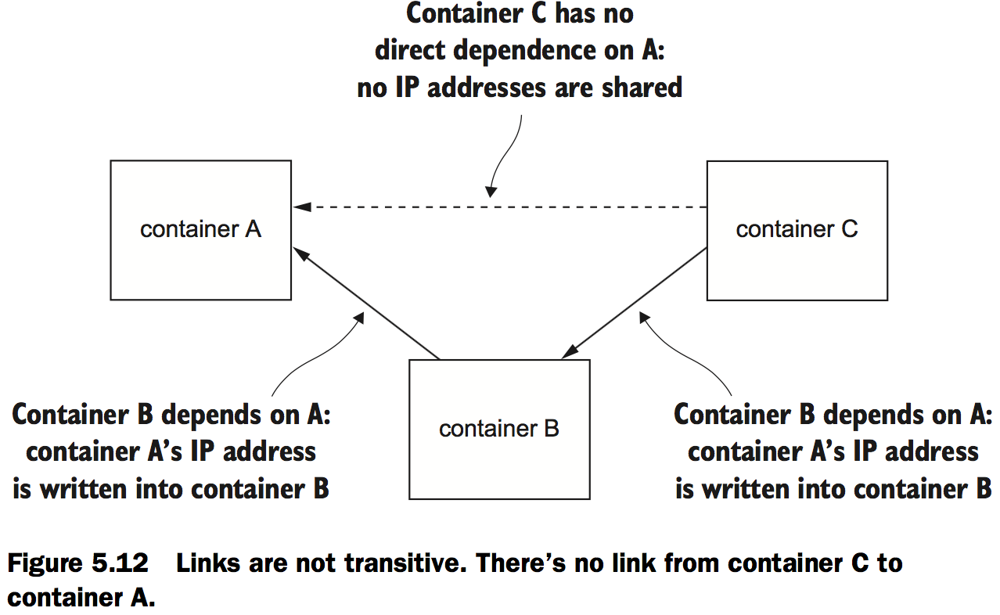

Links work by determining the network information of a container (IP address and exposed ports) and then injecting that into a new container. Because this is done at container creation time, and Docker can’t know what a container’s IP address will be before that container is running, links can only be built from new containers to existing containers.This also means that if a dependency stops for some reason, the link will be broken.

If a critical service like a database fails, an availability event has already occurred. The chosen service discovery method impacts the recovery routine. An unavailable service might recover on the same or different IP address. Links will break only if the IP address changes and will require restarts.

If your applications are slow to start and you need to handle IP address changes on service recovery, you may want to consider DNS. Otherwise, consider the static dependency chain that has been modeled using container links.

# Limiting risk with isolation


## Resource allowances
### Memory limits
You can put a limit in place by using the `-m` or `--memory` flag on the docker run or docker create commands.

```
<number><optional unit>where unit = b, k, m or g
```

```
docker run -d --name ch6_mariadb \
    --memory 256m \ # Set a memory constraint
    --cpu-shares 1024
    --user nobody \
    --cap-drop all \
    dockerfile/mariadb
```

### CPU
```
docker run -d -P --name ch6_wordpress \
  --memory 512m \
  --cpu-shares 512 \ # Set a relative process weight
  --user nobody \
  --cap-drop net_raw \
  --link ch6_mariadb \
  wordpress:4.1
```


You can see the CPU set restrictions in action by stressing one of your machine cores and examining your CPU workload:

```
# Start a container limited to a single CPU and run a load generator
docker run -d \
  --cpuset-cpus 0 \ # Restrict to CPU number 0
  --name ch6_stresser dockerinaction/ch6_stresser
# Start a container to watch the load on the CPU under load
docker run -it --rm dockerinaction/ch6_htop
```

The value can be either list or range forms:

- 0,1,2—A list including the first three cores of the CPU
- 0-2—A range including the first three cores of the CPU

### Access to devices
you can use the `--device` flag to specify a set of devices to mount into the new container.

Running this example will work only if you have a webcam at /dev/video0:

```
docker -it --rm \
    --device /dev/video0:/dev/video0 \ # Mount video0
    ubuntu:latest ls -al /dev
```

## Shared memory
Docker creates a unique IPC namespace for each container by default. The Linux IPC namespace partitions share memory primitives such as named shared memory blocks and semaphores, as well as message queues.

```
docker -d --name ch6_ipc_consumer \
    --ipc container:ch6_ipc_producer \ # Join IPC namespace
    dockerinaction/ch6_ipc -consumer
```


### Using an open memory container
Memory isolation is a desirable trait. If you encounter a situation where you need to operate in the same namespace as the rest of the host, you can do so using an open memory container:

```
docker -d --name ch6_ipc_producer \ # Start a producer
    --ipc host \                    # Use open memory container
    dockerinaction/ch6_ipc –producer

docker -d --name ch6_ipc_consumer \ # Start a consumer
    --ipc host \                    # Use open memory container
    dockerinaction/ch6_ipc -consumer
```

## Understanding users
### Introduction to the Linux user namespace
Linux recently released a new user (USR) namespace that allows users in one namespace to be mapped to users in another.

When Docker adopts the USR namespace, you’ll be able to map user IDs on the host to user IDs in a container namespace. So, I could map user 1000 on my host to user 2 in the container. This is particularly useful for resolving file permissions issues in cases like reading and writing to volumes.

### Working with the run-as user
You can get a list of available users in an image with the following command:

```
docker run --rm busybox:latest awk -F: '$0=$1' /etc/passwd
```

Docker provides the `--user` or `-u` flag on docker run and docker create for setting the user. This will set the user to “nobody”:

```
docker run --rm \
    --user nobody \   # Set run-as user to nobody
    busybox:latest id # Outputs: uid=99(nobody) gid=99(nobody)
```

It can also accept user and group names or IDs. When you use IDs instead of names, the options start to open up:

```
docker run --rm \
    -u nobody:default \ # Set run-as user to nobody and group to default
    busybox:latest id   # Outputs: uid=99(nobody) gid=1000(default)

docker run --rm \
    -u 10000:20000 \   # Set UID and GID
    busybox:latest id  # Outputs: uid=10000 gid=20000
```

### Users and volumes
For example, how do you handle a log file written to a volume?The preferred way is with volume containers. If logs are written to a volume by a process running as user 1001 and another container tries to access that file as user 1002, then file permissions might prevent the operation.

One way to overcome this obstacle would be to specifically manage the user ID of the running user. You can either edit the image ahead of time by setting the user ID of the user you’re going to run the container with, or you can use the desired user and group ID:

```
mkdir logFiles
sudo chown 2000:2000 logFiles # Set ownership of directory to desired user and group

docker run --rm -v "$(pwd)"/logFiles:/logFiles \ # Write important log file
    -u 2000:2000 ubuntu:latest \   # Set UID:GID to 2000:2000
    /bin/bash -c "echo This is important info > /logFiles/important.log"

docker run --rm -v "$(pwd)"/logFiles:/logFiles \ # Append to log from another container
    -u 2000:2000 ubuntu:latest \  # Also set UID:GID to 2000:2000
    /bin/bash -c "echo More info >> /logFiles/important.log"

sudo rm –r logFiles
```

## Adjusting OS feature access with capabilities
When you create a new container, Docker drops a specific set of capabilities by default. This is done to further isolate the running process from the administrative functions of the operating system. At the time of this writing, this set includes the following:

* SETPCAP—Modify process capabilities
* SYS_MODULE—Insert/remove kernel modules
* SYS_RAWIO—Modify kernel memory
* SYS_PACCT—Configure process accounting
* SYS_NICE—Modify priority of processes
* SYS_RESOURCE—Override resource limits
* SYS_TIME—Modify the system clock
* SYS_TTY_CONFIG—Configure TTY devices
* AUDIT_WRITE—Write the audit log
* AUDIT_CONTROL—Configure audit subsystem
* MAC_OVERRIDE—Ignore kernel MAC policy
* MAC_ADMIN—Configure MAC configuration
* SYSLOG—Modify kernel print behavior
* NET_ADMIN—Configure the network
* SYS_ADMIN—Catchall for administrative functions

You can drop capabilities from a container using the `--cap-drop` flag on
docker create or docker run.

```
docker run --rm -u nobody \
    ubuntu:latest \
    /bin/bash -c "capsh --print | grep net_raw"
docker run --rm -u nobody \
    --cap-drop net_raw \ # Drop NET_RAW capability
    ubuntu:latest \
    /bin/bash -c "capsh --print | grep net_raw"
```

Similar to the `--cap-drop` flag, the `--cap-add` flag will add capabilities.

```
docker run --rm -u nobody \
    ubuntu:latest \
    /bin/bash –c "capsh --print | grep sys_admin" # SYS_ADMIN is not included
docker run --rm -u nobody \
    --cap-add sys_admin \  # Add SYS_ADMIN
    ubuntu:latest \
    /bin/bash –c "capsh --print | grep sys_admin"
```

## Running a container with full privileges
In those cases when you need to run a system administration task inside a container, you can grant that container privileged access to your computer. Use the --privileged flag on docker create or docker run to enable this mode:

```
docker run --rm \
    --privileged \
    ubuntu:latest id # Check out our IDs
docker run --rm \
    --privileged \
    ubuntu:latest capsh –print # Check out our Linux capabilities
docker run --rm \
    --privileged \
    ubuntu:latest ls /dev # Check out list of mounted devices
docker run --rm \
    --privileged \
    ubuntu:latest ifconfig # Examine network configuration
```

## Stronger containers with enhanced tools
### Specifying additional security options
`LSM`(Linux Security Modules) is a framework that Linux adopted to act as an interface layer between the operating system and security providers.

AppArmor and SELinux are both LSM providers. They both provide mandatory access control (`MAC`—the system defines access rules) and replace the standard Linux discretionary access control (file owners define access rules).

The flag available on docker run and docker create is `--security-opt`.

### Fine-tuning with LXC
`LXC`(Linux Containers) is a container runtime provider—a tool that actually works with Linux to create namespaces and all the components that go into building a container.

As Docker matured and portability became a concern, a new container runtime called `libcontainer` was built, replacing LXC.

If you’re running a system where you can and want to use LXC, you can change the container provider and take advantage of those additional features.

Once Docker is configured for LXC, you can use the `--lxc-conf` flag on docker run or docker create to set the LXC configuration for a container:

```
docker run -d \
    --lxc-conf="lxc.cgroup.cpuset.cpus=0,1" \ # Limited to two CPU cores by LXC
    --name ch6_stresser dockerinaction/ch6_stresser

docker run -it --rm dockerinaction/ch6_htop

docker rm -vf ch6_stresser
```

# Packaging software in images
## Building Docker images from a container
### Packaging Hello World
The basic workflow for building an image from a container includes three steps. First, you need to create a container from an existing image.

The second step is to modify the file system of the container. These changes will be written to a new layer on the union file system for the container.

Once the changes have been made, the last step is to commit those changes. Once the changes are committed, you’ll be able to create new containers from the resulting image.


```
docker run --name hw_container \
    ubuntu:latest \
    touch /HelloWorld # Modify file in container

docker commit hw_container hw_image # Commit change to new image

docker rm -vf hw_container # Remove changed container

docker run --rm \
    hw_image \
    ls -l /HelloWorld # Examine file in new container
```

### Preparing packaging for Git
To get started building your own image, the first thing you’ll need is a container created from an appropriate base image:

```
docker run -it --name image-dev ubuntu:latest /bin/bash
```

Next, you need to install Git in the container. Do that by running the following command:

```
apt-get –y install git
```

When it’s finished, you can test the installation by running the git program:

```
git version
# Output something like:
# git version 1.9.1
```

Now that Git has been installed on your Ubuntu container, you can simply exit the container:

```
exit
```

### Reviewing file system changes
```
docker diff image-dev # Outputs a LONG list of file changes...

docker run --name tweak-a busybox:latest touch /HelloWorld # Add new file to busybox
docker diff tweak-a
# Output:
#    A /HelloWorld

docker run --name tweak-d busybox:latest rm /bin/vi docker diff tweak-d # Remove existing file from busybox
# Output:
# C/bin
# D /bin/vi

docker run --name tweak-c busybox:latest touch /bin/vi docker diff tweak-c # Change existing file in busybox
# Output:
# C/bin
#    C /bin/busybox
```

Always remember to clean up your workspace, like this:

```
docker rm -vf tweak-a
docker rm -vf tweak-d
docker rm -vf tweak-c
```

### Committing a new image
```
docker commit -a "@dockerinaction" -m "Added git" image-dev ubuntu-git
# Outputs a new unique image identifier like:
# bbf1d5d430cdf541a72ad74dfa54f6faec41d2c1e4200778e9d4302035e5d143
```

An `entrypoint` is the program that will be executed when the container starts.

```
docker run --name cmd-git --entrypoint git ubuntu-git # Show standard git help and exit

docker commit -m "Set CMD git" \
    -a "@dockerinaction" cmd-git ubuntu-git # Commit new image to same name

docker rm -vf cmd-git # Cleanup

docker run --name cmd-git ubuntu-git version # Test
```

### Configurable image attributes
Of the parameters that can be set when a container is created, all the following will carry forward with an image created from the container:

* All environment variables
* The working directory
* The set of exposed ports
* All volume definitions
* The container entrypoint
* Command and arguments

If these values weren’t specifically set for the container, the values will be inherited from the original image.

```
docker run --name rich-image-example \
    -e ENV_EXAMPLE1=Rich -e ENV_EXAMPLE2=Example \ # Create environment variable specialization
    busybox:latest

docker commit rich-image-example rie # Commit image

docker run --rm rie \
    /bin/sh -c "echo \$ENV_EXAMPLE1 \$ENV_EXAMPLE2" # Outputs: Rich Example
```

Next, consider a container that introduces an entrypoint and command specialization as a new layer on top of the previous example:

```
docker run --name rich-image-example-2 \
    --entrypoint "/bin/sh" \ # Set default entrypoint
    rie \
    -c "echo \$ENV_EXAMPLE1 \$ENV_EXAMPLE2" # Set default command

docker commit rich-image-example-2 rie # Commit image

docker run --rm rie # Different command with same output
```

## Going deep on Docker images and layers
### An exploration of union file systems


When you read a file from a union file system, that file will be read from the top-most layer where it exists. If a file was not created or changed on the top layer, the read will fall through the layers until it reaches a layer where that file does exist. This is illustrated in figure 7.3.

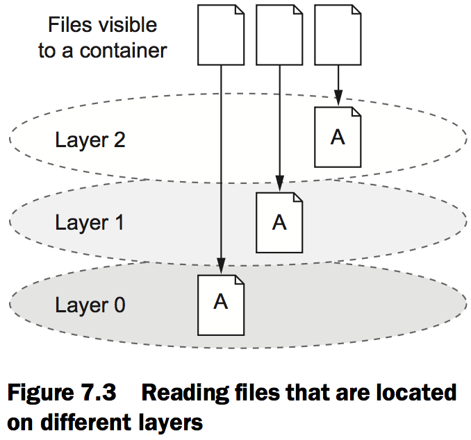


### Reintroducing images, layers, repositories, and tags
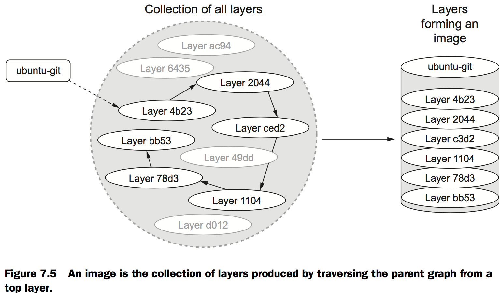

Revisit the mod_ubuntu container again and put it into a repository with a tag:

```
docker commit mod_ubuntu myuser/myfirstrepo:mytag
# Outputs:
# 82ec7d2c57952bf57ab1ffdf40d5374c4c68228e3e923633734e68a11f9a2b59
```

### Managing image size and layer limits
The union file system on your computer may have a layer count limit. These limits vary, but a limit of 42 layers is common on computers that use the AUFS system. This number may seem high, but it’s not unreachable. You can examine all the layers in an image using the `docker history` command.

* Abbreviated layer ID
* Age of the layer
* Initial command of the creating container
* Total file size of that layer

By examining the history of the ubuntu-git:removed image, you can see that three layers have already been added on the top of the original ubuntu:latest image:

```
docker history ubuntu-git:removed
```

Outputs are something like:


## Exporting and importing flat file systems
Create a new container and use the export subcommand to get a flattened copy of its filesystem:

```
docker run --name export-test \
   dockerinaction/ch7_packed:latest ./echo For Export # Export file system contents

docker export --output contents.tar export-test

docker rm export-test

tar -tf contents.tar # Show archive contents
```

Now that the program has been packaged in a tarball, you can import it using the docker import command:

```
docker import -c "ENTRYPOINT [\"/hello\"]" - \ dockerinaction/ch7_static < static_hello.tar # Tar file streamed via UNIX pipe
```

## Versioning best practices


# Build automation and advanced image considerations
## Packaging Git with a Dockerfile
```
# An example Dockerfile for installing Git on Ubuntu
FROM ubuntu:latest
MAINTAINER "dockerinaction@allingeek.com"
RUN apt-get install -y git
ENTRYPOINT ["git"]
```

Before dissecting this example, build a new image from it with the docker build command from the same directory containing the Dockerfile. Tag the new image with auto:

```
docker build --tag ubuntu-git:auto .
```

Outputs several lines about steps and output from apt-get and will finally display a message like this:

```
Successfully built 0bca8436849b
```

View the list of all your ubuntu-git images and test the newest one with this command:

```
docker images
```

The new build tagged “auto” should now appear in the list:

```
REPOSITORY   TAG      IMAGE ID      CREATED         VIRTUAL SIZE
ubuntu-git   auto     0bca8436849b  10 seconds ago  225.9 MB
ubuntu-git   latest   826c66145a59  10 minutes ago  226.6 MB
ubuntu-git   removed  826c66145a59  10 minutes ago  226.6 MB
ubuntu-git   1.9      3e356394c14e  41 hours ago    226 MB
```

The first instruction must be `FROM`. If you’re starting from an empty image and your software has no dependencies, or you’ll provide all the dependencies, then you can start from a special empty repository named `scratch`.

The builder validated that the image specified by the FROM instruction was installed as the first step of the build. If it were not, **Docker would have automatically tried to pull the image**.

The output will show which steps the builder was able to skip in favor of cached results:

```
Sending build context to Docker daemon 2.048 kB
Sending build context to Docker daemon
Step 0 : FROM ubuntu:latest
 ---> b39b81afc8ca
Step 1 : MAINTAINER "dockerinaction@allingeek.com"
 ---> Using cache
 ---> 80a695671201
Step 2 : RUN apt-get install -y git
 ---> Using cache # Note use of cache
 ---> 1c20f8970532
Step 3 : ENTRYPOINT git
 ---> Using cache # Note use of cache
 ---> 89d726cf3514
Step 4 : RUN This will not work
 ---> Running in f68f0e0418b5
/bin/sh: 1: This: not found
INFO[0001] The command [/bin/sh -c This will not work] returned a non-zero
code: 127
```

## A Dockerfile primer
### Metadata instructions
Create a new file named .dockerignore and copy in the following lines:

```
.dockerignore
mailer-base.df
mailer-logging.df
mailer-live.df
```

Create a new file named mailer-base.df and add the following lines:

```
FROM debian:wheezy
MAINTAINER Jeff Nickoloff "dia@allingeek.com"
RUN groupadd -r -g 2200 example && \
    useradd -rM -g example -u 2200 example
ENV APPROOT="/app" \
    APP="mailer.sh" \
    VERSION="0.6"
LABEL base.name="Mailer Archetype" \
      base.version="${VERSION}"
WORKDIR $APPROOT
ADD . $APPROOT
ENTRYPOINT ["/app/mailer.sh"]
EXPOSE 33333
# Do not set the default user in the base otherwise
# implementations will not be able to update the image
# USER example:example
```

The -f flag tells the builder which filename to use as input:

```
docker build -t dockerinaction/mailer-base:0.6 -f mailer-base.df .
```

- `ENV` sets environment variables for an image similar to the --env flag on docker run or docker create.
- The `LABEL` instruction is used to define key/value pairs that are recorded as additional metadata for an image or container. This mirrors the --label flag on docker run and docker create.
- The result of the `WORKDIR` instruction will be an image with the default working directory set to /app. Setting WORKDIR to a location that doesn’t exist will create that location just like the command-line option.
- The `EXPOSE` command creates a layer that opens TCP port 33333.
- The `FROM` instruction sets the layer stack to start from the debian:wheezy image. Any new layers built will be placed on top of that image.
- The `MAINTAINER` instruction sets the Author value in the image metadata.
- The `ENTRYPOINT` instruction sets the executable to be run at container startup.
- The last commented line is a metadata instruction `USER`. It sets the user and group for all further build steps and containers created from the image.

You’ll need to inspect the image:

```
docker inspect dockerinaction/mailer-base:0.6
```

The relevant lines are these:

```json
"Env": [ "PATH=/usr/local/sbin:/usr/local/bin:/usr/sbin:/usr/bin:/sbin:/bin", "APPROOT=/app",
"APP=mailer.sh",
"VERSION=0.6"
],
...
"Labels": {
    "base.name": "Mailer Archetype",
"base.version": "0.6" },
...
"WorkingDir": "/app"
```

### File system instructions
A file named mailer-logging.df:

```
FROM dockerinaction/mailer-base:0.6
COPY ["./log-impl", "${APPROOT}"]
RUN chmod a+x ${APPROOT}/${APP} && \
    chown example:example /var/log
USER example:example
VOLUME ["/var/log"]
CMD ["/var/log/mailer.log"]
```

- The `COPY` instruction will copy files from the file system where the image is being built into the build container.
- The second new instruction is `VOLUME`. This behaves exactly as you’d expect if you understand what the --volume flag does on a call to docker run or docker create.
- The `CMD` command represents an argument list for the entrypoint. The default entrypoint for a container is /bin/sh.

Create a directory at `./log-impl`. Inside that directory create a file named `mailer.sh` and copy the following script into the file:

```sh
#!/bin/sh
printf "Logging Mailer has started.\n"
while true
do
    MESSAGE=$(nc -l -p 33333)
    printf "[Message]: %s\n" "$MESSAGE" > $1
    sleep 1
done
```

This script will start a mailer daemon on port 33333 and write each message that it receives to the file specified in the first argument to the program.

Build and run the container:

```
docker build -t dockerinaction/mailer-logging -f mailer-logging.df .
docker run -d --name logging-mailer dockerinaction/mailer-logging
```

Name this file mailer-live.df:

```
FROM dockerinaction/mailer-base:0.6
ADD ["./live-impl", "${APPROOT}"]
RUN apt-get update && \
    apt-get install -y curl python && \
    curl "https://bootstrap.pypa.io/get-pip.py" -o "get-pip.py" && \
    python get-pip.py && \
    pip install awscli && \
    rm get-pip.py && \
    chmod a+x "${APPROOT}/${APP}"
RUN apt-get install -y netcat
USER example:example
CMD ["mailer@dockerinaction.com", "pager@dockerinaction.com"]
```

The ADD instruction will
* Fetch remote source files if a URL is specified
* Extract the files of any source determined to be an archive file

Next, create a new subdirectory named `live-impl` under the location containing mailer-live.df. Add the following script to a file in that directory named `mailer.sh`:

```sh
#!/bin/sh
printf "Live Mailer has started.\n"
while true
do
  MESSAGE=$(nc -l -p 33333)
  aws ses send-email --from $1 \
    --destination {\"ToAddresses\":[\"$2\"]} \
    --message "{\"Subject\":{\"Data\":\"Mailer Alert\"},\
                \"Body\":{\"Text\":{\"Data\":\"$MESSAGE}\"}}}"
sleep 1 done
```

It will wait for connections on port 33333, take action on any received messages, and then sleep for a moment before waiting for another message.

Build and run the container:

```
docker build -t dockerinaction/mailer-live -f mailer-live.df .
docker run -d --name live-mailer dockerinaction/mailer-live
```

## Injecting downstream build-time behavior
The `ONBUILD` instruction defines instructions to execute if the resulting image is used as a base for another build.

The upstream Dockerfile would use a set of instructions like this:

```
ONBUILD COPY [".", "/var/myapp"]
ONBUILD RUN go build /var/myapp
```

The instructions following ONBUILD instructions aren’t executed when their containing Dockerfile is built. Instead, those instructions are recorded in the resulting image’s metadata under ContainerConfig.OnBuild. The previous instructions would result in the following metadata inclusions:

```json
"ContainerConfig": {
    "OnBuild": [
        "COPY [\".\", \"/var/myapp\"]",
        "RUN go build /var/myapp"
]
}
```

When a downstream Dockerfile uses the upstream image(the one with the ONBUILD instructions) in a FROM instruction, those ONBUILD instructions are executed after the FROM instruction and before the next instruction in a Dockerfile.

## Using startup scripts and multiprocess containers
### Environmental preconditions validation
That script validates that the container context is set in a way that’s compatible with the contained version of WordPress. If any required condition is unmet (a link is undefined or a variable is unset), then the script will exit before starting WordPress, and the container will stop unexpectedly.

This type of startup script is generally use-case specific. If you’re packaging a specific piece of software in an image, you’ll need to write the script yourself. Your script should validate as much of the assumed context as possible. This should include the following:

* Presumed links (and aliases)
* Environment variables
* Network access
* Network port availability
* Root file system mount parameters (read-write or read-only)
* Volumes
* Current user

At container startup, this script enforces that either another container has been linked to the web alias and has exposed port 80 or the WEB_HOST environment variable has been defined:

```sh
#!/bin/bash
set -e
if [ -n "$WEB_PORT_80_TCP" ]; then
  if [ -z "$WEB_HOST" ]; then
    WEB_HOST='web'
  else
    echo >&2 '[WARN]: Linked container, "web" overridden by $WEB_HOST.'
    echo >&2 "===> Connecting to WEB_HOST ($WEB_HOST)"
  fi
fi
if [ -z "$WEB_HOST" ]; then
  echo >&2 '[ERROR]: specify a linked container, "web" or WEB_HOST environ-
   ment variable'
  exit 1
fi
exec "$@" # run the default command
```

### Initialization processes
Using an init process is the best way to launch multiple programs, clean up orphaned processes, monitor processes, and automatically restart any failed processes.

When evaluating any init program for use in a container, consider these factors:

* Additional dependencies the program will bring into the image
* File sizes
* How the program passes signals to its child processes (or if it does)
* Required user access
* Monitoring and restart functionality (backoff-on-restart features are a bonus)
* Zombie process cleanup features

## Building hardened application images
`Hardening an image` is the process of shaping it in a way that will reduce the attack surface inside any Docker containers based on it.

A general strategy for hardening an application image is to minimize the software included with it.

There are three things that you can do to harden an image beyond that general strategy. First, you can enforce that your images are built from a specific image. Second, you can make sure that regardless of how containers are built from your image, they will have a sensible default user. Last, you should eliminate a common path for root user escalation.
