    作者:  [美] Andrew S·Tanenbaum
    出版社: Prentice Hall
    出版年: 2001-2-21
    页数: 976
    定价: USD 118.00
    装帧: Hardcover
    ISBN: 9780130313584

[豆瓣链接](https://book.douban.com/subject/1476168/)

- [2 PROCESSES AND THREADS](#2-processes-and-threads)
  - [2.1 PROCESSES](#21-processes)
    - [2.1.1 The Process Model](#211-the-process-model)
    - [2.1.2 Process Creation](#212-process-creation)
    - [2.1.3 Process Termination](#213-process-termination)
    - [2.1.4 Process Hierarchies](#214-process-hierarchies)
    - [2.1.5 Process States](#215-process-states)
    - [2.1.6 Implementation of Processes](#216-implementation-of-processes)
  - [2.2 THREADS](#22-threads)
    - [2.2.1 The Thread Model](#221-the-thread-model)
    - [2.2.2 Thread Usage](#222-thread-usage)
    - [2.2.3 Implementing Threads in User Space](#223-implementing-threads-in-user-space)
    - [2.2.4 Implementing Threads in the Kernel](#224-implementing-threads-in-the-kernel)
    - [2.2.5 Hybrid Implementations](#225-hybrid-implementations)
    - [2.2.6 Scheduler Activations](#226-scheduler-activations)
    - [2.2.7 Pop-Up Threads](#227-pop-up-threads)
  - [2.3 INTERPROCESS COMMUNICATION](#23-interprocess-communication)
    - [2.3.1 Race Conditions](#231-race-conditions)
    - [2.3.2 Critical Regions](#232-critical-regions)
    - [2.3.4 Sleep and Wakeup](#234-sleep-and-wakeup)
    - [2.3.5 Semaphores](#235-semaphores)
    - [2.3.6 Mutexes](#236-mutexes)
    - [2.3.7 Monitors](#237-monitors)
    - [2.3.8 Message Passing](#238-message-passing)
    - [2.3.9 Barriers](#239-barriers)
  - [2.4 CLASSICAL IPC PROBLEMS](#24-classical-ipc-problems)
    - [2.4.1 The Dining Philosophers Problem](#241-the-dining-philosophers-problem)
    - [2.4.2 The Readers and Writers Problem](#242-the-readers-and-writers-problem)
    - [2.4.3 The Sleeping Barber Problem](#243-the-sleeping-barber-problem)
  - [2.5 SCHEDULING](#25-scheduling)
- [3 DEADLOCKS](#3-deadlocks)
  - [3.1 RESOURCES](#31-resources)
  - [3.2 INTRODUCTION TO DEADLOCKS](#32-introduction-to-deadlocks)
  - [3.3 THE OSTRICH ALGORITHM](#33-the-ostrich-algorithm)
  - [3.4 DEADLOCK DETECTION AND RECOVERY](#34-deadlock-detection-and-recovery)
    - [3.4.1 Deadlock Detection with One Resource of Each Type](#341-deadlock-detection-with-one-resource-of-each-type)
    - [3.4.2 Deadlock Detection with Multiple Resource of Each Type](#342-deadlock-detection-with-multiple-resource-of-each-type)
    - [3.4.3 Recovery from Deadlock](#343-recovery-from-deadlock)
  - [3.5 DEADLOCK AVOIDANCE](#35-deadlock-avoidance)
    - [3.5.1 Resource Trajectories](#351-resource-trajectories)
    - [3.5.3 The Banker’s Algorithm for a Single Resource](#353-the-bankers-algorithm-for-a-single-resource)
    - [3.5.4 The Banker’s Algorithm for Multiple Resources](#354-the-bankers-algorithm-for-multiple-resources)
  - [3.6 DEADLOCK PREVENTION](#36-deadlock-prevention)
  - [3.7 OTHER ISSUES](#37-other-issues)
    - [Two-Phase Locking](#two-phase-locking)
- [4 MEMORY MANAGEMENT](#4-memory-management)
  - [4.1 BASIC MEMORY MANAGEMENT](#41-basic-memory-management)
    - [4.1.1 Monoprogramming without Swapping or Paging](#411-monoprogramming-without-swapping-or-paging)
    - [4.1.2 Multiprogramming with Fixed Partitions](#412-multiprogramming-with-fixed-partitions)
    - [4.1.3 Modeling Multiprogramming](#413-modeling-multiprogramming)
    - [4.1.4 Analysis of Multiprogramming System Performance](#414-analysis-of-multiprogramming-system-performance)
    - [4.1.5 Relocation and Protection](#415-relocation-and-protection)
  - [4.2 SWAPPING](#42-swapping)
    - [4.2.1 Memory Management with Bitmaps](#421-memory-management-with-bitmaps)
    - [4.2.2 Memory Management with Linked Lists](#422-memory-management-with-linked-lists)
  - [4.3 VIRTUAL MEMORY](#43-virtual-memory)
    - [4.3.1 Paging](#431-paging)
    - [4.3.2 Page Tables](#432-page-tables)
    - [4.3.3 TLBs—Translation Lookaside Buffers](#433-tlbstranslation-lookaside-buffers)
    - [4.3.4 Inverted Page Tables](#434-inverted-page-tables)
  - [4.4 PAGE REPLACEMENT ALGORITHMS](#44-page-replacement-algorithms)

# 2 PROCESSES AND THREADS
The most central concept in any operating system is the process: an abstraction of a running program.

## 2.1 PROCESSES
While, strictly speaking, at any instant of time, the CPU is running only one program, in the course of 1 second, it may work on several programs, thus giving the users the illusion of parallelism. Sometimes people speak of pseudoparallelism in this context, to contrast it with the true hardware parallelism of multiprocessor systems(which have two or more CPUs sharing the same physical memory).

### 2.1.1 The Process Model
In this model, all the runnable software on the computer, sometimes including the operating system, is organized into a number of sequential processes, or just processes for short. In reality, of course, the real CPU switches back and forth from process to process, but to understand the system, it is much easier to think about a collection of processes running in (pseudo) parallel, than to try to keep track of how the CPU switches from program to program. This rapid switching back and forth is called multiprogramming.


Figure 2-1. (a) Multiprogramming of four programs. (b) Conceptual model of four independent, sequential processes. (c) Only one program is active at once.

### 2.1.2 Process Creation
There are four principal events that cause processes to be created:
1. System initialization.
2. Execution of a process creation system call by a running process.
3. A user request to create a new process.
4. Initiation of a batch job.

Processes that stay in the background to handle some activity such as email, Web pages, news, printing, and so on are called daemons.

### 2.1.3 Process Termination
Sooner or later the new process will terminate, usually due to one of the following conditions:
1. Normal exit (voluntary).
2. Error exit (voluntary).
3. Fatal error (involuntary).
4. Killed by another process (involuntary).

### 2.1.4 Process Hierarchies
In UNIX, a process and all of its children and further descendants together form a process group.

In contrast, Windows does not have any concept of a process hierarchy. All processes are equal. The only place where there is something like a process hierarchy is that when a process is created, the parent is given a special token (called a handle) that it can use to control the child. However, it is free to pass this token to some other process, thus invalidating the hierarchy. Processes in UNIX cannot disinherit their children.

### 2.1.5 Process States
In Fig. 2-2 we see a state diagram showing the three states a process may be in:
1. Running (actually using the CPU at that instant).
2. Ready (runnable; temporarily stopped to let another process run).
3. Blocked (unable to run until some external event happens).


Figure 2-2. A process can be in running, blocked, or ready state. Transitions between these states are as shown.

### 2.1.6 Implementation of Processes
To implement the process model, the operating system maintains a table (an array of structures), called the process table, with one entry per process. (Some authors call these entries process control blocks.)

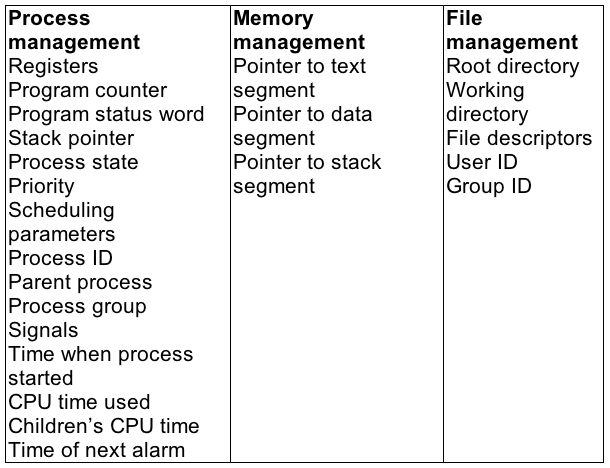

Figure 2-4. Some of the fields of a typical process table entry.


Figure 2-5. Skeleton of what the lowest level of the operating system does when an interrupt occurs.

## 2.2 THREADS
### 2.2.1 The Thread Model


Figure 2-6. (a) Three processes each with one thread. (b) One process with tree threads.


Figure 2-7. The first column lists some items shared by all threads in a process. The second one lists some items private to each thread.


Figure 2-8. Each thread has its own stack.

### 2.2.2 Thread Usage


Figure 2-9. A word processor with three threads.


Figure 2-10. A multithreaded Web server.

### 2.2.3 Implementing Threads in User Space
The procedure that saves the thread’s state and the scheduler are just local procedures, so invoking them is much more efficient than making a kernel call. Among other issues, no trap is needed, no context switch is needed, the memory cache need not be flushed, and so on. This makes thread scheduling very fast.

User-level threads also have other advantages. They allow each process to have its own customized scheduling algorithm.

Despite their better performance, user-level threads packages have some major problems. First among these is the problem of how blocking system calls are implemented.  If a thread causes a page fault, the kernel, not even knowing about the existence of threads, naturally blocks the entire process until the disk I/O is complete, even though other threads might be runnable.

Another problem with user-level thread packages is that if a thread starts running, no other thread in that process will ever run unless the first thread voluntarily gives up the CPU.

Another, and probably the most devastating argument against user-level threads, is that programmers generally want threads precisely in applications where the threads block often, as, for example, in a multithreaded Web server. These threads are constantly making system calls. Once a trap has occurred to the kernel to carry out the system call, it is hardly any more work for the kernel to switch threads if the old one has blocked, and having the kernel do this eliminates the need for constantly making select system calls that check to see if read system calls are safe.

### 2.2.4 Implementing Threads in the Kernel
Kernel threads do not require any new, nonblocking system calls. In addition, if one thread in a process causes a page fault, the kernel can easily check to see if the process has any other runnable threads, and if so, run one of them while waiting for the required page to be brought in from the disk. Their main disadvantage is that the cost of a system call is substantial, so if thread operations (creation, termination, etc.) are common, much more overhead will be incurred.

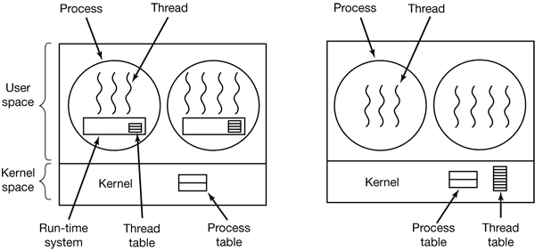

Figure 2-13. (a) A user-level threads package. (b) A threads package managed by the kernel.

### 2.2.5 Hybrid Implementations


Figure 2-14. Multiplexing user-level threads onto kernel-level threads.

### 2.2.6 Scheduler Activations
Various researchers have attempted to combine the advantage of user threads (good performance) with the advantage of kernel threads (not having to use a lot of tricks to make things work). Below we will describe one such approach devised by Anderson et al. (1992), called scheduler activations.

The goals of the scheduler activation work are to mimic the functionality of kernel threads, but with the better performance and greater flexibility usually associated with threads packages implemented in user space. In particular, user threads should not have to make special nonblocking system calls or check in advance if it is safe to make certain system calls. Nevertheless, when a thread blocks on a system call or on a page fault, it should be possible to run other threads within the same process, if any are ready.

When scheduler activations are used, the kernel assigns a certain number of virtual processors to each process and lets the (user-space) run-time system allocate threads to processors. This mechanism can also be used on a multiprocessor where the virtual processors may be real CPUs.

The basic idea that makes this scheme work is that when the kernel knows that a thread has blocked (e.g., by its having executed a blocking system call or caused a page fault), the kernel notifies the process’ run-time system, passing as parameters on the stack the number of the thread in question and a description of the event that occurred. The notification happens by having the kernel activate the run-time system at a known starting address, roughly analogous to a signal in UNIX. This mechanism is called an upcall.

Once activated like this, the run-time system can reschedule its threads, typically by marking the current thread as blocked and taking another thread from the ready list, setting up its registers, and restarting it. Later, when the kernel learns that the original thread can run again (e.g., the pipe it was trying to read from now contains data, or the page it faulted over bus been brought in from disk), it makes another upcall to the run-time system to inform it of this event. The run-time system, at its own discretion, can either restart the blocked thread immediately, or put it on the ready list to be run later.

### 2.2.7 Pop-Up Threads
The arrival of a message causes the system to create a new thread to handle the message. Such a thread is called a pop-up thread and is illustrated in Fig. 2-15.


Figure 2-15. Creation of a new thread when a message arrives. (a) Before the message arrives. (b) After the message arrives.

## 2.3 INTERPROCESS COMMUNICATION
In the following sections we will look at some of the issues related to this Interprocess Communication or IPC

Very briefly, there are three issues here. The first was alluded to above: how one process can pass information to another. The second has to do with making sure two or more processes do not get into each other’s way when engaging in critical activities (suppose two processes each try to grab the last 1 MB of memory). The third concerns proper sequencing when dependencies are present: if process A produces data and process B prints them, B has to wait until A has produced some data before starting to print.

### 2.3.1 Race Conditions
Situations like this, where two or more processes are reading or writing some shared data and the final result depends on who runs precisely when, are called race conditions.

### 2.3.2 Critical Regions
What we need is mutual exclusion, that is, some way of making sure that if one process is using a shared variable or file, the other processes will be excluded from doing the same thing.

That part of the program where the shared memory is accessed is called the critical region or critical section. If we could arrange matters such that no two processes were ever in their critical regions at the same time, we could avoid races.

Although this requirement avoids race conditions, this is not sufficient for having parallel processes cooperate correctly and efficiently using shared data. We need four conditions to hold to have a good solution:
1. No two processes may be simultaneously inside their critical regions.
2. No assumptions may be made about speeds or the number of CPUs.
3. No process running outside its critical region may block other processes.
4. No process should have to wait forever to enter its critical region.


Figure 2-19. Mutual exclusion using critical regions.

2.3.3 Mutual Exclusion with Busy Waiting
Disabling Interrupts The simplest solution is to have each process disable all interrupts just after entering its critical region and re-enable them just before leaving it. With interrupts disabled, no clock interrupts can occur. The CPU is only switched from process to process as a result of clock or other interrupts, after all, and with interrupts turned off the CPU will not be switched to another process. Thus, once a process has disabled interrupts, it can examine and update the shared memory without fear that any other process will intervene.
 
The conclusion is: disabling interrupts is often a useful technique within the operating system itself but is not appropriate as a general mutual exclusion mechanism for user processes.

Lock Variables  Consider having a single, shared (lock) variable, initially 0. When a process wants to enter its critical region, it first tests the lock. If the lock is 0, the process sets it to 1 and enters the critical region. If the lock is already 1, the process just waits until it becomes 0. Thus, a 0 means that no process is in its critical region, and a 1 means that some process is in its critical region.

Unfortunately, this idea contains exactly the same fatal flaw that we saw in the spooler directory. Suppose that one process reads the lock and sees that it is 0. Before it can set the lock to 1, another process is scheduled, runs, and sets the lock to 1. When the first process runs again, it will also set the lock to 1, and two processes will be in their critical regions at the same time.

Strict Alternation Continuously testing a variable until some value appears is called busy waiting. It should usually be avoided, since it wastes CPU time. Only when there is a reasonable expectation that the wait will be short is busy waiting used. A lock that uses busy waiting is called a spin lock.

(a)

```c
while (TRUE) {
    while (turn != 0)   /* loop */ ;
    critical_region();
    turn = 1;
    noncritical_region();
}
```

(b)

```c
while (TRUE) {
    while (turn != 1);  /* loop */ ;
    critical_region();
    turn = 0;
    noncritical_region();
}
```

Figure 2-20. A proposed solution to the critical region problem. (a) Process 0. (b) Process 1. In both cases, be sure to note the semicolons terminating the while statements.

Peterson’s Solution

```c
#define FALSE 0 
#define TRUE  1 
#define N     2      /* number of processes */

int turn;             /* whose turn is it? */ 
int interested[N];    /* all values initially 0 (FALSE) */

void enter_region(int process) /* process is 0 or 1 */ 
{
    int other;                 /* number of the other process */     
    other = 1 − process;       /* the opposite of process */
    interested[process] = TRUE;/* show that you are interested */     
    turn = process;            /* set flag */     
    while (turn == process && interested[other] == TRUE) /* null statement */;
} 

void leave_region (int process) /* process, who is leaving */
{    
    interested[process] = FALSE;/* indicate departure from critical region */
}
```

Figure 2-21. Peterson’s solution for achieving mutual exclusion.

The TSL Instruction Many computers, especially those designed with multiple processors in mind, have an instruction

```
TSL RX,LOCK
```

(Test and Set Lock) that works as follows. It reads the contents of the memory wordlock into register RX and then stores a nonzero value at the memory address lock.The operations of reading the word and storing into it are guaranteed to be indivisible.

```
enter_region:     
    TSL REGISTER,LOCK | copy lock to register and set lock to 1     
    CMP REGISTER,#0   | was lock zero?
    JNE enter_region  | if it was non zero, lock was set, so loop     
    RET               | return to caller; critical region entered
leave_region:    
    MOVE LOCK,#0      | store a 0 in lock    
    RET               | return to caller
```

Figure 2-22. Entering and leaving a critical region using the TSL instruction.

### 2.3.4 Sleep and Wakeup
Consider a computer with two processes, H, with high priority and L, with low priority. The scheduling rules are such that H is run whenever it is in ready state. At a certain moment, with L in its critical region, H becomes ready to run (e.g., an I/O operation completes). H now begins busy waiting, but since L is never scheduled while H is running, L never gets the chance to leave its critical region, soH loops forever. This situation is sometimes referred to as the priority inversion problem.

The Producer-Consumer Problem Two processes share a common, fixed-size buffer. One of them, the producer, puts information into the buffer, and the other one, the consumer, takes it out.

### 2.3.5 Semaphores
Dijkstra proposed having two operations, down and up (generalizations of sleep andwakeup, respectively). The down operation on a semaphore checks to see if the value is greater than 0. If so, it decrements the value (i.e., uses up one stored wakeup) and just continues. If the value is 0, the process is put to sleep without completing the down for the moment. Checking the value, changing it and possibly going to sleep, is all done as a single, indivisible atomic action.

The up operation increments the value of the semaphore addressed. If one or more processes were sleeping on that semaphore, unable to complete an earlier downoperation, one of them is chosen by the system (e.g., at random) and is allowed to complete its down. Thus, after an up on a semaphore with processes sleeping on it, the semaphore will still be 0, but there will be one fewer process sleeping on it. The operation of incrementing the semaphore and waking up one process is also indivisible.

Solving the Producer-Consumer Problem using Semaphores

```c
#define N 100          /* number of slots in the buffer */ 

typedef int semaphore; /* semaphores are a special kind of int */
semaphore mutex = 1;   /* controls access to critical region */ 
semaphore empty = N;   /* counts empty buffer slots */ 
semaphore full = 0;    /* counts full buffer slots */

void producer(void) 
{
    int item; 
    while (TRUE)       /* TRUE is the constant 1 */
    {   
        item = produce_item();/* generate something to put in buffer */            
        down(&empty);         /* decrement empty count */        
        down(&mutex);         /* enter critical region */
        insert_item(item);    /* put new item in buffer */         
        up(&mutex);           /* leave critical region */         
        up(&full);            /* increment count of full slots */
    } 
}

void consumer(void) 
{     
    int item;
    while (TRUE)              /* infinite loop */
    {                      
        down(&full);          /* decrement full count */
        down(&mutex);         /* enter critical region */         
        item a= remove_item(); /* take item from buffer */         
        up(&mutex);            /* leave critical region */
        up(&empty);            /* increment count of empty slots */         
        consume_item(item);    /* do something with the item */     
    }
}
```

Figure 2-24. The producer-consumer problem using semaphores.

### 2.3.6 Mutexes
When the semaphore’s ability to count is not needed, a simplified version of the semaphore, called a mutex, is sometimes used. A mutex is a variable that can be in one of two states: unlocked or locked.

```
mutex_lock:     
    TSL REGISTER,MUTEX   | copy mutex to register and set mutex to 1     
    CMP REGISTERS,#0     | was mutex zero?
    JZE ok               | if it was zero, mutex was unlocked, so return     
    CALL thread_yield    | mutex is busy; schedule another thread     
    JMP mutex_lock       | try again later
ok:   RET                | return to caller; critical region entered  
mutex_unlock:
    MOVE MUTEX,#0        | store a 0 in mutex
    RET                  | return to caller
```

Figure 2-25. Implementation of mutex_lock and mutex_unlock

### 2.3.7 Monitors
To make it easier to write correct programs, Hoare (1974) and Brinch Hansen (1975) proposed a higher-level synchronization primitive called a monitor. Processes may call the procedures in a monitor whenever they want to, but they cannot directly access the monitor’s internal data structures from procedures declared outside the monitor.

Monitors have an important property that makes them useful for achieving mutual exclusion: only one process can be active in a monitor at any instant. Monitors are a programming language construct, so the compiler knows they are special and can handle calls to monitor procedures differently from other procedure calls. Typically, when a process calls a monitor procedure, the first few instructions of the procedure will check to see, if any other process is currently active within the monitor. If so, the calling process will be suspended until the other process has left the monitor. If no other process is using the monitor, the calling process may enter.

Although monitors provide an easy way to achieve mutual exclusion, as we have seen above, that is not enough. We also need a way for processes to block when they cannot proceed. The solution lies in the introduction of condition variables, along with two operations on them, wait and signal. When a monitor procedure discovers that it cannot continue (e.g., the producer finds the buffer full), it does a wait on some condition variable, say, full. This action causes the calling process to block. It also allows another process that had been previously prohibited from entering the monitor to enter now.

```java
public class ProducerConsumer {     
    static final int N = 100;            // constant giving the buffer size
    static producer p = new producer();  // instantiate a new producer thread     
    static consumer c = new consumer();  // instantiate a new consumer thread     
    static our_monitor mon = new our_monitor(); // instantiate a new monitor
    
    public static void main(String args[ ]) {         
        p.start();      // start the producer thread
        c.start();      // start the consumer thread    
    }

static class producer extends Thread {         
    public void run( ) {   // run method contains the thread code              
        int item;
        while(true) {       // producer loop                  
            item = produce_item();                  
            mon.insert(item);
        }         
    }         

    private int produce_item ( ){ … }  // actually produce
}     

static class consumer extends Thread {
    public void run() {    // run method contains the thread code              
        int item;              
        while(true) {      // consumer loop
            item = mon.remove();                  
            consume_item (item);              
        }
    }         

    private void consume_item (int item) { … }     // actually consume     }
    
static class our_monitor {                 // this is a monitor         
    private int buffer[ ] = new int[N];
    private int count = 0, lo = 0, hi = 0; // counters and indices         
    
    public synchronized void insert (int val) {
        if(count == N)
            go_to_sleep();  //if the buffer is full, go to sleep             
        buffer [hi] = val;  // insert an item into the buffer             
        hi = (hi + 1) % N;  // slot to place next item in
        count = count + 1;  // one more item in the buffer now              
        if(count == 1) 
            notify( );      // if consumer was sleeping, wake it up         
    }
        
    public synchronized int remove( ) {              
        int val;
        if(count == 0) 
            go_to_sleep( );   // if the buffer is empty, go to sleep              
        val = buffer [lo];    // fetch an item from the buffer              
        lo = (lo + 1) % N;    // slot to fetch next item from
        count = count − 1;    // one few items in the buffer              
        if(count == N − 1) 
            notify();         // if producer was sleeping, wake it up              
        return val;
    }         

    private void go_to_sleep() { 
        try{wait( );} catch{ InterruptedException exc) {};}     
    }
}
```

Figure 2-28. A solution to the producer-consumer problem in Java.

### 2.3.8 Message Passing
That something else is message passing. This method of interprocess communication uses two primitives, send and receive, which, like semaphores and unlike monitors, are system calls rather than language constructs.

```
send(destination, &message);
receive(source, &message);
```

Message passing is commonly used in parallel programming systems. One well-known message-passing system, for example, is MPI (Message-Passing Interface).

### 2.3.9 Barriers
When a process reaches the barrier, it is blocked until all processes have reached the barrier. The operation of a barrier is illustrated in Fig. 2-30.


Figure 2-30. Use of a barrier. (a) Processes approaching a barrier. (b) All processes but one blocked at the barrier. (c) When the last process arrives at the barrier, all of them are let through.

## 2.4 CLASSICAL IPC PROBLEMS
### 2.4.1 The Dining Philosophers Problem


Figure 2-31. Lunch time in the Philosophy Department.

Figure 2-32 shows the obvious solution. The procedure take_fork waits until the specified fork is available and then seizes it. Unfortunately, the obvious solution is wrong. Suppose that all five philosophers take their left forks simultaneously. None will be able to take their right forks, and there will be a deadlock.

```c
#define N 5                /* number of philosophers */
void philosopher(int i)    /* i: philosopher number, from 0 to 4 */
{     
    while (TRUE) 
    {         
        think( );              /* philosopher is thinking */
        take_fork(i);          /* take left fork */         
        take_fork((i+1) % N);  /* take right fork; % is modulo operator */         
        eat();                 /* yum-yum, spaghetti */
        put_fork(i);           /* Put left fork back on the table */         
        put_fork((i+1) % N);   /* put right fork back on the table */     
    }
}
```

Figure 2-32. A nonsolution to the dining philosophers problem.

A situation like this, in which all the programs continue to run indefinitely but fail to make any progress is called starvation

The solution presented in Fig. 2-33 is deadlock-free and allows the maximum parallelism for an arbitrary number of philosophers. It uses an array, state, to keep track of whether a philosopher is eating, thinking, or hungry (trying to acquire forks). A philosopher may move only into eating state if neither neighbor is eating. Philosopher i’s neighbors are defined by the macros LEFT and RICHT. In other words, if i is 2, LEFT is 1 and RIGHT is 3.

The program uses an array of semaphores, one per philosopher, so hungry philosophers can block if the needed forks are busy. Note that each process runs the procedure philosopher as its main code, but the other procedures, take_forks,put_forks, and test are ordinary procedures and not separate processes.

```c
#define N  5             /* number of philosophers */
#define LEFT  (i+N−1)%N  /* number of i's left neighbor */
#define RIGHT (i+1)%N    /* number of i's right neighbor */
#define THINKING 0       /* philosopher is thinking */ 
#define HUNGRY   1       /* philosopher is trying to get forks */ 
#define EATING     2     /* philosopher is eating */

typedef int semaphore;   /* semaphores are a special kind of int */ 
int state[N];            /* array to keep track of everyone's state */ 
semaphore mutex = 1;     /* mutual exclusion for critical regions */
semaphore s[N];          /* one semaphore per philosopher */ 

void philosopher (int i) /* i: philosopher number, from 0 to N−1 */
{     
    while (TRUE)         /* repeat forever */
    {                 
        think();         /* philosopher is thinking */
        take_forks(i);   /* acquire two forks or block */         
        eat();           /* yum-yum, spaghetti */         
        put_forks(i);    /* put both forks back on table */
    } 
}
void take_forks(int i)  /* i: philosopher number, from 0 to N−1 */
{    
    down(&mutex);       /* enter critical region */
    state[i] = HUNGRY;  /* record fact that philosopher i is hungry */     
    test(i);            /* try to acquire 2 forks */     
    up(&mutex);         /* exit critical region */
    down(&s[i]);        /* block if forks were not acquired */ 
}

void put_forks(i)       /* i: philosopher number, from 0 to N−1 */ 
{     
    down(&mutex);       /* enter critical region */
    state[i] = THINKING;/* philosopher has finished eating */     
    test(LEFT);         /* see if left neighbor can now eat */     
    test(RIGHT);        /* see if right neighbor can now eat */
    up(&mutex);         /* exit critical region */ 
}

void test(i)            /* i: philosopher number, from 0 to N−1 */ 
{   
    if (state[i] == HUNGRY && state[LEFT] != EATING && state[RIGHT] != EATING) 
    {
        state[i] = EATING;     
        up(&s[i]);   
    }
}
```

Figure 2-33. A solution to the dining philosophers problem.

### 2.4.2 The Readers and Writers Problem
Imagine, for example, an airline reservation system, with many competing processes wishing to read and write it. It is acceptable to have multiple processes reading the database at the same time, but if one process is updating (writing) the database, no other processes may have access to the database, not even readers. The question is how do you program the readers and the writers? One solution is shown in Fig. 2-34.

```c
typedef int semaphore;         /* use your imagination */ 
semaphore mutex = 1;           /* controls access to 'rc' */ 
semaphore db = 1;              /* controls access to the database */
int rc = 0;                    /* # of processes reading or wanting to */ 

void reader(void)
{     
    while (TRUE)               /* repeat forever */
    {                     
        down(&mutex);          /* get exclusive access to 'rc' */
        rc = rc + 1;           /* one reader more now */         
        if (re == 1) 
            down(&db);         /* if this is the first reader… */         
        up{&mutex);            /* release exclusive access to 'rc' */
        read_data_base();      /* access the data */        
        down(&mutex);          /* get exclusive access to 'rc' */        
        rc = rc − 1;           /* one reader fewer now */

        if (rc == 0) up(&db);  /* if this is the last reader… */         
            up(&mutex);        /* release exclusive access to 'rc' */         
        use_data_read();       /* noncritical region */
    } 
}

void writer(void) 
{     
    while (TRUE)               /* repeat forever */
    {             
        think_up_data();       /* noncritical region */         
        down(&db);             /* get exclusive access */         
        write_data_base();     /* update the data */
        up(&db);               /* release exclusive access */    
    }
}
```
### 2.4.3 The Sleeping Barber Problem
Another classical IPC problem takes place in a barber shop. The barber shop has one barber, one barber chair, and n chairs for waiting customers, if any, to sit on. If there are no customers present, the barber sits down in the barber chair and falls asleep, as illustrated in Fig. 2-35. When a customer arrives, he has to wake up the sleeping barber. If additional customers arrive while the barber is cutting a customer’s hair, they either sit down (if there are empty chairs) or leave the shop (if all chairs are full).

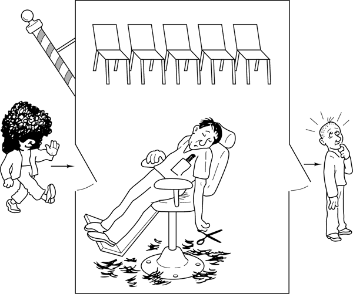

```c
#define CHAIRS 5               /* # chairs for waiting customers */ 
typedef int semaphore;         /* use your imagination */ 
semaphore customers = 0;       /* # of customers waiting for service */
semaphore barbers = 0;         /* # of barbers waiting for customers */ 
semaphore mutex = 1;           /* for mutual exclusion */ 
int waiting = 0;               /* customers are waiting (not being cut) */

void barber(void) 
{
    white (TRUE)
    {        
        down(&customers);      /* go to sleep if # of customers is 0 */        
        down(&mutex);          /* acquire access to 'waiting' */
        waiting = waiting − 1; /* decrement count of waiting customers */            
        up(&barbers);          /* one barber is now ready to cut hair */         
        up(&mutex);            /* release 'waiting' */
        cut_hair();            /* cut hair (outside critical region) */     
    } 
} 

void customer(void) 
{
    down(&mutex);              /* enter critical region */     
    if (waiting < CHAIRS)      /* if there are no free chairs, leave */
    {             
        waiting = waiting + 1; /* increment count of waiting customers */
        up(&customers);        /* wake up barber if necessary */         
        up(&mutex);            /* release access to 'waiting' */         
        down(&barbers);        /* go to sleep if # of free barbers is 0 */
        get_haircut();         /* be seated and be serviced */     
    } 
    else 
    {         
        up(&mutex);            /* shop is full; do not wait */
    }
}
```

Figure 2-36. A solution to the sleeping barber problem.

## 2.5 SCHEDULING
When a computer is multiprogrammed, it frequently has multiple processes competing for the CPU at the same time. This situation occurs whenever two or more processes are simultaneously in the ready state. If only one CPU is available, a choice has to be made which process to run next. The part of the operating system that makes the choice is called the scheduler and the algorithm it uses is called the scheduling algorithm.

Process Behavior


Figure 2-37. Bursts of CPU usage alternate with periods of waiting for I/O. (a) A CPU-bound process. (b) An I/O-bound process.

The important thing to notice about Fig. 2-37 is that some processes, such as the one in Fig. 2-37(a), spend most of their time computing, while others, such as the one in Fig. 2-37(b), spend most of their time waiting for I/O. The former are called compute-bound; the latter are called I/O-bound.

When to Schedule 

A nonpreemptive scheduling algorithm picks a process to run and then just lets it run until it blocks (either on I/O or waiting for another process) or until it voluntarily releases the CPU. In contrast, a preemptive scheduling algorithm picks a process and lets it run for a maximum of some fixed time.

Categories of Scheduling Algorithms
1. Batch.
2. Interactive.
3. Real time.

Scheduling Algorithm Goals
* All systems
    * Fairness - giving each process a fair share of the CPU
    * Policy enforcement - seeing that stated policy is carried out
    * Balance - keeping all parts of the system busy
* Batch systems
    * Throughput - maximize jobs per hour
    * Turnaround time - minimize time between submission and termination
    * CPU utilization - keep the CPU busy all the time
* Interactive systems
    * Response time - respond to requests quickly
    * Proportionality - meet users’ expectations
* Real-time systems
    * Meeting deadlines - avoid losing data
    * Predictability - avoid quality degradation in multimedia systems

Scheduling in Batch Systems
* First-Come First-Served
* Shortest Job First
* Shortest Remaining Time Next
    * A preemptive version of shortest job first is shortest remaining time next.
* Three-Level Scheduling


As jobs arrive at the system, they are initially placed in an input queue stored on the disk. The admission scheduler decides which jobs to admit to the system. The others are kept in the input queue until they are selected. A typical algorithm for admission control might be to look for a mix of compute-bound jobs and I/O-bound jobs. Alternatively, short jobs could be admitted quickly whereas longer jobs would have to wait. The admission scheduler is free to hold some jobs in the input queue and admit jobs that arrive later if it so chooses.

Once a job has been admitted to the system, a process can be created for it and it can contend for the CPU. However, it might well happen that the number of processes is so large that there is not enough room for all of them in memory. In that case, some of the processes have to be swapped out to disk. The second level of scheduling is deciding which processes should be kept in memory and which ones kept on disk. We will call this scheduler the memory scheduler, since it determines which processes are kept in memory and which on the disk.

The third level of scheduling is actually picking one of the ready processes in main memory to run next. Often this is called the CPU scheduler and is the one people usually mean when they talk about the “scheduler.” Any suitable algorithm can be used here, either preemptive or nonpreemptive.

Scheduling in Interactive Systems
* Round-Robin Scheduling
* Priority Scheduling
* Shortest Process Next
* Guaranteed Scheduling
* Lottery Scheduling
* Fair-Share Scheduling

# 3 DEADLOCKS
## 3.1 RESOURCES
Deadlocks can occur when processes have been granted exclusive access to devices, files, and so forth. To make the discussion of deadlocks as general as possible, we will refer to the objects granted as resources.

## 3.2 INTRODUCTION TO DEADLOCKS
Deadlock can be defined formally as follows:A set of processes is deadlocked if each process in the set is waiting for an event that only another process in the set can cause.

Coffman et al. (1971) showed that four conditions must hold for there to be a deadlock:
1. Mutual exclusion condition. Each resource is either currently assigned to exactly one process or is available.
2. Hold and wait condition. Processes currently holding resources granted earlier can request new resources.
3. No preemption condition. Resources previously granted cannot be forcibly taken away from a process. They must be explicitly released by the process holding them.
4. Circular wait condition. There must be a circular chain of two or more processes, each of which is waiting for a resource held by the next member of the chain.

In general, four strategies are used for dealing with deadlocks.
1. Just ignore the problem altogether. Maybe if you ignore it, it will ignore you.
2. Detection and recovery. Let deadlocks occur, detect them, and take action.
3. Dynamic avoidance by careful resource allocation.
4. Prevention, by structurally negating one of the four conditions necessary to cause a deadlock.

## 3.3 THE OSTRICH ALGORITHM
The simplest approach is the ostrich algorithm: stick your head in the sand and pretend there is no problem at all.

## 3.4 DEADLOCK DETECTION AND RECOVERY
### 3.4.1 Deadlock Detection with One Resource of Each Type
The state of which resources are currently owned and which ones are currently being requested is as follows:
1. Process A holds R and wants S.
2. Process B holds nothing but wants T.
3. Process C holds nothing but wants S.
4. Process D holds U and wants S and T.
5. Process E holds T and wants V.
6. Process F holds W and wants S.
7. Process G holds V and wants U.

The question is: “Is this system deadlocked, and if so, which processes are involved?”

To answer this question, we can construct the resource graph of Fig. 3-5(a). This graph contains one cycle, which can be seen by visual inspection. The cycle is shown in Fig. 3-5(b). From this cycle, we can see that processes D, E, and G are all deadlocked.

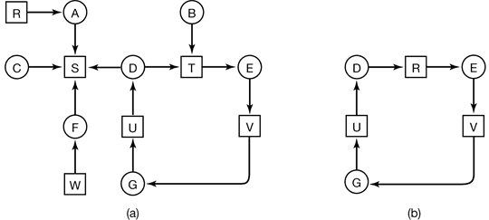

Figure 3-5. (a) A resource graph. (b) A cycle extracted from (a).

The algorithm operates by carrying out the following steps as specified:
1. For each node, N in the graph, perform the following 5 steps with N as the starting node.
2. Initialize L to the empty list, and designate all the arcs as unmarked.
3. Add the current node to the end of L and check to see if the node now appears in L two times. If it does, the graph contains a cycle (listed in L) and the algorithm terminates.
4. From the given node, see if there are any unmarked outgoing arcs. If so, go to step 5; if not, go to step 6.
5. Pick an unmarked outgoing arc at random and mark it. Then follow it to the new current node and go to step 3.
6. We have now reached a dead end. Remove it and go back to the previous node, that is, the one that was current just before this one, make that one the current node, and go to step 3. If this node is the initial node, the graph does not contain any cycles and the algorithm terminates.

### 3.4.2 Deadlock Detection with Multiple Resource of Each Type
E is the existing resource vector. It gives the total number of instances of each resource in existence. Let A be the available resource vector, with Ai giving the number of instances of resource i that are currently available (i.e., unassigned). Now we need two arrays, C, the current allocation matrix, and R, the request matrix.


Figure 3-6. The four data structures needed by the deadlock detection algorithm.

In particular, every resource is either allocated or is available. This observation means that

$\sum_{i=1}^n C_{ij}+A_j=E_j$

The deadlock detection algorithm can now be given, as follows.
1. Look for an unmarked process, Pi, for which the i-th row of R is less than or equal to A.
2. If such a process is found, add the i-th row of C to A, mark the process, and go back to step 1.
3. If no such process exists, the algorithm terminates.

### 3.4.3 Recovery from Deadlock
* Recovery through Preemption
* Recovery through Rollback
* Recovery through Killing Processes

## 3.5 DEADLOCK AVOIDANCE
### 3.5.1 Resource Trajectories
In Fig. 3-8 we see a model for dealing with two processes and two resources, for example, a printer and a plotter. The horizontal axis represents the number of instructions executed by process A. The vertical axis represents the number of instructions executed by process B. At I1 A requests a printer; at I2 it needs a plotter. The printer and plotter are released at I3 and I4, respectively. Process B needs the plotter from I5 to I7 and the printer from I6 to I8.

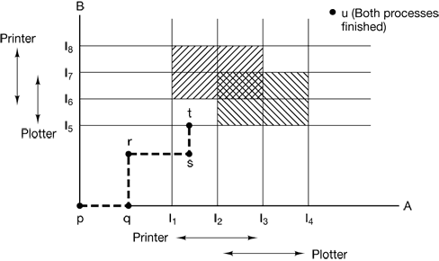

Figure 3-8. Two process resource trajectories.

### 3.5.3 The Banker’s Algorithm for a Single Resource
A scheduling algorithm that can avoid deadlocks is due to Dijkstra (1965) and is known as the banker’s algorithm and is an extension of the deadlock detection algorithm given in Sec. 3.4.1. It is modeled on the way a small-town banker might deal with a group of customers to whom he has granted lines of credit. What the algorithm does is check to see if granting the request leads to an unsafe state. If it does, the request is denied. If granting the request leads to a safe state, it is carried out.


Figure 3-11. Three resource allocation states: (a) Safe. (b) Safe (c) Unsafe.

### 3.5.4 The Banker’s Algorithm for Multiple Resources
The banker’s algorithm can be generalized to handle multiple resources.


Figure 3-12. The banker’s algorithm with multiple resources.

The algorithm for checking to see if a state is safe can now be stated.
1. Look for a row, R, whose unmet resource needs are all smaller than or equal to A. If no such row exists, the system will eventually deadlock since no process can run to completion.
2. Assume the process of the row chosen requests all the resources it needs (which is guaranteed to be possible) and finishes. Mark that process as terminated and add all its resources to the A vector.
3. Repeat steps 1 and 2 until either all processes are marked terminated, in which case the initial state was safe, or until a deadlock occurs, in which case it was not.

## 3.6 DEADLOCK PREVENTION
* Attacking the Mutual Exclusion Condition
* Attacking the Hold and Wait Condition
* Attacking the No Preemption Condition
* Attacking the Circular Wait Condition

## 3.7 OTHER ISSUES
### Two-Phase Locking
As an example, in many database systems, an operation that occurs frequently is requesting locks on several records and then updating all the locked records. When multiple processes are running at the same time, there is a real danger of deadlock.

The approach often used is called two-phase locking. In the first phase the process tries to lock all the records it needs, one at a time. If it succeeds, it begins the second phase, performing its updates and releasing the locks. No real work is done in the first phase.

# 4 MEMORY MANAGEMENT
## 4.1 BASIC MEMORY MANAGEMENT
### 4.1.1 Monoprogramming without Swapping or Paging
Three variations on this theme are shown in Fig. 4-1. The operating system may be at the bottom of memory in RAM (Random Access Memory), as shown in Fig. 4-1(a), or it may be in ROM (Read-Only Memory) at the top of memory, as shown in Fig. 4-1(b), or the device drivers may be at the top of memory in a ROM and the rest of the system in RAM down below, as shown in Fig. 4-1(c). The first model was formerly used on mainframes and minicomputers but is rarely used any more. The second model is used on some palmtop computers and embedded systems. The third model was used by early personal computers (e.g., running MS-DOS), where the portion of the system in the ROM is called the BIOS (Basic Input Output System).


Figure 4-1. Three simple ways of organizing memory with an operating system and one user process. Other possibilities also exist.

### 4.1.2 Multiprogramming with Fixed Partitions


Figure 4-2. (a) Fixed memory partitions with separate input queues for each partition. (b) Fixed memory partitions with a single input queue.

### 4.1.3 Modeling Multiprogramming
A better model is to look at CPU usage from a probabilistic viewpoint. Suppose that a process spends a fraction p of its time waiting for I/O to complete. With nprocesses in memory at once, the probability that all n processes are waiting for I/O (in which case the CPU will be idle) is pⁿ. The CPU utilization is then given by the formula

    CPU utilization = 1 – pⁿ

Figure 4-3 shows the CPU utilization as a function of n which is called the degree of multiprogramming.

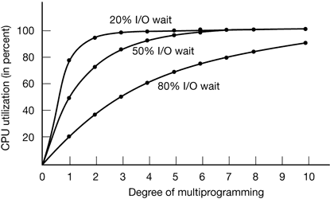

Figure 4-3. CPU utilization as a function of the number of processes in memory.

### 4.1.4 Analysis of Multiprogramming System Performance
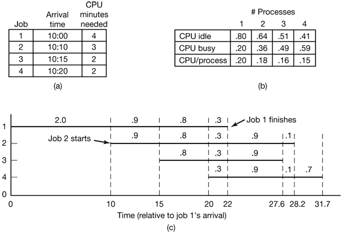

Figure 4-4. (a) Arrival and work requirements of four jobs. (b) CPU utilization for 1 to 4 jobs with 80 percent I/O wait. (c) Sequence of events as jobs arrive and finish. The numbers above the horizontal lines show how much CPU time, in minutes, each job gets in each interval.

### 4.1.5 Relocation and Protection
For example, suppose that the first instruction is a call to a procedure at absolute address 100 within the binary file produced by the linker. If this program is loaded in partition 1 (at address 100K), that instruction will jump to absolute address 100, which is inside the operating system. What is needed is a call to 100K + 100. If the program is loaded into partition 2, it must be carried out as a call to 200K + 100, and so on. This problem is known as the relocation problem.

The solution that IBM chose for protecting the 360 was to divide memory into blocks of 2-KB bytes and assign a 4-bit protection code to each block. The PSW (Program Status Word) contained a 4-bit key. The 360 hardware trapped any attempt by a running process to access memory whose protection code differed from the PSW key. Since only the operating system could change the protection codes and key, user processes were prevented from interfering with one another and with the operating system itself.

An alternative solution to both the relocation and protection problems is to equip the machine with two special hardware registers, called the base and limit registers. When a process is scheduled, the base register is loaded with the address of the start of its partition, and the limit register is loaded with the length of the partition. Every memory address generated automatically has the base register contents added to it before being sent to memory.

## 4.2 SWAPPING
Two general approaches to memory management can be used, depending (in part) on the available hardware. The simplest strategy, called swapping, consists of bringing in each process in its entirety, running it for a while, then putting it back on the disk. The other strategy, called virtual memory, allows programs to run even when they are only partially in main memory.

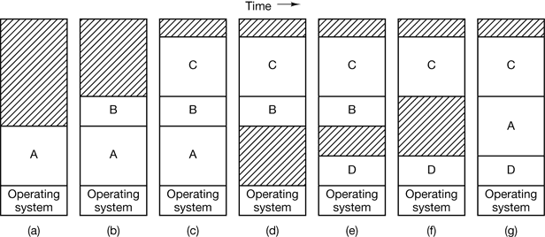

Figure 4-5. Memory allocation changes as processes come into memory and leave it. The shaded regions are unused memory.

When swapping creates multiple holes in memory, it is possible to combine them all into one big one by moving all the processes downward as far as possible. This technique is known as memory compaction.


Figure 4-6. (a) Allocating space for a growing data segment. (b) Allocating space for a growing stack and a growing data segment.

### 4.2.1 Memory Management with Bitmaps
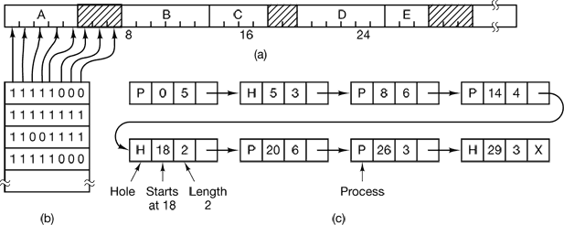

Figure 4-7. (a) A part of memory with five processes and three holes. The tick marks show the memory allocation units. The shaded regions (0 in the bitmap) are free. (b) The corresponding bitmap. (c) The same information as a list.

### 4.2.2 Memory Management with Linked Lists
* first fit
* next fit
* best fit
* worst fit
* quick fit, which maintains separate lists for some of the more common sizes requested.

## 4.3 VIRTUAL MEMORY
Many years ago people were first confronted with programs that were too big to fit in the available memory. The solution usually adopted was to split the program into pieces, called overlays. Overlay 0 would start running first. When it was done, it would call another overlay.

The method that was devised (Fotheringham, 1961) has come to be known as virtual memory .The basic idea behind virtual memory is that the combined size of the program, data, and stack may exceed the amount of physical memory available for it. The operating system keeps those parts of the program currently in use in main memory, and the rest on the disk.

### 4.3.1 Paging
Most virtual memory systems use a technique called paging, which we will now describe.

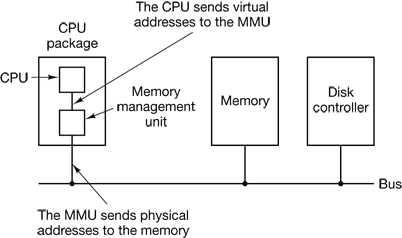

Figure 4-9. The position and function of the MMU. Here the MMU is shown as being a part of the CPU chip because it commonly is nowadays. However, logically it could be a separate chip and was in years gone by.

These program-generated addresses are called virtual addresses and form the virtual address space. On computers without virtual memory, the virtual address is put directly onto the memory bus and causes the physical memory word with the same address to be read or written. When virtual memory is used, the virtual addresses do not go directly to the memory bus. Instead, they go to an MMU (Memory Management Unit) that maps the virtual addresses onto the physical memory addresses as illustrated in Fig. 4-9.

A very simple example of how this mapping works is shown in Fig. 4-10. In this example, we have a computer that can generate 16-bit addresses, from 0 up to 64K. These are the virtual addresses. This computer, however, has only 32 KB of physical memory, so although 64-KB programs can be written, they cannot be loaded into memory in their entirety and run. A complete copy of a program’s core image, up to 64 KB, must be present on the disk, however, so that pieces can be brought in as needed.

The virtual address space is divided up into units called pages. The corresponding units in the physical memory are called page frames. The pages and page frames are always the same size. In this example they are 4 KB, but page sizes from 512 bytes to 64 KB have been used in real systems. With 64 KB of virtual address space and 32 KB of physical memory, we get 16 virtual pages and 8 page frames. Transfers between RAM and disk are always in units of a page.


Figure 4-10. The relation between virtual addresses and physical memory addresses is given by the page table.

 In the actual hardware, a Present/absent bit keeps track of which pages are physically present in memory.

 The MMU notices that the page is unmapped (indicated by a cross in the figure) and causes the CPU to trap to the operating system. This trap is called a page fault. The operating system picks a little-used page frame and writes its contents back to the disk. It then fetches the page just referenced into the page frame just freed, changes the map, and restarts the trapped instruction.

The page number is used as an index into the page table, yielding the number of the page frame corresponding to that virtual page.

### 4.3.2 Page Tables
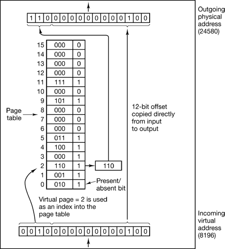

Figure 4-11. The internal operation of the MMU with 16 4-KB pages.

Multilevel Page Tables

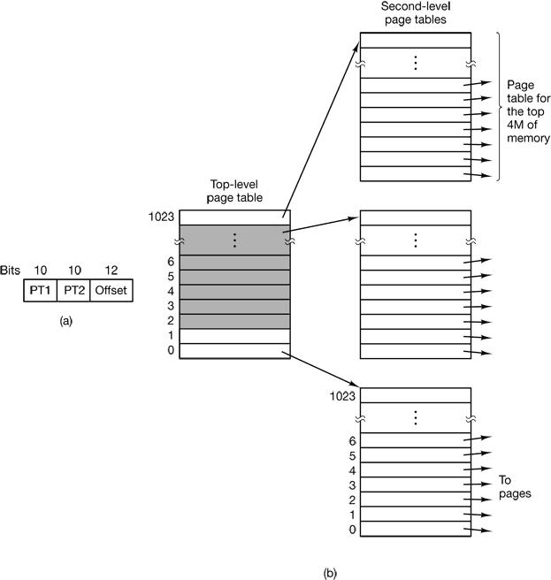

Figure 4-12. (a) A 32-bit address with two page table fields. (b) Two-level page tables.

Structure of a Page Table Entry


Figure 4-13. A typical page table entry

### 4.3.3 TLBs—Translation Lookaside Buffers
In most paging schemes, the page tables are kept in memory, due to their large size. Potentially, this design has an enormous impact on performance. The solution that has been devised is to equip computers with a small hardware device for mapping virtual addresses to physical addresses without going through the page table. The device, called a TLB (Translation Lookaside Buffer) or sometimes an associative memory, is illustrated in Fig. 4-14.


Figure 4-14. A TLB to speed up paging.

### 4.3.4 Inverted Page Tables
Traditional page tables of the type described so far require one entry per virtual page, since they are indexed by virtual page number. If the address space consists of 232 bytes, with 4096 bytes per page, then over 1 million page table entries are needed.

However, as 64-bit computers become more common, the situation changes drastically. If the address space is now 2⁶⁴ bytes, with 4-KB pages, we need a page table with 2⁵² entries. If each entry is 8 bytes, the table is over 30 million gigabytes.

One such solution is the inverted page table. In this design, there is one entry per page frame in real memory, rather than one entry per page of virtual address space. For example, with 64-bit virtual addresses, a 4-KB page, and 256 MB of RAM, an inverted page table only requires 65,536 entries. The entry keeps track of which (process, virtual page) is located in the page frame.


Figure 4-15. Comparison of a traditional page table with an inverted page table.

## 4.4 PAGE REPLACEMENT ALGORITHMS
* The Optimal Page Replacement Algorithm
* The Not Recently Used Page Replacement Algorithm
    * R is set whenever the page is referenced (read or written). M is set when the page is written to (i.e., modified).
    * When a page fault occurs, the operating system inspects all the pages and divides them into four categories based on the current values of their R and M bits:
      * Class 0: not referenced, not modified.
      * Class 1: not referenced, modified.
      * Class 2: referenced, not modified.
      * Class 3: referenced, modified.
    * Although class 1 pages seem, at first glance, impossible, they occur when a class 3 page has its R bit cleared by a clock interrupt. Clock interrupts do not clear the M bit because this information is needed to know whether the page has to be rewritten to disk or not. Clearing R but not M leads to a class 1 page.
    * The NRU (Not Recently Used) algorithm removes a page at random from the lowest numbered nonempty class. Implicit in this algorithm is that it is better to remove a modified page that has not been referenced in at least one dock tick (typically 20 msec) than a clean page that is in heavy use.
* The First-In, First-Out (FIFO) Page Replacement Algorithm
* The Second Chance Page Replacement Algorithm
* The Clock Page Replacement Algorithm
* The Least Recently Used (LRU) Page Replacement Algorithm
    * For a machine with n page frames, the LRU hardware can maintain a matrix of n × n bits, initially all zero. Whenever page frame k is referenced, the hardware first sets all the bits of row k to 1, then sets all the bits of column k to 0. At any instant, the row whose binary value is lowest is the least recently used, the row whose value is next lowest is next least recently used, and so forth.

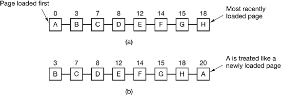

Figure 4-16. Operation of second chance. (a) Pages sorted in FIFO order. (b) Page list if a page fault occurs at time 20 and A has its R bit set. The numbers above the pages are their loading times.


Figure 4-17. The clock page replacement algorithm.


Figure 4-18. LRU using a matrix when pages are referenced in the order 0, 1, 2, 3, 2, 1, 0, 3, 2, 3.

* Simulating LRU in Software
    * One possibility is called the NFU (Not Frequently Used) algorithm. It requires a software counter associated with each page, initially zero. At each clock interrupt, the operating system scans all the pages in memory. For each page, the R bit, which is 0 or 1, is added to the counter. In effect, the counters are an attempt to keep track of how often each page has been referenced. When a page fault occurs, the page with the lowest counter is chosen for replacement.
    * The main problem with NFU is that it never forgets anything.
    * Fortunately, a small modification to NFU makes it able to simulate LRU quite well. The modification has two parts. First, the counters are each shifted right 1 bit before the R bit is added in. Second, the R bit is added to the leftmost, rather than the rightmost bit.
    * Figure 4-19 illustrates how the modified algorithm, known as aging, works. Suppose that after the first clock tick the R bits for pages 0 to 5 have the values 1, 0, 1, 0, 1, and 1, respectively (page 0 is 1, page 1 is 0, page 2 is 1, etc.). In other words, between tick 0 and tick 1, pages 0, 2, 4, and 5 were referenced, setting their R bits to 1, while the other ones remain 0. After the six corresponding counters have been shifted and the R bit inserted at the left, they have the values shown in Fig. 4-19(a). The four remaining columns show the six counters after the next four clock ticks.


Figure 4-19. The aging algorithm simulates LRU in software. Shown are six pages for five clock ticks. The five clock ticks are represented by (a) to (e).

* The Working Set Page Replacement Algorithm
    * In the purest form of paging, processes are started up with none of their pages in memory. As soon as the CPU tries to fetch the first instruction, it gets a page fault, causing the operating system to bring in the page containing the first instruction. Other page faults for global variables and the stack usually follow quickly. After a while, the process has most of the pages it needs and settles down to run with relatively few page faults. This strategy is called demand paging because pages are loaded only on demand, not in advance.
    * Of course, it is easy enough to write a test program that systematically reads all the pages in a large address space, causing so many page faults that there is not enough memory to hold them all. Fortunately, most processes do not work this way. They exhibit a locality of reference, meaning that during any phase of execution, the process references only a relatively small fraction of its pages.
    * The set of pages that a process is currently using is called its working set (Denning, 1968a; Denning, 1980). If the entire working set is in memory, the process will run without causing many faults until it moves into another execution phase (e.g., the next pass of the compiler). If the available memory is too small to hold the entire working set, the process will cause many page faults and run slowly since executing an instruction takes a few nanoseconds and reading in a page from the disk typically takes 10 milliseconds. At a rate of one or two instructions per 10 milliseconds, it will take ages to finish. A program causing page faults every few instructions is said to be thrashing (Denning, 1968b).
    * Therefore, many paging systems try to keep track of each process‘ working set and make sure that it is in memory before letting the process run. This approach is called the working set model (Denning, 1970). It is designed to greatly reduce the page fault rate. Loading the pages before letting processes run is also called prepaging. Note that the working set changes over time.
    * If a process starts running at time T and has had 40 msec of CPU time at real time T + 100 msec, for working set purposes, its time is 40 msec. The amount of CPU time a process has actually used has since it started is often called its current virtual time. With this approximation, the working set of a process is the set of pages it has referenced during the past τ seconds of virtual time.

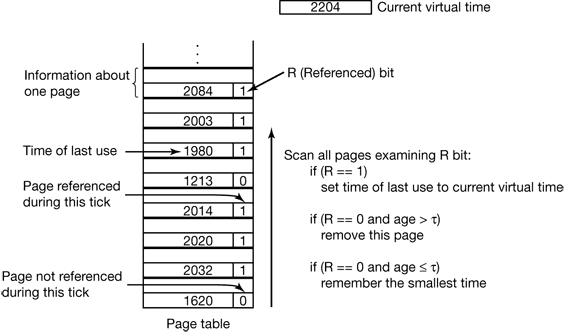

Figure 4-21. The working set algorithm.

* The WSClock Page Replacement Algorithm
    * The basic working set algorithm is cumbersome since the entire page table has to be scanned at each page fault until a suitable candidate is located. An improved algorithm, that is based on the clock algorithm but also uses the working set information is called WSClock.
    * In principle, all pages might be scheduled for disk I/O on one cycle around the clock. To reduce disk traffic, a limit might be set, allowing a maximum of n pages to be written back. Once this limit has been reached, no new writes are scheduled.
        * What happens if the hand comes all the way around to its starting point? There are two cases to distinguish:
            * At least one write has been scheduled.
            * No writes have been scheduled.
        * In the former case, the hand just keeps moving, looking for a clean page. Since one or more writes have been scheduled, eventually some write will complete and its page will be marked as clean. The first clean page encountered is evicted. This page is not necessarily the first write scheduled because the disk driver may reorder writes in order to optimize disk performance.
        * In the latter case, all pages are in the working set, otherwise at least one write would have been scheduled. Lacking additional information, the simplest thing to do is claim any clean page and use it. The location of a clean page could be kept track of during the sweep. If no clean pages exist, then the current page is chosen and written back to disk.


