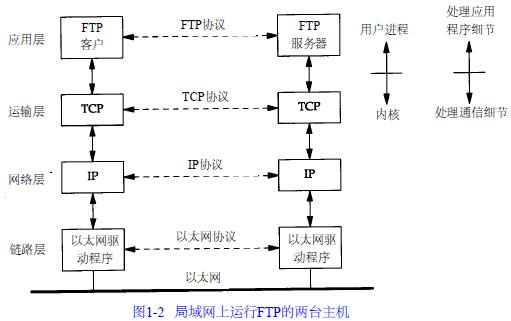
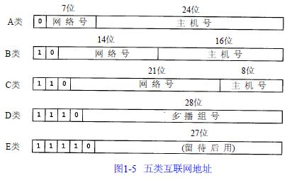
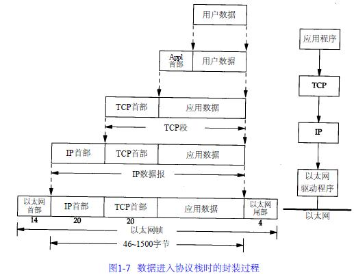

    作者:  [美] W·Richard Stevens
    出版社: 机械工业出版社
    原作名: TCP/IP ILLustrated Volume 1: The Protocols
    译者: 范建华
    出版年: 2000-4-1
    页数: 423
    定价: 45.00元
    装帧: 平装
    丛书: TCP/IP详解（中文版）
    ISBN: 9787111075660

[豆瓣链接](https://book.douban.com/subject/1088054/)

- [第一章 概述](#%e7%ac%ac%e4%b8%80%e7%ab%a0-%e6%a6%82%e8%bf%b0)
  - [1.1 分层](#11-%e5%88%86%e5%b1%82)
  - [1.2 TCP/IP的分层](#12-tcpip%e7%9a%84%e5%88%86%e5%b1%82)
  - [1.3 互联网地址](#13-%e4%ba%92%e8%81%94%e7%bd%91%e5%9c%b0%e5%9d%80)
  - [1.4 封装](#14-%e5%b0%81%e8%a3%85)
  - [1.5 分用](#15-%e5%88%86%e7%94%a8)
- [第二章 链路层](#%e7%ac%ac%e4%ba%8c%e7%ab%a0-%e9%93%be%e8%b7%af%e5%b1%82)
  - [2.1 以太网和IEEE 802封装](#21-%e4%bb%a5%e5%a4%aa%e7%bd%91%e5%92%8cieee-802%e5%b0%81%e8%a3%85)

## 第一章 概述
### 1.1 分层

### 1.2 TCP/IP的分层

### 1.3 互联网地址

### 1.4 封装
TCP传给IP的数据单元称作TCP报文段或简称为TCP段(TCP segment)。IP传给网络接口层的数据单元称作IP数据报(IP datagram)。通过以太网传输的比特流称作帧(Frame)。

### 1.5 分用
当目的主机收到一个以太网数据帧时，数据就开始从协议栈中由底向上升，同时去掉各层协议加上的报文首部。每层协议盒都要去检查报文首部中的协议标识，以确定接收数据的上层协议。这个过程称作分用(Demultiplexing)，图1-8显示了该过程是如何发生的。

## 第二章 链路层
### 2.1 以太网和IEEE 802封装
最常使用的封装格式是RFC 894定义的格式。图2 - 1显示了两种不同形式的封装格式。图中每个方框下面的数字是它们的字节长度。

两种帧格式都采用48 bit（6字节）的目的地址和源地址。这就是我们在本书中所称的硬件地址。ARP和RARP协议对32 bit的IP地址和48 bit的硬件地址进行映射。

