    作者:  [美] W·Richard Stevens
    出版社: 机械工业出版社
    原作名: TCP/IP ILLustrated Volume 1: The Protocols
    译者: 范建华
    出版年: 2000-4-1
    页数: 423
    定价: 45.00元
    装帧: 平装
    丛书: TCP/IP详解（中文版）
    ISBN: 9787111075660

[豆瓣链接](https://book.douban.com/subject/1088054/)

- [第一章 概述](#%e7%ac%ac%e4%b8%80%e7%ab%a0-%e6%a6%82%e8%bf%b0)
  - [1.1 分层](#11-%e5%88%86%e5%b1%82)
  - [1.2 TCP/IP的分层](#12-tcpip%e7%9a%84%e5%88%86%e5%b1%82)
  - [1.3 互联网地址](#13-%e4%ba%92%e8%81%94%e7%bd%91%e5%9c%b0%e5%9d%80)
  - [1.4 封装](#14-%e5%b0%81%e8%a3%85)
  - [1.5 分用](#15-%e5%88%86%e7%94%a8)
- [第二章 链路层](#%e7%ac%ac%e4%ba%8c%e7%ab%a0-%e9%93%be%e8%b7%af%e5%b1%82)
  - [2.1 以太网和IEEE 802封装](#21-%e4%bb%a5%e5%a4%aa%e7%bd%91%e5%92%8cieee-802%e5%b0%81%e8%a3%85)
  - [2.2 SLIP：串行线路IP](#22-slip%e4%b8%b2%e8%a1%8c%e7%ba%bf%e8%b7%afip)
  - [2.3 压缩的SLIP](#23-%e5%8e%8b%e7%bc%a9%e7%9a%84slip)
  - [2.4 PPP：点对点协议](#24-ppp%e7%82%b9%e5%af%b9%e7%82%b9%e5%8d%8f%e8%ae%ae)
  - [2.5 环回接口](#25-%e7%8e%af%e5%9b%9e%e6%8e%a5%e5%8f%a3)
  - [2.6 最大传输单元MTU](#26-%e6%9c%80%e5%a4%a7%e4%bc%a0%e8%be%93%e5%8d%95%e5%85%83mtu)
  - [2.7 路径MTU](#27-%e8%b7%af%e5%be%84mtu)
- [第三章 IP：网际协议](#%e7%ac%ac%e4%b8%89%e7%ab%a0-ip%e7%bd%91%e9%99%85%e5%8d%8f%e8%ae%ae)
  - [3.1 IP首部](#31-ip%e9%a6%96%e9%83%a8)
  - [3.2 子网掩码](#32-%e5%ad%90%e7%bd%91%e6%8e%a9%e7%a0%81)
  - [3.3 特殊情况的IP地址](#33-%e7%89%b9%e6%ae%8a%e6%83%85%e5%86%b5%e7%9a%84ip%e5%9c%b0%e5%9d%80)
- [第4章ARP：地址解析协议](#%e7%ac%ac4%e7%ab%a0arp%e5%9c%b0%e5%9d%80%e8%a7%a3%e6%9e%90%e5%8d%8f%e8%ae%ae)
  - [4.1 ARP高速缓存](#41-arp%e9%ab%98%e9%80%9f%e7%bc%93%e5%ad%98)
  - [4.2 ARP的分组格式](#42-arp%e7%9a%84%e5%88%86%e7%bb%84%e6%a0%bc%e5%bc%8f)
  - [4.3 ARP代理](#43-arp%e4%bb%a3%e7%90%86)
  - [4.4 免费ARP](#44-%e5%85%8d%e8%b4%b9arp)
- [第5章RARP：逆地址解析协议](#%e7%ac%ac5%e7%ab%a0rarp%e9%80%86%e5%9c%b0%e5%9d%80%e8%a7%a3%e6%9e%90%e5%8d%8f%e8%ae%ae)
- [第6章ICMP：Internet控制报文协议](#%e7%ac%ac6%e7%ab%a0icmpinternet%e6%8e%a7%e5%88%b6%e6%8a%a5%e6%96%87%e5%8d%8f%e8%ae%ae)
- [第7章Ping程序](#%e7%ac%ac7%e7%ab%a0ping%e7%a8%8b%e5%ba%8f)
- [第8章Traceroute程序](#%e7%ac%ac8%e7%ab%a0traceroute%e7%a8%8b%e5%ba%8f)
- [第9章IP选路](#%e7%ac%ac9%e7%ab%a0ip%e9%80%89%e8%b7%af)
  - [9.1 选路的原理](#91-%e9%80%89%e8%b7%af%e7%9a%84%e5%8e%9f%e7%90%86)
    - [9.1.1 简单路由表](#911-%e7%ae%80%e5%8d%95%e8%b7%af%e7%94%b1%e8%a1%a8)
    - [9.1.2 初始化路由表](#912-%e5%88%9d%e5%a7%8b%e5%8c%96%e8%b7%af%e7%94%b1%e8%a1%a8)
  - [9.2 ICMP主机与网络不可达差错](#92-icmp%e4%b8%bb%e6%9c%ba%e4%b8%8e%e7%bd%91%e7%bb%9c%e4%b8%8d%e5%8f%af%e8%be%be%e5%b7%ae%e9%94%99)
  - [9.3 ICMP重定向差错](#93-icmp%e9%87%8d%e5%ae%9a%e5%90%91%e5%b7%ae%e9%94%99)
    - [9.3.1 ICMP重定向报文](#931-icmp%e9%87%8d%e5%ae%9a%e5%90%91%e6%8a%a5%e6%96%87)
  - [9.4 ICMP路由器发现报文](#94-icmp%e8%b7%af%e7%94%b1%e5%99%a8%e5%8f%91%e7%8e%b0%e6%8a%a5%e6%96%87)
    - [9.4.1 路由器操作](#941-%e8%b7%af%e7%94%b1%e5%99%a8%e6%93%8d%e4%bd%9c)
    - [9.4.2 主机操作](#942-%e4%b8%bb%e6%9c%ba%e6%93%8d%e4%bd%9c)
- [第10章 动态选路协议](#%e7%ac%ac10%e7%ab%a0-%e5%8a%a8%e6%80%81%e9%80%89%e8%b7%af%e5%8d%8f%e8%ae%ae)
  - [10.1 动态选路](#101-%e5%8a%a8%e6%80%81%e9%80%89%e8%b7%af)
  - [10.2 Unix选路守护程序](#102-unix%e9%80%89%e8%b7%af%e5%ae%88%e6%8a%a4%e7%a8%8b%e5%ba%8f)
  - [10.3 RIP：选路信息协议](#103-rip%e9%80%89%e8%b7%af%e4%bf%a1%e6%81%af%e5%8d%8f%e8%ae%ae)
    - [10.3.1 报文格式](#1031-%e6%8a%a5%e6%96%87%e6%a0%bc%e5%bc%8f)
    - [10.3.2 正常运行](#1032-%e6%ad%a3%e5%b8%b8%e8%bf%90%e8%a1%8c)
    - [10.3.3 度量](#1033-%e5%ba%a6%e9%87%8f)
    - [10.3.4 问题](#1034-%e9%97%ae%e9%a2%98)
  - [10.4 RIP版本2](#104-rip%e7%89%88%e6%9c%ac2)
  - [10.5 OSPF：开放最短路径优先](#105-ospf%e5%bc%80%e6%94%be%e6%9c%80%e7%9f%ad%e8%b7%af%e5%be%84%e4%bc%98%e5%85%88)
  - [10.6 BGP：边界网关协议](#106-bgp%e8%be%b9%e7%95%8c%e7%bd%91%e5%85%b3%e5%8d%8f%e8%ae%ae)
  - [10.7 CIDR：无类型域间选路](#107-cidr%e6%97%a0%e7%b1%bb%e5%9e%8b%e5%9f%9f%e9%97%b4%e9%80%89%e8%b7%af)
- [第11章 UDP：用户数据报协议](#%e7%ac%ac11%e7%ab%a0-udp%e7%94%a8%e6%88%b7%e6%95%b0%e6%8d%ae%e6%8a%a5%e5%8d%8f%e8%ae%ae)
  - [11.1 UDP封装与UDP首部](#111-udp%e5%b0%81%e8%a3%85%e4%b8%8eudp%e9%a6%96%e9%83%a8)
  - [11.2 UDP检验和](#112-udp%e6%a3%80%e9%aa%8c%e5%92%8c)
  - [11.3 IP分片](#113-ip%e5%88%86%e7%89%87)
  - [11.4 ICMP不可达差错（需要分片）](#114-icmp%e4%b8%8d%e5%8f%af%e8%be%be%e5%b7%ae%e9%94%99%e9%9c%80%e8%a6%81%e5%88%86%e7%89%87)
  - [11.5 UDP和ARP之间的交互作用](#115-udp%e5%92%8carp%e4%b9%8b%e9%97%b4%e7%9a%84%e4%ba%a4%e4%ba%92%e4%bd%9c%e7%94%a8)
  - [11.6 UDP服务器的设计](#116-udp%e6%9c%8d%e5%8a%a1%e5%99%a8%e7%9a%84%e8%ae%be%e8%ae%a1)
    - [11.6.1 客户IP地址及端口号](#1161-%e5%ae%a2%e6%88%b7ip%e5%9c%b0%e5%9d%80%e5%8f%8a%e7%ab%af%e5%8f%a3%e5%8f%b7)
    - [11.6.2 目的IP地址](#1162-%e7%9b%ae%e7%9a%84ip%e5%9c%b0%e5%9d%80)
    - [11.6.3 UDP输入队列](#1163-udp%e8%be%93%e5%85%a5%e9%98%9f%e5%88%97)
    - [11.6.4 限制本地IP地址](#1164-%e9%99%90%e5%88%b6%e6%9c%ac%e5%9c%b0ip%e5%9c%b0%e5%9d%80)
    - [11.6.5 限制远端IP地址](#1165-%e9%99%90%e5%88%b6%e8%bf%9c%e7%ab%afip%e5%9c%b0%e5%9d%80)
- [第12章 广播和多播](#%e7%ac%ac12%e7%ab%a0-%e5%b9%bf%e6%92%ad%e5%92%8c%e5%a4%9a%e6%92%ad)
  - [12.1 广播](#121-%e5%b9%bf%e6%92%ad)
    - [12.1.1 受限的广播](#1211-%e5%8f%97%e9%99%90%e7%9a%84%e5%b9%bf%e6%92%ad)
    - [12.1.2 指向网络的广播](#1212-%e6%8c%87%e5%90%91%e7%bd%91%e7%bb%9c%e7%9a%84%e5%b9%bf%e6%92%ad)
    - [12.1.3 指向子网的广播](#1213-%e6%8c%87%e5%90%91%e5%ad%90%e7%bd%91%e7%9a%84%e5%b9%bf%e6%92%ad)
    - [12.1.4 指向所有子网的广播](#1214-%e6%8c%87%e5%90%91%e6%89%80%e6%9c%89%e5%ad%90%e7%bd%91%e7%9a%84%e5%b9%bf%e6%92%ad)
  - [12.2 组播](#122-%e7%bb%84%e6%92%ad)
- [第13章 IGMP：Internet组管理协议](#%e7%ac%ac13%e7%ab%a0-igmpinternet%e7%bb%84%e7%ae%a1%e7%90%86%e5%8d%8f%e8%ae%ae)
  - [13.1 IGMP报文](#131-igmp%e6%8a%a5%e6%96%87)
  - [13.2 IGMP协议](#132-igmp%e5%8d%8f%e8%ae%ae)
    - [13.2.1 加入一个多播组](#1321-%e5%8a%a0%e5%85%a5%e4%b8%80%e4%b8%aa%e5%a4%9a%e6%92%ad%e7%bb%84)
    - [13.2.2 IGMP报告和查询](#1322-igmp%e6%8a%a5%e5%91%8a%e5%92%8c%e6%9f%a5%e8%af%a2)
    - [13.2.3 TTL](#1323-ttl)
    - [13.2.4 所有主机组](#1324-%e6%89%80%e6%9c%89%e4%b8%bb%e6%9c%ba%e7%bb%84)
- [第14章 DNS：域名系统](#%e7%ac%ac14%e7%ab%a0-dns%e5%9f%9f%e5%90%8d%e7%b3%bb%e7%bb%9f)
  - [14.1 DNS基础](#141-dns%e5%9f%ba%e7%a1%80)
  - [14.2 DNS的报文格式](#142-dns%e7%9a%84%e6%8a%a5%e6%96%87%e6%a0%bc%e5%bc%8f)
    - [14.2.1 DNS查询报文中的问题部分](#1421-dns%e6%9f%a5%e8%af%a2%e6%8a%a5%e6%96%87%e4%b8%ad%e7%9a%84%e9%97%ae%e9%a2%98%e9%83%a8%e5%88%86)
    - [14.2.2 DNS响应报文中的资源记录部分](#1422-dns%e5%93%8d%e5%ba%94%e6%8a%a5%e6%96%87%e4%b8%ad%e7%9a%84%e8%b5%84%e6%ba%90%e8%ae%b0%e5%bd%95%e9%83%a8%e5%88%86)
- [第15章 TFTP:简单文件传送协议](#%e7%ac%ac15%e7%ab%a0-tftp%e7%ae%80%e5%8d%95%e6%96%87%e4%bb%b6%e4%bc%a0%e9%80%81%e5%8d%8f%e8%ae%ae)
- [第16章 BOOTP:引导程序协议](#%e7%ac%ac16%e7%ab%a0-bootp%e5%bc%95%e5%af%bc%e7%a8%8b%e5%ba%8f%e5%8d%8f%e8%ae%ae)
  - [16.1 BOOTP的分组格式](#161-bootp%e7%9a%84%e5%88%86%e7%bb%84%e6%a0%bc%e5%bc%8f)
  - [16.2 端口号](#162-%e7%ab%af%e5%8f%a3%e5%8f%b7)
  - [16.3 BOOTP服务器的设计](#163-bootp%e6%9c%8d%e5%8a%a1%e5%99%a8%e7%9a%84%e8%ae%be%e8%ae%a1)
  - [16.4 BOOTP穿越路由器](#164-bootp%e7%a9%bf%e8%b6%8a%e8%b7%af%e7%94%b1%e5%99%a8)
  - [16.5 特定厂商信息](#165-%e7%89%b9%e5%ae%9a%e5%8e%82%e5%95%86%e4%bf%a1%e6%81%af)
- [第17章 TCP:传输控制协议](#%e7%ac%ac17%e7%ab%a0-tcp%e4%bc%a0%e8%be%93%e6%8e%a7%e5%88%b6%e5%8d%8f%e8%ae%ae)
- [第18章 TCP连接的建立与终止](#%e7%ac%ac18%e7%ab%a0-tcp%e8%bf%9e%e6%8e%a5%e7%9a%84%e5%bb%ba%e7%ab%8b%e4%b8%8e%e7%bb%88%e6%ad%a2)

## 第一章 概述
### 1.1 分层


### 1.2 TCP/IP的分层


### 1.3 互联网地址


### 1.4 封装
TCP传给IP的数据单元称作TCP报文段或简称为TCP段(TCP segment)。IP传给网络接口层的数据单元称作IP数据报(IP datagram)。通过以太网传输的比特流称作帧(Frame)。


### 1.5 分用
当目的主机收到一个以太网数据帧时，数据就开始从协议栈中由底向上升，同时去掉各层协议加上的报文首部。每层协议盒都要去检查报文首部中的协议标识，以确定接收数据的上层协议。这个过程称作分用(Demultiplexing)，图1-8显示了该过程是如何发生的。

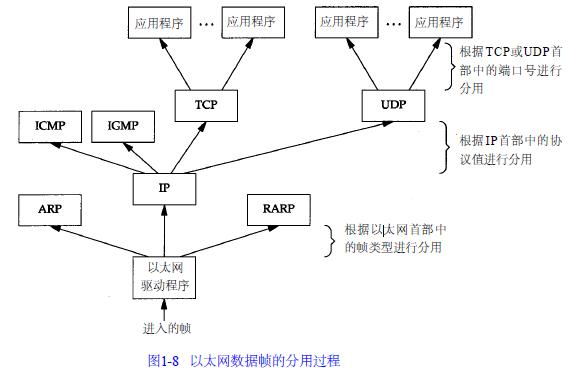

## 第二章 链路层
### 2.1 以太网和IEEE 802封装
最常使用的封装格式是RFC 894定义的格式。图2 - 1显示了两种不同形式的封装格式。图中每个方框下面的数字是它们的字节长度。

两种帧格式都采用48 bit（6字节）的目的地址和源地址。这就是我们在本书中所称的硬件地址。ARP和RARP协议对32 bit的IP地址和48 bit的硬件地址进行映射。


接下来的2个字节在两种帧格式中互不相同。在802标准定义的帧格式中，长度字段是指它后续数据的字节长度，但不包括CRC检验码。以太网的类型字段定义了后续数据的类型。在802标准定义的帧格式中，类型字段则由后续的子网接入协议（Sub-network Access Protocol，SNAP）的首部给出。幸运的是， 802定义的有效长度值与以太网的有效类型值无一相同，这样，就可以对两种帧格式进行区分。

在以太网帧格式中，类型字段之后就是数据；而在802帧格式中，跟随在后面的是3字节的802.2 LLC和5字节的802.2 SNAP。目的服务访问点（ Destination Service Access Point,DSAP）和源服务访问点（Source Service Access Point, SSAP）的值都设为0xaa。Ctrl字段的值设为3。随后的3个字节org code都置为0。再接下来的2个字节类型字段和以太网帧格式一样。

CRC字段用于帧内后续字节差错的循环冗余码检验（检验和）。

802.3标准定义的帧和以太网的帧都有最小长度要求。802.3规定数据部分必须至少为38字节，而对于以太网，则要求最少要有46字节。为了保证这一点，必须在不足的空间插入填充（pad）字节。

### 2.2 SLIP：串行线路IP
SLIP的全称是Serial Line IP。它是一种在串行线路上对IP数据报进行封装的简单形式，在RFC 1055中有详细描述。下面的规则描述了SLIP协议定义的帧格式：

1. IP数据报以一个称作END（0xc0）的特殊字符结束。同时，为了防止数据报到来之前的线路噪声被当成数据报内容，大多数实现在数据报的开始处也传一个END字符（如果有线路噪声，那么END字符将结束这份错误的报文。这样当前的报文得以正确地传输，而前一个错误报文交给上层后，会发现其内容毫无意义而被丢弃）。
2. 如果IP报文中某个字符为END，那么就要连续传输两个字节0xdb和0xdc来取代它。0xdb这个特殊字符被称作SLIP的ESC字符，但是它的值与AS CII码的ESC字符（0x1b）不同。
3. 如果IP报文中某个字符为SLIP的ESC字符，那么就要连续传输两个字节0xdb和0xdd来取代它。

图2-2中的例子就是含有一个END字符和一个ESC字符的IP报文。在这个例子中，在串行线路上传输的总字节数是原IP报文长度再加4个字节。

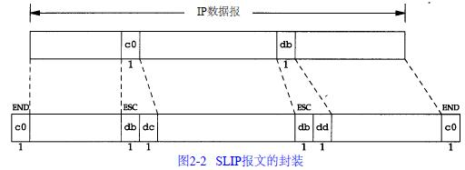

SLIP是一种简单的帧封装方法，还有一些值得一提的缺陷：
1. 每一端必须知道对方的IP地址。没有办法把本端的IP地址通知给另一端。
2. 数据帧中没有类型字段（类似于以太网中的类型字段）。如果一条串行线路用于SLIP，那么它不能同时使用其他协议。
3. SLIP没有在数据帧中加上检验和（类似于以太网中的CRC字段）。如果SLIP传输的报文被线路噪声影响而发生错误，只能通过上层协议来发现。

### 2.3 压缩的SLIP
由于串行线路的速率通常较低（19200 b/s或更低），而且通信经常是交互式的（如Telnet和Rlogin，二者都使用TCP），因此在SLIP线路上有许多小的TCP分组进行交换。为了传送1个字节的数据需要20个字节的IP首部和20个字节的TCP首部。于是人们提出一个被称作CSLIP（即压缩SLIP）的新协议，它在RFC 1144中被详细描述。CSLIP一般能把上面的40个字节压缩到3或5个字节。它能在CSLIP的每一端维持多达16个TCP连接，并且知道其中每个连接的首部中的某些字段一般不会发生变化。对于那些发生变化的字段，大多数只是一些小的数字和的改变。这些被压缩的首部大大地缩短了交互响应时间。

### 2.4 PPP：点对点协议
PPP包括以下三个部分：

1. 在串行链路上封装IP数据报的方法。PPP既支持数据为8位和无奇偶检验的异步模式（如大多数计算机上都普遍存在的串行接口），还支持面向比特的同步链接。
2. 建立、配置及测试数据链路的链路控制协议（LCP：Link Control Protocol）。它允许通信双方进行协商，以确定不同的选项。
3. 针对不同网络层协议的网络控制协议（NCP：Network Control Protocol）体系。当前RFC定义的网络层有IP、OSI网络层、DECnet以及Apple Talk。

图2-3是PPP数据帧的格式。每一帧都以标志字符0x7e开始和结束。紧接着是一个地址字节，值始终是0xff，然后是一个值为0x03的控制字节。


接下来是协议字段，类似于以太网中类型字段的功能。当它的值为0x0021时，表示信息字段是一个IP数据报；值为0xc021时，表示信息字段是链路控制数据；值为0x8021时，表示信息字段是网络控制数据。

CRC字段是一个循环冗余检验码，以检测数据帧中的错误。

由于标志字符的值是0x7e，因此当该字符出现在信息字段中时，PPP需要对它进行转义。在同步链路中，该过程是通过一种称作比特填充(bit stuffing)的硬件技术来完成的。在异步链路中，特殊字符0x7d用作转义字符。当它出现在PPP数据帧中时，那么紧接着的字符的第6个比特要取其补码，具体实现过程如下：

1. 当遇到字符0x7e时，需连续传送两个字符： 0x7d和0x5e，以实现标志字符的转义。
2. 当遇到转义字符0x7d时，需连续传送两个字符：0x7d和0x5d，以实现转义字符的转义。
3. 默认情况下，如果字符的值小于0x20（比如，一个ASCII控制字符），一般都要进行转义。

利用链路控制协议，大多数的产品通过协商可以省略标志符和地址字段。

总的来说，PPP比SLIP具有下面这些优点：

1. PPP支持在单根串行线路上运行多种协议，不只是IP协议；
2. 每一帧都有循环冗余检验； 
3. 通信双方可以进行IP地址的动态协商(使用IP网络控制协议)；
4. 与CSLIP类似，对TCP和IP报文首部进行压缩；
5. 链路控制协议可以对多个数据链路选项进行设置。为这些优点付出的代价是在每一帧的首部增加3个字节，当建立链路时要发送几帧协商数据，以及更为复杂的实现。

### 2.5 环回接口
大多数的产品都支持环回接口（Loopback Interface），以允许运行在同一台主机上的客户程序和服务器程序通过TCP/IP进行通信。A类网络号127就是为环回接口预留的。根据惯例，大多数系统把IP地址127.0.0.1分配给这个接口，并命名为localhost。一个传给环回接口的IP数据报不能在任何网络上出现。


图中需要指出的关键点是：

1. 传给环回地址（一般是127.0.0.1）的任何数据均作为IP输入。
2. 传给广播地址或多播地址的数据报复制一份传给环回接口，然后送到以太网上。这是因为广播传送和多播传送的定义包含主机本身。
3. 任何传给该主机IP地址的数据均送到环回接口。

### 2.6 最大传输单元MTU
以太网和802.3对数据帧的长度都有一个限制，其最大值分别是1500和1492字节。链路层的这个特性称作MTU，最大传输单元。


如果IP层有一个数据报要传，而且数据的长度比链路层的MTU还大，那么IP层就需要进行分片（fragmentation）。

### 2.7 路径MTU
当在同一个网络上的两台主机互相进行通信时，该网络的MTU是非常重要的。但是如果两台主机之间的通信要通过多个网络，那么每个网络的链路层就可能有不同的MTU。重要的不是两台主机所在网络的MTU的值，重要的是两台通信主机路径中的最小MTU。它被称作路径MTU。

## 第三章 IP：网际协议
### 3.1 IP首部
IP数据报的格式如图3-1所示。普通的IP首部长为20个字节，除非含有选项字段。


4个字节的32 bit值以下面的次序传输：首先是0～7 bit，其次8～15 bit，然后16～23 bit，最后是24~31 bit。这种传输次序称作`big endian`字节序。

目前的协议版本号是4，因此IP有时也称作IPv4。首部长度指的是首部占32 bit字的数目，包括任何选项。由于它是一个4比特字段，因此首部最长为60个字节。服务类型（TOS）字段包括一个3 bit的优先权子字段（现在已被忽略），4 bit的TOS子字段和1 bit未用位但必须置0。4 bit的TOS分别代表：最小时延、最大吞吐量、最高可靠性和最小费用。4 bit中只能置其中1 bit。如果所有4 bit均为0，那么就意味着是一般服务。

总长度字段是指整个IP数据报的长度，以字节为单位。利用首部长度字段和总长度字段，就可以知道IP数据报中数据内容的起始位置和长度。由于该字段长16比特，所以IP数据报最长可达65535字节（回忆图2-5，超级通道的MTU为65535。它的意思其实不是一个真正的MTU—它使用了最长的IP数据报）。当数据报被分片时，该字段的值也随着变化。

标识字段唯一地标识主机发送的每一份数据报。通常每发送一份报文它的值就会加1。

`TTL(time-to-live)`生存时间字段设置了数据报可以经过的最多路由器数。它指定了数据报的生存时间。TTL的初始值由源主机设置(通常为32或64)，一旦经过一个处理它的路由器，它的值就减去1。当该字段的值为0时，数据报就被丢弃，并发送ICMP报文通知源主机。

经在第1章讨论了协议字段，并在图1-8中示出了它如何被IP用来对数据报进行分用。根据它可以识别是哪个协议向IP传送数据。

首部检验和字段是根据IP首部计算的检验和码。它不对首部后面的数据进行计算。ICMP、IGMP、UDP和TCP在它们各自的首部中均含有同时覆盖首部和数据检验和码。

- 每一份IP数据报都包含源IP地址和目的IP地址。它们都是32 bit的值。
- 最后一个字段是任选项，是数据报中的一个可变长的可选信息。
- 选项字段一直都是以32 bit作为界限，在必要的时候插入值为0的填充字节。这样就保证IP首部始终是32 bit的整数倍。

### 3.2 子网掩码
掩码是一个32 bit的值，其中值为1的比特留给网络号和子网号，为0的比特留给主机号。图3-7是一个B类地址的两种不同的子网掩码格式。第一个例子,子网号和主机号都是8 bit宽。第二个例子是一个B类地址划分成10 bit的子网号和6 bit的主机号。


给定IP地址和子网掩码以后，主机就可以确定IP数据报的目的是：(1)本子网上的主机；(2)本网络中其他子网中的主机；(3)其他网络上的主机。如果知道本机的IP地址，那么就知道它是否为A类、B类或C类地址(从IP地址的高位可以得知)，也就知道网络号和子网号之间的分界线。而根据子网掩码就可知道子网号与主机号之间的分界线。

### 3.3 特殊情况的IP地址
介绍7个特殊的IP地址，如图3-9所示。在这个图中，0表示所有的比特位全为0；-1表示所有的比特位全为1；netid、subnetid和hostid分别表示不为全0或全1的对应字段。子网号栏为空表示该地址没有进行子网划分。

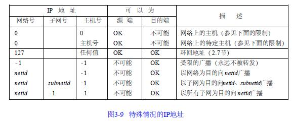

## 第4章ARP：地址解析协议
在ARP背后有一个基本概念，那就是网络接口有一个硬件地址（一个48 bit的值，标识不同的以太网或令牌环网络接口）。在硬件层次上进行的数据帧交换必须有正确的接口地址。但是，TCP/IP有自己的地址：32 bit的IP地址。知道主机的IP地址并不能让内核发送一帧数据给主机。内核（如以太网驱动程序）必须知道目的端的硬件地址才能发送数据。ARP的功能是在32 bit的IP地址和采用不同网络技术的硬件地址之间提供动态映射。

### 4.1 ARP高速缓存
ARP高效运行的关键是由于每个主机上都有一个ARP高速缓存。这个高速缓存存放了最近Internet地址到硬件地址之间的映射记录。高速缓存中每一项的生存时间一般为20分钟，起始时间从被创建时开始算起。我们可以用arp(8)命令来检查ARP高速缓存。参数-a的意思是显示高速缓存中所有的内容。

```
bsdi % arp -a
sun (140.252.13.33) at 8:0:20:3:f6:42
svr4 (140.252.13.34) at 0:0:c0:c2:9b:26
```

### 4.2 ARP的分组格式
在以太网上解析IP地址时，ARP请求和应答分组的格式如图4-3所示:


- 以太网报头中的前两个字段是以太网的源地址和目的地址。目的地址为全1的特殊地址是广播地址。
- 两个字节长的以太网帧类型表示后面数据的类型。对于ARP请求或应答来说，该字段的值为0x0806。
- 硬件类型字段表示硬件地址的类型。它的值为1即表示以太网地址。协议类型字段表示要映射的协议地址类型。它的值为0x0800即表示IP地址。
- 接下来的两个1字节的字段，硬件地址长度和协议地址长度分别指出硬件地址和协议地址的长度，以字节为单位。
- 操作字段指出四种操作类型，它们是ARP请求(值为1)、A R P应答(值为2)、RARP请求(值为3)和RARP应答(值为4)。
- 接下来的四个字段是发送端的硬件地址(在本例中是以太网地址)、发送端的协议地址(IP地址)、目的端的硬件地址和目的端的协议地址。注意，这里有一些重复信息：在以太网的数据帧报头中和ARP请求数据帧中都有发送端的硬件地址。

### 4.3 ARP代理
如果ARP请求是从一个网络的主机发往另一个网络上的主机，那么连接这两个网络的路由器就可以回答该请求，这个过程称作委托ARP或ARP代理(Proxy ARP)。这样可以欺骗发起ARP请求的发送端，使它误以为路由器就是目的主机，而事实上目的主机是在路由器的“另一边”。路由器的功能相当于目的主机的代理，把分组从其他主机转发给它。

### 4.4 免费ARP
我们可以看到的另一个ARP特性称作免费ARP(gratuitous ARP)。它是指主机发送ARP查找自己的IP地址。通常，它发生在系统引导期间进行接口配置的时候。

免费ARP可以有两个方面的作用：

1. 一个主机可以通过它来确定另一个主机是否设置了相同的IP地址。
2. 如果发送免费ARP的主机正好改变了硬件地址（很可能是主机关机了，并换了一块接口卡，然后重新启动），那么这个分组就可以使其他主机高速缓存中旧的硬件地址进行相应的更新。

## 第5章RARP：逆地址解析协议
具有本地磁盘的系统引导时，一般是从磁盘上的配置文件中读取IP地址。但是无盘机，则需要采用其他方法来获得IP地址。网络上的每个系统都具有唯一的硬件地址，它是由网络接口生产厂家配置的。无盘系统的RARP实现过程是从接口卡上读取唯一的硬件地址，然后发送一份RARP请求(一帧在网络上广播的数据)，请求某个主机响应该无盘系统的IP地址(在RARP应答中)。

RARP分组的格式与ARP分组基本一致(见图4-3)。它们之间主要的差别是RARP请求或应答的帧类型代码为0x8035，而且RARP请求的操作代码为3，应答操作代码为4。

## 第6章ICMP：Internet控制报文协议
ICMP经常被认为是IP层的一个组成部分。它传递差错报文以及其他需要注意的信息。ICMP报文是在IP数据报内部被传输的，如图6-1所示。

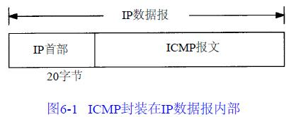

ICMP报文的格式如图6-2所示。所有报文的前4个字节都是一样的，但是剩下的其他字节则互不相同。类型字段可以有15个不同的值，以描述特定类型的ICMP报文。某些ICMP报文还使用代码字段的值来进一步描述不同的条件。检验和字段覆盖整个ICMP报文。


各种类型的ICMP报文如图6-3所示，不同类型由报文中的类型字段和代码字段来共同决定。


图中的最后两列表明ICMP报文是一份查询报文还是一份差错报文。因为对ICMP差错报文有时需要作特殊处理，因此我们需要对它们进行区分。例如，在对ICMP差错报文进行响应时，永远不会生成另一份ICMP差错报文(如果没有这个限制规则，可能会遇到一个差错产生另一个差错的情况，而差错再产生差错，这样会无休止地循环下去)。

当发送一份ICMP差错报文时，报文始终包含IP的首部和产生ICMP差错报文的IP数据报的前8个字节。这样，接收ICMP差错报文的模块就会把它与某个特定的协议(根据IP数据报首部中的协议字段来判断)和用户进程(根据包含在IP数据报前8个字节中的TCP或UDP报文首部中的TCP或UDP端口号来判断)联系起来。

下面各种情况都不会导致产生ICMP差错报文：

1. ICMP差错报文(但是，ICMP查询报文可能会产生ICMP差错报文)。
2. 目的地址是广播地址或多播地址的IP数据报。
3. 作为链路层广播的数据报。
4. 不是IP分片的第一片。
5. 源地址不是单个主机的数据报。这就是说，源地址不能为零地址、环回地址、广播地址或多播地址。

这些规则是为了防止过去允许ICMP差错报文对广播分组响应所带来的广播风暴。

## 第7章Ping程序
Ping程序目的是为了测试另一台主机是否可达。该程序发送一份ICMP回显请求报文给主机，并等待返回ICMP回显应答。ICMP回显请求和回显应答报文如图7-1所示。

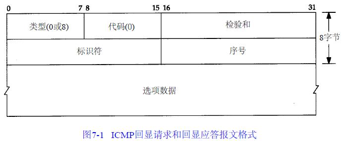

Unix系统在实现ping程序时是把ICMP报文中的标识符字段置成发送进程的ID号。这样即使在同一台主机上同时运行了多个ping程序实例， ping程序也可以识别出返回的信息。序列号从0开始，每发送一次新的回显请求就加1。ping程序打印出返回的每个分组的序列号，允许我们查看是否有分组丢失、失序或重复。

ping程序通过在ICMP报文数据中存放发送请求的时间值来计算往返时间。当应答返回时，用当前时间减去存放在ICMP报文中的时间值，即是往返时间。

## 第8章Traceroute程序
Traceroute程序使用ICMP报文和IP首部中的TTL字段。TTL字段是由发送端初始设置一个8 bit字段。推荐的初始值由分配数字RFC指定，当前值为64。每个处理数据报的路由器都需要把TTL的值减1或减去数据报在路由器中停留的秒数。由于大多数的路由器转发数据报的时延都小于1秒钟，因此TTL最终成为一个跳站的计数器，所经过的每个路由器都将其值减1。

Traceroute程序的操作过程。它发送一份TTL字段为1的IP数据报给目的主机。处理这份数据报的第一个路由器将TTL值减1，丢弃该数据报，并发回一份超时ICMP报文。这样就得到了该路径中的第一个路由器的地址。然后Traceroute程序发送一份TTL值为2的数据报，这样我们就可以得到第二个路由器的地址。继续这个过程直至该数据报到达目的主机。但是目的主机哪怕接收到TTL值为1的IP数据报，也不会丢弃该数据报并产生一份超时ICMP报文，这是因为数据报已经到达其最终目的地。那么我们该如何判断是否已经到达目的主机了呢？

Traceroute程序发送一份UDP数据报给目的主机，但它选择一个不可能的值作为UDP端口号(大于30 000)，使目的主机的任何一个应用程序都不可能使用该端口。因为，当该数据报到达时，将使目的主机的UDP模块产生一份“端口不可达”错误的ICMP报文。这样，Traceroute程序所要做的就是区分接收到的ICMP报文是超时还是端口不可达，以判断什么时候结束。

## 第9章IP选路
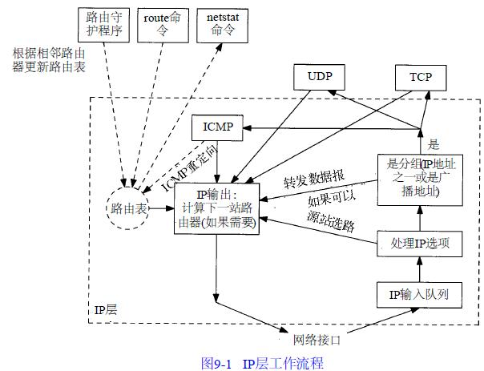

### 9.1 选路的原理
IP搜索路由表的几个步骤：

1. 搜索匹配的主机地址；
2. 搜索匹配的网络地址；
3. 搜索默认表项（默认表项一般在路由表中被指定为一个网络表项，其网络号为0）。

#### 9.1.1 简单路由表
带-r选项的netstat命令列出路由表,-n选项以数字格式打印出IP地址:


第1行说明，如果目的地是140.252.13.65，那么网关(路由器)将把分组转发给140.252.13.35。对于一个给定的路由器，可以打印出五种不同的标志(flag)：
* U 该路由可以使用。
* G 该路由是到一个网关(路由器)。如果没有设置该标志，说明目的地是直接相连的。
* H 该路由是到一个主机，也就是说，目的地址是一个完整的主机地址。如果没有设置该标志，说明该路由是到一个网络，而目的地址是一个网络地址：一个网络号，或者网络号与子网号的组合。
* D 该路由是由重定向报文创建的。
* M 该路由已被重定向报文修改。

标志G是非常重要的，因为由它区分了间接路由和直接路由(对于直接路由来说是不设置标志G的)。其区别在于，发往直接路由的分组中不但具有指明目的端的IP地址，还具有其链路层地址。当分组被发往一个间接路由时，IP地址指明的是最终的目的地，但是链路层地址指明的是网关(即下一站路由器)。

理解G和H标志之间的区别是很重要的。G标志区分了直接路由和间接路由，如上所述。但是H标志表明，目的地址(netstat命令输出第一行)是一个完整的主机地址。没有设置H标志说明目的地址是一个网络地址(主机号部分为0)。当为某个目的IP地址搜索路由表时，主机地址项必须与目的地址完全匹配，而网络地址项只需要匹配目的地址的网络号和子网号就可以了。

参考记数Refcnt(Reference count)列给出的是正在使用路由的活动进程个数。下一列("use")显示的是通过该路由发送的分组数。最后一列(interface)是本地接口的名字。

#### 9.1.2 初始化路由表
一个常用的方法是在系统引导时显式地在初始化文件中运行route命令。在主机svr4上，我们运行下面两个命令来添加路由表中的表项：

```
route add default sun 1
route add slip bsdi 1
```

第3个参数(default和slip)代表目的端，第4个参数代表网关(路由器)，最后一个参数代表路由的度量(metric)。route命令在度量值大于0时要为该路由设置G标志，否则，当耗费值为0时就不设置G标志。

### 9.2 ICMP主机与网络不可达差错
当路由器收到一份IP数据报但又不能转发时，就要发送一份ICMP“主机不可达”差错报文(ICMP主机不可达报文的格式如图6-10所示)。

### 9.3 ICMP重定向差错
当IP数据报应该被发送到另一个路由器时，收到数据报的路由器就要发送ICMP重定向差错报文给IP数据报的发送端。只有当主机可以选择路由器发送分组的情况下，我们才可能看到ICMP重定向报文。
1. 我们假定主机发送一份IP数据报给R1。这种选路决策经常发生，因为R1是该主机的默认路由。
2. R1收到数据报并且检查它的路由表，发现R2是发送该数据报的下一站。当它把数据报发送给R2时，R1检测到它正在发送的接口与数据报到达接口是相同的(即主机和两个路由器所在的LA N)。这样就给路由器发送重定向报文给原始发送端提供了线索。
3. R1发送一份ICMP重定向报文给主机，告诉它以后把数据报发送给R2而不是R1。


#### 9.3.1 ICMP重定向报文
ICMP重定向报文的格式如图9-4所示。

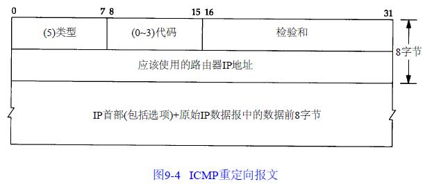

有四种不同类型的重定向报文，有不同的代码值，如图9-5所示。


ICMP重定向报文的接收者必须查看三个IP地址：(1)导致重定向的IP地址(即ICMP重定向报文的数据位于IP数据报的首部)；(2)发送重定向报文的路由器的IP地址(包含重定向信息的IP数据报中的源地址)；(3)应该采用的路由器IP地址(在ICMP报文中的4~7字节)。

关于ICMP重定向报文有很多规则。首先，重定向报文只能由路由器生成，而不能由主机生成。另外，重定向报文是为主机而不是为路由器使用的。假定路由器和其他一些路由器共同参与某一种选路协议，则该协议就能消除重定向的需要。

### 9.4 ICMP路由器发现报文
在本章前面已提到过一种初始化路由表的方法，即在配置文件中指定静态路由。这种方法经常用来设置默认路由。另一种新的方法是利用ICMP路由器通告和请求报文。

一般认为，主机在引导以后要广播或多播传送一份路由器请求报文。一台或更多台路由器响应一份路由器通告报文。另外，路由器定期地广播或多播传送它们的路由器通告报文，允许每个正在监听的主机相应地更新它们的路由表。

ICMP路由器请求报文的格式如图9-6所示。ICMP路由器通告报文的格式如图9-7所示。


路由器在一份报文中可以通告多个地址。地址数指的是报文中所含的地址数。地址项大小指的是每个路由器地址32 bit字的数目，始终为2。生存期指的是通告地址有效的时间(秒数)。


接下来是一对或多对IP地址和优先级。IP地址必须是发送路由器的某个地址。优先级是一个有符号的32 bit整数，指出该IP地址作为默认路由器地址的优先等级，这是与子网上的其他路由器相比较而言的。值越大说明优先级越高。优先级为0x80000000说明对应的地址不能作为默认路由器地址使用，尽管它也包含中通告报文中。优先级的默认值一般为0。

#### 9.4.1 路由器操作
当路由器启动时，它定期在所有广播或多播传送接口上发送通告报文。准确地说，这些通告报文不是定期发送的，而是随机传送的，以减小与子网上其他路由器发生冲突的概率。一般每两次通告间隔450秒和600秒。一份给定的通告报文默认生命周期是30分钟。

使用生命周期域的另一个时机是当路由器上的某个接口被关闭时。在这种情况下，路由器可以在该接口上发送最后一份通告报文，并把生命周期值设为0。

除了定期发送主动提供的通告报文以外，路由器还要监听来自主机的请求报文，并发送路由器通告报文以响应这些请求报文。

#### 9.4.2 主机操作
主机在引导期间一般发送三份路由器请求报文，每三秒钟发送一次。一旦接收到一个有效的通告报文，就停止发送请求报文。

主机也监听来自相邻路由器的请求报文。这些通告报文可以改变主机的默认路由器。另外，如果没有接收到来自当前默认路由器的通告报文，那么默认路由器会超时。

## 第10章 动态选路协议
### 10.1 动态选路
当相邻路由器之间进行通信，以告知对方每个路由器当前所连接的网络，这时就出现了动态选路。路由器之间必须采用选路协议进行通信，这样的选路协议有很多种。路由器上有一个进程称为路由守护程序(routing daemon)，它运行选路协议，并与其相邻的一些路由器进行通信。正如图9-1所示，路由守护程序根据它从相邻路由器接收到的信息，更新内核中的路由表。

动态选路并不改变我们在9.2节中所描述的内核在IP层的选路方式。这种选路方式称为选路机制(routing mechanism)。内核搜索路由表，查找主机路由、网络路由以及默认路由的方式并没有改变。仅仅是放置到路由表中的信息改变了—当路由随时间变化时，路由是由路由守护程序动态地增加或删除，而不是来自于自引导程序文件中的route命令。

路由守护程序将选路策略(routing policy)加入到系统中，选择路由并加入到内核的路由表中。如果守护程序发现前往同一信宿存在多条路由，那么它(以某种方法)将选择最佳路由并加入内核路由表中。如果路由守护程序发现一条链路已经断开(可能是路由器崩溃或电话线路不好)，它可以删除受影响的路由或增加另一条路由以绕过该问题。

Internet是以一组自治系统(AS，Autonomous System)的方式组织的，每个自治系统通常由单个实体管理。常常将一个公司或大学校园定义为一个自治系统。

每个自治系统可以选择该自治系统中各个路由器之间的选路协议。这种协议我们称之为内部网关协议IGP(Interior Gateway Protocol)或域内选路协议(intradomain routing protocol)。最常用的IGP是选路信息协议RIP。一种新的IGP是开放最短路径优先OSPF(Open Shortest Path First)协议。它意在取代RIP。另一种1986年在原来NSFNET骨干网上使用的较早的IGP协议—HELLO，现在已经不用了。

外部网关协议EGP(Exterier Gateway Protocol)或域内选路协议的分隔选路协议用于不同自治系统之间的路由器。在历史上，(令人容易混淆)改进的EGP有着一个与它名称相同的协议：EGP。新EGP是当前在NSFNET骨干网和一些连接到骨干网的区域性网络上使用的是边界网关协议BGP(Border Gateway Protocol)。BGP意在取代EGP。

### 10.2 Unix选路守护程序
Unix系统上常常运行名为routed路由守护程序。几乎在所有的TCP/IP实现中都提供该程序。该程序只使用RIP进行通信。这是一种用于小型到中型网络中的协议。另一个程序是gated。IGP和EGP都支持它。


### 10.3 RIP：选路信息协议
#### 10.3.1 报文格式
RIP报文包含中在UDP数据报中，如图10-2所示。

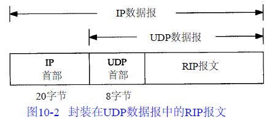

图10-3给出了使用IP地址时的RIP报文格式。

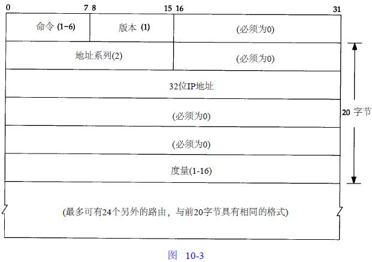

命令字段为1表示请求，2表示应答。还有两个舍弃不用的命令(3和4)，两个非正式的命令：轮询(5)和轮询表项(6)。请求表示要求其他系统发送其全部或部分路由表。应答则包含发送者全部或部分路由表。

版本字段通常为1，而第2版RIP将此字段设置为2。

紧跟在后面的20字节指定地址系列(address family)(对于IP地址来说，其值是2)、IP地址以及相应的度量。在本节的后面可以看出， RIP的度量是以跳计数的。

采用这种20字节格式的RIP报文可以通告多达25条路由。上限25是用来保证RIP报文的总长度为20×25+4=504，小于512字节。由于每个报文最多携带25个路由，因此为了发送整个路由表，经常需要多个报文。

#### 10.3.2 正常运行
采用RIP协议的routed程序正常运行的结果。
* 初始化：在启动一个路由守护程序时，它先判断启动了哪些接口，并在每个接口上发送一个请求报文，要求其他路由器发送完整路由表。在点对点链路中，该请求是发送给其他终点的。如果网络支持广播的话，这种请求是以广播形式发送的。目的UDP端口号是520(这是其他路由器的路由守护程序端口号)。这种请求报文的命令字段为1，但地址系列字段设置为0，而度量字段设置为16。这是一种要求另一端完整路由表的特殊请求报文。
* 接收到请求。如果这个请求是刚才提到的特殊请求，那么路由器就将完整的路由表发送给请求者。否则，就处理请求中的每一个表项：如果有连接到指明地址的路由，则将度量设置成我们的值，否则将度量置为16(度量为16是一种称为“无穷大”的特殊值，它意味着没有到达目的的路由)。然后发回响应。
* 接收到响应。使响应生效，可能会更新路由表。可能会增加新表项，对已有的表项进行修改，或是将已有表项删除。
* 定期选路更新。每过30秒，所有或部分路由器会将其完整路由表发送给相邻路由器。
* 触发更新。每当一条路由的度量发生变化时，就对它进行更新。不需要发送完整路由表，而只需要发送那些发生变化的表项。

每条路由都有与之相关的定时器。如果运行RIP的系统发现一条路由在3分钟内未更新，就将该路由的度量设置成无穷大(16)，并标注为删除。这意味着已经在6个30秒更新时间里没收到通告该路由的路由器的更新了。再过60秒，将从本地路由表中删除该路由，以保证该路由的失效已被传播开。

#### 10.3.3 度量
RIP所使用的度量是以跳(hop)计算的。所有直接连接接口的跳数为1。考虑图10-4所示的路由器和网络。画出的4条虚线是广播RIP报文。


如果相邻路由器通告它与其他网络路由的跳数为1，那么我们与那个网络的度量就是2，这是因为为了发送报文到该网络，我们必须经过那个路由器。在我们的例子中， R2到N1的度量是2，与R1到N3的度量一样。

跳数的最大值是15，这意味着RIP只能用在主机间最大跳数值为15的AS内。度量为16表示到无路由到达该IP地址。

#### 10.3.4 问题
首先， RIP没有子网地址的概念。例如，如果标准的B类地址中16 bit的主机号不为0，那么RIP无法区分非零部分是一个子网号，或者是一个主机地址。其次，在路由器或链路发生故障后，需要很长的一段时间才能稳定下来。这段时间通常需要几分钟。在这段建立时间里，可能会发生路由环路。同时，度量最大值为15则限制了可以使用RIP的网络的大小。

### 10.4 RIP版本2
RFC 1388中对RIP定义进行了扩充，通常称其结果为RIP-2。这些扩充并不改变协议本身，而是利用图10-3中的一些标注为“必须为0”的字段来传递一些额外的信息。如果RIP忽略这些必须为0的字段，那么，RIP和RIP-2可以互操作。图10-10重新给出了由RIP-2定义的图。对于RIP-2来说，其版本字段为2。

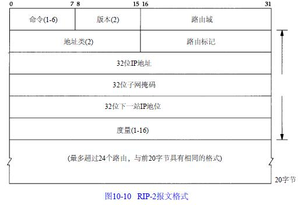

选路域(routing domain)是一个选路守护程序的标识符，它指出了这个数据报的所有者。在一个Unix实现中，它可以是选路守护程序的进程号。该域允许管理者在单个路由器上运行多个RIP实例，每个实例在一个选路域内运行。

选路标记(routing tag)是为了支持外部网关协议而存在的。它携带着一个EGP和BGP的自治系统号。

每个表项的子网掩码应用于相应的IP地址上。下一站IP地址指明发往目的IP地址的报文该发往哪里。该字段为0意味着发往目的地址的报文应该发给发送R I P报文的系统。

RIP-2提供了一种简单的鉴别机制。可以指定RIP报文的前20字节表项地址系列为0xffff，路由标记为2。表项中的其余16字节包含一个明文口令。

最后，RIP-2除了广播外，还支持多播。这可以减少不收听RIP-2报文的主机的负载。

### 10.5 OSPF：开放最短路径优先
在一个链路状态协议中，路由器并不与其邻站交换距离信息。它采用的是每个路由器主动地测试与其邻站相连链路的状态，将这些信息发送给它的其他邻站，而邻站将这些信息在自治系统中传播出去。每个路由器接收这些链路状态信息，并建立起完整的路由表。

从实际角度来看，二者的不同点是链路状态协议总是比距离向量协议收敛更快。收敛的意思是在路由发生变化后，例如在路由器关闭或链路出故障后，可以稳定下来。

OSPF与RIP(以及其他选路协议)的不同点在于，OSPF直接使用IP。也就是说，它并不使用UDP或TCP。对于IP首部的protcol字段，OSPF有其自己的值(图3-1)。

作为一种链路状态协议而不是距离向量协议，OSPF还有着一些优于RIP的特点。

1. OSPF可以对每个IP服务类型(图3-2)计算各自的路由集。这意味着对于任何目的，可以有多个路由表表项，每个表项对应着一个IP服务类型。
2. 给每个接口指派一个无维数的费用。可以通过吞吐率、往返时间、可靠性或其他性能来进行指派。可以给每个IP服务类型指派一个单独的费用。
3. 当对同一个目的地址存在着多个相同费用的路由时，OSPF在这些路由上平均分配流量。我们称之为流量平衡。
4. OSPF支持子网：子网掩码与每个通告路由相连。这样就允许将一个任何类型的IP地址分割成多个不同大小的子网(称之为变长度子网)。到一个主机的路由是通过全1子网掩码进行通告的。默认路由是以IP地址为0.0.0.0、网络掩码为全0进行通告的。
5. 路由器之间的点对点链路不需要每端都有一个IP地址，我们称之为无编号网络。这样可以节省I P地址—现在非常紧缺的一种资源。
6. 采用了一种简单鉴别机制。可以采用类似于RIP-2机制的方法指定一个明文口令。
7. OSPF采用多播，而不是广播形式，以减少不参与OSPF的系统负载。

### 10.6 BGP：边界网关协议
BGP是一种不同自治系统的路由器之间进行通信的外部网关协议。首先，我们将一个自治系统中的IP数据报分成本地流量和通过流量。在自治系统中，本地流量是起始或终止于该自治系统的流量。其他的流量则称为通过流量。在Internet中使用BGP的一个目的就是减少通过流量。可以将自治系统分为以下几种类型：

1. 残桩自治系统(stub AS)，它与其他自治系统只有单个连接。
2. 多接口自治系统(multihomed AS)，它与其他自治系统有多个连接，但拒绝传送通过流量。
3. 转送自治系统(transit AS)，它与其他自治系统有多个连接，在一些策略准则之下，它可以传送本地流量和通过流量。

可以将Internet的总拓扑结构看成是由一些残桩自治系统、多接口自治系统以及转送自治系统的任意互连。残桩自治系统和多接口自治系统不需要使用BGP。它们通过运行EGP在自治系统之间交换可到达信息。

BGP使用TCP作为其传输层协议。两个运行BGP的系统之间建立一条TCP连接，然后交换整个BGP路由表。BGP是一个距离向量协议，BGP通过定期发送keepalive报文给其邻站来检测TCP连接对端的链路或主机失败。两个报文之间的时间间隔建议值为30秒。

### 10.7 CIDR：无类型域间选路
无类型域间选路(CIDR)是一个防止Internet路由表膨胀的方法，它也称为超网(supernetting)。CIDR的基本观点是采用一种分配多个IP地址的方式，使其能够将路由表中的许多表项总和(summarization)成更少的数目。例如，如果给单个站点分配16个C类地址，以一种可以用总和的方式来分配这16个地址，这样，所有这16个地址可以参照Internet的单个路由表表项。同时，如果有8个不同的站点是通过同一个Internet服务提供商的同一个连接点接入Internet的，且这8个站点分配的8个不同IP地址可以进行总和，那么，对于这8个站点，在Internet上，只需
要单个路由表表项。

## 第11章 UDP：用户数据报协议
### 11.1 UDP封装与UDP首部
UDP数据报封装成一份IP数据报的格式如图11 - 1所示。

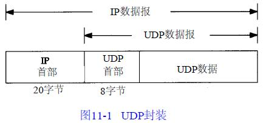

UDP首部的各字段如图11 - 2所示。

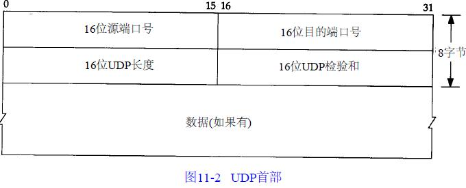

UDP长度字段指的是UDP首部和UDP数据的字节长度。该字段的最小值为8字节（发送一份0字节的UDP数据报是OK）。IP数据报长度指的是数据报全长，因此UDP数据报长度是全长减去I P首部的长度。

### 11.2 UDP检验和
UDP检验和覆盖UDP首部和UDP数据。回想IP首部的检验和，它只覆盖IP的首部—并不覆盖IP数据报中的任何数据。UDP和TCP在首部中都有覆盖它们首部和数据的检验和。UDP的检验和是可选的，而TCP的检验和是必需的。

UDP数据报的长度可以为奇数字节，但是检验和算法是把若干个16 bit字相加。解决方法是必要时在最后增加填充字节0，这只是为了检验和的计算。UDP数据报和T C P段都包含一个12字节长的伪首部，它是为了计算检验和而设置的。伪首部包含IP首部一些字段。其目的是让UDP两次检查数据是否已经正确到达目的地。UDP数据报中的伪首部格式如图11 - 3所示。


如果发送端没有计算检验和而接收端检测到检验和有差错，那么UDP数据报就要被悄悄地丢弃。不产生任何差错报文（当IP层检测到IP首部检验和有差错时也这样做）。

### 11.3 IP分片
物理网络层一般要限制每次发送数据帧的最大长度。任何时候IP层接收到一份要发送的IP数据报时，它要判断向本地哪个接口发送数据（选路），并查询该接口获得其MTU。IP把MTU与数据报长度进行比较，如果需要则进行分片。分片可以发生在原始发送端主机上，也可以发生在中间路由器上。

把一份IP数据报分片以后，只有到达目的地才进行重新组装。重新组装由目的端的IP层来完成，其目的是使分片和重新组装过程对运输层（TCP和UDP）是透明的。已经分片过的数据报有可能会再次进行分片（可能不止一次）。

回忆IP首部（图3-1），下面这些字段用于分片过程。对于发送端发送的每份IP数据报来说，其标识字段都包含一个唯一值。该值在数据报分片时被复制到每个片中。标志字段用其中一个比特来表示“更多的片”。除了最后一片外，其他每个组成数据报的片都要把该比特置1。片偏移字段指的是该片偏移原始数据报开始处的位置。另外，当数据报被分片后，每个片的总长度值要改为该片的长度值。

最后，标志字段中有一个比特称作“不分片”位。如果将这一比特置1，IP将不对数据报进行分片。相反把数据报丢弃并发送一个ICMP差错报文给起始端。

当IP数据报被分片后，每一片都成为一个分组，具有自己的IP首部，并在选择路由时与其他分组独立。这样，当数据报的这些片到达目的端时有可能会失序，但是在IP首部中有足够的信息让接收端能正确组装这些数据报片。

尽管IP分片过程看起来是透明的，但有一点让人不想使用它：即使只丢失一片数据也要重传整个数据报。为什么会发生这种情况呢？因为IP层本身没有超时重传的机制—由更高层来负责超时和重传（TCP有超时和重传机制，但UDP没有。一些UDP应用程序本身也执行超时和重传）。当来自TCP报文段的某一片丢失后，TCP在超时后会重发整个TCP报文段，该报文段对应于一份IP数据报。没有办法只重传数据报中的一个数据报片。事实上，如果对数据报分片的是中间路由器，而不是起始端系统，那么起始端系统就无法知道数据报是如何被分片的。就这个原因，经常要避免分片。

分片情况如图11 - 8所示。需要重申的是，任何运输层首部只出现在第1片数据中。另外需要解释几个术语： IP数据报是指IP层端到端的传输单元（在分片之前和重新组装之后），分组是指在IP层和链路层之间传送的数据单元。一个分组可以是一个完整的IP数据报，也可以是IP数据报的一个分片。


### 11.4 ICMP不可达差错（需要分片）
发生ICMP不可达差错的另一种情况是，当路由器收到一份需要分片的数据报，而在IP首部又设置了不分片（DF）的标志比特。如果某个程序需要判断到达目的端的路途中最小MTU是多少—称作路径MTU发现机制，那么这个差错就可以被该程序使用。这种情况下的ICMP不可达差错报文格式如图11 - 9所示。这里的格式与图6 - 1 0不同，因为在第2个32 bit字中，16~31 bit可以提供下一站的MTU，而不再是0。


### 11.5 UDP和ARP之间的交互作用
使用UDP，可以看到UDP与ARP典型实现之间的有趣的交互作用。

我们用sock程序来产生一个包含8192字节数据的UDP数据报。预测这将会在以太网上产生6个数据报片。同时也确保在运行该程序前， ARP缓存是清空的，这样，在发送第一个数据报片前必须交换ARP请求和应答。

预计在发送第一个数据报片前会先发送一个ARP请求。IP还会产生5个数据报片，这样就提出了我们必须用tcpdump来回答的两个问题：在接收到ARP回答前，其余数据报片是否已经做好了发送准备？如果是这样，那么在ARP等待应答时，它会如何处理发往给定目的的多个报文？图11 - 17给出了tcpdump的输出结果。

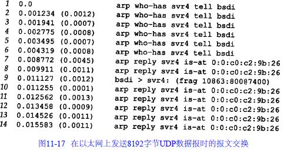

在这个输出结果中有一些令人吃惊的结果。首先，在第一个ARP应答返回以前，总共产生了6个ARP请求。我们认为其原因是IP很快地产生了6个数据报片，而每个数据报片都引发了一个ARP请求。

第二，在接收到第一个ARP应答时（第7行），只发送最后一个数据报片（第9行）！看来似乎将前5个数据报片全都丢弃了。实际上，这是ARP的正常操作。在大多数的实现中，在等待一个ARP应答时，只将最后一个报文发送给特定目的主机。

另一个无法解释的不正常的现象是，svr4发回7个，而不是6个ARP应答。

最后要指出的是，在最后一个ARP应答返回后，继续运行tcpdump程序5分钟，以看看svr4是否会返回ICMP“组装超时”差错。并没有发送ICMP差错消息的格式。

在第一个数据报片出现时，IP层必须启动一个定时器。这里“第一个”表示给定数据报的第一个到达数据报片，而不是第一个数据报片（数据报片偏移为0）。正常的定时器值为30或60秒。如果定时器超时而该数据报的所有数据报片未能全部到达，那么将这些数据报片丢弃。如果不这么做，那些永远不会到达的数据报片（正如我们在本例中所看到的那样）迟早会引起接收端缓存满。

这里我们没看到ICMP消息的原因有两个。首先，大多数从Berkeley派生的实现从不产生该差错！这些实现会设置定时器，也会在定时器溢出时将数据报片丢弃，但是不生成ICMP差错。第二，并未接收到包含UDP首部的偏移量为0的第一个数据报片（这是被ARP所丢弃的5个报文的第1个）。除非接收到第一个数据报片，否则并不要求任何实现产生ICMP差错。其原因是因为没有运输层首部，ICMP差错的接收者无法区分出是哪个进程所发送的数据报被丢弃。这里假设上层（TCP或使用UDP的应用程序）最终会超时并重传。

### 11.6 UDP服务器的设计
#### 11.6.1 客户IP地址及端口号
来自客户的是UDP数据报。IP首部包含源端和目的端IP地址，UDP首部包含了源端和目的端的UDP端口号。当一个应用程序接收到UDP数据报时，操作系统必须告诉它是谁发送了这份消息，即源IP地址和端口号。

#### 11.6.2 目的IP地址
一些应用程序需要知道数据报是发送给谁的，即目的IP地址。这要求操作系统从接收到的UDP数据报中将目的IP地址交给应用程序。

#### 11.6.3 UDP输入队列
通常程序所使用的每个UDP端口都与一个有限大小的输入队列相联系。这意味着，来自不同客户的差不多同时到达的请求将由UDP自动排队。排队溢出造成内核中的UDP模块丢弃数据报的可能性是存在的。

首先，应用程序并不知道其输入队列何时溢出。只是由UDP对超出数据报进行丢弃处理。同时，没有发回任何信息告诉客户其数据报被丢弃。

#### 11.6.4 限制本地IP地址
大多数UDP服务器在创建UDP端点时都使其本地IP地址具有通配符的特点。这就表明进入的UDP数据报如果其目的地为服务器端口，那么在任何本地接口均可接收到它。我们以端口号7777启动一个UDP服务器：

```
sun % sock -u -s 7777
```

然后，用netstat命令观察端点的状态：

```
sun % netstat -a -n -f inet
```


-a选项表示报告所有网络端点的状态。-n选项表示以点数格式打印IP地址而不用DNS把地址转换成名字，打印数字端口号而不是服务名称。-f inet选项表示只报告TCP和UDP端点。本地地址以*.7777格式打印，星号表示任何本地IP地址。如果在端口号之前指定一个IP地址，那么该IP地址就成为该端点的本地IP地址。例如：

```
sun % sock -u -s 140.252.1.29 7777
```

就限制服务器在SLIP接口(140.252.1.29)处接收数据报。netstat输出结果显示如下：


如果我们试图在以太网上的主机bsdi以地址140.252.13.35向该服务器发送一份数据报，那么将返回一个ICMP端口不可达差错。服务器永远看不到这份数据报。这种情形如图11-21所示。


有可能在相同的端口上启动不同的服务器，每个服务器具有不同的本地IP地址。在主机sun上，可以在同一个端口号（8888）上启动5个不同的服务器：


5个服务器的netstat输出结果如下所示：


如果存在一个含星号的IP地址，那么就隐含了一种优先级关系。如果为端点指定了特定IP地址，那么在匹配目的地址时始终优先匹配该IP地址。只有在匹配不成功时才使用含星号的端点。

#### 11.6.5 限制远端IP地址
大多数系统允许UDP端点对远端地址进行限制。这说明端点将只能接收特定IP地址和端口号的UDP数据报。

```
sun % sock -u -s -f 140.252.13.35.4444 5555
```

这样就设置了远端IP地址140.252.13.35（即主机bsdi）和远端端口号4444 。服务器的有名端口号为5555。如果运行netstat命令，我们发现本地IP地址也被设置了，尽管我们没有指定。


图11-22总结了UDP服务器本身可以创建的三类地址绑定。


## 第12章 广播和多播
### 12.1 广播
#### 12.1.1 受限的广播
受限的广播地址是255.255.255.255。该地址用于主机配置过程中IP数据报的目的地址，此时，主机可能还不知道它所在网络的网络掩码，甚至连它的I P地址也不知道。在任何情况下，路由器都不转发目的地址为受限的广播地址的数据报，这样的数据报仅出现在本地网络中。

一个未解的问题是：如果一个主机是多接口的，当一个进程向本网广播地址发送数据报时，为实现广播，是否应该将数据报发送到每个相连的接口上？大多数BSD系统将255.255.255.255看作是配置后第一个接口的广播地址，并且不提供向所属具备广播能力的接口传送数据报的功能。不过，routed和rwhod（BSD rwho客户的服务器）是向每个接口发送UDP数据报的两个应用程序。这两个应用程序均用相似的启动过程来确定主机中的所有接口，并了解哪些接口具备广播能力。同时，将对应于那种接口的指向网络的广播地址作为发往该接口的数据报的目的地址。

#### 12.1.2 指向网络的广播
指向网络的广播地址是主机号为全1的地址。A类网络广播地址为netid.255.255.255，其中netid为A类网络的网络号。

#### 12.1.3 指向子网的广播
指向子网的广播地址为主机号为全1且有特定子网号的地址。作为子网直接广播地址的IP地址需要了解子网的掩码。例如，如果路由器收到发往128.1.2.255的数据报，当B类网络128.1的子网掩码为255.255.255.0时，该地址就是指向子网的广播地址。

#### 12.1.4 指向所有子网的广播
指向所有子网的广播也需要了解目的网络的子网掩码，以便与指向网络的广播地址区分开。指向所有子网的广播地址的子网号及主机号为全1。例如，如果目的子网掩码为255.255.255.0，那么IP地址128.1.255.255是一个指向所有子网的广播地址。然而，如果网络没有划分子网，这就是一个指向网络的广播。

### 12.2 组播
图12-2显示了D类IP地址的格式。


不像图1-5所示的其他三类IP地址（A、B和C），分配的28 bit均用作多播组号而不再表示其他。多播组地址包括为1110的最高4 bit和多播组号。它们通常可表示为点分十进制数，范围从224.0 .0.0到239.255.255.255。能够接收发往一个特定多播组地址数据的主机集合称为主机组(host group)。一个主机组可跨越多个网络。主机组中成员可随时加入或离开主机组。主机组中对主机的数量没有限制，同时不属于某一主机组的主机可以向该组发送信息。

## 第13章 IGMP：Internet组管理协议
### 13.1 IGMP报文
用于支持主机和路由器进行多播的Internet组管理协议（IGMP）,它让一个物理网络上的所有系统知道主机当前所在的多播组。多播路由器需要这些信息以便知道多播数据报应该向哪些接口转发。

正如ICMP一样，IGMP也被当作IP层的一部分。IGMP报文通过IP数据报进行传输。不像我们已经见到的其他协议，IGMP有固定的报文长度，没有可选数据。图13 - 1显示了IGMP报文如何封装在IP数据报中。


图13 - 2显示了长度为8字节的IGMP报文格式。


IGMP类型为1说明是由多播路由器发出的查询报文，为2说明是主机发出的报告报文。检验和的计算和ICMP协议相同。组地址为D类IP地址。在查询报文中组地址设置为0，在报告报文中组地址为要参加的组地址。

### 13.2 IGMP协议
#### 13.2.1 加入一个多播组
多播的基础就是一个进程的概念，该进程在一个主机的给定接口上加入了一个多播组。在一个给定接口上的多播组中的成员是动态的，它随时因进程加入和离开多播组而变化。这里所指的进程必须以某种方式在给定的接口上加入某个多播组。进程也能离开先前加入的多播组。这些是一个支持多播主机中任何API所必需的部分。使用限定词“接口”是因为多播组中的成员是与接口相关联的。一个进程可以在多个接口上加入同一多播组。

这里暗示一个主机通过组地址和接口来识别一个多播组。主机必须保留一个表，此表中包含所有至少含有一个进程的多播组以及多播组中的进程数量。

#### 13.2.2 IGMP报告和查询
多播路由器使用IGMP报文来记录与该路由器相连网络中组成员的变化情况。使用规则如下：

1. 当第一个进程加入一个组时，主机就发送一个IGMP报告。如果一个主机的多个进程加入同一组，只发送一个IGMP报告。这个报告被发送到进程加入组所在的同一接口上。
2. 进程离开一个组时，主机不发送IGMP报告，即便是组中的最后一个进程离开。主机知道在确定的组中已不再有组成员后，在随后收到的IGMP查询中就不再发送报告报文。
3. 多播路由器定时发送IGMP查询来了解是否还有任何主机包含有属于多播组的进程。多播路由器必须向每个接口发送一个IGMP查询。因为路由器希望主机对它加入的每个多播组均发回一个报告，因此IGMP查询报文中的组地址被设置为0。
4. 主机通过发送IGMP报告来响应一个IGMP查询，对每个至少还包含一个进程的组均要发回IGMP报告。

使用这些查询和报告报文，多播路由器对每个接口保持一个表，表中记录接口上至少还包含一个主机的多播组。当路由器收到要转发的多播数据报时，它只将该数据报转发到（使用相应的多播链路层地址）还拥有属于那个组主机的接口上。
图13-3显示了两个IGMP报文，一个是主机发送的报告，另一个是路由器发送的查询。该路由器正在要求那个接口上的每个主机说明它加入的每个多播组。


#### 13.2.3 TTL
在图13-3中，我们注意到IGMP报告和查询的TTL均设置为1，这涉及到IP首部中的TTL字段。一个初始TTL为0的多播数据报将被限制在同一主机。在默认情况下，待传多播数据报的TTL被设置为1，这将使多播数据报仅局限在同一子网内传送。更大的TTL值能被多播路由器转发。

对发往一个多播地址的数据报从不会产生ICMP差错。当TTL值为0时，多播路由器也不产生ICMP“超时”差错。

从224.0.0.0到224.0.0.255的特殊地址空间是打算用于多播范围不超过1跳的应用。不管TTL值是多少，多播路由器均不转发目的地址为这些地址中的任何一个地址的数据报。

#### 13.2.4 所有主机组
在图13 - 3中，我们看到了路由器的IGMP查询被送到目的IP地址224.0.0.1。该地址被称为所有主机组地址。它涉及在一个物理网络中的所有具备多播能力的主机和路由器。当接口初始化后，所有具备多播能力接口上的主机均自动加入这个多播组。这个组的成员无需发送IGMP报告。

## 第14章 DNS：域名系统
### 14.1 DNS基础
每个结点(图14-1中的圆圈)有一个至多63个字符长的标识。这颗树的树根是没有任何标识的特殊结点。命名标识中一律不区分大写和小写。命名树上任何一个结点的域名就是将从该结点到最高层的域名串连起来，中间使用一个点“.”分隔这些域名。以点“.”结尾的域名称为绝对域名或完全合格的域名FQDN(Full Qualified Domain Name)，例如sun.tuc.noao.edu.。如果一个域名不以点结尾，则认为该域名是不完全的。

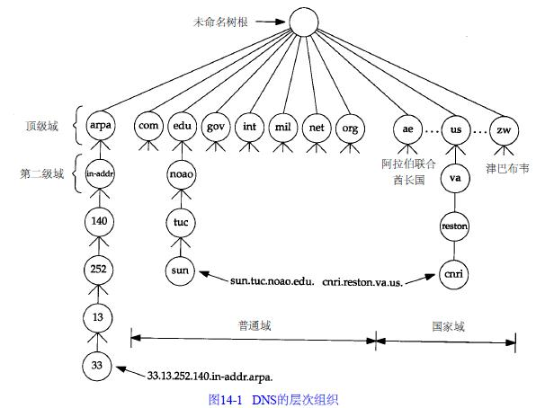

顶级域名被分为三个部分：

1. arpa是一个用作地址到名字转换的特殊域。
2. 7个3字符长的普通域。有些书也将这些域称为组织域。
3. 所有2字符长的域均是基于ISO3166中定义的国家代码，这些域被称为国家域，或地理域。

图14-2列出了7个普通域的正式划分。

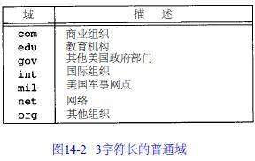

### 14.2 DNS的报文格式
DNS定义了一个用于查询和响应的报文格式。图14-3显示这个报文的总体格式。


这个报文由12字节长的首部和4个长度可变的字段组成。标识字段由客户程序设置并由服务器返回结果。客户程序通过它来确定响应与查询是否匹配。16 bit的标志字段被划分为若干子字段，如图14-4所示。


* QR是1bit字段：0表示查询报文，1表示响应报文。
* opcode是一个4bit字段：通常值为0(标准查询)，其他值为1(反向查询)和2(服务器状态请求)。
* AA是1bit标志，表示“授权回答(authoritative answer)”。该名字服务器是授权于该域的。
* TC是1bit字段，表示“可截断的(truncated)”。使用UDP时，它表示当应答的总长度超过512字节时，只返回前512个字节。
* RD是1bit字段表示“期望递归(recursion desired)”。该比特能在一个查询中设置，并在响应中返回。这个标志告诉名字服务器必须处理这个查询，也称为一个递归查询。如果该位为0，且被请求的名字服务器没有一个授权回答，它就返回一个能解答该查询的其他名字服务器列表，这称为迭代查询。
* RA是1bit字段，表示“可用递归”。如果名字服务器支持递归查询，则在响应中将该比特设置为1。
* 随后的3bit字段必须为0。
* rcode是一个4bit的返回码字段。通常的值为0(没有差错)和3(名字差错)。名字差错只有从一个授权名字服务器上返回，它表示在查询中制定的域名不存在。
* 随后的4个16bit字段说明最后4个变长字段中包含的条目数。对于查询报文，问题(question)数通常是1，而其他3项则均为0。类似地，对于应答报文，回答数至少是1，剩下的两项可以是0或非0。

#### 14.2.1 DNS查询报文中的问题部分
问题部分中每个问题的格式如图14-5所示，通常只有一个问题。


查询名是要查找的名字，它是一个或多个标识符的序列。每个标识符以首字节的计数值来说明随后标识符的字节长度，每个名字以最后字节为0结束，长度为0的标识符是根标识符。图14-6显示了如何存储域名gemini.tuc.noao.edu。


每个问题有一个查询类型，而每个响应(也称一个资源记录)也有一个类型。图14-7显示了其中的一些值。最常用的查询类型是A类型，表示期望获得查询名的IP地址。一个PTR查询则请求获得一个IP地址对应的域名。查询类通常是1，指互联网地址。


#### 14.2.2 DNS响应报文中的资源记录部分
DNS报文中最后的三个字段，回答字段、授权字段和附加信息字段，均采用一种称为资源记录RR(Resource Record)的相同格式。图14-8显示了资源记录的格式。


域名是记录中资源数据对应的名字。它的格式和前面介绍的查询名字段格式(图14-6)相同。类型说明RR的类型码。它的值和前面介绍的查询类型值是一样的。类通常为1，指Internet数据。生存时间字段是客户程序保留该资源记录的秒数。资源记录通常的生存时间值为2天。资源数据长度说明资源数据的数量。该数据的格式依赖于类型字段的值。对于类型1(A记录)资源数据是4字节的IP地址。

## 第15章 TFTP:简单文件传送协议
TFTP报文的头两个字节表示操作码。对于读请求(RRQ)和写请求(WRQ),文件名字段说明客户要读或写的位于服务器上的文件。模式字段是一个ASCII码串netascii或octet(可大小写任意组合)。netascii表示数据是以成行的ASCII码字符组成,以两个字节—回车字符后跟换行字符(称为CR/LF)作为行结束符。这两个行结束字符在这种格式和本地主机使用的行定界符之间进行转化。octet则将 数据看作8bit一组的字节流而不作任何解释。

每个数据分组包含一个块编号字段,它以后要在确认分组中使用。以读一个文件作为例子,TFTP客户需要发送一个读请求说明要读的文件名和文件模式(mode) 。如果这个文件能被这个客户读取,TFTP服务器就返回一个块编号为1的数据分组。TFTP客户又发送一个块编号为1的ACK。TFTP服务器随后发送块编号为2的数据。TFTP客户发回块编号为2的ACK。重复这个过程直到这个文件传送完。除了最后一个数据分组可含有不足512字节的数据,其他每个数据分组均含有512字节的数据。当TFTP客户收到一个不足512字节的数据分组,就知道它收到最后一个数据分组。在写请求的情况下,TFTP客户发送WRQ指明文件名和模式。如果该文件能被该客户写,TFTP服务器就返回块编号为0的ACK包。该客户就将文件的头512字节以块编号为1发出。服务器则返回块编号为1的ACK。这种类型的数据传输称为停止等待协议。它只用在一些简单的协议如TFTP中。

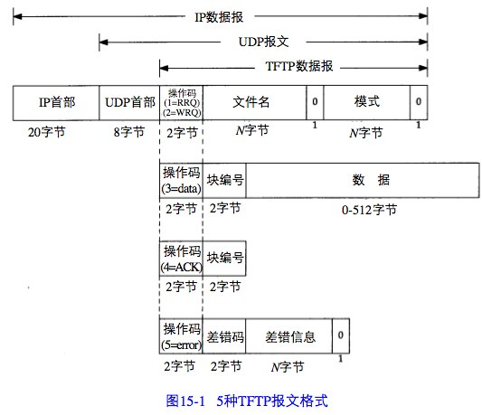

最后一种TFTP报文类型是差错报文,它的操作码为5。它用于服务器不能处理读请求或写请求的情况。

## 第16章 BOOTP:引导程序协议
### 16.1 BOOTP的分组格式
BOOTP请求和应答均被封装在UDP数据报中,如图16-1所示。


* “操作码”字段为1表示请求,为2表示应答。硬件类型字段为1表示10Mb/s的以太网,对于以太网,硬件地址长度字段为6字节。
* “跳数”字段由客户设置为0,但也能被一个代理服务器设置。
* “事务标识”字段是一个由客户设置并由服务器返回的32bit整数。客户用它对请求和应 答进行匹配。对每个请求,客户应该将该字段设置为一个随机数。
* 客户开始进行引导时,将“秒数”字段设置为一个时间值。服务器能够看到这个时间值, 备用服务器在等待时间超过这个时间值后才会响应客户的请求,这意味着主服务器没有启动。
* 如果该客户已经知道自身的IP地址,它将写入“客户IP地址”字段。否则,它将该字段设置为0对于后面这种情况,服务器用该客户的IP地址写入“你的IP地址”字段。“服务器IP地址”字段则由服务器填写。如果使用了某个代理服务器,则该代理服务器就填写“网关IP地址”字段。
* 客户必须设置它的“客户硬件地址”字段。
* “服务器主机名”字段是一个空值终止串,由服务器填写。服务器还将在“引导文件名字段”填入包括用于系统引导的文件名及其所在位置的路径全名。
* “特定厂商区域”字段用于对BOOTP进行不同的扩展。

### 16.2 端口号
BOOTP有两个熟知端口:BOOTP服务器为67,BOOTP客户为68。这意味着BOOTP客户不会选择未用的临时端口,而只用端口68。选择两个端口而不是仅选择一个端口为BOOTP服务器用的原因是:服务器的应答可以进行广播(但通常是不用广播的)。

### 16.3 BOOTP服务器的设计
这里出现了一个有趣的问题:TFTP服务器如何能将一个响应直接送回BOOTP客户?这个响应是一个UDP数据报,而服务器知道该客户的IP地址(可能通过读取服务器上的配置文件)。但如果这个客户向那个IP地 址发送一个UDP数据报(正常情况下会处理UDP的输出),BOOTP服务器的主机就可能向那个IP地址发送一个ARP请求。但这个客户不能响应这个ARP请求,因为它还不知道它自己的IP地址!(这就是在RFC 951中被称作“鸡和蛋”的问题)

有两种解决办法:第一种,通常被Unix服务器采用,是服务器发一个ioctl(2)请求给内核,为该客户在ARP高速缓存中设置一个条目(这就是命令arp -s所做的工作)。服务器能一直这么做直到它知道客户的硬件地址和IP地址。这意味着当服务器发送UDP数据报(即BOOTP应答)时,服务器的ARP将在ARP高速缓存中找到该客户的IP地址。

另一种可选的解决办法是服务器广播这个BOOTP应答而不直接将应答发回该客户。

### 16.4 BOOTP穿越路由器
收到一个BOOTP请求时,中继代理将它的IP地址填入收到BOOTP请求中的“网关IP地址字段”,然后将该请求发送到真正的BOOTP服务器。该代理中继还将跳数字段值加1。既然发出的请求是一个单播的数据报,它能按照一定的路由通过其他的路由器到达真正的BOOTP服务器。真正的BOOTP服务器收到这个请求后,产生BOOTP应答,并将它发回中继代理,而不是请求的客户。既然请求网关字段不为零,真正的BOOTP服务器知道这个请求是经过转发的。中继代理收到应答后将它发给请求的客户。

### 16.5 特定厂商信息
如果有信息要提供,这个区域的前4个字节被设置为IP地址99.130.83.99。这可称作魔术甜饼(magic cookie),表示该区域内包含信息。

我们从未看到客户广播一个ICMP地址掩码请求来获取它的子网掩码。我们可认为客户所在网络的子网掩码在返回的BOOTP应答的厂商说明区域内。Host Requirements RFC文档推荐一个系统使用BOOTP来获悉它的子网掩码,而不是采用ICMP。

## 第17章 TCP:传输控制协议
TCP通过下列方式来提供可靠性:
* 应用数据被分割成TCP认为最适合发送的数据块。这和UDP完全不同,应用程序产生的数据报长度将保持不变。由TCP传递给IP的信息单位称为报文段或段(segment)。
* 当TCP发出一个段后,它启动一个定时器,等待目的端确认收到这个报文段。如果不能及时收到一个确认,将重发这个报文段。
* 当TCP收到发自TCP连接另一端的数据,它将发送一个确认。这个确认不是立即发送,通常将推迟几分之一秒。
* TCP将保持它首部和数据的检验和。这是一个端到端的检验和,目的是检测数据在传输过程中的任何变化。如果收到段的检验和有差错,TCP将丢弃这个报文段和不确认收到此报文段(希望发端超时并重发)。
* 既然TCP报文段作为IP数据报来传输,而IP数据报的到达可能会失序,因此TCP报文段的到达也可能会失序。如果必要,TCP将对收到的数据进行重新排序,将收到的数据以正确的顺序交给应用层。
* 既然IP数据报会发生重复,TCP的接收端必须丢弃重复的数据。
* TCP还能提供流量控制。TCP连接的每一方都有固定大小的缓冲空间。TCP的接收端只允许另一端发送接收端缓冲区所能接纳的数据。这将防止较快主机致使较慢主机的缓冲区溢出。

TCP数据被封装在一个IP数据报中,如图17-1所示。

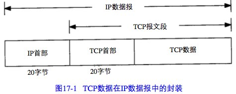

图17-2显示TCP首部的数据格式。如果不计任选字段,它通常是20个字节。

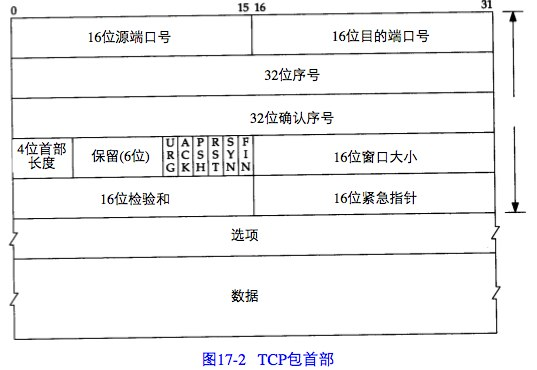

每个TCP段都包含源端和目的端的端口号,用于寻找发端和收端应用进程。

序号用来标识从TCP发端向TCP收端发送的数据字节流,TCP用序号对每个字节进行计数。

当建立一个新的连接时, SYN标志变1。序号字段包含由这个主机选择的该连接的初始序号ISN(Initial Sequence Number)。该主机要发送数据的第一个字节序号为这个ISN加1 ,因为SYN标志消耗了一个序号。

既然每个传输的字节都被计数,确认序号包含发送确认的一端所期望收到的下一个序号。因此,确认序号应当是上次已成功收到数据字节序号加1。只有ACK标志为1时确认序号字段才有效。

TCP为应用层提供全双工服务。这意味数据能在两个方向上独立地进行传输。因此,连接的每一端必须保持每个方向上的传输数据序号。

TCP可以表述为一个没有选择确认或否认的滑动窗口协议。我们说TCP缺少选择确认是因为TCP首部中的确认序号表示发方已成功收到字节,但还不包含确认序号所指的字节。当前还无法对数据流中选定的部分进行确认。例如,如果1~1024字节已经成功收到,下一报文段中包含序号从2049~3072的字节,收端并不能确认这个新的报文段。它所能做的就是发回一个确认序号为1025的ACK。它也无法对一个报文段进行否认。例如,如果收到包含1025~2048字节的报文段,但它的检验和错,TCP接收端所能做的就是发回一个确认序号为1025的ACK。

在TCP首部中有6个标志比特。

- URG 紧急指针(urgent pointer)有效。
- ACK 确认序号有效。
- PSH 接收方应该尽快将这个报文段交给应用层。
- RST 重建连接。
- SYN 同步序号用来发起一个连接。
- FIN 发端完成发送任务。

TCP的流量控制由连接的每一端通过声明的窗口大小来提供。窗口大小为字节数, 起始于确认序号字段指明的值,这个值是接收端正期望接收的字节。窗口大小是一个16 bit字段, 因而窗口大小最大为65535字节。

检验和覆盖了整个的TCP报文段:TCP首部和TCP数据。这是一个强制性的字段,一定是由发端计算和存储,并由收端进行验证。

## 第18章 TCP连接的建立与终止


