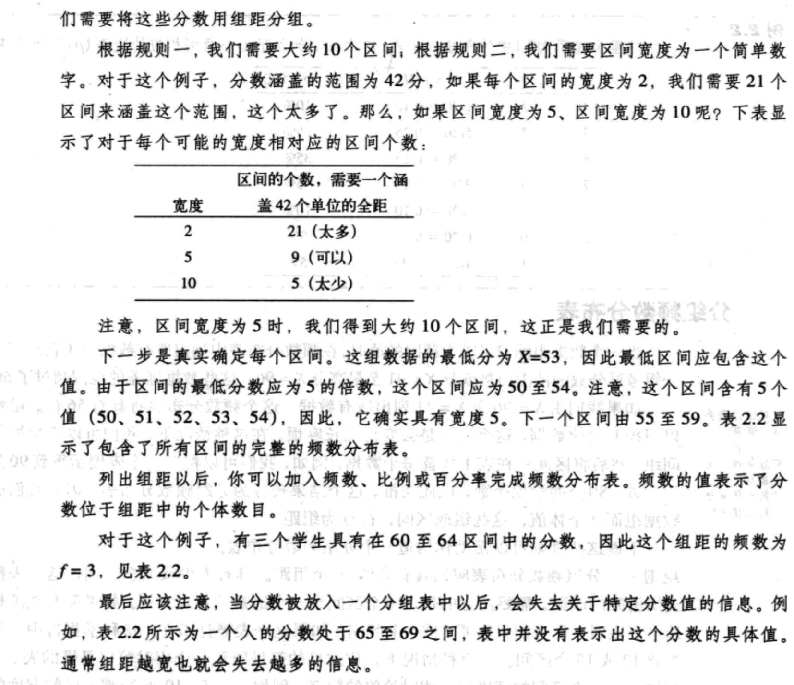
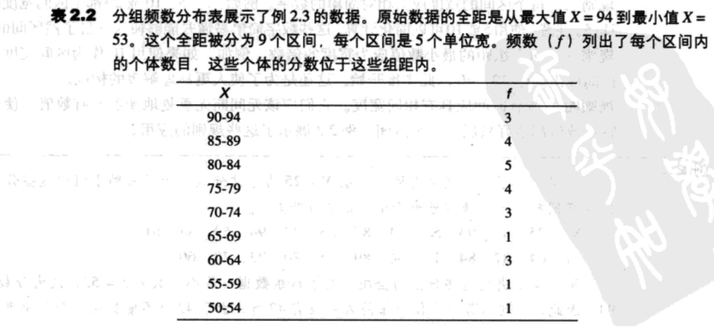
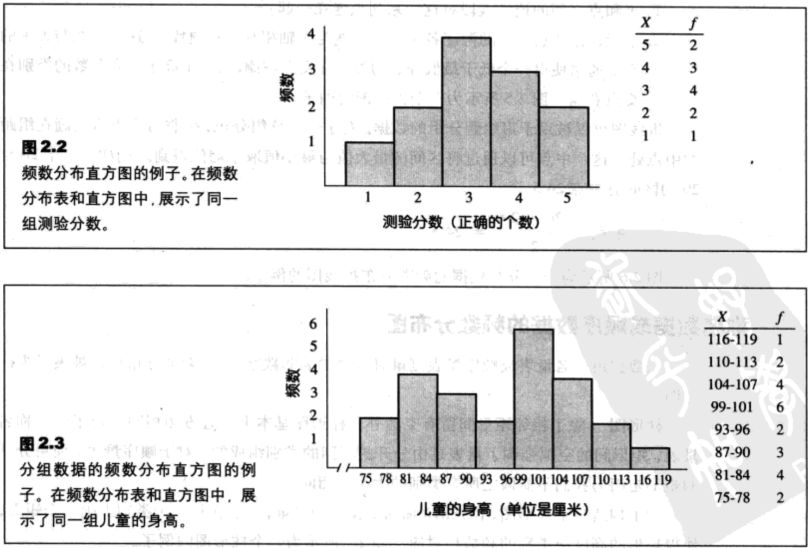
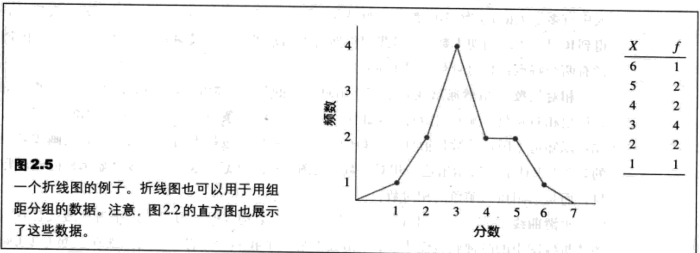

- [频数分步](#%e9%a2%91%e6%95%b0%e5%88%86%e6%ad%a5)
  - [概述](#%e6%a6%82%e8%bf%b0)
  - [频数分布表](#%e9%a2%91%e6%95%b0%e5%88%86%e5%b8%83%e8%a1%a8)
    - [比例与百分比](#%e6%af%94%e4%be%8b%e4%b8%8e%e7%99%be%e5%88%86%e6%af%94)
    - [分组频数分布表](#%e5%88%86%e7%bb%84%e9%a2%91%e6%95%b0%e5%88%86%e5%b8%83%e8%a1%a8)
  - [频数分布图](#%e9%a2%91%e6%95%b0%e5%88%86%e5%b8%83%e5%9b%be)
    - [等距或等比数据的频数分布图](#%e7%ad%89%e8%b7%9d%e6%88%96%e7%ad%89%e6%af%94%e6%95%b0%e6%8d%ae%e7%9a%84%e9%a2%91%e6%95%b0%e5%88%86%e5%b8%83%e5%9b%be)
      - [直方图](#%e7%9b%b4%e6%96%b9%e5%9b%be)
      - [折线图](#%e6%8a%98%e7%ba%bf%e5%9b%be)

## 频数分步
### 概述
`频数分步`是一种组织好的关于位于测量量表每个类别上的个数数目的数据表。

### 频数分布表

#### 比例与百分比

#### 分组频数分布表
下面这些规则可以帮助你构造一个分组频数分布表。

1. 分组频数分布表应该具有大约10个组距。
2. 每个区间的宽度应为相对简单的数字。
3. 每个组距的最小数值应为宽度的倍数。
4. 所有区间应具有相同宽度。它们应该无间断无重复地涵盖所有数值，使得任意特定数值都恰好只属于一个区间。

### 频数分布图
#### 等距或等比数据的频数分布图
##### 直方图
为了构造一个直方图，首先将数字（测量类别）沿X轴列出，然后画出位于每个X值上的一个矩形，使得：

1. 矩形的高度对应每个类别的频数；
2. 矩形的宽度为每个类别的实限。

由于矩形的宽度为每个类别的实限，相邻的矩形将连在一起，中间没有空隙或间隔。

`修正的直方图`：对传统直方图的轻微改动使得频数分布更容易理解。在修正的图中，代替每个分数中的矩形的是一摞方块，每个方块代表一个个体。因此，在每个分数上，方块数目与这个分数中的频数相对应。

##### 折线图
为了构造一个折线图，首先将数字（测量类别）沿X轴列出，然后，

1. 每个坐标的中心上方有一个点，它的垂直位置对应这这一类别的频数；
2. 点和点之间的连续线段将这一系列点连在一起；
3. 最后，在分数全距的两段各画一条直线与X轴相交（零频数）。这两条线与X轴的交点通常使得一个低于分数的类别在交点左侧，另一个高于最高分数的类别在交点右侧。

