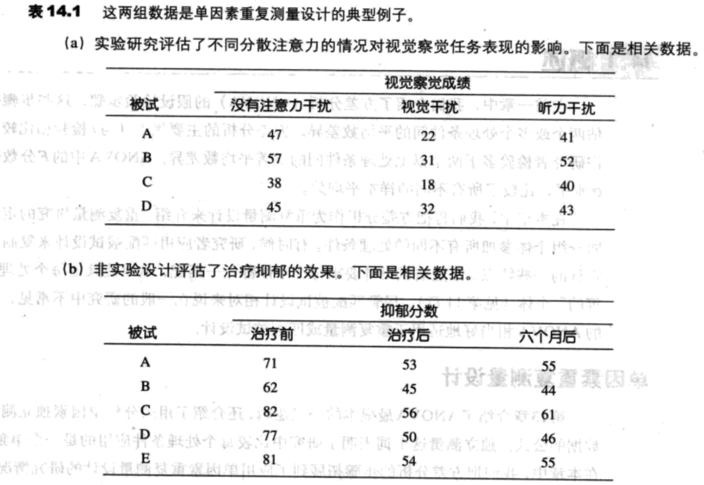
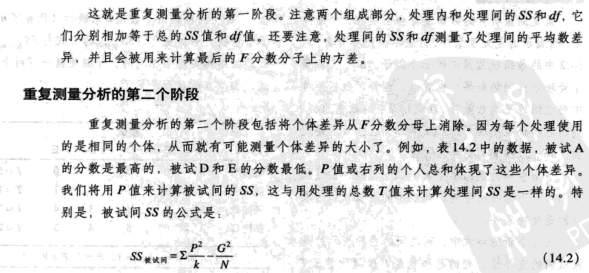
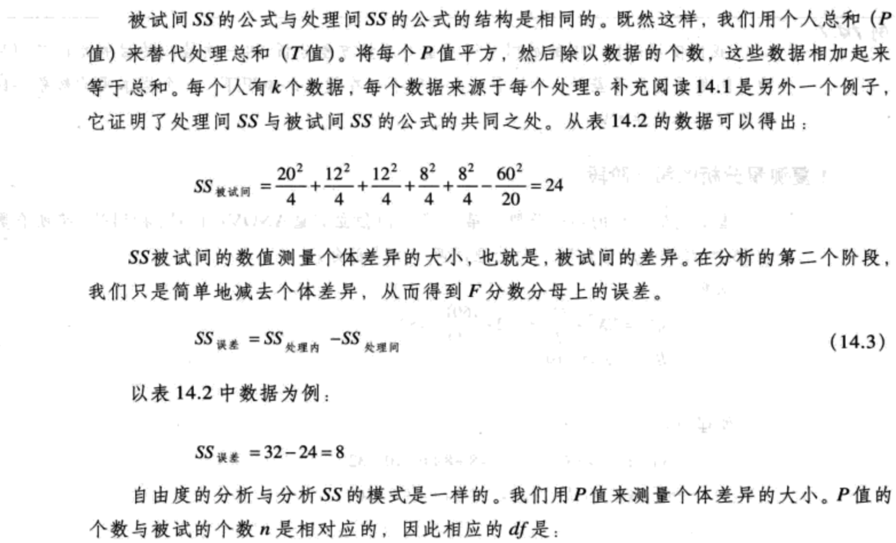
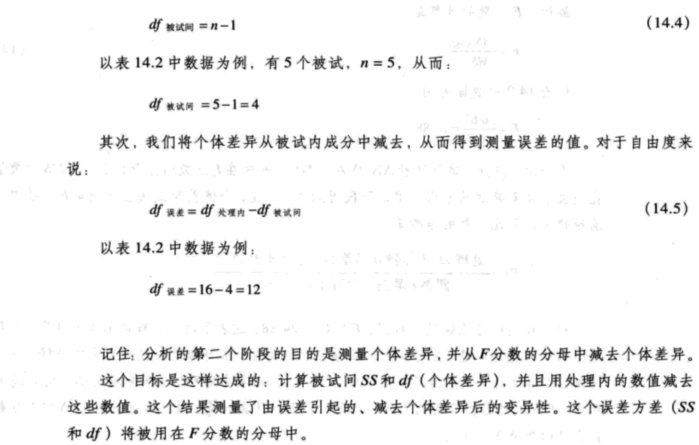
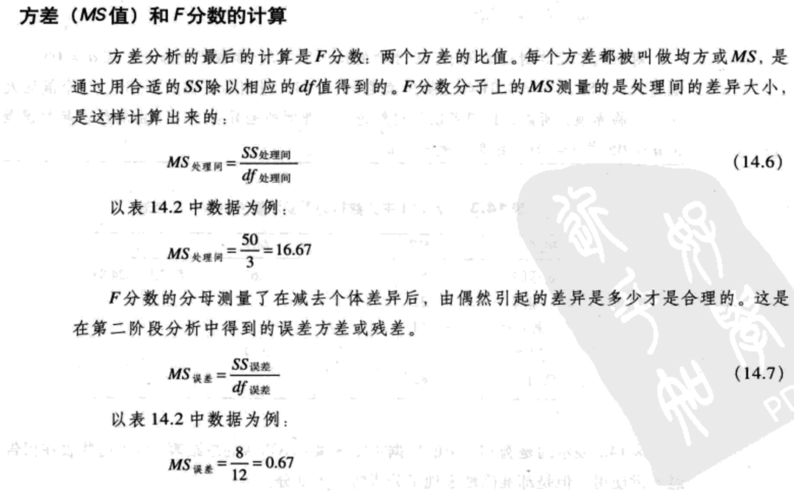

- [平均数差异推论-重复测量方差分析](#%e5%b9%b3%e5%9d%87%e6%95%b0%e5%b7%ae%e5%bc%82%e6%8e%a8%e8%ae%ba-%e9%87%8d%e5%a4%8d%e6%b5%8b%e9%87%8f%e6%96%b9%e5%b7%ae%e5%88%86%e6%9e%90)
  - [概述](#%e6%a6%82%e8%bf%b0)
    - [单因素重复测量设计](#%e5%8d%95%e5%9b%a0%e7%b4%a0%e9%87%8d%e5%a4%8d%e6%b5%8b%e9%87%8f%e8%ae%be%e8%ae%a1)
    - [重复测量ANOVA的假设](#%e9%87%8d%e5%a4%8d%e6%b5%8b%e9%87%8fanova%e7%9a%84%e5%81%87%e8%ae%be)
    - [重复测量ANOVA的F分数](#%e9%87%8d%e5%a4%8d%e6%b5%8b%e9%87%8fanova%e7%9a%84f%e5%88%86%e6%95%b0)
    - [重复策略ANOVA的逻辑](#%e9%87%8d%e5%a4%8d%e7%ad%96%e7%95%a5anova%e7%9a%84%e9%80%bb%e8%be%91)
  - [检验重复测量ANOVA的假设](#%e6%a3%80%e9%aa%8c%e9%87%8d%e5%a4%8d%e6%b5%8b%e9%87%8fanova%e7%9a%84%e5%81%87%e8%ae%be)
    - [测量重复测量ANOVA的效应大小](#%e6%b5%8b%e9%87%8f%e9%87%8d%e5%a4%8d%e6%b5%8b%e9%87%8fanova%e7%9a%84%e6%95%88%e5%ba%94%e5%a4%a7%e5%b0%8f)
    - [重复测量的后继检验](#%e9%87%8d%e5%a4%8d%e6%b5%8b%e9%87%8f%e7%9a%84%e5%90%8e%e7%bb%a7%e6%a3%80%e9%aa%8c)
    - [重复测量ANOVA的假定](#%e9%87%8d%e5%a4%8d%e6%b5%8b%e9%87%8fanova%e7%9a%84%e5%81%87%e5%ae%9a)
  - [重复测量设计的优点](#%e9%87%8d%e5%a4%8d%e6%b5%8b%e9%87%8f%e8%ae%be%e8%ae%a1%e7%9a%84%e4%bc%98%e7%82%b9)
  - [个体差异和处理效应的一致性](#%e4%b8%aa%e4%bd%93%e5%b7%ae%e5%bc%82%e5%92%8c%e5%a4%84%e7%90%86%e6%95%88%e5%ba%94%e7%9a%84%e4%b8%80%e8%87%b4%e6%80%a7)

## 平均数差异推论-重复测量方差分析
### 概述
#### 单因素重复测量设计

#### 重复测量ANOVA的假设
$H_0:\mu_1=\mu_2=\mu_3=...$

$H_1:$：至少有一个处理平均数与其他的是不同的。

#### 重复测量ANOVA的F分数
重复测量的检验统计量与独立测量ANOVA的结构是相同的。因此，重复测量ANOVA的F分数的结构是：

    F=处理间方差（差异）/ 由偶然或误差引起的方差（差异）

因为个体差异可以从重复测量研究中消除，所以F分数的最后公式可以更改为：

    F=处理间方差（没有个体差异）/ 由偶然或误差引起的方差（个体差异被消除）

消除个体差异的过程是重复测量方差分析的步骤的一个重要部分。

#### 重复策略ANOVA的逻辑
    F = 处理间方差 / (偶然/误差引起的方差)=(处理效用+偶然/误差（包括个体差异）) / (偶然/误差（包括个体差异）) （14.1）

在处理不存在效应时，F分数就平衡了，因为分子和分母测量的是完全一样的方差。在这种情况下，F值就接近于1.00。在研究结果产生的F值接近1.00时，我们可以总结出：一方面，没有证据证明处理存在效应，并且虚无假设不能被拒绝；另一方面，当处理效应存在时，它只对分子起作用，并且应该产生的F值较大。因此，大的F值表明了处理效应真正存在，并且应该拒绝虚无假设。

### 检验重复测量ANOVA的假设

图14.1给出了重复测量方差分析的全部结构。注意，ANOVA可以被看成两个阶段。第一个阶段是总的方差分成两部分：处理间方差和处理内方差。这个阶段与独立测量设计的分析相同。

分析的第二阶段是消除的F分数分母上的个体差异。在第二个阶段中，我们从处理内方差入手，然后测量并减去处理间方差，这个方差测量的是个体差异的大小。剩下的方差通常被称作是残差或误差方差，它测量的是在消除了个体差异后，由偶然引起的方差是多少才是合理的。分析的第二个阶段区分了重复测量ANOVA和独立测量ANOVA。特别是，重复测量设计要求，消除个体差异。

在重复测量方差中，F分数的分母被称作`残差`或`误差方差`，并且测量了在消除个体差异后，由偶然引起的方差。

#### 测量重复测量ANOVA的效应大小
测量方法分析中效应大小的最常见的方法是计算可以由处理差异解释的方差的百分比。可以解释的方差的百分比通常用$r^2$来表示，但是，在方差分析中，通常用$\eta^2$来表示。在第13章中，对于独立测量设计，我们计算$\eta^2$的方法如下：

$\eta^2=\frac{SS_{outer-group}}{SS_{outer-group}+SS_{inner-group}}=\frac{SS_{outer-group}}{SS_{total}}$

目的是测量可以由处理间（$SS_1$）差异解释的总得变异性。但是，对于重复测量设计来说，另外一个组成部分可以解释数据的部分变异性。特别是，部分变异性是由被试间（$SS_2$）差异引起的。例如，在表14.2中，被试A始终比被试B的分数高。这个一致的差异解释了数据中的部分变异性。在计算处理效应的大小时，我们通常会消除任何可以由其他因素解释的变异性，然后在计算剩下的，可以由处理效应解释的变异性的百分比。因此，对于重复测量ANOVA来说，在计算$\eta^2$之前，要消除由个体差异带来的变异性。因此，$\eta^2$可以计算为：

$\eta^2=\frac{SS_1}{SS_{total}-SS_2}\ (14.9)$

因为公式14.9计算的是一个百分比，这个百分比不是建立在分数的总得变异性（消除了，$SS_2$）基础上的，所以，算出的结果被称作偏$\eta^2$。

公式14.9的最终目的是计算不能被其他因素解释的变异性百分比。因此，公式14.9的分母是由处理差异引起的变异性和只是由偶然引起的变异性。记住这个，$\eta^2$公式的等价形式是：

$\eta^2=\frac{SS_1}{SS_1+SS_{error}}\ (14.10)$

在这个$\eta^2$的新公式中，分母包含了由处理差异解释的变异性与其他不能解释的变异性。应用任何一个公式，我们可以从例14.1的数据中得到：

$\eta^2=\frac{50}{58}=0.862$ （或86.2%）

结果表明数据中的86.2%的变异性（除了个体差异）是由处理间差异引起的。

#### 重复测量的后继检验
ANOVA是对处理的显著的全面检查。拒绝虚无假设只表示至少有两组处理平均数是不同的。但是，当k大于2时，研究者就必须应用ANOVA事后比较。在第13章中，我们应用了Tukey真实显著差异检验和Scheffe检验来比较这些处理平均数。这两个程序都试图通过调整可能的比较的个数来控制总的$\alpha$水平。

在重复测量ANOVA中，我们可以用相同的方式来使用Tukey真实显著差异检验和Scheffe检验。但是，在公式中，我们需要用$MS_{error}$来代替$MS_{inner}$，在统计表中确定临界值时，需要用$df_{error}$来代替$df_{inner}$。

#### 重复测量ANOVA的假定
重复测量ANOVA的基本假定与独立测量ANOVA的假定是相同的。

1. 每个处理条件里的观察必须是独立的。
2. 每个处理内的总体分布必须是正态分布（如同以前提到的，只有在样本比较小时，正态分布的假设才比较重要）。
3. 每个处理的总体分布的方差应该是大体相当的。

对于重复测量ANOVA来说，还有另外一个假设，叫做方差齐性。基本上来说，每个被试在每个处理条件中都应该保持一定的相对位置。如果处理效果对于所有的被试来说是不一致的，如果某些被试存在顺序效应，另外一些不存在这个效应，那么久违反了这个假设。

### 重复测量设计的优点

### 个体差异和处理效应的一致性

