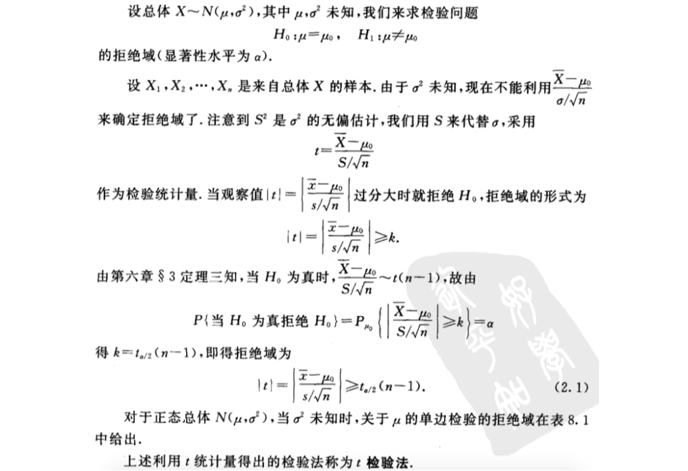
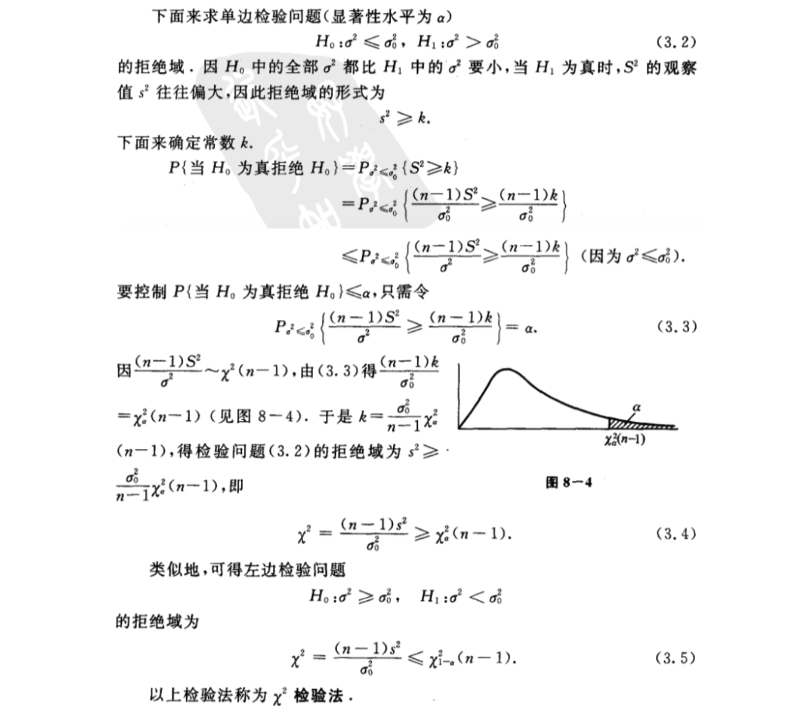

- [第八章 假设检验](#%e7%ac%ac%e5%85%ab%e7%ab%a0-%e5%81%87%e8%ae%be%e6%a3%80%e9%aa%8c)
  - [1 假设检验](#1-%e5%81%87%e8%ae%be%e6%a3%80%e9%aa%8c)
  - [2 状态总体均值的假设检验](#2-%e7%8a%b6%e6%80%81%e6%80%bb%e4%bd%93%e5%9d%87%e5%80%bc%e7%9a%84%e5%81%87%e8%ae%be%e6%a3%80%e9%aa%8c)
    - [（一）单个总体N(μ,σ2)均值μ的检验](#%e4%b8%80%e5%8d%95%e4%b8%aa%e6%80%bb%e4%bd%93n%ce%bc%cf%832%e5%9d%87%e5%80%bc%ce%bc%e7%9a%84%e6%a3%80%e9%aa%8c)
      - [1 σ2已知，关于μ的检验（Z检验）](#1-%cf%832%e5%b7%b2%e7%9f%a5%e5%85%b3%e4%ba%8e%ce%bc%e7%9a%84%e6%a3%80%e9%aa%8cz%e6%a3%80%e9%aa%8c)
      - [2 σ2未知，关于μ的检验（t检验）](#2-%cf%832%e6%9c%aa%e7%9f%a5%e5%85%b3%e4%ba%8e%ce%bc%e7%9a%84%e6%a3%80%e9%aa%8ct%e6%a3%80%e9%aa%8c)
    - [（二）两个正态总体均值差的检验（t检验）](#%e4%ba%8c%e4%b8%a4%e4%b8%aa%e6%ad%a3%e6%80%81%e6%80%bb%e4%bd%93%e5%9d%87%e5%80%bc%e5%b7%ae%e7%9a%84%e6%a3%80%e9%aa%8ct%e6%a3%80%e9%aa%8c)
    - [（三）基于成对数据的检验（t检验）](#%e4%b8%89%e5%9f%ba%e4%ba%8e%e6%88%90%e5%af%b9%e6%95%b0%e6%8d%ae%e7%9a%84%e6%a3%80%e9%aa%8ct%e6%a3%80%e9%aa%8c)
  - [3 正态总体方差的假设检验](#3-%e6%ad%a3%e6%80%81%e6%80%bb%e4%bd%93%e6%96%b9%e5%b7%ae%e7%9a%84%e5%81%87%e8%ae%be%e6%a3%80%e9%aa%8c)
    - [（一）单个总体的情况（χ2检验法）](#%e4%b8%80%e5%8d%95%e4%b8%aa%e6%80%bb%e4%bd%93%e7%9a%84%e6%83%85%e5%86%b5%cf%872%e6%a3%80%e9%aa%8c%e6%b3%95)
    - [正态总体均值、方差的检验法（显著性水平α）](#%e6%ad%a3%e6%80%81%e6%80%bb%e4%bd%93%e5%9d%87%e5%80%bc%e6%96%b9%e5%b7%ae%e7%9a%84%e6%a3%80%e9%aa%8c%e6%b3%95%e6%98%be%e8%91%97%e6%80%a7%e6%b0%b4%e5%b9%b3%ce%b1)
    - [（二）两个总体的情况（F检验法）](#%e4%ba%8c%e4%b8%a4%e4%b8%aa%e6%80%bb%e4%bd%93%e7%9a%84%e6%83%85%e5%86%b5f%e6%a3%80%e9%aa%8c%e6%b3%95)
  - [4 置信区间与假设检验之间的关系](#4-%e7%bd%ae%e4%bf%a1%e5%8c%ba%e9%97%b4%e4%b8%8e%e5%81%87%e8%ae%be%e6%a3%80%e9%aa%8c%e4%b9%8b%e9%97%b4%e7%9a%84%e5%85%b3%e7%b3%bb)
  - [5 样本容量的选取](#5-%e6%a0%b7%e6%9c%ac%e5%ae%b9%e9%87%8f%e7%9a%84%e9%80%89%e5%8f%96)
  - [6 分布拟合检验](#6-%e5%88%86%e5%b8%83%e6%8b%9f%e5%90%88%e6%a3%80%e9%aa%8c)
    - [（一）单个分布的χ2拟合检验法](#%e4%b8%80%e5%8d%95%e4%b8%aa%e5%88%86%e5%b8%83%e7%9a%84%cf%872%e6%8b%9f%e5%90%88%e6%a3%80%e9%aa%8c%e6%b3%95)
    - [（二）分布族的χ2拟合检验](#%e4%ba%8c%e5%88%86%e5%b8%83%e6%97%8f%e7%9a%84%cf%872%e6%8b%9f%e5%90%88%e6%a3%80%e9%aa%8c)
    - [（三）偏度、峰度检验](#%e4%b8%89%e5%81%8f%e5%ba%a6%e5%b3%b0%e5%ba%a6%e6%a3%80%e9%aa%8c)
  - [7 秩和检验](#7-%e7%a7%a9%e5%92%8c%e6%a3%80%e9%aa%8c)
  - [8 假设检验问题的p值检验法](#8-%e5%81%87%e8%ae%be%e6%a3%80%e9%aa%8c%e9%97%ae%e9%a2%98%e7%9a%84p%e5%80%bc%e6%a3%80%e9%aa%8c%e6%b3%95)

# 第八章 假设检验
## 1 假设检验

## 2 状态总体均值的假设检验
### （一）单个总体N(μ,σ2)均值μ的检验
#### 1 σ2已知，关于μ的检验（Z检验）

#### 2 σ2未知，关于μ的检验（t检验）

### （二）两个正态总体均值差的检验（t检验）

### （三）基于成对数据的检验（t检验）

## 3 正态总体方差的假设检验
### （一）单个总体的情况（χ2检验法）

### 正态总体均值、方差的检验法（显著性水平α）

### （二）两个总体的情况（F检验法）

## 4 置信区间与假设检验之间的关系

## 5 样本容量的选取

## 6 分布拟合检验
### （一）单个分布的χ2拟合检验法

### （二）分布族的χ2拟合检验

### （三）偏度、峰度检验

## 7 秩和检验

## 8 假设检验问题的p值检验法

