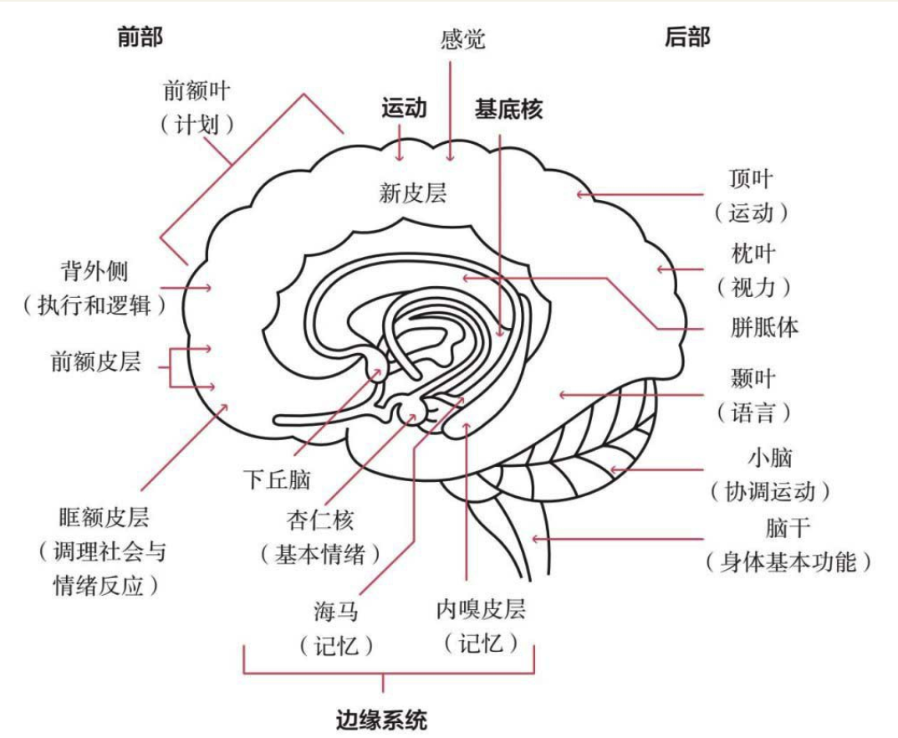
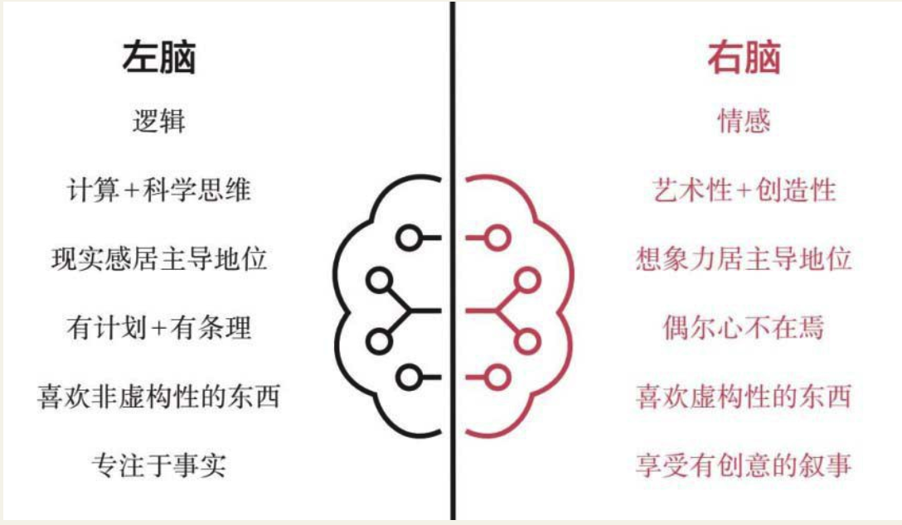
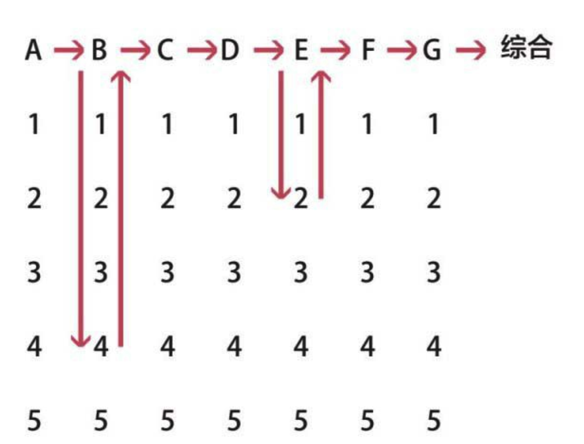

    作者: [美] 瑞·达利欧
    出版社: 中信出版社
    原作名: Principles: Life and Work
    译者: 刘波 / 綦相
    出版年: 2018-1
    页数: 576
    装帧: 精装
    ISBN: 9787508684031

[豆瓣链接](https://book.douban.com/subject/27608239/)

- [导言](#%e5%af%bc%e8%a8%80)
- [第二部分 生活原则](#%e7%ac%ac%e4%ba%8c%e9%83%a8%e5%88%86-%e7%94%9f%e6%b4%bb%e5%8e%9f%e5%88%99)
  - [拥抱现实，应对现实](#%e6%8b%a5%e6%8a%b1%e7%8e%b0%e5%ae%9e%e5%ba%94%e5%af%b9%e7%8e%b0%e5%ae%9e)
    - [做一个超级现实的人](#%e5%81%9a%e4%b8%80%e4%b8%aa%e8%b6%85%e7%ba%a7%e7%8e%b0%e5%ae%9e%e7%9a%84%e4%ba%ba)
    - [真相（或者更精确地说，对现实的准确理解）是任何良好结果的根本依据](#%e7%9c%9f%e7%9b%b8%e6%88%96%e8%80%85%e6%9b%b4%e7%b2%be%e7%a1%ae%e5%9c%b0%e8%af%b4%e5%af%b9%e7%8e%b0%e5%ae%9e%e7%9a%84%e5%87%86%e7%a1%ae%e7%90%86%e8%a7%a3%e6%98%af%e4%bb%bb%e4%bd%95%e8%89%af%e5%a5%bd%e7%bb%93%e6%9e%9c%e7%9a%84%e6%a0%b9%e6%9c%ac%e4%be%9d%e6%8d%ae)
    - [做到头脑极度开放、极度透明](#%e5%81%9a%e5%88%b0%e5%a4%b4%e8%84%91%e6%9e%81%e5%ba%a6%e5%bc%80%e6%94%be%e6%9e%81%e5%ba%a6%e9%80%8f%e6%98%8e)
    - [观察自然，学习现实规律](#%e8%a7%82%e5%af%9f%e8%87%aa%e7%84%b6%e5%ad%a6%e4%b9%a0%e7%8e%b0%e5%ae%9e%e8%a7%84%e5%be%8b)
    - [进化是生命最大的成就和最大的回报](#%e8%bf%9b%e5%8c%96%e6%98%af%e7%94%9f%e5%91%bd%e6%9c%80%e5%a4%a7%e7%9a%84%e6%88%90%e5%b0%b1%e5%92%8c%e6%9c%80%e5%a4%a7%e7%9a%84%e5%9b%9e%e6%8a%a5)
    - [理解自然提供的现实教训](#%e7%90%86%e8%a7%a3%e8%87%aa%e7%84%b6%e6%8f%90%e4%be%9b%e7%9a%84%e7%8e%b0%e5%ae%9e%e6%95%99%e8%ae%ad)
    - [痛苦+反思=进步](#%e7%97%9b%e8%8b%a6%e5%8f%8d%e6%80%9d%e8%bf%9b%e6%ad%a5)
    - [考虑后续与再后续的结果](#%e8%80%83%e8%99%91%e5%90%8e%e7%bb%ad%e4%b8%8e%e5%86%8d%e5%90%8e%e7%bb%ad%e7%9a%84%e7%bb%93%e6%9e%9c)
    - [接受结果](#%e6%8e%a5%e5%8f%97%e7%bb%93%e6%9e%9c)
    - [从更高的层次俯视机器](#%e4%bb%8e%e6%9b%b4%e9%ab%98%e7%9a%84%e5%b1%82%e6%ac%a1%e4%bf%af%e8%a7%86%e6%9c%ba%e5%99%a8)
  - [用五步流程实现你的人生愿望](#%e7%94%a8%e4%ba%94%e6%ad%a5%e6%b5%81%e7%a8%8b%e5%ae%9e%e7%8e%b0%e4%bd%a0%e7%9a%84%e4%ba%ba%e7%94%9f%e6%84%bf%e6%9c%9b)
    - [有明确的目标](#%e6%9c%89%e6%98%8e%e7%a1%ae%e7%9a%84%e7%9b%ae%e6%a0%87)
    - [找出问题，并且不容忍问题](#%e6%89%be%e5%87%ba%e9%97%ae%e9%a2%98%e5%b9%b6%e4%b8%94%e4%b8%8d%e5%ae%b9%e5%bf%8d%e9%97%ae%e9%a2%98)
    - [诊断问题，找到问题的根源](#%e8%af%8a%e6%96%ad%e9%97%ae%e9%a2%98%e6%89%be%e5%88%b0%e9%97%ae%e9%a2%98%e7%9a%84%e6%a0%b9%e6%ba%90)
    - [规划方案](#%e8%a7%84%e5%88%92%e6%96%b9%e6%a1%88)
    - [坚定地从头至尾执行方案](#%e5%9d%9a%e5%ae%9a%e5%9c%b0%e4%bb%8e%e5%a4%b4%e8%87%b3%e5%b0%be%e6%89%a7%e8%a1%8c%e6%96%b9%e6%a1%88)
  - [做到头脑极度开放](#%e5%81%9a%e5%88%b0%e5%a4%b4%e8%84%91%e6%9e%81%e5%ba%a6%e5%bc%80%e6%94%be)
    - [认识你的两大障碍](#%e8%ae%a4%e8%af%86%e4%bd%a0%e7%9a%84%e4%b8%a4%e5%a4%a7%e9%9a%9c%e7%a2%8d)
    - [奉行头脑极度开放](#%e5%a5%89%e8%a1%8c%e5%a4%b4%e8%84%91%e6%9e%81%e5%ba%a6%e5%bc%80%e6%94%be)
    - [领会并感激：深思熟虑的意见分歧](#%e9%a2%86%e4%bc%9a%e5%b9%b6%e6%84%9f%e6%bf%80%e6%b7%b1%e6%80%9d%e7%86%9f%e8%99%91%e7%9a%84%e6%84%8f%e8%a7%81%e5%88%86%e6%ad%a7)
    - [识别你应当注意的头脑封闭和头脑开放的不同迹象](#%e8%af%86%e5%88%ab%e4%bd%a0%e5%ba%94%e5%bd%93%e6%b3%a8%e6%84%8f%e7%9a%84%e5%a4%b4%e8%84%91%e5%b0%81%e9%97%ad%e5%92%8c%e5%a4%b4%e8%84%91%e5%bc%80%e6%94%be%e7%9a%84%e4%b8%8d%e5%90%8c%e8%bf%b9%e8%b1%a1)
    - [理解你如何做到头脑极度开放](#%e7%90%86%e8%a7%a3%e4%bd%a0%e5%a6%82%e4%bd%95%e5%81%9a%e5%88%b0%e5%a4%b4%e8%84%91%e6%9e%81%e5%ba%a6%e5%bc%80%e6%94%be)
  - [理解人与人大不相同](#%e7%90%86%e8%a7%a3%e4%ba%ba%e4%b8%8e%e4%ba%ba%e5%a4%a7%e4%b8%8d%e7%9b%b8%e5%90%8c)
    - [明白你与其他人的思维方式能带来的力量](#%e6%98%8e%e7%99%bd%e4%bd%a0%e4%b8%8e%e5%85%b6%e4%bb%96%e4%ba%ba%e7%9a%84%e6%80%9d%e7%bb%b4%e6%96%b9%e5%bc%8f%e8%83%bd%e5%b8%a6%e6%9d%a5%e7%9a%84%e5%8a%9b%e9%87%8f)
    - [理解大脑里的主要斗争，以及如何控制这些斗争，以实现“你”的愿望](#%e7%90%86%e8%a7%a3%e5%a4%a7%e8%84%91%e9%87%8c%e7%9a%84%e4%b8%bb%e8%a6%81%e6%96%97%e4%ba%89%e4%bb%a5%e5%8f%8a%e5%a6%82%e4%bd%95%e6%8e%a7%e5%88%b6%e8%bf%99%e4%ba%9b%e6%96%97%e4%ba%89%e4%bb%a5%e5%ae%9e%e7%8e%b0%e4%bd%a0%e7%9a%84%e6%84%bf%e6%9c%9b)
    - [认识自己和他人的特性](#%e8%ae%a4%e8%af%86%e8%87%aa%e5%b7%b1%e5%92%8c%e4%bb%96%e4%ba%ba%e7%9a%84%e7%89%b9%e6%80%a7)
    - [无论你要实现什么目标，让合适的人各司其职以支持你的目标，是成功的关键](#%e6%97%a0%e8%ae%ba%e4%bd%a0%e8%a6%81%e5%ae%9e%e7%8e%b0%e4%bb%80%e4%b9%88%e7%9b%ae%e6%a0%87%e8%ae%a9%e5%90%88%e9%80%82%e7%9a%84%e4%ba%ba%e5%90%84%e5%8f%b8%e5%85%b6%e8%81%8c%e4%bb%a5%e6%94%af%e6%8c%81%e4%bd%a0%e7%9a%84%e7%9b%ae%e6%a0%87%e6%98%af%e6%88%90%e5%8a%9f%e7%9a%84%e5%85%b3%e9%94%ae)
  - [学习如何有效决策](#%e5%ad%a6%e4%b9%a0%e5%a6%82%e4%bd%95%e6%9c%89%e6%95%88%e5%86%b3%e7%ad%96)
    - [要认识到：（1）影响好决策的最大威胁是有害的情绪；（2）决策是一个两步流程（先了解后决定）](#%e8%a6%81%e8%ae%a4%e8%af%86%e5%88%b01%e5%bd%b1%e5%93%8d%e5%a5%bd%e5%86%b3%e7%ad%96%e7%9a%84%e6%9c%80%e5%a4%a7%e5%a8%81%e8%83%81%e6%98%af%e6%9c%89%e5%ae%b3%e7%9a%84%e6%83%85%e7%bb%aa2%e5%86%b3%e7%ad%96%e6%98%af%e4%b8%80%e4%b8%aa%e4%b8%a4%e6%ad%a5%e6%b5%81%e7%a8%8b%e5%85%88%e4%ba%86%e8%a7%a3%e5%90%8e%e5%86%b3%e5%ae%9a)
    - [综合分析眼前的形势](#%e7%bb%bc%e5%90%88%e5%88%86%e6%9e%90%e7%9c%bc%e5%89%8d%e7%9a%84%e5%bd%a2%e5%8a%bf)
    - [综合分析变化中的形势](#%e7%bb%bc%e5%90%88%e5%88%86%e6%9e%90%e5%8f%98%e5%8c%96%e4%b8%ad%e7%9a%84%e5%bd%a2%e5%8a%bf)
    - [高效地综合考虑各个层次](#%e9%ab%98%e6%95%88%e5%9c%b0%e7%bb%bc%e5%90%88%e8%80%83%e8%99%91%e5%90%84%e4%b8%aa%e5%b1%82%e6%ac%a1)
      - [好的情况](#%e5%a5%bd%e7%9a%84%e6%83%85%e5%86%b5)
      - [不好的情况](#%e4%b8%8d%e5%a5%bd%e7%9a%84%e6%83%85%e5%86%b5)
    - [综合分析现实、理解如何行动的最好工具是逻辑、理性和常识](#%e7%bb%bc%e5%90%88%e5%88%86%e6%9e%90%e7%8e%b0%e5%ae%9e%e7%90%86%e8%a7%a3%e5%a6%82%e4%bd%95%e8%a1%8c%e5%8a%a8%e7%9a%84%e6%9c%80%e5%a5%bd%e5%b7%a5%e5%85%b7%e6%98%af%e9%80%bb%e8%be%91%e7%90%86%e6%80%a7%e5%92%8c%e5%b8%b8%e8%af%86)
    - [根据预期价值计算做决策](#%e6%a0%b9%e6%8d%ae%e9%a2%84%e6%9c%9f%e4%bb%b7%e5%80%bc%e8%ae%a1%e7%ae%97%e5%81%9a%e5%86%b3%e7%ad%96)
    - [比较更多信息带来的价值和不做决定造成的成本，决定优先顺序](#%e6%af%94%e8%be%83%e6%9b%b4%e5%a4%9a%e4%bf%a1%e6%81%af%e5%b8%a6%e6%9d%a5%e7%9a%84%e4%bb%b7%e5%80%bc%e5%92%8c%e4%b8%8d%e5%81%9a%e5%86%b3%e5%ae%9a%e9%80%a0%e6%88%90%e7%9a%84%e6%88%90%e6%9c%ac%e5%86%b3%e5%ae%9a%e4%bc%98%e5%85%88%e9%a1%ba%e5%ba%8f)
    - [使用原则](#%e4%bd%bf%e7%94%a8%e5%8e%9f%e5%88%99)
  - [生活原则总结](#%e7%94%9f%e6%b4%bb%e5%8e%9f%e5%88%99%e6%80%bb%e7%bb%93)

# 导言
自己思考！

- 你想要什么？
- 事实是什么？
- 如何行动？

# 第二部分 生活原则
## 拥抱现实，应对现实
了解现实如何运行，构想我想要创造的东西，将其实现。

我学到的东西将主要来自对挫折的反思。就像长跑者忍耐痛苦去体验“跑步者的愉悦感”一样，我已经基本上走出了为犯错而痛苦的阶段，而是享受从犯错中学习的愉悦。我相信通过练习你也能改变自己的习惯，体验同样的 **“从犯错中学习的愉悦感”**。

### 做一个超级现实的人
**梦想+现实+决心=成功的生活**。

### 真相（或者更精确地说，对现实的准确理解）是任何良好结果的根本依据
当真相与愿望不符时，大多数人抗拒真相。

### 做到头脑极度开放、极度透明
对于快速学习和有效改变而言，头脑极度开放、极度透明是价值无限的。学习过程是一连串的实时反馈循环：我们做决定，看到结果，然后根据结果改进对现实的理解。做到头脑极度开放能够增强这些反馈循环的效率。

不要担心其他人的看法，使之成为你的障碍。学着做到极度透明，就像学习如何公开发言一样：一开始你会难堪，但你练得越多，你就越能应付自如。

拥抱极度求真和极度透明将带来更有意义的工作和更有意义的人际关系。这需要练习和改变人的习惯。我发现大多数习惯的改变通常需要约18个月，这也一样。

### 观察自然，学习现实规律
与动物不同，大多数人努力调和自身的情感、本能（来自人类大脑与动物相似的部分）与理性（来自人类大脑更发达的部分）。这一冲突导致人混淆了事实和自己想要的事实。

人在尝试理解任何东西（经济、市场、天气等）时，都可以从两种视角出发：

1. 自上而下：努力找到这些东西背后的唯一驱动法则或规律。例如，在理解市场时，人可以研究影响所有经济和市场的普适法则，如供求关系；在理解物种时，人可以集中了解基因密码是如何对所有物种发生作用的。
2. 自下而上：研究每种具体情况及其背后的法则或规律，例如，小麦市场独特的法则或规律，或者使鸭子区别于其他物种的基因序列。

不要固守你对事物“应该”是什么样的看法，这将使你无法了解真实的情况。多数人把对自己或者自己关心的人不利的事情叫作坏事情，而忽视了更大的好。

一个东西要“好”，就必须符合现实的规律，并促进整体的进化，这能带来最大的回报。

**进化是宇宙中最强大的力量，是唯一永恒的东西，是一切的驱动力**。

不进化就死亡。关键在于经历失败、学习和快速的改进。如果你不停地学习和改进，你的进化过程就会循环上升。

### 进化是生命最大的成就和最大的回报
进化是出于本能的，所以大多数人都会感觉到内心深处的这种动力。

自然的一个奇妙之处是，自然中充满了个体生物，各自以符合自身利益的方式行动，不理解也不引导整体的变化，但它们构成了一个美妙运转且不断进化的整体系统。

个体的激励机制必须符合群体的目标。

现实为了整体趋向最优化，而不是为了个体。

通过快速试错以适应现实是无价的。

意识到你既是一切又什么都不是，并决定你想成为什么样子。我们渺小、短命得不可思议，无论取得什么样的成就，其影响都是微不足道的。同时，我们又本能地希望有意义，希望进化，而我们只能产生一丁点儿意义。所有这些一点点的意义加起来，才是宇宙进化的推动力。

你的未来取决于你的视角。你必须决定，你将在多大程度上把他人的利益置于自身利益之上，以及你将以这样的方式对待哪些人。这是因为你将不断遇到迫使你做出上述抉择的情况。就个人而言，我现在发现，拥抱现实、从自然的视角俯视自身、做宇宙整体微不足道的一小部分，是件很美妙的事。**我本能的和有意识的目标都只是进化，利用自己的生命和特性，以某种微弱的方式为进化做贡献**。

### 理解自然提供的现实教训
当我开始从理解现实规律的视角看待现实，而不是认为现实不对时，我发现几乎所有起初看起来“不好”的东西，如雨天、缺点甚至死亡，都是由于我对于自己想要拥有的东西持有先入为主之见。我逐渐意识到，我产生这些最初的反应，是因为我没有把事物放到大背景下看待，即**现实的构造是让整体实现最优，而不是尽力实现我的愿望。**

把你的进化最大化。

这种持续地追求学习和改进的动力，让人类天生地对进步感到快乐，对快速进步感到兴奋。尽管大多数人觉得他们是在追求能让自己快乐的东西（玩具、大房子、金钱、地位等），但这些只能带来小的满足，远远无法与进步能给大多数人带去的长期的满足感相比。

记住“没有痛苦就没有收获”。虽然我们不喜欢痛苦，但自然的一切创造都有目的，所以自然让我们痛苦是有意图的。那么意图是什么？痛苦让我们清醒，帮助我们进步。

自然的一项根本法则是，为了赢得力量，人必须努力突破极限，而这是痛苦的。正像卡尔·荣格所说，“人需要困难，这对健康来说是必需的”。但多数人本能地躲避痛苦。

### 痛苦+反思=进步
如果你能养成一种习惯，面对精神痛苦时能够自动地反思痛苦而不是躲避痛苦，你将能够快速地学习和进化。

迎接而非躲避痛苦。如果你不是放任自己，而是养成习惯，总是在一定程度的痛苦中工作，你将更快地进化。养成享受痛苦的习惯，从痛苦中学习，将让人“步入新境界”。我所说的“步入新境界”是指，你将喜欢上以下三点：

- 找到、接受，并学会如何应对你的弱点；
- 更喜欢周围的人对你坦诚，而不是隐瞒对你的负面看法；
- 展现真实的自我，而不是强行把弱点伪装成优势。

接受严厉的爱。建议你不要为自己的缺点感到羞愧，要明白任何人都有缺点。把缺点摆上桌面将帮助你戒掉坏习惯，养成好习惯，获得真正的能力，拥有充足的理由保持乐观。

### 考虑后续与再后续的结果
直接结果经常是诱惑，导致我们失去真正想要的东西，直接结果有时也是障碍。

### 接受结果
不管在生活中遇到什么情况，如果你能负起责任，进行良好的决策，而不是抱怨你无法控制的东西，你将更有可能成功并找到幸福。心理学家称此为拥有`“内控点”`。

### 从更高的层次俯视机器
我把这种超越自己和其他人的处境并客观地俯视处境的能力，称为 **“更高层次的思考”**。更高层次的思考能让你学习和影响生活中的各种因果关系，利用这些因果关系得到你想要的结果。

把自己想象成一部在大机器里运转的小机器，并明白你有能力改变你的机器以实现更好的结果。你有你的目标。你用来实现目标的方式，我称为**你的机器**。它包括设计（必须做的事）和人（由谁来做这些必须做的事）。人包括你和帮助你的人。尽管合理的设计必不可少，但这只是战斗的一半。同样重要的是让合适的人来执行这些任务。

通过比较你实现的结果和你的目标，你就能确定如何改进你的机器。要看看如何改进或改变设计或人员，以实现你的目标。用图形来展示，这个过程就是一个反馈循环，参见下页图。

区别作为机器设计者的你和作为机器中工作者的你。大多数人一直都把自己看作机器中的工作者。如果你能够看到这两种角色之间的区别，并且看到成为自身生活的良好设计者与管理者要比成为机器中的工作者重要得多，你就走到了正确的道路上。想要取得成功，作为设计者和管理者的你必须客观看待作为工作者的你，不高看自己，也不让自己承担不应该承担的任务。大多数人都是凭情感行动，只看眼前，而没有从上述战略性的视角出发。他们的生活中充满了没有方向性的情感体验，随波逐流。

大多数人犯下的最大错误是不客观看待自己以及其他人，这导致他们一次次地栽在自己或其他人的弱点上。

成功的人能超越自身，客观看待事物，并管理事物以塑造改变。例如，假如作为设计者和管理者的你发现，作为工作者的你某件事情做不好，你就应该解雇这个作为工作者的你，找到一个好的替代者，而在此过程中你必须一直作为自身生活的设计者和管理者。

如果你的头脑足够开放，足够有决心，你几乎可以实现任何愿望。

## 用五步流程实现你的人生愿望
在我看来，个人进化过程（即我在上一条描述的循环）通过5个不同的步骤发生。这五步大概是：

1. 有明确的目标。
2. 找到阻碍你实现这些目标的问题，并且不容忍问题。
3. 准确诊断问题，找到问题的根源。
4. 规划可以解决问题的方案。
5. 做一切必要的事来践行这些方案，实现成果。

必须按顺序一步步来。例如，设定目标的时候就设定目标，不要想如何实现目标或者出错了怎么办。当你诊断问题的时候，不要想你将如何解决问题，只是诊断。混淆这两个步骤会导致不理想的结果，因为这会妨碍你发现真正的问题。

你必须以清醒、理性的方式来推进这个过程，从更高的层面俯视自身，做到一丝不苟的诚实。如果你被自己的情绪压倒，就退后一步，暂时停下来，直到恢复清醒的思考能力。

### 有明确的目标
排列优先顺序：尽管你几乎可以得到你想要的任何东西，但你不可能得到你想要的所有东西。

不要混淆目标和欲望。合理的目标是你真正需要实现的东西，欲望则是你想要但会阻止你实现目标的东西。欲望通常是直接结果。例如，你的目标也许是体形健美，而你的欲望是吃好吃但不健康的食物。

调和你的目标和欲望，以明确你在生活中真正想要的东西。以激情为例。没有激情的生活枯燥乏味，你不会愿意过，但关键在于如何处理自己的激情。是让激情消耗你，驱使你做出不理性的行为，还是你驾驭激情，从而得到动力来追求你真正的目标？

不要把成功的装饰误认为成功本身。有追求成就的方向感是很重要的。有的人痴迷于一双1 200美元的鞋或一辆时髦的汽车，这样的人很少会感到快乐，因为他们不知道自己真正想要的是什么，因而也不知道什么能满足他们。

如果你拥有灵活性并自我归责，那么几乎没有什么能阻止你成功。

知道如何对待挫折和知道如何前进一样重要。

### 找出问题，并且不容忍问题
把令人痛苦的问题视为考验你的潜在进步机会。

不要逃避问题，因为问题根植于看起来并不美好的残酷现实。思考难以解决的问题也许会让你焦虑，但不思考（因此不尝试解决）肯定会让你更焦虑。承认你的弱点并不是向弱点投降，而是克服弱点的第一步。

不要把问题的某个原因误认为问题本身。“我无法得到充足的睡眠”不是一个问题，而是一个问题的潜在原因（或者可能是问题的结果）。

区分大问题和小问题。你的时间和精力有限，确保你正将其用于探寻大问题，即一旦解决便能带来最大回报的问题。

找出一个问题之后，不要容忍问题。

### 诊断问题，找到问题的根源
先把问题是什么弄明白，再决定怎么做。

区分直接原因和根本原因。直接原因通常是导致问题的行动（或不行动），所以通常用动词描述（我因为没有查列车时刻表而错过了火车）。根本原因是更深层的原因，通常用形容词描述（我因为健忘而没有查列车时刻表）。只有消除根本原因才能真正解决问题，为此你必须区分症状和疾病本身。

认识到了解人（包括你自己）的特性，有助于对其形成合理预期。

### 规划方案
前进之前先回顾。

把你的问题看作一部机器产生的一系列结果。

谨记实现你的目标通常有很多途径。你只需要找出一条有效途径。

把你的方案设想为一个电影剧本，然后循序渐进地思考由谁来做什么事。然后改进。你应当从总体框架出发，一步步落实到具体任务和预计的时间线（如“在未来两周里选好能找到人才的猎头”）。无疑，在你推进的过程中，成本、时间、人员等方面的现实问题都会浮现，这将促使你进一步完善方案，直到机器里的所有齿轮都啮合良好、流畅运转。

把你的方案写下来，让所有人都能看到，并对照方案执行。

要明白，规划一个好方案不一定需要很多时间。谨记：规划先于行动！

### 坚定地从头至尾执行方案
规划做得再好，不执行也无济于事。你需要坚定地执行方案，这需要严格遵守方案的自律。你应当时刻谨记任务及其意在实现的目标之间的联系。

良好工作习惯的重要性常被大大低估。成功执行方案的人都拥有合理排序的应做事项列表，并确保每一项都有井然有序的标记。

建立清晰的衡量标准来确保你在严格执行方案。理想的做法是让其他人客观评估并报告你的进度。如果你未能实现目标，这就是另一个需要诊断和解决的问题。

成功的诀窍就是这些！

谨记，这五步中的每一步都源自你的价值观。你的价值观决定了你想要什么，即你的目标。同时谨记，这五步是层层递进的。每完成一步，你都会获得一定的信息，很可能有助于你改进其他步骤。这五步都完成后，你可以设定一个新目标，再做一遍。

## 做到头脑极度开放
### 认识你的两大障碍
**理解你的自我意识障碍**。我说的“自我意识障碍”是指你潜意识里的防卫机制，它使你难以接受自己的错误和弱点。你有一些根植于内心最深处的需求和恐惧，例如需要被爱，害怕失去别人的爱；需要生存，害怕死亡；需要让自己有意义，害怕自己无意义。这些需求都源自你大脑里的一些原始部分，如杏仁核。这些原始部分都是大脑颞叶里的构造，而颞叶处理情绪。

这些区域会简单化地处理事物，做出本能的反应。这些区域渴望赞誉，把批评视为一种攻击，尽管大脑更高级的部分能够理解，建设性的批评对你有利。

更高级的意识源于你的大脑皮层，更具体地说是在叫作“前额皮层”的部分。这是你的大脑里最具有人类特征的部分。相对于大脑的其余部分，人类的前额皮层比大多数其他物种的大。

**“两个你”在争夺对你的控制权**。如果你足够仔细地观察，你确实能看到人脑两个不同部分争吵的情况。例如，当一个人“对自己感到愤怒”时，他的前额皮层在和杏仁核（或者大脑其他较低层次的部分）争吵。当一个人问“我怎么放任自己把这一整块蛋糕都吃了”时，答案是：“因为较低层次的你战胜了深思熟虑的较高层次的你。”

**理解你的思维盲点障碍**。除了自我意识障碍之外，你（以及其他所有人）还都有思维盲点，即你的思维方式有时会阻碍你准确看待事物。

如果你跟大多数人一样，那么你就不会明白其他人看待事物的方式，也不善于探求其他人的想法，因为你一心只想着告诉对方自己认为正确的想法。换句话说，你是一个头脑封闭的人，有太多先入之见。头脑封闭的代价极为高昂：当其他人向你展示各种美妙的可能性和可怕的威胁时，你会视而不见；当其他人提出可能是建设性甚至能救命的批评时，你也不能领会。

适应和进化有三种途径：

1. 训练自己的头脑以反直觉的方式思考（例如有创造力的人通过自律和练习变得更有条理）；
2. 利用辅助机制（例如程序化的提醒器）；
3. 在自己的短板上，依靠擅长者的帮助。

在我看来，自我意识和思维盲点这两大障碍就是人的致命缺陷，导致聪颖勤奋的人无法发挥自身的全部潜力。

### 奉行头脑极度开放
要做到头脑极度开放，你必须：

1. 诚恳地相信你也许并不知道最好的解决办法是什么，并认识到，与你知道的东西相比，能不能妥善处理“不知道”才是更重要的。
2. 认识到决策应当分成两步：先分析所有相关信息，然后决定。
3. 不要担心自己的形象，只关心如何实现目标。
4. 认识到你不能“只产出不吸纳”。大多数人的情况是，与“吸纳”（学习）相比，“产出”（表达想法和制造东西）的热情似乎要高得多。
5. 认识到为了能够从他人的角度看待事物，你必须暂时悬置判断，只有设身处地，你才能合理评估另一种观点的价值。
6. 谨记，你是在寻找最好的答案，而不是你自己能得出的最好答案。
7. 搞清楚你是在争论还是在试图理解一个问题，并根据你和对方的可信度，想想哪种做法最合理。

### 领会并感激：深思熟虑的意见分歧
在深思熟虑的意见分歧中，你的目标不是让对方相信你是对的，而是弄明白谁是对的，并决定该怎么做。

### 识别你应当注意的头脑封闭和头脑开放的不同迹象
以下是一些线索，可以帮你辨别自己或其他人是否头脑封闭：

1. _头脑封闭的人_ 不喜欢看到自己的观点被挑战。他们通常会因无法说服对方而感到沮丧，而不是好奇对方为何看法不同。他们在把事情弄错时会产生坏情绪，更关心自己能不能被证明是正确的，而不是提出问题，了解其他人的观点。_头脑开放的人_ 更想了解为什么会出现分歧。当其他人不赞同时他们不会发怒。他们明白自己总有可能是错的，值得花一点时间考虑对方的观点，以确定自己没有忽略一些因素或犯错。
2. _头脑封闭的人_ 更喜欢做陈述而不是提问。尽管在特定情况下，可信度高的人有权做出陈述，但真正头脑开放的人，甚至是我认识的可信度最高的人，也经常会问很多问题。可信度低的人经常告诉我，他们的陈述其实是隐性的问题，只不过是被表述为低自信程度的陈述。尽管有时的确如此，但据我的经验，更多情况下不是。_头脑开放的人_ 真诚地相信自己可能是错的，提出真诚的问题。他们还经常权衡自己的相对可信度，以确定自己应该主要扮演学生、老师还是对等者的角色。
3. _头脑封闭的人_ 更关心是否被理解，而不是理解其他人。当对方不赞同时，他们通常会认定自己没有被理解，而不是想想是不是自己没有理解对方的观点。_头脑开放的人_ 经常觉得有必要从对方的视角看待事物。
4. _头脑封闭的人_ 会说类似这样的话：“我可能错了……但这是我的观点。”这是我经常听到的一种典型暗示。这往往是一种敷衍性的表态，人们借此来固守自己的观点，还感觉自己是开明的。如果你的陈述以这样的方式开头——“我可能是错的”或“你不一定信我的话”，那么你最好接下来提一个问题，而不是做出一个断言。_头脑开放的人_ 知道何时做陈述，何时提问。
5. _头脑封闭的人_ 阻挠其他人发言。如果在对话中一方看起来不给对方留说话空间的话，他就可能是在阻挠对方说话。为了应对这种阻挠，可以实行我之前提到的“两分钟法则”。_头脑开放的人_ 总是更喜欢倾听而不是发言。他们鼓励其他人表达观点。
6. _头脑封闭的人_ 难以同时持有两种想法。他们让自己的观点独大，挤掉别人的观点。_头脑开放的人_ 会在考虑其他人的观点的同时保留自己深入思考的能力，他们可以同时思考两个或者更多相互冲突的概念，反复权衡其相对价值。
7. _头脑封闭的人_ 缺乏深刻的谦逊意识。谦逊通常来自人的失败经历，失败让人以一种开明心态积极了解自己不知道的东西。_头脑开放的人_ 看待事物时，时刻在心底担忧自己可能是错的。

### 理解你如何做到头脑极度开放
经常利用痛苦来引导自己进行高质量的思考。如果你过于坚持一个观点，当某个人或某件事挑战该观点时，你就经常会产生心理痛苦，尤其是当相关挑战涉及你的某种缺点的时候。这种心理痛苦是一个迹象，说明你可能是错的，你需要以高质量的方式思考这个问题。为此你需要先让自己冷静下来。这可能有些难：大脑杏仁核会收缩，你也许会觉得它在踢你，你的身体会紧张，或者你的心中会涌起一种恼怒感，想发脾气。每当出现这些情绪时，你都需要注意，这些都是头脑封闭的迹象。意识到这些迹象后，你就可以将其作为线索来控制自己的行为，引导自己走向头脑开放。长期这样练习将增强你的能力，让“更高层次的你”始终处于控制地位。

将头脑开放作为一种习惯。基本上，你养成什么样的习惯，就将有什么样的生活。如果你始终把愤怒感、挫败感作为提醒自己的迹象，从而冷静，慢下来，以深思熟虑的方式看待眼前的问题，逐渐地，你的负面情绪出现的频率就会大大下降，你就会直接成为我上文描述的那种头脑开放的人。

认识自己的思维盲点。假如你是一个头脑封闭的人，又在自己有盲点的领域形成了一种观点，结果可能是致命的。所以，花点时间记录一下，你经常在哪些方面因为看不到别人看到的东西而做出糟糕的决策。可以请其他人帮你，尤其是那些曾看到你所忽略的东西的人。列一张单子，钉在墙上，仔细盯着看。每当你准备在这些方面自行做出决定（尤其是重大决定）的时候，你都要明白你是在大冒险，不会实现想要的结果。

## 理解人与人大不相同
因为不同人的大脑构造不同，所以我们体验现实的方式千差万别，而任何人的单一体验本质上都是存在扭曲的。

### 明白你与其他人的思维方式能带来的力量
我过去经常对别人的决策感到愤怒和沮丧，但我逐渐明白，他们并不是有意识地采取这种看起来低效率的做法，只不过是依据自己看到的情况来做事，而那是由他们大脑的运行方式决定的。我还意识到，不光我觉得他们离谱，他们也觉得我离谱。

我们拥有各种天生特征，既可能帮助自己也可能伤害自己，取决于如何应用。例如，一个有高度创造性和目标导向性的人擅长设想新主意，但可能会低估日常生活细节的价值，而后者也很重要。一个任务导向的人善于处理细节，但可能会低估创造性的价值，甚至可能会为了效率而压制创造性。如果你不了解人（包括你自己）的特性就对他们抱有期待，你肯定会遇到麻烦。

以下是我已经学习到的一些知识：

人脑的复杂程度超出我们的想象。据估计人脑中有890亿个小“计算机”（称为神经元），由数万亿根“电线”（称为神经突和化学性突触）连接在一起。

新生儿的大脑里就包含了数亿年生物进化累积的成果。

所有哺乳动物、鱼类、鸟类、两栖动物、爬行动物的脑都拥有同一套伟大的构造，是在近3亿年前形成的，且一直在进化。

这一“所有脊椎动物共有的脑”的进化是自下而上进行的，也就是说，较低的区域是进化意义上最古老的，顶层区域是最新的。脑干控制着维系各种生物生命的潜意识过程，包括心跳、呼吸、神经系统，以及应激程度和机敏程度。脑干上面的小脑负责让肌肉对感觉做出反应，从而控制肢体的运动。再上面是大脑，包括基底核（控制习惯）、边缘系统的其他部分（控制情绪反应和一些动作）、大脑皮层（产生记忆、思想和意识）。大脑皮层最新和最发达的部分，即看起来像一堆肠子的脑灰质褶皱，称为新皮层，人的学习、计划、想象等更高级的思想就从这里产生。正是因为有新皮层，所以人类的脑灰质比例显著高于其他物种。

### 理解大脑里的主要斗争，以及如何控制这些斗争，以实现“你”的愿望
**要明白，意识与潜意识在不断斗争**。

和动物一样，我们决策的很多驱动因素都是潜在地发生的。人类做出很多关于如何行动的决定，但动物并不会“决定”飞行、捕食、睡眠与争斗，而只是遵循来自其大脑潜意识区域的指示。我们大脑里的潜意识区域也会向我们发出同样类型的指示，这种指示有时有合理的进化意义上的理由，有时也会损害我们。潜意识里的恐惧和欲望通过爱、恐惧、灵感等情绪，让我们产生各种意图和行为。这是生理性的。例如，爱意就是脑下垂体分泌的各种化学物质（如催产素）产生的。

大脑很多区域的行为并不符合逻辑。当人们提到自己的“情绪”（比如说“我觉得你对待我不公正”）时，他们通常指的是源自大脑情绪性、潜意识区域的信号。我还明白了，尽管我们大脑的一些潜意识区域具有危险的动物性，但另一些潜意识区域比意识区域更聪明，反应更快。我们的灵感大爆发往往就是从潜意识区域“喷出”的。

**要知道最常发生的斗争是情绪和思考的斗争**。情绪主要是由潜意识性的杏仁核控制的，而理性思考主要是由意识性的前额皮层控制的。当什么东西（可以是某种声音、某个场景，或者仅仅是某种直觉）让我们不快时，杏仁核就向身体发出准备战或逃的信号：心跳加速、血压升高、呼吸加快。

你的意识（源自前额皮层）在感受到这些信号后可以拒绝执行。这些“杏仁核绑架”现象通常来得快、去得也快。知道了“杏仁核绑架”是怎么回事，你就会懂得，如果你放任自己做出本能反应的话，你就很可能会反应过度。

**调和你的情绪和思考**。对大多数人而言，生活就是大脑这两个部分永无止境的斗争。杏仁核产生的反应是一阵爆发然后平息，而前额皮层产生的反应更为稳定和持久。有的人能引导个人进化，实现自己的目标，有的人则不能，他们之间最大的区别是，前者经常思考是什么导致了自己出现`“杏仁核绑架”`。

**善择你的习惯**。习惯是由大脑底部的基底核驱动的，那是一块高尔夫球大小的组织。只要频繁反复练习，你几乎可以养成任何习惯，产生自控力。好习惯让你实现“较高层次的自我”的愿望，而坏习惯是由“较低层次的自我”控制的，阻碍前者的实现。

习惯本质上是惯性，一种继续把你一直做的事情做下去（或者继续不做你一直不做的事情）的强烈倾向。研究显示，**如果你能坚持某种行为约18个月，你就会形成一种几乎要永远做下去的强烈倾向**。

查尔斯·都希格的畅销书《习惯的力量》。都希格的核心观点是，分三步走的“习惯回路”能起到重要作用。

- 第一步是信号，用都希格的话说，“用信号来告诉你的大脑进入自动运行模式，以及使用哪种习惯”。
- 第二步是形成常规，“可以是肢体性、心理性或情感性的常规”。
- 第三步是奖励，这能帮助你的大脑发现这个特定的回路是不是“值得记下来以备后用”。

反复练习可以加强这个回路，直到逐渐变成自动反应。

习惯能让你的大脑进入“自动导航模式”。用神经科学术语说，就是你让基底核从大脑皮层那里接管控制权，这样你想都不用想就能执行。

**坚持友善地训练“较低层次的你”，以养成好的习惯**。更有效的做法是训练潜意识的、情绪性的自我，就像教育儿童听话一样。你需要坚持慈爱友善地训练它，以让自己养成好习惯。

**理解右脑思维和左脑思维的差别**。简单来说是：
1. 左脑按顺序推理，分析细节，并擅长线性分析。“左脑型”或“线性”思考者分析能力强，通常被形容为“明智”。
2. 右脑思考不同类别，识别主题，综合大局。富有“街头智慧”的“右脑型”或“发散”思维者，通常被形容为“机灵”。

下图概括了“右脑”和“左脑”思维类型的特征。

### 认识自己和他人的特性
我们主要使用4种测试：MBTI、职场人格量表、团队倾向简表、分层系统理论。

**内向与外向**。内向者聚焦于内心世界，从思想、记忆和经验中汲取能量；外向者聚焦于外部，从与人相处中汲取能量。内向者与外向者的沟通方式也存在差异。如果你的某位朋友喜欢把想法“说个明白”（甚至在无人交流的情况下难以思考问题），他就可能是个外向者。内向者通常觉得这样的谈话很痛苦，更喜欢独立思考，想明白了才和别人交流。

**直觉与感知**。一些人看到全局（森林），另一些人看到细节（树木）。在看书时，关注细节的感知者在看到像把their（他们的）写成there（那里）的错误时会很不舒服，但直觉者往往注意不到这种错误，这是因为他们关注全局，不重视细节。当然，要起草一份毫无拼写瑕疵的法律文件的话，最好是让感知者而不是直觉者来做。

**思考与感觉**。一些人的决策方式是：理性分析客观事实，考虑所有与具体情况相关的已知、可证明因素，富有逻辑性地决定如何行动。这是偏好思考者的特征，你会希望诊断你的医生是一个这样的人。偏好感觉者关注人与人之间的和谐，他们最好从事一些需要很多同理心、人际沟通、关系构建的工作，例如人力资源管理和客户服务。

**计划与发觉**。一些人喜欢以井然有序的方式生活，另一些人更喜欢灵活、随性。计划者（MBTI框架里的“判断者”）喜欢专注于计划并遵行，而发觉者喜欢关注周围发生的情况并适应。发觉者的工作方式是从外到内。他们观察情况，然后往前分析原因，寻找应对办法。他们还会看到可以对比、选择的多种可能性，经常因看到太多可能性而无所适从。而计划者的工作方式是从内到外，先想清楚目标，再想怎么做。

创造者、推进者、改进者、贯彻者与变通者。

- `创造者`提出新想法、新概念。他们喜欢非结构化、抽象的活动，喜欢创新和不走寻常路。
- `推进者`传递这些新想法并推进。他们喜欢感觉和人际关系，管理各种人的因素。他们非常善于激发工作热情。
- `改进者`挑战想法。他们分析计划以寻找缺陷，然后以很客观、符合逻辑的方式改进计划。他们喜欢事实和理论，以系统性的方式工作。
- `贯彻者`也可以叫作`执行者`。他们确保重要的工作得到执行，目标被实现。他们关注细节和结果。
- `变通者`是以上4种类型的结合。他们能根据特定需求调整自身，并能从各种各样的视角看待问题。

**关注任务与关注目标**。一些人关注日常任务，另一些人关注目标及其实现途径。我发现这两者之间的差异与直觉型和感知型之间的差异很像。关注目标、“设想”能力最强的人能看到逐渐变化的大局，也更有可能做出有意义的改变，预估未来的事件。这些目标导向的人能从日常任务中跳出来，思考未来做什么、怎么做。他们最适合创造新东西（新组织、新计划等），管理频繁变化的组织。因为视野宽阔、通观全局，所以他们通常会成为最能勾画未来蓝图的领导者。

而关注日常任务的人更善于管理没什么变化、按部就班的事务。任务导向的人倾向于参照已经存在的东西，做出渐进的改变。他们不会快速地偏离现状，在突发情况面前更可能措手不及。另一方面，他们通常非常可靠。尽管看起来他们的关注点比宏观思考者狭隘，但他们的角色同样重要。

**塑造者是能从构想一路走到构想实现的人**。我在第一部分里就我认为是“塑造者”的人写了很多。我所说的“塑造者”是指这样的人：能提出独特和有价值的愿景，并以美妙的方式实现愿景（通常是在他人的质疑之下）。塑造者既能看到全局，也能看到细节。在我看来，“塑造者”=“理想家”+“务实思考者”+“坚毅者”。

我发现塑造者通常有一些共同特征：极富好奇心；有把事情弄清楚的强烈冲动；近乎叛逆地独立思考；需要宏大别致的梦想；务实并坚毅地排除万难、实现目标；了解自己和其他人的长处和短处，所以能协调团队来实现目标。也许更重要的是，他们能同时持有相互冲突的想法，并从不同角度来看待这些想法。他们通常喜欢和其他真正的聪明人一起探索，能在全局和细节之间自如地来回跳跃，并相信二者同样重要。

真正擅长这些思维方式从而能成为现实中的塑造者的人凤毛麟角。不过，他们如果不和天生具有其他特征的人合作也无法成功，后者的思维方式和行动也是不可或缺的。

### 无论你要实现什么目标，让合适的人各司其职以支持你的目标，是成功的关键
**管理你自己，并协调其他人实现你的目标**。你最大的挑战是让深思熟虑的较高层次的自我管理情绪性的较低层次的自我。做到这一点的最佳途径是有意识地养成习惯，自动地做对自己有益的事。在管理其他人方面，我能想到的比方是一个好乐队。乐队指挥是塑造者、引导者，他主要不是“做”（例如他不演奏乐器，尽管他了解很多关于乐器的知识），而是勾勒结果，并确保乐队所有成员一起发力实现目标。指挥要确保每个乐队成员知道自己的长处和短处，以及各自的职责。不是每个人都自己演奏得最好，而是通过合作实现“1+1 > 2”的效果。

## 学习如何有效决策
### 要认识到：（1）影响好决策的最大威胁是有害的情绪；（2）决策是一个两步流程（先了解后决定）
决策过程分两步：先选择作为决策基础的知识，既包括相关事实（“是什么”），也包括你对事实背后的因果机制的宏观理解；然后根据这些知识来确定行动计划（“怎么做”），这需要你反复权衡不同的可能性，以设想如何实现符合你愿望的目标。为了做好第二步，你需要综合权衡直接结果、后续结果和再后续结果，而且做决定时不能只看到短期结果，还要看到长远结果。

为了把综合分析做好，你必须：

1. 综合分析眼前的形势；
2. 综合分析变化中的形势；
3. 高效地综合考虑多个层级。

### 综合分析眼前的形势
每一天你都遇到无数事情纷至沓来。暂且把这些事情称为“点”。为了做到高效，你必须能分清哪些“点”重要，哪些不重要。谨记：

- 你能做的最重要的决定之一是决定问谁。
- 不要听到什么信什么。
- 所有东西都是放在眼前看更大。
- 不要夸大新东西的好处。
- 不要过度分析细节。

### 综合分析变化中的形势
**始终记住改善事物的速度和水平，以及两者的关系**。当你要确定某个事物可以接受的改善速度时，你要注意的是事物水平相对于改善速度的关系。我经常发现人们看不到这一点。他们说“事情正在改善”，但没有注意到事物的质量距离平均水平还有多远，以及其改善速度能否确保其在可接受的时间内超过平均水平。你生命中所有重要的东西需要以足够快的速度不断改善，超越平凡，走向卓越。

**不必过于精确**。理解“差不多”这一概念，使用粗略估计法。因为我们的教育系统过于重视精确，所以擅长粗略估计这个技能的价值常被低估。这会影响概念化思考。为了做出有效决策，你需要在“差不多”这个层面上理解大多数事物。

**谨记“80/20法则”，并明白关键性的“20%”是什么**。

**不要做完美主义者**。完美主义者花太多时间关注边缘性的微小因素，影响对重大因素的考虑。做出一个决定时通常只有5—10个需要考虑的重要因素。重要的是深入了解这些因素，而过了一定的临界点后，即使研究重要因素，所产生的边际收益也是有限的。

### 高效地综合考虑各个层次
我们总是从不同层次看事物，并在各个层次之间转换，例如你也许每天都在两个层次之间转换，一个是你的价值观，另一个是你为实现价值观做的事。大概情况如下：

- 1 高层次的全局：我想要能学到很多东西的有意义的工作。
- 1.1 次一级的理念：我想成为一名医生。
- 次一级的点：我需要上医学院。
- 再次一级的点：我需要在科学课程上取得好成绩。
- 再再次一级的点：我今晚需要在家学习。

**用“基线以上”和“基线以下”来确定谈话位于哪一层**。基线以上的谈话关注要点，基线以下的谈话关注分点。当一段分析混乱、令人迷惑时，通常是因为谈话者陷于基线以下的细节之中，而没有重新把细节与要点联系起来。基线以上的谈话应当以井然有序的方式走向结论，只有在有必要说明某个要点的细节时才可走到基线以下。

**谨记，决策需要在合理的层次做出，但也应在各层次之间保持一致**。例如，你想过健康生活的话，你就不应该每天早餐吃12节香肠、喝点啤酒。换言之，你需要不断联系和调和从不同层次搜集的数据，以对具体情况形成全面认识。为了做好这一点，你有必要：

1. 谨记任何问题都存在很多层次。
2. 针对一个问题，明白你分析的是哪个层次。
3. 有意识地在不同层次之间转换，而不是把问题视为一堆没有内在区别、可以随意考察的事实。
4. 以下页图为模板把你的思考过程画成图。

#### 好的情况

一个符合逻辑并分析细节的有效序列:

#### 不好的情况
一个随机的、走向脱轨的过程:

一个直线下跌、毫无成果的过程:

### 综合分析现实、理解如何行动的最好工具是逻辑、理性和常识
注意不要依赖其他任何东西。不幸的是，心理学家进行的大量测试表明，多数人在多数时间里受到较低层次大脑的控制，这导致劣质决策，而他们还不自知。

### 根据预期价值计算做决策
为了帮你把预期价值计算做好，谨记：

- 不管你押对的概率已经有多大，提高你的押对概率始终有价值。
- 知道什么时候不要去押注，和知道什么注值得押同样重要。
- 最好的选择是好处多于坏处的选择，不是毫无坏处的选择。

### 比较更多信息带来的价值和不做决定造成的成本，决定优先顺序
- 先把你的“必做之事”做完，再做你的“想做之事”。
- 你很可能没有时间处理不重要的事，那最好将它留着，以免自己没有时间处理重要的事。
- 不要把概率当作可能性。

### 使用原则
使用原则既能简化也能改善你的决策。把这做好的诀窍是：

1. 让你的思维慢下来，以注意到你正在引用的决策标准。
2. 把这个标准作为一项原则写下来。
3. 当结果出现时，评估结果，思考标准，并在下一个“类似情境”出现之前改进标准。

## 生活原则总结

